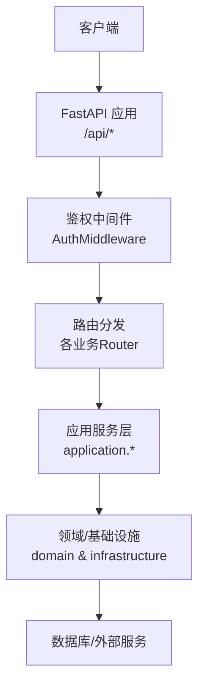
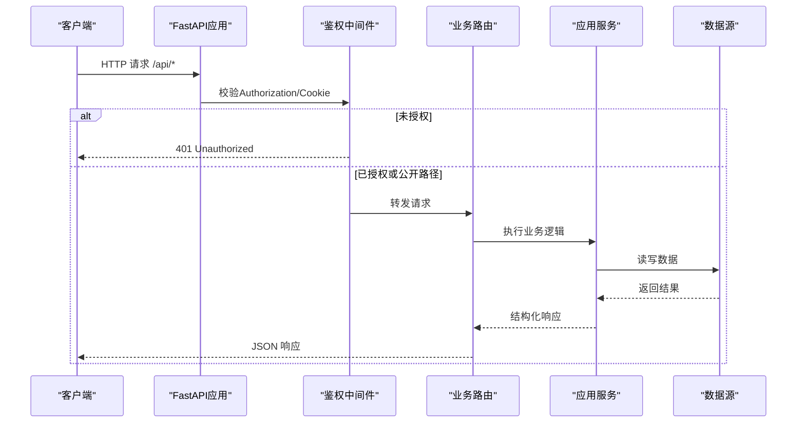
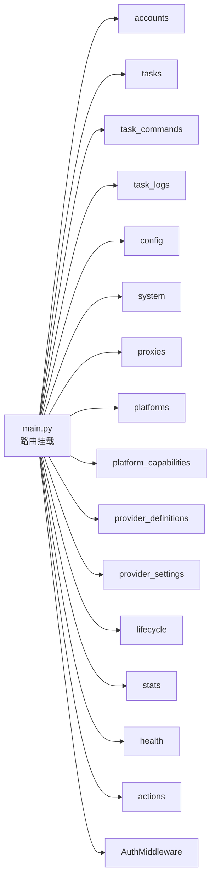

# API参考文档

<cite>
**本文引用的文件**
- [main.py](file://main.py)
- [core/auth.py](file://core/auth.py)
- [api/auth.py](file://api/auth.py)
- [api/accounts.py](file://api/accounts.py)
- [api/tasks.py](file://api/tasks.py)
- [api/task_commands.py](file://api/task_commands.py)
- [api/task_logs.py](file://api/task_logs.py)
- [api/config.py](file://api/config.py)
- [api/system.py](file://api/system.py)
- [api/proxies.py](file://api/proxies.py)
- [api/platforms.py](file://api/platforms.py)
- [api/platform_capabilities.py](file://api/platform_capabilities.py)
- [api/provider_definitions.py](file://api/provider_definitions.py)
- [api/provider_settings.py](file://api/provider_settings.py)
- [api/lifecycle.py](file://api/lifecycle.py)
- [api/stats.py](file://api/stats.py)
- [api/health.py](file://api/health.py)
</cite>

## 目录
1. [简介](#简介)
2. [项目结构](#项目结构)
3. [核心组件](#核心组件)
4. [架构总览](#架构总览)
5. [详细组件分析](#详细组件分析)
6. [依赖关系分析](#依赖关系分析)
7. [性能注意事项](#性能注意事项)
8. [故障排查指南](#故障排查指南)
9. [结论](#结论)
10. [附录](#附录)

## 简介
本API参考文档面向开发者，系统化说明后端提供的RESTful接口。内容涵盖：
- 认证机制（基于环境变量或配置的Bearer Token）
- 按功能模块组织的端点清单与Schema定义
- 请求/响应示例、状态码与错误处理约定
- 常见调用场景与最佳实践
- 可导出的OpenAPI规范建议

所有端点均挂载在统一前缀 /api 下，并通过中间件进行鉴权与健康检查豁免。

## 项目结构
- 路由组织：每个业务域以独立模块提供FastAPI Router，并在主应用中进行聚合挂载。
- 鉴权：通过自定义中间件对 /api 路径进行鉴权，健康检查与认证相关路径公开。
- 启动流程：应用启动时初始化数据库、加载平台与提供者、启动调度器与任务运行时等。

图表来源
- [main.py:67-121](file://main.py#L67-L121)
- [core/auth.py:19-48](file://core/auth.py#L19-L48)

章节来源
- [main.py:67-121](file://main.py#L67-L121)
- [core/auth.py:19-48](file://core/auth.py#L19-L48)

## 核心组件
- 认证中间件：支持 Authorization: Bearer <密码> 或 Cookie _auth=<密码>；/api/health、/api/ready、/api/auth/* 为公开路径。
- 路由聚合：所有业务Router统一挂载到 /api 前缀。
- 生命周期：启动时初始化DB、加载平台与提供者、启动调度器与任务运行时、生命周期管理器。

章节来源
- [core/auth.py:19-48](file://core/auth.py#L19-L48)
- [main.py:67-121](file://main.py#L67-L121)

## 架构总览
下图展示从请求进入鉴权到具体业务处理的流程。

图表来源
- [core/auth.py:19-48](file://core/auth.py#L19-L48)
- [main.py:94-121](file://main.py#L94-L121)

## 详细组件分析

### 认证与账户管理API
- 认证
  - GET /api/auth/check
    - 作用：检查是否需要密码保护
    - 响应：{"required": boolean}
  - POST /api/auth/login
    - 请求体：{ "password": string }
    - 响应：{"ok": boolean, "token": string?}
    - 说明：若未配置密码则直接返回 ok=true；否则需匹配环境密码

- 账号CRUD与导出导入
  - GET /api/accounts
    - 查询参数：platform, status, email, page, page_size
    - 响应：账号列表
  - POST /api/accounts
    - 请求体：AccountCreateRequest（包含 platform, email, password 等）
    - 响应：创建结果
  - GET /api/accounts/{account_id}
    - 响应：账号详情
  - PATCH /api/accounts/{account_id}
    - 请求体：AccountUpdateRequest（可选字段更新）
    - 响应：更新结果
  - DELETE /api/accounts/{account_id}
    - 响应：删除结果
  - GET /api/accounts/export
    - 响应：CSV流式下载
  - POST /api/accounts/export/json | /csv | /sub2api | /cpa | /kiro-go | /any2api
    - 请求体：BatchExportRequest（platform, ids/select_all/status_filter/search_filter）
    - 响应：对应格式的文件流
  - POST /api/accounts/import
    - 请求体：ImportRequest（platform, lines）
    - 响应：导入结果
  - GET /api/accounts/stats
    - 响应：账号统计概览

- 账号有效性生命周期
  - POST /api/lifecycle/check
    - 请求体：CheckRequest（platform, limit）
    - 响应：检测结果
  - POST /api/lifecycle/refresh
    - 请求体：RefreshRequest（platform, limit）
    - 响应：刷新结果
  - POST /api/lifecycle/warn
    - 请求体：WarningRequest（hours）
    - 响应：预警标记结果
  - GET /api/lifecycle/status
    - 响应：生命周期管理器运行状态

章节来源
- [api/auth.py:11-29](file://api/auth.py#L11-L29)
- [api/accounts.py:19-239](file://api/accounts.py#L19-L239)
- [api/lifecycle.py:16-61](file://api/lifecycle.py#L16-L61)

### 任务管理API
- 任务查询
  - GET /api/tasks
    - 查询参数：platform, status, page, page_size
    - 响应：任务列表
  - GET /api/tasks/{task_id}
    - 响应：任务详情
  - GET /api/tasks/{task_id}/events
    - 查询参数：since, limit
    - 响应：事件列表
  - GET /api/tasks/logs
    - 查询参数：platform, page, page_size
    - 响应：日志列表

- 任务命令（注册/取消/日志流）
  - POST /api/tasks/register
    - 请求体：RegisterTaskRequest（platform, email?, password?, count, concurrency, proxy, executor_type, captcha_solver, extra）
    - 响应：任务创建结果
  - POST /api/tasks/{task_id}/cancel
    - 响应：取消结果
  - GET /api/tasks/{task_id}/logs/stream
    - 查询参数：since
    - 响应：SSE 文本流（text/event-stream）

章节来源
- [api/tasks.py:11-29](file://api/tasks.py#L11-L29)
- [api/task_commands.py:17-51](file://api/task_commands.py#L17-L51)
- [api/task_logs.py:11-13](file://api/task_logs.py#L11-L13)

### 平台与能力API
- 平台信息
  - GET /api/platforms
    - 响应：平台列表
  - GET /api/platforms/{platform}/desktop-state
    - 响应：桌面端状态

- 平台能力配置
  - PUT /api/platforms/{name}/capabilities
    - 请求体：任意键值配置对象
    - 响应：更新结果
  - DELETE /api/platforms/{name}/capabilities
    - 响应：重置结果

章节来源
- [api/platforms.py:11-18](file://api/platforms.py#L11-L18)
- [api/platform_capabilities.py:11-18](file://api/platform_capabilities.py#L11-L18)

### 系统管理与健康API
- 健康检查
  - GET /api/health
    - 响应：健康状态
  - GET /api/ready
    - 响应：就绪状态

- 版本与求解器
  - GET /api/version
    - 响应：当前版本、最新版本信息、是否有更新
  - GET /api/solver/status
    - 响应：求解器状态
  - POST /api/solver/restart
    - 响应：重启结果

章节来源
- [api/health.py:11-18](file://api/health.py#L11-L18)
- [api/system.py:71-91](file://api/system.py#L71-L91)

### 代理管理API
- 代理CRUD与批量操作
  - GET /api/proxies
    - 响应：代理列表
  - POST /api/proxies
    - 请求体：ProxyCreateRequest（url, region）
    - 响应：创建结果
  - POST /api/proxies/bulk
    - 请求体：ProxyBulkCreateRequest（proxies[], region）
    - 响应：批量创建结果
  - DELETE /api/proxies/{proxy_id}
    - 响应：删除结果
  - PATCH /api/proxies/{proxy_id}/toggle
    - 响应：启用/禁用切换结果
  - POST /api/proxies/check
    - 响应：触发检测并返回结果

章节来源
- [api/proxies.py:13-60](file://api/proxies.py#L13-L60)

### 平台配置与提供者设置API
- 全局配置
  - GET /api/config
    - 响应：配置项
  - GET /api/config/options
    - 响应：可选项
  - PUT /api/config
    - 请求体：ConfigUpdateRequest（data: dict[str,str]）
    - 响应：更新结果

- 提供者定义
  - GET /api/provider-definitions
    - 查询参数：provider_type, enabled_only
    - 响应：定义列表
  - GET /api/provider-definitions/drivers
    - 查询参数：provider_type
    - 响应：驱动模板列表
  - POST /api/provider-definitions
  - PUT /api/provider-definitions
    - 请求体：ProviderDefinitionUpsertRequest
    - 响应：保存结果
  - DELETE /api/provider-definitions/{definition_id}
    - 响应：删除结果

- 提供者设置
  - GET /api/provider-settings
    - 查询参数：provider_type
    - 响应：设置列表
  - POST /api/provider-settings
  - PUT /api/provider-settings
    - 请求体：ProviderSettingUpsertRequest
    - 响应：保存结果
  - DELETE /api/provider-settings/{setting_id}
    - 响应：删除结果
  - POST /api/provider-settings/test
    - 请求体：ProviderTestRequest（provider_type, provider_key, config, auth）
    - 响应：测试邮箱可用性结果

章节来源
- [api/config.py:12-28](file://api/config.py#L12-L28)
- [api/provider_definitions.py:12-53](file://api/provider_definitions.py#L12-L53)
- [api/provider_settings.py:12-120](file://api/provider_settings.py#L12-L120)

### 统计与仪表盘API
- 概览
  - GET /api/stats/overview
    - 响应：总注册数、成功率、账号状态分布、账号总数
- 按平台
  - GET /api/stats/by-platform
    - 响应：各平台成功/失败/总数/成功率
- 按天趋势
  - GET /api/stats/by-day
    - 查询参数：days, platform
    - 响应：每日统计
- 代理排行
  - GET /api/stats/by-proxy
    - 响应：代理成功率排行
- 错误聚合
  - GET /api/stats/errors
    - 查询参数：days, platform, limit
    - 响应：最近失败错误聚合

章节来源
- [api/stats.py:18-152](file://api/stats.py#L18-L152)

### 动作执行API
- 列出动作与能力
  - GET /api/actions/{platform}
    - 响应：可用动作列表
  - GET /api/actions/{platform}/capabilities
    - 响应：能力列表
- 执行动作
  - POST /api/actions/{platform}/{account_id}/{action_id}
    - 请求体：ActionRequest（params: dict）
    - 响应：任务ID或执行结果

章节来源
- [api/actions.py:13-40](file://api/actions.py#L13-L40)

## 依赖关系分析
- 路由挂载：所有业务Router在应用启动时通过 include_router 挂载至 /api。
- 鉴权：AuthMiddleware 对所有 /api 路径生效，但 /api/health、/api/ready、/api/auth/* 为公开路径。
- 服务层：各Router调用 application.* 中的服务类，进一步访问 domain 与 infrastructure 层。

图表来源
- [main.py:94-121](file://main.py#L94-L121)
- [core/auth.py:19-48](file://core/auth.py#L19-L48)

章节来源
- [main.py:94-121](file://main.py#L94-L121)
- [core/auth.py:19-48](file://core/auth.py#L19-L48)

## 性能注意事项
- 流式导出：账号导出使用 StreamingResponse 降低内存占用，适合大批量数据。
- 缓存策略：版本信息拉取采用本地缓存与TTL，避免频繁调用外部API。
- SSE日志流：任务日志流式推送减少轮询开销。
- 分页与限制：列表接口普遍支持分页与限制，合理设置 page_size 避免过大负载。

[本节为通用指导，不直接分析具体文件]

## 故障排查指南
- 401 未授权
  - 原因：缺少或错误的 Authorization: Bearer <密码> 或 Cookie _auth
  - 解决：确保已正确设置 APP_PASSWORD 或在登录成功后携带 token
- 404 资源不存在
  - 账号/任务/代理/提供者设置等删除或获取时可能返回，检查ID是否正确
- 400 参数错误
  - 导出/导入/提供者测试等接口在参数不合法时返回，核对请求体字段
- 健康检查
  - 使用 /api/health 与 /api/ready 确认服务状态

章节来源
- [core/auth.py:19-48](file://core/auth.py#L19-L48)
- [api/accounts.py:217-239](file://api/accounts.py#L217-L239)
- [api/tasks.py:16-29](file://api/tasks.py#L16-L29)
- [api/proxies.py:41-54](file://api/proxies.py#L41-L54)
- [api/provider_settings.py:30-51](file://api/provider_settings.py#L30-L51)
- [api/health.py:11-18](file://api/health.py#L11-L18)

## 结论
本API文档覆盖了账户管理、任务管理、平台配置、系统管理、代理管理等核心模块的REST接口。通过统一的鉴权中间件与清晰的路由组织，提供了稳定易用的自动化注册与管理能力。建议结合OpenAPI规范生成工具导出完整接口描述，便于前端与第三方集成。

[本节为总结性内容，不直接分析具体文件]

## 附录

### 认证机制说明
- 方式一：请求头 Authorization: Bearer <密码>
- 方式二：Cookie _auth=<密码>
- 公开路径：/api/health、/api/ready、/api/auth/*
- 密码来源：环境变量 APP_PASSWORD 或配置项 app_password

章节来源
- [core/auth.py:1-48](file://core/auth.py#L1-L48)
- [api/auth.py:11-29](file://api/auth.py#L11-L29)

### 常见请求/响应Schema定义
- AccountCreateRequest
  - 字段：platform(string), email(string), password(string), user_id(string), lifecycle_status(string), overview(dict), credentials(dict), provider_accounts(list[dict]), provider_resources(list[dict]), primary_token(string), cashier_url(string), region(string), trial_end_time(int)
- AccountUpdateRequest
  - 字段：password?(string), user_id?(string), lifecycle_status?(string), overview?(dict), credentials?(dict), provider_accounts?(list[dict]), provider_resources?(list[dict]), replace_provider_accounts(bool), replace_provider_resources(bool), primary_token?(string), cashier_url?(string), region?(string), trial_end_time?(int)
- ImportRequest
  - 字段：platform(string), lines(list[string])
- BatchExportRequest
  - 字段：platform(string), ids(list[int]), select_all(bool), status_filter?(string), email_service_filter?(string), search_filter?(string)
- RegisterTaskRequest
  - 字段：platform(string), email?(string), password?(string), count(int), concurrency(int), proxy?(string), executor_type(string), captcha_solver(string), extra(dict)
- ProxyCreateRequest / ProxyBulkCreateRequest
  - 字段：url(string), region(string); proxies(list[string]), region(string)
- ProviderDefinitionUpsertRequest
  - 字段：id?(int), provider_type(string), provider_key(string), label(string), description(string), driver_type(string), enabled(bool), default_auth_mode(string), metadata(dict)
- ProviderSettingUpsertRequest
  - 字段：id?(int), provider_type(string), provider_key(string), display_name(string), auth_mode(string), enabled(bool), is_default(bool), config(dict[str,string]), auth(dict[str,string]), metadata(dict)
- ProviderTestRequest
  - 字段：provider_type(string), provider_key(string), config(dict[str,string]), auth(dict[str,string])
- ActionRequest
  - 字段：params(dict)

章节来源
- [api/accounts.py:19-63](file://api/accounts.py#L19-L63)
- [api/task_commands.py:17-27](file://api/task_commands.py#L17-L27)
- [api/proxies.py:13-21](file://api/proxies.py#L13-L21)
- [api/provider_definitions.py:12-22](file://api/provider_definitions.py#L12-L22)
- [api/provider_settings.py:12-23](file://api/provider_settings.py#L12-L23)
- [api/actions.py:13-15](file://api/actions.py#L13-L15)

### 常见调用场景与最佳实践
- 首次登录与鉴权
  - 调用 /api/auth/check 判断是否启用密码保护
  - 调用 /api/auth/login 获取 token，后续请求携带 Authorization: Bearer <token>
- 批量注册
  - 使用 /api/tasks/register 提交注册任务，支持并发与代理选择
  - 通过 /api/tasks/{task_id}/logs/stream 实时查看执行日志
- 账号导出
  - 根据筛选条件调用 /api/accounts/export/* 导出不同格式文件
- 提供者配置验证
  - 使用 /api/provider-settings/test 快速验证邮箱等提供者配置

[本节为通用指导，不直接分析具体文件]

### OpenAPI规范导出建议
- 可使用 FastAPI 内置的 OpenAPI 模式生成接口文档与JSON/YAML规范文件
- 将生成的规范文件用于Postman集合导入或代码生成

[本节为通用指导，不直接分析具体文件]