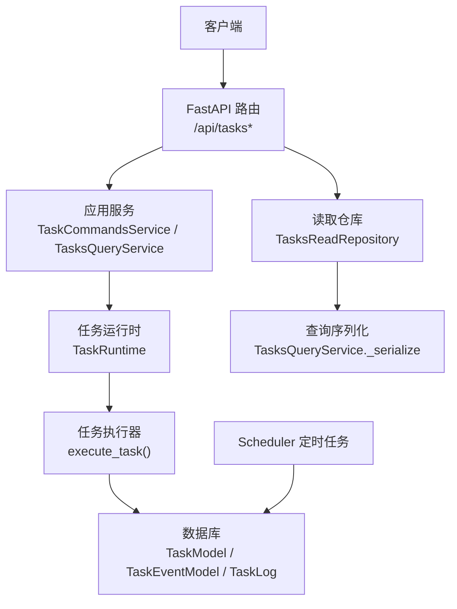
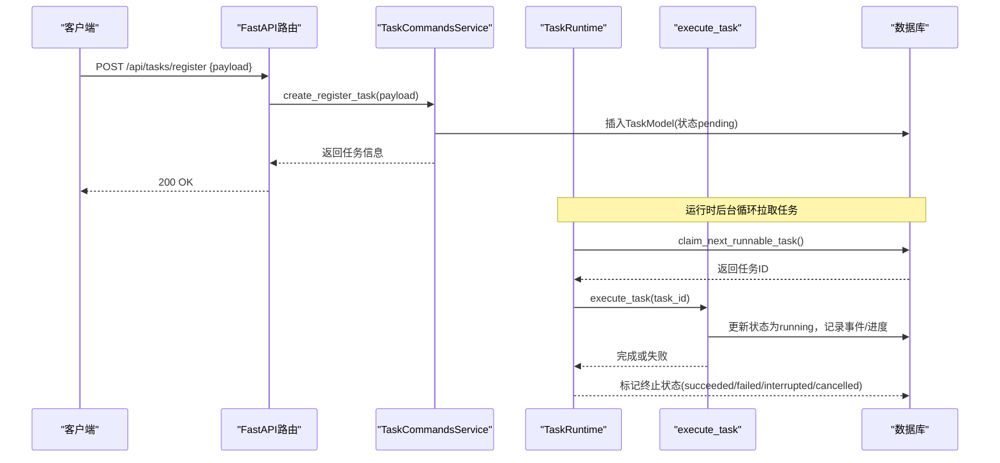
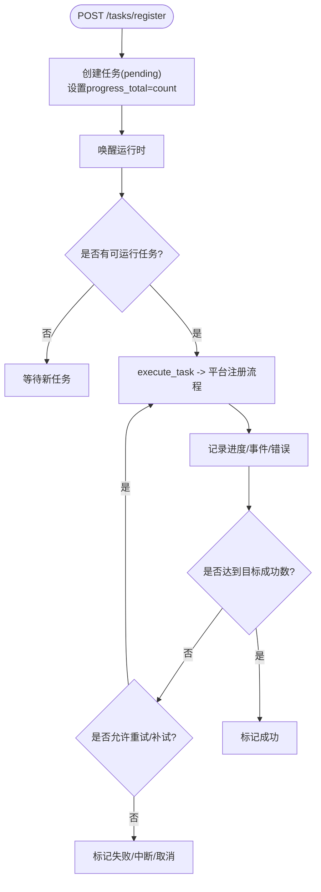
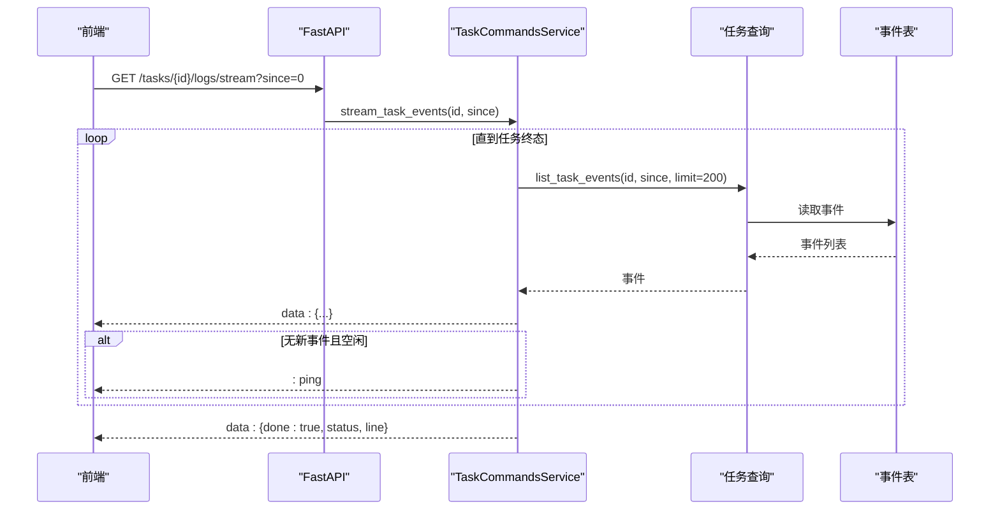
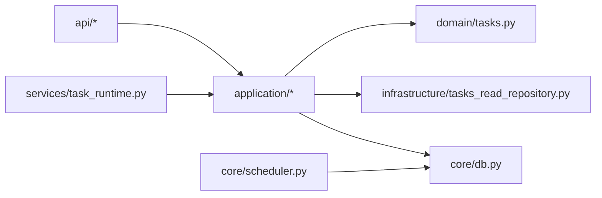

# 任务管理API

<cite>
**本文引用的文件**
- [main.py](file://main.py)
- [api/tasks.py](file://api/tasks.py)
- [api/task_commands.py](file://api/task_commands.py)
- [api/task_logs.py](file://api/task_logs.py)
- [application/tasks.py](file://application/tasks.py)
- [application/task_commands.py](file://application/task_commands.py)
- [application/tasks_query.py](file://application/tasks_query.py)
- [domain/tasks.py](file://domain/tasks.py)
- [core/db.py](file://core/db.py)
- [services/task_runtime.py](file://services/task_runtime.py)
- [infrastructure/tasks_read_repository.py](file://infrastructure/tasks_read_repository.py)
- [core/scheduler.py](file://core/scheduler.py)
</cite>

## 目录
1. [简介](#简介)
2. [项目结构](#项目结构)
3. [核心组件](#核心组件)
4. [架构总览](#架构总览)
5. [详细组件分析](#详细组件分析)
6. [依赖关系分析](#依赖关系分析)
7. [性能与并发](#性能与并发)
8. [故障排查指南](#故障排查指南)
9. [结论](#结论)
10. [附录：接口清单与使用示例](#附录接口清单与使用示例)

## 简介
本文件面向“任务管理API”的完整说明，覆盖任务创建、执行、监控、日志查询等核心能力。重点包括：
- 任务提交格式（注册任务）与执行参数配置
- 状态查询机制与实时日志获取方式（SSE）
- 任务生命周期管理、并发控制、错误重试策略
- 任务调度相关接口的使用示例（异步执行、进度监控、结果获取）
- 任务队列管理机制、性能调优参数与故障排查方法

## 项目结构
任务管理API由FastAPI路由层、应用服务层、领域模型、基础设施与运行时调度组成。关键路径如下：
- API路由：/api/tasks、/api/tasks/register、/api/tasks/logs、/api/tasks/{task_id}/logs/stream
- 应用服务：任务创建、取消、事件流、查询序列化
- 领域模型：TaskSummary、TaskEvent、TaskProgress
- 数据持久化：SQLModel模型（TaskModel、TaskEventModel、TaskLog）
- 运行时：TaskRuntime线程池调度、claim_next_runnable_task任务抢占
- 调度器：Scheduler定时任务（账号有效性检测、trial到期检查）

图表来源
- [main.py:67-121](file://main.py#L67-L121)
- [api/tasks.py:7-29](file://api/tasks.py#L7-L29)
- [api/task_commands.py:12-50](file://api/task_commands.py#L12-L50)
- [application/tasks.py:174-240](file://application/tasks.py#L174-L240)
- [services/task_runtime.py:18-101](file://services/task_runtime.py#L18-L101)
- [core/db.py:229-288](file://core/db.py#L229-L288)
- [core/scheduler.py:19-64](file://core/scheduler.py#L19-L64)

章节来源
- [main.py:67-121](file://main.py#L67-L121)
- [api/tasks.py:7-29](file://api/tasks.py#L7-L29)
- [api/task_commands.py:12-50](file://api/task_commands.py#L12-L50)
- [application/tasks.py:174-240](file://application/tasks.py#L174-L240)
- [services/task_runtime.py:18-101](file://services/task_runtime.py#L18-L101)
- [core/db.py:229-288](file://core/db.py#L229-L288)
- [core/scheduler.py:19-64](file://core/scheduler.py#L19-L64)

## 核心组件
- 路由层
  - /api/tasks：任务列表、详情、事件分页
  - /api/tasks/register：创建注册任务
  - /api/tasks/{task_id}/cancel：请求取消任务
  - /api/tasks/{task_id}/logs/stream：SSE实时事件流
  - /api/tasks/logs：按平台分页查询任务日志
- 应用服务
  - TaskCommandsService：创建注册任务、取消任务、SSE事件流
  - TasksQueryService：任务与事件的查询与序列化
- 领域模型
  - TaskSummary、TaskEvent、TaskProgress
- 数据模型
  - TaskModel、TaskEventModel、TaskLog
- 运行时与调度
  - TaskRuntime：线程池式任务调度，支持最大并行数与每平台并行度限制
  - Scheduler：周期性任务（如trial到期检查、账号有效性批量检测）

章节来源
- [api/tasks.py:7-29](file://api/tasks.py#L7-L29)
- [api/task_commands.py:17-50](file://api/task_commands.py#L17-L50)
- [api/task_logs.py:7-13](file://api/task_logs.py#L7-L13)
- [application/task_commands.py:20-76](file://application/task_commands.py#L20-L76)
- [application/tasks_query.py:7-68](file://application/tasks_query.py#L7-L68)
- [domain/tasks.py:8-44](file://domain/tasks.py#L8-L44)
- [core/db.py:229-288](file://core/db.py#L229-L288)
- [services/task_runtime.py:18-101](file://services/task_runtime.py#L18-L101)
- [core/scheduler.py:19-64](file://core/scheduler.py#L19-L64)

## 架构总览
任务从API进入后，经应用服务写入数据库并唤醒运行时；运行时以线程池形式拉取可运行任务并执行；执行过程中通过TaskLogger记录事件与进度；前端可通过SSE订阅实时事件，或通过REST轮询任务状态与日志。

图表来源
- [api/task_commands.py:29-31](file://api/task_commands.py#L29-L31)
- [application/task_commands.py:21-24](file://application/task_commands.py#L21-L24)
- [application/tasks.py:174-208](file://application/tasks.py#L174-L208)
- [services/task_runtime.py:47-85](file://services/task_runtime.py#L47-L85)
- [application/tasks.py:570-595](file://application/tasks.py#L570-L595)

## 详细组件分析

### 任务创建与执行（注册任务）
- 接口：POST /api/tasks/register
- 请求体字段（RegisterTaskRequest）
  - platform：目标平台名称（必填）
  - email/password：可选，用于指定邮箱与密码
  - count：本次要创建的账号数量（默认1）
  - concurrency：并发度（默认1，内部会限制到count与5的最小值）
  - proxy：代理地址（可选）
  - executor_type：执行器类型（默认protocol）
  - captcha_solver：验证码求解器（默认auto）
  - extra：扩展配置（字典），包含邮箱提供商、短信提供商、CPA上传、Windsurf支付链接等开关与参数
- 行为
  - 创建TaskModel，初始状态为pending，progress_total=count
  - 唤醒TaskRuntime进行调度
  - 运行时从队列中抢占任务，设置claimed/running，开始执行
  - 执行器根据platform动态加载平台插件，构造RegisterConfig并执行注册流程
  - 成功时保存账户、记录成功计数、追加cashier_urls（如有）、自动推送Any2API/CPA（若启用）
  - 失败时记录错误、重试策略受HeroSMS模式影响（见下节）

图表来源
- [api/task_commands.py:17-31](file://api/task_commands.py#L17-L31)
- [application/tasks.py:174-208](file://application/tasks.py#L174-L208)
- [application/tasks.py:692-800](file://application/tasks.py#L692-L800)
- [services/task_runtime.py:47-85](file://services/task_runtime.py#L47-L85)

章节来源
- [api/task_commands.py:17-31](file://api/task_commands.py#L17-L31)
- [application/tasks.py:174-208](file://application/tasks.py#L174-L208)
- [application/tasks.py:692-800](file://application/tasks.py#L692-L800)
- [services/task_runtime.py:47-85](file://services/task_runtime.py#L47-L85)

### 任务取消
- 接口：POST /api/tasks/{task_id}/cancel
- 行为
  - 将任务状态置为cancel_requested（若尚未到达终态）
  - 若任务在pending阶段，直接置为cancelled并结束
  - 执行器在执行过程中会检查取消标志，必要时中止后续步骤

章节来源
- [api/task_commands.py:34-39](file://api/task_commands.py#L34-L39)
- [application/tasks.py:318-338](file://application/tasks.py#L318-L338)
- [application/tasks.py:393-396](file://application/tasks.py#L393-L396)

### 任务查询与事件
- 接口
  - GET /api/tasks：分页列出任务，支持platform/status过滤
  - GET /api/tasks/{task_id}：获取任务详情
  - GET /api/tasks/{task_id}/events：分页获取任务事件
- 行为
  - 通过TasksQueryService与TasksReadRepository读取并序列化
  - 事件包含id、type、level、message、line、detail、created_at

章节来源
- [api/tasks.py:11-29](file://api/tasks.py#L11-L29)
- [application/tasks_query.py:17-41](file://application/tasks_query.py#L17-L41)
- [infrastructure/tasks_read_repository.py:46-57](file://infrastructure/tasks_read_repository.py#L46-L57)

### 实时日志（SSE）
- 接口：GET /api/tasks/{task_id}/logs/stream?since=0
- 行为
  - 基于Server-Sent Events持续推送事件
  - 首次发送retry与connected提示
  - 每次拉取任务事件并增量推进cursor
  - 当任务进入终态（succeeded/failed/interrupted/cancelled）时发送done消息并关闭连接
  - 空闲时发送ping心跳，避免中间设备断开连接

图表来源
- [api/task_commands.py:42-50](file://api/task_commands.py#L42-L50)
- [application/task_commands.py:32-76](file://application/task_commands.py#L32-L76)
- [application/tasks.py:267-278](file://application/tasks.py#L267-L278)

章节来源
- [api/task_commands.py:42-50](file://api/task_commands.py#L42-L50)
- [application/task_commands.py:32-76](file://application/task_commands.py#L32-L76)
- [application/tasks.py:267-278](file://application/tasks.py#L267-L278)

### 任务日志查询
- 接口：GET /api/tasks/logs?page=1&page_size=50&platform=xxx
- 行为
  - 按平台分页查询TaskLog（成功/失败记录），便于审计与排错

章节来源
- [api/task_logs.py:7-13](file://api/task_logs.py#L7-L13)
- [application/tasks.py:101-112](file://application/tasks.py#L101-L112)

### 任务生命周期与状态机
- 状态定义
  - pending、claimed、running、succeeded、failed、interrupted、cancel_requested、cancelled
- 转换规则
  - 创建后为pending
  - 被运行时抢占后为claimed，随后立即转为running
  - 成功/失败/中断/取消分别进入对应终态
  - 服务重启会将非终态任务标记为interrupted并记录事件

章节来源
- [application/tasks.py:31-50](file://application/tasks.py#L31-L50)
- [application/tasks.py:296-316](file://application/tasks.py#L296-L316)
- [application/tasks.py:318-338](file://application/tasks.py#L318-L338)
- [application/tasks.py:443-457](file://application/tasks.py#L443-L457)

### 并发控制与队列机制
- 运行时并发
  - max_parallel_tasks：全局最大并发任务数（默认3）
  - max_parallel_per_platform：单平台最大并发（默认1）
  - poll_interval：轮询间隔（默认0.5秒）
- 任务抢占
  - claim_next_runnable_task按创建时间顺序挑选pending任务，考虑平台并发与账户占用键
- 账户级互斥
  - 对account_check/platform_action类任务，通过account_keys集合避免同一账户同时被多个任务处理

章节来源
- [services/task_runtime.py:18-26](file://services/task_runtime.py#L18-L26)
- [services/task_runtime.py:47-85](file://services/task_runtime.py#L47-L85)
- [application/tasks.py:340-368](file://application/tasks.py#L340-L368)

### 错误重试策略
- 通用策略
  - 每个注册尝试独立记录success/error计数与错误列表
  - 异常会被捕获并记录，不会中断整个任务
- HeroSMS增强模式
  - 当启用herosms且配置了register_reuse_phone_to_max时，可在失败后继续尝试复用号码，最多额外成功hero_extra_max个
  - 此时progress_total会相应扩大，确保进度准确
- 代理健康
  - 成功/失败会向proxy_pool报告，辅助后续选择更健康的代理

章节来源
- [application/tasks.py:598-614](file://application/tasks.py#L598-L614)
- [application/tasks.py:692-800](file://application/tasks.py#L692-L800)
- [application/tasks.py:750-789](file://application/tasks.py#L750-L789)

### 任务调度（定时任务）
- Scheduler
  - 每小时检查trial到期账号，更新lifecycle_status为expired
  - 提供批量账号有效性检测方法check_accounts_valid，可按平台筛选

章节来源
- [core/scheduler.py:19-64](file://core/scheduler.py#L19-L64)
- [core/scheduler.py:65-111](file://core/scheduler.py#L65-L111)

## 依赖关系分析
- API路由依赖应用服务
- 应用服务依赖领域模型与基础设施仓库
- 运行时依赖任务执行逻辑与数据库
- 调度器独立于任务运行时，负责周期性维护

图表来源
- [main.py:104-121](file://main.py#L104-L121)
- [application/tasks_query.py:1-68](file://application/tasks_query.py#L1-L68)
- [infrastructure/tasks_read_repository.py:1-57](file://infrastructure/tasks_read_repository.py#L1-L57)
- [core/db.py:229-288](file://core/db.py#L229-L288)
- [services/task_runtime.py:18-101](file://services/task_runtime.py#L18-L101)
- [core/scheduler.py:19-111](file://core/scheduler.py#L19-L111)

章节来源
- [main.py:104-121](file://main.py#L104-L121)
- [application/tasks_query.py:1-68](file://application/tasks_query.py#L1-L68)
- [infrastructure/tasks_read_repository.py:1-57](file://infrastructure/tasks_read_repository.py#L1-L57)
- [core/db.py:229-288](file://core/db.py#L229-L288)
- [services/task_runtime.py:18-101](file://services/task_runtime.py#L18-L101)
- [core/scheduler.py:19-111](file://core/scheduler.py#L19-L111)

## 性能与并发
- 建议参数
  - max_parallel_tasks：根据CPU与IO负载调整，默认3
  - max_parallel_per_platform：单平台并发建议保持较低，避免平台限流
  - poll_interval：降低可减少数据库压力，但会增加任务启动延迟
- 数据库
  - SQLite适合单机轻量场景；高并发建议迁移至PostgreSQL/MySQL
- 网络
  - SSE需保证代理/网关不缓冲响应（已设置no-cache与X-Accel-Buffering:no）
- 代理池
  - 合理配置代理成功率权重，减少失败重试带来的抖动

[本节为通用指导，无需特定文件引用]

## 故障排查指南
- 任务未执行
  - 检查TaskRuntime是否启动（服务启动时会调用start）
  - 查看任务状态是否为pending/claimed/running
  - 确认claim_next_runnable_task是否能找到任务（平台并发限制、账户占用）
- 任务卡住
  - 检查是否存在cancel_requested状态但未退出
  - 查看SSE事件中的错误信息与进度
- 注册失败
  - 查看TaskLog与任务errors列表
  - 检查代理、邮箱、短信提供商配置
  - 若启用HeroSMS，确认extra配置与手机号复用策略
- 服务重启后任务中断
  - 非终态任务会被标记为interrupted，需重新调度或人工干预

章节来源
- [main.py:67-89](file://main.py#L67-L89)
- [application/tasks.py:296-316](file://application/tasks.py#L296-L316)
- [application/tasks.py:318-338](file://application/tasks.py#L318-L338)
- [application/tasks.py:750-789](file://application/tasks.py#L750-L789)

## 结论
该任务管理API提供了完整的任务生命周期管理能力，涵盖创建、执行、监控、日志与取消。通过线程池运行时实现可控并发，结合SSE提供实时事件流，满足异步任务的端到端观测需求。配合Scheduler可进行周期性维护。生产环境建议关注并发参数、数据库选型与代理池健康，以提升稳定性与吞吐。

[本节为总结性内容，无需特定文件引用]

## 附录：接口清单与使用示例

### 接口清单
- 任务操作
  - POST /api/tasks/register：创建注册任务
  - POST /api/tasks/{task_id}/cancel：请求取消任务
- 任务查询
  - GET /api/tasks：分页列出任务
  - GET /api/tasks/{task_id}：获取任务详情
  - GET /api/tasks/{task_id}/events：分页获取事件
- 日志
  - GET /api/tasks/logs：分页查询任务日志
  - GET /api/tasks/{task_id}/logs/stream：SSE实时事件流

章节来源
- [api/task_commands.py:17-50](file://api/task_commands.py#L17-L50)
- [api/tasks.py:11-29](file://api/tasks.py#L11-L29)
- [api/task_logs.py:7-13](file://api/task_logs.py#L7-L13)

### 使用示例（概念流程）
- 异步执行注册任务
  - 调用POST /api/tasks/register，传入platform、count、concurrency等参数
  - 返回任务信息，包含task_id与初始状态
- 监控任务进度
  - 轮询GET /api/tasks/{task_id}，观察status与progress_detail
  - 或使用SSE GET /api/tasks/{task_id}/logs/stream接收实时事件
- 获取执行结果
  - 任务完成后，查看result.data、cashier_urls、errors等字段
  - 如需审计，查询GET /api/tasks/logs

章节来源
- [api/task_commands.py:29-50](file://api/task_commands.py#L29-L50)
- [application/task_commands.py:32-76](file://application/task_commands.py#L32-L76)
- [application/tasks_query.py:17-68](file://application/tasks_query.py#L17-L68)