# 平台配置API

<cite>
**本文引用的文件**
- [api/platforms.py](file://api/platforms.py)
- [api/platform_capabilities.py](file://api/platform_capabilities.py)
- [api/provider_definitions.py](file://api/provider_definitions.py)
- [application/platforms.py](file://application/platforms.py)
- [application/platform_capabilities.py](file://application/platform_capabilities.py)
- [application/provider_definitions.py](file://application/provider_definitions.py)
- [infrastructure/platform_runtime.py](file://infrastructure/platform_runtime.py)
- [infrastructure/platform_caps_repository.py](file://infrastructure/platform_caps_repository.py)
- [core/base_platform.py](file://core/base_platform.py)
- [core/registry.py](file://core/registry.py)
- [core/capability_registry.py](file://core/capability_registry.py)
- [domain/platform_caps.py](file://domain/platform_caps.py)
- [platforms/chatgpt/plugin.py](file://platforms/chatgpt/plugin.py)
- [core/registration/flows.py](file://core/registration/flows.py)
</cite>

## 目录
1. [简介](#简介)
2. [项目结构](#项目结构)
3. [核心组件](#核心组件)
4. [架构总览](#架构总览)
5. [详细组件分析](#详细组件分析)
6. [依赖关系分析](#依赖关系分析)
7. [性能考虑](#性能考虑)
8. [故障排查指南](#故障排查指南)
9. [结论](#结论)
10. [附录](#附录)

## 简介
本文件面向“平台配置API”，覆盖以下能力：
- 平台列表查询与桌面状态探测
- 平台能力检测与动态覆盖（执行模式、身份模式、OAuth提供商、能力清单）
- 注册参数配置与提供商定义管理（如验证码、邮箱、代理等）
- 平台扩展开发指南（如何为新平台添加支持、配置验证规则、执行器选择逻辑）
- 平台兼容性检查与版本管理相关接口
- 动态配置加载与插件发现机制的API说明

该API基于FastRouter路由层，通过应用服务层调用基础设施层，最终由核心平台基类与注册表完成能力装配与运行时行为。

## 项目结构
围绕平台配置的API主要分布在三层：
- API路由层：暴露HTTP端点，负责请求解析与响应封装
- 应用服务层：编排业务逻辑，组装数据模型
- 基础设施与核心层：提供平台运行时、能力仓库、注册表、能力定义与平台基类

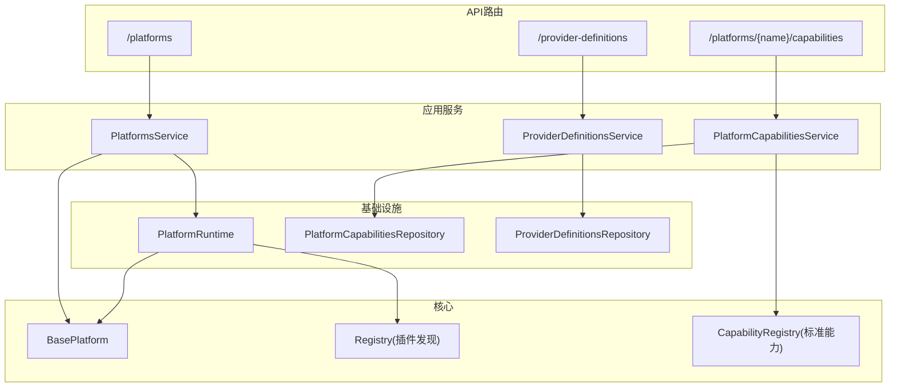

图示来源
- [api/platforms.py:11-18](file://api/platforms.py#L11-L18)
- [api/platform_capabilities.py:11-18](file://api/platform_capabilities.py#L11-L18)
- [api/provider_definitions.py:24-52](file://api/provider_definitions.py#L24-L52)
- [application/platforms.py:57-80](file://application/platforms.py#L57-L80)
- [application/platform_capabilities.py:7-24](file://application/platform_capabilities.py#L7-L24)
- [application/provider_definitions.py:6-53](file://application/provider_definitions.py#L6-L53)
- [infrastructure/platform_runtime.py:221-276](file://infrastructure/platform_runtime.py#L221-L276)
- [infrastructure/platform_caps_repository.py:12-53](file://infrastructure/platform_caps_repository.py#L12-L53)
- [core/base_platform.py:44-75](file://core/base_platform.py#L44-L75)
- [core/registry.py:25-38](file://core/registry.py#L25-L38)
- [core/capability_registry.py:27-132](file://core/capability_registry.py#L27-L132)

章节来源
- [api/platforms.py:1-19](file://api/platforms.py#L1-L19)
- [api/platform_capabilities.py:1-19](file://api/platform_capabilities.py#L1-L19)
- [api/provider_definitions.py:1-53](file://api/provider_definitions.py#L1-L53)

## 核心组件
- 平台列表与桌面状态
  - 列出所有已注册平台及其能力选项（执行器、身份模式、OAuth提供商），并返回桌面应用状态
- 平台能力管理
  - 更新或重置某平台的执行器、身份模式、OAuth提供商及能力清单
- 提供商定义管理
  - 增删改查第三方提供商（如验证码、邮箱、代理）的定义与模板
- 平台运行时
  - 加载插件、构建平台实例、执行动作、持久化账号摘要与凭据
- 平台基类与能力系统
  - 统一注册流程、执行器选择、验证码解决器选择、能力映射与默认处理

章节来源
- [application/platforms.py:57-80](file://application/platforms.py#L57-L80)
- [application/platform_capabilities.py:7-24](file://application/platform_capabilities.py#L7-L24)
- [application/provider_definitions.py:6-53](file://application/provider_definitions.py#L6-L53)
- [infrastructure/platform_runtime.py:221-331](file://infrastructure/platform_runtime.py#L221-L331)
- [core/base_platform.py:44-75](file://core/base_platform.py#L44-L75)
- [core/capability_registry.py:27-132](file://core/capability_registry.py#L27-L132)

## 架构总览
平台配置API的请求路径与内部调用链如下：

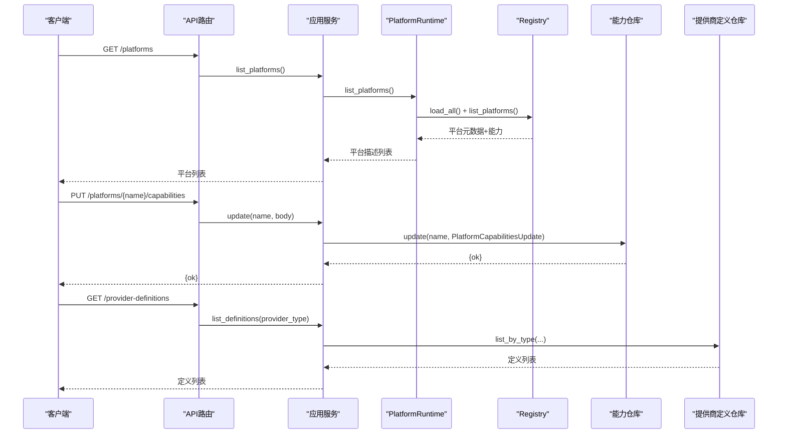

图示来源
- [api/platforms.py:11-18](file://api/platforms.py#L11-L18)
- [api/platform_capabilities.py:11-18](file://api/platform_capabilities.py#L11-L18)
- [api/provider_definitions.py:24-31](file://api/provider_definitions.py#L24-L31)
- [application/platforms.py:61-77](file://application/platforms.py#L61-L77)
- [application/platform_capabilities.py:14-21](file://application/platform_capabilities.py#L14-L21)
- [application/provider_definitions.py:10-14](file://application/provider_definitions.py#L10-L14)
- [infrastructure/platform_runtime.py:222-238](file://infrastructure/platform_runtime.py#L222-L238)
- [infrastructure/platform_caps_repository.py:22-42](file://infrastructure/platform_caps_repository.py#L22-L42)
- [core/registry.py:25-38](file://core/registry.py#L25-L38)

## 详细组件分析

### 平台列表与桌面状态API
- 功能
  - 列出所有平台：名称、显示名、版本、支持的执行器/身份模式/OAuth提供商，以及对应的可选项标签
  - 获取指定平台的桌面应用状态（如是否安装、运行、就绪）
- 关键实现
  - 路由层将请求转发至 PlatformsService
  - 服务层通过 PlatformRuntime 获取平台描述，并附加能力选项
  - 桌面状态由具体平台实现 get_desktop_state 返回

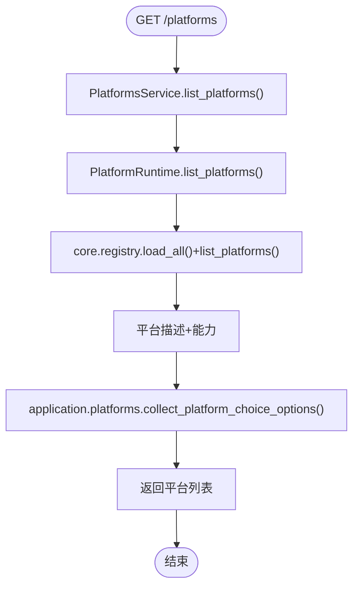

图示来源
- [api/platforms.py:11-18](file://api/platforms.py#L11-L18)
- [application/platforms.py:36-77](file://application/platforms.py#L36-L77)
- [infrastructure/platform_runtime.py:222-238](file://infrastructure/platform_runtime.py#L222-L238)
- [core/registry.py:25-38](file://core/registry.py#L25-L38)

章节来源
- [api/platforms.py:11-18](file://api/platforms.py#L11-L18)
- [application/platforms.py:57-80](file://application/platforms.py#L57-L80)

### 平台能力检测与动态覆盖API
- 功能
  - 更新某平台的能力集合：supported_executors、supported_identity_modes、supported_oauth_providers、capabilities
  - 重置某平台的能力覆盖为默认值
- 关键实现
  - 路由接收 name 与 body，转换为 PlatformCapabilitiesUpdate 并写入仓库
  - 仓库校验允许字段后持久化；读取时由 registry 合并类默认值与数据库覆盖

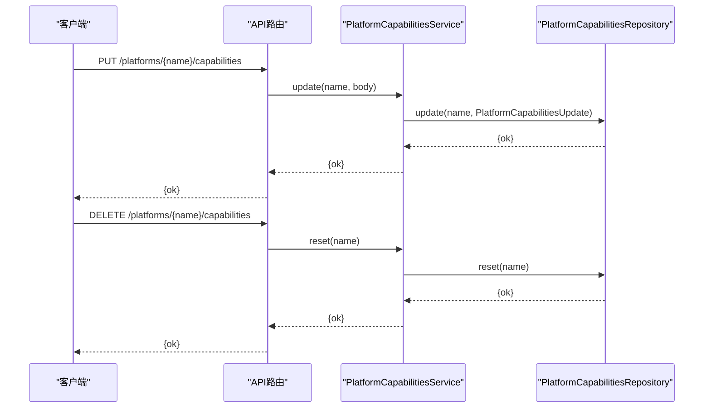

图示来源
- [api/platform_capabilities.py:11-18](file://api/platform_capabilities.py#L11-L18)
- [application/platform_capabilities.py:14-24](file://application/platform_capabilities.py#L14-L24)
- [infrastructure/platform_caps_repository.py:22-53](file://infrastructure/platform_caps_repository.py#L22-L53)
- [core/registry.py:51-107](file://core/registry.py#L51-L107)

章节来源
- [api/platform_capabilities.py:11-18](file://api/platform_capabilities.py#L11-L18)
- [application/platform_capabilities.py:7-24](file://application/platform_capabilities.py#L7-L24)
- [infrastructure/platform_caps_repository.py:12-53](file://infrastructure/platform_caps_repository.py#L12-L53)
- [core/registry.py:51-107](file://core/registry.py#L51-L107)

### 提供商定义管理API
- 功能
  - 列出某类型提供商定义（如 captcha、mailbox、proxy）
  - 列出驱动模板
  - 创建/更新/删除提供商定义
- 关键实现
  - 路由层使用 ProviderDefinitionsService 调用仓库进行CRUD
  - 序列化输出包含字段、认证模式、分类、元数据等

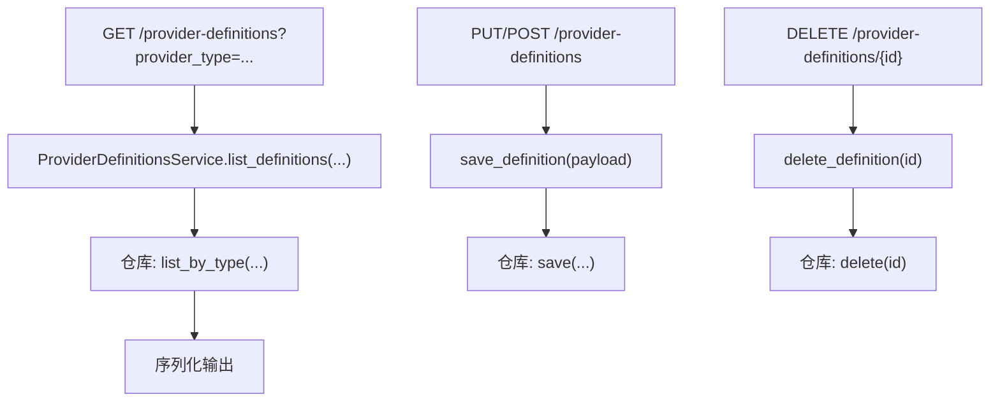

图示来源
- [api/provider_definitions.py:24-52](file://api/provider_definitions.py#L24-L52)
- [application/provider_definitions.py:10-35](file://application/provider_definitions.py#L10-L35)

章节来源
- [api/provider_definitions.py:24-52](file://api/provider_definitions.py#L24-L52)
- [application/provider_definitions.py:6-53](file://application/provider_definitions.py#L6-L53)

### 平台注册流程差异与执行模式
- 执行模式
  - protocol：协议模式，适合自动化脚本/邮件/令牌流
  - headless：后台浏览器自动
  - headed：可视浏览器自动
- 身份模式
  - mailbox：系统邮箱
  - oauth_browser：第三方账号（需浏览器会话复用）
- 注册流程选择
  - BasePlatform.register 根据 executor_type 与 identity_provider 决定走 BrowserRegistrationFlow、ProtocolOAuthFlow 或 ProtocolMailboxFlow
  - 若未实现对应适配器，会抛出明确错误提示
- 验证码解决器
  - 自动从已启用配置中选择，浏览器模式要求至少一个默认配置
  - 支持多候选回退，失败时汇总错误信息

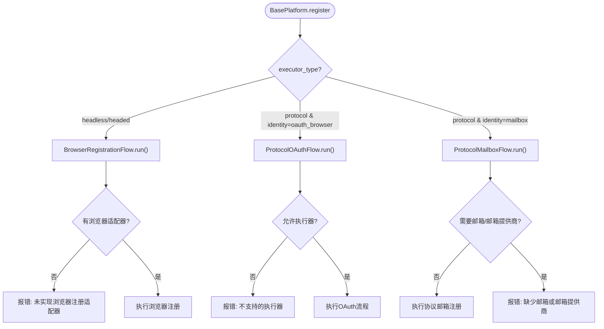

图示来源
- [core/base_platform.py:124-160](file://core/base_platform.py#L124-L160)
- [core/registration/flows.py:18-142](file://core/registration/flows.py#L18-L142)
- [core/base_platform.py:316-352](file://core/base_platform.py#L316-L352)

章节来源
- [core/base_platform.py:124-160](file://core/base_platform.py#L124-L160)
- [core/registration/flows.py:18-142](file://core/registration/flows.py#L18-L142)
- [core/base_platform.py:316-352](file://core/base_platform.py#L316-L352)

### 平台能力检测机制与动态配置加载
- 能力来源
  - 平台类声明 capabilities 列表
  - 数据库覆盖 PlatformCapabilityOverrideModel 可调整 supported_executors、supported_identity_modes、supported_oauth_providers、capabilities
- 加载顺序
  - 启动时扫描 platforms/ 下各插件模块，导入 plugin 以触发 @register
  - 首次访问能力时，确保数据库存在记录，并将类默认值合并入库
  - 读取时优先使用数据库覆盖，否则回退到类默认值
- 能力定义
  - CapabilityRegistry 提供标准能力定义（如 query_state、refresh_token、generate_link 等）
  - 平台可通过 capability_overrides 自定义UI标签与参数

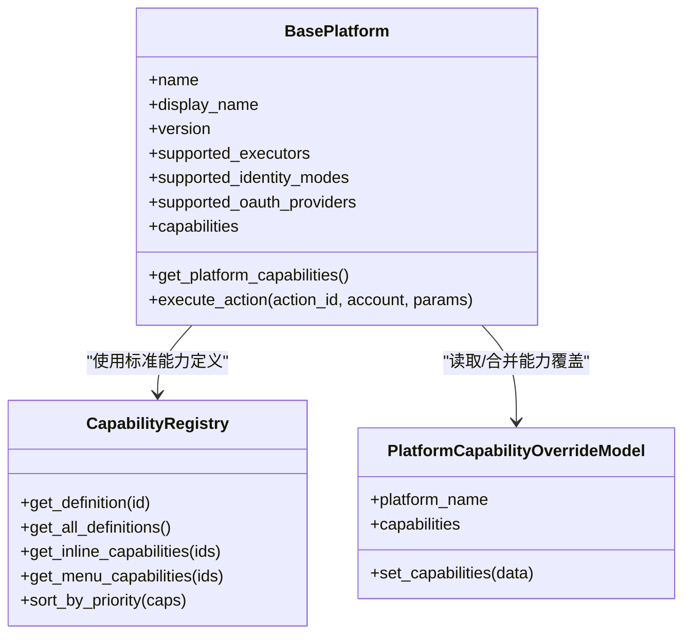

图示来源
- [core/base_platform.py:44-75](file://core/base_platform.py#L44-L75)
- [core/base_platform.py:286-310](file://core/base_platform.py#L286-L310)
- [core/capability_registry.py:27-132](file://core/capability_registry.py#L27-L132)
- [core/registry.py:51-107](file://core/registry.py#L51-L107)
- [infrastructure/platform_caps_repository.py:22-42](file://infrastructure/platform_caps_repository.py#L22-L42)

章节来源
- [core/base_platform.py:44-75](file://core/base_platform.py#L44-L75)
- [core/capability_registry.py:27-132](file://core/capability_registry.py#L27-L132)
- [core/registry.py:51-107](file://core/registry.py#L51-L107)
- [infrastructure/platform_caps_repository.py:22-42](file://infrastructure/platform_caps_repository.py#L22-L42)

### 插件发现机制
- 机制
  - core.registry.load_all 扫描 platforms 包下的子模块，尝试导入每个平台的 plugin 模块
  - plugin 中通过 @register 装饰器将平台类注册到内存注册表
- 影响
  - 未正确实现 plugin 或未使用 @register 将无法被系统发现
  - 新增平台需在 platforms/<platform>/plugin.py 中注册

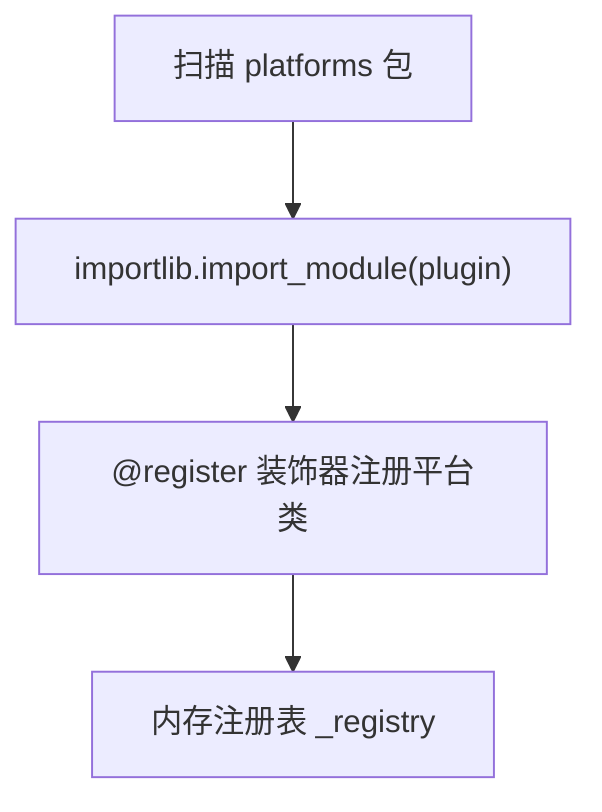

图示来源
- [core/registry.py:25-38](file://core/registry.py#L25-L38)

章节来源
- [core/registry.py:25-38](file://core/registry.py#L25-L38)

### 平台扩展开发指南
- 新平台接入步骤
  - 在 platforms/<new_platform>/ 下创建 core.py、plugin.py、可选的 browser_register/protocol_mailbox 等
  - 在 core.py 继承 BasePlatform，实现 check_valid、get_trial_url、get_quota 等必要方法
  - 在 plugin.py 使用 @register 装饰器注册平台类
  - 在 platform 类上声明 supported_executors、supported_identity_modes、supported_oauth_providers、capabilities
  - 如需自定义能力UI与参数，设置 capability_overrides
- 配置验证规则
  - executor_type 必须在 supported_executors 内，否则初始化时报错
  - identity_provider 必须在 supported_identity_modes 内，否则注册时报错
  - 浏览器模式需配置默认验证码 provider，否则抛错
- 执行器选择逻辑
  - BasePlatform._make_executor 根据 executor_type 选择 ProtocolExecutor 或 PlaywrightExecutor（headless/headed）
  - 验证码解决器通过 _get_captcha_solver_candidates 选择可用 provider，支持多候选回退

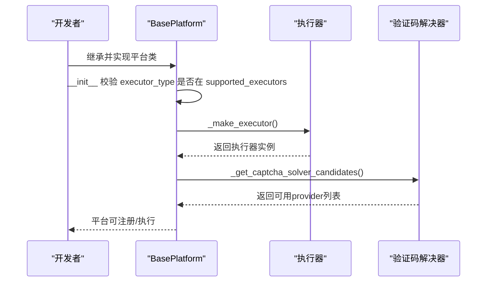

图示来源
- [core/base_platform.py:59-75](file://core/base_platform.py#L59-L75)
- [core/base_platform.py:316-352](file://core/base_platform.py#L316-L352)
- [core/base_platform.py:354-394](file://core/base_platform.py#L354-L394)

章节来源
- [core/base_platform.py:59-75](file://core/base_platform.py#L59-L75)
- [core/base_platform.py:316-394](file://core/base_platform.py#L316-L394)

### 平台兼容性检查与版本管理
- 兼容性检查
  - 初始化时校验 executor_type 与 supported_executors
  - 注册时校验 identity_provider 与 supported_identity_modes
  - 浏览器模式需配置验证码 provider，否则抛错
- 版本管理
  - 平台类声明 version 字段，用于前端展示与兼容判断
  - 能力覆盖可随版本演进调整，无需修改代码

章节来源
- [core/base_platform.py:59-75](file://core/base_platform.py#L59-L75)
- [core/base_platform.py:432-459](file://core/base_platform.py#L432-L459)
- [core/base_platform.py:350-352](file://core/base_platform.py#L350-L352)

### 示例：ChatGPT平台能力与注册流程
- 能力声明
  - 支持 protocol/headless/headed 执行器
  - 支持 mailbox/oauth_browser 身份模式
  - 支持 google/microsoft OAuth提供商
  - 声明 capabilities：query_state、refresh_token、generate_link、switch_desktop、upload_cpa、upload_tm
- 注册流程
  - 浏览器模式：构造 BrowserRegistrationAdapter，绑定浏览器工作进程与结果映射
  - 协议邮箱模式：构造 ProtocolMailboxAdapter，绑定工作进程与结果映射
  - OAuth模式：构造 ProtocolOAuthAdapter，执行OAuth回调并映射结果

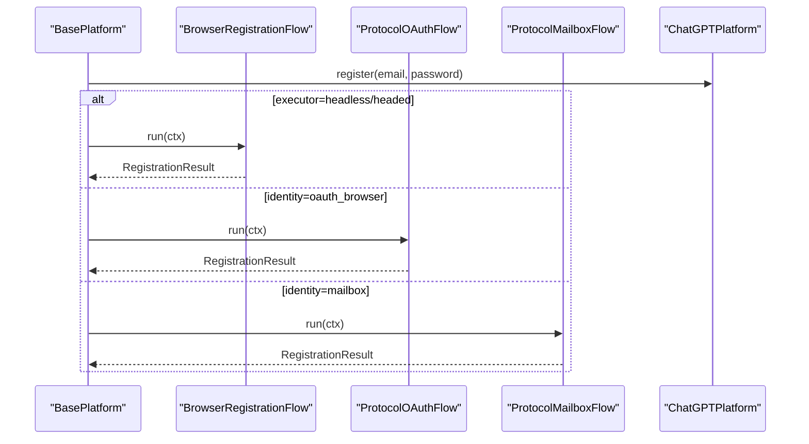

图示来源
- [platforms/chatgpt/plugin.py:48-66](file://platforms/chatgpt/plugin.py#L48-L66)
- [platforms/chatgpt/plugin.py:160-225](file://platforms/chatgpt/plugin.py#L160-L225)
- [core/registration/flows.py:18-142](file://core/registration/flows.py#L18-L142)
- [core/base_platform.py:124-160](file://core/base_platform.py#L124-L160)

章节来源
- [platforms/chatgpt/plugin.py:48-66](file://platforms/chatgpt/plugin.py#L48-L66)
- [platforms/chatgpt/plugin.py:160-225](file://platforms/chatgpt/plugin.py#L160-L225)
- [core/registration/flows.py:18-142](file://core/registration/flows.py#L18-L142)
- [core/base_platform.py:124-160](file://core/base_platform.py#L124-L160)

## 依赖关系分析
- 组件耦合
  - API路由层仅依赖应用服务层，保持薄控制器
  - 应用服务层依赖基础设施仓库与核心平台基类
  - 核心平台基类依赖注册表与能力定义，形成松耦合能力体系
- 外部依赖
  - 数据库：SQLModel引擎用于能力覆盖与账号持久化
  - 浏览器：Playwright用于headless/headed模式
  - 验证码：本地或第三方solver，按配置选择

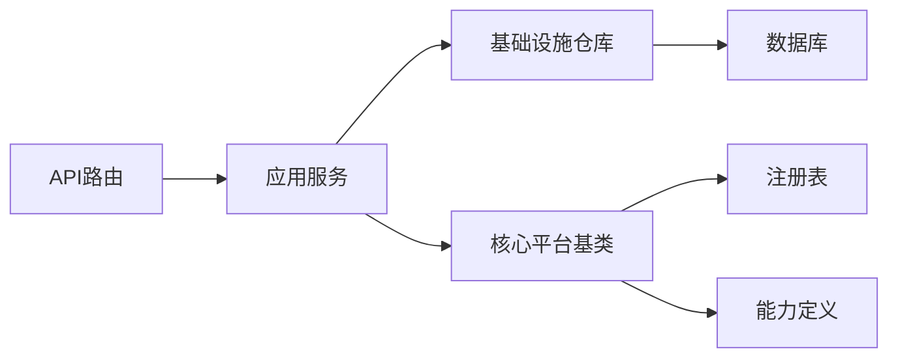

图示来源
- [api/platforms.py:11-18](file://api/platforms.py#L11-L18)
- [application/platforms.py:57-80](file://application/platforms.py#L57-L80)
- [infrastructure/platform_runtime.py:221-331](file://infrastructure/platform_runtime.py#L221-L331)
- [core/base_platform.py:44-75](file://core/base_platform.py#L44-L75)
- [core/registry.py:25-38](file://core/registry.py#L25-L38)
- [core/capability_registry.py:27-132](file://core/capability_registry.py#L27-L132)

章节来源
- [api/platforms.py:11-18](file://api/platforms.py#L11-L18)
- [application/platforms.py:57-80](file://application/platforms.py#L57-L80)
- [infrastructure/platform_runtime.py:221-331](file://infrastructure/platform_runtime.py#L221-L331)
- [core/base_platform.py:44-75](file://core/base_platform.py#L44-L75)
- [core/registry.py:25-38](file://core/registry.py#L25-L38)
- [core/capability_registry.py:27-132](file://core/capability_registry.py#L27-L132)

## 性能考虑
- 插件加载
  - load_all 仅在首次访问时扫描并导入插件，避免启动开销
- 能力合并
  - 首次读取能力时合并类默认值与数据库覆盖，后续直接读取，减少重复计算
- 执行器与验证码
  - 执行器按需创建，验证码解决器支持多候选回退，降低单次失败概率
- 数据库操作
  - 能力更新与重置采用事务提交，保证一致性

[本节为通用指导，不直接分析具体文件]

## 故障排查指南
- 常见错误
  - 执行器不支持：初始化时抛出 NotImplementedError，检查 executor_type 是否在 supported_executors
  - 身份模式不支持：注册时报错，检查 identity_provider 是否在 supported_identity_modes
  - 浏览器模式未配置验证码：抛错提示先启用并设为默认
  - OAuth无头模式需浏览器复用：提示配置 chrome_user_data_dir 或 chrome_cdp_url
- 排查步骤
  - 查看平台能力覆盖是否正确
  - 确认插件已正确注册（@register）
  - 检查提供商定义是否启用且配置完整
  - 查看执行日志定位具体失败环节

章节来源
- [core/base_platform.py:59-75](file://core/base_platform.py#L59-L75)
- [core/base_platform.py:350-352](file://core/base_platform.py#L350-L352)
- [core/registration/flows.py:26-39](file://core/registration/flows.py#L26-L39)
- [core/registration/flows.py:131-141](file://core/registration/flows.py#L131-L141)

## 结论
平台配置API提供了完整的平台管理能力：从平台列表、能力检测与覆盖，到提供商定义管理与注册流程编排。通过统一的基类与能力系统，平台扩展具备高内聚、低耦合的特性，便于快速接入新平台并灵活调整执行模式与能力清单。建议在新平台接入时严格遵循执行器与身份模式约束，合理配置验证码与OAuth流程，并通过能力覆盖实现版本化演进。

[本节为总结性内容，不直接分析具体文件]

## 附录
- 常用接口速查
  - 平台列表：GET /platforms
  - 桌面状态：GET /platforms/{platform}/desktop-state
  - 能力更新：PUT /platforms/{name}/capabilities
  - 能力重置：DELETE /platforms/{name}/capabilities
  - 提供商定义：GET/PUT/POST /provider-definitions，DELETE /provider-definitions/{id}
- 关键数据模型
  - PlatformCapabilitiesUpdate：包含 supported_executors、supported_identity_modes、supported_oauth_providers、capabilities
  - CapabilityDefinition：标准能力定义，含ID、标签、描述、分类、参数Schema与UI提示

章节来源
- [domain/platform_caps.py:6-12](file://domain/platform_caps.py#L6-L12)
- [core/capability_registry.py:27-132](file://core/capability_registry.py#L27-L132)
- [api/platforms.py:11-18](file://api/platforms.py#L11-L18)
- [api/platform_capabilities.py:11-18](file://api/platform_capabilities.py#L11-L18)
- [api/provider_definitions.py:24-52](file://api/provider_definitions.py#L24-L52)