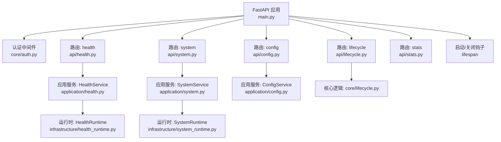
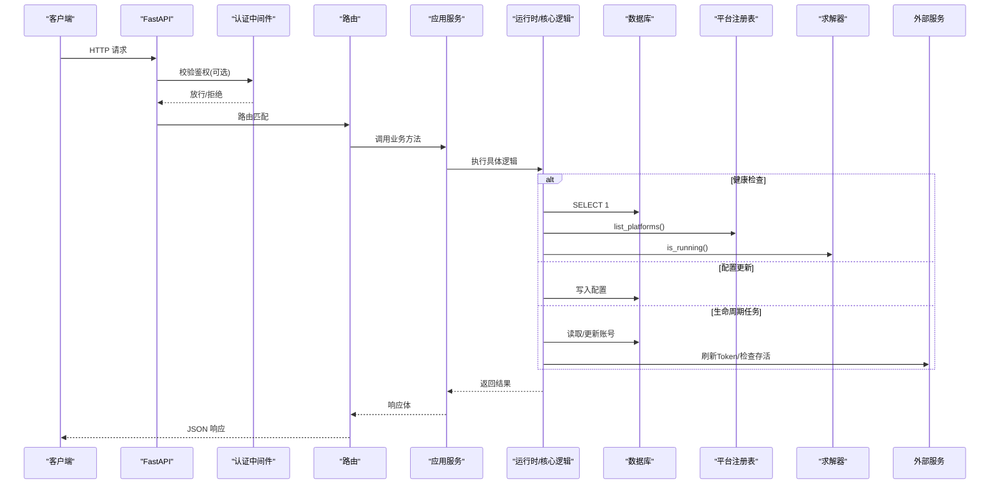
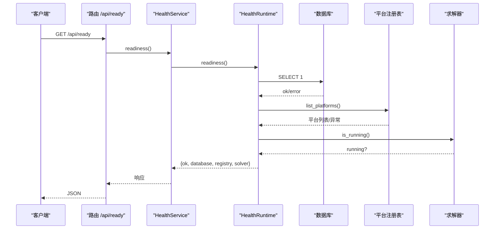
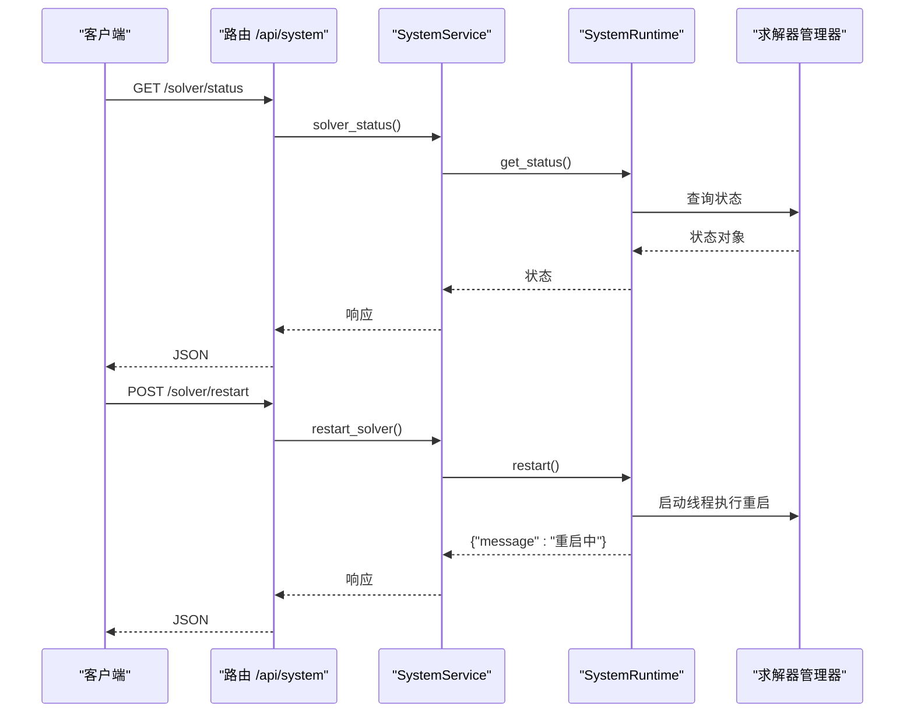
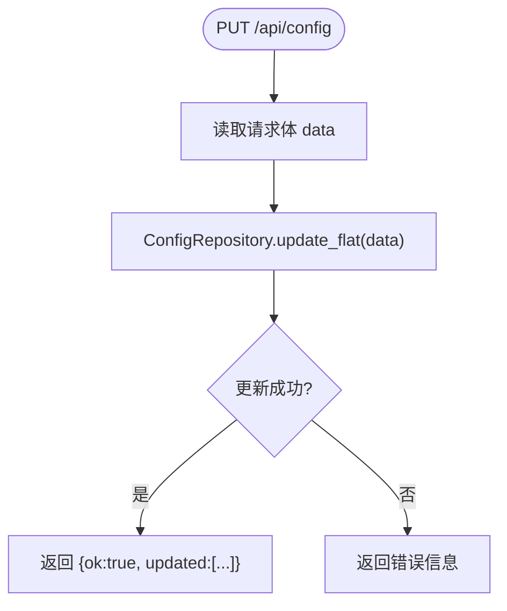
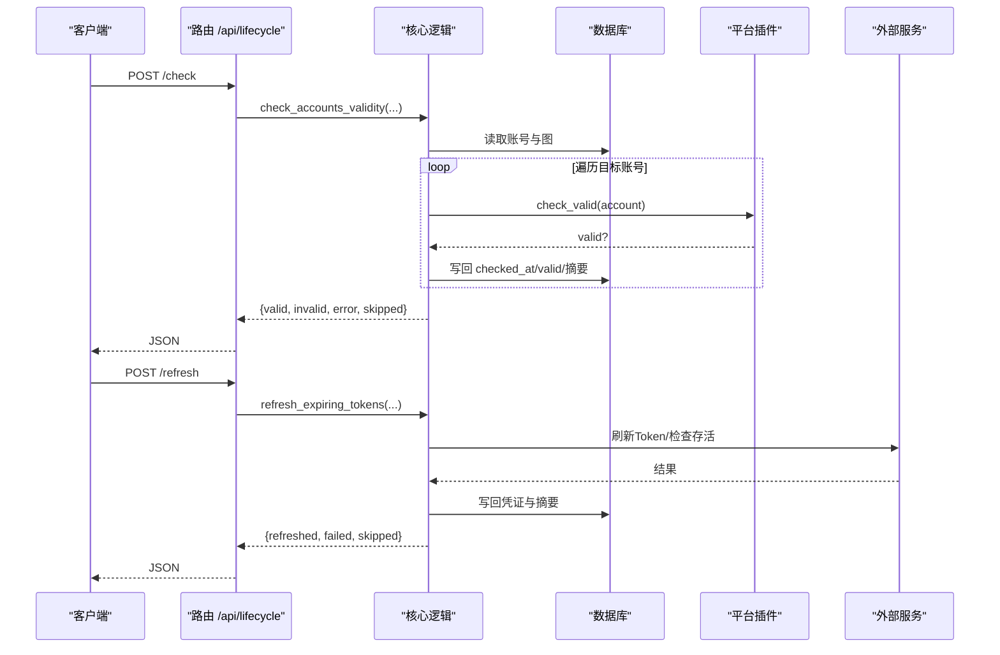
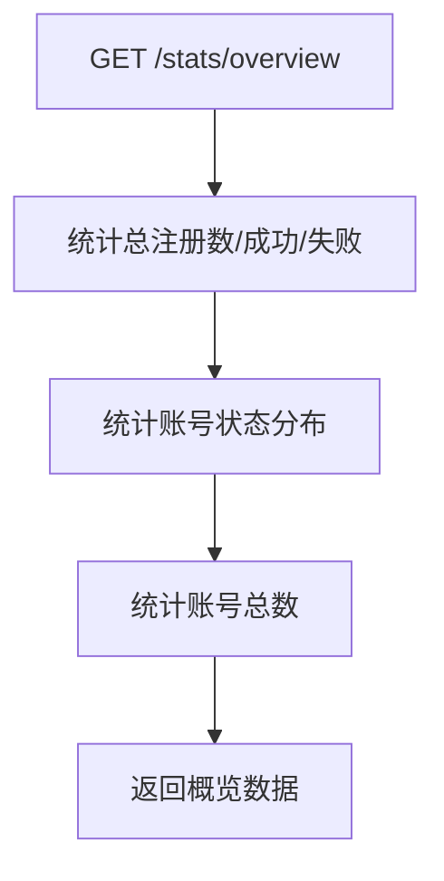
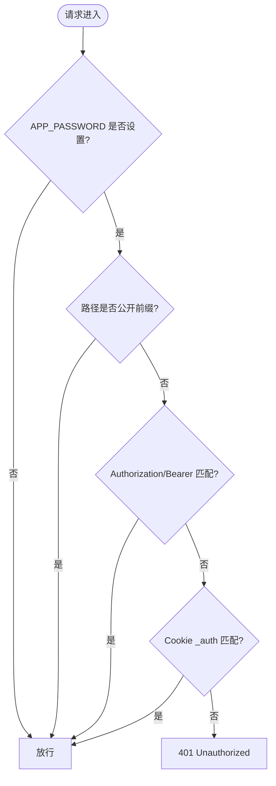
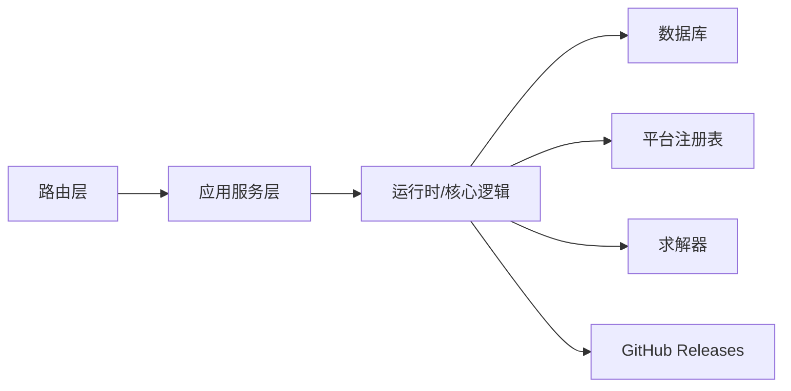

# 系统管理API

<cite>
**本文引用的文件**
- [main.py](file://main.py)
- [api/health.py](file://api/health.py)
- [application/health.py](file://application/health.py)
- [infrastructure/health_runtime.py](file://infrastructure/health_runtime.py)
- [api/system.py](file://api/system.py)
- [application/system.py](file://application/system.py)
- [infrastructure/system_runtime.py](file://infrastructure/system_runtime.py)
- [api/config.py](file://api/config.py)
- [application/config.py](file://application/config.py)
- [core/auth.py](file://core/auth.py)
- [api/auth.py](file://api/auth.py)
- [api/lifecycle.py](file://api/lifecycle.py)
- [core/lifecycle.py](file://core/lifecycle.py)
- [api/stats.py](file://api/stats.py)
</cite>

## 目录
1. [简介](#简介)
2. [项目结构](#项目结构)
3. [核心组件](#核心组件)
4. [架构总览](#架构总览)
5. [详细组件分析](#详细组件分析)
6. [依赖关系分析](#依赖关系分析)
7. [性能与可用性考虑](#性能与可用性考虑)
8. [故障排查指南](#故障排查指南)
9. [结论](#结论)
10. [附录：接口清单与使用示例](#附录接口清单与使用示例)

## 简介
本文件面向运维与平台工程团队，系统化说明“系统管理API”的能力边界与使用方法，覆盖以下主题：
- 系统健康检查与就绪探针（/api/health、/api/ready）
- 运行时配置读取与热更新（/api/config）
- 统计指标与趋势（/api/stats/*）
- 生命周期管理与任务触发（/api/lifecycle/*）
- 系统级能力（版本信息、求解器状态等）（/api/system/*）
- 安全与访问控制（鉴权中间件、公开端点白名单）
- 外部服务连通性检查（数据库、平台注册表、求解器）

该文档同时提供调用流程时序图、数据流图与排错建议，帮助快速完成监控、诊断与运维操作。

## 项目结构
系统采用分层设计：API路由层 → 应用服务层 → 基础设施运行时层 → 外部依赖（数据库、平台注册表、求解器等）。启动时通过生命周期钩子初始化数据库、加载平台与提供者、启动调度器与后台任务。

**图示来源**
- [main.py:67-121](file://main.py#L67-L121)
- [api/health.py:1-19](file://api/health.py#L1-L19)
- [application/health.py:1-15](file://application/health.py#L1-L15)
- [infrastructure/health_runtime.py:1-42](file://infrastructure/health_runtime.py#L1-L42)
- [api/system.py:1-93](file://api/system.py#L1-L93)
- [application/system.py:1-15](file://application/system.py#L1-L15)
- [infrastructure/system_runtime.py:1-14](file://infrastructure/system_runtime.py#L1-L14)
- [api/config.py:1-29](file://api/config.py#L1-L29)
- [application/config.py:1-38](file://application/config.py#L1-L38)
- [api/lifecycle.py:1-61](file://api/lifecycle.py#L1-L61)
- [core/lifecycle.py:458-528](file://core/lifecycle.py#L458-L528)

**章节来源**
- [main.py:67-121](file://main.py#L67-L121)

## 核心组件
- 健康检查组件：提供进程存活与就绪探测，包含数据库连通性、平台注册表可用性与求解器运行状态。
- 系统组件：提供版本信息与求解器状态查询/重启能力。
- 配置组件：提供配置读取、选项元数据获取与热更新。
- 生命周期组件：提供账号有效性检测、Token刷新、过期预警扫描的触发与状态查询。
- 统计组件：提供全局概览、按平台/按天/按代理的成功率与错误聚合。
- 安全组件：基于环境变量密码的Bearer/Cookie鉴权中间件，支持公开端点白名单。

**章节来源**
- [api/health.py:1-19](file://api/health.py#L1-L19)
- [application/health.py:1-15](file://application/health.py#L1-L15)
- [infrastructure/health_runtime.py:1-42](file://infrastructure/health_runtime.py#L1-L42)
- [api/system.py:1-93](file://api/system.py#L1-L93)
- [application/system.py:1-15](file://application/system.py#L1-L15)
- [infrastructure/system_runtime.py:1-14](file://infrastructure/system_runtime.py#L1-L14)
- [api/config.py:1-29](file://api/config.py#L1-L29)
- [application/config.py:1-38](file://application/config.py#L1-L38)
- [api/lifecycle.py:1-61](file://api/lifecycle.py#L1-L61)
- [core/lifecycle.py:458-528](file://core/lifecycle.py#L458-L528)
- [api/stats.py:1-152](file://api/stats.py#L1-L152)
- [core/auth.py:1-49](file://core/auth.py#L1-L49)

## 架构总览
请求从客户端进入 FastAPI，经过认证中间件后分发到对应路由，路由调用应用服务层，再委托至基础设施运行时或核心逻辑模块，最终访问数据库、平台注册表或外部服务。

**图示来源**
- [main.py:67-121](file://main.py#L67-L121)
- [core/auth.py:19-49](file://core/auth.py#L19-L49)
- [infrastructure/health_runtime.py:15-42](file://infrastructure/health_runtime.py#L15-L42)
- [application/config.py:16-38](file://application/config.py#L16-L38)
- [core/lifecycle.py:37-193](file://core/lifecycle.py#L37-L193)

## 详细组件分析

### 健康检查与就绪探针
- 功能要点
  - /api/health：进程存活探针，始终返回成功。
  - /api/ready：就绪探针，检查数据库连接、平台注册表可用性与求解器是否运行。
- 处理流程
  - 路由接收请求 → 应用服务 → 运行时执行检查 → 组装结果返回。
- 关键行为
  - 数据库检查失败会记录错误信息；注册表异常会记录错误并返回平台数量。
  - 求解器状态通过运行时查询。

**图示来源**
- [api/health.py:11-18](file://api/health.py#L11-L18)
- [application/health.py:10-14](file://application/health.py#L10-L14)
- [infrastructure/health_runtime.py:15-42](file://infrastructure/health_runtime.py#L15-L42)

**章节来源**
- [api/health.py:1-19](file://api/health.py#L1-L19)
- [application/health.py:1-15](file://application/health.py#L1-L15)
- [infrastructure/health_runtime.py:1-42](file://infrastructure/health_runtime.py#L1-L42)

### 系统信息与求解器管理
- 功能要点
  - /api/system/solver/status：查询求解器状态。
  - /api/system/solver/restart：异步重启求解器。
  - /api/system/version：当前版本与GitHub最新release对比，提示是否有更新。
- 处理流程
  - 路由 → 应用服务 → 运行时 → 求解器管理器；版本接口缓存最近一次拉取结果以降低外部API限频风险。

**图示来源**
- [api/system.py:71-78](file://api/system.py#L71-L78)
- [application/system.py:6-14](file://application/system.py#L6-L14)
- [infrastructure/system_runtime.py:6-13](file://infrastructure/system_runtime.py#L6-L13)

**章节来源**
- [api/system.py:1-93](file://api/system.py#L1-L93)
- [application/system.py:1-15](file://application/system.py#L1-L15)
- [infrastructure/system_runtime.py:1-14](file://infrastructure/system_runtime.py#L1-L14)

### 配置管理（读取、选项、热更新）
- 功能要点
  - GET /api/config：获取扁平化配置键值对。
  - GET /api/config/options：获取配置项元数据与可选项（如提供商定义、驱动模板、策略等）。
  - PUT /api/config：提交键值对进行热更新，返回已更新的键集合。
- 处理流程
  - 路由 → 应用服务 → 配置仓库/平台/提供商服务 → 持久化或汇总选项。

**图示来源**
- [api/config.py:16-28](file://api/config.py#L16-L28)
- [application/config.py:16-21](file://application/config.py#L16-L21)

**章节来源**
- [api/config.py:1-29](file://api/config.py#L1-L29)
- [application/config.py:1-38](file://application/config.py#L1-L38)

### 生命周期管理（有效性检测、Token刷新、过期预警）
- 功能要点
  - POST /api/lifecycle/check：批量检测账号有效性，仅针对活跃状态的账号。
  - POST /api/lifecycle/refresh：批量刷新即将过期的Token（当前主要支持特定平台）。
  - POST /api/lifecycle/warn：扫描即将过期的试用账号并标记预警。
  - GET /api/lifecycle/status：查看生命周期管理器运行参数与状态。
- 处理流程
  - 路由 → 核心逻辑函数 → 数据库读写 → 平台插件/外部服务 → 写回摘要与凭证。

**图示来源**
- [api/lifecycle.py:30-60](file://api/lifecycle.py#L30-L60)
- [core/lifecycle.py:37-193](file://core/lifecycle.py#L37-L193)

**章节来源**
- [api/lifecycle.py:1-61](file://api/lifecycle.py#L1-L61)
- [core/lifecycle.py:37-193](file://core/lifecycle.py#L37-L193)
- [core/lifecycle.py:458-528](file://core/lifecycle.py#L458-L528)

### 统计信息（概览、按平台、按天、按代理、错误聚合）
- 功能要点
  - GET /api/stats/overview：总注册数、成功率、账号状态分布、账号总数。
  - GET /api/stats/by-platform：按平台维度统计成功率。
  - GET /api/stats/by-day：按天统计注册趋势（支持平台过滤）。
  - GET /api/stats/by-proxy：代理成功率排行。
  - GET /api/stats/errors：最近失败错误聚合（支持平台过滤与限制条数）。
- 处理流程
  - 路由直接访问数据库模型，聚合统计并返回。

**图示来源**
- [api/stats.py:18-52](file://api/stats.py#L18-L52)

**章节来源**
- [api/stats.py:1-152](file://api/stats.py#L1-L152)

### 安全与访问控制
- 机制
  - 通过环境变量 APP_PASSWORD 启用简单密码保护。
  - 所有 /api/* 请求需携带 Authorization: Bearer <password> 或 Cookie _auth=<password>。
  - 公开端点白名单：/api/health、/api/ready、/api/auth/* 无需鉴权。
- 登录辅助
  - /api/auth/check：判断是否需要密码。
  - /api/auth/login：输入密码后返回 token（用于后续请求携带）。

**图示来源**
- [core/auth.py:19-49](file://core/auth.py#L19-L49)
- [api/auth.py:15-29](file://api/auth.py#L15-L29)

**章节来源**
- [core/auth.py:1-49](file://core/auth.py#L1-L49)
- [api/auth.py:1-30](file://api/auth.py#L1-L30)

## 依赖关系分析
- 组件耦合
  - 路由层仅负责参数绑定与调用服务，低耦合。
  - 应用服务层组合多个领域服务（平台、提供商、配置），提高内聚性。
  - 运行时层封装外部依赖（数据库、注册表、求解器），便于替换与测试。
- 外部依赖
  - 数据库：SQLAlchemy/SQLModel引擎，用于账号、日志、代理等数据存取。
  - 平台注册表：动态加载平台能力，影响就绪探针与配置选项。
  - 求解器：独立服务，支持状态查询与重启。
  - GitHub Releases：用于版本比较，带本地缓存与锁。

**图示来源**
- [main.py:67-121](file://main.py#L67-L121)
- [infrastructure/health_runtime.py:15-42](file://infrastructure/health_runtime.py#L15-L42)
- [api/system.py:21-46](file://api/system.py#L21-L46)

**章节来源**
- [main.py:67-121](file://main.py#L67-L121)
- [infrastructure/health_runtime.py:15-42](file://infrastructure/health_runtime.py#L15-L42)
- [api/system.py:21-46](file://api/system.py#L21-L46)

## 性能与可用性考虑
- 健康检查
  - /api/ready 包含数据库查询与注册表枚举，建议在容器编排中合理设置超时与重试。
- 版本信息
  - 对外部GitHub API有10分钟缓存与并发锁，避免频繁请求导致限频。
- 统计接口
  - 直接聚合数据库，注意在大数据量场景下增加索引与分页（当前为全表聚合）。
- 生命周期任务
  - 批量操作限制 limit 参数，避免一次性处理过多账号造成资源占用。
- 配置热更新
  - 更新后立即生效，建议配合前端刷新与灰度发布策略。

[本节为通用指导，不直接分析具体文件]

## 故障排查指南
- 健康检查失败
  - 数据库不可用：检查数据库连接与权限，关注 /api/ready 返回中的 database.error。
  - 注册表异常：检查平台加载与依赖，关注 registry.error 与 platform_count。
  - 求解器未运行：检查求解器服务状态与日志。
- 配置更新无效
  - 确认请求体格式为键值对字典；检查返回的 updated 字段确认哪些键被更新。
- 生命周期任务报错
  - 查看返回的 error/failed/skipped 计数；结合日志定位具体账号与平台。
- 鉴权失败
  - 确认已正确设置 APP_PASSWORD；请求头或Cookie是否正确携带；确认路径是否在公开白名单。

**章节来源**
- [infrastructure/health_runtime.py:15-42](file://infrastructure/health_runtime.py#L15-L42)
- [api/config.py:26-28](file://api/config.py#L26-L28)
- [core/lifecycle.py:37-193](file://core/lifecycle.py#L37-L193)
- [core/auth.py:19-49](file://core/auth.py#L19-L49)

## 结论
本系统管理API以清晰的分层架构提供了完善的系统级能力：健康检查、配置热更新、统计指标、生命周期管理与系统信息查询。通过鉴权中间件保障安全性，借助运行时抽象屏蔽外部依赖差异，便于扩展与维护。建议在生产环境结合容器编排与监控告警，充分利用就绪探针与统计接口实现自动化运维。

[本节为总结性内容，不直接分析具体文件]

## 附录：接口清单与使用示例

### 健康检查
- GET /api/health
  - 用途：进程存活探针
  - 鉴权：不需要（公开）
- GET /api/ready
  - 用途：就绪探针（数据库、注册表、求解器）
  - 鉴权：不需要（公开）

**章节来源**
- [api/health.py:11-18](file://api/health.py#L11-L18)
- [core/auth.py:19-37](file://core/auth.py#L19-L37)

### 系统信息
- GET /api/system/solver/status
  - 用途：查询求解器状态
- POST /api/system/solver/restart
  - 用途：异步重启求解器
- GET /api/system/version
  - 用途：获取当前版本与最新版本对比

**章节来源**
- [api/system.py:71-91](file://api/system.py#L71-L91)
- [application/system.py:10-14](file://application/system.py#L10-L14)
- [infrastructure/system_runtime.py:6-13](file://infrastructure/system_runtime.py#L6-L13)

### 配置管理
- GET /api/config
  - 用途：读取扁平化配置
- GET /api/config/options
  - 用途：获取配置选项与元数据
- PUT /api/config
  - 用途：热更新配置（请求体 data: dict[str,str]）

**章节来源**
- [api/config.py:16-28](file://api/config.py#L16-L28)
- [application/config.py:16-38](file://application/config.py#L16-L38)

### 生命周期管理
- POST /api/lifecycle/check
  - 用途：批量检测账号有效性（支持 platform、limit）
- POST /api/lifecycle/refresh
  - 用途：批量刷新Token（支持 platform、limit）
- POST /api/lifecycle/warn
  - 用途：扫描即将过期的试用账号（hours）
- GET /api/lifecycle/status
  - 用途：查看生命周期管理器运行参数

**章节来源**
- [api/lifecycle.py:16-60](file://api/lifecycle.py#L16-L60)
- [core/lifecycle.py:37-193](file://core/lifecycle.py#L37-L193)
- [core/lifecycle.py:458-528](file://core/lifecycle.py#L458-L528)

### 统计信息
- GET /api/stats/overview
  - 用途：全局概览（注册数、成功率、账号分布、账号总数）
- GET /api/stats/by-platform
  - 用途：按平台统计成功率
- GET /api/stats/by-day?days=30&platform=
  - 用途：按天统计注册趋势
- GET /api/stats/by-proxy
  - 用途：代理成功率排行
- GET /api/stats/errors?days=7&platform=&limit=20
  - 用途：最近失败错误聚合

**章节来源**
- [api/stats.py:18-152](file://api/stats.py#L18-L152)

### 安全与访问控制
- GET /api/auth/check
  - 用途：判断是否需要密码
- POST /api/auth/login
  - 用途：登录并获取token（用于后续请求携带）
- 鉴权方式
  - Authorization: Bearer <password> 或 Cookie _auth=<password>
  - 公开前缀：/api/health、/api/ready、/api/auth/*

**章节来源**
- [api/auth.py:15-29](file://api/auth.py#L15-L29)
- [core/auth.py:19-49](file://core/auth.py#L19-L49)