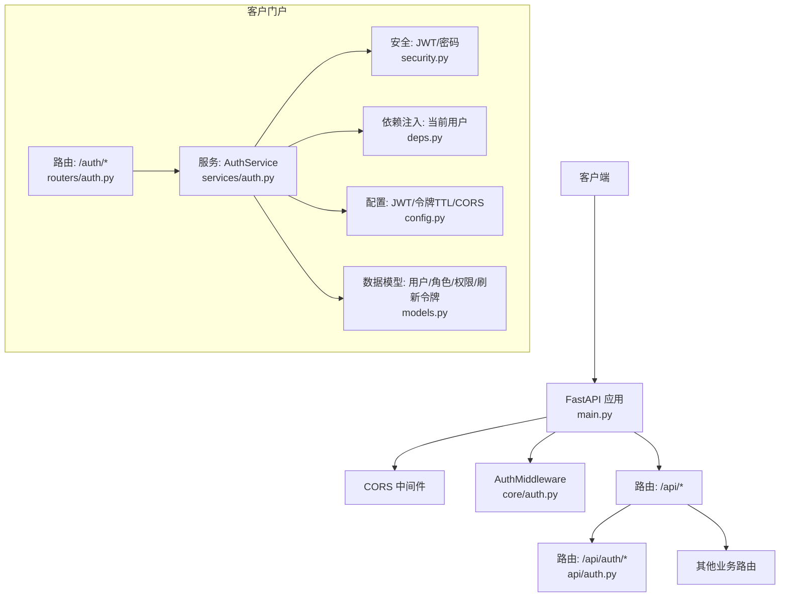
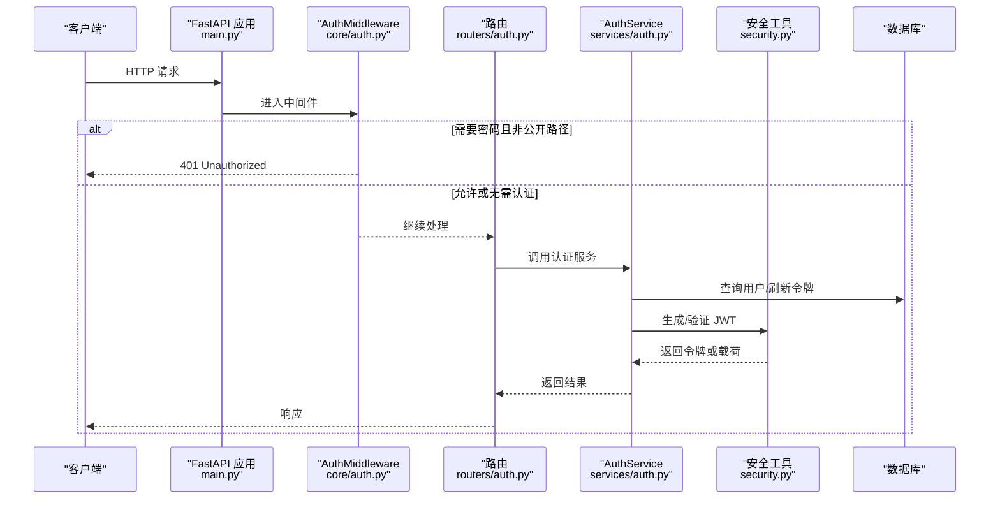
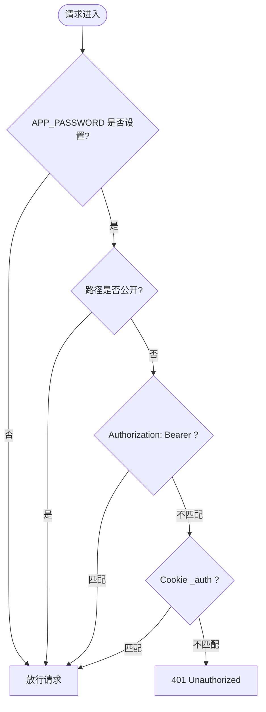
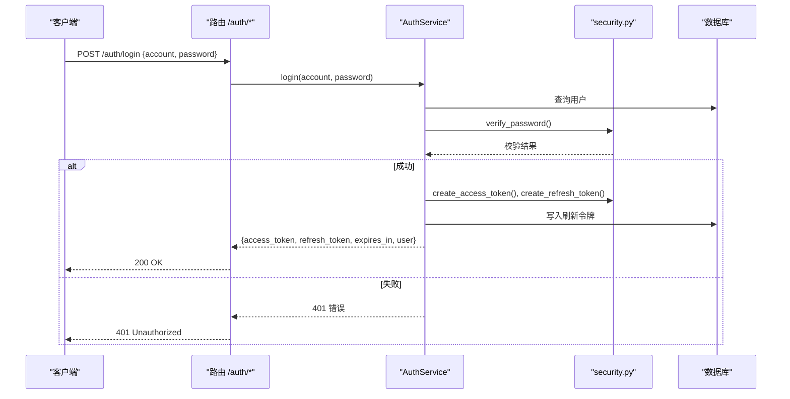
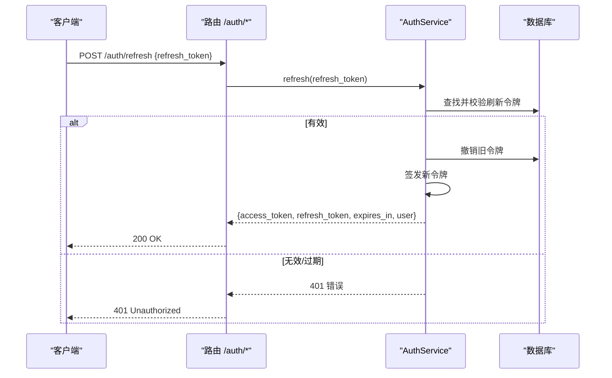
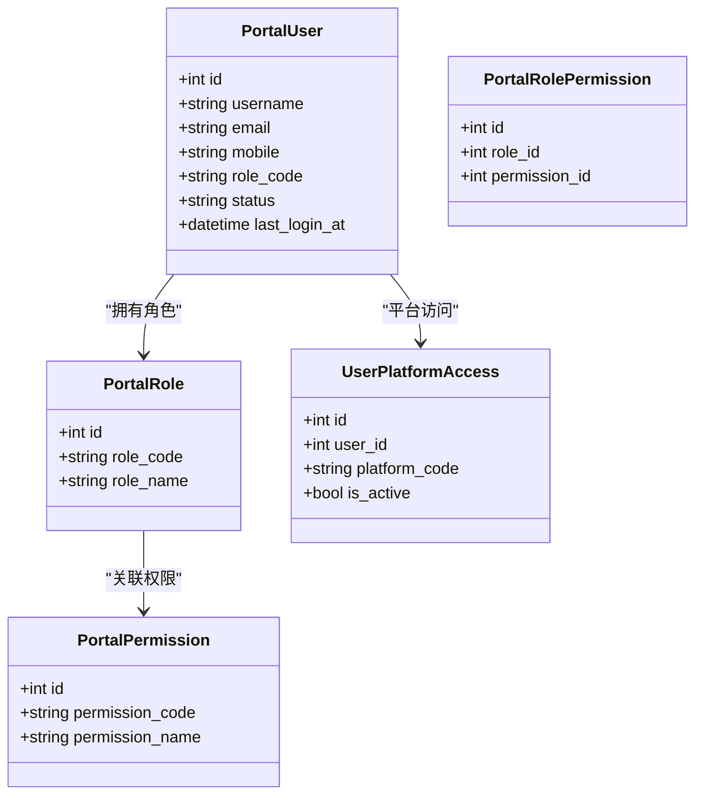
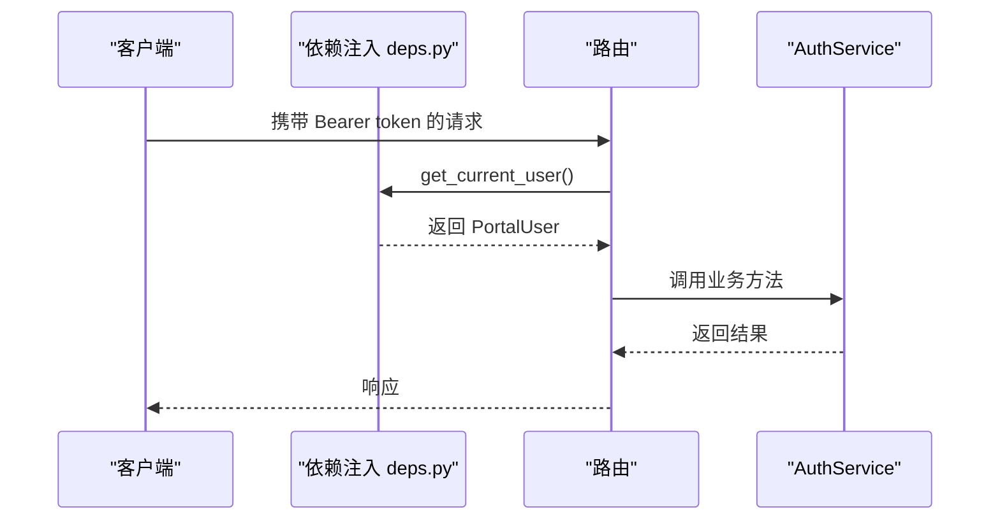
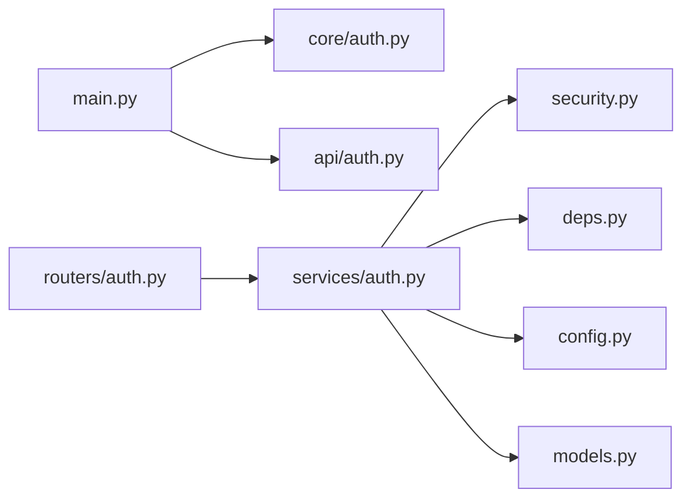

# 认证授权API

<cite>
**本文引用的文件**
- [main.py](file://main.py)
- [core/auth.py](file://core/auth.py)
- [api/auth.py](file://api/auth.py)
- [customer_portal_api/app/routers/auth.py](file://customer_portal_api/app/routers/auth.py)
- [customer_portal_api/app/services/auth.py](file://customer_portal_api/app/services/auth.py)
- [customer_portal_api/app/security.py](file://customer_portal_api/app/security.py)
- [customer_portal_api/app/deps.py](file://customer_portal_api/app/deps.py)
- [customer_portal_api/app/config.py](file://customer_portal_api/app/config.py)
- [customer_portal_api/app/models.py](file://customer_portal_api/app/models.py)
</cite>

## 目录
1. [简介](#简介)
2. [项目结构](#项目结构)
3. [核心组件](#核心组件)
4. [架构总览](#架构总览)
5. [详细组件分析](#详细组件分析)
6. [依赖关系分析](#依赖关系分析)
7. [性能考虑](#性能考虑)
8. [故障排查指南](#故障排查指南)
9. [结论](#结论)
10. [附录：安全最佳实践与使用示例](#附录：安全最佳实践与使用示例)

## 简介
本文件面向“认证授权API”，覆盖以下能力：
- 用户登录、令牌管理（访问令牌与刷新令牌）、权限验证、会话控制
- Bearer Token 认证机制、JWT 令牌生成与验证
- 角色与权限模型、访问控制策略
- API 密钥管理（简单口令模式）
- 多租户隔离（平台级资源访问控制）
- 审计日志记录（登录时间戳等）
- 安全最佳实践：密码加密、令牌刷新、防暴力破解、CORS 配置等

本项目包含两套认证体系：
- 主服务（FastAPI）：基于环境变量 APP_PASSWORD 的简单 Bearer/Cookie 鉴权中间件，适用于内部或受控环境快速启用保护。
- 客户门户（Customer Portal API）：基于 JWT 的完整认证授权流程，支持登录、刷新、登出、当前用户信息获取，以及基于角色的权限控制。

## 项目结构
- 主服务入口与全局中间件注册在 main.py，统一挂载 /api 路由并启用 CORS。
- 核心鉴权中间件位于 core/auth.py，对 /api 路径进行 Bearer/Cookie 校验，健康检查与 /api/auth/ 为公开端点。
- 主服务的简易认证接口位于 api/auth.py，提供是否需密码的检查与登录返回令牌。
- 客户门户的认证路由位于 customer_portal_api/app/routers/auth.py，封装登录、刷新、登出、当前用户信息。
- 客户门户的认证服务与安全工具位于 customer_portal_api/app/services/auth.py 与 security.py。
- 依赖注入与当前用户解析位于 customer_portal_api/app/deps.py。
- 配置项（JWT 密钥、令牌有效期、CORS 等）位于 customer_portal_api/app/config.py。
- 数据模型（用户、角色、权限、刷新令牌、平台访问等）位于 customer_portal_api/app/models.py。

图表来源
- [main.py:94-121](file://main.py#L94-L121)
- [core/auth.py:26-48](file://core/auth.py#L26-L48)
- [api/auth.py:15-29](file://api/auth.py#L15-L29)
- [customer_portal_api/app/routers/auth.py:28-45](file://customer_portal_api/app/routers/auth.py#L28-L45)
- [customer_portal_api/app/services/auth.py:26-144](file://customer_portal_api/app/services/auth.py#L26-L144)
- [customer_portal_api/app/security.py:26-91](file://customer_portal_api/app/security.py#L26-L91)
- [customer_portal_api/app/deps.py:20-36](file://customer_portal_api/app/deps.py#L20-L36)
- [customer_portal_api/app/config.py:6-18](file://customer_portal_api/app/config.py#L6-L18)
- [customer_portal_api/app/models.py:12-106](file://customer_portal_api/app/models.py#L12-L106)

章节来源
- [main.py:94-121](file://main.py#L94-L121)
- [core/auth.py:26-48](file://core/auth.py#L26-L48)
- [api/auth.py:15-29](file://api/auth.py#L15-L29)
- [customer_portal_api/app/routers/auth.py:28-45](file://customer_portal_api/app/routers/auth.py#L28-L45)
- [customer_portal_api/app/services/auth.py:26-144](file://customer_portal_api/app/services/auth.py#L26-L144)
- [customer_portal_api/app/security.py:26-91](file://customer_portal_api/app/security.py#L26-L91)
- [customer_portal_api/app/deps.py:20-36](file://customer_portal_api/app/deps.py#L20-L36)
- [customer_portal_api/app/config.py:6-18](file://customer_portal_api/app/config.py#L6-L18)
- [customer_portal_api/app/models.py:12-106](file://customer_portal_api/app/models.py#L12-L106)

## 核心组件
- 主服务鉴权中间件（core/auth.py）
  - 通过环境变量 APP_PASSWORD 启用保护
  - 支持 Authorization: Bearer <password> 与 Cookie _auth=<password>
  - 公开前缀：/api/health、/api/ready、/api/auth/
- 主服务认证接口（api/auth.py）
  - GET /api/auth/check：查询是否需要密码
  - POST /api/auth/login：校验密码，返回 ok 与 token（即密码本身）
- 客户门户认证路由（routers/auth.py）
  - POST /auth/login：账号/邮箱/手机号 + 密码登录
  - POST /auth/refresh：使用 refresh_token 换取新 access_token
  - POST /auth/logout：撤销 refresh_token
  - GET /auth/me：获取当前用户信息与权限
- 认证服务（services/auth.py）
  - 登录：校验用户状态与密码，更新最后登录时间，签发 access_token 与 refresh_token
  - 刷新：校验并撤销旧 refresh_token，签发新令牌
  - 登出：标记 refresh_token 为已撤销
  - 权限：按角色加载权限集合
- 安全工具（security.py）
  - 密码哈希与校验（PBKDF2-SHA256）
  - JWT 访问令牌生成与解码（HS256，含过期时间）
  - Refresh Token 生成、哈希存储与过期时间计算
- 依赖注入（deps.py）
  - get_current_user：从 Bearer token 解析用户并校验活跃状态
  - require_admin：强制管理员角色
- 配置（config.py）
  - JWT 密钥、access_token_ttl_seconds、refresh_token_ttl_seconds、CORS 源列表

章节来源
- [core/auth.py:26-48](file://core/auth.py#L26-L48)
- [api/auth.py:15-29](file://api/auth.py#L15-L29)
- [customer_portal_api/app/routers/auth.py:28-45](file://customer_portal_api/app/routers/auth.py#L28-L45)
- [customer_portal_api/app/services/auth.py:26-144](file://customer_portal_api/app/services/auth.py#L26-L144)
- [customer_portal_api/app/security.py:26-91](file://customer_portal_api/app/security.py#L26-L91)
- [customer_portal_api/app/deps.py:20-36](file://customer_portal_api/app/deps.py#L20-L36)
- [customer_portal_api/app/config.py:6-18](file://customer_portal_api/app/config.py#L6-L18)

## 架构总览
下图展示请求进入 FastAPI 后的处理链路：CORS -> AuthMiddleware -> 路由 -> 服务层 -> 安全与数据库。

图表来源
- [main.py:94-121](file://main.py#L94-L121)
- [core/auth.py:26-48](file://core/auth.py#L26-L48)
- [customer_portal_api/app/routers/auth.py:28-45](file://customer_portal_api/app/routers/auth.py#L28-L45)
- [customer_portal_api/app/services/auth.py:26-144](file://customer_portal_api/app/services/auth.py#L26-L144)
- [customer_portal_api/app/security.py:26-91](file://customer_portal_api/app/security.py#L26-L91)

## 详细组件分析

### 主服务：简单口令认证（Bearer/Cookie）
- 启用方式：设置环境变量 APP_PASSWORD
- 认证方式：
  - Header: Authorization: Bearer <password>
  - Cookie: _auth=<password>
- 公开路径：/api/health、/api/ready、/api/auth/
- 登录接口：POST /api/auth/login，返回 {ok, token}；若未设置密码则直接 ok

图表来源
- [core/auth.py:26-48](file://core/auth.py#L26-L48)
- [api/auth.py:15-29](file://api/auth.py#L15-L29)

章节来源
- [core/auth.py:26-48](file://core/auth.py#L26-L48)
- [api/auth.py:15-29](file://api/auth.py#L15-L29)

### 客户门户：JWT 认证与授权
- 登录：POST /auth/login，支持账号/邮箱/手机号 + 密码
- 刷新：POST /auth/refresh，使用 refresh_token 换发新的 access_token
- 登出：POST /auth/logout，撤销 refresh_token
- 当前用户：GET /auth/me，返回用户基本信息与权限集合

图表来源
- [customer_portal_api/app/routers/auth.py:28-45](file://customer_portal_api/app/routers/auth.py#L28-L45)
- [customer_portal_api/app/services/auth.py:30-46](file://customer_portal_api/app/services/auth.py#L30-L46)
- [customer_portal_api/app/security.py:26-62](file://customer_portal_api/app/security.py#L26-L62)
- [customer_portal_api/app/models.py:41-67](file://customer_portal_api/app/models.py#L41-L67)

章节来源
- [customer_portal_api/app/routers/auth.py:28-45](file://customer_portal_api/app/routers/auth.py#L28-L45)
- [customer_portal_api/app/services/auth.py:30-46](file://customer_portal_api/app/services/auth.py#L30-L46)
- [customer_portal_api/app/security.py:26-62](file://customer_portal_api/app/security.py#L26-L62)
- [customer_portal_api/app/models.py:41-67](file://customer_portal_api/app/models.py#L41-L67)

### 令牌管理与刷新流程
- 刷新：POST /auth/refresh
  - 校验 refresh_token 是否存在、未被撤销、未过期
  - 撤销旧 refresh_token，签发新 access_token 与 refresh_token
- 登出：POST /auth/logout
  - 将 refresh_token 标记为已撤销

图表来源
- [customer_portal_api/app/routers/auth.py:33-40](file://customer_portal_api/app/routers/auth.py#L33-L40)
- [customer_portal_api/app/services/auth.py:48-70](file://customer_portal_api/app/services/auth.py#L48-L70)
- [customer_portal_api/app/models.py:58-67](file://customer_portal_api/app/models.py#L58-L67)

章节来源
- [customer_portal_api/app/routers/auth.py:33-40](file://customer_portal_api/app/routers/auth.py#L33-L40)
- [customer_portal_api/app/services/auth.py:48-70](file://customer_portal_api/app/services/auth.py#L48-L70)
- [customer_portal_api/app/models.py:58-67](file://customer_portal_api/app/models.py#L58-L67)

### 权限与角色模型
- 角色与权限：PortalRole、PortalPermission、PortalRolePermission
- 用户角色：PortalUser.role_code
- 平台访问控制：UserPlatformAccess（用户可访问的平台集合）
- 权限加载：根据角色关联权限集合，用于后续访问控制

图表来源
- [customer_portal_api/app/models.py:12-106](file://customer_portal_api/app/models.py#L12-L106)
- [customer_portal_api/app/services/auth.py:72-102](file://customer_portal_api/app/services/auth.py#L72-L102)
- [customer_portal_api/app/services/auth.py:134-144](file://customer_portal_api/app/services/auth.py#L134-L144)

章节来源
- [customer_portal_api/app/models.py:12-106](file://customer_portal_api/app/models.py#L12-L106)
- [customer_portal_api/app/services/auth.py:72-102](file://customer_portal_api/app/services/auth.py#L72-L102)
- [customer_portal_api/app/services/auth.py:134-144](file://customer_portal_api/app/services/auth.py#L134-L144)

### 访问控制策略
- 当前用户解析：依赖注入 get_current_user，从 Bearer token 解析用户并校验活跃状态
- 管理员限制：require_admin 强制 admin 角色
- 平台隔离：get_me 中根据用户角色与平台访问表返回可用平台集合

图表来源
- [customer_portal_api/app/deps.py:20-36](file://customer_portal_api/app/deps.py#L20-L36)
- [customer_portal_api/app/routers/auth.py:43-45](file://customer_portal_api/app/routers/auth.py#L43-L45)
- [customer_portal_api/app/services/auth.py:72-102](file://customer_portal_api/app/services/auth.py#L72-L102)

章节来源
- [customer_portal_api/app/deps.py:20-36](file://customer_portal_api/app/deps.py#L20-L36)
- [customer_portal_api/app/routers/auth.py:43-45](file://customer_portal_api/app/routers/auth.py#L43-L45)
- [customer_portal_api/app/services/auth.py:72-102](file://customer_portal_api/app/services/auth.py#L72-L102)

## 依赖关系分析
- 主服务依赖：
  - main.py 注册 CORS 与 AuthMiddleware，并挂载所有 /api 路由
  - core/auth.py 提供全局鉴权中间件
  - api/auth.py 提供简单口令认证接口
- 客户门户依赖：
  - routers/auth.py 暴露认证相关路由
  - services/auth.py 实现登录、刷新、登出、权限加载
  - security.py 实现密码哈希、JWT 生成与验证、刷新令牌管理
  - deps.py 提供当前用户解析与管理员校验
  - config.py 提供 JWT 密钥、令牌 TTL、CORS 配置
  - models.py 定义用户、角色、权限、刷新令牌、平台访问等数据模型

图表来源
- [main.py:94-121](file://main.py#L94-L121)
- [core/auth.py:26-48](file://core/auth.py#L26-L48)
- [api/auth.py:15-29](file://api/auth.py#L15-L29)
- [customer_portal_api/app/routers/auth.py:28-45](file://customer_portal_api/app/routers/auth.py#L28-L45)
- [customer_portal_api/app/services/auth.py:26-144](file://customer_portal_api/app/services/auth.py#L26-L144)
- [customer_portal_api/app/security.py:26-91](file://customer_portal_api/app/security.py#L26-L91)
- [customer_portal_api/app/deps.py:20-36](file://customer_portal_api/app/deps.py#L20-L36)
- [customer_portal_api/app/config.py:6-18](file://customer_portal_api/app/config.py#L6-L18)
- [customer_portal_api/app/models.py:12-106](file://customer_portal_api/app/models.py#L12-L106)

章节来源
- [main.py:94-121](file://main.py#L94-L121)
- [core/auth.py:26-48](file://core/auth.py#L26-L48)
- [api/auth.py:15-29](file://api/auth.py#L15-L29)
- [customer_portal_api/app/routers/auth.py:28-45](file://customer_portal_api/app/routers/auth.py#L28-L45)
- [customer_portal_api/app/services/auth.py:26-144](file://customer_portal_api/app/services/auth.py#L26-L144)
- [customer_portal_api/app/security.py:26-91](file://customer_portal_api/app/security.py#L26-L91)
- [customer_portal_api/app/deps.py:20-36](file://customer_portal_api/app/deps.py#L20-L36)
- [customer_portal_api/app/config.py:6-18](file://customer_portal_api/app/config.py#L6-L18)
- [customer_portal_api/app/models.py:12-106](file://customer_portal_api/app/models.py#L12-L106)

## 性能考虑
- 密码哈希：使用 PBKDF2-SHA256 与较高迭代次数，兼顾安全性与性能；可根据服务器负载调整迭代次数。
- JWT 解码：轻量级 HMAC 校验，适合高频鉴权；注意避免在每次请求中进行额外数据库查询，必要时缓存用户信息。
- 刷新令牌：采用一次性撤销策略，减少并发刷新冲突风险；建议在高并发场景下增加重试与幂等处理。
- CORS：默认允许所有来源，生产环境应严格限定允许的域名与方法头。

[本节为通用指导，不直接分析具体文件]

## 故障排查指南
- 401 Unauthorized（主服务）
  - 检查是否设置了 APP_PASSWORD
  - 确认请求是否携带正确的 Authorization: Bearer 或 Cookie _auth
  - 确认请求路径是否为公开路径（/api/health、/api/ready、/api/auth/）
- 401 Unauthorized（客户门户）
  - 检查 access_token 是否有效、签名是否正确、是否过期
  - 检查 refresh_token 是否被撤销或过期
  - 检查用户状态是否为 active
- 403 Forbidden
  - 检查当前用户角色是否为 admin（管理员接口）
- CORS 问题
  - 检查前端域名是否在 PORTAL_CORS_ORIGINS 中配置
  - 检查请求方法与头是否被允许

章节来源
- [core/auth.py:26-48](file://core/auth.py#L26-L48)
- [customer_portal_api/app/security.py:65-78](file://customer_portal_api/app/security.py#L65-L78)
- [customer_portal_api/app/deps.py:20-36](file://customer_portal_api/app/deps.py#L20-L36)
- [customer_portal_api/app/config.py:6-18](file://customer_portal_api/app/config.py#L6-L18)

## 结论
本项目提供了两套认证方案：
- 主服务：简单口令模式，适合内部或受控环境快速启用保护，支持 Bearer/Cookie 两种认证方式。
- 客户门户：完整的 JWT 认证授权流程，支持登录、刷新、登出、当前用户信息获取，以及基于角色的权限控制与平台访问隔离。

在生产环境中，建议：
- 使用强随机 JWT 密钥与合理的令牌有效期
- 严格配置 CORS 白名单
- 实施登录频率限制与账户锁定策略以防范暴力破解
- 记录关键操作日志（如登录时间、失败原因）以便审计与排障

[本节为总结性内容，不直接分析具体文件]

## 附录：安全最佳实践与使用示例

### 安全最佳实践
- 密码加密
  - 使用 PBKDF2-SHA256 与足够迭代次数进行哈希存储
  - 校验时使用恒定时间比较防止时序攻击
- 令牌管理
  - access_token 短生命周期，refresh_token 长生命周期但可撤销
  - 刷新时撤销旧 refresh_token，避免重放
- 防暴力破解
  - 对登录接口实施速率限制与账户锁定策略（建议在网关或框架层实现）
- CORS 配置
  - 生产环境仅允许可信域名，限制方法与头
- 会话控制
  - 主服务：通过 Cookie _auth 维持会话
  - 客户门户：通过 Bearer token 无状态鉴权，结合刷新令牌实现续期

章节来源
- [customer_portal_api/app/security.py:26-91](file://customer_portal_api/app/security.py#L26-L91)
- [customer_portal_api/app/config.py:6-18](file://customer_portal_api/app/config.py#L6-L18)
- [core/auth.py:26-48](file://core/auth.py#L26-L48)

### 使用示例（步骤说明）
- 主服务简单口令认证
  - 设置环境变量 APP_PASSWORD
  - 登录：POST /api/auth/login，提交 {password}
  - 后续请求：在 Authorization 头或 Cookie 中携带相同口令
- 客户门户 JWT 认证
  - 登录：POST /auth/login，提交 {account, password}，获取 access_token 与 refresh_token
  - 刷新：POST /auth/refresh，提交 {refresh_token}，获取新 access_token
  - 登出：POST /auth/logout，提交 {refresh_token}，撤销刷新令牌
  - 当前用户：GET /auth/me，携带 Bearer access_token，获取用户信息与权限

章节来源
- [api/auth.py:15-29](file://api/auth.py#L15-L29)
- [customer_portal_api/app/routers/auth.py:28-45](file://customer_portal_api/app/routers/auth.py#L28-L45)
- [customer_portal_api/app/services/auth.py:30-70](file://customer_portal_api/app/services/auth.py#L30-L70)
- [customer_portal_api/app/deps.py:20-36](file://customer_portal_api/app/deps.py#L20-L36)