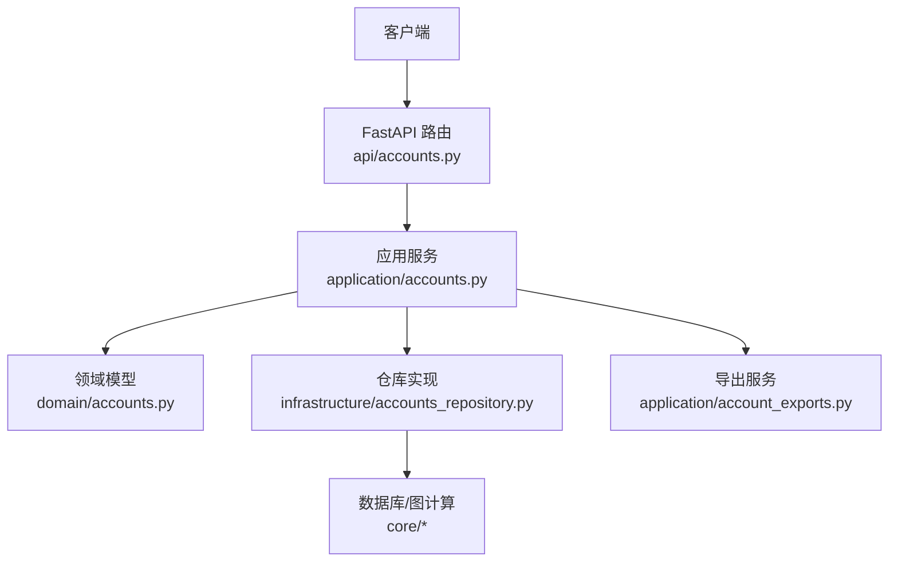
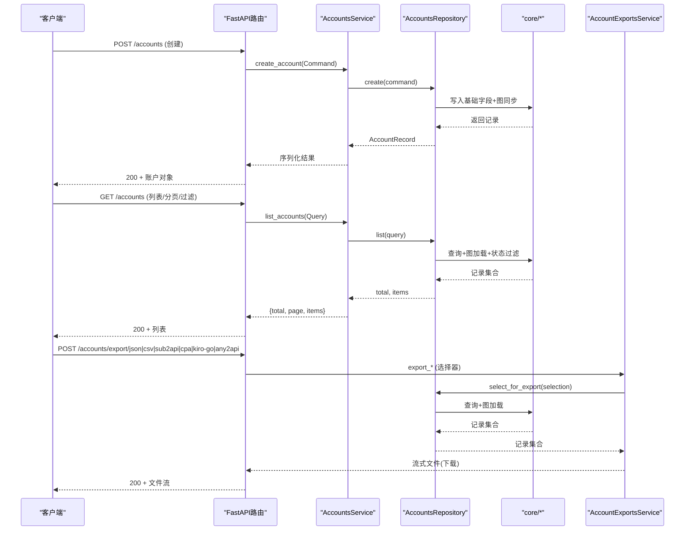
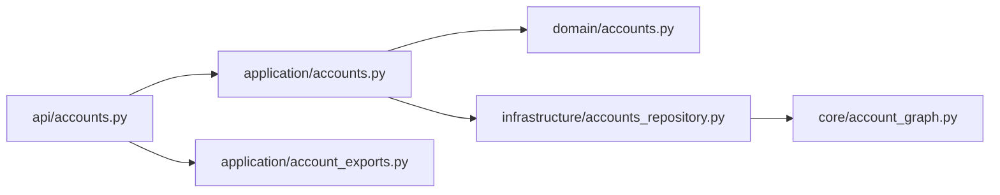
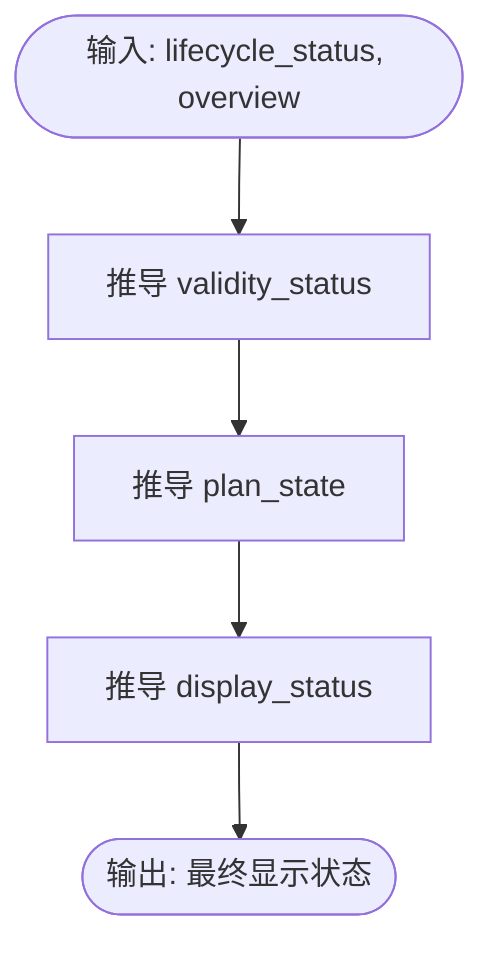

# 账户管理API

<cite>
**本文引用的文件**
- [api/accounts.py](file://api/accounts.py)
- [application/accounts.py](file://application/accounts.py)
- [domain/accounts.py](file://domain/accounts.py)
- [infrastructure/accounts_repository.py](file://infrastructure/accounts_repository.py)
- [application/account_exports.py](file://application/account_exports.py)
- [core/account_graph.py](file://core/account_graph.py)
- [tests/test_api_accounts.py](file://tests/test_api_accounts.py)
</cite>

## 目录
1. [简介](#简介)
2. [项目结构](#项目结构)
3. [核心组件](#核心组件)
4. [架构总览](#架构总览)
5. [详细接口说明](#详细接口说明)
6. [依赖关系分析](#依赖关系分析)
7. [性能与批量操作建议](#性能与批量操作建议)
8. [故障排查指南](#故障排查指南)
9. [结论](#结论)
10. [附录：数据模型与状态流转](#附录：数据模型与状态流转)

## 简介
本文件为“账户管理API”的完整技术文档，覆盖账户的创建、查询、更新、删除、统计、导入导出等全部RESTful端点。文档包含每个接口的HTTP方法、URL路径、请求参数、响应格式、状态码与错误处理；提供账户数据模型定义（AccountCreateRequest、AccountUpdateRequest、AccountExportSelection等）、查询条件与分页配置；并给出常见使用场景的请求/响应示例、账户状态流转说明以及批量操作的最佳实践与性能优化建议。

## 项目结构
账户管理功能采用分层设计：
- API层：FastAPI路由与请求/响应模型定义
- 应用服务层：业务编排、序列化、导入解析
- 领域模型：统一的数据结构与查询命令
- 基础设施层：数据库访问、图计算、统计与导出

图表来源
- [api/accounts.py:14-239](file://api/accounts.py#L14-L239)
- [application/accounts.py:42-160](file://application/accounts.py#L42-L160)
- [domain/accounts.py:8-100](file://domain/accounts.py#L8-L100)
- [infrastructure/accounts_repository.py:98-392](file://infrastructure/accounts_repository.py#L98-L392)
- [application/account_exports.py:21-507](file://application/account_exports.py#L21-L507)

章节来源
- [api/accounts.py:14-239](file://api/accounts.py#L14-L239)
- [application/accounts.py:42-160](file://application/accounts.py#L42-L160)
- [domain/accounts.py:8-100](file://domain/accounts.py#L8-L100)
- [infrastructure/accounts_repository.py:98-392](file://infrastructure/accounts_repository.py#L98-L392)
- [application/account_exports.py:21-507](file://application/account_exports.py#L21-L507)

## 核心组件
- 路由与请求模型：定义账户CRUD、统计、导入导出等端点及入参校验
- 应用服务：封装业务逻辑，负责序列化、导入解析、统计聚合
- 领域模型：AccountRecord、AccountQuery、AccountCreateCommand、AccountUpdateCommand、AccountImportLine、AccountStats、AccountExportSelection
- 仓库实现：数据库读写、图同步、统计计算、CSV导出
- 导出服务：多格式导出（JSON/CSV/ZIP），适配ChatGPT、Kiro-Go、Any2API等

章节来源
- [api/accounts.py:19-63](file://api/accounts.py#L19-L63)
- [application/accounts.py:42-160](file://application/accounts.py#L42-L160)
- [domain/accounts.py:8-100](file://domain/accounts.py#L8-L100)
- [infrastructure/accounts_repository.py:98-392](file://infrastructure/accounts_repository.py#L98-L392)
- [application/account_exports.py:21-507](file://application/account_exports.py#L21-L507)

## 架构总览
账户管理的调用链从FastAPI路由开始，进入应用服务，再委托到仓库进行数据持久化与图计算，必要时通过导出服务生成不同格式的产物。

图表来源
- [api/accounts.py:79-239](file://api/accounts.py#L79-L239)
- [application/accounts.py:46-134](file://application/accounts.py#L46-L134)
- [infrastructure/accounts_repository.py:111-162](file://infrastructure/accounts_repository.py#L111-L162)
- [application/account_exports.py:334-507](file://application/account_exports.py#L334-L507)

## 详细接口说明

### 通用约定
- 基础路径：/api/accounts
- 认证：当前路由未内置鉴权，请结合网关或前置中间件控制访问
- 字符集：UTF-8
- 时间格式：ISO 8601（UTC）

### 1) 创建账户
- 方法：POST
- 路径：/api/accounts
- 请求体：AccountCreateRequest
  - platform: string（必填）
  - email: string（必填）
  - password: string（必填）
  - user_id: string（可选）
  - lifecycle_status: string（默认"registered"）
  - overview: dict（可选）
  - credentials: dict（可选）
  - provider_accounts: list[dict]（可选）
  - provider_resources: list[dict]（可选）
  - primary_token: string（可选）
  - cashier_url: string（可选）
  - region: string（可选）
  - trial_end_time: int（可选）
- 响应：200，返回序列化的账户对象（含id、platform、email、password、user_id、primary_token、trial_end_time、cashier_url、lifecycle_status、validity_status、plan_state、plan_name、display_status、overview、display_summary、credentials、provider_accounts、provider_resources、created_at、updated_at）
- 错误：
  - 400：请求体验证失败（由框架自动返回）
- 示例（示意）：
  - 请求体：{"platform":"chatgpt","email":"u@example.com","password":"Pass123"}
  - 响应：{"id":1,"platform":"chatgpt","email":"u@example.com",...}

章节来源
- [api/accounts.py:19-33](file://api/accounts.py#L19-L33)
- [api/accounts.py:90-93](file://api/accounts.py#L90-L93)
- [application/accounts.py:58-60](file://application/accounts.py#L58-L60)
- [domain/accounts.py:41-56](file://domain/accounts.py#L41-L56)
- [infrastructure/accounts_repository.py:164-196](file://infrastructure/accounts_repository.py#L164-L196)

### 2) 查询账户列表
- 方法：GET
- 路径：/api/accounts
- 查询参数：
  - platform: string（可选，精确匹配）
  - status: string（可选，基于显示/生命周期/套餐/有效性综合过滤）
  - email: string（可选，模糊匹配）
  - page: int（默认1）
  - page_size: int（默认20）
- 响应：200，{total, page, items[]}
- 错误：无特殊错误
- 示例：
  - GET /api/accounts?platform=chatgpt&status=subscribed&page=1&page_size=20

章节来源
- [api/accounts.py:79-88](file://api/accounts.py#L79-L88)
- [application/accounts.py:46-52](file://application/accounts.py#L46-L52)
- [infrastructure/accounts_repository.py:111-133](file://infrastructure/accounts_repository.py#L111-L133)

### 3) 获取单个账户
- 方法：GET
- 路径：/api/accounts/{account_id}
- 路径参数：account_id: int
- 响应：200，账户对象
- 错误：
  - 404：账号不存在

章节来源
- [api/accounts.py:217-223](file://api/accounts.py#L217-L223)
- [application/accounts.py:54-57](file://application/accounts.py#L54-L57)
- [infrastructure/accounts_repository.py:135-142](file://infrastructure/accounts_repository.py#L135-L142)

### 4) 更新账户
- 方法：PATCH
- 路径：/api/accounts/{account_id}
- 请求体：AccountUpdateRequest
  - password: string（可选）
  - user_id: string（可选）
  - lifecycle_status: string（可选）
  - overview: dict（可选）
  - credentials: dict（可选）
  - provider_accounts: list[dict]（可选）
  - provider_resources: list[dict]（可选）
  - replace_provider_accounts: bool（默认False）
  - replace_provider_resources: bool（默认False）
  - primary_token: string（可选）
  - cashier_url: string（可选）
  - region: string（可选）
  - trial_end_time: int（可选）
- 响应：200，更新后的账户对象
- 错误：
  - 404：账号不存在

章节来源
- [api/accounts.py:35-49](file://api/accounts.py#L35-L49)
- [api/accounts.py:225-230](file://api/accounts.py#L225-L230)
- [application/accounts.py:61-63](file://application/accounts.py#L61-L63)
- [domain/accounts.py:58-73](file://domain/accounts.py#L58-L73)
- [infrastructure/accounts_repository.py:198-232](file://infrastructure/accounts_repository.py#L198-L232)

### 5) 删除账户
- 方法：DELETE
- 路径：/api/accounts/{account_id}
- 响应：200，{"ok": true/false}
- 错误：
  - 404：账号不存在

章节来源
- [api/accounts.py:233-239](file://api/accounts.py#L233-L239)
- [application/accounts.py:65-67](file://application/accounts.py#L65-L67)
- [infrastructure/accounts_repository.py:234-242](file://infrastructure/accounts_repository.py#L234-L242)

### 6) 账户统计
- 方法：GET
- 路径：/api/accounts/stats
- 响应：200，{total, by_platform, by_status, by_lifecycle_status, by_plan_state, by_validity_status, by_display_status}

章节来源
- [api/accounts.py:95-98](file://api/accounts.py#L95-L98)
- [application/accounts.py:124-134](file://application/accounts.py#L124-L134)
- [infrastructure/accounts_repository.py:334-358](file://infrastructure/accounts_repository.py#L334-L358)

### 7) 批量导出CSV（全量/按平台/按状态）
- 方法：GET
- 路径：/api/accounts/export
- 查询参数：
  - platform: string（可选）
  - status: string（可选）
- 响应：200，text/csv文件流，文件名固定为accounts.csv

章节来源
- [api/accounts.py:100-108](file://api/accounts.py#L100-L108)
- [application/accounts.py:121-123](file://application/accounts.py#L121-L123)
- [infrastructure/accounts_repository.py:360-392](file://infrastructure/accounts_repository.py#L360-L392)

### 8) 批量导出JSON（ChatGPT）
- 方法：POST
- 路径：/api/accounts/export/json
- 请求体：BatchExportRequest
  - platform: string（默认"chatgpt"）
  - ids: list[int]（可选）
  - select_all: bool（可选）
  - status_filter: string（可选）
  - search_filter: string（可选）
- 响应：200，application/json文件流，文件名带时间戳
- 错误：
  - 400：仅支持ChatGPT平台导出时抛出

章节来源
- [api/accounts.py:56-63](file://api/accounts.py#L56-L63)
- [api/accounts.py:110-125](file://api/accounts.py#L110-L125)
- [application/account_exports.py:334-363](file://application/account_exports.py#L334-L363)
- [application/account_exports.py:465-470](file://application/account_exports.py#L465-L470)

### 9) 批量导出CSV（ChatGPT）
- 方法：POST
- 路径：/api/accounts/export/csv
- 请求体：同“批量导出JSON”
- 响应：200，text/csv文件流

章节来源
- [api/accounts.py:127-142](file://api/accounts.py#L127-L142)
- [application/account_exports.py:365-413](file://application/account_exports.py#L365-L413)

### 10) 批量导出Sub2API（单账号JSON或多账号ZIP）
- 方法：POST
- 路径：/api/accounts/export/sub2api
- 请求体：同“批量导出JSON”
- 响应：
  - 单账号：application/json，文件名{email}_sub2api.json
  - 多账号：application/zip，压缩包内每个账号一个JSON

章节来源
- [api/accounts.py:144-159](file://api/accounts.py#L144-L159)
- [application/account_exports.py:415-438](file://application/account_exports.py#L415-L438)

### 11) 批量导出CPA（单账号JSON或多账号ZIP）
- 方法：POST
- 路径：/api/accounts/export/cpa
- 请求体：同“批量导出JSON”
- 响应：
  - 单账号：application/json，文件名{email}.json
  - 多账号：application/zip，压缩包内每个账号一个JSON

章节来源
- [api/accounts.py:161-176](file://api/accounts.py#L161-L176)
- [application/account_exports.py:440-463](file://application/account_exports.py#L440-L463)

### 12) 批量导出Kiro-Go配置
- 方法：POST
- 路径：/api/accounts/export/kiro-go
- 请求体：同“批量导出JSON”，但内部会强制platform="kiro"
- 响应：200，application/json文件流，文件名带时间戳

章节来源
- [api/accounts.py:178-193](file://api/accounts.py#L178-L193)
- [application/account_exports.py:475-492](file://application/account_exports.py#L475-L492)

### 13) 批量导出Any2API（多平台）
- 方法：POST
- 路径：/api/accounts/export/any2api
- 请求体：同“批量导出JSON”
- 响应：200，application/json文件流，文件名带时间戳

章节来源
- [api/accounts.py:195-210](file://api/accounts.py#L195-L210)
- [application/account_exports.py:494-507](file://application/account_exports.py#L494-L507)

### 14) 批量导入账户
- 方法：POST
- 路径：/api/accounts/import
- 请求体：ImportRequest
  - platform: string（必填）
  - lines: list[string]（必填，每行一条）
- 支持格式：
  - CSV首行包含email和password列，后续行为数据行
  - 文本行：email password [extra_json_or_string]
  - extra可包含overview/summary/credentials/provider_accounts/provider_resources等键
- 响应：200，{"created": int}

章节来源
- [api/accounts.py:51-54](file://api/accounts.py#L51-L54)
- [api/accounts.py:212-215](file://api/accounts.py#L212-L215)
- [application/accounts.py:68-120](file://application/accounts.py#L68-L120)
- [infrastructure/accounts_repository.py:244-332](file://infrastructure/accounts_repository.py#L244-L332)

## 依赖关系分析
- 路由依赖应用服务，应用服务依赖领域模型与仓库
- 仓库依赖数据库模型与图计算模块，负责状态派生、凭证归一化、统计计算
- 导出服务依赖仓库的选择查询，将记录转换为各平台兼容格式

图表来源
- [api/accounts.py:14-239](file://api/accounts.py#L14-L239)
- [application/accounts.py:42-160](file://application/accounts.py#L42-L160)
- [domain/accounts.py:8-100](file://domain/accounts.py#L8-L100)
- [infrastructure/accounts_repository.py:98-392](file://infrastructure/accounts_repository.py#L98-L392)
- [application/account_exports.py:21-507](file://application/account_exports.py#L21-L507)

章节来源
- [api/accounts.py:14-239](file://api/accounts.py#L14-L239)
- [application/accounts.py:42-160](file://application/accounts.py#L42-L160)
- [domain/accounts.py:8-100](file://domain/accounts.py#L8-L100)
- [infrastructure/accounts_repository.py:98-392](file://infrastructure/accounts_repository.py#L98-L392)
- [application/account_exports.py:21-507](file://application/account_exports.py#L21-L507)

## 性能与批量操作建议
- 列表分页：合理设置page与page_size，避免过大page_size导致内存压力
- 过滤策略：优先使用platform与email精确/模糊过滤减少扫描范围；status过滤在内存中进行，尽量配合其他条件缩小数据集
- 批量导出：
  - JSON/CSV：适合中小规模数据；超大数据建议使用分批次导出或后台任务
  - ZIP导出：当账号数量较多时，自动打包为ZIP，注意客户端解压能力
- 导入性能：
  - 大批量导入时，建议分批提交lines，避免单次请求过大
  - 利用CSV首行识别模式，提升解析效率
- 状态计算：
  - 图计算与凭证归一化在仓库层完成，频繁读取会触发图加载，建议缓存热点账户或降低刷新频率

[本节为通用指导，不直接分析具体文件]

## 故障排查指南
- 404 账号不存在：
  - 检查account_id是否正确
  - 确认是否已创建或未被删除
- 400 参数错误：
  - 检查请求体验证字段是否符合模型定义
  - 导出JSON时仅支持ChatGPT平台，非ChatGPT会返回400
- 导入失败：
  - 检查lines格式是否符合CSV或文本行规则
  - 确保email包含@且不含空格
- 状态过滤无效：
  - 确认status值与系统状态映射一致（如subscribed/trial/expired/invalid/registered）
  - 注意status过滤在内存中执行，需先满足platform/email等条件

章节来源
- [api/accounts.py:122-124](file://api/accounts.py#L122-L124)
- [api/accounts.py:217-239](file://api/accounts.py#L217-L239)
- [application/account_exports.py:465-470](file://application/account_exports.py#L465-L470)
- [application/accounts.py:68-120](file://application/accounts.py#L68-L120)

## 结论
账户管理API提供了完整的CRUD、统计、导入导出能力，并通过领域模型与仓库层实现了状态派生、凭证归一化与多格式导出。遵循分页与过滤最佳实践，可在保证性能的同时满足大规模账户管理需求。

[本节为总结性内容，不直接分析具体文件]

## 附录：数据模型与状态流转

### 数据模型概览
- AccountCreateRequest：创建账户的请求体
- AccountUpdateRequest：更新账户的请求体
- AccountQuery：列表查询条件
- AccountRecord：账户记录（含展示摘要、凭证、资源等）
- AccountImportLine：导入行解析结果
- AccountStats：统计信息
- AccountExportSelection：批量导出选择器

章节来源
- [api/accounts.py:19-63](file://api/accounts.py#L19-L63)
- [domain/accounts.py:8-100](file://domain/accounts.py#L8-L100)

### 状态流转与显示状态推导
- 生命周期状态：registered/trial/subscribed/expired/invalid等
- 有效性状态：valid/invalid/unknown
- 套餐状态：free/trial/eligible/subscribed/expired/unknown
- 显示状态：根据有效性、套餐、生命周期综合推导，用于前端展示与过滤

图表来源
- [core/account_graph.py:151-199](file://core/account_graph.py#L151-L199)

章节来源
- [core/account_graph.py:151-199](file://core/account_graph.py#L151-L199)

### 常见使用场景示例（示意）
- 创建账户：POST /api/accounts，返回账户对象
- 查询列表：GET /api/accounts?platform=chatgpt&status=subscribed&page=1&page_size=20
- 更新账户：PATCH /api/accounts/{id}，更新密码或生命周期状态
- 删除账户：DELETE /api/accounts/{id}
- 导出CSV：GET /api/accounts/export?platform=chatgpt
- 导出JSON：POST /api/accounts/export/json，select_all=true或指定ids
- 导入账户：POST /api/accounts/import，lines包含CSV或文本行

章节来源
- [tests/test_api_accounts.py:29-125](file://tests/test_api_accounts.py#L29-L125)