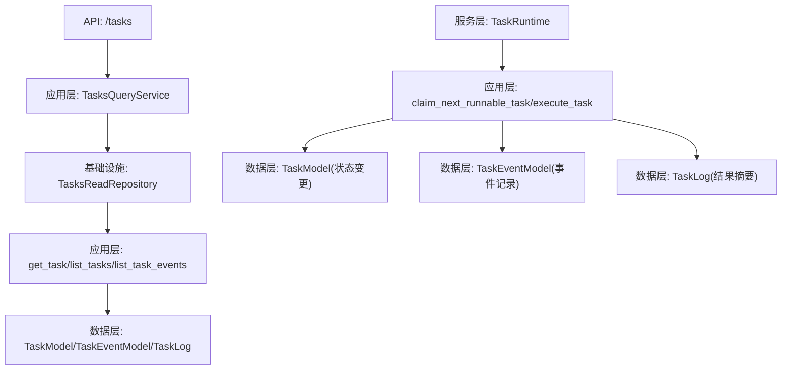
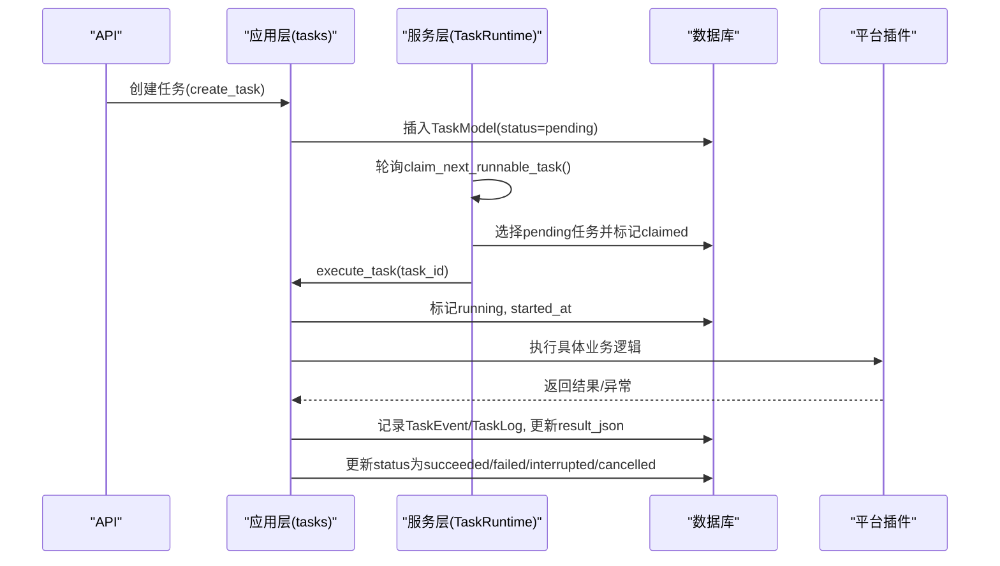
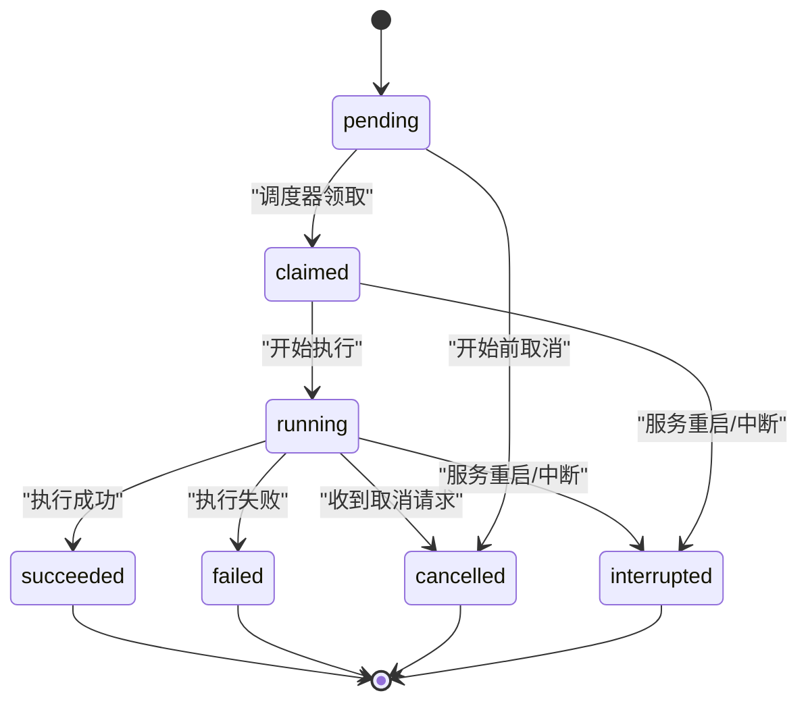
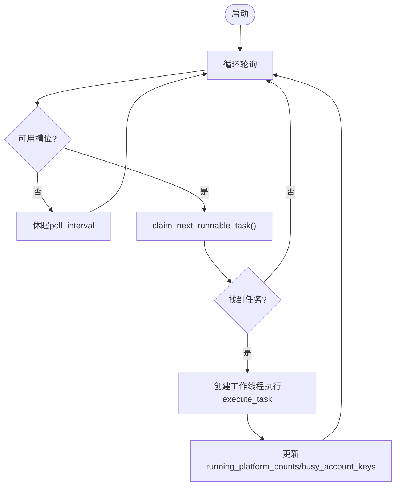
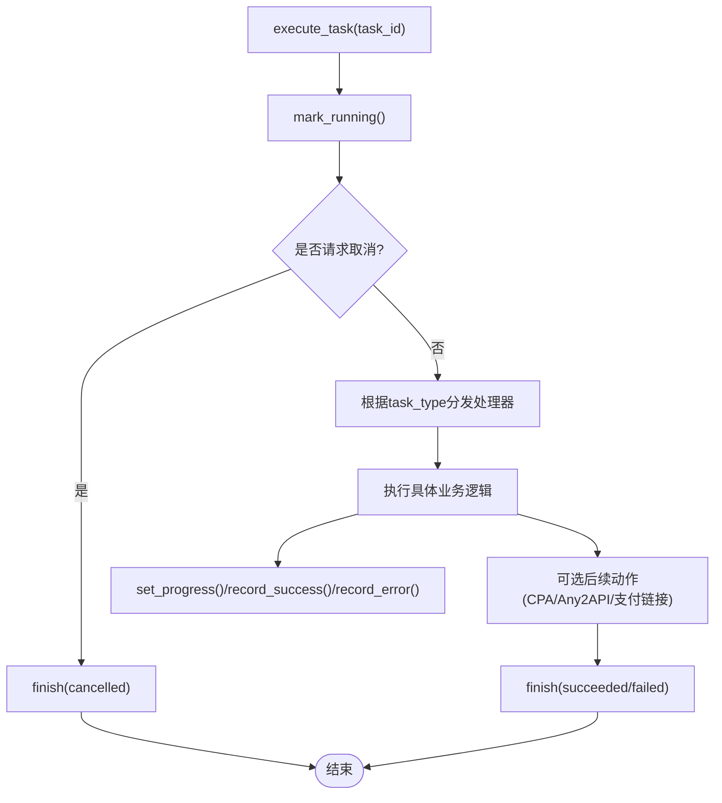
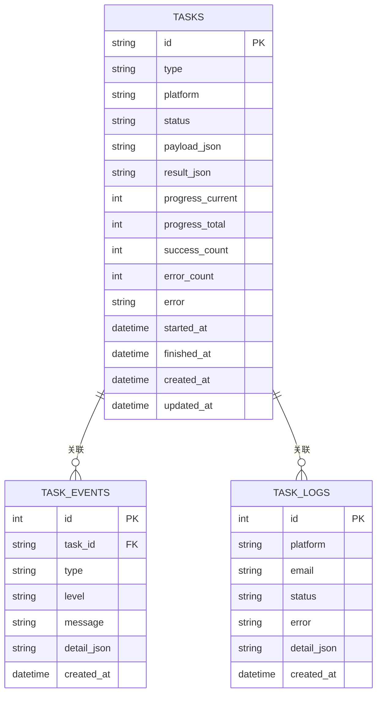
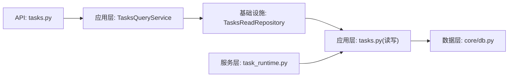

# 任务生命周期管理

<cite>
**本文引用的文件**
- [application/tasks.py](file://application/tasks.py)
- [services/task_runtime.py](file://services/task_runtime.py)
- [api/tasks.py](file://api/tasks.py)
- [application/tasks_query.py](file://application/tasks_query.py)
- [infrastructure/tasks_read_repository.py](file://infrastructure/tasks_read_repository.py)
- [core/db.py](file://core/db.py)
- [domain/tasks.py](file://domain/tasks.py)
</cite>

## 目录
1. [简介](#简介)
2. [项目结构](#项目结构)
3. [核心组件](#核心组件)
4. [架构总览](#架构总览)
5. [详细组件分析](#详细组件分析)
6. [依赖关系分析](#依赖关系分析)
7. [性能与并发](#性能与并发)
8. [故障排查指南](#故障排查指南)
9. [结论](#结论)
10. [附录：查询与配置最佳实践](#附录：查询与配置最佳实践)

## 简介
本文件系统性说明任务的完整生命周期管理机制，覆盖从创建、状态初始化、调度排队、执行分配、执行监控、结果处理到状态更新的端到端流程。文档包含任务状态流转图（pending/claimed/running/succeeded/failed/interrupted/cancel_requested/cancelled）、持久化存储设计（数据库表结构与一致性策略）、查询与过滤使用指南（按平台、账户、状态等维度），以及任务生命周期的配置选项与最佳实践。

## 项目结构
围绕任务生命周期，系统由以下层次组成：
- API 层：对外暴露任务列表、详情与事件查询接口
- 应用层：任务编排、执行器分发、日志与进度更新、结果聚合
- 服务层：任务运行时（TaskRuntime）负责轮询、并发控制与工作线程管理
- 基础设施层：只读仓库封装查询，领域模型统一数据结构
- 数据层：SQLModel 模型定义任务、事件、日志等持久化结构

**图表来源**
- [api/tasks.py:11-29](file://api/tasks.py#L11-L29)
- [application/tasks_query.py:7-41](file://application/tasks_query.py#L7-L41)
- [infrastructure/tasks_read_repository.py:46-57](file://infrastructure/tasks_read_repository.py#L46-L57)
- [application/tasks.py:174-278](file://application/tasks.py#L174-L278)
- [core/db.py:229-288](file://core/db.py#L229-L288)
- [services/task_runtime.py:18-101](file://services/task_runtime.py#L18-L101)

**章节来源**
- [api/tasks.py:11-29](file://api/tasks.py#L11-L29)
- [application/tasks_query.py:7-41](file://application/tasks_query.py#L7-L41)
- [infrastructure/tasks_read_repository.py:46-57](file://infrastructure/tasks_read_repository.py#L46-L57)
- [application/tasks.py:174-278](file://application/tasks.py#L174-L278)
- [core/db.py:229-288](file://core/db.py#L229-L288)
- [services/task_runtime.py:18-101](file://services/task_runtime.py#L18-L101)

## 核心组件
- 任务模型与事件模型：定义任务、事件、日志的持久化结构
- 任务创建与序列化：统一创建任务、序列化返回结构
- 任务调度与执行：TaskRuntime 轮询可用任务，分发给工作线程执行
- 任务日志与进度：TaskLogger 提供运行期日志、进度、错误与结果写入
- 查询服务：TasksQueryService 提供任务与事件的只读查询

**章节来源**
- [core/db.py:229-288](file://core/db.py#L229-L288)
- [application/tasks.py:174-278](file://application/tasks.py#L174-L278)
- [services/task_runtime.py:18-101](file://services/task_runtime.py#L18-L101)
- [application/tasks_query.py:7-41](file://application/tasks_query.py#L7-L41)

## 架构总览
任务生命周期分为如下阶段：
- 创建与初始化：调用 create_task 生成任务并落库，初始状态为 pending
- 调度与排队：TaskRuntime 启动后持续轮询 claim_next_runnable_task，挑选可执行任务
- 执行分配：将任务交给工作线程执行 execute_task，标记 claimed/running
- 执行监控：通过 TaskLogger 记录日志、进度、错误；支持取消请求检查
- 结果处理：根据执行结果设置 success/error_count/result_data，必要时触发后续动作（如自动上传 CPA、推送 Any2API）
- 状态更新：最终状态写入 succeeded/failed/interrupted/cancelled，并记录结束时间

**图表来源**
- [application/tasks.py:174-198](file://application/tasks.py#L174-L198)
- [application/tasks.py:340-368](file://application/tasks.py#L340-L368)
- [application/tasks.py:570-595](file://application/tasks.py#L570-L595)
- [services/task_runtime.py:47-85](file://services/task_runtime.py#L47-L85)
- [core/db.py:229-288](file://core/db.py#L229-L288)

## 详细组件分析

### 任务状态机与流转
任务状态包括：
- pending：等待调度
- claimed：已被调度器领取
- running：正在执行
- succeeded：成功完成
- failed：执行失败
- interrupted：服务重启或中断
- cancel_requested：已请求取消
- cancelled：已取消

关键转换条件：
- pending → claimed：调度器 claim_next_runnable_task 在并发限制下选取最早创建的 pending 任务
- claimed → running：execute_task 开始执行时标记 running
- running → succeeded：无错误且满足成功条件
- running → failed：出现错误且无成功结果
- running → cancelled：检测到 cancel_requested 或在开始前被取消
- 任意非终态 → interrupted：服务重启时将非终态任务标记为 interrupted

**图表来源**
- [application/tasks.py:31-50](file://application/tasks.py#L31-L50)
- [application/tasks.py:318-338](file://application/tasks.py#L318-L338)
- [application/tasks.py:340-368](file://application/tasks.py#L340-L368)
- [application/tasks.py:385-457](file://application/tasks.py#L385-L457)
- [application/tasks.py:296-316](file://application/tasks.py#L296-L316)

**章节来源**
- [application/tasks.py:31-50](file://application/tasks.py#L31-L50)
- [application/tasks.py:296-338](file://application/tasks.py#L296-L338)
- [application/tasks.py:340-368](file://application/tasks.py#L340-L368)
- [application/tasks.py:385-457](file://application/tasks.py#L385-L457)

### 任务创建与状态初始化
- 创建任务：create_task 生成唯一 task_id，写入 TaskModel，初始 status=pending，初始化 result_json 与 progress
- 注册类任务：create_register_task 设置 type=register，platform 与 count，progress_total=count
- 账号检查任务：create_account_check_task 指定 account_id，progress_total=1
- 批量检查任务：create_account_check_all_task 指定 platform 与 limit，progress_total=limit
- 平台动作任务：create_platform_action_task 指定 platform、action_id、params

**章节来源**
- [application/tasks.py:174-240](file://application/tasks.py#L174-L240)

### 调度排队与执行分配
- 调度器：TaskRuntime._loop 维护最大并行数与每平台并行上限，周期性调用 claim_next_runnable_task
- 任务领取：claim_next_runnable_task 按 created_at 排序选择 pending 任务，考虑平台并行与账户占用，标记 claimed 并返回任务信息
- 执行：_run_task 调用 execute_task，完成后清理工作线程

**图表来源**
- [services/task_runtime.py:47-85](file://services/task_runtime.py#L47-L85)
- [application/tasks.py:340-368](file://application/tasks.py#L340-L368)

**章节来源**
- [services/task_runtime.py:18-101](file://services/task_runtime.py#L18-L101)
- [application/tasks.py:340-368](file://application/tasks.py#L340-L368)

### 执行监控与结果处理
- 执行入口：execute_task 根据 task_type 路由到具体处理器（注册、账号检查、平台动作）
- 日志与进度：TaskLogger.mark_running/set_progress/record_success/record_error/add_cashier_url/set_result_data/finish
- 结果处理：注册成功后可能触发自动上传 CPA、推送 Any2API、生成升级链接等后续动作
- 取消支持：is_cancel_requested 检查 cancel_requested 状态，适时终止执行并标记 cancelled

**图表来源**
- [application/tasks.py:570-595](file://application/tasks.py#L570-L595)
- [application/tasks.py:371-457](file://application/tasks.py#L371-L457)
- [application/tasks.py:692-869](file://application/tasks.py#L692-L869)

**章节来源**
- [application/tasks.py:570-595](file://application/tasks.py#L570-L595)
- [application/tasks.py:371-457](file://application/tasks.py#L371-L457)
- [application/tasks.py:692-869](file://application/tasks.py#L692-L869)

### 状态更新与一致性保证
- 原子更新：_mutate_task 使用线程锁与事务提交，确保同一任务的状态更新串行化
- 时间戳：started_at/finished_at/updated_at 在关键节点更新，便于追踪生命周期
- 事件记录：append_task_event 记录状态变更与日志，level 区分 info/warning/error
- 服务重启恢复：mark_incomplete_tasks_interrupted 在服务启动时将非终态任务标记为 interrupted，避免悬挂任务

**章节来源**
- [application/tasks.py:78-98](file://application/tasks.py#L78-L98)
- [application/tasks.py:281-293](file://application/tasks.py#L281-L293)
- [application/tasks.py:296-316](file://application/tasks.py#L296-L316)

### 持久化存储机制
- 任务表：tasks（id、type、platform、status、payload_json、result_json、progress_current/total、success_count、error_count、error、started_at、finished_at、created_at、updated_at）
- 事件表：task_events（id、task_id、type、level、message、detail_json、created_at）
- 日志表：task_logs（id、platform、email、status、error、detail_json、created_at）
- 同步策略：每次状态变更与事件写入均通过 Session 提交，保证事务一致性
- 数据一致性：_mutate_task 对任务进行加锁更新，避免并发写冲突；服务重启时统一修复悬挂任务

**图表来源**
- [core/db.py:229-288](file://core/db.py#L229-L288)

**章节来源**
- [core/db.py:229-288](file://core/db.py#L229-L288)

### 查询与过滤功能
- 列表查询：GET /tasks?platform=&status=&page=&page_size=
- 详情查询：GET /tasks/{task_id}
- 事件查询：GET /tasks/{task_id}/events?since=&limit=

查询服务内部通过 TasksReadRepository 调用 application.tasks 的 list_tasks/get_task/list_task_events，并按 domain 模型序列化返回。

**章节来源**
- [api/tasks.py:11-29](file://api/tasks.py#L11-L29)
- [application/tasks_query.py:7-41](file://application/tasks_query.py#L7-L41)
- [infrastructure/tasks_read_repository.py:46-57](file://infrastructure/tasks_read_repository.py#L46-L57)
- [application/tasks.py:249-278](file://application/tasks.py#L249-L278)

## 依赖关系分析
- API 层依赖应用层查询服务
- 应用层依赖基础设施只读仓库与数据层模型
- 服务层依赖应用层执行与调度函数
- 数据层提供统一的 SQLModel 模型与引擎

**图表来源**
- [api/tasks.py:11-29](file://api/tasks.py#L11-L29)
- [application/tasks_query.py:7-41](file://application/tasks_query.py#L7-L41)
- [infrastructure/tasks_read_repository.py:46-57](file://infrastructure/tasks_read_repository.py#L46-L57)
- [application/tasks.py:174-278](file://application/tasks.py#L174-L278)
- [core/db.py:229-288](file://core/db.py#L229-L288)
- [services/task_runtime.py:18-101](file://services/task_runtime.py#L18-L101)

**章节来源**
- [api/tasks.py:11-29](file://api/tasks.py#L11-L29)
- [application/tasks_query.py:7-41](file://application/tasks_query.py#L7-L41)
- [infrastructure/tasks_read_repository.py:46-57](file://infrastructure/tasks_read_repository.py#L46-L57)
- [application/tasks.py:174-278](file://application/tasks.py#L174-L278)
- [core/db.py:229-288](file://core/db.py#L229-L288)
- [services/task_runtime.py:18-101](file://services/task_runtime.py#L18-L101)

## 性能与并发
- 并发控制：TaskRuntime 支持 max_parallel_tasks 与 max_parallel_per_platform，避免单平台过载
- 轮询间隔：poll_interval 控制调度器轮询频率，平衡响应性与开销
- 任务粒度：注册任务支持 concurrency 参数，内部使用线程池并行执行多个账号注册
- 资源复用：注册任务内共享 mailbox 实例，减少重复初始化开销
- 代理与健康：注册过程中使用代理池，成功/失败反馈用于健康评估

**章节来源**
- [services/task_runtime.py:18-101](file://services/task_runtime.py#L18-L101)
- [application/tasks.py:692-869](file://application/tasks.py#L692-L869)

## 故障排查指南
- 悬挂任务：服务重启后非终态任务会被标记为 interrupted，可通过事件查看原因
- 取消任务：request_cancel 将 pending/claimed/running 任务置为 cancel_requested，执行中检测后转为 cancelled
- 执行失败：record_error 会累积 errors 列表，finish 时记录 final_status 与 error
- 进度异常：set_progress 需配合 progress_total，确保前端显示正确
- 查询为空：list_tasks 支持 platform/status 过滤，确认参数是否正确

**章节来源**
- [application/tasks.py:296-338](file://application/tasks.py#L296-L338)
- [application/tasks.py:393-457](file://application/tasks.py#L393-L457)
- [application/tasks.py:249-278](file://application/tasks.py#L249-L278)

## 结论
本系统实现了完整的任务生命周期管理，涵盖创建、调度、执行、监控、结果处理与状态更新全流程。通过严格的并发控制、事务一致性与事件记录，保障了任务执行的可靠性与可观测性。查询接口提供了灵活的过滤能力，便于运维与前端展示。建议在生产环境中合理配置并发与轮询参数，并结合事件与日志进行问题定位与性能优化。

## 附录：查询与配置最佳实践
- 查询维度
  - 按平台：list_tasks(platform="chatgpt")
  - 按状态：list_tasks(status="running")
  - 分页：page/page_size 控制返回数量
  - 事件：list_task_events(task_id, since, limit) 增量获取
- 配置选项
  - TaskRuntime.max_parallel_tasks：全局最大并行任务数
  - TaskRuntime.max_parallel_per_platform：单平台最大并行任务数
  - TaskRuntime.poll_interval：调度器轮询间隔
  - 注册任务 concurrency：单次注册任务的最大并发数
- 最佳实践
  - 合理设置并发与轮询间隔，避免资源争用
  - 使用事件与日志进行全链路追踪
  - 定期清理已完成任务的事件与日志，控制存储增长
  - 结合代理池与邮箱实例复用，提升执行效率

**章节来源**
- [application/tasks.py:249-278](file://application/tasks.py#L249-L278)
- [services/task_runtime.py:18-101](file://services/task_runtime.py#L18-L101)
- [application/tasks.py:692-869](file://application/tasks.py#L692-L869)