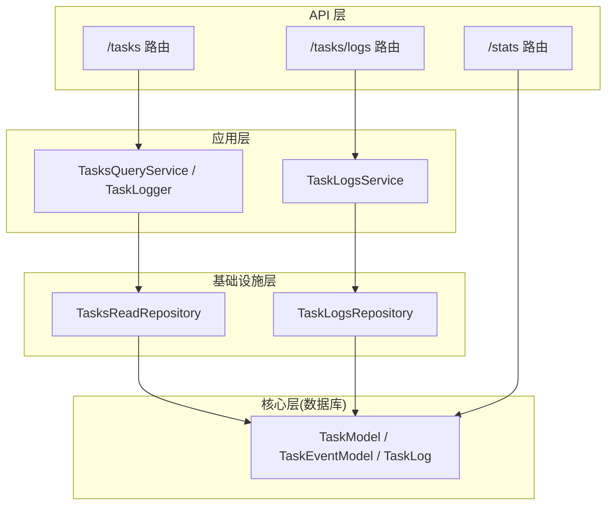
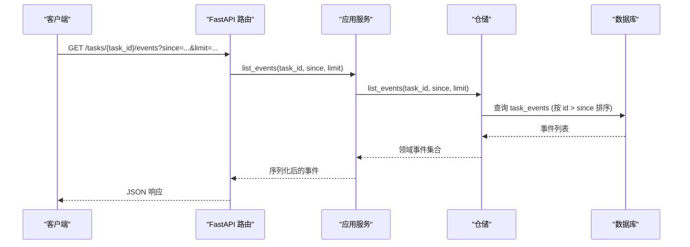
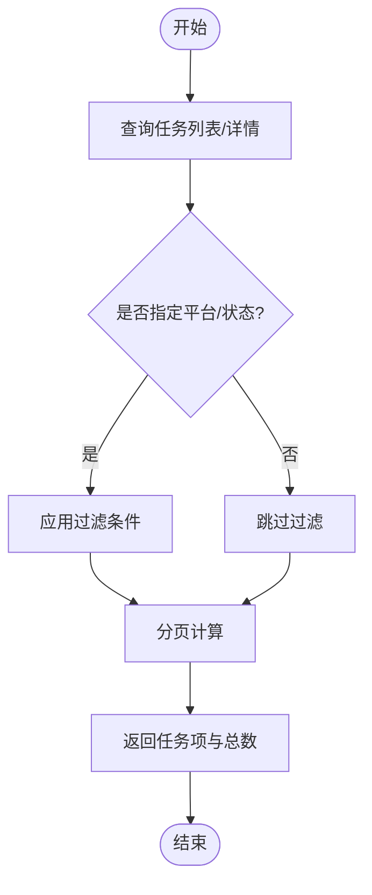
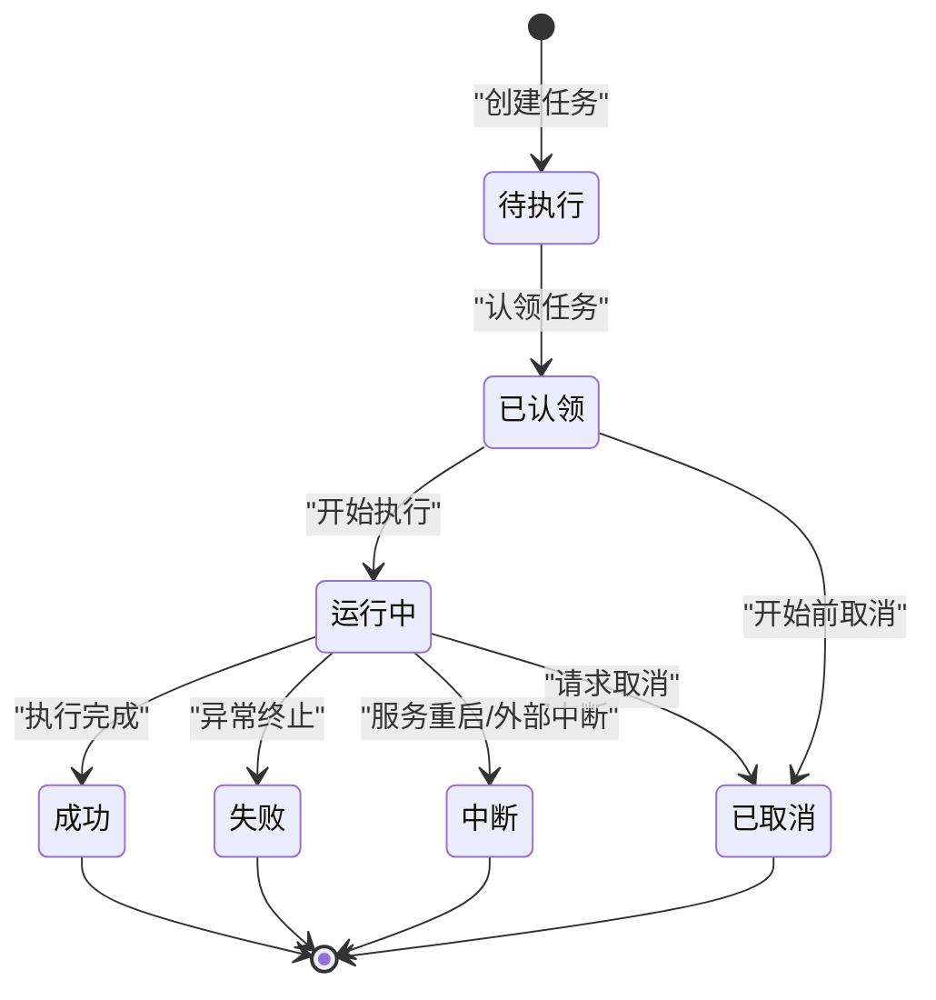
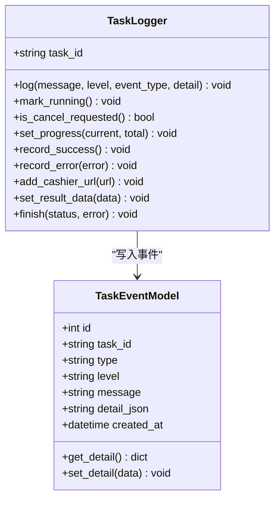
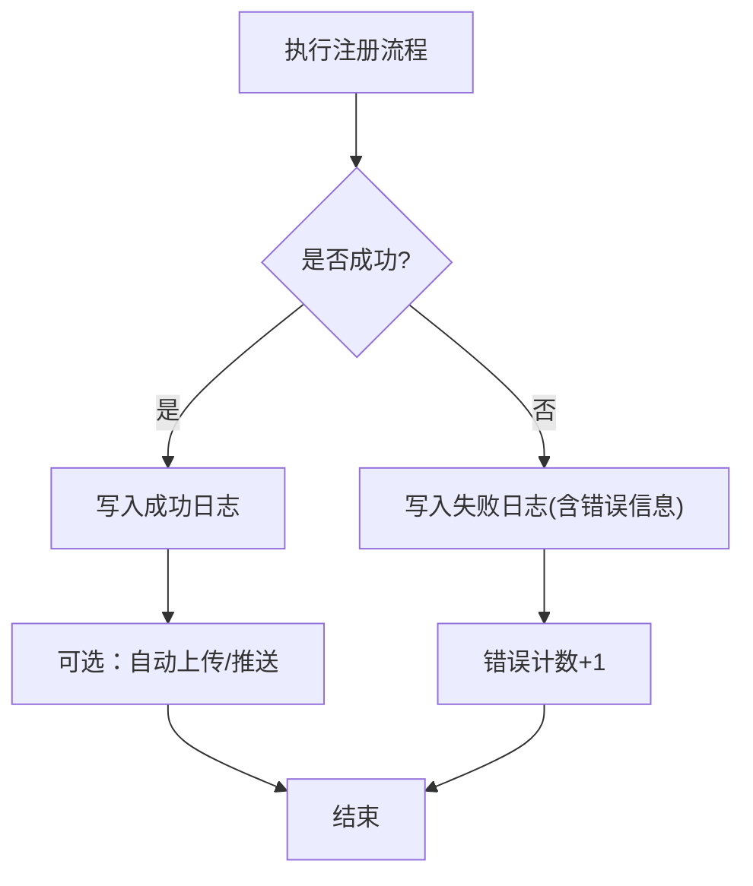
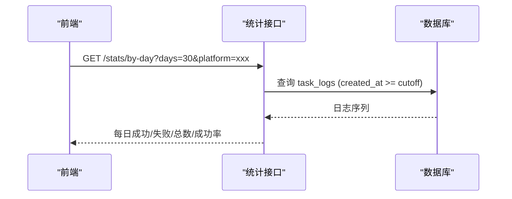
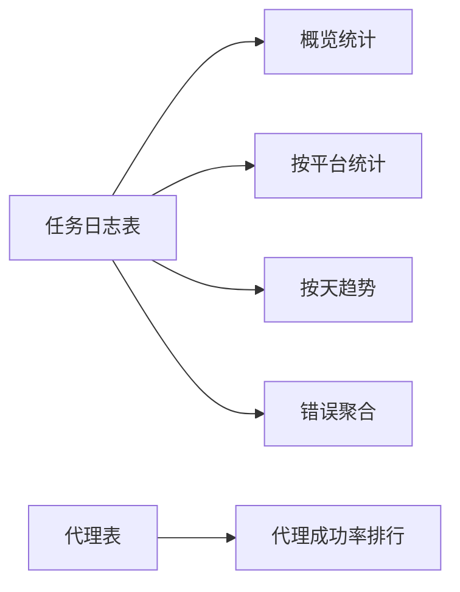
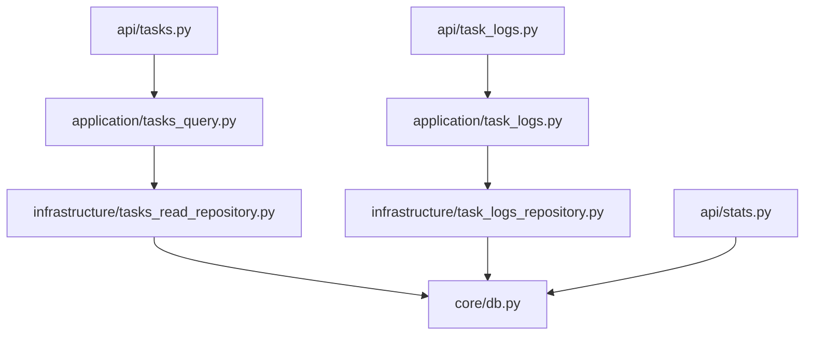

# 任务监控与日志记录

<cite>
**本文引用的文件**
- [api/tasks.py](file://api/tasks.py)
- [api/task_logs.py](file://api/task_logs.py)
- [api/stats.py](file://api/stats.py)
- [application/tasks.py](file://application/tasks.py)
- [application/task_logs.py](file://application/task_logs.py)
- [application/tasks_query.py](file://application/tasks_query.py)
- [infrastructure/tasks_read_repository.py](file://infrastructure/tasks_read_repository.py)
- [infrastructure/task_logs_repository.py](file://infrastructure/task_logs_repository.py)
- [core/db.py](file://core/db.py)
- [domain/tasks.py](file://domain/tasks.py)
- [domain/task_logs.py](file://domain/task_logs.py)
</cite>

## 目录
1. [简介](#简介)
2. [项目结构](#项目结构)
3. [核心组件](#核心组件)
4. [架构总览](#架构总览)
5. [详细组件分析](#详细组件分析)
6. [依赖关系分析](#依赖关系分析)
7. [性能考虑](#性能考虑)
8. [故障排查指南](#故障排查指南)
9. [结论](#结论)
10. [附录](#附录)

## 简介
本系统提供任务监控与日志记录能力，覆盖任务生命周期、实时进度跟踪、执行时间统计、结构化事件日志、按平台/状态的查询与分页、以及基于注册成功率的仪表盘统计。通过数据库持久化的任务模型、事件模型和日志模型，结合服务层与仓储层，形成清晰的“API -> 服务 -> 仓储 -> 数据库”的分层架构，便于扩展与维护。

## 项目结构
- API 层：暴露任务列表、任务详情、任务事件、任务日志、统计概览等接口。
- 应用层：封装任务创建、执行、状态变更、事件追加、序列化等核心业务逻辑。
- 领域层：定义任务摘要、进度、事件及日志记录的领域数据模型。
- 基础设施层：实现任务与日志的读取仓储，对接数据库模型。
- 核心层：定义数据库表模型（任务、事件、日志、代理等）与引擎配置。

**图表来源**
- [api/tasks.py:11-29](file://api/tasks.py#L11-L29)
- [api/task_logs.py:11-13](file://api/task_logs.py#L11-L13)
- [api/stats.py:18-151](file://api/stats.py#L18-L151)
- [application/tasks_query.py:7-68](file://application/tasks_query.py#L7-L68)
- [application/task_logs.py:7-28](file://application/task_logs.py#L7-L28)
- [infrastructure/tasks_read_repository.py:46-57](file://infrastructure/tasks_read_repository.py#L46-L57)
- [infrastructure/task_logs_repository.py:27-40](file://infrastructure/task_logs_repository.py#L27-L40)
- [core/db.py:229-288](file://core/db.py#L229-L288)

**章节来源**
- [api/tasks.py:1-30](file://api/tasks.py#L1-L30)
- [api/task_logs.py:1-14](file://api/task_logs.py#L1-L14)
- [api/stats.py:1-152](file://api/stats.py#L1-L152)
- [application/tasks_query.py:1-68](file://application/tasks_query.py#L1-L68)
- [application/task_logs.py:1-29](file://application/task_logs.py#L1-L29)
- [infrastructure/tasks_read_repository.py:1-57](file://infrastructure/tasks_read_repository.py#L1-L57)
- [infrastructure/task_logs_repository.py:1-41](file://infrastructure/task_logs_repository.py#L1-L41)
- [core/db.py:229-288](file://core/db.py#L229-L288)

## 核心组件
- 任务模型与事件模型：用于持久化任务状态、进度、结果与事件日志。
- 任务执行与状态机：支持任务创建、认领、运行、取消、完成等状态流转。
- 任务日志器：为每个任务提供结构化事件写入与进度更新。
- 查询服务：统一的任务与事件查询、序列化与分页。
- 日志仓储：按平台分页查询任务日志。
- 统计接口：提供全局概览、按平台、按天趋势、代理成功率、错误聚合等指标。

**章节来源**
- [core/db.py:229-288](file://core/db.py#L229-L288)
- [application/tasks.py:174-293](file://application/tasks.py#L174-L293)
- [application/tasks_query.py:7-68](file://application/tasks_query.py#L7-L68)
- [application/task_logs.py:7-28](file://application/task_logs.py#L7-L28)
- [infrastructure/task_logs_repository.py:27-40](file://infrastructure/task_logs_repository.py#L27-L40)
- [api/stats.py:18-151](file://api/stats.py#L18-L151)

## 架构总览
系统采用分层设计：
- API 路由负责接收请求并调用对应服务。
- 应用服务封装任务生命周期管理与事件追加、进度更新、结果收集。
- 仓储层负责将领域对象映射到数据库模型并进行查询。
- 数据库层使用 SQLModel 管理任务、事件、日志等表结构。

**图表来源**
- [api/tasks.py:24-29](file://api/tasks.py#L24-L29)
- [application/tasks_query.py:25-41](file://application/tasks_query.py#L25-L41)
- [infrastructure/tasks_read_repository.py:55-57](file://infrastructure/tasks_read_repository.py#L55-L57)
- [core/db.py:273-288](file://core/db.py#L273-L288)

## 详细组件分析

### 任务状态查询与实时进度跟踪
- 任务列表与详情：支持按平台、状态过滤与分页；返回进度、成功数、错误数、错误列表、结果数据、时间戳等。
- 实时事件：通过 since 增量拉取事件，适合前端轮询或长连接推送。
- 进度跟踪：任务执行过程中可设置当前进度与总量，序列化时生成可读标签。

**图表来源**
- [application/tasks.py:249-264](file://application/tasks.py#L249-L264)
- [application/tasks_query.py:17-23](file://application/tasks_query.py#L17-L23)
- [infrastructure/tasks_read_repository.py:51-53](file://infrastructure/tasks_read_repository.py#L51-L53)

**章节来源**
- [api/tasks.py:11-29](file://api/tasks.py#L11-L29)
- [application/tasks.py:129-171](file://application/tasks.py#L129-L171)
- [application/tasks_query.py:11-41](file://application/tasks_query.py#L11-L41)
- [infrastructure/tasks_read_repository.py:46-57](file://infrastructure/tasks_read_repository.py#L46-L57)
- [core/db.py:241-288](file://core/db.py#L241-L288)

### 任务执行与状态机
- 任务类型：注册、账号检查、批量账号检查、平台动作。
- 状态流转：pending -> claimed -> running -> succeeded/failed/interrupted/cancelled。
- 并发控制：按平台并行度限制与账户键占用避免冲突。
- 取消机制：支持在 pending/running 阶段请求取消，并在启动后立即取消的场景处理。

**图表来源**
- [application/tasks.py:31-50](file://application/tasks.py#L31-L50)
- [application/tasks.py:318-338](file://application/tasks.py#L318-L338)
- [application/tasks.py:340-368](file://application/tasks.py#L340-L368)
- [application/tasks.py:570-595](file://application/tasks.py#L570-L595)

**章节来源**
- [application/tasks.py:174-240](file://application/tasks.py#L174-L240)
- [application/tasks.py:318-368](file://application/tasks.py#L318-L368)
- [application/tasks.py:570-595](file://application/tasks.py#L570-L595)

### 日志记录机制（结构化事件与级别）
- 事件模型：包含任务ID、类型、级别、消息、详情JSON、创建时间。
- 写入方式：通过 TaskLogger 统一追加事件，同时输出控制台日志。
- 级别控制：info/warning/error 等，用于区分正常、警告与错误信息。
- 结果与错误累积：记录成功次数、错误次数、错误列表、支付链接等。

**图表来源**
- [core/db.py:273-288](file://core/db.py#L273-L288)
- [application/tasks.py:371-457](file://application/tasks.py#L371-L457)

**章节来源**
- [application/tasks.py:161-171](file://application/tasks.py#L161-L171)
- [application/tasks.py:281-293](file://application/tasks.py#L281-L293)
- [application/tasks.py:371-457](file://application/tasks.py#L371-L457)
- [core/db.py:273-288](file://core/db.py#L273-L288)

### 日志文件管理（任务级日志表）
- 任务日志表：记录每次注册尝试的结果（成功/失败）、错误信息与详情。
- 查询服务：支持按平台分页查询，返回基础字段与详情。
- 用途：用于统计成功率、错误聚合、趋势分析等。

**图表来源**
- [application/tasks.py:768-789](file://application/tasks.py#L768-L789)
- [application/task_logs.py:11-28](file://application/task_logs.py#L11-L28)
- [infrastructure/task_logs_repository.py:27-40](file://infrastructure/task_logs_repository.py#L27-L40)
- [core/db.py:229-239](file://core/db.py#L229-L239)

**章节来源**
- [application/task_logs.py:7-28](file://application/task_logs.py#L7-L28)
- [infrastructure/task_logs_repository.py:27-40](file://infrastructure/task_logs_repository.py#L27-L40)
- [core/db.py:229-239](file://core/db.py#L229-L239)

### 性能指标收集与分析（CPU/内存/效率）
- 当前系统未内置 CPU/内存采集模块；可通过外部监控（如进程监控、容器指标）集成。
- 执行效率指标：可从任务时间戳计算耗时（started_at/finished_at），结合成功率与错误率评估。
- 建议：在任务执行前后记录时间戳，对外暴露耗时统计接口；或使用系统探针收集资源指标。

[本节为通用指导，不直接分析具体文件]

### 日志查询与过滤（按任务ID、时间范围、级别）
- 任务事件：支持按任务ID与 since ID 增量拉取，适合实时滚动查看。
- 任务日志：支持按平台分页查询，可在上层增加时间范围与级别过滤。
- 统计接口：提供按天趋势、错误聚合、代理成功率等，辅助定位问题。

**图表来源**
- [api/stats.py:83-107](file://api/stats.py#L83-L107)
- [core/db.py:229-239](file://core/db.py#L229-L239)

**章节来源**
- [api/tasks.py:24-29](file://api/tasks.py#L24-L29)
- [application/tasks_query.py:25-41](file://application/tasks_query.py#L25-L41)
- [api/stats.py:18-151](file://api/stats.py#L18-L151)

### 监控数据的可视化与报表
- 仪表盘：概览显示总注册数、成功率、账号状态分布、账号总数。
- 趋势分析：按天统计注册趋势，支持按平台筛选。
- 异常检测：最近失败错误聚合，帮助快速定位高频问题。
- 代理排行：展示代理成功率与活跃度，辅助优化网络策略。

**图表来源**
- [api/stats.py:18-151](file://api/stats.py#L18-L151)
- [core/db.py:229-239](file://core/db.py#L229-L239)
- [core/db.py:291-301](file://core/db.py#L291-L301)

**章节来源**
- [api/stats.py:18-151](file://api/stats.py#L18-L151)

## 依赖关系分析
- API 路由依赖应用服务进行业务处理。
- 应用服务依赖仓储层进行数据访问与序列化。
- 仓储层依赖核心数据库模型进行查询与转换。
- 统计接口直接访问数据库模型进行聚合计算。

**图表来源**
- [api/tasks.py:1-30](file://api/tasks.py#L1-L30)
- [api/task_logs.py:1-14](file://api/task_logs.py#L1-L14)
- [application/tasks_query.py:1-68](file://application/tasks_query.py#L1-L68)
- [application/task_logs.py:1-29](file://application/task_logs.py#L1-L29)
- [infrastructure/tasks_read_repository.py:1-57](file://infrastructure/tasks_read_repository.py#L1-L57)
- [infrastructure/task_logs_repository.py:1-41](file://infrastructure/task_logs_repository.py#L1-L41)
- [api/stats.py:1-152](file://api/stats.py#L1-L152)
- [core/db.py:229-301](file://core/db.py#L229-L301)

**章节来源**
- [api/tasks.py:1-30](file://api/tasks.py#L1-L30)
- [api/task_logs.py:1-14](file://api/task_logs.py#L1-L14)
- [api/stats.py:1-152](file://api/stats.py#L1-L152)
- [application/tasks_query.py:1-68](file://application/tasks_query.py#L1-L68)
- [application/task_logs.py:1-29](file://application/task_logs.py#L1-L29)
- [infrastructure/tasks_read_repository.py:1-57](file://infrastructure/tasks_read_repository.py#L1-L57)
- [infrastructure/task_logs_repository.py:1-41](file://infrastructure/task_logs_repository.py#L1-L41)
- [core/db.py:229-301](file://core/db.py#L229-L301)

## 性能考虑
- 分页与限流：列表与事件查询均限制 page_size，防止大结果集拖慢系统。
- 增量拉取：事件查询支持 since 参数，减少重复传输。
- 并发控制：任务执行按平台并行度限制，避免资源争用。
- 数据库索引：任务与事件表对常用查询字段建立索引，提升检索性能。
- 建议：对高并发场景引入缓存层（如 Redis）缓存热点统计；对长时间任务引入异步队列与重试机制。

[本节为通用指导，不直接分析具体文件]

## 故障排查指南
- 任务不存在：查询任务详情时若返回空，需检查任务ID是否正确或任务是否已被清理。
- 未知任务类型：执行入口对未知类型直接标记失败，需检查任务创建时的类型参数。
- 服务重启中断：非终态任务在服务重启后会被标记为中断，并追加警告事件。
- 错误聚合：通过统计接口获取最近失败错误，按错误信息分组，定位高频问题。
- 代理问题：代理成功率排行可识别低效代理，调整策略或剔除失效代理。

**章节来源**
- [api/tasks.py:16-21](file://api/tasks.py#L16-L21)
- [application/tasks.py:591-595](file://application/tasks.py#L591-L595)
- [application/tasks.py:296-316](file://application/tasks.py#L296-L316)
- [api/stats.py:135-151](file://api/stats.py#L135-L151)
- [api/stats.py:110-132](file://api/stats.py#L110-L132)

## 结论
本系统以清晰的分层架构实现了任务监控与日志记录的核心能力：任务状态查询、实时事件拉取、结构化日志与级别控制、按平台/时间的统计与趋势分析。通过数据库持久化与分页/增量查询，满足实时监控与报表需求。未来可扩展 CPU/内存指标采集、更细粒度的日志过滤与告警机制，进一步提升运维效率与稳定性。

## 附录
- 关键数据模型
  - 任务模型：包含任务ID、类型、平台、状态、负载、结果、进度、时间戳等。
  - 事件模型：包含任务ID、类型、级别、消息、详情、时间戳。
  - 日志模型：包含平台、邮箱、状态、错误、详情、时间戳。
- 推荐实践
  - 使用 TaskLogger 统一记录事件与进度，确保一致性。
  - 利用 since 参数实现高效的事件增量同步。
  - 通过统计接口构建仪表盘，关注成功率、错误聚合与代理表现。
  - 在高并发场景下合理设置并行度与分页上限，避免数据库压力过大。

**章节来源**
- [core/db.py:229-301](file://core/db.py#L229-L301)
- [application/tasks.py:129-171](file://application/tasks.py#L129-L171)
- [application/tasks.py:371-457](file://application/tasks.py#L371-L457)
- [api/stats.py:18-151](file://api/stats.py#L18-L151)