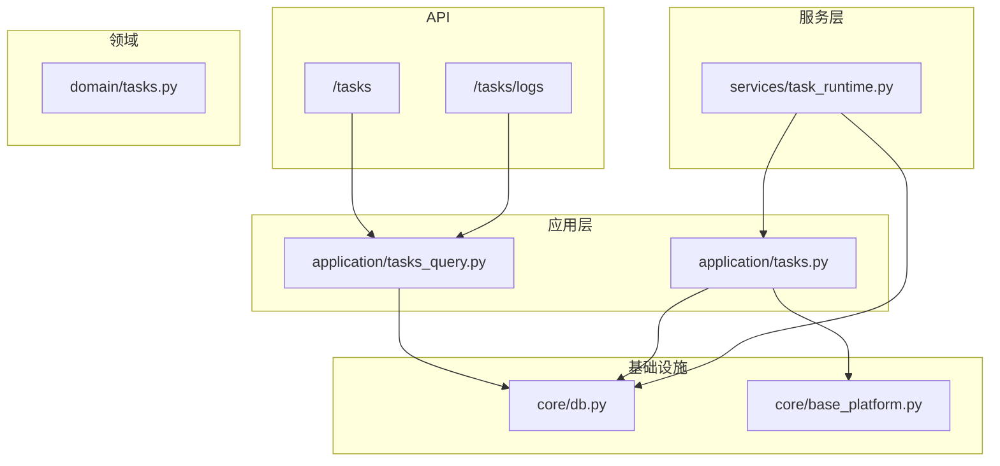
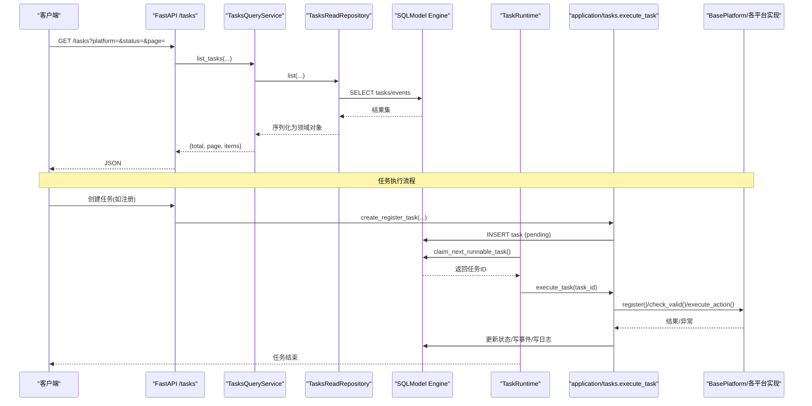
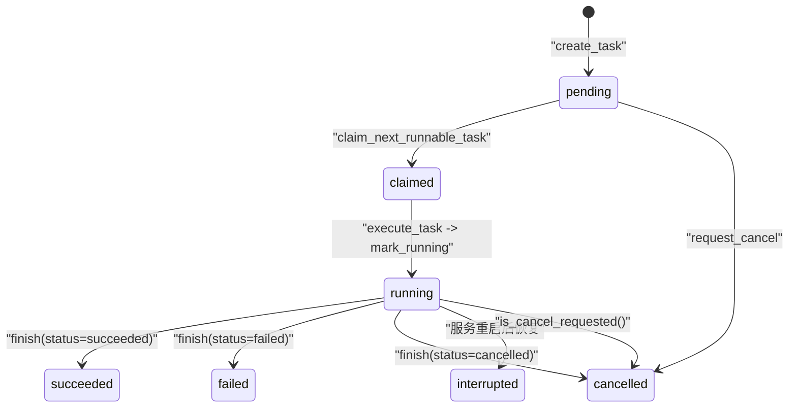
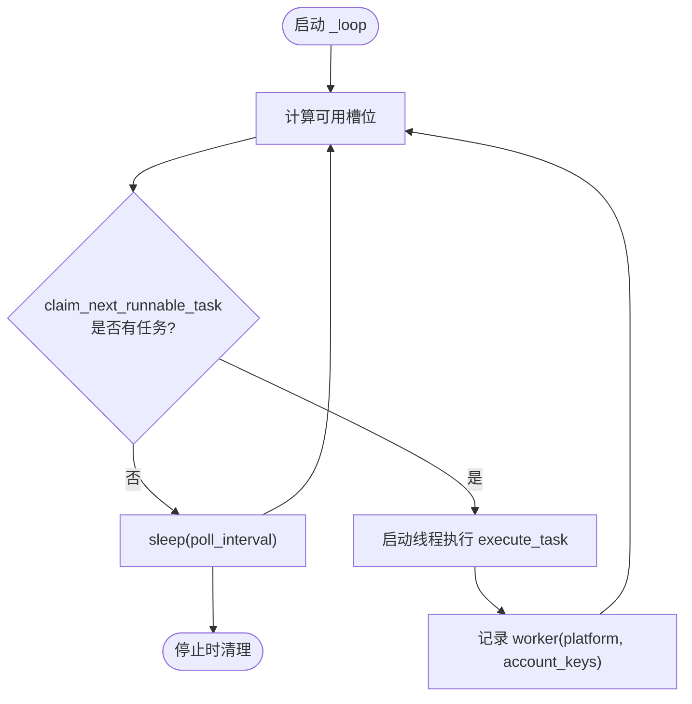
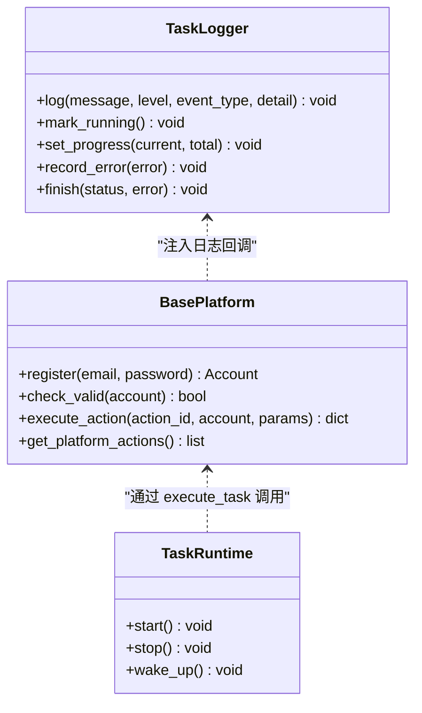
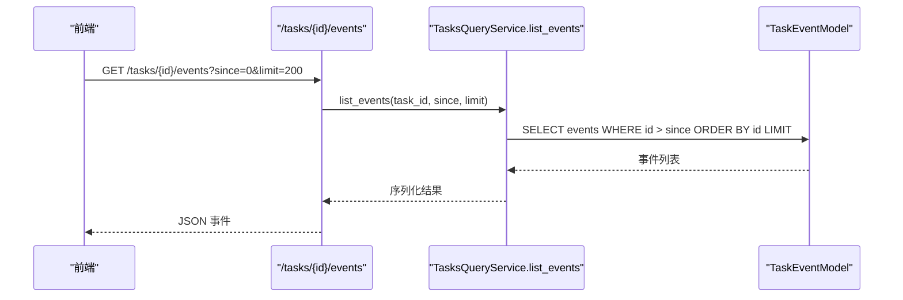
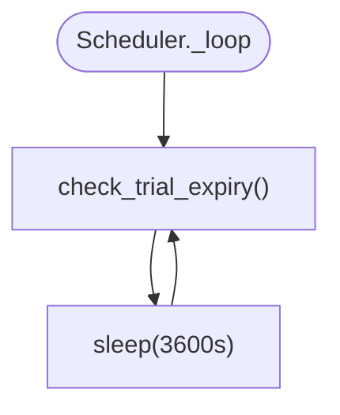
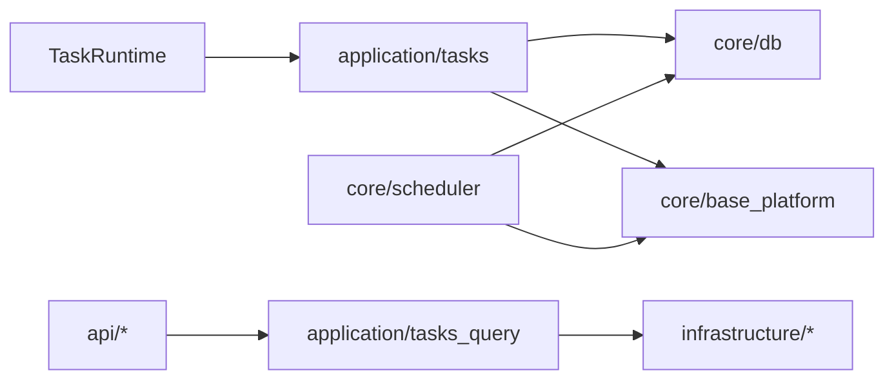

# 任务调度系统

<cite>
**本文引用的文件**
- [core/scheduler.py](file://core/scheduler.py)
- [services/task_runtime.py](file://services/task_runtime.py)
- [application/tasks.py](file://application/tasks.py)
- [application/tasks_query.py](file://application/tasks_query.py)
- [api/tasks.py](file://api/tasks.py)
- [api/task_logs.py](file://api/task_logs.py)
- [infrastructure/task_logs_repository.py](file://infrastructure/task_logs_repository.py)
- [domain/tasks.py](file://domain/tasks.py)
- [core/db.py](file://core/db.py)
- [core/base_platform.py](file://core/base_platform.py)
</cite>

## 目录
1. [简介](#简介)
2. [项目结构](#项目结构)
3. [核心组件](#核心组件)
4. [架构总览](#架构总览)
5. [详细组件分析](#详细组件分析)
6. [依赖关系分析](#依赖关系分析)
7. [性能与并发](#性能与并发)
8. [故障排查指南](#故障排查指南)
9. [结论](#结论)
10. [附录：配置与扩展指南](#附录：配置与扩展指南)

## 简介
本系统提供面向多平台的异步任务调度能力，覆盖任务的创建、调度、执行、监控、完成全生命周期。通过持久化的任务队列与线程池工作器，实现任务优先级（按创建时间）、并发控制（全局与平台维度）、资源管理（代理、邮箱、短信等）。系统内置状态机、事件日志流式输出、错误记录与重试策略，并提供查询与监控接口，便于前端或外部系统集成。

## 项目结构
围绕“任务”的核心代码分布在以下层次：
- API 层：暴露任务列表、详情、事件流、日志查询等 HTTP 接口
- 应用层：任务编排、持久化、状态流转、事件写入、执行器构建
- 服务层：单进程任务运行时，负责拉取可执行任务并分发到工作线程
- 基础设施层：数据库模型、仓库读写、配置与平台能力
- 领域层：任务进度、摘要、事件的数据结构定义

图表来源
- [api/tasks.py:11-29](file://api/tasks.py#L11-L29)
- [api/task_logs.py:11-13](file://api/task_logs.py#L11-L13)
- [application/tasks_query.py:7-68](file://application/tasks_query.py#L7-L68)
- [application/tasks.py:174-293](file://application/tasks.py#L174-L293)
- [services/task_runtime.py:18-101](file://services/task_runtime.py#L18-L101)
- [core/db.py:25-200](file://core/db.py#L25-L200)
- [core/base_platform.py:44-200](file://core/base_platform.py#L44-L200)

章节来源
- [api/tasks.py:11-29](file://api/tasks.py#L11-L29)
- [api/task_logs.py:11-13](file://api/task_logs.py#L11-L13)
- [application/tasks_query.py:7-68](file://application/tasks_query.py#L7-L68)
- [application/tasks.py:174-293](file://application/tasks.py#L174-L293)
- [services/task_runtime.py:18-101](file://services/task_runtime.py#L18-L101)
- [core/db.py:25-200](file://core/db.py#L25-L200)
- [core/base_platform.py:44-200](file://core/base_platform.py#L44-L200)

## 核心组件
- 任务运行时 TaskRuntime：单进程内的工作者管理器，维护最大并行度、每平台并行度、轮询间隔；从数据库领取任务并启动工作线程执行。
- 任务编排 application/tasks：任务创建、状态机、事件日志、执行器构建、具体任务类型处理器（注册、账号检查、平台动作）。
- 查询服务 TasksQueryService：统一序列化任务与事件，供 API 使用。
- 定时调度 Scheduler：周期性检测试用到期与批量账号有效性检查。
- 数据模型 core/db：任务、事件、账户、概览等 SQLModel 模型及引擎。
- 领域模型 domain/tasks：TaskProgress、TaskSummary、TaskEvent 数据结构。

章节来源
- [services/task_runtime.py:18-101](file://services/task_runtime.py#L18-L101)
- [application/tasks.py:174-293](file://application/tasks.py#L174-L293)
- [application/tasks_query.py:7-68](file://application/tasks_query.py#L7-L68)
- [core/scheduler.py:19-115](file://core/scheduler.py#L19-L115)
- [core/db.py:25-200](file://core/db.py#L25-L200)
- [domain/tasks.py:8-44](file://domain/tasks.py#L8-L44)

## 架构总览
下图展示从 API 到执行器的完整调用链，以及任务在数据库中的状态流转。

图表来源
- [api/tasks.py:11-29](file://api/tasks.py#L11-L29)
- [application/tasks_query.py:17-41](file://application/tasks_query.py#L17-L41)
- [application/tasks.py:174-293](file://application/tasks.py#L174-L293)
- [application/tasks.py:340-368](file://application/tasks.py#L340-L368)
- [application/tasks.py:570-595](file://application/tasks.py#L570-L595)
- [core/base_platform.py:124-160](file://core/base_platform.py#L124-L160)

## 详细组件分析

### 任务生命周期与状态机
- 状态定义：pending、claimed、running、succeeded、failed、interrupted、cancel_requested、cancelled。
- 关键操作：
  - 创建任务：写入任务表，初始状态 pending，附带 payload、progress_total、result seed。
  - 认领任务：claim_next_runnable_task 按创建时间顺序挑选 pending 任务，考虑平台并发限制与账号键冲突，将状态改为 claimed 并记录 started_at。
  - 执行任务：execute_task 根据任务类型分派到具体处理器，标记 running，持续写事件与进度。
  - 完成：finish 设置最终状态、finished_at、error（如有），并追加状态事件。
  - 取消：request_cancel 将 pending 直接置 cancelled，或将运行中任务置 cancel_requested，由执行器主动检查并退出。
  - 中断：服务重启时 mark_incomplete_tasks_interrupted 将非终态任务置 interrupted 并记录告警事件。

图表来源
- [application/tasks.py:31-50](file://application/tasks.py#L31-L50)
- [application/tasks.py:174-198](file://application/tasks.py#L174-L198)
- [application/tasks.py:296-316](file://application/tasks.py#L296-L316)
- [application/tasks.py:318-338](file://application/tasks.py#L318-L338)
- [application/tasks.py:340-368](file://application/tasks.py#L340-L368)
- [application/tasks.py:385-457](file://application/tasks.py#L385-L457)

章节来源
- [application/tasks.py:31-50](file://application/tasks.py#L31-L50)
- [application/tasks.py:174-198](file://application/tasks.py#L174-L198)
- [application/tasks.py:296-316](file://application/tasks.py#L296-L316)
- [application/tasks.py:318-338](file://application/tasks.py#L318-L338)
- [application/tasks.py:340-368](file://application/tasks.py#L340-L368)
- [application/tasks.py:385-457](file://application/tasks.py#L385-L457)

### 异步任务队列与工作线程
- 工作循环：TaskRuntime._loop 周期唤醒，计算可用槽位，调用 claim_next_runnable_task 获取任务，为每个任务启动独立线程执行 execute_task。
- 并发控制：
  - 全局并发：max_parallel_tasks 限制同时运行的任务数。
  - 平台并发：max_parallel_per_platform 限制同一平台同时运行的任务数。
  - 账号键冲突：account_keys 用于避免同一账号被多个任务同时处理。
- 资源回收：_reap_workers 清理已结束的线程引用。

图表来源
- [services/task_runtime.py:18-101](file://services/task_runtime.py#L18-L101)
- [application/tasks.py:340-368](file://application/tasks.py#L340-L368)

章节来源
- [services/task_runtime.py:18-101](file://services/task_runtime.py#L18-L101)
- [application/tasks.py:340-368](file://application/tasks.py#L340-L368)

### 任务执行器与平台集成
- 执行入口：execute_task 根据任务类型路由到注册、账号检查、平台动作等处理器。
- 平台实例构建：_build_platform_instance 根据 executor_type、captcha_solver、proxy、extra 构造 RegisterConfig，选择 mailbox/oauth/browser 注册流程，注入 logger。
- 注册任务：支持并发提交、失败重试（HeroSMS 号码复用场景）、代理健康上报、自动后续动作（Windsurf 支付链接生成、CPA 上传、Any2API 推送）。
- 账号检查：单账号与批量检查，更新账户概览与生命周期状态。
- 平台动作：通过 PlatformRuntime 执行平台自定义能力。

图表来源
- [core/base_platform.py:44-200](file://core/base_platform.py#L44-L200)
- [application/tasks.py:500-532](file://application/tasks.py#L500-L532)
- [application/tasks.py:570-595](file://application/tasks.py#L570-L595)
- [application/tasks.py:692-870](file://application/tasks.py#L692-L870)
- [application/tasks.py:872-953](file://application/tasks.py#L872-L953)
- [services/task_runtime.py:18-101](file://services/task_runtime.py#L18-L101)

章节来源
- [core/base_platform.py:44-200](file://core/base_platform.py#L44-L200)
- [application/tasks.py:500-532](file://application/tasks.py#L500-L532)
- [application/tasks.py:570-595](file://application/tasks.py#L570-L595)
- [application/tasks.py:692-870](file://application/tasks.py#L692-L870)
- [application/tasks.py:872-953](file://application/tasks.py#L872-L953)
- [services/task_runtime.py:18-101](file://services/task_runtime.py#L18-L101)

### 任务监控与日志
- 事件流：append_task_event 持久化事件，list_task_events 支持 since/limit 增量拉取；task_commands_service.stream_task_events 提供 SSE 流式传输。
- 任务日志：TaskLog 表记录每次注册成功/失败的明细，支持分页与平台过滤。
- 查询接口：/tasks 列表与详情、/tasks/{id}/events 事件列表、/tasks/logs 日志列表。

图表来源
- [api/tasks.py:24-29](file://api/tasks.py#L24-L29)
- [application/tasks_query.py:25-41](file://application/tasks_query.py#L25-L41)
- [application/tasks.py:267-293](file://application/tasks.py#L267-L293)

章节来源
- [api/tasks.py:24-29](file://api/tasks.py#L24-L29)
- [application/tasks_query.py:25-41](file://application/tasks_query.py#L25-L41)
- [application/tasks.py:267-293](file://application/tasks.py#L267-L293)
- [api/task_logs.py:11-13](file://api/task_logs.py#L11-L13)
- [infrastructure/task_logs_repository.py:27-41](file://infrastructure/task_logs_repository.py#L27-L41)

### 定时调度
- 试用到期检测：每小时扫描 accounts，若 lifecycle_status 为 trial 且 trial_end_time 过期，则更新为 expired。
- 批量账号有效性检查：按平台与限制数量加载账户，调用平台 check_valid，更新概览与 checked_at。

图表来源
- [core/scheduler.py:19-64](file://core/scheduler.py#L19-L64)
- [core/scheduler.py:65-111](file://core/scheduler.py#L65-L111)

章节来源
- [core/scheduler.py:19-64](file://core/scheduler.py#L19-L64)
- [core/scheduler.py:65-111](file://core/scheduler.py#L65-L111)

## 依赖关系分析
- 低耦合分层：API 仅依赖查询服务；查询服务依赖基础设施仓库；运行时依赖应用层执行逻辑；应用层依赖数据库与平台基类。
- 关键依赖链：
  - TaskRuntime -> application.tasks.claim_next_runnable_task/execute_task
  - application.tasks -> core.db (TaskModel/TaskEventModel), core.base_platform (RegisterConfig/BasePlatform)
  - API -> application.tasks_query -> infrastructure.* repositories
  - Scheduler -> core.account_graph, core.platform_accounts, core.db

图表来源
- [services/task_runtime.py:18-101](file://services/task_runtime.py#L18-L101)
- [application/tasks.py:174-293](file://application/tasks.py#L174-L293)
- [application/tasks_query.py:7-68](file://application/tasks_query.py#L7-L68)
- [core/scheduler.py:19-115](file://core/scheduler.py#L19-L115)

章节来源
- [services/task_runtime.py:18-101](file://services/task_runtime.py#L18-L101)
- [application/tasks.py:174-293](file://application/tasks.py#L174-L293)
- [application/tasks_query.py:7-68](file://application/tasks_query.py#L7-L68)
- [core/scheduler.py:19-115](file://core/scheduler.py#L19-L115)

## 性能与并发
- 并发参数建议：
  - max_parallel_tasks：根据 CPU/IO 能力设定，通常 3~10 之间；注册任务内部也使用线程池，注意叠加效应。
  - max_parallel_per_platform：避免对单一平台造成限流或封禁，默认 1 较安全。
  - poll_interval：0.5s 左右平衡了延迟与数据库压力。
- 数据库访问：
  - 使用 Session 短事务，减少锁竞争；claim_next_runnable_task 采用先查后改的乐观方式，配合唯一约束避免重复认领。
- 网络与外部依赖：
  - 代理池报告成功/失败，有助于动态调整代理质量。
  - 邮箱/短信服务初始化尽量复用（shared_mailbox）以减少并发初始化开销。
- 优化建议：
  - 批量检查任务时合理设置 limit，避免一次性加载过多账户。
  - 对高延迟平台降低并发，或在平台维度拆分 Worker。
  - 对频繁写事件的热点任务，可合并写或异步落盘（需评估一致性）。

[本节为通用指导，不直接分析具体文件]

## 故障排查指南
- 任务被中断：服务重启会将非终态任务置 interrupted，并在事件中记录告警；检查 mark_incomplete_tasks_interrupted 相关逻辑。
- 任务无法认领：确认 claim_next_runnable_task 的平台并发与账号键冲突条件；检查 running_platform_counts 与 busy_account_keys。
- 执行异常：查看任务 result.errors 与事件日志；注册任务会记录失败原因与代理失败上报。
- 取消无效：确认 request_cancel 已将状态置 cancel_requested，并确保执行器在关键点检查 is_cancel_requested。
- 日志缺失：检查 append_task_event 是否被调用；确认 TaskLog 写入路径。

章节来源
- [application/tasks.py:296-316](file://application/tasks.py#L296-L316)
- [application/tasks.py:318-338](file://application/tasks.py#L318-L338)
- [application/tasks.py:340-368](file://application/tasks.py#L340-L368)
- [application/tasks.py:393-457](file://application/tasks.py#L393-L457)
- [application/tasks.py:692-870](file://application/tasks.py#L692-L870)

## 结论
该任务调度系统以清晰的层次划分和稳健的状态机设计，实现了跨平台任务的可靠执行与可观测性。通过灵活的并发控制、完善的日志与事件机制，以及可扩展的平台集成点，开发者可以高效地新增任务类型与平台能力。建议在部署时结合业务负载调优并发参数，并完善监控告警与指标采集。

[本节为总结，不直接分析具体文件]

## 附录：配置与扩展指南

### 任务调度配置选项
- 运行时参数（TaskRuntime）：
  - max_parallel_tasks：全局最大并发任务数
  - max_parallel_per_platform：单平台最大并发任务数
  - poll_interval：轮询间隔（秒）
- 任务参数（payload.extra）：
  - executor_type：protocol/headless/headed
  - captcha_solver：auto/<provider_key>/manual
  - proxy：代理地址
  - mail_provider：邮箱提供商 key
  - sms_provider/phone_provider：短信提供商 key
  - windsurf_payment_*：Windsurf 支付链接生成相关开关与超时
  - identity_provider：mailbox/oauth_browser

章节来源
- [services/task_runtime.py:18-26](file://services/task_runtime.py#L18-L26)
- [application/tasks.py:500-532](file://application/tasks.py#L500-L532)
- [application/tasks.py:598-614](file://application/tasks.py#L598-L614)
- [application/tasks.py:632-690](file://application/tasks.py#L632-L690)
- [core/base_platform.py:35-42](file://core/base_platform.py#L35-L42)

### 自定义任务类型开发指南
- 定义任务类型常量：在 application/tasks 中添加新类型常量。
- 实现处理器：编写 _execute_xxx_task(payload, logger)，遵循以下约定：
  - 使用 TaskLogger 记录进度、错误、结果数据
  - 通过 _build_platform_instance 获取平台实例并调用相应方法
  - 结束时调用 logger.finish 设置最终状态
- 注册路由：在 execute_task 的 handlers 字典中映射新任务类型到处理器。
- 可选：在 claim_next_runnable_task 中增加新的资源键（如 queue_key）以实现更细粒度的并发控制。

章节来源
- [application/tasks.py:26-30](file://application/tasks.py#L26-L30)
- [application/tasks.py:570-595](file://application/tasks.py#L570-L595)
- [application/tasks.py:692-870](file://application/tasks.py#L692-L870)
- [application/tasks.py:872-953](file://application/tasks.py#L872-L953)

### 数据模型与存储要点
- 任务与事件：TaskModel、TaskEventModel 提供任务元数据、进度、结果与事件流。
- 账户与概览：AccountModel、AccountOverviewModel 存储账户信息与生命周期状态。
- 日志：TaskLog 记录每次操作的明细，便于审计与问题定位。

章节来源
- [core/db.py:25-200](file://core/db.py#L25-L200)
- [domain/tasks.py:8-44](file://domain/tasks.py#L8-L44)