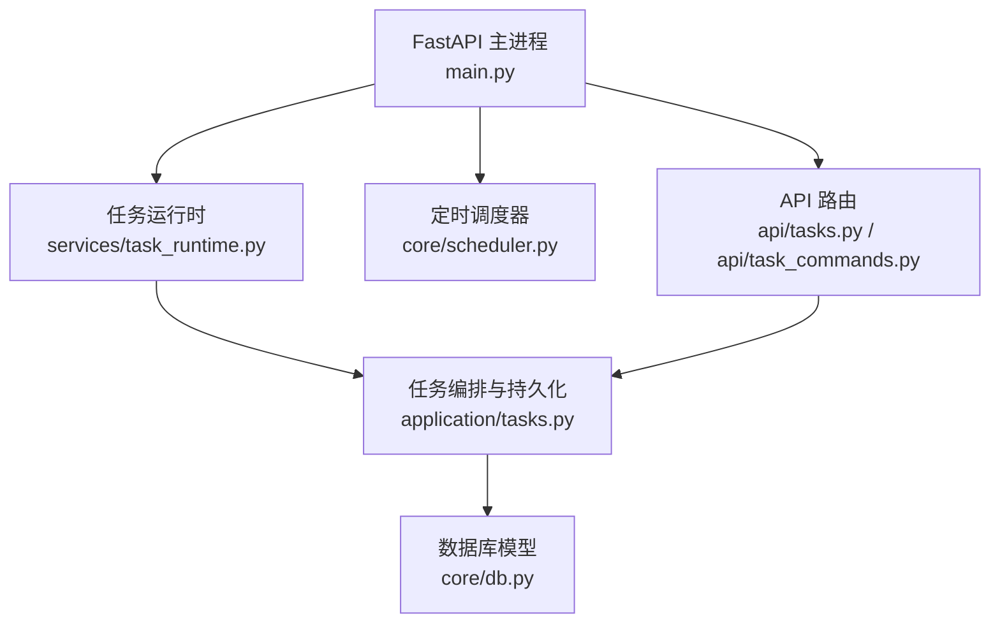
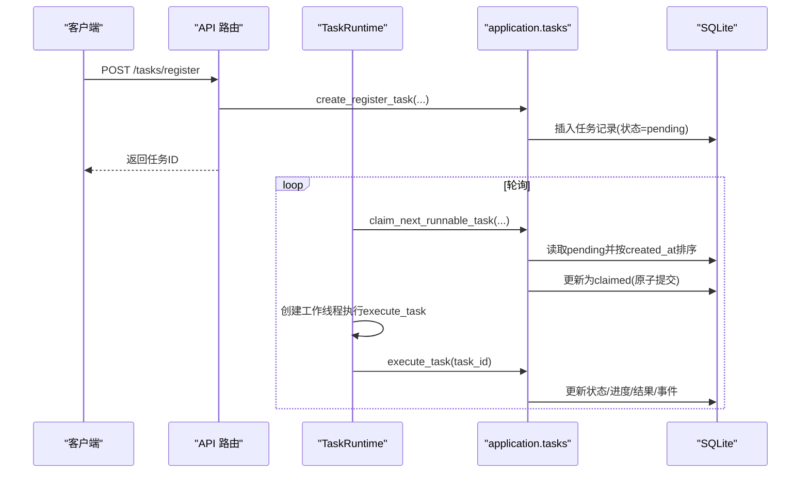
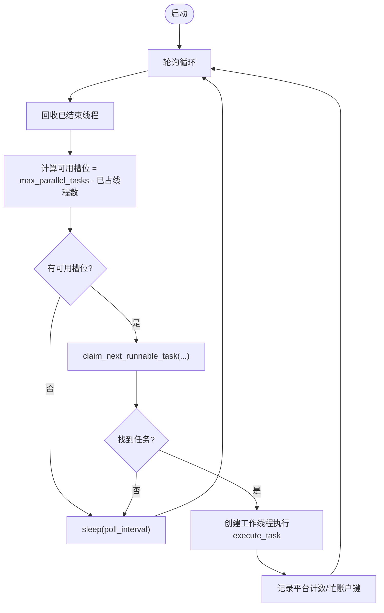
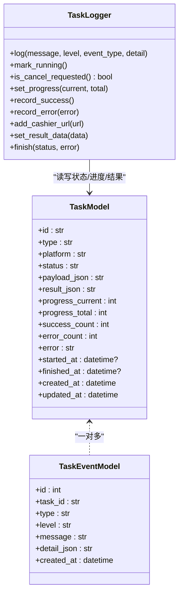
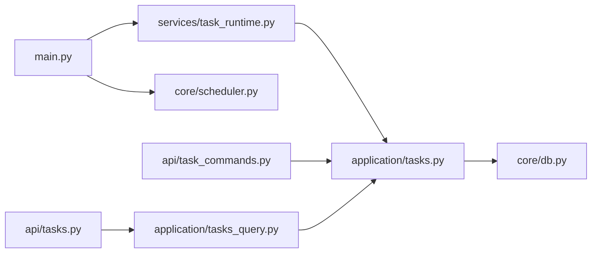

# 异步任务队列

<cite>
**本文引用的文件**
- [main.py](file://main.py)
- [services/task_runtime.py](file://services/task_runtime.py)
- [application/tasks.py](file://application/tasks.py)
- [core/db.py](file://core/db.py)
- [api/tasks.py](file://api/tasks.py)
- [api/task_commands.py](file://api/task_commands.py)
- [application/task_commands.py](file://application/task_commands.py)
- [core/scheduler.py](file://core/scheduler.py)
</cite>

## 目录
1. [简介](#简介)
2. [项目结构](#项目结构)
3. [核心组件](#核心组件)
4. [架构总览](#架构总览)
5. [详细组件分析](#详细组件分析)
6. [依赖关系分析](#依赖关系分析)
7. [性能考量与优化建议](#性能考量与优化建议)
8. [故障排查指南](#故障排查指南)
9. [结论](#结论)
10. [附录](#附录)

## 简介
本文件深入解析该项目的“异步任务队列”实现原理与工作机理，覆盖数据结构设计、内存管理策略、任务优先级与调度策略（FIFO、平台并发限制、资源竞争避免）、并发控制（全局并行上限、每平台并行上限）、任务抢占与中断机制、以及队列性能优化与监控调试方法。

## 项目结构
- 入口服务：FastAPI 应用启动时初始化数据库、加载平台/提供者、启动调度器与任务运行时。
- 任务运行时：单进程内基于线程的调度器，负责从持久化队列中领取任务并分配工作线程执行。
- 任务编排与持久化：定义任务模型、状态机、事件日志、任务创建/查询/取消、任务执行分发。
- API 层：提供任务创建、取消、列表、事件流等接口。
- 定时调度：周期性检查账号生命周期与有效性。

**图表来源**
- [main.py:67-91](file://main.py#L67-L91)
- [services/task_runtime.py:18-101](file://services/task_runtime.py#L18-L101)
- [application/tasks.py:174-368](file://application/tasks.py#L174-L368)
- [core/db.py:241-288](file://core/db.py#L241-L288)
- [api/tasks.py:1-30](file://api/tasks.py#L1-L30)
- [api/task_commands.py:1-51](file://api/task_commands.py#L1-L51)

**章节来源**
- [main.py:67-91](file://main.py#L67-L91)

## 核心组件
- 任务运行时 TaskRuntime：维护全局并发上限、每平台并发上限、轮询循环、工作线程池、任务认领与执行。
- 任务编排 application.tasks：任务数据模型、状态机、任务创建/认领/执行、事件记录、进度更新、取消请求处理。
- 数据库 core.db：SQLite 持久化，包含任务表、事件表、账户表等。
- API 层：暴露任务创建、取消、查询、事件流接口。
- 定时调度 core.scheduler：周期性任务（如 trial 到期检查、批量账号有效性检测）。

**章节来源**
- [services/task_runtime.py:18-101](file://services/task_runtime.py#L18-L101)
- [application/tasks.py:174-368](file://application/tasks.py#L174-L368)
- [core/db.py:241-288](file://core/db.py#L241-L288)
- [api/tasks.py:1-30](file://api/tasks.py#L1-L30)
- [api/task_commands.py:1-51](file://api/task_commands.py#L1-L51)
- [core/scheduler.py:19-115](file://core/scheduler.py#L19-L115)

## 架构总览
系统采用“持久化任务队列 + 单进程多线程执行”的轻量架构：
- 任务以行记录形式持久化在 SQLite 中，状态驱动流转。
- 任务运行时通过轮询数据库领取可运行任务，按全局和平台维度限制并发。
- 每个任务由独立工作线程执行，内部可能使用线程池进行子任务并发（如批量注册）。
- 通过事件表记录任务日志，支持 SSE 实时推送。

**图表来源**
- [api/task_commands.py:29-39](file://api/task_commands.py#L29-L39)
- [application/tasks.py:174-208](file://application/tasks.py#L174-L208)
- [application/tasks.py:340-368](file://application/tasks.py#L340-L368)
- [services/task_runtime.py:47-85](file://services/task_runtime.py#L47-L85)
- [application/tasks.py:570-595](file://application/tasks.py#L570-L595)

## 详细组件分析

### 任务运行时 TaskRuntime
- 并发控制
  - 全局最大并行任务数：max_parallel_tasks（默认3）
  - 每平台最大并行任务数：max_parallel_per_platform（默认1）
  - 轮询间隔：poll_interval（默认0.5s）
- 工作线程管理
  - 维护 _workers 字典，记录每个任务的线程、平台、占用账户键集合
  - 定期回收已结束的工作线程
- 任务认领
  - 调用 claim_next_runnable_task，传入当前运行中的平台计数与忙账户键集合，避免重复占用同一账户
- 优雅停止
  - stop() 设置 _running=False，循环退出后清理

**图表来源**
- [services/task_runtime.py:47-85](file://services/task_runtime.py#L47-L85)
- [application/tasks.py:340-368](file://application/tasks.py#L340-L368)

**章节来源**
- [services/task_runtime.py:18-101](file://services/task_runtime.py#L18-L101)

### 任务编排与持久化 application.tasks
- 数据模型
  - TaskModel：任务标识、类型、平台、状态、负载、结果、进度、时间戳
  - TaskEventModel：任务事件日志（级别、消息、详情）
  - 其他账户相关模型用于业务逻辑
- 状态机
  - pending -> claimed -> running -> succeeded/failed/interrupted/cancelled
  - 终止状态集合与活跃状态集合明确区分
- 任务创建
  - create_* 系列函数生成任务并写入数据库，追加初始事件
- 任务认领
  - claim_next_runnable_task：按 created_at 升序选择第一个满足平台并发与账户占用约束的任务，原子更新为 claimed
- 任务执行
  - execute_task：根据任务类型分派到具体处理器（注册、账号检查、平台动作等）
  - 注册任务内部使用 ThreadPoolExecutor 控制并发度，支持 HeroSMS 号码复用与自动补尝试
- 取消与抢占
  - request_cancel：将 pending 直接置为 cancelled；对运行中任务置为 cancel_requested
  - 执行过程中定期检查 is_cancel_requested，遇到取消即尽快结束
- 事件与进度
  - TaskLogger 统一记录日志、进度、成功/错误计数、结果数据

**图表来源**
- [core/db.py:241-288](file://core/db.py#L241-L288)
- [application/tasks.py:371-457](file://application/tasks.py#L371-L457)

**章节来源**
- [application/tasks.py:174-368](file://application/tasks.py#L174-L368)
- [application/tasks.py:570-595](file://application/tasks.py#L570-L595)
- [application/tasks.py:692-869](file://application/tasks.py#L692-L869)
- [core/db.py:241-288](file://core/db.py#L241-L288)

### API 层
- 任务命令
  - POST /tasks/register：创建注册任务，触发运行时唤醒
  - POST /tasks/{task_id}/cancel：请求取消任务
  - GET /tasks/{task_id}/logs/stream：SSE 推送任务事件
- 任务查询
  - GET /tasks：分页列出任务（可按平台、状态过滤）
  - GET /tasks/{task_id}：获取任务详情
  - GET /tasks/{task_id}/events：获取任务事件

**章节来源**
- [api/task_commands.py:17-51](file://api/task_commands.py#L17-L51)
- [api/tasks.py:1-30](file://api/tasks.py#L1-L30)
- [application/task_commands.py:20-48](file://application/task_commands.py#L20-L48)

### 定时调度 core.scheduler
- 周期任务：每小时检查 trial 到期账号并更新状态
- 批量有效性检测：按平台或全量拉取最近账户，逐个调用平台插件校验并更新摘要

**章节来源**
- [core/scheduler.py:19-115](file://core/scheduler.py#L19-L115)

## 依赖关系分析
- main.py 启动 FastAPI，初始化数据库、加载平台/提供者、启动 scheduler 与 task_runtime，并挂载各路由。
- task_runtime 依赖 application.tasks 的任务认领与执行能力。
- application.tasks 依赖 core.db 的数据模型与 Session。
- API 路由依赖 application.task_commands 与 application.tasks_query。

**图表来源**
- [main.py:67-91](file://main.py#L67-L91)
- [services/task_runtime.py:8-9](file://services/task_runtime.py#L8-L9)
- [application/tasks.py:12-24](file://application/tasks.py#L12-L24)
- [core/db.py:241-288](file://core/db.py#L241-L288)
- [api/task_commands.py:1-51](file://api/task_commands.py#L1-L51)
- [api/tasks.py:1-30](file://api/tasks.py#L1-L30)

**章节来源**
- [main.py:67-91](file://main.py#L67-L91)

## 性能考量与优化建议
- 内存使用优化
  - 使用 dataclass(slots=True) 降低对象内存开销（TaskWorkerState、TaskProgress/Summary/Event）
  - 任务负载与结果以 JSON 字符串存储，减少大对象驻留内存
  - 合理设置 poll_interval，避免频繁轮询造成 CPU 抖动
- CPU 利用率提升
  - 注册任务内部使用 ThreadPoolExecutor 控制并发度，避免过度并发导致上下文切换开销
  - 平台并发限制防止单一平台独占资源
- 延迟降低技巧
  - 缩短 claim_next_runnable_task 的扫描范围（仅查 pending 且按 created_at 排序），保证 FIFO 公平性
  - 使用最小化的状态变更事务，减少锁持有时间
  - 事件流使用 SSE 增量推送，避免全量拉取
- 可扩展性建议
  - 若需跨进程扩展，可将 claim_next_runnable_task 改为分布式锁+队列（如 Redis）
  - 将 SQLite 替换为更合适的持久化后端以提升并发写入吞吐

[本节为通用指导，不直接分析具体代码文件]

## 故障排查指南
- 任务被中断
  - 服务重启会将非终止状态任务标记为 interrupted，并在事件中标注原因
  - 检查 mark_incomplete_tasks_interrupted 的执行时机
- 任务无法开始
  - 检查 claim_next_runnable_task 是否因平台并发限制或账户占用而跳过
  - 查看任务状态是否为 pending，是否存在未释放的占用键
- 取消不生效
  - 确认任务处于可取消状态（pending/claimed/running/cancel_requested）
  - 执行路径中会检查 is_cancel_requested，确保在关键循环点及时响应
- 日志与事件
  - 通过 /tasks/{task_id}/logs/stream 订阅事件，观察进度与错误
  - 使用 list_task_events 回溯历史事件定位问题

**章节来源**
- [application/tasks.py:296-316](file://application/tasks.py#L296-L316)
- [application/tasks.py:318-338](file://application/tasks.py#L318-L338)
- [application/tasks.py:393-396](file://application/tasks.py#L393-L396)
- [api/task_commands.py:42-51](file://api/task_commands.py#L42-L51)

## 结论
该系统实现了轻量、可靠、可观测的异步任务队列：
- 以 SQLite 作为持久化队列，结合状态机与事件日志，保障任务可追踪与可恢复
- 通过全局与平台维度的并发控制，避免资源竞争与过载
- 支持任务取消与优雅中断，配合事件流便于实时监控与排障
- 在单进程多线程场景下具备良好性能与可维护性，适合中小规模自动化注册与运维任务

[本节为总结性内容，不直接分析具体代码文件]

## 附录

### 任务优先级与调度策略
- 优先级算法
  - 默认采用 FIFO：按 created_at 升序选择首个 pending 任务
- 负载均衡
  - 每平台并行限制：防止单一平台独占执行资源
  - 账户级占用：通过 account_keys 避免同一账户被多个任务同时操作
- 抢占与中断
  - 取消请求将任务置为 cancel_requested，执行中任务检测到后立即结束
  - 服务重启时将未完成任务标记为 interrupted，避免悬挂

**章节来源**
- [application/tasks.py:340-368](file://application/tasks.py#L340-L368)
- [application/tasks.py:318-338](file://application/tasks.py#L318-L338)
- [application/tasks.py:296-316](file://application/tasks.py#L296-L316)

### 并发控制机制
- 最大并行任务数：TaskRuntime.max_parallel_tasks
- 每平台并发限制：TaskRuntime.max_parallel_per_platform
- 资源竞争避免：account_keys 集合去重，避免同一账户被并发访问

**章节来源**
- [services/task_runtime.py:18-85](file://services/task_runtime.py#L18-L85)
- [application/tasks.py:340-368](file://application/tasks.py#L340-L368)

### 监控与调试工具
- 任务列表与详情：GET /tasks、GET /tasks/{task_id}
- 事件流：GET /tasks/{task_id}/logs/stream（SSE）
- 任务创建与取消：POST /tasks/register、POST /tasks/{task_id}/cancel
- 前端页面：任务历史记录、指标卡片、实时状态展示

**章节来源**
- [api/tasks.py:1-30](file://api/tasks.py#L1-L30)
- [api/task_commands.py:17-51](file://api/task_commands.py#L17-L51)