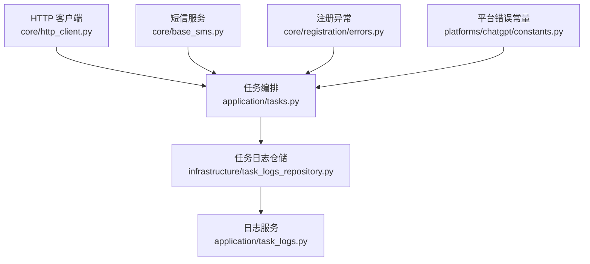
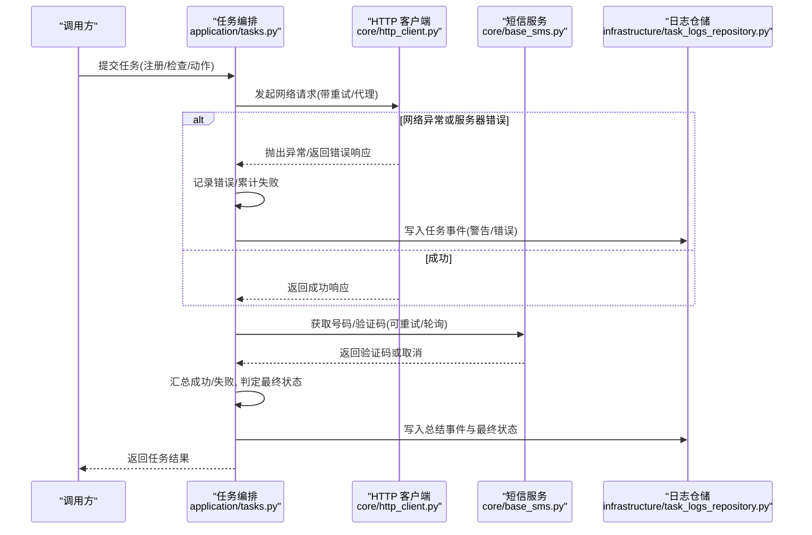
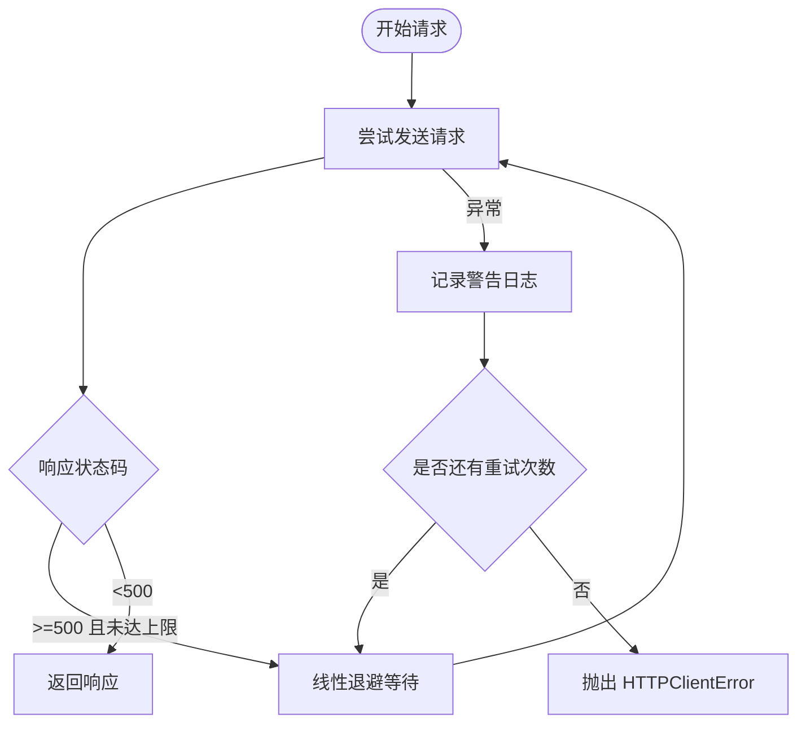
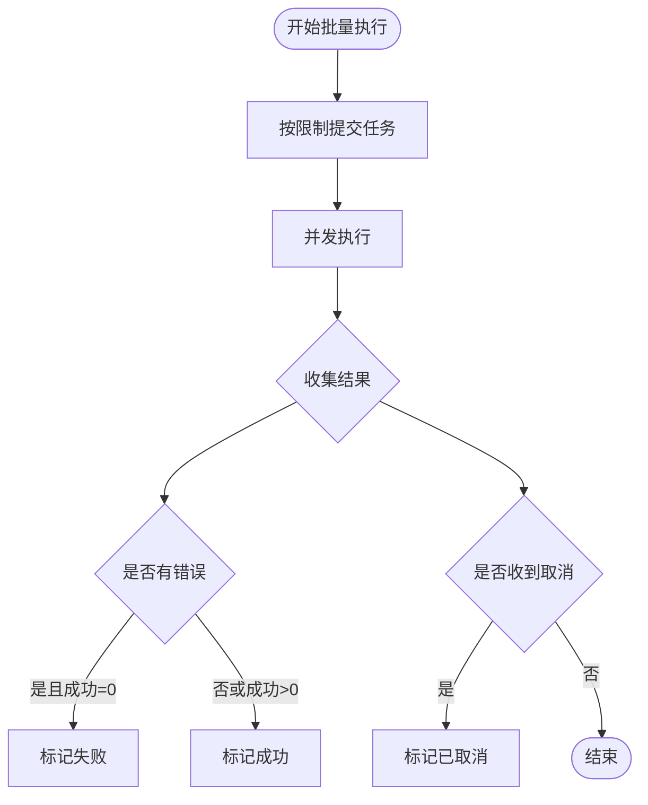
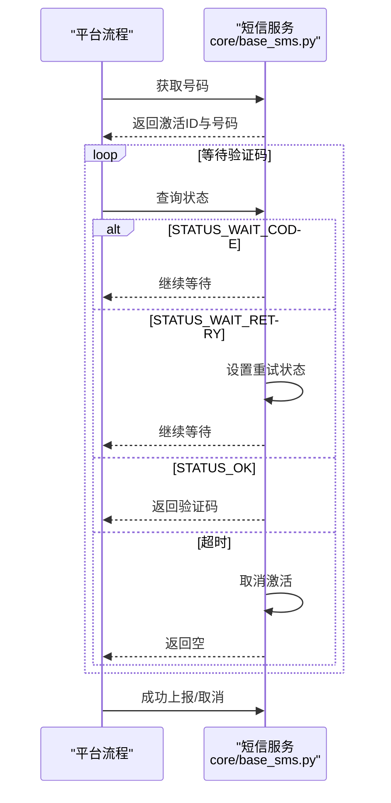
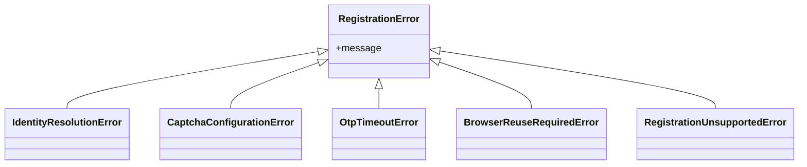
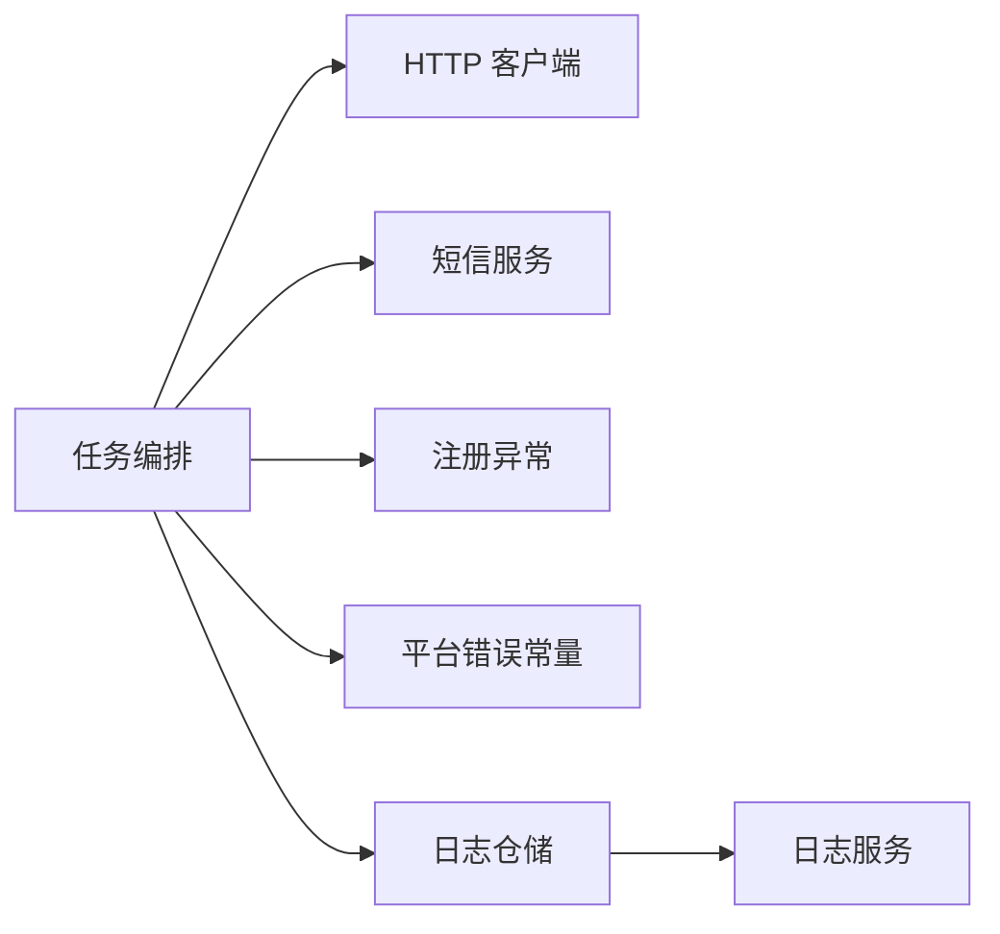

# 错误处理与重试机制

<cite>
**本文引用的文件**
- [application/tasks.py](file://application/tasks.py)
- [core/http_client.py](file://core/http_client.py)
- [core/base_sms.py](file://core/base_sms.py)
- [core/registration/errors.py](file://core/registration/errors.py)
- [platforms/chatgpt/constants.py](file://platforms/chatgpt/constants.py)
- [infrastructure/task_logs_repository.py](file://infrastructure/task_logs_repository.py)
- [application/task_logs.py](file://application/task_logs.py)
- [tests/test_api_stats.py](file://tests/test_api_stats.py)
- [tests/test_sms_provider.py](file://tests/test_sms_provider.py)
</cite>

## 目录
1. [简介](#简介)
2. [项目结构](#项目结构)
3. [核心组件](#核心组件)
4. [架构总览](#架构总览)
5. [详细组件分析](#详细组件分析)
6. [依赖关系分析](#依赖关系分析)
7. [性能考虑](#性能考虑)
8. [故障排查指南](#故障排查指南)
9. [结论](#结论)
10. [附录](#附录)

## 简介
本文件系统性说明任务执行过程中的错误分类、异常捕获与处理流程，以及重试策略、失败条件判断、错误恢复（部分成功、数据回滚、状态修复）、日志记录与告警通知的实现方式。同时提供常见错误场景的排查方法与性能优化建议，帮助读者快速定位问题并提升系统稳定性。

## 项目结构
围绕错误处理与重试的关键代码分布在以下模块：
- HTTP 客户端层：统一封装网络请求、代理、重试与超时控制
- 任务编排层：负责并发调度、结果聚合、最终状态判定与中断恢复
- 短信服务层：号码获取、验证码轮询、取消与成功上报，含复用与生命周期管理
- 注册流程异常：定义注册相关业务异常类型
- 平台常量：统一错误码与消息映射
- 日志与统计：持久化任务事件与错误日志，提供查询接口

**图表来源**
- [core/http_client.py:85-145](file://core/http_client.py#L85-L145)
- [application/tasks.py:791-897](file://application/tasks.py#L791-L897)
- [core/base_sms.py:155-186](file://core/base_sms.py#L155-L186)
- [core/registration/errors.py:4-25](file://core/registration/errors.py#L4-L25)
- [platforms/chatgpt/constants.py:313-345](file://platforms/chatgpt/constants.py#L313-L345)
- [infrastructure/task_logs_repository.py:27-41](file://infrastructure/task_logs_repository.py#L27-L41)
- [application/task_logs.py:7-28](file://application/task_logs.py#L7-L28)

**章节来源**
- [core/http_client.py:85-145](file://core/http_client.py#L85-L145)
- [application/tasks.py:791-897](file://application/tasks.py#L791-L897)
- [core/base_sms.py:155-186](file://core/base_sms.py#L155-L186)
- [core/registration/errors.py:4-25](file://core/registration/errors.py#L4-L25)
- [platforms/chatgpt/constants.py:313-345](file://platforms/chatgpt/constants.py#L313-L345)
- [infrastructure/task_logs_repository.py:27-41](file://infrastructure/task_logs_repository.py#L27-L41)
- [application/task_logs.py:7-28](file://application/task_logs.py#L7-L28)

## 核心组件
- HTTP 客户端：实现带退避的重试、代理注入、连接/超时异常捕获与统一错误抛出
- 任务编排：并发提交、进度跟踪、错误收集、最终状态判定、取消与中断恢复
- 短信服务：号码租赁、验证码等待、取消与成功上报；支持号码复用与生命周期控制
- 注册异常：细粒度业务异常类型，便于上层区分处理
- 平台错误常量：统一的错误码与中文消息映射，便于前端展示与告警
- 日志与统计：任务事件持久化、分页查询、错误统计接口

**章节来源**
- [core/http_client.py:23-36](file://core/http_client.py#L23-L36)
- [core/http_client.py:85-145](file://core/http_client.py#L85-L145)
- [application/tasks.py:26-50](file://application/tasks.py#L26-L50)
- [application/tasks.py:281-315](file://application/tasks.py#L281-L315)
- [core/base_sms.py:19-71](file://core/base_sms.py#L19-L71)
- [core/base_sms.py:155-186](file://core/base_sms.py#L155-L186)
- [core/registration/errors.py:4-25](file://core/registration/errors.py#L4-L25)
- [platforms/chatgpt/constants.py:313-345](file://platforms/chatgpt/constants.py#L313-L345)
- [infrastructure/task_logs_repository.py:27-41](file://infrastructure/task_logs_repository.py#L27-L41)
- [application/task_logs.py:7-28](file://application/task_logs.py#L7-L28)

## 架构总览
下图展示了从任务创建到执行、错误捕获、重试与最终状态判定的整体流程。

**图表来源**
- [application/tasks.py:791-897](file://application/tasks.py#L791-L897)
- [core/http_client.py:85-145](file://core/http_client.py#L85-L145)
- [core/base_sms.py:155-186](file://core/base_sms.py#L155-L186)
- [infrastructure/task_logs_repository.py:27-41](file://infrastructure/task_logs_repository.py#L27-L41)

## 详细组件分析

### HTTP 客户端重试与异常处理
- 重试策略
  - 最大重试次数由配置项 max_retries 控制
  - 退避算法采用线性退避：sleep(retry_delay * (attempt + 1))
  - 仅对服务器错误（状态码≥500）进行自动重试；客户端错误（4xx）不重试
- 异常捕获
  - 捕获连接异常、超时异常及底层请求异常，记录警告日志
  - 达到最大重试后抛出统一异常 HTTPClientError
- 代理与会话
  - 自动注入代理配置，支持会话复用与 SSL 校验开关

**图表来源**
- [core/http_client.py:109-145](file://core/http_client.py#L109-L145)

**章节来源**
- [core/http_client.py:23-36](file://core/http_client.py#L23-L36)
- [core/http_client.py:85-145](file://core/http_client.py#L85-L145)

### 任务编排的错误聚合与最终状态判定
- 并发执行与错误收集
  - 使用线程池并发执行子任务，收集每个子任务的错误信息
  - 根据目标成功数与最大尝试次数控制提交数量
- 最终状态判定
  - 若存在错误且成功数为0，则标记为失败；否则成功
  - 支持取消与中断：检测到取消请求时直接终止并记录
- 服务重启恢复
  - 启动时将非终态任务标记为“中断”，并追加警告事件

**图表来源**
- [application/tasks.py:791-897](file://application/tasks.py#L791-L897)
- [application/tasks.py:296-315](file://application/tasks.py#L296-L315)

**章节来源**
- [application/tasks.py:791-897](file://application/tasks.py#L791-L897)
- [application/tasks.py:296-315](file://application/tasks.py#L296-L315)

### 短信服务的重试、轮询与生命周期管理
- 验证码获取
  - 轮询等待验证码，遇到“等待重试”状态会主动设置状态并继续等待
  - 超时后自动取消激活并返回空值
- 号码复用与生命周期
  - 支持号码复用至最大成功次数或接近过期时间
  - 成功上报与取消释放，避免资源泄漏
- 首次失败不影响后续重试
  - 测试覆盖首次获取号码失败不会污染后续重试逻辑

**图表来源**
- [core/base_sms.py:155-186](file://core/base_sms.py#L155-L186)
- [core/base_sms.py:588-615](file://core/base_sms.py#L588-L615)
- [core/base_sms.py:934-959](file://core/base_sms.py#L934-L959)

**章节来源**
- [core/base_sms.py:155-186](file://core/base_sms.py#L155-L186)
- [core/base_sms.py:588-615](file://core/base_sms.py#L588-L615)
- [core/base_sms.py:934-959](file://core/base_sms.py#L934-L959)
- [tests/test_sms_provider.py:204-216](file://tests/test_sms_provider.py#L204-L216)

### 注册流程异常分类与处理
- 异常层次
  - 基础异常 RegistrationError
  - 细分异常：身份解析失败、验证码配置不可用、验证码等待超时、需复用浏览器会话、不支持的注册路径
- 上层处理
  - 任务编排在平台动作执行失败时记录错误并标记任务失败
  - 平台常量提供错误码与中文消息映射，便于统一展示与告警

**图表来源**
- [core/registration/errors.py:4-25](file://core/registration/errors.py#L4-L25)
- [application/tasks.py:872-897](file://application/tasks.py#L872-L897)
- [platforms/chatgpt/constants.py:313-345](file://platforms/chatgpt/constants.py#L313-L345)

**章节来源**
- [core/registration/errors.py:4-25](file://core/registration/errors.py#L4-L25)
- [application/tasks.py:872-897](file://application/tasks.py#L872-L897)
- [platforms/chatgpt/constants.py:313-345](file://platforms/chatgpt/constants.py#L313-L345)

### 错误日志记录与告警通知
- 任务事件持久化
  - 通过 append_task_event 写入任务事件，包含级别、消息与详情
  - 服务重启后将非终态任务标记为中断并追加警告事件
- 日志查询与统计
  - TaskLogsRepository 提供分页查询，过滤平台维度
  - API 统计接口 /api/stats/errors 支持按天数与平台过滤
- 日志级别
  - 事件级别包括 info、warning、error 等，用于不同严重程度的记录

**章节来源**
- [application/tasks.py:281-315](file://application/tasks.py#L281-L315)
- [infrastructure/task_logs_repository.py:27-41](file://infrastructure/task_logs_repository.py#L27-L41)
- [application/task_logs.py:7-28](file://application/task_logs.py#L7-L28)
- [tests/test_api_stats.py:51-60](file://tests/test_api_stats.py#L51-L60)

## 依赖关系分析
- HTTP 客户端被任务编排广泛使用，承担网络层的健壮性保障
- 短信服务作为外部依赖，提供号码与验证码能力，具备自身重试与生命周期管理
- 注册异常与平台错误常量服务于上层业务逻辑的统一处理与展示
- 日志仓储与日志服务支撑可观测性与问题回溯

**图表来源**
- [application/tasks.py:791-897](file://application/tasks.py#L791-L897)
- [core/http_client.py:85-145](file://core/http_client.py#L85-L145)
- [core/base_sms.py:155-186](file://core/base_sms.py#L155-L186)
- [core/registration/errors.py:4-25](file://core/registration/errors.py#L4-L25)
- [platforms/chatgpt/constants.py:313-345](file://platforms/chatgpt/constants.py#L313-L345)
- [infrastructure/task_logs_repository.py:27-41](file://infrastructure/task_logs_repository.py#L27-L41)
- [application/task_logs.py:7-28](file://application/task_logs.py#L7-L28)

**章节来源**
- [application/tasks.py:791-897](file://application/tasks.py#L791-L897)
- [core/http_client.py:85-145](file://core/http_client.py#L85-L145)
- [core/base_sms.py:155-186](file://core/base_sms.py#L155-L186)
- [core/registration/errors.py:4-25](file://core/registration/errors.py#L4-L25)
- [platforms/chatgpt/constants.py:313-345](file://platforms/chatgpt/constants.py#L313-L345)
- [infrastructure/task_logs_repository.py:27-41](file://infrastructure/task_logs_repository.py#L27-L41)
- [application/task_logs.py:7-28](file://application/task_logs.py#L7-L28)

## 性能考虑
- 合理设置 HTTP 重试参数
  - max_retries 不宜过大，避免放大后端压力
  - retry_delay 可根据网络质量调整，避免雪崩
- 并发与限流
  - 任务编排使用线程池并发，注意控制并发度与目标成功数
  - 短信服务支持号码复用，减少重复申请成本
- 日志与监控
  - 关键步骤记录事件与错误，便于定位瓶颈
  - 使用统计接口观察错误趋势，及时调优

[本节为通用指导，不直接分析具体文件]

## 故障排查指南
- 网络异常
  - 检查代理配置与连通性
  - 查看 HTTP 客户端日志中的重试与错误信息
  - 确认服务端状态码是否为 5xx（触发重试）
- 业务异常
  - 注册流程异常类型明确，结合平台错误常量定位原因
  - 任务编排中错误会被收集并在最终状态中体现
- 系统异常
  - 服务重启后非终态任务会被标记为中断，需检查任务历史与事件
- 短信相关问题
  - 验证码等待超时会自动取消激活，检查短信服务状态与余额
  - 号码复用受成功次数与生命周期限制，必要时重新申请

**章节来源**
- [core/http_client.py:109-145](file://core/http_client.py#L109-L145)
- [core/registration/errors.py:4-25](file://core/registration/errors.py#L4-L25)
- [platforms/chatgpt/constants.py:313-345](file://platforms/chatgpt/constants.py#L313-L345)
- [application/tasks.py:296-315](file://application/tasks.py#L296-L315)
- [core/base_sms.py:155-186](file://core/base_sms.py#L155-L186)

## 结论
该代码库通过分层设计实现了稳健的错误处理与重试机制：HTTP 客户端负责网络层的健壮性，任务编排负责并发与状态管理，短信服务提供独立的轮询与生命周期控制，注册异常与平台错误常量统一了业务异常的处理与展示。配合完善的日志与统计能力，系统具备良好的可观测性与可维护性。

[本节为总结性内容，不直接分析具体文件]

## 附录
- 配置要点
  - HTTP 客户端：timeout、max_retries、retry_delay、verify_ssl、follow_redirects
  - 短信服务：provider_key、service、country、reuse_phone_to_max、phone_success_max
- 常用接口
  - 错误统计：/api/stats/errors（支持 days、platform 过滤）
  - 日志查询：TaskLogsService.list_logs（支持 platform、page、page_size）

**章节来源**
- [core/http_client.py:23-36](file://core/http_client.py#L23-L36)
- [core/base_sms.py:588-615](file://core/base_sms.py#L588-L615)
- [application/task_logs.py:7-28](file://application/task_logs.py#L7-L28)
- [tests/test_api_stats.py:51-60](file://tests/test_api_stats.py#L51-L60)