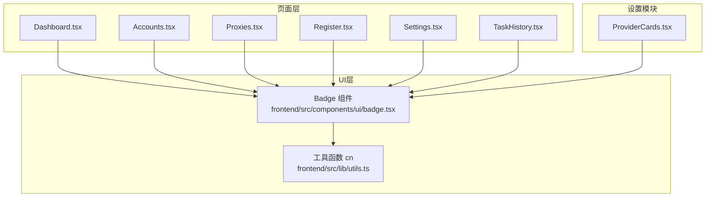
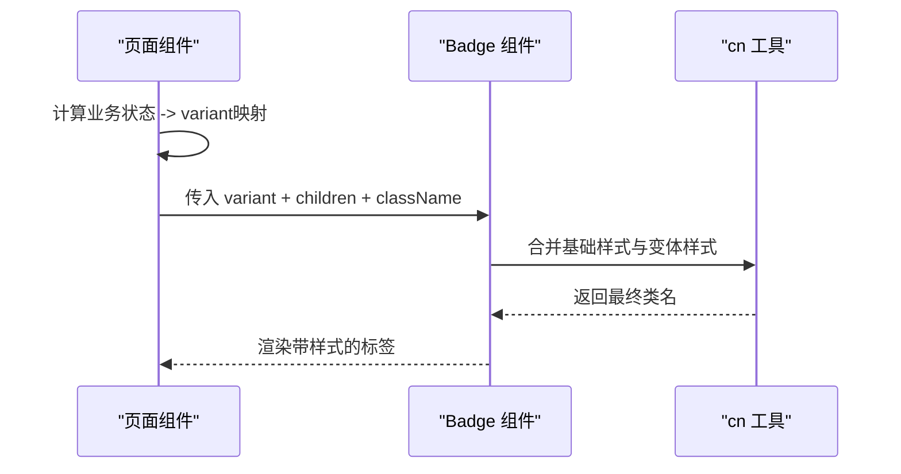
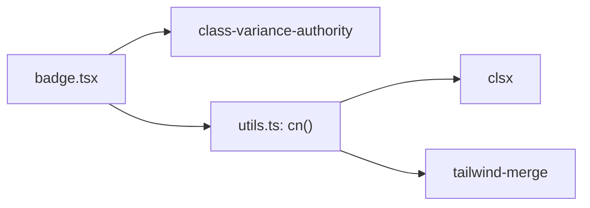

# Badge徽章组件

<cite>
**本文引用的文件**
- [badge.tsx](file://frontend/src/components/ui/badge.tsx)
- [Dashboard.tsx](file://frontend/src/pages/Dashboard.tsx)
- [Accounts.tsx](file://frontend/src/pages/Accounts.tsx)
- [Proxies.tsx](file://frontend/src/pages/Proxies.tsx)
- [Register.tsx](file://frontend/src/pages/Register.tsx)
- [Settings.tsx](file://frontend/src/pages/Settings.tsx)
- [TaskHistory.tsx](file://frontend/src/pages/TaskHistory.tsx)
- [ProviderCards.tsx](file://frontend/src/components/settings/ProviderCards.tsx)
- [utils.ts](file://frontend/src/lib/utils.ts)
</cite>

## 目录
1. [简介](#简介)
2. [项目结构](#项目结构)
3. [核心组件](#核心组件)
4. [架构总览](#架构总览)
5. [详细组件分析](#详细组件分析)
6. [依赖分析](#依赖分析)
7. [性能考虑](#性能考虑)
8. [故障排查指南](#故障排查指南)
9. [结论](#结论)
10. [附录：使用示例与最佳实践](#附录使用示例与最佳实践)

## 简介
Badge徽章组件用于以紧凑、高对比度的视觉形式表达状态、计数或轻量标签。在本项目中，Badge基于样式变体系统构建，支持默认、成功、警告、错误（danger）、次要等语义化外观；通过内联布局与圆角边框呈现，适合在表格、卡片、统计面板中作为状态指示器或计数标签。

## 项目结构
Badge组件位于前端UI层，被多个页面和设置模块复用，形成“单一来源、多处消费”的组件化结构。

图表来源
- [badge.tsx:1-30](file://frontend/src/components/ui/badge.tsx#L1-L30)
- [utils.ts:1-6](file://frontend/src/lib/utils.ts#L1-L6)
- [Dashboard.tsx:5-6](file://frontend/src/pages/Dashboard.tsx#L5-L6)
- [Accounts.tsx:10-11](file://frontend/src/pages/Accounts.tsx#L10-L11)
- [Proxies.tsx:4-6](file://frontend/src/pages/Proxies.tsx#L4-L6)
- [Register.tsx:9-11](file://frontend/src/pages/Register.tsx#L9-L11)
- [Settings.tsx:6-8](file://frontend/src/pages/Settings.tsx#L6-L8)
- [TaskHistory.tsx:4-6](file://frontend/src/pages/TaskHistory.tsx#L4-L6)
- [ProviderCards.tsx:4-6](file://frontend/src/components/settings/ProviderCards.tsx#L4-L6)

章节来源
- [badge.tsx:1-30](file://frontend/src/components/ui/badge.tsx#L1-L30)
- [utils.ts:1-6](file://frontend/src/lib/utils.ts#L1-L6)

## 核心组件
- 组件职责：渲染一个带语义化样式的标签容器，支持多种变体与自定义类名扩展。
- 样式策略：使用样式变体库定义基础样式与多套主题变体，并通过工具函数合并类名，确保可组合性与可覆盖性。
- 可扩展点：通过传入className可叠加额外样式；通过variant选择不同语义色板。

章节来源
- [badge.tsx:5-27](file://frontend/src/components/ui/badge.tsx#L5-L27)
- [utils.ts:4-6](file://frontend/src/lib/utils.ts#L4-L6)

## 架构总览
Badge组件作为原子级UI元素，被上层页面按业务语义进行组合使用。页面通过映射表将业务状态转换为Badge的variant，从而统一视觉语言。

图表来源
- [badge.tsx:5-27](file://frontend/src/components/ui/badge.tsx#L5-L27)
- [utils.ts:4-6](file://frontend/src/lib/utils.ts#L4-L6)
- [Dashboard.tsx:15-25](file://frontend/src/pages/Dashboard.tsx#L15-L25)
- [Proxies.tsx:157-159](file://frontend/src/pages/Proxies.tsx#L157-L159)

## 详细组件分析

### 样式变体与语义
- 默认（default）：中性强调色，适用于一般信息或计数。
- 成功（success）：绿色系，表示正常、可用、就绪等积极状态。
- 警告（warning）：琥珀色系，表示需要注意或即将过期等半警示状态。
- 危险（danger）：红色系，表示错误、失效、禁用等负面状态。
- 次要（secondary）：低对比度，用于非重点信息或占位提示。

这些变体通过统一的边框、背景与文字颜色组合实现，保证在不同主题下的一致性。

章节来源
- [badge.tsx:5-19](file://frontend/src/components/ui/badge.tsx#L5-L19)

### 尺寸配置
- 当前实现采用固定字号与内边距，呈现为紧凑的小尺寸徽章，适合行内展示与密集数据场景。
- 若需大尺寸，可通过外层容器或自定义className调整字体、内边距与圆角半径，保持与现有变体一致的视觉层级。

章节来源
- [badge.tsx:5-7](file://frontend/src/components/ui/badge.tsx#L5-L7)

### 内容渲染
- 文本内容：直接作为children渲染，支持中文、数字、英文等任意文本。
- 图标集成：可与图标组件并列显示，常用于“状态+图标”的组合标签。
- 动态更新：当父组件状态变化时，Badge会随props重新渲染，自动反映最新内容与变体。

章节来源
- [badge.tsx:25-27](file://frontend/src/components/ui/badge.tsx#L25-L27)
- [Dashboard.tsx:81-93](file://frontend/src/pages/Dashboard.tsx#L81-L93)
- [Proxies.tsx:157-159](file://frontend/src/pages/Proxies.tsx#L157-L159)

### 定位与布局模式
- 内联显示：Badge默认以内联方式参与文本流，适合与文字混排。
- 绝对定位：可在父容器中通过外层包裹实现相对/绝对定位，例如悬浮提示角标。
- 浮动显示：结合flex布局可实现左对齐或右对齐的浮动效果，常见于卡片头部或列表项右侧。

章节来源
- [Dashboard.tsx:170-177](file://frontend/src/pages/Dashboard.tsx#L170-L177)
- [Proxies.tsx:66-70](file://frontend/src/pages/Proxies.tsx#L66-L70)

### 使用示例与场景
- 仪表盘状态分布：根据平台或生命周期状态映射到不同变体，直观展示占比与趋势。
- 代理池管理：用成功/失败、活跃/禁用等状态驱动变体切换。
- 注册流程：任务状态、可用性、就绪态等通过徽章快速传达。
- 设置页：默认服务标记、启用/禁用状态、测试反馈等。

章节来源
- [Dashboard.tsx:15-25](file://frontend/src/pages/Dashboard.tsx#L15-L25)
- [Dashboard.tsx:81-93](file://frontend/src/pages/Dashboard.tsx#L81-L93)
- [Proxies.tsx:66-70](file://frontend/src/pages/Proxies.tsx#L66-L70)
- [Proxies.tsx:157-159](file://frontend/src/pages/Proxies.tsx#L157-L159)
- [Register.tsx:9-11](file://frontend/src/pages/Register.tsx#L9-L11)
- [Settings.tsx:6-8](file://frontend/src/pages/Settings.tsx#L6-L8)
- [TaskHistory.tsx:4-6](file://frontend/src/pages/TaskHistory.tsx#L4-L6)
- [ProviderCards.tsx:457-462](file://frontend/src/components/settings/ProviderCards.tsx#L457-L462)

## 依赖分析
- 内部依赖：
  - 样式变体库：提供声明式变体能力。
  - 工具函数cn：合并clsx与tailwind-merge结果，避免冲突并提升可读性。
- 外部依赖：
  - React：组件框架。
  - Tailwind CSS：原子化样式体系，配合CSS变量实现主题化。

图表来源
- [badge.tsx:1-3](file://frontend/src/components/ui/badge.tsx#L1-L3)
- [utils.ts:1-6](file://frontend/src/lib/utils.ts#L1-L6)

章节来源
- [badge.tsx:1-3](file://frontend/src/components/ui/badge.tsx#L1-L3)
- [utils.ts:1-6](file://frontend/src/lib/utils.ts#L1-L6)

## 性能考虑
- 组件极轻：无副作用、无状态，仅做样式合并与渲染，开销极低。
- 样式合并高效：cn工具函数对类名进行去重与合并，减少重复样式。
- 建议：
  - 避免在高频渲染路径中创建新的对象或数组作为props，防止不必要的重渲染。
  - 将variant映射逻辑提升到父组件，减少子组件计算负担。

[本节为通用指导，不直接分析具体文件]

## 故障排查指南
- 样式未生效：
  - 检查是否传入了正确的variant值，且该值在变体定义中存在。
  - 确认Tailwind已正确引入，且CSS变量未被覆盖。
- 文本溢出：
  - 长文本建议使用省略或换行处理，或在父容器限制宽度。
- 颜色对比度不足：
  - 优先使用语义化变体，必要时通过className微调对比度。

章节来源
- [badge.tsx:5-19](file://frontend/src/components/ui/badge.tsx#L5-L19)

## 结论
Badge组件以简洁的实现提供了丰富的语义化外观与良好的可组合性，满足项目中各类状态与计数标签的需求。通过统一的变体系统与工具函数，确保了跨页面的一致性与可维护性。建议在新增业务状态时，沿用现有映射模式，以保持整体视觉语言一致。

[本节为总结，不直接分析具体文件]

## 附录：使用示例与最佳实践

### 状态到变体的映射
- 常用映射：
  - 成功/有效/就绪 -> success
  - 警告/过期/待处理 -> warning
  - 错误/失效/禁用 -> danger
  - 默认/未知/空闲 -> default 或 secondary

章节来源
- [Dashboard.tsx:15-25](file://frontend/src/pages/Dashboard.tsx#L15-L25)
- [Accounts.tsx:16-20](file://frontend/src/pages/Accounts.tsx#L16-L20)

### 典型用法片段路径
- 仪表盘状态分组渲染：[Dashboard.tsx:81-93](file://frontend/src/pages/Dashboard.tsx#L81-L93)
- 桌面应用就绪状态：[Dashboard.tsx:170-177](file://frontend/src/pages/Dashboard.tsx#L170-L177)
- 代理活跃/禁用：[Proxies.tsx:157-159](file://frontend/src/pages/Proxies.tsx#L157-L159)
- 设置页默认标记：[ProviderCards.tsx:457-462](file://frontend/src/components/settings/ProviderCards.tsx#L457-L462)

### 可访问性建议
- 语义化：Badge本身是展示型元素，不包含交互，无需role或键盘操作。
- 辅助技术友好：
  - 对于纯装饰性徽章，可使用aria-hidden或将其置于不可聚焦的元素中。
  - 对于承载关键信息的徽章（如错误提示），确保其文本清晰、语义明确，并与上下文关联。
- 颜色与对比度：遵循WCAG对比度要求，避免仅依赖颜色传达信息，必要时辅以图标或文字说明。

[本节为通用指导，不直接分析具体文件]