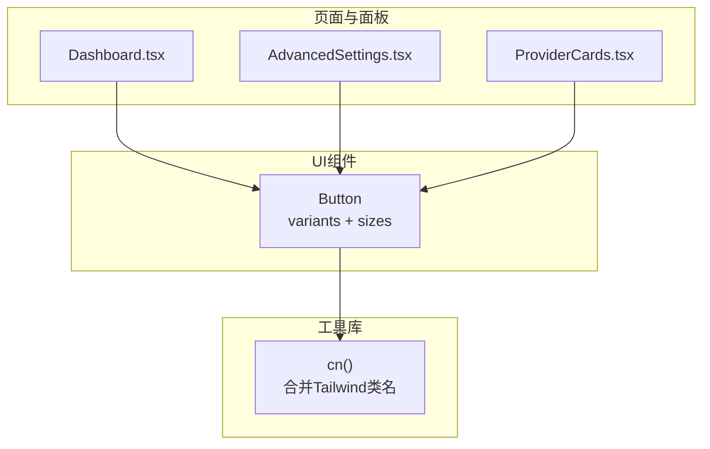
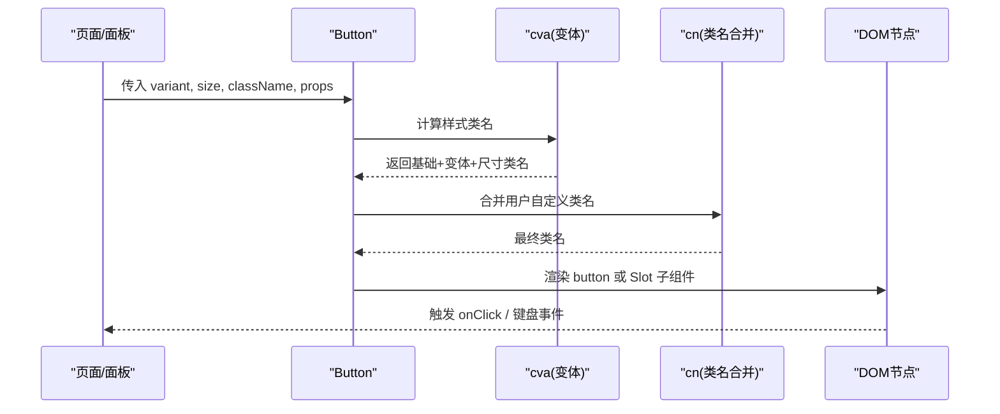
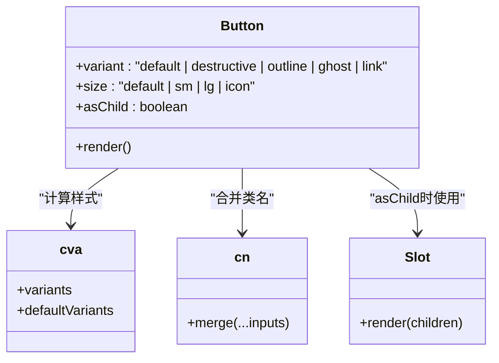
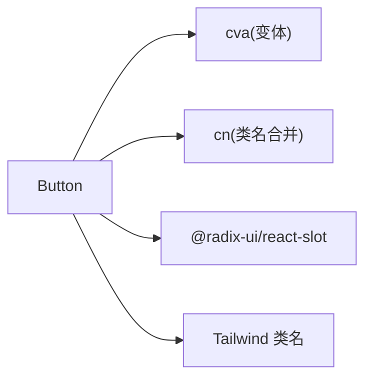

# Button按钮组件

<cite>
**本文引用的文件**
- [button.tsx](file://frontend/src/components/ui/button.tsx)
- [utils.ts](file://frontend/src/lib/utils.ts)
- [Dashboard.tsx](file://frontend/src/pages/Dashboard.tsx)
- [AdvancedSettings.tsx](file://frontend/src/components/settings/AdvancedSettings.tsx)
- [ProviderCards.tsx](file://frontend/src/components/settings/ProviderCards.tsx)
</cite>

## 目录
1. [简介](#简介)
2. [项目结构](#项目结构)
3. [核心组件](#核心组件)
4. [架构总览](#架构总览)
5. [详细组件分析](#详细组件分析)
6. [依赖关系分析](#依赖关系分析)
7. [性能考量](#性能考量)
8. [故障排查指南](#故障排查指南)
9. [结论](#结论)
10. [附录：使用示例与最佳实践](#附录使用示例与最佳实践)

## 简介
本文件系统性介绍前端Button按钮组件的设计与实现，覆盖变体系统（default、destructive、outline、ghost、link）、尺寸系统（default、sm、lg、icon）、可访问性特性（键盘导航、焦点管理、屏幕阅读器支持）、扩展机制（asChild属性、样式覆盖、事件处理），并提供完整的使用示例与最佳实践，帮助开发者在不同场景下选择合适的按钮类型与样式。

## 项目结构
Button组件位于UI基础组件目录中，通过组合类名工具函数与样式变体库实现高度可配置的外观与行为。其被多个页面和设置面板复用，用于触发操作、刷新数据、保存配置等交互。

图表来源
- [button.tsx:6-25](file://frontend/src/components/ui/button.tsx#L6-L25)
- [utils.ts:4-6](file://frontend/src/lib/utils.ts#L4-L6)
- [Dashboard.tsx:117-120](file://frontend/src/pages/Dashboard.tsx#L117-L120)
- [AdvancedSettings.tsx:56-59](file://frontend/src/components/settings/AdvancedSettings.tsx#L56-L59)
- [ProviderCards.tsx:1-200](file://frontend/src/components/settings/ProviderCards.tsx#L1-L200)

章节来源
- [button.tsx:1-43](file://frontend/src/components/ui/button.tsx#L1-L43)
- [utils.ts:1-68](file://frontend/src/lib/utils.ts#L1-L68)
- [Dashboard.tsx:1-199](file://frontend/src/pages/Dashboard.tsx#L1-L199)
- [AdvancedSettings.tsx:1-200](file://frontend/src/components/settings/AdvancedSettings.tsx#L1-L200)
- [ProviderCards.tsx:1-200](file://frontend/src/components/settings/ProviderCards.tsx#L1-L200)

## 核心组件
Button组件基于class-variance-authority定义样式变体与尺寸，并通过Radix Slot实现“作为子元素”渲染的能力，结合cn工具函数进行类名合并，最终输出原生button或自定义根节点。

- 变体系统
  - default：主操作按钮，强调色背景与白色文字，悬停加深。
  - destructive：危险操作，红色背景与白色文字，悬停加深。
  - outline：描边风格，透明背景，边框颜色来自主题变量，悬停高亮背景与文字。
  - ghost：幽灵风格，无背景，仅文字，悬停显示背景与高亮文字。
  - link：链接风格，带下划线与悬停下划线效果，强调色文字。
- 尺寸系统
  - default：标准高度与内边距，适合常规文本按钮。
  - sm：更紧凑的高度与字号，适合密集布局或辅助操作。
  - lg：更大高度与内边距，适合强调型主操作。
  - icon：固定宽高，适合纯图标按钮。
- 可访问性
  - 默认聚焦可见的轮廓与环状高亮，禁用态不可点击且半透明。
  - 通过原生button语义提供键盘可达性与屏幕阅读器支持。
- 扩展机制
  - asChild：将Button渲染为任意子组件（如Link、a等），保持样式与交互一致。
  - 样式覆盖：通过className传入额外类名，由cn合并到最终类名。
  - 事件处理：透传所有HTMLButtonElement属性，包括onClick、onKeyDown等。

章节来源
- [button.tsx:6-25](file://frontend/src/components/ui/button.tsx#L6-L25)
- [button.tsx:28-42](file://frontend/src/components/ui/button.tsx#L28-L42)
- [utils.ts:4-6](file://frontend/src/lib/utils.ts#L4-L6)

## 架构总览
Button组件在应用中的调用流程如下：页面或面板导入Button，根据业务场景选择variant与size，并传入事件处理器；Button内部根据asChild决定渲染为原生button或Slot包裹的子组件；样式通过cva生成并合并用户自定义类名；焦点与键盘行为由原生button语义保证。

图表来源
- [button.tsx:6-38](file://frontend/src/components/ui/button.tsx#L6-L38)
- [utils.ts:4-6](file://frontend/src/lib/utils.ts#L4-L6)

## 详细组件分析

### 变体系统与视觉效果
- default：适用于主要操作，如提交表单、确认注册等。
- destructive：适用于删除、取消订阅等破坏性操作，需配合提示或二次确认。
- outline：适用于次要操作或与主按钮并列的场景，如“查看详情”。
- ghost：适用于空间有限或需要弱化视觉层级的场景，如工具栏中的编辑、复制。
- link：适用于文本内嵌操作或轻量跳转，如“忘记密码”。

章节来源
- [button.tsx:9-16](file://frontend/src/components/ui/button.tsx#L9-L16)

### 尺寸系统与配置方法
- default：标准尺寸，适合大多数正文按钮。
- sm：紧凑尺寸，适合表格行内操作、标签旁的小按钮。
- lg：大尺寸，适合首屏主行动点。
- icon：方形图标按钮，常用于工具栏、卡片头部操作。

章节来源
- [button.tsx:17-22](file://frontend/src/components/ui/button.tsx#L17-L22)

### 可访问性特性
- 键盘导航：原生button具备Tab聚焦与Enter/Space激活能力。
- 焦点管理：focus-visible确保键盘聚焦时可见的高亮环，避免鼠标误触时的视觉残留。
- 屏幕阅读器：语义化button标签使读屏器正确识别为可点击控件。
- 禁用态：disabled时禁止交互并降低透明度，符合无障碍对比度要求。

章节来源
- [button.tsx:7-8](file://frontend/src/components/ui/button.tsx#L7-L8)
- [button.tsx:34-38](file://frontend/src/components/ui/button.tsx#L34-L38)

### 扩展机制
- asChild：当需要将Button样式应用到非button元素（如路由链接）时，启用asChild可将Button渲染为Slot包裹的子组件，保持外观一致的同时保留目标元素的语义与行为。
- 自定义样式覆盖：通过className传入额外类名，由cn合并到最终类名，支持响应式与主题变量。
- 事件处理：透传所有HTMLButtonElement属性，支持onClick、onKeyDown、onFocus、onBlur等，便于与上层状态管理集成。

章节来源
- [button.tsx:28-38](file://frontend/src/components/ui/button.tsx#L28-L38)
- [utils.ts:4-6](file://frontend/src/lib/utils.ts#L4-L6)

### 使用示例（来自实际页面）
- Dashboard页面：使用outline + sm尺寸进行“刷新”操作，搭配加载状态与图标，体现次要操作的轻量化。
- AdvancedSettings面板：使用outline + sm尺寸重启服务，展示在设置区域中的控制按钮。
- ProviderCards面板：在提供者配置卡片中使用Button进行保存、测试等操作，体现不同场景下的按钮组合。

章节来源
- [Dashboard.tsx:117-120](file://frontend/src/pages/Dashboard.tsx#L117-L120)
- [AdvancedSettings.tsx:56-59](file://frontend/src/components/settings/AdvancedSettings.tsx#L56-L59)
- [ProviderCards.tsx:1-200](file://frontend/src/components/settings/ProviderCards.tsx#L1-L200)

### 类图（组件结构与依赖）

图表来源
- [button.tsx:6-38](file://frontend/src/components/ui/button.tsx#L6-L38)
- [utils.ts:4-6](file://frontend/src/lib/utils.ts#L4-L6)

## 依赖关系分析
- 外部依赖
  - @radix-ui/react-slot：用于asChild模式，将Button渲染为任意子组件。
  - class-variance-authority：用于声明式地定义变体与尺寸样式。
  - Tailwind CSS：通过类名驱动样式，结合主题变量实现可定制外观。
- 内部依赖
  - utils.cn：合并多个类名源，避免冲突并优化输出。
- 耦合与内聚
  - Button与cva/cn解耦良好，变体与尺寸集中管理，便于统一维护。
  - 通过asChild降低对具体DOM类型的强耦合，提升复用性。

图表来源
- [button.tsx:1-4](file://frontend/src/components/ui/button.tsx#L1-L4)
- [button.tsx:6-25](file://frontend/src/components/ui/button.tsx#L6-L25)
- [utils.ts:4-6](file://frontend/src/lib/utils.ts#L4-L6)

章节来源
- [button.tsx:1-43](file://frontend/src/components/ui/button.tsx#L1-L43)
- [utils.ts:1-68](file://frontend/src/lib/utils.ts#L1-L68)

## 性能考量
- 样式计算：cva在编译期/运行期生成最小类名字符串，避免重复计算。
- 类名合并：cn使用高效合并策略，减少冗余类名，提升渲染性能。
- 事件处理：透传原生事件，避免额外包装带来的开销。
- 建议
  - 在大列表中使用sm尺寸以减少视觉噪音与布局抖动。
  - 谨慎使用大量动态className，尽量通过props传递稳定类名。

[本节为通用指导，不直接分析具体文件]

## 故障排查指南
- 按钮不可见或样式异常
  - 检查是否覆盖了主题变量导致对比度不足。
  - 确认cn是否正确合并了用户传入的className。
- 键盘无法聚焦或激活
  - 确认未禁用按钮，且未被其他元素遮挡。
  - 若使用asChild，确保子组件支持键盘交互与焦点管理。
- 屏幕阅读器未正确播报
  - 确保渲染的是button或具有role="button"的可聚焦元素。
  - 为图标按钮添加aria-label以描述操作意图。

章节来源
- [button.tsx:7-8](file://frontend/src/components/ui/button.tsx#L7-L8)
- [button.tsx:34-38](file://frontend/src/components/ui/button.tsx#L34-L38)

## 结论
Button组件通过cva与cn实现了清晰、可扩展的变体与尺寸系统，结合asChild提供了强大的渲染灵活性。其基于原生button的可访问性保障，使得键盘导航、焦点管理与屏幕阅读器支持开箱即用。在实际使用中，应根据业务场景选择合适的变体与尺寸，并通过className进行必要的样式微调，以获得一致的视觉体验与良好的可用性。

[本节为总结性内容，不直接分析具体文件]

## 附录：使用示例与最佳实践

### 使用示例
- 主操作按钮（default）
  - 场景：注册、提交表单、确认购买。
  - 参考位置：可在各页面主操作处使用，例如注册页面的提交按钮。
- 危险操作（destructive）
  - 场景：删除账号、取消订阅、清空数据。
  - 建议：配合二次确认弹窗，防止误操作。
- 次要操作（outline/sm）
  - 场景：刷新数据、查看详情、编辑配置。
  - 参考位置：Dashboard的“刷新”按钮、AdvancedSettings的“重启Solver”。
- 幽灵按钮（ghost）
  - 场景：工具栏中的编辑、复制、收藏等轻量操作。
- 链接按钮（link）
  - 场景：文本内嵌的操作，如“忘记密码”、“查看帮助”。

章节来源
- [Dashboard.tsx:117-120](file://frontend/src/pages/Dashboard.tsx#L117-L120)
- [AdvancedSettings.tsx:56-59](file://frontend/src/components/settings/AdvancedSettings.tsx#L56-L59)

### 最佳实践
- 选择原则
  - 主操作优先使用default，突出层级。
  - 危险操作使用destructive，并确保有确认机制。
  - 并列操作使用outline或ghost，避免视觉竞争。
  - 文本内操作使用link，保持阅读流畅。
- 尺寸选择
  - 默认使用default，空间紧张时使用sm，强调主行动点使用lg，纯图标使用icon。
- 可访问性
  - 为图标按钮添加aria-label。
  - 确保焦点可见，避免隐藏焦点指示。
  - 禁用态明确传达不可用信息。
- 扩展与定制
  - 使用asChild将按钮样式应用于链接或其他可交互元素。
  - 通过className注入额外样式，注意与主题变量保持一致。
  - 事件处理遵循React事件模型，避免副作用堆积。

[本节为通用指导，不直接分析具体文件]