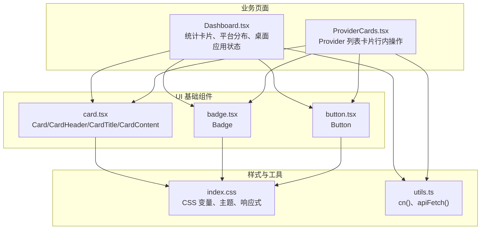
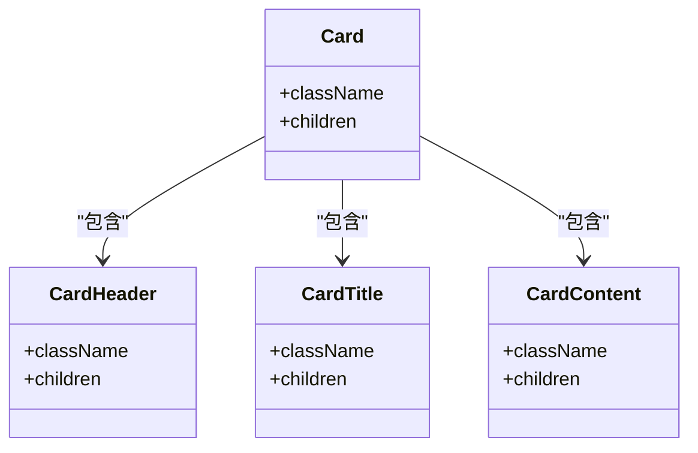
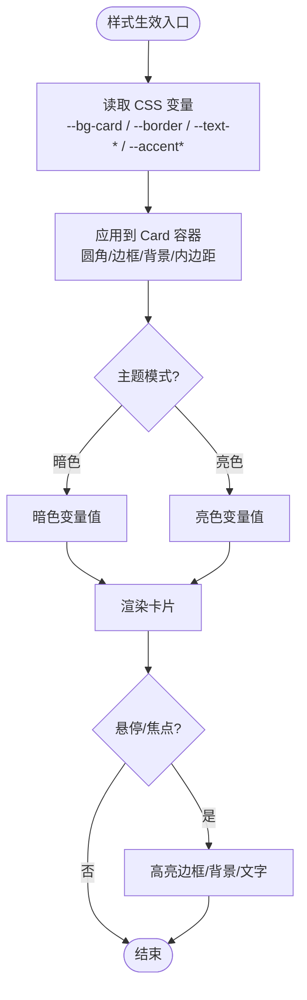
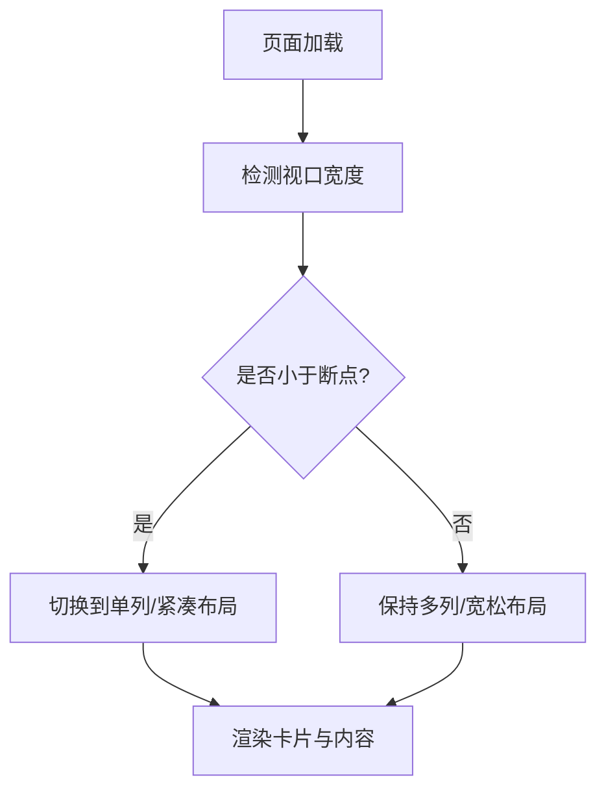
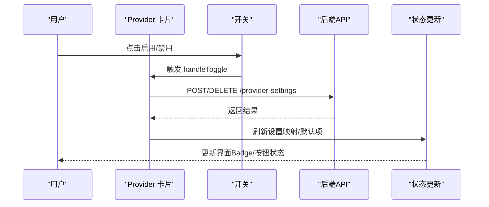
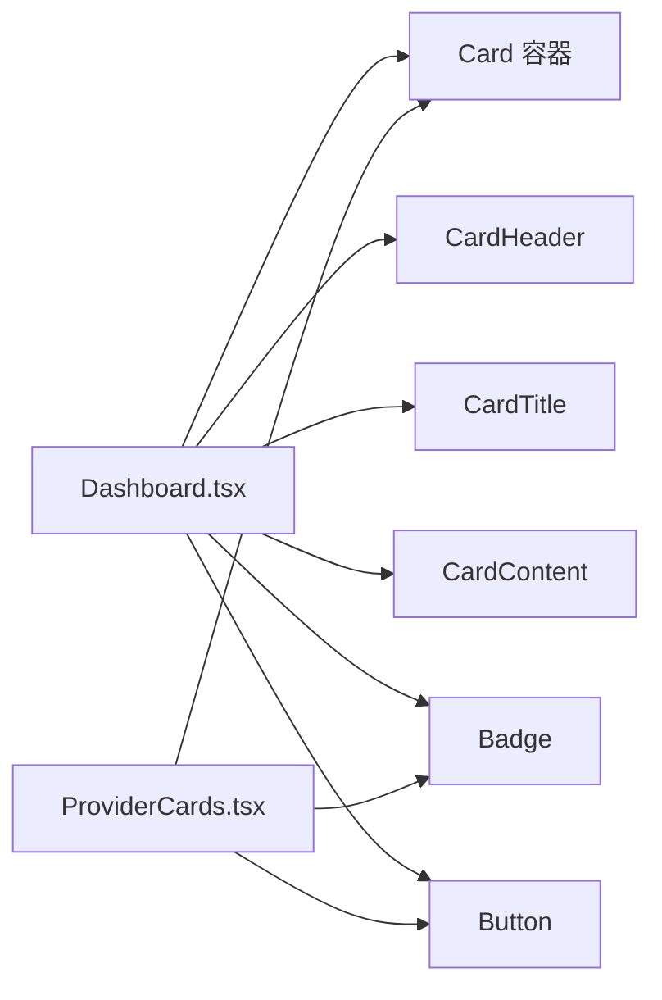
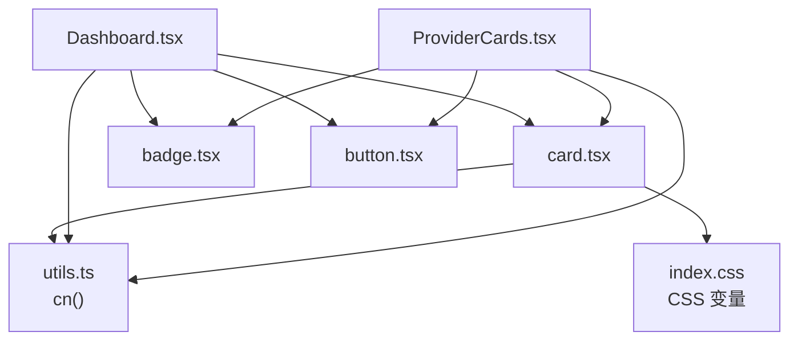

# Card卡片组件

<cite>
**本文引用的文件**
- [frontend/src/components/ui/card.tsx](file://frontend/src/components/ui/card.tsx)
- [frontend/src/components/ui/badge.tsx](file://frontend/src/components/ui/badge.tsx)
- [frontend/src/components/ui/button.tsx](file://frontend/src/components/ui/button.tsx)
- [frontend/src/lib/utils.ts](file://frontend/src/lib/utils.ts)
- [frontend/src/pages/Dashboard.tsx](file://frontend/src/pages/Dashboard.tsx)
- [frontend/src/components/settings/ProviderCards.tsx](file://frontend/src/components/settings/ProviderCards.tsx)
- [frontend/src/index.css](file://frontend/src/index.css)
</cite>

## 目录
1. [简介](#简介)
2. [项目结构](#项目结构)
3. [核心组件](#核心组件)
4. [架构总览](#架构总览)
5. [详细组件分析](#详细组件分析)
6. [依赖关系分析](#依赖关系分析)
7. [性能考量](#性能考量)
8. [故障排查指南](#故障排查指南)
9. [结论](#结论)
10. [附录：使用示例与最佳实践](#附录使用示例与最佳实践)

## 简介
本文件系统性梳理前端中的 Card 卡片组件及其在业务页面中的组合用法，覆盖以下方面：
- 卡片的结构组成：头部、内容区域、标题等子模块的布局方式
- 样式系统：边框、阴影、圆角、背景色等视觉效果的配置方法（基于 CSS 变量与 Tailwind）
- 响应式设计：在不同屏幕尺寸下的显示适配策略
- 交互特性：悬停效果、点击反馈、状态变化（启用/禁用、默认标记、测试连接等）
- 完整使用示例：不同类型卡片的创建方法与自定义样式
- 最佳实践：如何合理使用卡片组件进行信息展示

## 项目结构
Card 组件位于 UI 基础组件层，被多个业务页面复用。其核心由一个容器 Card 以及若干语义化子组件构成；同时配合 Badge、Button 等原子组件完成丰富的信息表达与交互。



图表来源
- [frontend/src/components/ui/card.tsx:1-40](file://frontend/src/components/ui/card.tsx#L1-L40)
- [frontend/src/components/ui/badge.tsx:1-30](file://frontend/src/components/ui/badge.tsx#L1-L30)
- [frontend/src/components/ui/button.tsx:1-43](file://frontend/src/components/ui/button.tsx#L1-L43)
- [frontend/src/pages/Dashboard.tsx:1-199](file://frontend/src/pages/Dashboard.tsx#L1-L199)
- [frontend/src/components/settings/ProviderCards.tsx:1-572](file://frontend/src/components/settings/ProviderCards.tsx#L1-L572)
- [frontend/src/index.css:1-369](file://frontend/src/index.css#L1-L369)
- [frontend/src/lib/utils.ts:1-68](file://frontend/src/lib/utils.ts#L1-L68)

章节来源
- [frontend/src/components/ui/card.tsx:1-40](file://frontend/src/components/ui/card.tsx#L1-L40)
- [frontend/src/pages/Dashboard.tsx:1-199](file://frontend/src/pages/Dashboard.tsx#L1-L199)
- [frontend/src/components/settings/ProviderCards.tsx:1-572](file://frontend/src/components/settings/ProviderCards.tsx#L1-L572)
- [frontend/src/index.css:1-369](file://frontend/src/index.css#L1-L369)

## 核心组件
- Card：卡片容器，提供统一的圆角、边框、背景与内边距，作为信息块的基础承载单元
- CardHeader：卡片头部容器，用于放置标题、副标题或操作按钮
- CardTitle：卡片标题，强调层级与可读性
- CardContent：卡片内容区，承载具体信息或复杂布局

这些组件通过 className 组合与 CSS 变量实现一致的视觉风格，并支持通过 className 自由扩展。

章节来源
- [frontend/src/components/ui/card.tsx:1-40](file://frontend/src/components/ui/card.tsx#L1-L40)

## 架构总览
卡片组件采用“容器 + 语义子组件”的组合模式，业务页面通过组合不同子组件来构建多样化的卡片形态。样式层面统一通过 CSS 变量与 Tailwind 类名管理，确保暗色/亮色主题一致性与可维护性。

```mermaid
sequenceDiagram
participant Page as "页面(Dashboard/Settings)"
participant Card as "Card 组件"
participant Header as "CardHeader"
participant Title as "CardTitle"
participant Content as "CardContent"
participant Utils as "工具(utils.ts)"
participant API as "后端API"
Page->>Card : 渲染卡片容器
Card->>Header : 渲染头部
Header->>Title : 渲染标题
Card->>Content : 渲染内容区
Page->>Utils : 调用 apiFetch 获取数据
Utils->>API : 发送请求
API-->>Utils : 返回数据
Utils-->>Page : 解析结果
Page->>Content : 更新内容区展示
```

图表来源
- [frontend/src/pages/Dashboard.tsx:1-199](file://frontend/src/pages/Dashboard.tsx#L1-L199)
- [frontend/src/components/ui/card.tsx:1-40](file://frontend/src/components/ui/card.tsx#L1-L40)
- [frontend/src/lib/utils.ts:1-68](file://frontend/src/lib/utils.ts#L1-L68)

## 详细组件分析

### Card 容器与子组件
- 容器 Card：定义圆角、边框、背景色与内边距，便于在不同页面中保持一致的视觉基线
- 头部 CardHeader：提供间距与布局控制，适合放置标题与操作按钮
- 标题 CardTitle：语义化标题，增强可读性与可访问性
- 内容 CardContent：无额外约束的内容容器，便于自由布局



图表来源
- [frontend/src/components/ui/card.tsx:1-40](file://frontend/src/components/ui/card.tsx#L1-L40)

章节来源
- [frontend/src/components/ui/card.tsx:1-40](file://frontend/src/components/ui/card.tsx#L1-L40)

### 样式系统与视觉效果
- 边框与圆角：卡片使用统一的边框与圆角，保证视觉一致性
- 背景色：通过 CSS 变量 --bg-card 控制，支持暗色/亮色主题切换
- 文本颜色：通过 --text-primary、--text-secondary、--text-muted 控制层次
- 阴影：通过 --shadow-soft/--shadow-hard 提供柔和/强阴影选项
- 焦点与交互：输入控件聚焦时高亮边框与光晕，按钮具备 hover/focus/disabled 状态



图表来源
- [frontend/src/index.css:1-369](file://frontend/src/index.css#L1-L369)
- [frontend/src/components/ui/card.tsx:1-40](file://frontend/src/components/ui/card.tsx#L1-L40)

章节来源
- [frontend/src/index.css:1-369](file://frontend/src/index.css#L1-L369)
- [frontend/src/components/ui/card.tsx:1-40](file://frontend/src/components/ui/card.tsx#L1-L40)

### 响应式设计
- 网格布局：Dashboard 中使用响应式网格（如 sm:grid-cols-2、xl:grid-cols-4），在小屏自动换行，大屏多列展示
- 对话框与面板：在窄屏下调整最大高度与圆角，提升移动端体验
- 卡片内容：通过 flex/grid 与 Tailwind 断点实现自适应排版



图表来源
- [frontend/src/pages/Dashboard.tsx:1-199](file://frontend/src/pages/Dashboard.tsx#L1-L199)
- [frontend/src/index.css:343-369](file://frontend/src/index.css#L343-L369)

章节来源
- [frontend/src/pages/Dashboard.tsx:1-199](file://frontend/src/pages/Dashboard.tsx#L1-L199)
- [frontend/src/index.css:343-369](file://frontend/src/index.css#L343-L369)

### 交互特性
- 悬停效果：按钮与操作项在悬停时改变边框与背景，突出可点击区域
- 点击反馈：保存/测试等操作按钮具备 loading 与成功态提示
- 状态变化：Provider 卡片支持启用/禁用、设为默认、删除等状态切换，并通过 Badge 标识默认项
- 可访问性：按钮具备 role 与 aria-checked 属性，提升键盘与读屏支持



图表来源
- [frontend/src/components/settings/ProviderCards.tsx:372-403](file://frontend/src/components/settings/ProviderCards.tsx#L372-L403)
- [frontend/src/components/settings/ProviderCards.tsx:447-523](file://frontend/src/components/settings/ProviderCards.tsx#L447-L523)

章节来源
- [frontend/src/components/settings/ProviderCards.tsx:1-572](file://frontend/src/components/settings/ProviderCards.tsx#L1-L572)

### 使用示例
- Dashboard 页面：使用 Card 包裹统计信息与平台分布，结合 Badge 展示状态，Button 提供刷新操作
- ProviderCards：以行内卡片形式展示各 Provider 的配置与操作，支持编辑、测试、设默认、删除与启用/禁用



图表来源
- [frontend/src/pages/Dashboard.tsx:1-199](file://frontend/src/pages/Dashboard.tsx#L1-L199)
- [frontend/src/components/settings/ProviderCards.tsx:1-572](file://frontend/src/components/settings/ProviderCards.tsx#L1-L572)

章节来源
- [frontend/src/pages/Dashboard.tsx:1-199](file://frontend/src/pages/Dashboard.tsx#L1-L199)
- [frontend/src/components/settings/ProviderCards.tsx:1-572](file://frontend/src/components/settings/ProviderCards.tsx#L1-L572)

## 依赖关系分析
- Card 组件依赖样式变量与工具函数 cn()，确保类名合并与主题一致性
- 业务页面依赖 Card 及 Badge/Button 等原子组件，形成稳定的 UI 组合
- 网络请求通过 utils.ts 的 apiFetch 封装，统一处理认证与错误



图表来源
- [frontend/src/components/ui/card.tsx:1-40](file://frontend/src/components/ui/card.tsx#L1-L40)
- [frontend/src/components/ui/badge.tsx:1-30](file://frontend/src/components/ui/badge.tsx#L1-L30)
- [frontend/src/components/ui/button.tsx:1-43](file://frontend/src/components/ui/button.tsx#L1-L43)
- [frontend/src/pages/Dashboard.tsx:1-199](file://frontend/src/pages/Dashboard.tsx#L1-L199)
- [frontend/src/components/settings/ProviderCards.tsx:1-572](file://frontend/src/components/settings/ProviderCards.tsx#L1-L572)
- [frontend/src/lib/utils.ts:1-68](file://frontend/src/lib/utils.ts#L1-L68)
- [frontend/src/index.css:1-369](file://frontend/src/index.css#L1-L369)

章节来源
- [frontend/src/lib/utils.ts:1-68](file://frontend/src/lib/utils.ts#L1-L68)
- [frontend/src/index.css:1-369](file://frontend/src/index.css#L1-L369)

## 性能考量
- 组件粒度：将卡片拆分为 Card/Header/Title/Content，有利于局部更新与复用
- 样式优化：使用 CSS 变量减少重复样式，Tailwind 类名按需生成，避免冗余
- 网络请求：通过 apiFetch 统一缓存与错误处理，减少重复逻辑
- 交互反馈：loading 与成功态及时更新，避免长时间无反馈导致的重复提交

[本节为通用指导，不直接分析具体文件]

## 故障排查指南
- 未授权错误：当后端返回 401 时，前端会清除本地令牌并刷新页面，检查登录状态与 Token 有效性
- 网络异常：apiFetch 在非 ok 状态下抛出错误，查看控制台日志与后端返回信息
- 样式错乱：确认 CSS 变量是否正确注入，检查主题类名（light/dark）是否生效
- 交互无响应：检查按钮 disabled 状态与事件绑定，确认 Provider 是否已启用

章节来源
- [frontend/src/lib/utils.ts:24-36](file://frontend/src/lib/utils.ts#L24-L36)
- [frontend/src/components/settings/ProviderCards.tsx:372-403](file://frontend/src/components/settings/ProviderCards.tsx#L372-L403)

## 结论
Card 组件通过简洁的容器与语义化子组件，结合统一的样式系统与响应式布局，提供了稳定且易扩展的信息展示能力。在业务页面中，它与 Badge、Button 等原子组件协作，实现了丰富的交互与状态管理。遵循本文的最佳实践，开发者可以高效地构建高质量的用户界面。

[本节为总结，不直接分析具体文件]

## 附录：使用示例与最佳实践

### 基本用法
- 在页面中引入 Card、CardHeader、CardTitle、CardContent
- 使用 CardHeader 放置标题与操作按钮，CardContent 承载具体内容
- 通过 className 扩展样式，必要时覆盖默认行为

章节来源
- [frontend/src/pages/Dashboard.tsx:114-143](file://frontend/src/pages/Dashboard.tsx#L114-L143)
- [frontend/src/pages/Dashboard.tsx:145-185](file://frontend/src/pages/Dashboard.tsx#L145-L185)

### 状态与交互
- 使用 Badge 标注默认项或状态（如“默认”、“就绪”）
- 使用 Button 提供保存、测试、刷新等操作，注意 loading 与成功态
- 在 ProviderCards 中实现启用/禁用、设为默认、删除等状态切换

章节来源
- [frontend/src/components/settings/ProviderCards.tsx:447-523](file://frontend/src/components/settings/ProviderCards.tsx#L447-L523)
- [frontend/src/components/ui/badge.tsx:1-30](file://frontend/src/components/ui/badge.tsx#L1-L30)
- [frontend/src/components/ui/button.tsx:1-43](file://frontend/src/components/ui/button.tsx#L1-L43)

### 样式定制
- 通过 CSS 变量调整主题色、背景、边框与阴影
- 使用 Tailwind 断点实现响应式布局
- 利用 cn() 合并类名，避免冲突

章节来源
- [frontend/src/index.css:7-79](file://frontend/src/index.css#L7-L79)
- [frontend/src/lib/utils.ts:1-6](file://frontend/src/lib/utils.ts#L1-L6)

### 最佳实践
- 保持卡片内容层次清晰：标题、描述、操作分区明确
- 合理分组与留白：避免信息过载，提升可读性
- 统一交互反馈：所有操作需有明确的 loading、成功与失败提示
- 可访问性：为关键交互元素添加必要的 role 与 aria 属性

[本节为通用指导，不直接分析具体文件]