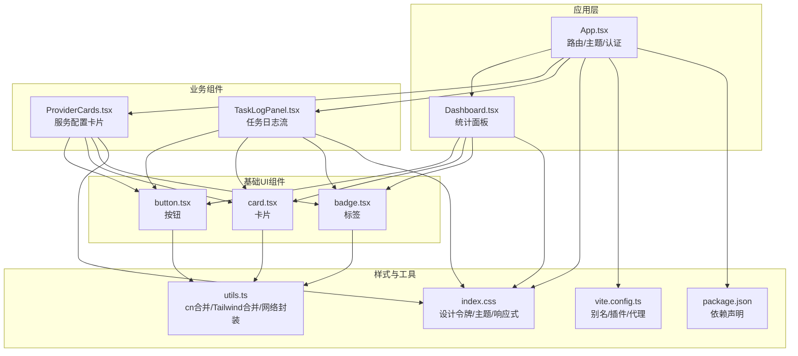
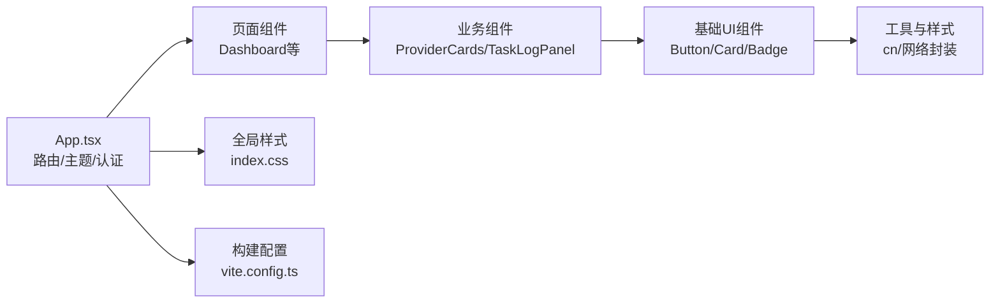
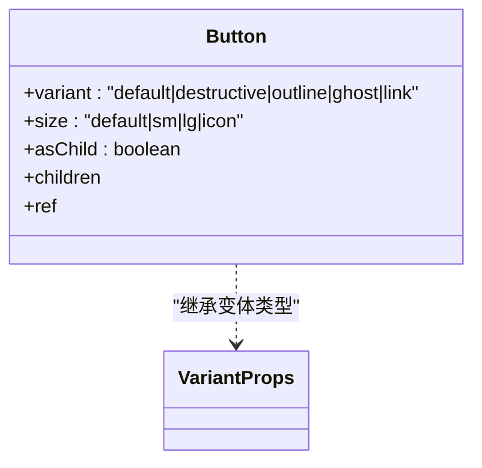
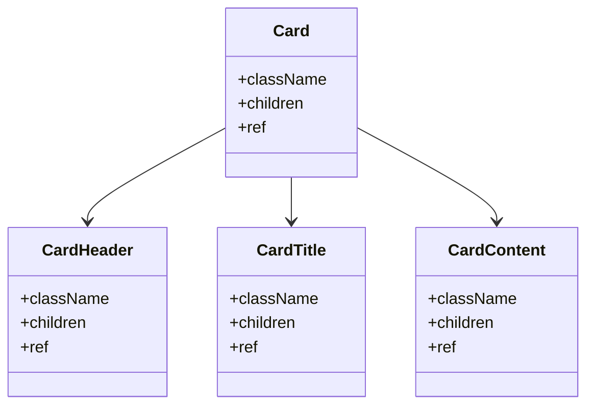
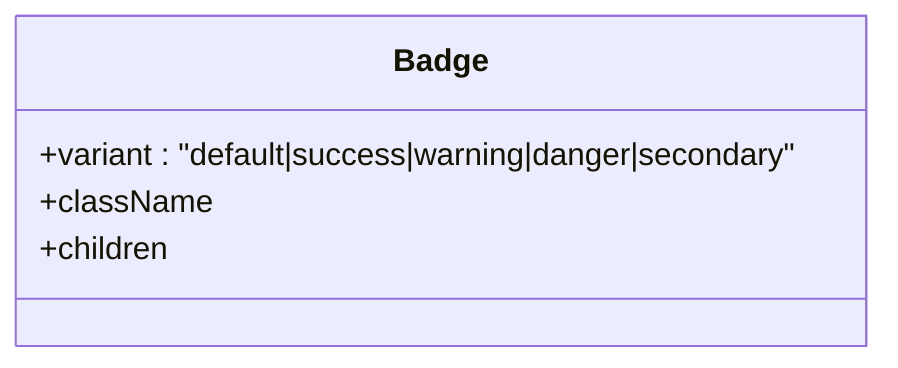
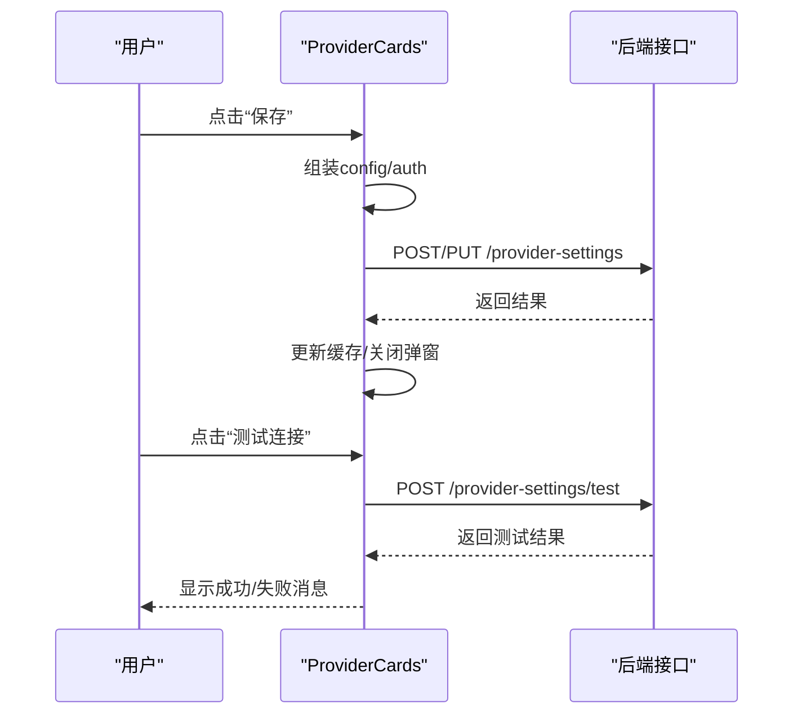
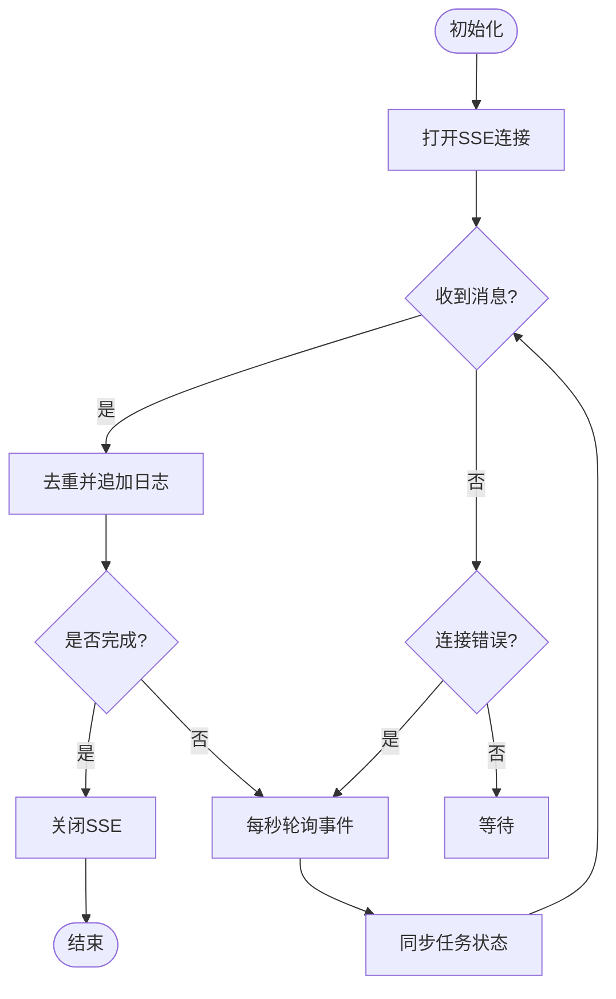
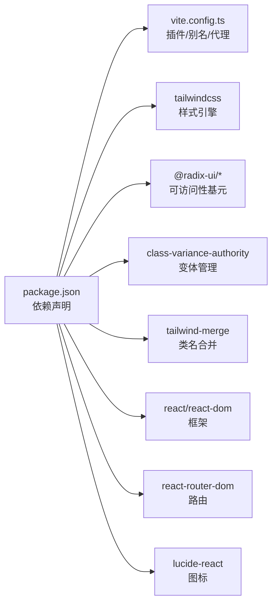

# UI组件库

<cite>
**本文引用的文件**
- [frontend/src/components/ui/button.tsx](file://frontend/src/components/ui/button.tsx)
- [frontend/src/components/ui/card.tsx](file://frontend/src/components/ui/card.tsx)
- [frontend/src/components/ui/badge.tsx](file://frontend/src/components/ui/badge.tsx)
- [frontend/src/lib/utils.ts](file://frontend/src/lib/utils.ts)
- [frontend/src/index.css](file://frontend/src/index.css)
- [frontend/vite.config.ts](file://frontend/vite.config.ts)
- [frontend/package.json](file://frontend/package.json)
- [frontend/src/App.tsx](file://frontend/src/App.tsx)
- [frontend/src/pages/Dashboard.tsx](file://frontend/src/pages/Dashboard.tsx)
- [frontend/src/components/settings/ProviderCards.tsx](file://frontend/src/components/settings/ProviderCards.tsx)
- [frontend/src/components/tasks/TaskLogPanel.tsx](file://frontend/src/components/tasks/TaskLogPanel.tsx)
</cite>

## 目录
1. [简介](#简介)
2. [项目结构](#项目结构)
3. [核心组件](#核心组件)
4. [架构总览](#架构总览)
5. [详细组件分析](#详细组件分析)
6. [依赖关系分析](#依赖关系分析)
7. [性能考量](#性能考量)
8. [故障排查指南](#故障排查指南)
9. [结论](#结论)
10. [附录](#附录)

## 简介
本文件系统化梳理前端UI组件库的设计与实现，覆盖基础组件（Button、Card、Badge）、业务组件（ProviderCards、TaskLogPanel）以及布局与页面级组合（App、Dashboard）。文档重点说明：
- 组件分类与组织方式
- 样式系统（Tailwind CSS + CSS变量主题 + 响应式）
- 可访问性实践（WCAG相关）
- 状态管理（受控/非受控、事件处理、生命周期）
- 测试策略建议（单元、集成、视觉回归）
- 扩展指南（如何创建符合规范的自定义组件）
- 最佳实践与性能优化

## 项目结构
前端采用Vite + React + TypeScript构建，组件按“ui基础组件 / 业务组件 / 页面”分层组织。样式基于Tailwind CSS v4与CSS设计令牌（Design Tokens），通过CSS变量实现主题切换与一致性。

图表来源
- [frontend/src/App.tsx:1-393](file://frontend/src/App.tsx#L1-L393)
- [frontend/src/pages/Dashboard.tsx:1-199](file://frontend/src/pages/Dashboard.tsx#L1-L199)
- [frontend/src/components/settings/ProviderCards.tsx:1-572](file://frontend/src/components/settings/ProviderCards.tsx#L1-L572)
- [frontend/src/components/tasks/TaskLogPanel.tsx:1-204](file://frontend/src/components/tasks/TaskLogPanel.tsx#L1-L204)
- [frontend/src/components/ui/button.tsx:1-43](file://frontend/src/components/ui/button.tsx#L1-L43)
- [frontend/src/components/ui/card.tsx:1-40](file://frontend/src/components/ui/card.tsx#L1-L40)
- [frontend/src/components/ui/badge.tsx:1-30](file://frontend/src/components/ui/badge.tsx#L1-L30)
- [frontend/src/index.css:1-369](file://frontend/src/index.css#L1-L369)
- [frontend/src/lib/utils.ts:1-68](file://frontend/src/lib/utils.ts#L1-L68)
- [frontend/vite.config.ts:1-23](file://frontend/vite.config.ts#L1-L23)
- [frontend/package.json:1-44](file://frontend/package.json#L1-L44)

章节来源
- [frontend/src/App.tsx:1-393](file://frontend/src/App.tsx#L1-L393)
- [frontend/package.json:1-44](file://frontend/package.json#L1-L44)
- [frontend/vite.config.ts:1-23](file://frontend/vite.config.ts#L1-L23)

## 核心组件
本节聚焦基础UI组件的API、变体、尺寸与使用方式，并给出在业务场景中的组合示例路径。

- Button
  - 功能特性：支持多种变体（默认、破坏性、描边、幽灵、链接）、多尺寸（默认、小、大、图标）、可透传HTML属性、支持asChild模式以渲染为其他元素。
  - 使用方式：通过variant和size控制外观；className可通过合并函数叠加；焦点态与禁用态有统一样式。
  - 参考路径：[button.tsx:6-26](file://frontend/src/components/ui/button.tsx#L6-L26)、[button.tsx:28-42](file://frontend/src/components/ui/button.tsx#L28-L42)

- Card
  - 功能特性：提供容器Card及子区域CardHeader、CardTitle、CardContent，便于结构化内容展示。
  - 使用方式：组合使用以实现信息区块；边框、背景色、内边距由组件内置样式控制。
  - 参考路径：[card.tsx:4-39](file://frontend/src/components/ui/card.tsx#L4-L39)

- Badge
  - 功能特性：用于状态或标签展示，支持多种语义化变体（默认、成功、警告、危险、次要）。
  - 使用方式：通过variant选择颜色与边框风格；文本内容自由定制。
  - 参考路径：[badge.tsx:5-19](file://frontend/src/components/ui/badge.tsx#L5-L19)、[badge.tsx:21-29](file://frontend/src/components/ui/badge.tsx#L21-L29)

- 样式与工具
  - cn合并：基于clsx与tailwind-merge，避免类名冲突与重复。
  - 参考路径：[utils.ts:1-6](file://frontend/src/lib/utils.ts#L1-L6)

章节来源
- [frontend/src/components/ui/button.tsx:1-43](file://frontend/src/components/ui/button.tsx#L1-L43)
- [frontend/src/components/ui/card.tsx:1-40](file://frontend/src/components/ui/card.tsx#L1-L40)
- [frontend/src/components/ui/badge.tsx:1-30](file://frontend/src/components/ui/badge.tsx#L1-L30)
- [frontend/src/lib/utils.ts:1-68](file://frontend/src/lib/utils.ts#L1-L68)

## 架构总览
整体架构遵循“页面/业务组件 -> 基础UI组件 -> 样式与工具”的分层模式。主题通过CSS变量集中管理，页面与组件通过Tailwind原子类与变量组合实现一致的外观与交互。

图表来源
- [frontend/src/App.tsx:1-393](file://frontend/src/App.tsx#L1-L393)
- [frontend/src/pages/Dashboard.tsx:1-199](file://frontend/src/pages/Dashboard.tsx#L1-L199)
- [frontend/src/components/settings/ProviderCards.tsx:1-572](file://frontend/src/components/settings/ProviderCards.tsx#L1-L572)
- [frontend/src/components/tasks/TaskLogPanel.tsx:1-204](file://frontend/src/components/tasks/TaskLogPanel.tsx#L1-L204)
- [frontend/src/components/ui/button.tsx:1-43](file://frontend/src/components/ui/button.tsx#L1-L43)
- [frontend/src/components/ui/card.tsx:1-40](file://frontend/src/components/ui/card.tsx#L1-L40)
- [frontend/src/components/ui/badge.tsx:1-30](file://frontend/src/components/ui/badge.tsx#L1-L30)
- [frontend/src/index.css:1-369](file://frontend/src/index.css#L1-L369)
- [frontend/vite.config.ts:1-23](file://frontend/vite.config.ts#L1-L23)

## 详细组件分析

### 基础组件：Button
- 设计要点
  - 变体与尺寸：通过class-variance-authority定义变体与尺寸，保证一致的命名空间与默认值。
  - 可访问性：保留原生button语义，支持focus-visible环与禁用态；asChild模式允许作为其他可交互元素渲染。
  - 样式：使用CSS变量与Tailwind原子类组合，确保主题一致性与可维护性。
- 使用示例（路径）
  - 在仪表盘刷新按钮中使用：[Dashboard.tsx:117-120](file://frontend/src/pages/Dashboard.tsx#L117-L120)
  - 在设置页保存/测试按钮中使用：[ProviderCards.tsx:323-332](file://frontend/src/components/settings/ProviderCards.tsx#L323-L332)

图表来源
- [frontend/src/components/ui/button.tsx:6-26](file://frontend/src/components/ui/button.tsx#L6-L26)
- [frontend/src/components/ui/button.tsx:28-42](file://frontend/src/components/ui/button.tsx#L28-L42)

章节来源
- [frontend/src/components/ui/button.tsx:1-43](file://frontend/src/components/ui/button.tsx#L1-L43)
- [frontend/src/pages/Dashboard.tsx:117-120](file://frontend/src/pages/Dashboard.tsx#L117-L120)
- [frontend/src/components/settings/ProviderCards.tsx:323-332](file://frontend/src/components/settings/ProviderCards.tsx#L323-L332)

### 基础组件：Card
- 设计要点
  - 结构清晰：Card作为容器，CardHeader/CardTitle/CardContent划分内容区域，便于排版与语义化。
  - 主题适配：边框、背景、文字颜色均通过CSS变量，支持明暗主题无缝切换。
- 使用示例（路径）
  - 仪表盘统计卡片：[Dashboard.tsx:114-143](file://frontend/src/pages/Dashboard.tsx#L114-L143)
  - 桌面应用状态卡片：[Dashboard.tsx:145-185](file://frontend/src/pages/Dashboard.tsx#L145-L185)

图表来源
- [frontend/src/components/ui/card.tsx:4-39](file://frontend/src/components/ui/card.tsx#L4-L39)

章节来源
- [frontend/src/components/ui/card.tsx:1-40](file://frontend/src/components/ui/card.tsx#L1-L40)
- [frontend/src/pages/Dashboard.tsx:114-185](file://frontend/src/pages/Dashboard.tsx#L114-L185)

### 基础组件：Badge
- 设计要点
  - 语义化变体：success/warning/danger/secondary等，便于表达状态与重要性。
  - 轻量无状态：纯展示型组件，适合与列表、表格、卡片组合使用。
- 使用示例（路径）
  - 仪表盘状态分布：[Dashboard.tsx:84-92](file://frontend/src/pages/Dashboard.tsx#L84-L92)
  - 服务默认标记：[ProviderCards.tsx:459-462](file://frontend/src/components/settings/ProviderCards.tsx#L459-L462)

图表来源
- [frontend/src/components/ui/badge.tsx:5-19](file://frontend/src/components/ui/badge.tsx#L5-L19)
- [frontend/src/components/ui/badge.tsx:21-29](file://frontend/src/components/ui/badge.tsx#L21-L29)

章节来源
- [frontend/src/components/ui/badge.tsx:1-30](file://frontend/src/components/ui/badge.tsx#L1-L30)
- [frontend/src/pages/Dashboard.tsx:84-92](file://frontend/src/pages/Dashboard.tsx#L84-L92)
- [frontend/src/components/settings/ProviderCards.tsx:459-462](file://frontend/src/components/settings/ProviderCards.tsx#L459-L462)

### 业务组件：ProviderCards（服务配置卡片）
- 功能概述
  - 分组展示服务目录，支持启用/禁用、设为默认、编辑配置、测试连接、删除自定义服务等操作。
  - 动态表单：根据字段类型渲染输入、开关、下拉、异步选择等控件。
  - 状态管理：本地状态驱动UI，调用后端接口持久化配置，失败时回滚或提示。
- 关键流程（保存/测试）

图表来源
- [frontend/src/components/settings/ProviderCards.tsx:176-235](file://frontend/src/components/settings/ProviderCards.tsx#L176-L235)
- [frontend/src/components/settings/ProviderCards.tsx:372-403](file://frontend/src/components/settings/ProviderCards.tsx#L372-L403)
- [frontend/src/components/settings/ProviderCards.tsx:405-427](file://frontend/src/components/settings/ProviderCards.tsx#L405-L427)

章节来源
- [frontend/src/components/settings/ProviderCards.tsx:1-572](file://frontend/src/components/settings/ProviderCards.tsx#L1-L572)

### 业务组件：TaskLogPanel（任务日志面板）
- 功能概述
  - 通过SSE实时接收任务日志，自动去重与滚动到底部。
  - 当SSE不可用时，降级为轮询获取事件与任务状态。
  - 展示任务进度、错误信息与复制日志能力。
- 关键流程（SSE与降级）

图表来源
- [frontend/src/components/tasks/TaskLogPanel.tsx:28-108](file://frontend/src/components/tasks/TaskLogPanel.tsx#L28-L108)
- [frontend/src/components/tasks/TaskLogPanel.tsx:114-128](file://frontend/src/components/tasks/TaskLogPanel.tsx#L114-L128)

章节来源
- [frontend/src/components/tasks/TaskLogPanel.tsx:1-204](file://frontend/src/components/tasks/TaskLogPanel.tsx#L1-L204)

### 页面与布局：App与Dashboard
- App
  - 负责路由、主题切换、认证检查与登录拦截。
  - 侧边栏导航与主内容区布局。
  - 参考路径：[App.tsx:29-238](file://frontend/src/App.tsx#L29-L238)、[App.tsx:244-278](file://frontend/src/App.tsx#L244-L278)、[App.tsx:284-340](file://frontend/src/App.tsx#L284-L340)、[App.tsx:346-393](file://frontend/src/App.tsx#L346-L393)
- Dashboard
  - 聚合统计数据、平台分布、桌面应用状态，使用Card/Badge/Button组合呈现。
  - 参考路径：[Dashboard.tsx:42-199](file://frontend/src/pages/Dashboard.tsx#L42-L199)

章节来源
- [frontend/src/App.tsx:1-393](file://frontend/src/App.tsx#L1-L393)
- [frontend/src/pages/Dashboard.tsx:1-199](file://frontend/src/pages/Dashboard.tsx#L1-L199)

## 依赖关系分析
- 运行时依赖
  - React生态：React、react-router-dom
  - UI与样式：@radix-ui系列（Dialog/Select/Tabs/Toast等）、lucide-react图标、class-variance-authority、clsx、tailwind-merge、tailwindcss
  - 构建工具：vite、@vitejs/plugin-react、@tailwindcss/vite
- 构建配置
  - 路径别名：'@'指向src目录
  - 开发代理：'/api'代理到后端
  - 输出目录：../static
- 依赖图

图表来源
- [frontend/package.json:12-28](file://frontend/package.json#L12-L28)
- [frontend/vite.config.ts:1-23](file://frontend/vite.config.ts#L1-L23)

章节来源
- [frontend/package.json:1-44](file://frontend/package.json#L1-L44)
- [frontend/vite.config.ts:1-23](file://frontend/vite.config.ts#L1-L23)

## 性能考量
- 样式与主题
  - 使用CSS变量集中管理主题，减少重复计算与样式抖动。
  - Tailwind原子类配合cn合并，避免类名冲突与冗余。
  - 参考路径：[index.css:7-79](file://frontend/src/index.css#L7-L79)、[utils.ts:1-6](file://frontend/src/lib/utils.ts#L1-L6)
- 网络请求
  - 统一的apiFetch封装，自动附加鉴权头与401处理，减少重复逻辑。
  - SSE优先、轮询降级的日志拉取策略，降低无效请求。
  - 参考路径：[utils.ts:24-36](file://frontend/src/lib/utils.ts#L24-L36)、[TaskLogPanel.tsx:67-108](file://frontend/src/components/tasks/TaskLogPanel.tsx#L67-L108)
- 组件渲染
  - 基础组件保持无状态或最小状态，业务组件将复杂状态集中在父级，提升可预测性。
  - 使用React.forwardRef与Slot模式，提高复用性与性能。
  - 参考路径：[button.tsx:34-40](file://frontend/src/components/ui/button.tsx#L34-L40)、[card.tsx:4-16](file://frontend/src/components/ui/card.tsx#L4-L16)

## 故障排查指南
- 网络与鉴权
  - 401未授权：统一在apiFetch中清除token并刷新页面，避免重复请求。
  - 参考路径：[utils.ts:24-36](file://frontend/src/lib/utils.ts#L24-L36)
- 主题与样式
  - 主题切换异常：检查根节点light类切换逻辑与CSS变量覆盖范围。
  - 参考路径：[App.tsx:350-364](file://frontend/src/App.tsx#L350-L364)、[index.css:7-79](file://frontend/src/index.css#L7-L79)
- 日志面板
  - SSE断开：自动切换到轮询模式，确保日志不丢失；完成后及时关闭连接释放资源。
  - 参考路径：[TaskLogPanel.tsx:67-108](file://frontend/src/components/tasks/TaskLogPanel.tsx#L67-L108)

章节来源
- [frontend/src/lib/utils.ts:24-36](file://frontend/src/lib/utils.ts#L24-L36)
- [frontend/src/App.tsx:350-364](file://frontend/src/App.tsx#L350-L364)
- [frontend/src/components/tasks/TaskLogPanel.tsx:67-108](file://frontend/src/components/tasks/TaskLogPanel.tsx#L67-L108)

## 结论
该UI组件库以“基础组件 + 业务组件 + 页面”的分层架构为基础，借助Tailwind CSS与CSS变量实现高度可定制的主题与响应式体验。组件遵循可访问性原则，结合Radix基元与良好的交互反馈，满足企业级后台应用的可用性要求。通过统一的网络封装与SSE/轮询策略，保障数据流的稳定与高效。建议在后续迭代中补充单元测试与视觉回归测试，进一步提升组件质量与稳定性。

## 附录

### 样式系统与主题定制
- 设计令牌：通过CSS变量定义背景、边框、文字、强调色等，支持明暗主题切换。
- 响应式：使用Tailwind断点与媒体查询，适配不同屏幕尺寸。
- 参考路径：[index.css:7-79](file://frontend/src/index.css#L7-L79)、[index.css:343-368](file://frontend/src/index.css#L343-L368)

章节来源
- [frontend/src/index.css:1-369](file://frontend/src/index.css#L1-L369)

### 可访问性实现（WCAG）
- 语义化元素：Button使用原生button，Card标题使用h3，确保正确的文档树结构。
- 键盘与焦点：focus-visible环与禁用态样式，保证键盘可达与可见焦点。
- 角色与状态：Toggle使用role="switch"与aria-checked，提供无障碍状态。
- 参考路径：
  - [button.tsx:6-26](file://frontend/src/components/ui/button.tsx#L6-L26)
  - [card.tsx:25-30](file://frontend/src/components/ui/card.tsx#L25-L30)
  - [ProviderCards.tsx:19-33](file://frontend/src/components/settings/ProviderCards.tsx#L19-L33)

章节来源
- [frontend/src/components/ui/button.tsx:6-26](file://frontend/src/components/ui/button.tsx#L6-L26)
- [frontend/src/components/ui/card.tsx:25-30](file://frontend/src/components/ui/card.tsx#L25-L30)
- [frontend/src/components/settings/ProviderCards.tsx:19-33](file://frontend/src/components/settings/ProviderCards.tsx#L19-L33)

### 状态管理与事件处理
- 受控与非受控
  - 基础组件多为无状态或仅管理内部样式状态，业务组件通过props传递状态（受控）或内部管理（非受控）。
- 事件处理
  - 使用React事件模型，结合async/await处理异步操作，统一错误提示与加载态。
- 生命周期
  - useEffect用于副作用（如SSE连接、轮询、主题切换），并在清理函数中释放资源。
- 参考路径：
  - [TaskLogPanel.tsx:28-108](file://frontend/src/components/tasks/TaskLogPanel.tsx#L28-L108)
  - [App.tsx:350-364](file://frontend/src/App.tsx#L350-L364)
  - [ProviderCards.tsx:176-235](file://frontend/src/components/settings/ProviderCards.tsx#L176-L235)

章节来源
- [frontend/src/components/tasks/TaskLogPanel.tsx:28-108](file://frontend/src/components/tasks/TaskLogPanel.tsx#L28-L108)
- [frontend/src/App.tsx:350-364](file://frontend/src/App.tsx#L350-L364)
- [frontend/src/components/settings/ProviderCards.tsx:176-235](file://frontend/src/components/settings/ProviderCards.tsx#L176-L235)

### 测试策略建议
- 单元测试
  - 针对基础组件（Button、Card、Badge）进行渲染与交互测试，验证变体、尺寸、禁用态与焦点行为。
  - 针对工具函数（cn、apiFetch）进行边界条件测试。
- 集成测试
  - 对ProviderCards的保存/测试流程进行端到端测试，模拟网络响应与错误分支。
  - 对TaskLogPanel的SSE与轮询降级进行集成测试，验证日志追加与完成回调。
- 视觉回归测试
  - 使用快照或视觉对比工具，确保主题切换与响应式布局在不同屏幕下保持一致。
- 参考路径（用例位置）
  - 组件入口：[button.tsx:34-42](file://frontend/src/components/ui/button.tsx#L34-L42)、[card.tsx:4-39](file://frontend/src/components/ui/card.tsx#L4-L39)、[badge.tsx:25-29](file://frontend/src/components/ui/badge.tsx#L25-L29)
  - 业务流程：[ProviderCards.tsx:176-235](file://frontend/src/components/settings/ProviderCards.tsx#L176-L235)、[TaskLogPanel.tsx:67-108](file://frontend/src/components/tasks/TaskLogPanel.tsx#L67-L108)

### 组件扩展指南
- 新增基础组件步骤
  - 在components/ui下新建组件文件，使用cva定义变体与尺寸，使用cn合并类名。
  - 导出组件与变体类型，供业务组件引用。
  - 参考路径：[button.tsx:6-26](file://frontend/src/components/ui/button.tsx#L6-L26)
- 主题定制
  - 在index.css中新增或修改CSS变量，确保明暗主题一致。
  - 参考路径：[index.css:7-79](file://frontend/src/index.css#L7-L79)
- 接入业务组件
  - 使用基础组件组合业务界面，保持状态集中在父级，通过props向下传递。
  - 参考路径：[Dashboard.tsx:114-185](file://frontend/src/pages/Dashboard.tsx#L114-L185)

章节来源
- [frontend/src/components/ui/button.tsx:6-26](file://frontend/src/components/ui/button.tsx#L6-L26)
- [frontend/src/index.css:7-79](file://frontend/src/index.css#L7-L79)
- [frontend/src/pages/Dashboard.tsx:114-185](file://frontend/src/pages/Dashboard.tsx#L114-L185)