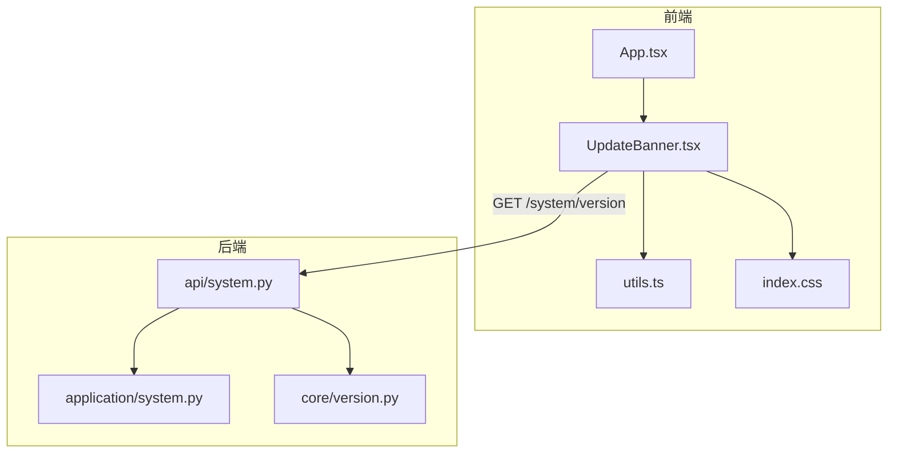
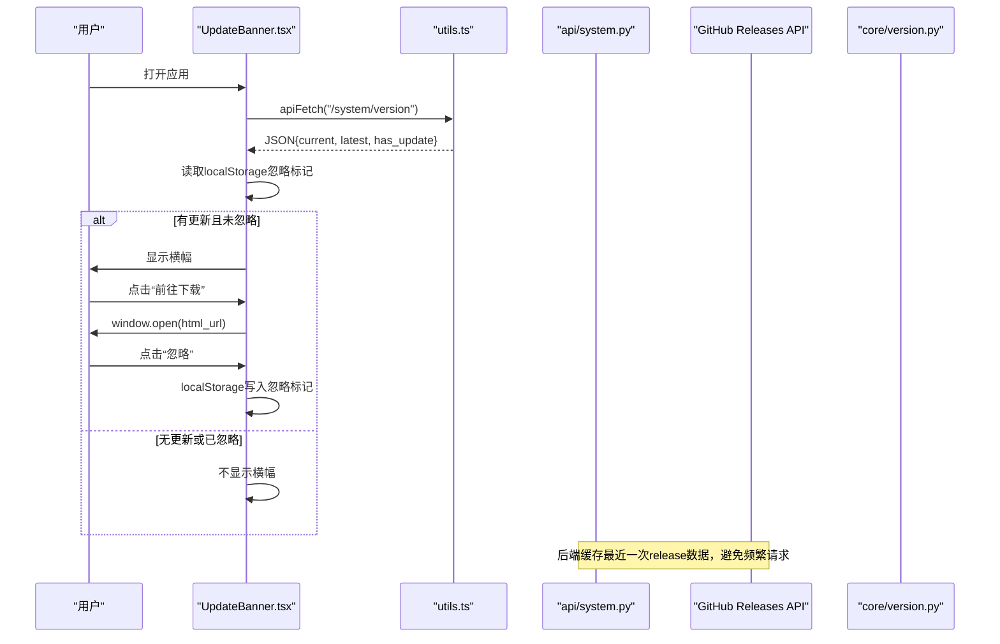
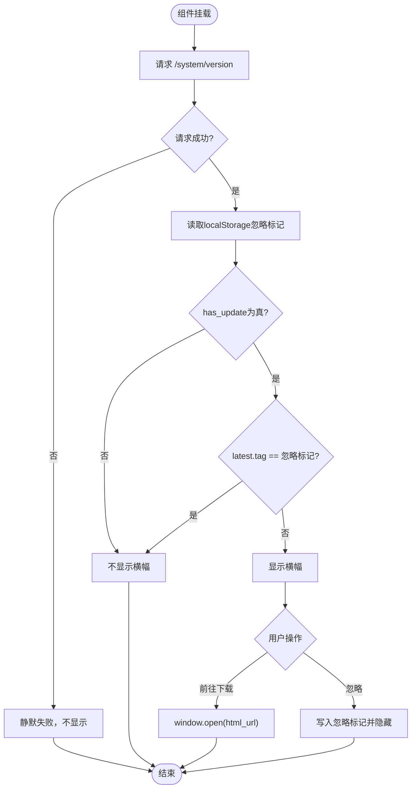
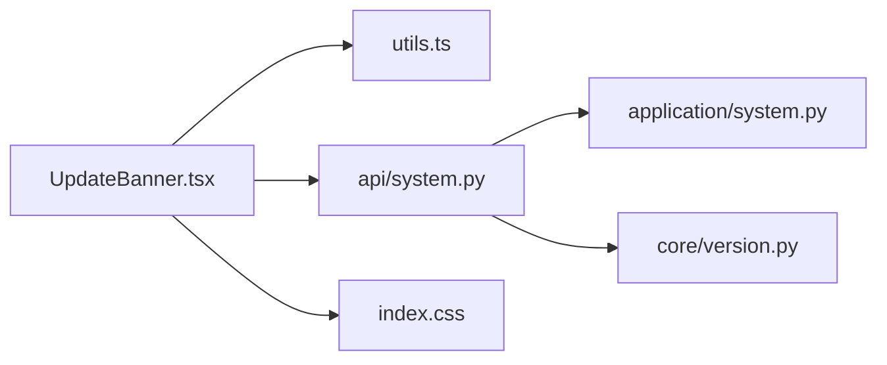

# UpdateBanner更新横幅组件

<cite>
**本文引用的文件**
- [UpdateBanner.tsx](file://frontend/src/components/UpdateBanner.tsx)
- [App.tsx](file://frontend/src/App.tsx)
- [utils.ts](file://frontend/src/lib/utils.ts)
- [system.py（API层）](file://api/system.py)
- [system.py（应用服务层）](file://application/system.py)
- [version.py（版本常量）](file://core/version.py)
- [index.css（主题与样式变量）](file://frontend/src/index.css)
</cite>

## 目录
1. [简介](#简介)
2. [项目结构](#项目结构)
3. [核心组件](#核心组件)
4. [架构总览](#架构总览)
5. [详细组件分析](#详细组件分析)
6. [依赖关系分析](#依赖关系分析)
7. [性能考量](#性能考量)
8. [故障排查指南](#故障排查指南)
9. [结论](#结论)
10. [附录：使用示例与最佳实践](#附录使用示例与最佳实践)

## 简介
UpdateBanner 是一个轻量的前端更新提示横幅，用于在检测到有新版本时提醒用户前往下载。其设计目标是在不干扰用户操作的前提下，提供清晰、可关闭、可持久化的更新提示，并自动轮询后端以获取最新版本信息。

## 项目结构
该功能由前端组件、工具函数、后端 API 以及版本常量共同组成：
- 前端：UpdateBanner 组件负责展示、交互与本地状态持久化；App 根组件将其嵌入页面布局中；utils 提供统一的 API 请求封装。
- 后端：系统 API 暴露 /system/version 接口，拉取 GitHub 最新 release 并与当前版本比较，返回是否可更新及最新版本信息。
- 版本常量：core.version 提供当前版本号，构建时被 CI 覆盖为发布标签。
- 样式：通过 CSS 变量实现主题适配，横幅采用响应式布局与简洁的视觉风格。

图表来源
- [UpdateBanner.tsx:13-76](file://frontend/src/components/UpdateBanner.tsx#L13-L76)
- [App.tsx:260-274](file://frontend/src/App.tsx#L260-L274)
- [utils.ts:24-36](file://frontend/src/lib/utils.ts#L24-L36)
- [system.py（API层）:81-91](file://api/system.py#L81-L91)
- [system.py（应用服务层）:6-15](file://application/system.py#L6-L15)
- [version.py:1-7](file://core/version.py#L1-L7)
- [index.css:7-79](file://frontend/src/index.css#L7-L79)

章节来源
- [App.tsx:260-274](file://frontend/src/App.tsx#L260-L274)
- [UpdateBanner.tsx:13-76](file://frontend/src/components/UpdateBanner.tsx#L13-L76)
- [utils.ts:24-36](file://frontend/src/lib/utils.ts#L24-L36)
- [system.py（API层）:81-91](file://api/system.py#L81-L91)
- [version.py:1-7](file://core/version.py#L1-L7)
- [index.css:7-79](file://frontend/src/index.css#L7-L79)

## 核心组件
- UpdateBanner 组件：负责发起版本检查、处理显示/隐藏逻辑、用户关闭与跳转行为、本地存储持久化。
- App Shell：将 UpdateBanner 置于页面顶部区域，确保在所有路由下可见。
- utils.apiFetch：统一封装带鉴权的 HTTP 请求，错误时进行 401 处理。
- 后端 /system/version：聚合当前版本与 GitHub 最新 release，计算是否有更新。

章节来源
- [UpdateBanner.tsx:13-76](file://frontend/src/components/UpdateBanner.tsx#L13-L76)
- [App.tsx:260-274](file://frontend/src/App.tsx#L260-L274)
- [utils.ts:24-36](file://frontend/src/lib/utils.ts#L24-L36)
- [system.py（API层）:81-91](file://api/system.py#L81-L91)

## 架构总览
更新检测流程从前端组件发起，经后端 API 查询 GitHub 最新 release，结合当前版本判断是否需要提示，并将结果返回给前端渲染。

图表来源
- [UpdateBanner.tsx:17-49](file://frontend/src/components/UpdateBanner.tsx#L17-L49)
- [utils.ts:24-36](file://frontend/src/lib/utils.ts#L24-L36)
- [system.py（API层）:21-46](file://api/system.py#L21-L46)
- [system.py（API层）:81-91](file://api/system.py#L81-L91)
- [version.py:1-7](file://core/version.py#L1-L7)

## 详细组件分析

### 触发条件与更新检测
- 版本检查时机：组件挂载后立刻执行一次版本检查，并设置每小时一次的定时器轮询，保证长期运行的应用中能感知新版本。
- 后端比较逻辑：
  - 当前版本来自 core.version.__version__，开发环境为占位值。
  - 最新 release 通过 GitHub API 获取，包含 tag、html_url 等字段。
  - 使用语义化版本解析比较 current 与 latest.tag，若任一解析失败则退化为字符串比较。
  - 当 latest 存在且 newer 时，has_update 为真。
- 用户偏好：
  - 使用 localStorage 键名记录已忽略的版本标签，避免重复提示同一版本。
  - 忽略标记与具体版本标签绑定，升级至新标签后会再次提示。

章节来源
- [UpdateBanner.tsx:17-49](file://frontend/src/components/UpdateBanner.tsx#L17-L49)
- [system.py（API层）:21-46](file://api/system.py#L21-L46)
- [system.py（API层）:49-68](file://api/system.py#L49-L68)
- [system.py（API层）:81-91](file://api/system.py#L81-L91)
- [version.py:1-7](file://core/version.py#L1-L7)

### 显示控制与延迟策略
- 自动显示：组件加载即发起请求，成功后根据 has_update 与忽略标记决定是否渲染。
- 手动触发：可通过刷新页面或重新进入路由触发新一轮检查。
- 延迟与轮询：首次加载后立即检查，随后每小时轮询一次，降低网络开销同时保持时效性。
- 静默失败：请求异常时不抛错、不中断其他 UI，保障用户体验。

章节来源
- [UpdateBanner.tsx:17-38](file://frontend/src/components/UpdateBanner.tsx#L17-L38)
- [UpdateBanner.tsx:40-49](file://frontend/src/components/UpdateBanner.tsx#L40-L49)

### 交互行为与状态持久化
- 关闭操作：点击关闭按钮会将当前最新版本标签写入 localStorage，下次同版本不再提示。
- 跳转链接：点击“前往下载”会在新窗口打开 release 的 html_url。
- 状态持久化：忽略标记基于版本标签持久化，跨会话保留，支持用户主动管理提示频率。

章节来源
- [UpdateBanner.tsx:42-49](file://frontend/src/components/UpdateBanner.tsx#L42-L49)

### 样式定制与视觉设计
- 主题适配：使用 CSS 变量定义背景、边框、文本与强调色，支持浅色/深色模式切换，横幅颜色随主题变化。
- 响应式布局：横幅使用 flex 布局与紧凑间距，在小屏设备上保持良好的可读性与可用性。
- 动画效果：当前实现未引入额外动画，保持轻量与稳定；如需增强，可在外层容器添加过渡类。

章节来源
- [index.css:7-79](file://frontend/src/index.css#L7-L79)
- [UpdateBanner.tsx:51-75](file://frontend/src/components/UpdateBanner.tsx#L51-L75)

### 关键流程图（算法与决策）

图表来源
- [UpdateBanner.tsx:17-49](file://frontend/src/components/UpdateBanner.tsx#L17-L49)
- [system.py（API层）:81-91](file://api/system.py#L81-L91)

## 依赖关系分析
- 前端依赖：
  - UpdateBanner 依赖 utils.apiFetch 进行网络请求。
  - App 将 UpdateBanner 嵌入到主布局中，使其全局可见。
- 后端依赖：
  - api/system.py 依赖 application/system.py 提供的系统能力（如 solver 状态），但版本接口主要依赖 core.version 与外部 GitHub API。
  - 版本比较逻辑内置于 API 层，避免前端参与复杂比较。
- 外部依赖：
  - GitHub Releases API 用于获取最新版本信息，后端通过缓存减少调用频率。

图表来源
- [UpdateBanner.tsx:1-3](file://frontend/src/components/UpdateBanner.tsx#L1-L3)
- [utils.ts:24-36](file://frontend/src/lib/utils.ts#L24-L36)
- [system.py（API层）:81-91](file://api/system.py#L81-L91)
- [system.py（应用服务层）:6-15](file://application/system.py#L6-L15)
- [version.py:1-7](file://core/version.py#L1-L7)
- [index.css:7-79](file://frontend/src/index.css#L7-L79)

章节来源
- [UpdateBanner.tsx:1-3](file://frontend/src/components/UpdateBanner.tsx#L1-L3)
- [utils.ts:24-36](file://frontend/src/lib/utils.ts#L24-L36)
- [system.py（API层）:81-91](file://api/system.py#L81-L91)
- [system.py（应用服务层）:6-15](file://application/system.py#L6-L15)
- [version.py:1-7](file://core/version.py#L1-L7)
- [index.css:7-79](file://frontend/src/index.css#L7-L79)

## 性能考量
- 网络请求：
  - 首次加载立即请求，随后每小时轮询一次，平衡实时性与带宽消耗。
  - 后端对 GitHub release 数据缓存 10 分钟，降低外部 API 限流风险。
- 渲染优化：
  - 仅在 has_update 为真且未忽略时渲染，避免不必要的 DOM 更新。
  - 使用轻量图标与简洁文案，减少重绘压力。
- 错误处理：
  - 请求失败静默处理，不影响主流程；401 时通过工具函数统一处理并重定向登录。

章节来源
- [UpdateBanner.tsx:17-38](file://frontend/src/components/UpdateBanner.tsx#L17-L38)
- [system.py（API层）:15-18](file://api/system.py#L15-L18)
- [utils.ts:24-36](file://frontend/src/lib/utils.ts#L24-L36)

## 故障排查指南
- 横幅不显示：
  - 检查 /system/version 是否返回 has_update 为真。
  - 确认 localStorage 中是否存在对应版本的忽略标记。
  - 查看浏览器控制台是否有网络错误或 401 未授权。
- 无法跳转到下载页：
  - 检查 latest.html_url 是否为空。
  - 确认浏览器弹窗拦截设置。
- 轮询无效：
  - 检查 setInterval 是否被清理（组件卸载时会清理）。
  - 验证网络连通性与后端服务状态。

章节来源
- [UpdateBanner.tsx:17-49](file://frontend/src/components/UpdateBanner.tsx#L17-L49)
- [utils.ts:24-36](file://frontend/src/lib/utils.ts#L24-L36)
- [system.py（API层）:81-91](file://api/system.py#L81-L91)

## 结论
UpdateBanner 以最小侵入的方式实现了版本更新提示，具备自动检测、用户偏好持久化、主题适配与响应式布局等特性。其后端通过缓存与语义化版本比较提升稳定性与准确性，前端通过静默错误处理与低频次轮询保障用户体验。整体设计简洁、可靠，适合在生产环境中广泛使用。

## 附录：使用示例与最佳实践

### 集成步骤
- 在应用根组件中引入并放置 UpdateBanner：
  - 参考路径：[App.tsx:260-274](file://frontend/src/App.tsx#L260-L274)
- 确保后端 /system/version 可用：
  - 参考路径：[system.py（API层）:81-91](file://api/system.py#L81-L91)
- 配置主题变量以匹配品牌色：
  - 参考路径：[index.css:7-79](file://frontend/src/index.css#L7-L79)

### 用户体验优化建议
- 避免打扰：
  - 使用非模态横幅，允许用户忽略并记住选择。
  - 合理设置轮询间隔，避免频繁打断。
- 明确指引：
  - “前往下载”按钮直接打开 release 页面，减少操作步骤。
  - 文案清晰标注当前版本与最新版本，便于用户理解。
- 可访问性：
  - 为关闭按钮提供 aria-label，辅助技术可识别。
  - 颜色对比度符合主题规范，确保可读性。
- 扩展性：
  - 如需更丰富的更新说明，可在后端返回 body 并在前端以折叠面板展示。
  - 可增加“稍后提醒”功能，按天或周级别抑制提示。

章节来源
- [App.tsx:260-274](file://frontend/src/App.tsx#L260-L274)
- [system.py（API层）:81-91](file://api/system.py#L81-L91)
- [index.css:7-79](file://frontend/src/index.css#L7-L79)
- [UpdateBanner.tsx:51-75](file://frontend/src/components/UpdateBanner.tsx#L51-L75)