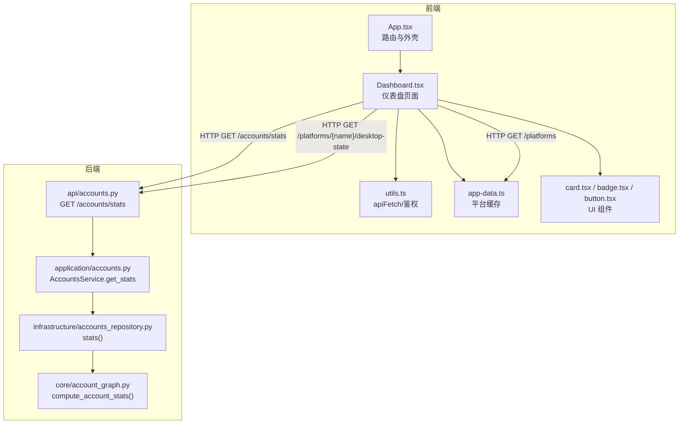
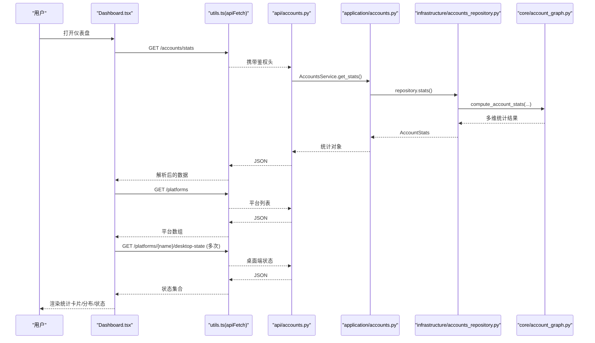
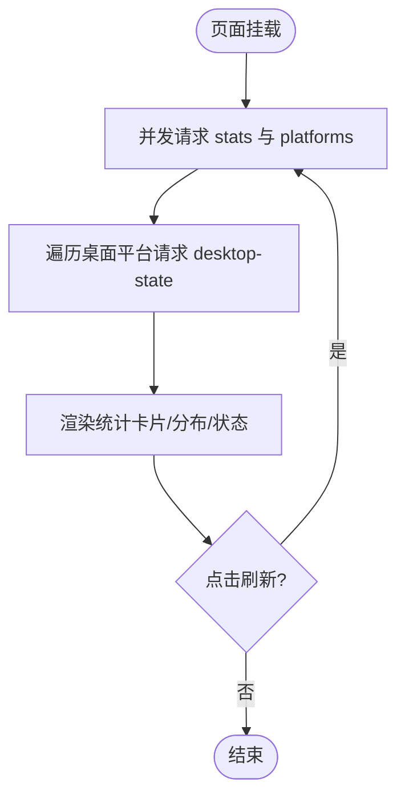
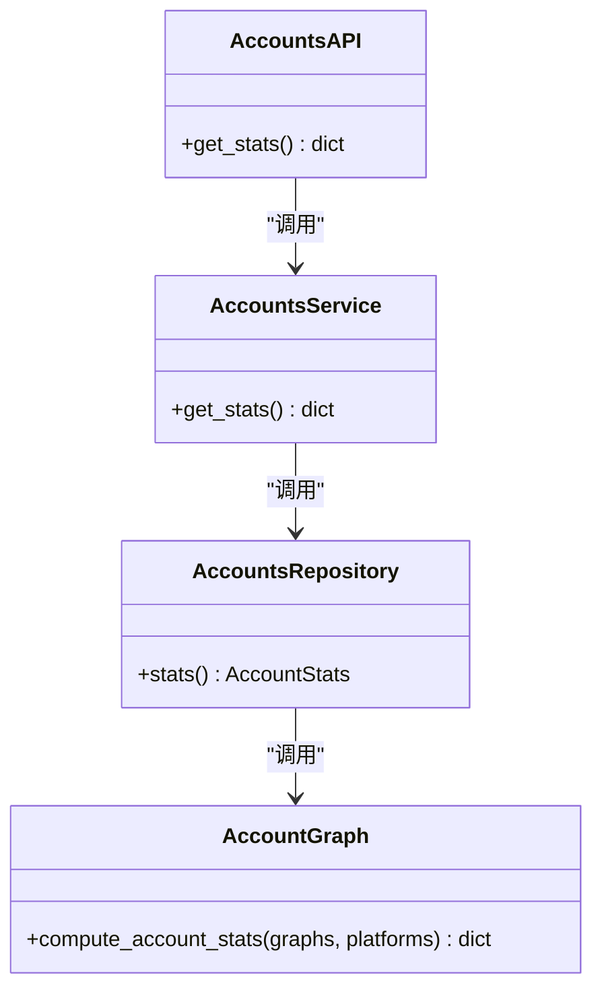
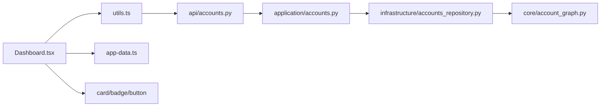

# 仪表盘页面

<cite>
**本文引用的文件**
- [Dashboard.tsx](file://frontend/src/pages/Dashboard.tsx)
- [App.tsx](file://frontend/src/App.tsx)
- [utils.ts](file://frontend/src/lib/utils.ts)
- [app-data.ts](file://frontend/src/lib/app-data.ts)
- [card.tsx](file://frontend/src/components/ui/card.tsx)
- [badge.tsx](file://frontend/src/components/ui/badge.tsx)
- [button.tsx](file://frontend/src/components/ui/button.tsx)
- [accounts.py](file://api/accounts.py)
- [application/accounts.py](file://application/accounts.py)
- [infrastructure/accounts_repository.py](file://infrastructure/accounts_repository.py)
- [core/account_graph.py](file://core/account_graph.py)
</cite>

## 目录
1. [简介](#简介)
2. [项目结构](#项目结构)
3. [核心组件](#核心组件)
4. [架构总览](#架构总览)
5. [详细组件分析](#详细组件分析)
6. [依赖关系分析](#依赖关系分析)
7. [性能考虑](#性能考虑)
8. [故障排查指南](#故障排查指南)
9. [结论](#结论)
10. [附录：扩展指南](#附录扩展指南)

## 简介
仪表盘是系统的主界面，用于集中展示账号与平台相关的概览信息、统计数据与快捷操作。它通过调用后端统计接口获取数据，并以卡片、进度条、状态徽章等 UI 组件呈现“总账号数”“试用中”“已订阅”“已失效”等关键指标；同时展示各平台的分布情况以及桌面应用（如 Cursor、Kiro、ChatGPT）的本地就绪状态。页面支持手动刷新，具备基本的错误处理与加载态反馈，并采用响应式布局适配不同屏幕尺寸。

## 项目结构
仪表盘由前端页面、通用 UI 组件、网络请求工具与后端统计服务共同构成。前端路由将根路径映射到仪表盘页面；页面在挂载时并行拉取账号统计与平台列表，并进一步查询桌面端状态；UI 层使用卡片、徽章、按钮等基础组件组织内容；后端通过账户服务聚合多维度统计并返回给前端。

图表来源
- [App.tsx:265-273](file://frontend/src/App.tsx#L265-L273)
- [Dashboard.tsx:48-70](file://frontend/src/pages/Dashboard.tsx#L48-L70)
- [utils.ts:24-36](file://frontend/src/lib/utils.ts#L24-L36)
- [app-data.ts:77-82](file://frontend/src/lib/app-data.ts#L77-L82)
- [accounts.py:95-98](file://api/accounts.py#L95-L98)
- [application/accounts.py:124-134](file://application/accounts.py#L124-L134)
- [infrastructure/accounts_repository.py:334-358](file://infrastructure/accounts_repository.py#L334-L358)
- [core/account_graph.py:1039-1044](file://core/account_graph.py#L1039-L1044)

章节来源
- [App.tsx:265-273](file://frontend/src/App.tsx#L265-L273)
- [Dashboard.tsx:48-70](file://frontend/src/pages/Dashboard.tsx#L48-L70)

## 核心组件
- 仪表盘页面（Dashboard.tsx）
  - 负责数据加载、渲染统计卡片、平台分布、桌面应用状态与状态分布分组。
  - 提供“刷新”按钮触发重新拉取数据，并在加载期间禁用按钮与显示旋转图标。
- 通用 UI 组件
  - 卡片（Card/CardHeader/CardTitle/CardContent）：承载统计区块与分组面板。
  - 徽章（Badge）：用于状态标签（如“试用”“订阅”“过期”“有效”等）。
  - 按钮（Button）：用于刷新等操作。
- 网络与数据工具
  - apiFetch：统一发起带鉴权的 HTTP 请求，处理 401 自动登出与错误抛出。
  - app-data：平台列表缓存，避免重复请求。

章节来源
- [Dashboard.tsx:1-199](file://frontend/src/pages/Dashboard.tsx#L1-L199)
- [card.tsx:1-40](file://frontend/src/components/ui/card.tsx#L1-L40)
- [badge.tsx:1-30](file://frontend/src/components/ui/badge.tsx#L1-L30)
- [button.tsx:1-43](file://frontend/src/components/ui/button.tsx#L1-L43)
- [utils.ts:24-36](file://frontend/src/lib/utils.ts#L24-L36)
- [app-data.ts:77-82](file://frontend/src/lib/app-data.ts#L77-L82)

## 架构总览
仪表盘的数据流遵循“前端页面 -> 后端 API -> 应用服务 -> 基础设施仓库 -> 统计计算”的分层模型。页面在挂载时并发请求账号统计与平台列表，再根据平台名逐个查询桌面端状态；后端通过账户服务聚合多维度统计并返回结构化数据，前端据此渲染。

图表来源
- [Dashboard.tsx:48-70](file://frontend/src/pages/Dashboard.tsx#L48-L70)
- [utils.ts:24-36](file://frontend/src/lib/utils.ts#L24-L36)
- [accounts.py:95-98](file://api/accounts.py#L95-L98)
- [application/accounts.py:124-134](file://application/accounts.py#L124-L134)
- [infrastructure/accounts_repository.py:334-358](file://infrastructure/accounts_repository.py#L334-L358)
- [core/account_graph.py:1039-1044](file://core/account_graph.py#L1039-L1044)

## 详细组件分析

### 仪表盘页面（Dashboard.tsx）
- 数据获取
  - 页面挂载时并发请求 /accounts/stats 与 /platforms，随后对特定桌面平台逐一请求 /platforms/{name}/desktop-state。
  - 使用 Promise.all 提升加载效率；失败时以默认值兜底，保证页面可渲染。
- 渲染逻辑
  - 顶部四张统计卡片：总账号数、试用中、已订阅、已失效（合并显示状态）。
  - 平台分布：按平台计数与占比，使用进度条可视化。
  - 桌面应用状态：展示安装/配置/运行/就绪等多维度徽章。
  - 状态分布：按套餐、生命周期、有效性分组展示。
- 交互
  - “刷新”按钮触发 load 函数重新拉取数据，加载期间禁用按钮并显示旋转图标。
- 响应式布局
  - 使用 Tailwind 网格布局在不同断点下调整列数与间距，确保移动端至大屏的良好显示。

图表来源
- [Dashboard.tsx:48-70](file://frontend/src/pages/Dashboard.tsx#L48-L70)
- [Dashboard.tsx:72-199](file://frontend/src/pages/Dashboard.tsx#L72-L199)

章节来源
- [Dashboard.tsx:48-70](file://frontend/src/pages/Dashboard.tsx#L48-L70)
- [Dashboard.tsx:72-199](file://frontend/src/pages/Dashboard.tsx#L72-L199)

### 网络与鉴权（utils.ts）
- apiFetch 统一封装 fetch，自动注入 Authorization 头，处理 401 时清空令牌并刷新页面，非 2xx 响应抛出错误。
- 下载相关方法用于导出功能（仪表盘未直接使用）。

章节来源
- [utils.ts:24-36](file://frontend/src/lib/utils.ts#L24-L36)

### 平台缓存（app-data.ts）
- getPlatforms 提供带 TTL 的平台列表缓存，减少重复请求；支持强制刷新。
- 仪表盘使用该缓存获取平台清单，再按需查询桌面端状态。

章节来源
- [app-data.ts:77-82](file://frontend/src/lib/app-data.ts#L77-L82)

### 后端统计链路（accounts.py -> application/accounts.py -> infrastructure/accounts_repository.py -> core/account_graph.py）
- API 层：暴露 GET /accounts/stats，委托服务层。
- 应用服务：聚合多维度统计（总数、按平台、按状态、按生命周期、按套餐、按有效性、按显示状态）。
- 基础设施仓库：读取账户记录并调用统计计算函数。
- 统计计算：基于账户图数据汇总各维度计数。

图表来源
- [accounts.py:95-98](file://api/accounts.py#L95-L98)
- [application/accounts.py:124-134](file://application/accounts.py#L124-L134)
- [infrastructure/accounts_repository.py:334-358](file://infrastructure/accounts_repository.py#L334-L358)
- [core/account_graph.py:1039-1044](file://core/account_graph.py#L1039-L1044)

章节来源
- [accounts.py:95-98](file://api/accounts.py#L95-L98)
- [application/accounts.py:124-134](file://application/accounts.py#L124-L134)
- [infrastructure/accounts_repository.py:334-358](file://infrastructure/accounts_repository.py#L334-L358)
- [core/account_graph.py:1039-1044](file://core/account_graph.py#L1039-L1044)

### UI 组件
- 卡片组件：提供统一的容器样式与标题区域，用于统计区块与分组面板。
- 徽章组件：通过变体区分成功、警告、危险、次要等状态语义。
- 按钮组件：支持多种尺寸与变体，用于刷新等操作。

章节来源
- [card.tsx:1-40](file://frontend/src/components/ui/card.tsx#L1-L40)
- [badge.tsx:1-30](file://frontend/src/components/ui/badge.tsx#L1-L30)
- [button.tsx:1-43](file://frontend/src/components/ui/button.tsx#L1-L43)

## 依赖关系分析
- 前端依赖
  - Dashboard 依赖 utils 进行网络请求，依赖 app-data 获取平台列表，依赖 UI 组件进行渲染。
  - App 路由将根路径映射到 Dashboard，并提供侧边栏导航。
- 后端依赖
  - API 层依赖应用服务，应用服务依赖基础设施仓库，仓库依赖统计计算函数。
- 外部依赖
  - 桌面端状态探测通过 /platforms/{name}/desktop-state 接口获取，属于平台能力的一部分。

图表来源
- [Dashboard.tsx:48-70](file://frontend/src/pages/Dashboard.tsx#L48-L70)
- [utils.ts:24-36](file://frontend/src/lib/utils.ts#L24-L36)
- [app-data.ts:77-82](file://frontend/src/lib/app-data.ts#L77-L82)
- [accounts.py:95-98](file://api/accounts.py#L95-L98)
- [application/accounts.py:124-134](file://application/accounts.py#L124-L134)
- [infrastructure/accounts_repository.py:334-358](file://infrastructure/accounts_repository.py#L334-L358)
- [core/account_graph.py:1039-1044](file://core/account_graph.py#L1039-L1044)

章节来源
- [App.tsx:265-273](file://frontend/src/App.tsx#L265-L273)
- [Dashboard.tsx:48-70](file://frontend/src/pages/Dashboard.tsx#L48-L70)

## 性能考虑
- 并发请求：使用 Promise.all 并行拉取统计与平台列表，缩短首屏时间。
- 缓存策略：平台列表使用 TTL 缓存，避免频繁请求。
- 降级渲染：桌面端状态请求失败时以默认值填充，保证页面可用性。
- 响应式布局：利用 CSS Grid 与 Tailwind 断点，自适应不同设备宽度。

[本节为通用指导，不直接分析具体文件]

## 故障排查指南
- 401 未授权
  - 现象：请求返回 401，页面自动清理令牌并刷新。
  - 处理：确认登录状态或检查后端鉴权配置。
- 网络错误
  - 现象：apiFetch 抛出异常，页面可能显示空数据或占位文案。
  - 处理：检查后端服务是否可用、网络连通性与 CORS 配置。
- 桌面端状态不可用
  - 现象：部分平台显示“当前平台暂未接入桌面状态探测”。
  - 处理：确认对应平台是否启用桌面状态探测能力。

章节来源
- [utils.ts:24-36](file://frontend/src/lib/utils.ts#L24-L36)
- [Dashboard.tsx:56-64](file://frontend/src/pages/Dashboard.tsx#L56-L64)

## 结论
仪表盘作为主界面，通过清晰的分层架构与模块化 UI 组件，提供了系统概览、统计数据与快捷操作的集中视图。其数据获取机制稳定可靠，具备并发优化与缓存策略；错误处理与降级渲染保障了用户体验；响应式布局确保多设备良好显示。开发者可基于现有模式快速扩展新的统计指标或功能模块。

[本节为总结性内容，不直接分析具体文件]

## 附录：扩展指南
- 新增统计指标
  - 后端：在应用服务或基础设施仓库中扩展统计字段，并在返回结构中增加新键。
  - 前端：在 Dashboard 中添加对应的统计卡片或分组项，复用 Badge 与 Card 组件。
- 新增平台或桌面状态
  - 后端：确保 /platforms 与 /platforms/{name}/desktop-state 返回正确结构。
  - 前端：在平台过滤与桌面状态渲染逻辑中加入新平台名称。
- 自定义 UI 组件
  - 参考 card.tsx、badge.tsx、button.tsx 的实现风格，保持主题变量一致。
- 刷新与缓存
  - 如需实时性更强的数据，可增加定时刷新或监听事件触发重新拉取；必要时清除 app-data 缓存。

[本节为概念性指导，不直接分析具体文件]