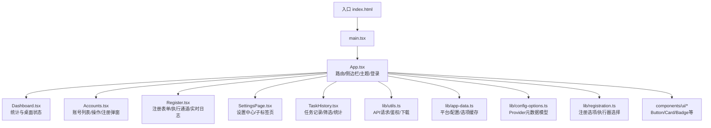
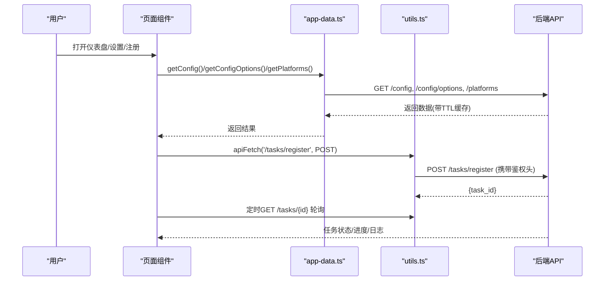
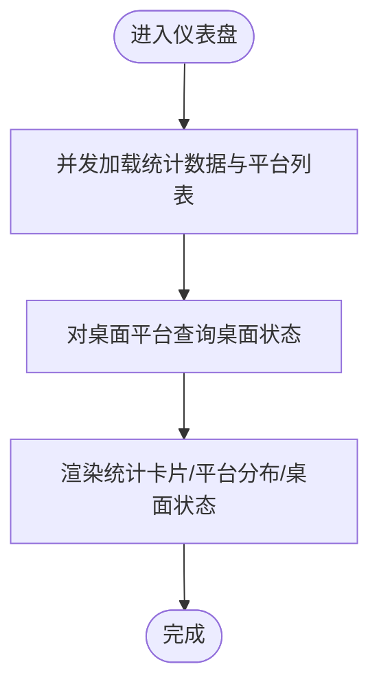
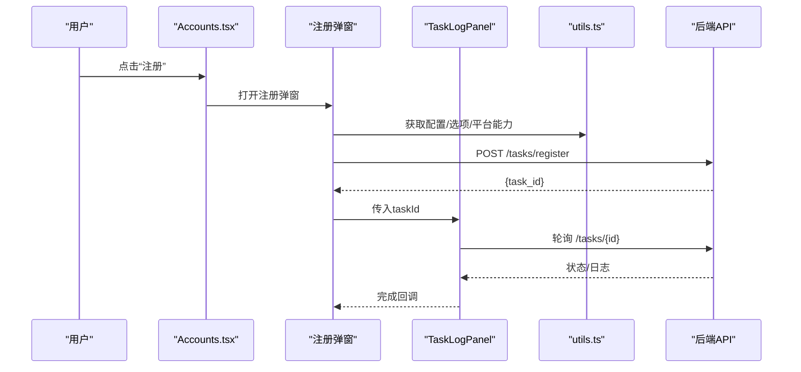
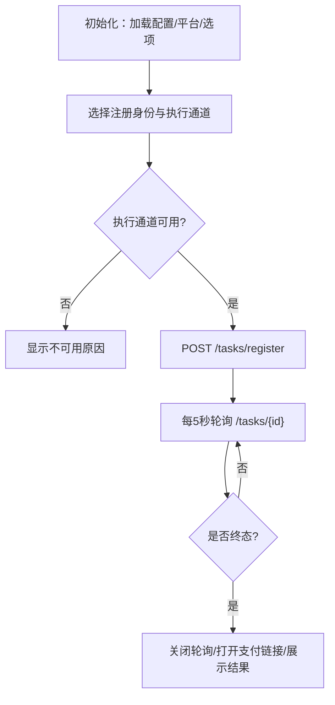
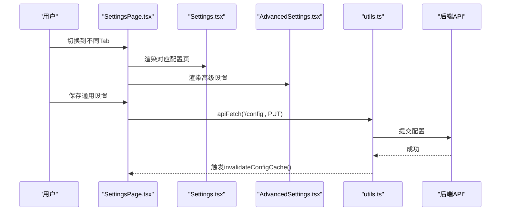
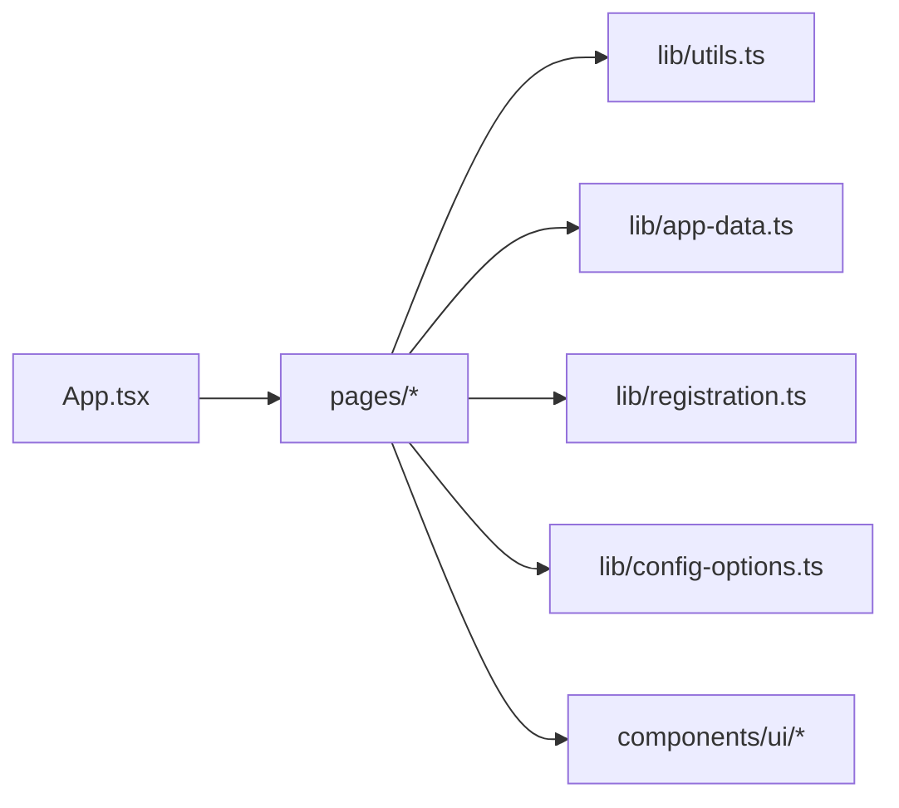

# 前端应用

<cite>
**本文引用的文件**
- [frontend/package.json](file://frontend/package.json)
- [frontend/vite.config.ts](file://frontend/vite.config.ts)
- [frontend/index.html](file://frontend/index.html)
- [frontend/src/main.tsx](file://frontend/src/main.tsx)
- [frontend/src/App.tsx](file://frontend/src/App.tsx)
- [frontend/src/pages/Dashboard.tsx](file://frontend/src/pages/Dashboard.tsx)
- [frontend/src/pages/Accounts.tsx](file://frontend/src/pages/Accounts.tsx)
- [frontend/src/pages/Register.tsx](file://frontend/src/pages/Register.tsx)
- [frontend/src/pages/SettingsPage.tsx](file://frontend/src/pages/SettingsPage.tsx)
- [frontend/src/pages/TaskHistory.tsx](file://frontend/src/pages/TaskHistory.tsx)
- [frontend/src/lib/utils.ts](file://frontend/src/lib/utils.ts)
- [frontend/src/lib/app-data.ts](file://frontend/src/lib/app-data.ts)
- [frontend/src/lib/config-options.ts](file://frontend/src/lib/config-options.ts)
- [frontend/src/lib/registration.ts](file://frontend/src/lib/registration.ts)
- [frontend/src/components/settings/AdvancedSettings.tsx](file://frontend/src/components/settings/AdvancedSettings.tsx)
- [frontend/src/components/ui/button.tsx](file://frontend/src/components/ui/button.tsx)
</cite>

## 目录
1. [简介](#简介)
2. [项目结构](#项目结构)
3. [核心组件](#核心组件)
4. [架构总览](#架构总览)
5. [详细组件分析](#详细组件分析)
6. [依赖关系分析](#依赖关系分析)
7. [性能考虑](#性能考虑)
8. [故障排查指南](#故障排查指南)
9. [结论](#结论)
10. [附录](#附录)

## 简介
本文件面向前端开发者，系统化说明该 React 前端应用的架构、技术栈与页面功能实现。重点覆盖：
- 仪表盘概览、账户管理界面、注册流程界面、设置页面等核心页面的职责与交互
- 组件间通信机制与数据流管理（配置缓存、任务轮询、状态展示）
- 与后端 API 的交互方式（认证、配置、平台能力、任务执行与日志）
- 配置管理界面的实现（通用设置、注册策略、邮箱/短信/验证码服务、代理资源、高级设置）
- UI 组件使用与扩展方法
- 响应式设计与用户体验优化

## 项目结构
前端基于 Vite + React + TypeScript 构建，采用 Tailwind CSS 进行样式开发，并通过 Radix UI 提供可访问的基础组件。路由由 react-router-dom 管理，所有页面集中在 pages 目录，公共逻辑在 lib 中拆分，UI 基础组件位于 components/ui。

图表来源
- [frontend/index.html:1-14](file://frontend/index.html#L1-L14)
- [frontend/src/main.tsx:1-11](file://frontend/src/main.tsx#L1-L11)
- [frontend/src/App.tsx:1-393](file://frontend/src/App.tsx#L1-L393)

章节来源
- [frontend/package.json:1-44](file://frontend/package.json#L1-L44)
- [frontend/vite.config.ts:1-23](file://frontend/vite.config.ts#L1-L23)
- [frontend/index.html:1-14](file://frontend/index.html#L1-L14)
- [frontend/src/main.tsx:1-11](file://frontend/src/main.tsx#L1-L11)

## 核心组件
- 应用壳层与路由：App.tsx 负责主题切换、登录校验、侧边导航与路由分发，挂载 Dashboard、Accounts、Register、Proxies、SettingsPage、TaskHistory 等页面。
- 数据与配置：lib/app-data.ts 提供带 TTL 的缓存读取 getPlatforms/getConfig/getConfigOptions，并暴露失效方法；lib/utils.ts 封装 apiFetch，统一鉴权头与错误处理。
- 注册编排：lib/registration.ts 根据平台元数据生成“注册身份”和“执行通道”选项，并智能选择默认执行器。
- 配置选项模型：lib/config-options.ts 定义 Provider 字段、设置项、验证码策略等类型，供各页面动态渲染表单。
- UI 组件：components/ui 提供 Button、Card、Badge 等原子组件，配合 Tailwind 快速构建界面。

章节来源
- [frontend/src/App.tsx:1-393](file://frontend/src/App.tsx#L1-L393)
- [frontend/src/lib/app-data.ts:1-96](file://frontend/src/lib/app-data.ts#L1-L96)
- [frontend/src/lib/utils.ts:1-68](file://frontend/src/lib/utils.ts#L1-L68)
- [frontend/src/lib/registration.ts:1-112](file://frontend/src/lib/registration.ts#L1-L112)
- [frontend/src/lib/config-options.ts:1-114](file://frontend/src/lib/config-options.ts#L1-L114)
- [frontend/src/components/ui/button.tsx:1-43](file://frontend/src/components/ui/button.tsx#L1-L43)

## 架构总览
前端以页面为边界组织业务，通过统一的 API 层与后端交互；配置与平台能力通过缓存减少重复请求；任务执行采用短轮询获取最新状态与日志。

图表来源
- [frontend/src/lib/app-data.ts:77-95](file://frontend/src/lib/app-data.ts#L77-L95)
- [frontend/src/lib/utils.ts:24-36](file://frontend/src/lib/utils.ts#L24-L36)
- [frontend/src/pages/Register.tsx:244-278](file://frontend/src/pages/Register.tsx#L244-L278)
- [frontend/src/pages/Register.tsx:294-316](file://frontend/src/pages/Register.tsx#L294-L316)

## 详细组件分析

### 仪表盘（Dashboard）
- 功能：展示账号总数、试用/订阅/失效分布、按平台分布、桌面应用就绪状态。
- 数据流：并发请求 /accounts/stats 与 /platforms，再对桌面相关平台调用 /platforms/{name}/desktop-state 聚合展示。
- 交互：支持刷新按钮重新拉取数据。

图表来源
- [frontend/src/pages/Dashboard.tsx:48-68](file://frontend/src/pages/Dashboard.tsx#L48-L68)
- [frontend/src/pages/Dashboard.tsx:72-93](file://frontend/src/pages/Dashboard.tsx#L72-L93)
- [frontend/src/pages/Dashboard.tsx:113-185](file://frontend/src/pages/Dashboard.tsx#L113-L185)

章节来源
- [frontend/src/pages/Dashboard.tsx:1-199](file://frontend/src/pages/Dashboard.tsx#L1-L199)

### 账户管理（Accounts）
- 功能：按平台维度查看账号列表、执行平台动作、批量注册、手动新增账号、导出/导入、查看操作结果详情。
- 关键逻辑：
  - 平台动作缓存：避免重复请求 /actions/{key}。
  - 注册弹窗：动态加载配置与选项，选择“注册身份”和“执行通道”，提交到 /tasks/register，并在弹窗内通过 TaskLogPanel 跟踪任务。
  - 账号展示：从 display_summary/overview 提取生命周期、套餐、有效性、额度等指标，并以卡片形式呈现。
- 交互：支持复制结果、打开支付链接、下载/上传等。

图表来源
- [frontend/src/pages/Accounts.tsx:135-158](file://frontend/src/pages/Accounts.tsx#L135-L158)
- [frontend/src/pages/Accounts.tsx:174-480](file://frontend/src/pages/Accounts.tsx#L174-L480)
- [frontend/src/pages/Accounts.tsx:482-532](file://frontend/src/pages/Accounts.tsx#L482-L532)

章节来源
- [frontend/src/pages/Accounts.tsx:1-800](file://frontend/src/pages/Accounts.tsx#L1-L800)

### 注册流程（Register）
- 功能：选择平台、注册身份（邮箱或第三方 OAuth）、执行通道（协议/无头/有头浏览器），填写可选代理与 Provider 参数，启动注册任务并实时查看日志。
- 数据流：
  - 初始化时并行加载配置、平台列表、配置选项，自动填充默认值。
  - 根据 identity_provider 与 executor_type 动态禁用/启用执行通道，并给出原因提示。
  - 提交后每 5 秒轮询任务状态，到达终态时关闭轮询并尝试打开 cashier_urls。
- 体验优化：右侧“当前编排摘要”实时汇总所选方案；错误信息友好提示；失败/中断/取消状态明确展示。

图表来源
- [frontend/src/pages/Register.tsx:86-133](file://frontend/src/pages/Register.tsx#L86-L133)
- [frontend/src/pages/Register.tsx:244-278](file://frontend/src/pages/Register.tsx#L244-L278)
- [frontend/src/pages/Register.tsx:294-316](file://frontend/src/pages/Register.tsx#L294-L316)
- [frontend/src/lib/registration.ts:73-112](file://frontend/src/lib/registration.ts#L73-L112)

章节来源
- [frontend/src/pages/Register.tsx:1-601](file://frontend/src/pages/Register.tsx#L1-L601)
- [frontend/src/lib/registration.ts:1-112](file://frontend/src/lib/registration.ts#L1-L112)

### 设置中心（SettingsPage）
- 功能：通用设置（主题、默认注册策略、浏览器复用）、注册策略、邮箱服务、验证服务、接码服务、代理资源、ChatGPT、高级设置、关于。
- 数据流：
  - 通用设置保存：PUT /config，并调用 invalidateConfigCache 使全局配置缓存失效。
  - 高级设置：Turnstile 求解器状态检测与重启；平台能力编辑（执行方式/注册身份/OAuth入口）。
- 交互：Tab 切换、保存反馈、版本检查与更新引导。

图表来源
- [frontend/src/pages/SettingsPage.tsx:72-210](file://frontend/src/pages/SettingsPage.tsx#L72-L210)
- [frontend/src/pages/SettingsPage.tsx:239-346](file://frontend/src/pages/SettingsPage.tsx#L239-L346)
- [frontend/src/components/settings/AdvancedSettings.tsx:10-63](file://frontend/src/components/settings/AdvancedSettings.tsx#L10-L63)
- [frontend/src/components/settings/AdvancedSettings.tsx:65-233](file://frontend/src/components/settings/AdvancedSettings.tsx#L65-L233)

章节来源
- [frontend/src/pages/SettingsPage.tsx:1-401](file://frontend/src/pages/SettingsPage.tsx#L1-L401)
- [frontend/src/components/settings/AdvancedSettings.tsx:1-244](file://frontend/src/components/settings/AdvancedSettings.tsx#L1-L244)

### 任务历史（TaskHistory）
- 功能：列出最近任务，支持按平台与状态筛选，展示成功率/失败率进度条与错误摘要。
- 数据流：GET /tasks?page=1&page_size=50&platform=&status=，分页与过滤由 URL 参数控制。

章节来源
- [frontend/src/pages/TaskHistory.tsx:1-262](file://frontend/src/pages/TaskHistory.tsx#L1-L262)

## 依赖关系分析
- 页面依赖：
  - App.tsx 作为根容器，管理路由与侧边栏，注入主题与登录状态。
  - 各页面依赖 lib/app-data.ts 获取平台与配置，依赖 lib/utils.ts 发起网络请求。
  - Register/Accounts 依赖 lib/registration.ts 构建注册选项与执行器选择。
  - SettingsPage 依赖 AdvancedSettings 进行高级配置。
- 外部库：
  - react-router-dom：路由与导航
  - tailwindcss/@tailwindcss/vite：样式与构建集成
  - @radix-ui/*：可访问性基础组件
  - lucide-react：图标

图表来源
- [frontend/src/App.tsx:1-393](file://frontend/src/App.tsx#L1-L393)
- [frontend/src/pages/Register.tsx:1-601](file://frontend/src/pages/Register.tsx#L1-L601)
- [frontend/src/pages/Accounts.tsx:1-800](file://frontend/src/pages/Accounts.tsx#L1-L800)
- [frontend/src/pages/SettingsPage.tsx:1-401](file://frontend/src/pages/SettingsPage.tsx#L1-L401)
- [frontend/src/lib/utils.ts:1-68](file://frontend/src/lib/utils.ts#L1-L68)
- [frontend/src/lib/app-data.ts:1-96](file://frontend/src/lib/app-data.ts#L1-L96)
- [frontend/src/lib/registration.ts:1-112](file://frontend/src/lib/registration.ts#L1-L112)
- [frontend/src/lib/config-options.ts:1-114](file://frontend/src/lib/config-options.ts#L1-L114)
- [frontend/src/components/ui/button.tsx:1-43](file://frontend/src/components/ui/button.tsx#L1-L43)

章节来源
- [frontend/package.json:1-44](file://frontend/package.json#L1-L44)

## 性能考虑
- 配置与平台数据缓存：app-data.ts 使用 TTL 缓存与并发去重，减少重复请求与抖动。
- 任务轮询节流：Register 页面仅在可见时轮询，且到达终态立即停止，降低无效请求。
- 平台动作缓存：Accounts 中对 /actions/{key} 的结果进行内存缓存与 Promise 共享，避免重复网络开销。
- 构建与打包：Vite 输出至 ../static，便于后端静态资源托管；生产构建开启空目录清理，确保部署一致性。

[本节为通用指导，不直接分析具体文件]

## 故障排查指南
- 未授权（401）：utils.ts 在 401 时清除本地 token 并刷新页面，确保回到登录流程。
- 配置未生效：保存设置后调用 invalidateConfigCache 使缓存失效；若仍异常，检查后端 /config 返回结构与字段键名。
- 注册失败：查看任务错误列表与错误摘要；确认已正确选择执行通道与 Provider 参数；必要时重启 Turnstile 求解器。
- 平台能力不匹配：在高级设置中重置或调整 supported_executors/supported_identity_modes/supported_oauth_providers，并刷新平台缓存。

章节来源
- [frontend/src/lib/utils.ts:24-36](file://frontend/src/lib/utils.ts#L24-L36)
- [frontend/src/pages/SettingsPage.tsx:93-103](file://frontend/src/pages/SettingsPage.tsx#L93-L103)
- [frontend/src/components/settings/AdvancedSettings.tsx:10-63](file://frontend/src/components/settings/AdvancedSettings.tsx#L10-L63)
- [frontend/src/components/settings/AdvancedSettings.tsx:96-125](file://frontend/src/components/settings/AdvancedSettings.tsx#L96-L125)

## 结论
该前端应用以清晰的页面分层与模块化库设计，实现了多平台账号注册与管理的全流程。通过配置驱动的 Provider 与执行器选择，结合任务轮询与缓存机制，提供了稳定、可扩展的前端体验。开发者可在现有基础上扩展新的平台、Provider 与执行通道，同时保持界面一致性与可维护性。

[本节为总结，不直接分析具体文件]

## 附录

### 技术栈与工具链
- 框架与运行时：React、TypeScript、Vite
- 路由：react-router-dom
- 样式：Tailwind CSS（含 Vite 插件）
- 基础组件：@radix-ui/react-*（Dialog、Select、Tabs、Toast 等）
- 图标：lucide-react
- 构建产物：输出至 ../static，开发期通过 Vite 代理 /api 到后端

章节来源
- [frontend/package.json:1-44](file://frontend/package.json#L1-L44)
- [frontend/vite.config.ts:1-23](file://frontend/vite.config.ts#L1-L23)

### 响应式设计与用户体验
- 布局：侧边栏可折叠，主内容区自适应宽度；网格布局在小屏下自动换行。
- 主题：支持浅色/深色/跟随系统，即时切换并持久化。
- 交互：按钮状态、加载动画、错误提示、结果弹窗与复制功能提升可用性。

章节来源
- [frontend/src/App.tsx:346-393](file://frontend/src/App.tsx#L346-L393)
- [frontend/src/pages/SettingsPage.tsx:41-67](file://frontend/src/pages/SettingsPage.tsx#L41-L67)
- [frontend/src/pages/TaskHistory.tsx:88-104](file://frontend/src/pages/TaskHistory.tsx#L88-L104)

### 与后端 API 的交互约定
- 认证：通过 localStorage 中的 _auth_token 注入 Authorization 头；401 时自动登出并重载。
- 配置：GET /config、PUT /config、GET /config/options；修改后需失效缓存。
- 平台：GET /platforms、GET /platforms/{name}/desktop-state、PUT/DELETE /platforms/{name}/capabilities。
- 任务：POST /tasks/register、GET /tasks/{id}、GET /tasks（分页与过滤）。
- 其他：GET /accounts/stats、GET /actions/{key}、GET /solver/status、POST /solver/restart。

章节来源
- [frontend/src/lib/utils.ts:11-36](file://frontend/src/lib/utils.ts#L11-L36)
- [frontend/src/lib/app-data.ts:77-95](file://frontend/src/lib/app-data.ts#L77-L95)
- [frontend/src/pages/Dashboard.tsx:48-68](file://frontend/src/pages/Dashboard.tsx#L48-L68)
- [frontend/src/pages/Accounts.tsx:135-158](file://frontend/src/pages/Accounts.tsx#L135-L158)
- [frontend/src/pages/Register.tsx:244-278](file://frontend/src/pages/Register.tsx#L244-L278)
- [frontend/src/components/settings/AdvancedSettings.tsx:10-63](file://frontend/src/components/settings/AdvancedSettings.tsx#L10-L63)