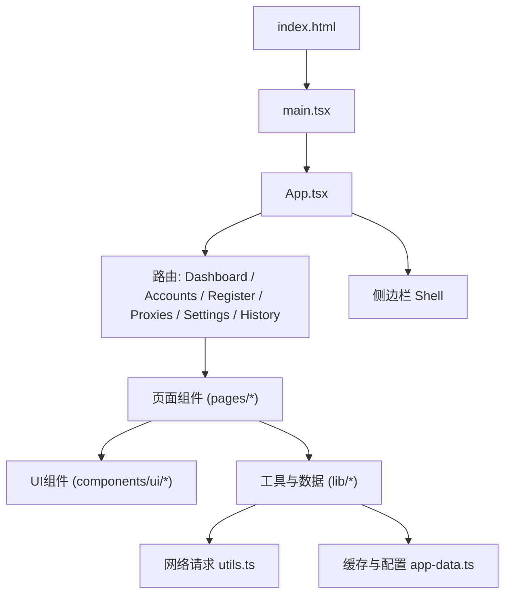
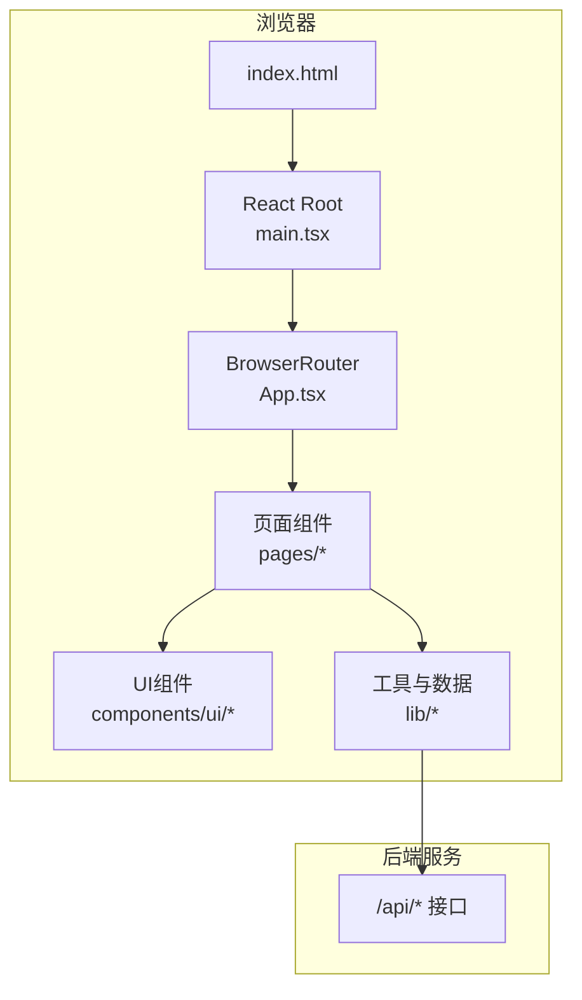
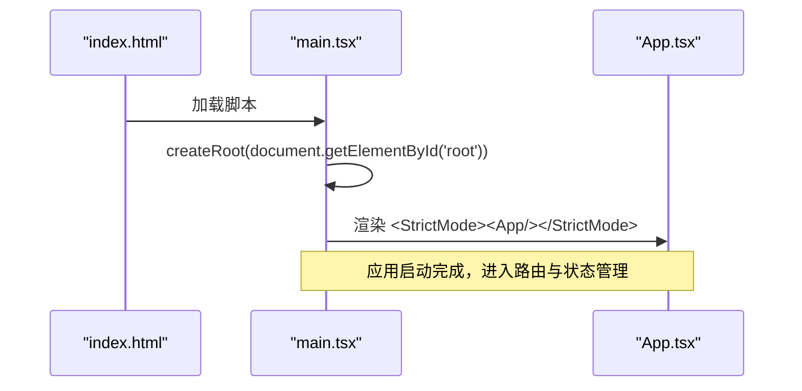
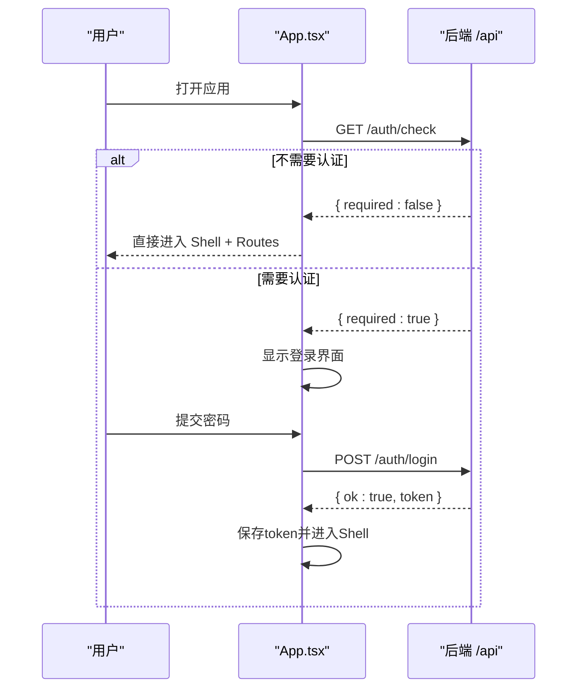
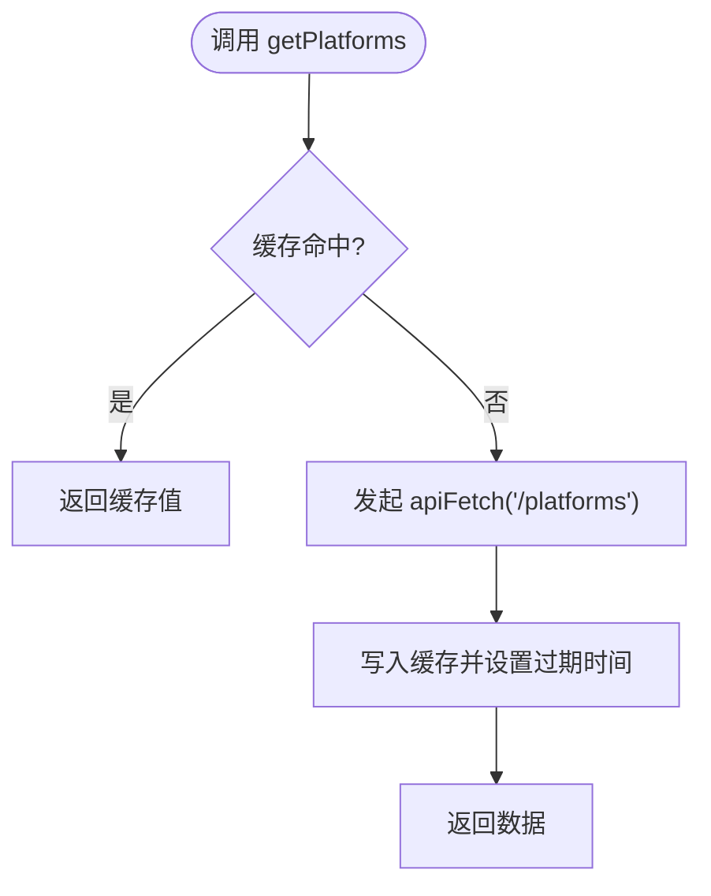
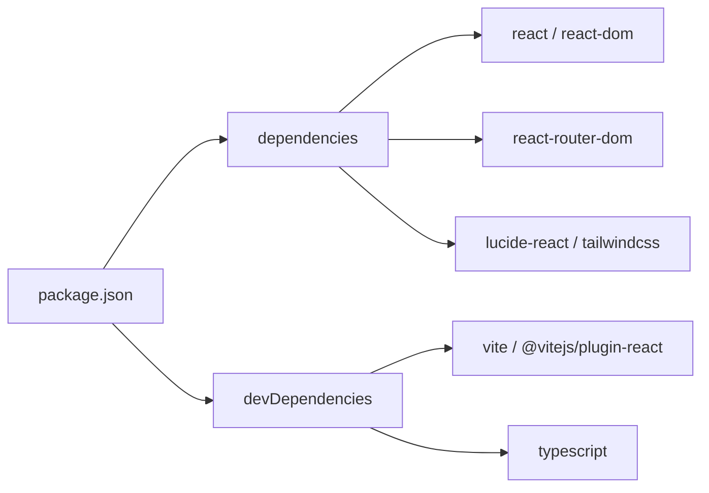

# 前端架构设计

<cite>
**本文引用的文件**
- [frontend/src/main.tsx](file://frontend/src/main.tsx)
- [frontend/src/App.tsx](file://frontend/src/App.tsx)
- [frontend/vite.config.ts](file://frontend/vite.config.ts)
- [frontend/package.json](file://frontend/package.json)
- [frontend/tsconfig.json](file://frontend/tsconfig.json)
- [frontend/tsconfig.app.json](file://frontend/tsconfig.app.json)
- [frontend/index.html](file://frontend/index.html)
- [frontend/src/lib/utils.ts](file://frontend/src/lib/utils.ts)
- [frontend/src/lib/app-data.ts](file://frontend/src/lib/app-data.ts)
- [frontend/src/pages/Dashboard.tsx](file://frontend/src/pages/Dashboard.tsx)
- [frontend/src/components/ui/card.tsx](file://frontend/src/components/ui/card.tsx)
- [frontend/src/index.css](file://frontend/src/index.css)
</cite>

## 目录
1. [简介](#简介)
2. [项目结构](#项目结构)
3. [核心组件](#核心组件)
4. [架构总览](#架构总览)
5. [详细组件分析](#详细组件分析)
6. [依赖关系分析](#依赖关系分析)
7. [性能与构建优化](#性能与构建优化)
8. [故障排查指南](#故障排查指南)
9. [结论](#结论)
10. [附录](#附录)

## 简介
本文件面向开发者，系统化阐述该React前端应用的架构设计与整体结构。技术栈采用 React + TypeScript + Vite + Tailwind CSS，强调：
- 快速开发与热重载体验（Vite）
- 类型安全与可维护性（TypeScript）
- 现代UI与主题系统（Tailwind CSS + CSS变量）
- 清晰的路由与页面组织（react-router-dom）
- 统一的API访问与缓存策略（utils + app-data）

## 项目结构
前端位于 frontend 目录，采用按“功能域 + 通用能力”的混合划分方式：
- src/pages：页面级组件（Dashboard、Accounts、Register、Proxies、SettingsPage、TaskHistory）
- src/components：可复用UI组件与业务组件（ui基础组件、settings、tasks等）
- src/lib：公共工具与数据层（utils网络封装、app-data缓存与配置获取）
- src/assets：静态资源
- index.html：应用入口HTML
- vite.config.ts：构建与开发服务器配置
- tsconfig.*：TypeScript编译配置

图表来源
- [frontend/index.html:1-14](file://frontend/index.html#L1-L14)
- [frontend/src/main.tsx:1-11](file://frontend/src/main.tsx#L1-L11)
- [frontend/src/App.tsx:1-393](file://frontend/src/App.tsx#L1-L393)

章节来源
- [frontend/index.html:1-14](file://frontend/index.html#L1-L14)
- [frontend/src/main.tsx:1-11](file://frontend/src/main.tsx#L1-L11)
- [frontend/src/App.tsx:1-393](file://frontend/src/App.tsx#L1-L393)

## 核心组件
- 应用入口 main.tsx：使用 createRoot 挂载根组件，并包裹 StrictMode 以启用严格模式检查。
- 根组件 App.tsx：负责主题切换、认证流程、路由容器 Shell 与子路由定义。
- 页面组件：如 Dashboard 展示统计与平台状态；其他页面承载具体业务。
- UI组件：基于 Tailwind 与 CSS 变量的卡片、按钮等基础组件。
- 工具与数据：统一网络请求封装、鉴权头注入、下载处理；以及带TTL的轻量缓存模块。

章节来源
- [frontend/src/main.tsx:1-11](file://frontend/src/main.tsx#L1-L11)
- [frontend/src/App.tsx:1-393](file://frontend/src/App.tsx#L1-L393)
- [frontend/src/pages/Dashboard.tsx:1-199](file://frontend/src/pages/Dashboard.tsx#L1-L199)
- [frontend/src/components/ui/card.tsx:1-40](file://frontend/src/components/ui/card.tsx#L1-L40)
- [frontend/src/lib/utils.ts:1-68](file://frontend/src/lib/utils.ts#L1-L68)
- [frontend/src/lib/app-data.ts:1-96](file://frontend/src/lib/app-data.ts#L1-L96)

## 架构总览
应用采用单页应用（SPA）架构，通过 react-router-dom 进行客户端路由；Vite 作为构建与开发服务器；Tailwind CSS 提供原子化样式能力并通过CSS变量实现主题；TypeScript 提供类型约束与更好的开发体验。

图表来源
- [frontend/index.html:1-14](file://frontend/index.html#L1-L14)
- [frontend/src/main.tsx:1-11](file://frontend/src/main.tsx#L1-L11)
- [frontend/src/App.tsx:1-393](file://frontend/src/App.tsx#L1-L393)
- [frontend/src/lib/utils.ts:1-68](file://frontend/src/lib/utils.ts#L1-L68)

## 详细组件分析

### 入口初始化流程（main.tsx）
- 使用 React 18 的 createRoot 创建根节点并渲染 App 组件。
- 引入全局样式 index.css，确保主题与设计令牌生效。
- 使用 StrictMode 提升开发期错误检测能力。

图表来源
- [frontend/index.html:1-14](file://frontend/index.html#L1-L14)
- [frontend/src/main.tsx:1-11](file://frontend/src/main.tsx#L1-L11)

章节来源
- [frontend/src/main.tsx:1-11](file://frontend/src/main.tsx#L1-L11)
- [frontend/index.html:1-14](file://frontend/index.html#L1-L14)

### 路由与组件组织（App.tsx）
- 使用 BrowserRouter 包裹整个应用，Shell 组件包含侧边栏与主内容区。
- Routes 定义页面路由：首页、账号、注册、代理、设置、任务历史。
- 侧边栏动态加载平台列表，支持展开/收起与主题切换。
- 登录流程：调用 /auth/check 判断是否需要认证；若需要则显示登录界面，成功后保存token并进入应用。

图表来源
- [frontend/src/App.tsx:1-393](file://frontend/src/App.tsx#L1-L393)

章节来源
- [frontend/src/App.tsx:1-393](file://frontend/src/App.tsx#L1-L393)

### 数据与缓存（app-data.ts）
- 提供 getPlatforms、getConfig、getConfigOptions 等数据获取方法。
- 内置轻量缓存：支持 TTL（默认30秒）、并发去重、强制刷新与失效接口。
- 与 utils.ts 的 apiFetch 配合，减少重复请求，提高响应速度。

图表来源
- [frontend/src/lib/app-data.ts:1-96](file://frontend/src/lib/app-data.ts#L1-L96)
- [frontend/src/lib/utils.ts:1-68](file://frontend/src/lib/utils.ts#L1-L68)

章节来源
- [frontend/src/lib/app-data.ts:1-96](file://frontend/src/lib/app-data.ts#L1-L96)
- [frontend/src/lib/utils.ts:1-68](file://frontend/src/lib/utils.ts#L1-L68)

### 网络与鉴权（utils.ts）
- 统一 baseURL 与路径拼接，自动注入 Authorization 头。
- 401 未授权时清除本地token并刷新页面，避免脏状态。
- 提供 apiDownload 与触发浏览器下载的辅助函数。

章节来源
- [frontend/src/lib/utils.ts:1-68](file://frontend/src/lib/utils.ts#L1-L68)

### 页面示例（Dashboard.tsx）
- 并行请求统计数据与平台信息，展示账户分布、套餐/生命周期/有效性状态。
- 对桌面端平台（cursor、kiro、chatgpt）查询本地就绪状态，增强用户体验。

章节来源
- [frontend/src/pages/Dashboard.tsx:1-199](file://frontend/src/pages/Dashboard.tsx#L1-L199)

### UI组件（card.tsx）
- 基于 forwardRef 的可复用卡片组件，结合 Tailwind 与 CSS 变量，保持主题一致性。
- 拆分子组件 CardHeader、CardTitle、CardContent，便于组合使用。

章节来源
- [frontend/src/components/ui/card.tsx:1-40](file://frontend/src/components/ui/card.tsx#L1-L40)

## 依赖关系分析
- 运行时依赖：React、react-dom、react-router-dom、lucide-react、tailwindcss、@tailwindcss/vite、class-variance-authority、clsx、tailwind-merge。
- 开发依赖：vite、@vitejs/plugin-react、typescript、eslint 生态、类型声明包。
- 构建产物输出到 ../static，供后端静态资源服务。

图表来源
- [frontend/package.json:1-44](file://frontend/package.json#L1-L44)

章节来源
- [frontend/package.json:1-44](file://frontend/package.json#L1-L44)

## 性能与构建优化
- 开发服务器与热重载：
  - Vite 提供极速冷启动与模块热替换（HMR），提升开发效率。
  - 配置了 /api 代理至后端 localhost:8000，解决跨域问题。
- 构建优化：
  - 输出目录指向 ../static，便于后端直接托管。
  - 开启 emptyOutDir 保证构建产物干净。
  - 使用 @vitejs/plugin-react 与 @tailwindcss/vite 插件链，获得最佳构建性能。
- 代码分割与按需加载：
  - React.lazy 与路由级拆分可在后续扩展中进一步降低首屏体积。
  - 当前已按页面组织组件，利于未来懒加载改造。
- 缓存策略：
  - app-data.ts 提供短TTL缓存，减少重复请求，改善交互响应。
- 主题与样式：
  - 通过 CSS 变量集中管理设计令牌，配合 Tailwind 原子类，兼顾一致性与灵活性。

章节来源
- [frontend/vite.config.ts:1-23](file://frontend/vite.config.ts#L1-L23)
- [frontend/src/lib/app-data.ts:1-96](file://frontend/src/lib/app-data.ts#L1-L96)
- [frontend/src/index.css:1-369](file://frontend/src/index.css#L1-L369)

## 故障排查指南
- 401 未授权：
  - utils.ts 在收到 401 时会清空本地token并刷新页面，重新走认证流程。
- 登录失败或网络异常：
  - App.tsx 的登录界面会捕获错误并提示；请检查后端 /auth/login 与 /auth/check 是否可达。
- 代理配置问题：
  - 开发环境通过 Vite 将 /api 代理到 http://localhost:8000；若后端端口变更，需同步更新 vite.config.ts。
- 构建产物位置：
  - 构建输出到 ../static，请确认后端静态目录映射正确。

章节来源
- [frontend/src/lib/utils.ts:1-68](file://frontend/src/lib/utils.ts#L1-L68)
- [frontend/src/App.tsx:1-393](file://frontend/src/App.tsx#L1-L393)
- [frontend/vite.config.ts:1-23](file://frontend/vite.config.ts#L1-L23)

## 结论
本项目采用现代化前端技术栈，具备清晰的模块化结构与良好的可扩展性：
- React + TypeScript 提供类型安全与组件化能力
- Vite 带来高效开发与构建体验
- Tailwind CSS + CSS 变量构建灵活的主题体系
- 统一的数据访问与缓存策略提升性能与稳定性
建议后续逐步引入路由级懒加载、更细粒度的错误边界与单元测试，进一步提升健壮性与可维护性。

## 附录

### 技术栈选择优势
- React：成熟的生态系统与强大的组件模型，适合复杂交互场景。
- TypeScript：静态类型检查、更好的IDE支持与重构能力，降低运行时错误。
- Vite：极快的开发服务器与构建速度，插件生态完善。
- Tailwind CSS：原子化样式与CSS变量结合，易于实现主题与响应式布局。

### TypeScript 配置要点
- 使用 tsconfig.app.json 与 tsconfig.node.json 分离应用与Node环境配置。
- 启用严格模式、ESNext目标、jsx react-jsx 转换。
- 配置路径别名 @/* 指向 src，简化导入路径。

章节来源
- [frontend/tsconfig.json:1-8](file://frontend/tsconfig.json#L1-L8)
- [frontend/tsconfig.app.json:1-33](file://frontend/tsconfig.app.json#L1-L33)

### 依赖管理与版本控制建议
- 锁定依赖版本：使用 package-lock.json 确保团队与环境一致性。
- 语义化版本：升级依赖时遵循语义化版本规范，注意破坏性变更。
- 定期审计：使用 npm audit 或等效工具扫描安全漏洞。
- 分支策略：feature 分支开发，合并前通过 lint/build 校验。
- 发布流程：构建产物输出到 static，由后端统一托管，便于灰度与回滚。