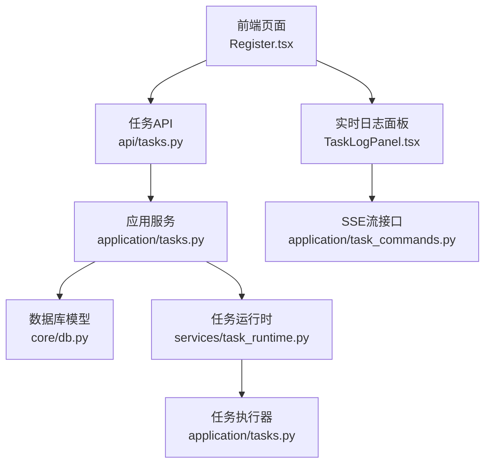
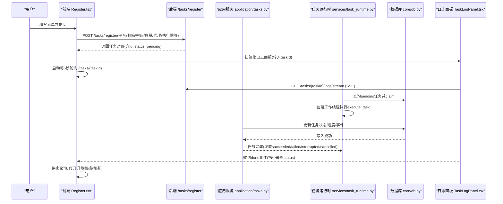
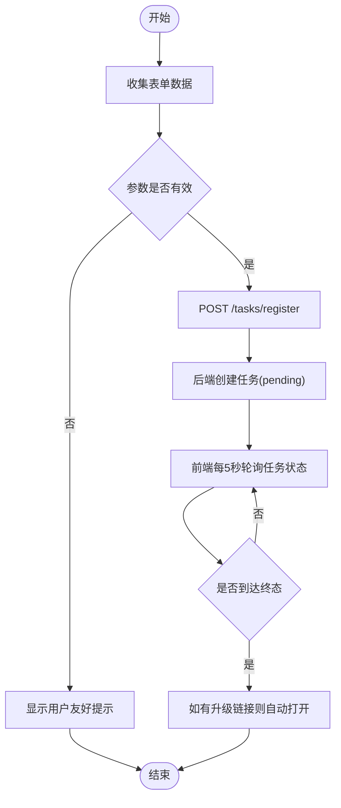
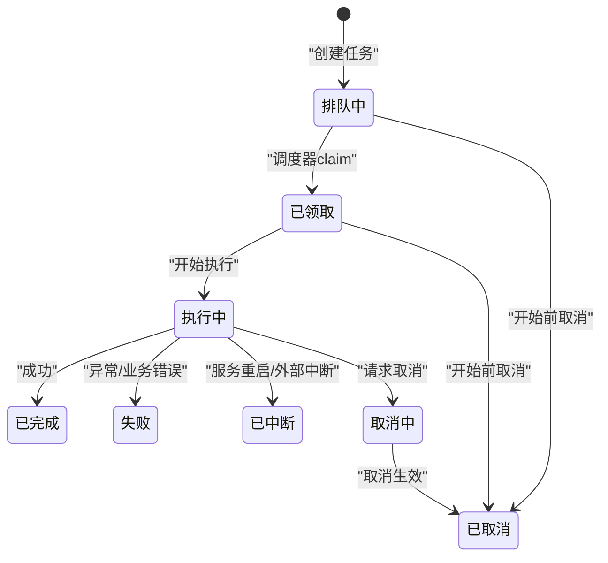
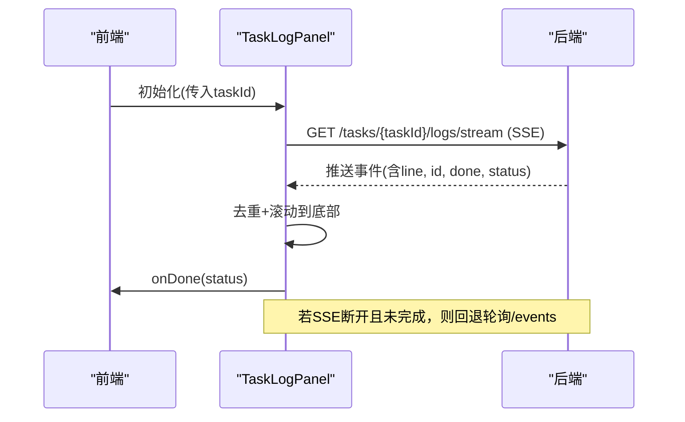
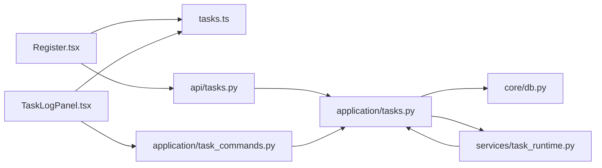

# 任务提交与监控

<cite>
**本文引用的文件**
- [api/tasks.py](file://api/tasks.py)
- [application/tasks.py](file://application/tasks.py)
- [domain/tasks.py](file://domain/tasks.py)
- [core/db.py](file://core/db.py)
- [services/task_runtime.py](file://services/task_runtime.py)
- [application/task_commands.py](file://application/task_commands.py)
- [frontend/src/pages/Register.tsx](file://frontend/src/pages/Register.tsx)
- [frontend/src/components/tasks/TaskLogPanel.tsx](file://frontend/src/components/tasks/TaskLogPanel.tsx)
- [frontend/src/lib/tasks.ts](file://frontend/src/lib/tasks.ts)
</cite>

## 目录
1. [简介](#简介)
2. [项目结构](#项目结构)
3. [核心组件](#核心组件)
4. [架构总览](#架构总览)
5. [详细组件分析](#详细组件分析)
6. [依赖关系分析](#依赖关系分析)
7. [性能考虑](#性能考虑)
8. [故障排查指南](#故障排查指南)
9. [结论](#结论)
10. [附录](#附录)

## 简介
本章节面向注册任务的“提交—执行—监控”全链路，说明从前端表单收集、参数校验、API 调用到后端任务创建、调度执行、状态流转、实时日志推送以及结果展示的完整流程。同时覆盖错误处理、任务取消/重试等扩展能力，帮助读者快速理解并高效使用该系统。

## 项目结构
系统采用前后端分离的架构：
- 前端（React）提供注册表单、任务状态面板和实时日志展示。
- 后端（FastAPI + Python）提供任务 API、任务调度器、持久化模型与平台执行逻辑。
- 数据层通过 SQLModel 将任务、事件、账户等信息持久化到 SQLite。

**图表来源**
- [api/tasks.py:11-29](file://api/tasks.py#L11-L29)
- [application/tasks.py:174-247](file://application/tasks.py#L174-L247)
- [core/db.py:241-288](file://core/db.py#L241-L288)
- [services/task_runtime.py:18-101](file://services/task_runtime.py#L18-L101)
- [application/task_commands.py:20-48](file://application/task_commands.py#L20-L48)
- [frontend/src/pages/Register.tsx:244-316](file://frontend/src/pages/Register.tsx#L244-L316)
- [frontend/src/components/tasks/TaskLogPanel.tsx:28-108](file://frontend/src/components/tasks/TaskLogPanel.tsx#L28-L108)

**章节来源**
- [api/tasks.py:11-29](file://api/tasks.py#L11-L29)
- [application/tasks.py:174-247](file://application/tasks.py#L174-L247)
- [core/db.py:241-288](file://core/db.py#L241-L288)
- [services/task_runtime.py:18-101](file://services/task_runtime.py#L18-L101)
- [application/task_commands.py:20-48](file://application/task_commands.py#L20-L48)
- [frontend/src/pages/Register.tsx:244-316](file://frontend/src/pages/Register.tsx#L244-L316)
- [frontend/src/components/tasks/TaskLogPanel.tsx:28-108](file://frontend/src/components/tasks/TaskLogPanel.tsx#L28-L108)

## 核心组件
- 任务模型与事件模型：定义任务、任务事件的数据库结构与序列化方式。
- 任务服务：负责任务创建、查询、事件追加、进度更新、结果聚合。
- 任务运行时：后台线程循环拉取可执行任务，限制并发度与平台并行度，启动工作线程执行。
- 前端注册页：表单配置、提交任务、轮询任务状态、打开升级链接。
- 实时日志面板：基于 SSE 流式接收事件，回退为轮询获取事件列表，展示进度与错误信息。

**章节来源**
- [core/db.py:229-288](file://core/db.py#L229-L288)
- [application/tasks.py:129-171](file://application/tasks.py#L129-L171)
- [application/tasks.py:174-247](file://application/tasks.py#L174-L247)
- [services/task_runtime.py:18-101](file://services/task_runtime.py#L18-L101)
- [frontend/src/pages/Register.tsx:244-316](file://frontend/src/pages/Register.tsx#L244-L316)
- [frontend/src/components/tasks/TaskLogPanel.tsx:28-108](file://frontend/src/components/tasks/TaskLogPanel.tsx#L28-L108)

## 架构总览
下图展示了从用户点击“开始注册”到任务完成的全链路交互，包括前端轮询、后端任务创建、调度执行、状态更新与日志推送。

**图表来源**
- [frontend/src/pages/Register.tsx:244-316](file://frontend/src/pages/Register.tsx#L244-L316)
- [application/task_commands.py:20-48](file://application/task_commands.py#L20-L48)
- [services/task_runtime.py:47-92](file://services/task_runtime.py#L47-L92)
- [application/tasks.py:570-595](file://application/tasks.py#L570-L595)
- [core/db.py:241-288](file://core/db.py#L241-L288)

## 详细组件分析

### 任务提交流程（表单—验证—API—创建任务）
- 前端表单字段包括平台、邮箱、密码、批量数量、代理、执行通道、身份提供者、邮箱/短信服务等。
- 提交时组装 extra 参数（包含 identity_provider、oauth_provider、邮箱/短信 provider 及字段），调用 /tasks/register。
- 后端创建任务记录，初始状态为 pending，并附加进度总量（count）。
- 任务创建后，前端立即进入轮询模式，每 5 秒请求任务详情；同时日志面板建立 SSE 连接以接收实时事件。

**图表来源**
- [frontend/src/pages/Register.tsx:244-316](file://frontend/src/pages/Register.tsx#L244-L316)
- [application/tasks.py:201-208](file://application/tasks.py#L201-L208)

**章节来源**
- [frontend/src/pages/Register.tsx:244-316](file://frontend/src/pages/Register.tsx#L244-L316)
- [application/tasks.py:201-208](file://application/tasks.py#L201-L208)

### 任务状态生命周期管理
- 状态集合：pending、claimed、running、succeeded、failed、interrupted、cancel_requested、cancelled。
- 终态集合：succeeded、failed、interrupted、cancelled。
- 关键行为：
  - 创建任务：状态为 pending，进度总量为 count。
  - 调度领取：claim_next_runnable_task 将 pending 改为 claimed，并记录 started_at。
  - 执行中：TaskLogger.mark_running 将状态改为 running。
  - 完成：finish 根据结果设置为 succeeded/failed/interrupted/cancelled，并记录 finished_at。
  - 中断恢复：服务重启后将非终态任务标记为 interrupted。

**图表来源**
- [application/tasks.py:31-50](file://application/tasks.py#L31-L50)
- [application/tasks.py:318-338](file://application/tasks.py#L318-L338)
- [application/tasks.py:385-391](file://application/tasks.py#L385-L391)
- [application/tasks.py:443-457](file://application/tasks.py#L443-L457)
- [application/tasks.py:296-316](file://application/tasks.py#L296-L316)

**章节来源**
- [application/tasks.py:31-50](file://application/tasks.py#L31-L50)
- [application/tasks.py:296-316](file://application/tasks.py#L296-L316)
- [application/tasks.py:318-338](file://application/tasks.py#L318-L338)
- [application/tasks.py:385-391](file://application/tasks.py#L385-L391)
- [application/tasks.py:443-457](file://application/tasks.py#L443-L457)

### 实时任务监控（轮询+SSE）
- 前端轮询：每 5 秒请求 /tasks/{taskId}，直到任务到达终态。
- 日志面板：优先使用 SSE 流 /tasks/{taskId}/logs/stream 接收事件；若连接不可用，回退为每 1 秒轮询 /tasks/{taskId}/events?since=cursor。
- 事件去重：通过事件 id 维护 seenEventIds 与 cursor，避免重复渲染。
- 完成通知：当收到 done 标志或检测到终态，关闭 SSE 并回调上层处理。

**图表来源**
- [frontend/src/components/tasks/TaskLogPanel.tsx:28-108](file://frontend/src/components/tasks/TaskLogPanel.tsx#L28-L108)
- [application/task_commands.py:32-48](file://application/task_commands.py#L32-L48)

**章节来源**
- [frontend/src/components/tasks/TaskLogPanel.tsx:28-108](file://frontend/src/components/tasks/TaskLogPanel.tsx#L28-L108)
- [application/task_commands.py:32-48](file://application/task_commands.py#L32-L48)

### 任务日志的流式输出（TaskLogPanel）
- 日志面板维护 lines 数组，按序追加 line 字段，自动滚动到底部。
- 支持复制日志文本。
- 根据任务状态动态展示进度条与错误原因。
- 当任务达到终态时，停止轮询并关闭 SSE。

**章节来源**
- [frontend/src/components/tasks/TaskLogPanel.tsx:110-204](file://frontend/src/components/tasks/TaskLogPanel.tsx#L110-L204)

### 错误处理机制
- 网络错误：前端轮询与 SSE 错误被静默处理，不影响整体流程；SSE 断开时自动回退轮询。
- 业务错误：后端在注册过程中捕获异常，记录 error_count 与 errors 列表，并通过 TaskLogger.record_error 写入事件。
- 用户友好提示：前端在任务面板展示错误文本与状态标签；如任务在服务重启后被中断，会给出明确提示。

**章节来源**
- [application/tasks.py:414-423](file://application/tasks.py#L414-L423)
- [application/tasks.py:782-789](file://application/tasks.py#L782-L789)
- [frontend/src/pages/Register.tsx:553-580](file://frontend/src/pages/Register.tsx#L553-L580)
- [frontend/src/components/tasks/TaskLogPanel.tsx:158-163](file://frontend/src/components/tasks/TaskLogPanel.tsx#L158-L163)

### 任务结果展示（成功账号与失败报告）
- 成功：保存账户信息，可选自动推送至 Any2API、上传 CPA、生成升级链接（cashier_urls）。
- 失败：记录错误消息与次数，前端展示错误列表与总体错误信息。
- 升级链接：成功后自动在新窗口打开 cashier_urls 中的链接。

**章节来源**
- [application/tasks.py:460-497](file://application/tasks.py#L460-L497)
- [application/tasks.py:760-781](file://application/tasks.py#L760-L781)
- [frontend/src/pages/Register.tsx:69-84](file://frontend/src/pages/Register.tsx#L69-L84)

### 任务管理的扩展功能（取消、重试）
- 取消：调用 request_cancel 将任务置为 cancel_requested 或直接 cancelled（取决于阶段），并记录事件。
- 重试：当前代码未直接暴露“重试”API；可通过重新提交相同 payload 的方式实现。
- 中断恢复：服务重启时将非终态任务标记为 interrupted，避免悬挂任务。

**章节来源**
- [application/tasks.py:318-338](file://application/tasks.py#L318-L338)
- [application/tasks.py:296-316](file://application/tasks.py#L296-L316)
- [application/task_commands.py:26-30](file://application/task_commands.py#L26-L30)

## 依赖关系分析
- 前端依赖：
  - Register.tsx 依赖 tasks.ts 的状态映射与终态判断。
  - TaskLogPanel.tsx 依赖 API_BASE 与任务状态工具函数。
- 后端依赖：
  - api/tasks.py 依赖 application/tasks_query 进行任务查询。
  - application/tasks.py 依赖 core/db 模型、infrastructure 仓库、platform 插件。
  - services/task_runtime.py 依赖 application/tasks 的 claim/execute 能力。
  - application/task_commands.py 提供 SSE 流接口，依赖 application/tasks 的事件查询。

**图表来源**
- [frontend/src/pages/Register.tsx:244-316](file://frontend/src/pages/Register.tsx#L244-L316)
- [frontend/src/components/tasks/TaskLogPanel.tsx:28-108](file://frontend/src/components/tasks/TaskLogPanel.tsx#L28-L108)
- [api/tasks.py:11-29](file://api/tasks.py#L11-L29)
- [application/tasks.py:174-247](file://application/tasks.py#L174-L247)
- [core/db.py:241-288](file://core/db.py#L241-L288)
- [services/task_runtime.py:47-92](file://services/task_runtime.py#L47-L92)
- [application/task_commands.py:20-48](file://application/task_commands.py#L20-L48)

**章节来源**
- [frontend/src/lib/tasks.ts:1-45](file://frontend/src/lib/tasks.ts#L1-L45)
- [api/tasks.py:11-29](file://api/tasks.py#L11-L29)
- [application/tasks.py:174-247](file://application/tasks.py#L174-L247)
- [core/db.py:241-288](file://core/db.py#L241-L288)
- [services/task_runtime.py:47-92](file://services/task_runtime.py#L47-L92)
- [application/task_commands.py:20-48](file://application/task_commands.py#L20-L48)

## 性能考虑
- 并发控制：任务运行时限制最大并行任务数与单平台并行数，避免资源争用。
- 进度更新：TaskLogger.set_progress 原子更新进度，减少频繁写库开销。
- 日志推送：优先使用 SSE 流式推送，降低轮询压力；断线自动回退轮询保证可靠性。
- 代理池：注册成功/失败对代理进行成功率反馈，优化后续选择。

[本节为通用指导，不直接分析具体文件]

## 故障排查指南
- 任务无日志：检查 SSE 连接是否健康；若不可用，确认轮询 /events 是否正常返回。
- 任务长时间 pending：检查是否有可用 worker 槽位；查看 claim_next_runnable_task 是否因平台并发限制跳过。
- 任务被中断：服务重启会将非终态任务标记为 interrupted；需重新提交或等待恢复。
- 错误定位：查看任务面板的错误列表与错误文本；必要时导出日志副本进行分析。

**章节来源**
- [frontend/src/components/tasks/TaskLogPanel.tsx:76-100](file://frontend/src/components/tasks/TaskLogPanel.tsx#L76-L100)
- [services/task_runtime.py:47-84](file://services/task_runtime.py#L47-L84)
- [application/tasks.py:296-316](file://application/tasks.py#L296-L316)
- [frontend/src/pages/Register.tsx:553-580](file://frontend/src/pages/Register.tsx#L553-L580)

## 结论
本系统通过清晰的任务生命周期管理与前后端协作，实现了注册任务的稳定提交、可靠执行与实时可视化监控。SSE 与轮询结合的日志推送策略兼顾了实时性与鲁棒性；完善的错误处理与结果展示提升了用户体验。未来可在重试机制、更细粒度的并发控制与多进程扩展方面进一步优化。

[本节为总结，不直接分析具体文件]

## 附录
- 任务数据结构：参考 domain/tasks.py 中的 TaskProgress、TaskSummary、TaskEvent 定义。
- 数据库模型：参考 core/db.py 中的 TaskModel、TaskEventModel、TaskLog 表结构。
- 状态映射：参考 frontend/src/lib/tasks.ts 中的 TASK_STATUS_VARIANTS 与 isTerminalTaskStatus。

**章节来源**
- [domain/tasks.py:8-44](file://domain/tasks.py#L8-L44)
- [core/db.py:229-288](file://core/db.py#L229-L288)
- [frontend/src/lib/tasks.ts:1-45](file://frontend/src/lib/tasks.ts#L1-L45)