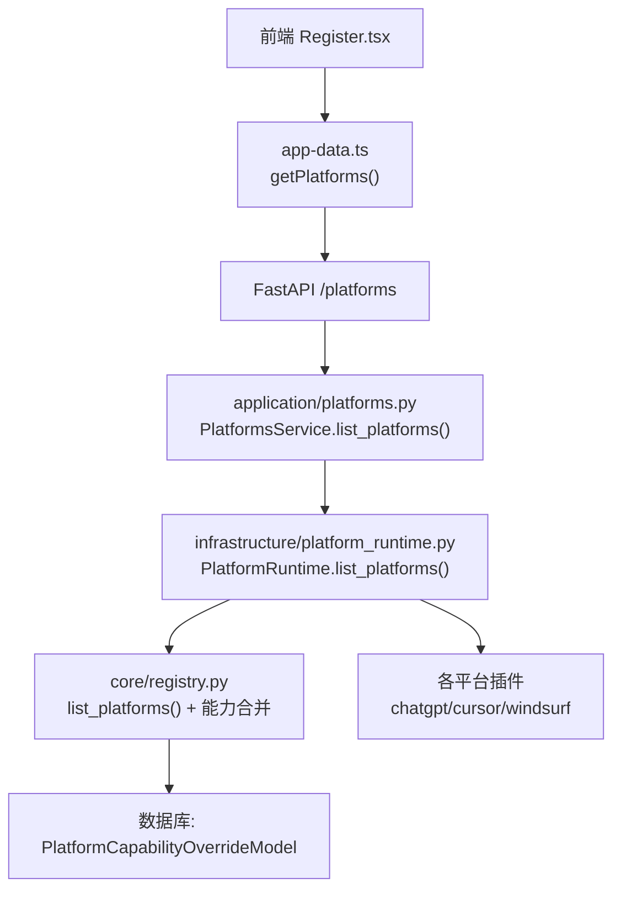
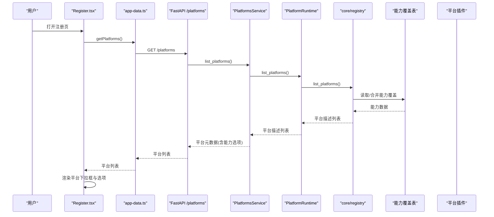
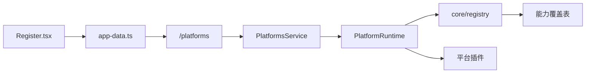
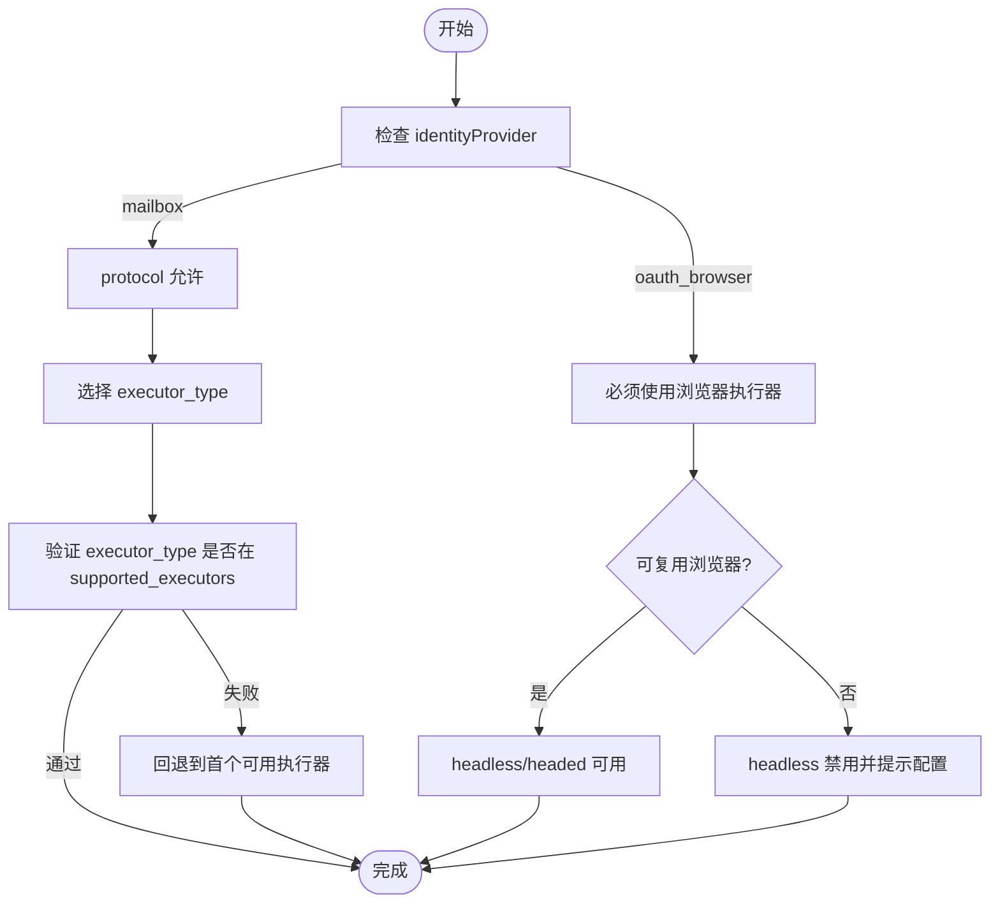

# 平台选择与配置

<cite>
**本文引用的文件**
- [api/platforms.py](file://api/platforms.py)
- [application/platforms.py](file://application/platforms.py)
- [infrastructure/platform_runtime.py](file://infrastructure/platform_runtime.py)
- [core/base_platform.py](file://core/base_platform.py)
- [core/registry.py](file://core/registry.py)
- [infrastructure/platform_caps_repository.py](file://infrastructure/platform_caps_repository.py)
- [application/platform_capabilities.py](file://application/platform_capabilities.py)
- [api/platform_capabilities.py](file://api/platform_capabilities.py)
- [platforms/chatgpt/plugin.py](file://platforms/chatgpt/plugin.py)
- [platforms/cursor/plugin.py](file://platforms/cursor/plugin.py)
- [platforms/windsurf/plugin.py](file://platforms/windsurf/plugin.py)
- [frontend/src/lib/app-data.ts](file://frontend/src/lib/app-data.ts)
- [frontend/src/pages/Register.tsx](file://frontend/src/pages/Register.tsx)
- [frontend/src/lib/registration.ts](file://frontend/src/lib/registration.ts)
</cite>

## 目录
1. [简介](#简介)
2. [项目结构](#项目结构)
3. [核心组件](#核心组件)
4. [架构总览](#架构总览)
5. [详细组件分析](#详细组件分析)
6. [依赖关系分析](#依赖关系分析)
7. [性能考虑](#性能考虑)
8. [故障排查指南](#故障排查指南)
9. [结论](#结论)
10. [附录](#附录)

## 简介
本章节聚焦注册流程中的“平台选择”功能，覆盖以下要点：
- 如何动态加载可用平台列表（ChatGPT、Cursor、Windsurf 等）
- 平台配置的获取机制（通过 getPlatforms() API 获取平台元数据）
- 平台选项的渲染逻辑（名称、显示名、执行器映射）
- 默认平台的选择策略与回退机制
- 平台能力检查与执行器类型动态调整
- 新平台的扩展接入方法

## 项目结构
平台选择涉及前后端协作：前端页面发起请求获取平台列表与配置选项，后端通过运行时层读取已注册平台及其能力，再返回给前端用于渲染。

图表来源
- [frontend/src/pages/Register.tsx:86-133](file://frontend/src/pages/Register.tsx#L86-L133)
- [frontend/src/lib/app-data.ts:77-82](file://frontend/src/lib/app-data.ts#L77-L82)
- [api/platforms.py:11-13](file://api/platforms.py#L11-L13)
- [application/platforms.py:57-77](file://application/platforms.py#L57-L77)
- [infrastructure/platform_runtime.py:221-238](file://infrastructure/platform_runtime.py#L221-L238)
- [core/registry.py:100-123](file://core/registry.py#L100-L123)

章节来源
- [frontend/src/pages/Register.tsx:86-133](file://frontend/src/pages/Register.tsx#L86-L133)
- [frontend/src/lib/app-data.ts:77-82](file://frontend/src/lib/app-data.ts#L77-L82)
- [api/platforms.py:11-13](file://api/platforms.py#L11-L13)
- [application/platforms.py:57-77](file://application/platforms.py#L57-L77)
- [infrastructure/platform_runtime.py:221-238](file://infrastructure/platform_runtime.py#L221-L238)
- [core/registry.py:100-123](file://core/registry.py#L100-L123)

## 核心组件
- 前端注册页：负责调用 getPlatforms()、渲染平台下拉框、根据平台能力构建身份模式与执行器选项、处理默认值与回退。
- 后端平台服务：聚合平台元数据，将能力字段转换为带标签的选项集合，供前端展示。
- 平台运行时：加载所有平台插件，从数据库读取并合并能力覆盖，输出统一的结构。
- 平台基类与各平台插件：声明支持的能力（执行器、身份模式、OAuth 提供商），实现具体注册流程与动作。

章节来源
- [frontend/src/pages/Register.tsx:46-133](file://frontend/src/pages/Register.tsx#L46-L133)
- [frontend/src/lib/registration.ts:14-111](file://frontend/src/lib/registration.ts#L14-L111)
- [application/platforms.py:6-77](file://application/platforms.py#L6-L77)
- [infrastructure/platform_runtime.py:221-238](file://infrastructure/platform_runtime.py#L221-L238)
- [core/base_platform.py:44-76](file://core/base_platform.py#L44-L76)
- [platforms/chatgpt/plugin.py:48-66](file://platforms/chatgpt/plugin.py#L48-L66)
- [platforms/cursor/plugin.py:18-32](file://platforms/cursor/plugin.py#L18-L32)
- [platforms/windsurf/plugin.py:35-69](file://platforms/windsurf/plugin.py#L35-L69)

## 架构总览
下图展示了从前端到后端的完整数据流，包括平台列表加载、能力合并、选项生成与前端渲染的关键路径。

图表来源
- [frontend/src/pages/Register.tsx:86-133](file://frontend/src/pages/Register.tsx#L86-L133)
- [frontend/src/lib/app-data.ts:77-82](file://frontend/src/lib/app-data.ts#L77-L82)
- [api/platforms.py:11-13](file://api/platforms.py#L11-L13)
- [application/platforms.py:57-77](file://application/platforms.py#L57-L77)
- [infrastructure/platform_runtime.py:221-238](file://infrastructure/platform_runtime.py#L221-L238)
- [core/registry.py:100-123](file://core/registry.py#L100-L123)

## 详细组件分析

### 动态加载平台列表
- 前端在注册页初始化时并行获取配置、平台列表与配置选项，并将平台列表缓存。
- 后端路由暴露 /platforms，调用 PlatformsService.list_platforms()。
- 服务层通过 PlatformRuntime.list_platforms() 加载所有平台，并从数据库读取能力覆盖，最终返回包含 name、display_name、version 以及各项 supported_* 字段的数据。

章节来源
- [frontend/src/pages/Register.tsx:86-133](file://frontend/src/pages/Register.tsx#L86-L133)
- [frontend/src/lib/app-data.ts:77-82](file://frontend/src/lib/app-data.ts#L77-L82)
- [api/platforms.py:11-13](file://api/platforms.py#L11-L13)
- [application/platforms.py:57-77](file://application/platforms.py#L57-L77)
- [infrastructure/platform_runtime.py:221-238](file://infrastructure/platform_runtime.py#L221-L238)
- [core/registry.py:100-123](file://core/registry.py#L100-L123)

### 平台配置的获取机制（getPlatforms）
- app-data.ts 提供 getPlatforms()，内部使用缓存与 TTL，避免频繁请求。
- 当需要刷新时可通过 force 参数或失效接口清除缓存。
- 后端返回的平台元数据包含：
  - 基础信息：name、display_name、version
  - 能力列表：supported_executors、supported_identity_modes、supported_oauth_providers
  - 选项映射：supported_executor_options、supported_identity_mode_options、supported_oauth_provider_options

章节来源
- [frontend/src/lib/app-data.ts:77-82](file://frontend/src/lib/app-data.ts#L77-L82)
- [application/platforms.py:6-77](file://application/platforms.py#L6-L77)

### 平台选项的渲染逻辑
- 前端根据当前平台的能力列表构建“注册身份”选项：
  - 若支持 mailbox，则显示“系统邮箱”自动收验证码注册
  - 若支持 oauth_browser，则列出支持的 OAuth 提供商（如 Google、Microsoft）
- 执行器选项根据 identityProvider 与平台能力动态生成：
  - protocol：不打开浏览器，仅协议模式；若非 mailbox 则禁用并提示需浏览器自动化
  - headless：后台浏览器自动；若为 oauth_browser 且未配置可复用浏览器，则禁用并提示配置 Chrome Profile 或 CDP
  - headed：可视化浏览器自动
- 选项标签通过后端提供的 options 映射进行本地化显示（如“协议模式”、“后台浏览器自动”等）。

章节来源
- [frontend/src/lib/registration.ts:14-111](file://frontend/src/lib/registration.ts#L14-L111)
- [application/platforms.py:6-54](file://application/platforms.py#L6-L54)
- [frontend/src/pages/Register.tsx:135-144](file://frontend/src/pages/Register.tsx#L135-L144)

### 默认平台的选择策略与回退机制
- 初始化时，前端会尝试应用全局默认 executor_type、identity_provider、oauth_provider 等。
- 若当前选择的 platform 不在已加载列表中，会自动回退到第一个可用平台。
- 若当前 identity_provider 与 oauth_provider 组合不在当前平台支持范围内，会优先按 identityProvider 匹配，否则取首个可用项。

章节来源
- [frontend/src/pages/Register.tsx:109-131](file://frontend/src/pages/Register.tsx#L109-L131)
- [frontend/src/pages/Register.tsx:209-216](file://frontend/src/pages/Register.tsx#L209-L216)
- [frontend/src/pages/Register.tsx:218-231](file://frontend/src/pages/Register.tsx#L218-L231)

### 平台能力检查与执行器类型动态调整
- BasePlatform 在构造时会从数据库读取平台能力覆盖，校验所选 executor_type 是否受支持，否则抛出异常。
- 前端在 identityProvider 或浏览器复用状态变化时，重新计算有效执行器并自动选择合适值：
  - 若为 oauth_browser，优先选择 headless/headed（需可复用浏览器）
  - 否则优先选择支持的 executor_type，若无则回退到首个可用项

章节来源
- [core/base_platform.py:59-76](file://core/base_platform.py#L59-L76)
- [frontend/src/pages/Register.tsx:233-242](file://frontend/src/pages/Register.tsx#L233-L242)
- [frontend/src/lib/registration.ts:14-32](file://frontend/src/lib/registration.ts#L14-L32)

### 平台能力与执行器的映射关系
- 后端维护了执行器、身份模式、OAuth 提供商的中文标签映射，用于前端展示。
- 平台插件声明各自支持的能力：
  - ChatGPT：支持 protocol/headless/headed，身份模式 mailbox/oauth_browser，OAuth 提供商 google/microsoft
  - Cursor：支持 protocol/headless/headed，身份模式 mailbox
  - Windsurf：支持 protocol/headless/headed，身份模式 mailbox，并提供丰富的能力（查询状态、试用链接、桌面切换等）

章节来源
- [application/platforms.py:6-25](file://application/platforms.py#L6-L25)
- [platforms/chatgpt/plugin.py:48-66](file://platforms/chatgpt/plugin.py#L48-L66)
- [platforms/cursor/plugin.py:18-32](file://platforms/cursor/plugin.py#L18-L32)
- [platforms/windsurf/plugin.py:35-69](file://platforms/windsurf/plugin.py#L35-L69)

### 平台能力的数据库覆盖与持久化
- 平台能力可在数据库中覆盖，允许管理员动态调整每个平台的支持能力。
- 启动时会将平台类声明的默认能力与数据库记录合并，确保新增能力自动生效。
- 提供 REST API 更新或重置平台能力，前端设置页可直接编辑并保存。

章节来源
- [core/registry.py:64-107](file://core/registry.py#L64-L107)
- [infrastructure/platform_caps_repository.py:12-53](file://infrastructure/platform_caps_repository.py#L12-L53)
- [application/platform_capabilities.py:7-24](file://application/platform_capabilities.py#L7-L24)
- [api/platform_capabilities.py:11-18](file://api/platform_capabilities.py#L11-L18)
- [frontend/src/pages/Settings.tsx:113-160](file://frontend/src/pages/Settings.tsx#L113-L160)

### 新平台快速接入与配置
- 在 platforms/<new_platform>/plugin.py 中定义平台类，继承 BasePlatform，声明 name、display_name、version 及 capabilities。
- 实现必要的适配器（浏览器注册、协议邮箱、协议 OAuth）以支持不同执行器。
- 平台能力会在启动时被自动发现并写入数据库覆盖表，随后即可在前端选择与配置。

章节来源
- [core/base_platform.py:44-76](file://core/base_platform.py#L44-L76)
- [platforms/chatgpt/plugin.py:48-66](file://platforms/chatgpt/plugin.py#L48-L66)
- [platforms/cursor/plugin.py:18-32](file://platforms/cursor/plugin.py#L18-L32)
- [platforms/windsurf/plugin.py:35-69](file://platforms/windsurf/plugin.py#L35-L69)
- [core/registry.py:100-123](file://core/registry.py#L100-L123)

## 依赖关系分析
平台选择功能的依赖链如下：
- 前端 Register.tsx 依赖 app-data.ts 的 getPlatforms()
- app-data.ts 调用 FastAPI /platforms
- FastAPI 路由调用 application/platforms.py 的 PlatformsService
- PlatformsService 依赖 infrastructure/platform_runtime.py 的 PlatformRuntime
- PlatformRuntime 依赖 core/registry.py 的 list_platforms() 与数据库能力覆盖
- 平台插件通过 @register 装饰器被注册，并在运行时被加载

图表来源
- [frontend/src/pages/Register.tsx:86-133](file://frontend/src/pages/Register.tsx#L86-L133)
- [frontend/src/lib/app-data.ts:77-82](file://frontend/src/lib/app-data.ts#L77-L82)
- [api/platforms.py:11-13](file://api/platforms.py#L11-L13)
- [application/platforms.py:57-77](file://application/platforms.py#L57-L77)
- [infrastructure/platform_runtime.py:221-238](file://infrastructure/platform_runtime.py#L221-L238)
- [core/registry.py:100-123](file://core/registry.py#L100-L123)

章节来源
- [frontend/src/pages/Register.tsx:86-133](file://frontend/src/pages/Register.tsx#L86-L133)
- [frontend/src/lib/app-data.ts:77-82](file://frontend/src/lib/app-data.ts#L77-L82)
- [api/platforms.py:11-13](file://api/platforms.py#L11-L13)
- [application/platforms.py:57-77](file://application/platforms.py#L57-L77)
- [infrastructure/platform_runtime.py:221-238](file://infrastructure/platform_runtime.py#L221-L238)
- [core/registry.py:100-123](file://core/registry.py#L100-L123)

## 性能考虑
- 前端对 getPlatforms() 使用缓存与 TTL，减少重复请求。
- 后端在启动时将平台能力合并入数据库，避免每次请求都进行复杂计算。
- 平台运行时按需加载插件，减少内存占用。
- 建议合理设置缓存过期时间，并在修改平台能力后主动失效缓存。

[本节为通用指导，无需特定文件引用]

## 故障排查指南
- 平台列表为空：检查后端是否成功加载平台插件，确认数据库能力覆盖表是否存在记录。
- 执行器不可用：确认所选 identityProvider 与平台能力匹配；若为 oauth_browser，需配置 Chrome Profile 或 CDP。
- 默认平台未生效：检查前端初始化逻辑是否正确应用默认值，必要时手动选择平台触发回退。
- 能力更新未生效：确认已通过设置页保存能力覆盖，并刷新平台缓存。

章节来源
- [core/base_platform.py:59-76](file://core/base_platform.py#L59-L76)
- [frontend/src/pages/Register.tsx:209-242](file://frontend/src/pages/Register.tsx#L209-L242)
- [infrastructure/platform_caps_repository.py:22-53](file://infrastructure/platform_caps_repository.py#L22-L53)

## 结论
平台选择功能通过前后端协作实现了动态加载、能力映射与智能回退。借助数据库能力覆盖机制，系统具备高度的可扩展性，能够快速接入新平台并灵活调整其支持能力。前端基于平台能力渲染选项，确保用户体验的一致性与可用性。

[本节为总结，无需特定文件引用]

## 附录
- 关键流程图：平台能力检查与执行器选择

图表来源
- [frontend/src/lib/registration.ts:14-32](file://frontend/src/lib/registration.ts#L14-L32)
- [core/base_platform.py:59-76](file://core/base_platform.py#L59-L76)
- [frontend/src/pages/Register.tsx:233-242](file://frontend/src/pages/Register.tsx#L233-L242)