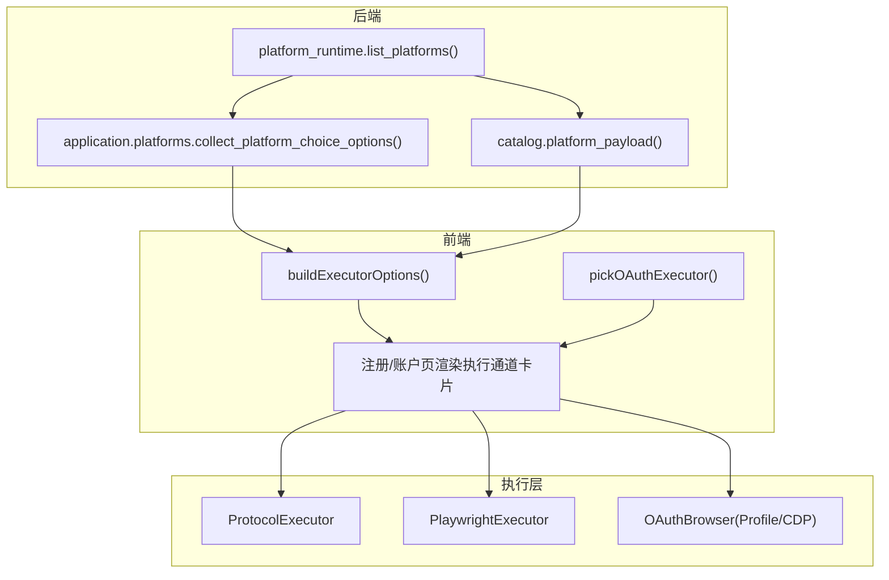
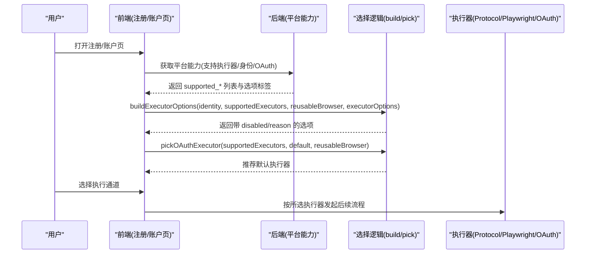
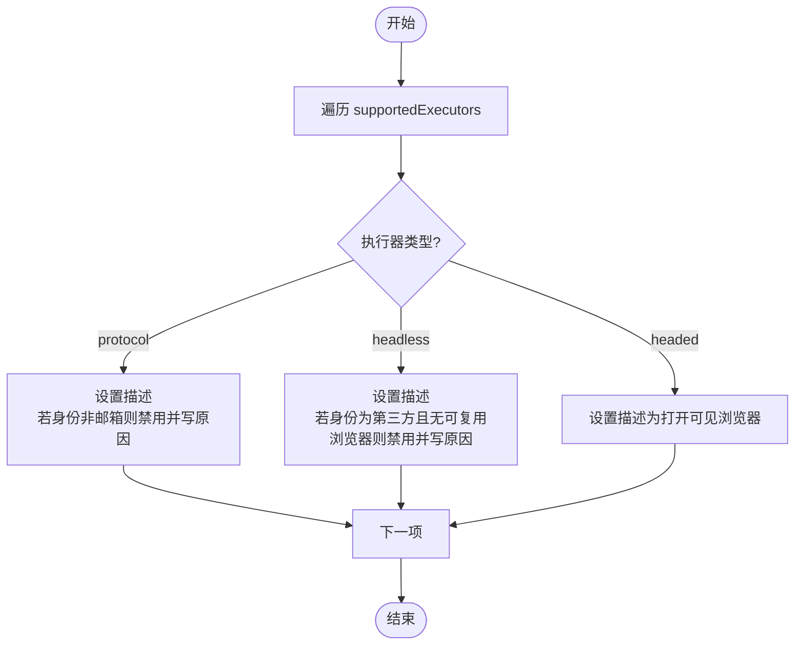
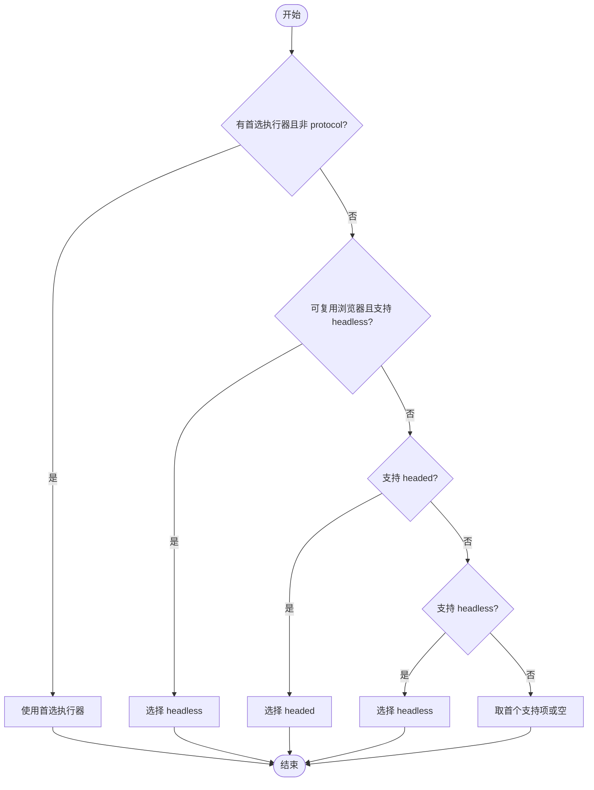
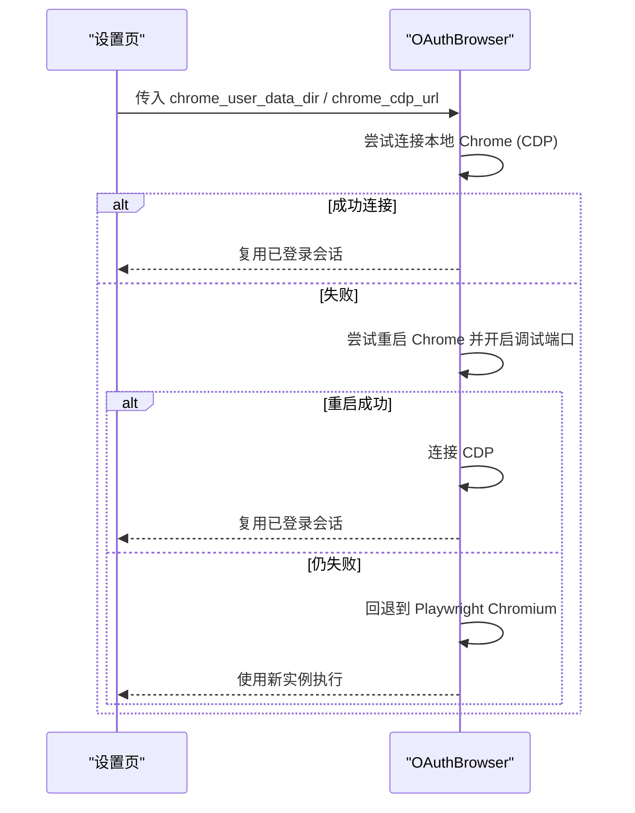
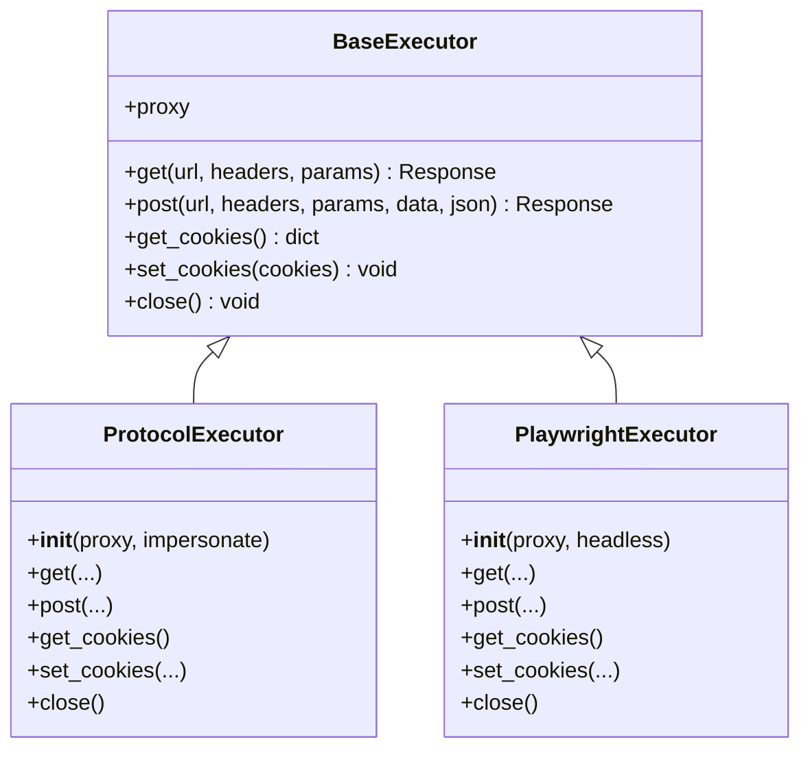

# 执行通道选择

<cite>
**本文引用的文件**
- [core/base_executor.py](file://core/base_executor.py)
- [core/executors/playwright.py](file://core/executors/playwright.py)
- [core/executors/protocol.py](file://core/executors/protocol.py)
- [core/oauth_browser.py](file://core/oauth_browser.py)
- [application/platforms.py](file://application/platforms.py)
- [infrastructure/platform_runtime.py](file://infrastructure/platform_runtime.py)
- [domain/platforms.py](file://domain/platforms.py)
- [frontend/src/lib/registration.ts](file://frontend/src/lib/registration.ts)
- [frontend/src/pages/Accounts.tsx](file://frontend/src/pages/Accounts.tsx)
- [frontend/src/pages/Register.tsx](file://frontend/src/pages/Register.tsx)
- [frontend/src/pages/SettingsPage.tsx](file://frontend/src/pages/SettingsPage.tsx)
- [customer_portal_api/app/catalog.py](file://customer_portal_api/app/catalog.py)
</cite>

## 目录
1. [简介](#简介)
2. [项目结构](#项目结构)
3. [核心组件](#核心组件)
4. [架构总览](#架构总览)
5. [详细组件分析](#详细组件分析)
6. [依赖关系分析](#依赖关系分析)
7. [性能考量](#性能考量)
8. [故障排查指南](#故障排查指南)
9. [结论](#结论)
10. [附录](#附录)

## 简介
本文件聚焦“执行通道”的选择与配置机制，围绕三种执行类型（协议模式、后台浏览器自动、可视浏览器自动）的含义与适用场景展开，解释前端如何根据平台能力与用户环境动态生成可用执行器选项，并基于身份模式与环境条件自动禁用不兼容的执行器。同时说明 OAuth 浏览器的特殊配置（Chrome Profile 路径与 CDP 地址），以及智能选择算法如何为用户推荐最佳执行通道。最后给出扩展机制建议，便于集成自定义执行方式。

## 项目结构
执行通道相关代码分布在以下层次：
- 后端能力声明与聚合：平台运行时收集各平台的 supported_executors/supported_identity_modes/supported_oauth_providers，并转换为前端可用的选项。
- 前端选择逻辑：根据当前选择的身份提供者（邮箱或第三方账号）、是否可复用本机浏览器、平台元数据，动态构建执行器选项并智能选择默认值。
- 执行器实现：提供协议模式与 Playwright 两种执行器；OAuth 浏览器支持连接本地 Chrome Profile 或通过 CDP 复用已登录会话。
- UI 配置入口：设置页提供 Chrome Profile 路径与 CDP 地址等配置项，影响执行器可用性。

图表来源
- [infrastructure/platform_runtime.py:221-238](file://infrastructure/platform_runtime.py#L221-L238)
- [application/platforms.py:36-54](file://application/platforms.py#L36-L54)
- [customer_portal_api/app/catalog.py:172-190](file://customer_portal_api/app/catalog.py#L172-L190)
- [frontend/src/lib/registration.ts:73-111](file://frontend/src/lib/registration.ts#L73-L111)
- [frontend/src/pages/Register.tsx:411-433](file://frontend/src/pages/Register.tsx#L411-L433)
- [core/executors/protocol.py:1-45](file://core/executors/protocol.py#L1-L45)
- [core/executors/playwright.py:1-134](file://core/executors/playwright.py#L1-L134)
- [core/oauth_browser.py:139-212](file://core/oauth_browser.py#L139-L212)

章节来源
- [infrastructure/platform_runtime.py:221-238](file://infrastructure/platform_runtime.py#L221-L238)
- [application/platforms.py:36-54](file://application/platforms.py#L36-L54)
- [customer_portal_api/app/catalog.py:172-190](file://customer_portal_api/app/catalog.py#L172-L190)
- [frontend/src/lib/registration.ts:73-111](file://frontend/src/lib/registration.ts#L73-L111)
- [frontend/src/pages/Register.tsx:411-433](file://frontend/src/pages/Register.tsx#L411-L433)
- [core/executors/protocol.py:1-45](file://core/executors/protocol.py#L1-L45)
- [core/executors/playwright.py:1-134](file://core/executors/playwright.py#L1-L134)
- [core/oauth_browser.py:139-212](file://core/oauth_browser.py#L139-L212)

## 核心组件
- 执行器基类与响应模型：定义统一的 HTTP 接口抽象，屏蔽底层差异，统一返回状态码、文本、头与 Cookie。
- 协议执行器：基于 curl_cffi 的无头 HTTP 客户端，适合纯协议流程（如系统邮箱验证码注册）。
- Playwright 执行器：封装 Chromium 启动、上下文与页面操作，支持 headless/headed 两种模式，并可注入代理与 UA。
- OAuth 浏览器：支持通过本地 Chrome Profile 或 CDP 复用已登录会话，也可回退到普通 Playwright Chromium。

章节来源
- [core/base_executor.py:1-49](file://core/base_executor.py#L1-L49)
- [core/executors/protocol.py:1-45](file://core/executors/protocol.py#L1-L45)
- [core/executors/playwright.py:1-134](file://core/executors/playwright.py#L1-L134)
- [core/oauth_browser.py:139-212](file://core/oauth_browser.py#L139-L212)

## 架构总览
执行通道的选择由“平台能力 + 用户配置 + 环境检测”共同决定：
- 后端暴露平台能力（支持的执行器、身份模式、OAuth 提供商）。
- 前端根据当前选择的身份提供者与全局配置（是否可复用本机浏览器）计算可用执行器选项，并对不兼容项进行禁用。
- 当使用第三方账号时，若未配置 Chrome Profile/CDP，则“后台浏览器自动”将被禁用；否则优先推荐该模式。
- 最终在注册/账户页以卡片形式展示可选执行通道，并允许用户切换。

图表来源
- [frontend/src/pages/Register.tsx:411-433](file://frontend/src/pages/Register.tsx#L411-L433)
- [frontend/src/pages/Accounts.tsx:257-280](file://frontend/src/pages/Accounts.tsx#L257-L280)
- [frontend/src/lib/registration.ts:73-111](file://frontend/src/lib/registration.ts#L73-L111)
- [frontend/src/lib/registration.ts:14-32](file://frontend/src/lib/registration.ts#L14-L32)
- [infrastructure/platform_runtime.py:221-238](file://infrastructure/platform_runtime.py#L221-L238)
- [application/platforms.py:36-54](file://application/platforms.py#L36-L54)

## 详细组件分析

### 执行器类型与适用场景
- 协议模式（protocol）
  - 含义：不启动浏览器，直接通过 HTTP 协议完成流程。
  - 适用：系统邮箱验证码注册等无需浏览器交互的场景。
  - 限制：当身份为第三方账号时不可用，需浏览器自动化。
- 后台浏览器自动（headless）
  - 含义：启动无头浏览器自动执行，界面不可见。
  - 适用：需要浏览器环境但希望最小资源占用；对第三方账号，通常复用本机登录态。
  - 限制：第三方账号模式下，必须配置 Chrome Profile 路径或 CDP 地址，否则被禁用。
- 可视浏览器自动（headed）
  - 含义：打开可见浏览器窗口，但仍全自动执行。
  - 适用：调试、演示或需要观察自动化过程。

章节来源
- [application/platforms.py:6-10](file://application/platforms.py#L6-L10)
- [customer_portal_api/app/catalog.py:4-8](file://customer_portal_api/app/catalog.py#L4-L8)
- [frontend/src/lib/registration.ts:88-109](file://frontend/src/lib/registration.ts#L88-L109)

### 执行器选项的动态生成（buildExecutorOptions）
- 输入：当前身份提供者、平台支持的执行器列表、是否可复用本机浏览器、平台提供的执行器选项标签。
- 处理：
  - 协议模式：仅当身份为系统邮箱时可用；否则禁用并提示原因。
  - 后台浏览器自动：若为第三方账号且未配置 Chrome Profile/CDP，则禁用并提示需先填写配置。
  - 可视浏览器自动：始终可用，描述会说明“会打开浏览器窗口，但系统仍自动执行”。
- 输出：每项包含 value、label、description、disabled、reason。

图表来源
- [frontend/src/lib/registration.ts:73-111](file://frontend/src/lib/registration.ts#L73-L111)

章节来源
- [frontend/src/lib/registration.ts:73-111](file://frontend/src/lib/registration.ts#L73-L111)

### 智能选择算法（pickOAuthExecutor）
- 目标：在第三方账号模式下，结合用户偏好与环境，推荐最合适的执行器。
- 规则：
  - 若用户指定了首选执行器且不是协议模式，则优先采用。
  - 若可复用本机浏览器且支持 headless，则推荐 headless。
  - 否则尝试 headed。
  - 再回退到 headless。
  - 最后取第一个支持的执行器。
- 效果：在无配置时尽量回退到可用项；在有配置时优先利用本机登录态。

图表来源
- [frontend/src/lib/registration.ts:14-32](file://frontend/src/lib/registration.ts#L14-L32)

章节来源
- [frontend/src/lib/registration.ts:14-32](file://frontend/src/lib/registration.ts#L14-L32)

### 执行器的禁用逻辑
- 协议模式禁用：当身份为第三方账号时，因需要浏览器自动化，协议模式被禁用。
- 后台浏览器自动禁用：当身份为第三方账号且未配置 Chrome Profile 路径或 CDP 地址时，无法复用登录态，因此禁用并提示配置要求。
- 这些禁用逻辑在前端即时生效，并在 UI 上显示原因，避免用户误选。

章节来源
- [frontend/src/lib/registration.ts:88-105](file://frontend/src/lib/registration.ts#L88-L105)

### OAuth 浏览器的特殊配置
- Chrome Profile 路径：用于直接复用本机已登录的 Chrome 用户数据目录，保持会话与 Cookie。
- Chrome CDP 地址：通过远程调试端口连接已运行的 Chrome，从而复用其登录态。
- 行为：
  - 若检测到本地 Chrome 且未开启调试端口，可尝试重启并启用调试端口后连接。
  - 若均不可用，则回退到普通 Playwright Chromium 启动。
- 配置入口：设置页提供“Chrome Profile 路径”和“Chrome CDP 地址”字段。

图表来源
- [core/oauth_browser.py:139-212](file://core/oauth_browser.py#L139-L212)
- [frontend/src/pages/SettingsPage.tsx:169-202](file://frontend/src/pages/SettingsPage.tsx#L169-L202)

章节来源
- [core/oauth_browser.py:139-212](file://core/oauth_browser.py#L139-L212)
- [frontend/src/pages/SettingsPage.tsx:169-202](file://frontend/src/pages/SettingsPage.tsx#L169-L202)

### 执行器实现与扩展机制
- 协议执行器：基于 curl_cffi，适合轻量、无浏览器依赖的场景。
- Playwright 执行器：封装 Chromium 生命周期、上下文、页面操作，支持代理、UA、超时等参数。
- 扩展点：
  - 新增执行器：继承 BaseExecutor，实现 get/post/get_cookies/set_cookies/close 等方法。
  - 平台能力声明：在平台定义中声明 supported_executors，使前端能感知并展示。
  - 前端选项：确保 executorOptions 标签映射正确，以便 UI 显示中文名称。
  - 选择逻辑：如需新的禁用/推荐策略，可在 buildExecutorOptions 与 pickOAuthExecutor 中扩展。

图表来源
- [core/base_executor.py:1-49](file://core/base_executor.py#L1-L49)
- [core/executors/protocol.py:1-45](file://core/executors/protocol.py#L1-L45)
- [core/executors/playwright.py:1-134](file://core/executors/playwright.py#L1-L134)

章节来源
- [core/base_executor.py:1-49](file://core/base_executor.py#L1-L49)
- [core/executors/protocol.py:1-45](file://core/executors/protocol.py#L1-L45)
- [core/executors/playwright.py:1-134](file://core/executors/playwright.py#L1-L134)

## 依赖关系分析
- 后端平台能力来源于各平台定义的 supported_executors/supported_identity_modes/supported_oauth_providers，并通过 PlatformRuntime 聚合为统一的能力描述。
- 前端依赖这些能力与用户配置，动态计算可用执行器选项，并在注册/账户页渲染。
- 执行器实现与选择逻辑解耦：前端只负责选择与展示，具体执行由后端或调用方根据所选执行器创建对应实例。

图表来源
- [infrastructure/platform_runtime.py:221-238](file://infrastructure/platform_runtime.py#L221-L238)
- [application/platforms.py:36-54](file://application/platforms.py#L36-L54)
- [frontend/src/pages/Register.tsx:411-433](file://frontend/src/pages/Register.tsx#L411-L433)
- [frontend/src/pages/Accounts.tsx:257-280](file://frontend/src/pages/Accounts.tsx#L257-L280)

章节来源
- [infrastructure/platform_runtime.py:221-238](file://infrastructure/platform_runtime.py#L221-L238)
- [application/platforms.py:36-54](file://application/platforms.py#L36-L54)
- [frontend/src/pages/Register.tsx:411-433](file://frontend/src/pages/Register.tsx#L411-L433)
- [frontend/src/pages/Accounts.tsx:257-280](file://frontend/src/pages/Accounts.tsx#L257-L280)

## 性能考量
- 协议模式：无浏览器开销，请求速度快、资源占用低，适合批量或高并发场景。
- Playwright 执行器：启动 Chromium 有一定开销；可通过复用上下文、合理设置超时与视口减少资源消耗。
- OAuth 浏览器复用：复用本机 Chrome 会话可减少登录步骤与网络往返，提升整体效率。
- 代理与 UA：合理配置代理与 User-Agent 可降低反爬触发概率，提高成功率。

[本节为通用指导，不直接分析具体文件]

## 故障排查指南
- 第三方账号下“后台浏览器自动”被禁用
  - 现象：选项不可选，提示需填写 Chrome Profile 路径或 CDP 地址。
  - 处理：在设置页配置“Chrome Profile 路径”或“Chrome CDP 地址”，确保可连接到本机已登录 Chrome。
- 协议模式不可用
  - 现象：当身份为第三方账号时，协议模式被禁用。
  - 处理：改用浏览器自动化（headless/headed）或切换到系统邮箱模式。
- 执行器初始化失败
  - 现象：Playwright 启动异常或连接 CDP 失败。
  - 处理：检查代理配置、端口占用、Chrome 是否已运行及调试端口是否开启；必要时回退到普通 Chromium。

章节来源
- [frontend/src/lib/registration.ts:88-105](file://frontend/src/lib/registration.ts#L88-L105)
- [frontend/src/pages/SettingsPage.tsx:169-202](file://frontend/src/pages/SettingsPage.tsx#L169-L202)
- [core/oauth_browser.py:139-212](file://core/oauth_browser.py#L139-L212)

## 结论
执行通道选择通过“平台能力 + 用户配置 + 环境检测”形成闭环：后端声明能力，前端依据身份与配置动态计算可用选项并智能推荐，最终在 UI 上呈现可执行的通道。对于第三方账号，优先复用本机浏览器登录态；若无配置则回退到可视化或无头浏览器。通过继承 BaseExecutor 与更新平台能力，可平滑扩展新的执行方式。

[本节为总结性内容，不直接分析具体文件]

## 附录
- 关键函数与位置
  - 构建执行器选项：[frontend/src/lib/registration.ts:73-111](file://frontend/src/lib/registration.ts#L73-L111)
  - 智能选择执行器：[frontend/src/lib/registration.ts:14-32](file://frontend/src/lib/registration.ts#L14-L32)
  - 平台能力聚合：[infrastructure/platform_runtime.py:221-238](file://infrastructure/platform_runtime.py#L221-L238)、[application/platforms.py:36-54](file://application/platforms.py#L36-L54)
  - 执行器实现：[core/executors/protocol.py:1-45](file://core/executors/protocol.py#L1-L45)、[core/executors/playwright.py:1-134](file://core/executors/playwright.py#L1-L134)
  - OAuth 浏览器：[core/oauth_browser.py:139-212](file://core/oauth_browser.py#L139-L212)
  - 设置页配置入口：[frontend/src/pages/SettingsPage.tsx:169-202](file://frontend/src/pages/SettingsPage.tsx#L169-L202)

[本节为索引信息，不直接分析具体文件]