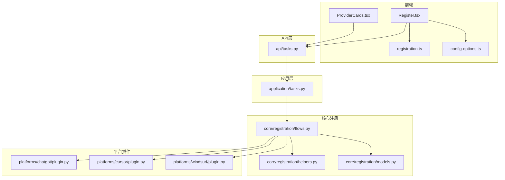
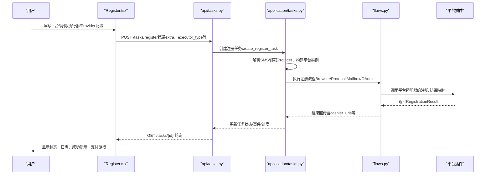
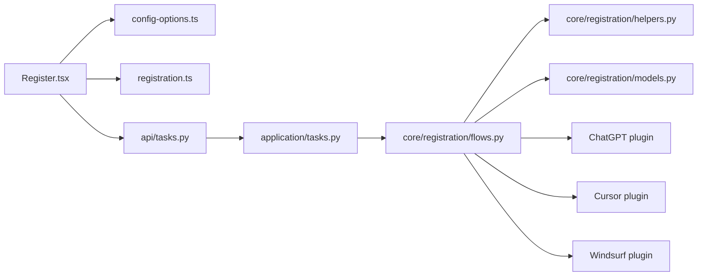

# 注册流程界面

<cite>
**本文引用的文件**
- [Register.tsx](file://frontend/src/pages/Register.tsx)
- [ProviderCards.tsx](file://frontend/src/components/settings/ProviderCards.tsx)
- [registration.ts](file://frontend/src/lib/registration.ts)
- [config-options.ts](file://frontend/src/lib/config-options.ts)
- [tasks.py](file://api/tasks.py)
- [application/tasks.py](file://application/tasks.py)
- [flows.py](file://core/registration/flows.py)
- [helpers.py](file://core/registration/helpers.py)
- [models.py](file://core/registration/models.py)
- [plugin.py（ChatGPT）](file://platforms/chatgpt/plugin.py)
- [plugin.py（Cursor）](file://platforms/cursor/plugin.py)
- [plugin.py（Windsurf）](file://platforms/windsurf/plugin.py)
</cite>

## 目录
1. [简介](#简介)
2. [项目结构](#项目结构)
3. [核心组件](#核心组件)
4. [架构总览](#架构总览)
5. [详细组件分析](#详细组件分析)
6. [依赖关系分析](#依赖关系分析)
7. [性能与稳定性](#性能与稳定性)
8. [故障排查指南](#故障排查指南)
9. [结论](#结论)
10. [附录：扩展新平台接入](#附录：扩展新平台接入)

## 简介
本文件面向“注册流程界面”的实现与交互设计，覆盖多平台注册支持（ChatGPT、Cursor、Windsurf 等）、注册参数配置与校验、提供商选择与管理（短信、邮箱、验证码）、注册任务提交与进度跟踪、错误处理与重试机制、用户反馈设计，以及自定义扩展方法。目标是帮助开发者与使用者快速理解并高效使用注册功能。

## 项目结构
前端注册页面位于 React 应用，负责：
- 加载平台元数据与 Provider 选项
- 动态渲染注册身份与执行通道选择
- 动态生成邮箱/短信/验证码 Provider 表单字段
- 提交注册任务并轮询状态与日志
- 展示结果与支付链接（如适用）

后端提供：
- 任务创建、查询、事件流接口
- 任务编排与执行（含并发、重试、自动升级链接生成）
- 平台插件（ChatGPT/Cursor/Windsurf 等）的注册适配器与能力声明

图表来源
- [Register.tsx:1-601](file://frontend/src/pages/Register.tsx#L1-L601)
- [ProviderCards.tsx:1-572](file://frontend/src/components/settings/ProviderCards.tsx#L1-L572)
- [registration.ts:1-112](file://frontend/src/lib/registration.ts#L1-L112)
- [config-options.ts:1-114](file://frontend/src/lib/config-options.ts#L1-L114)
- [tasks.py:1-30](file://api/tasks.py#L1-L30)
- [application/tasks.py:174-800](file://application/tasks.py#L174-L800)
- [flows.py:1-142](file://core/registration/flows.py#L1-L142)
- [helpers.py:1-177](file://core/registration/helpers.py#L1-L177)
- [models.py:1-66](file://core/registration/models.py#L1-L66)
- [plugin.py（ChatGPT）:48-225](file://platforms/chatgpt/plugin.py#L48-L225)
- [plugin.py（Cursor）:18-114](file://platforms/cursor/plugin.py#L18-L114)
- [plugin.py（Windsurf）:35-150](file://platforms/windsurf/plugin.py#L35-L150)

章节来源
- [Register.tsx:1-601](file://frontend/src/pages/Register.tsx#L1-L601)
- [ProviderCards.tsx:1-572](file://frontend/src/components/settings/ProviderCards.tsx#L1-L572)
- [registration.ts:1-112](file://frontend/src/lib/registration.ts#L1-L112)
- [config-options.ts:1-114](file://frontend/src/lib/config-options.ts#L1-L114)
- [tasks.py:1-30](file://api/tasks.py#L1-L30)
- [application/tasks.py:174-800](file://application/tasks.py#L174-L800)
- [flows.py:1-142](file://core/registration/flows.py#L1-L142)
- [helpers.py:1-177](file://core/registration/helpers.py#L1-L177)
- [models.py:1-66](file://core/registration/models.py#L1-L66)
- [plugin.py（ChatGPT）:48-225](file://platforms/chatgpt/plugin.py#L48-L225)
- [plugin.py（Cursor）:18-114](file://platforms/cursor/plugin.py#L18-L114)
- [plugin.py（Windsurf）:35-150](file://platforms/windsurf/plugin.py#L35-L150)

## 核心组件
- 注册页面（Register.tsx）：聚合平台、身份模式、执行器、邮箱/短信/验证码 Provider 配置，提交注册任务并轮询状态与日志。
- 提供商卡片（ProviderCards.tsx）：管理邮箱、短信、验证码 Provider 的启用、默认设置、编辑与测试连接。
- 注册选项构建（registration.ts）：根据平台元数据生成“注册身份”和“执行通道”选项，并做可用性判断。
- 配置选项类型（config-options.ts）：定义 Provider 字段、设置、策略等类型与工具函数。
- 任务 API（api/tasks.py + application/tasks.py）：创建/查询任务、事件流、任务执行编排、并发控制、重试与自动升级链接生成。
- 注册流程（core/registration/flows.py + helpers.py + models.py）：封装浏览器/协议注册流程、OTP/链接回调、手机号回调、上下文与结果模型。
- 平台插件（ChatGPT/Cursor/Windsurf）：声明支持的执行器与身份模式，实现具体注册适配器与结果映射。

章节来源
- [Register.tsx:1-601](file://frontend/src/pages/Register.tsx#L1-L601)
- [ProviderCards.tsx:1-572](file://frontend/src/components/settings/ProviderCards.tsx#L1-L572)
- [registration.ts:1-112](file://frontend/src/lib/registration.ts#L1-L112)
- [config-options.ts:1-114](file://frontend/src/lib/config-options.ts#L1-L114)
- [tasks.py:1-30](file://api/tasks.py#L1-L30)
- [application/tasks.py:174-800](file://application/tasks.py#L174-L800)
- [flows.py:1-142](file://core/registration/flows.py#L1-L142)
- [helpers.py:1-177](file://core/registration/helpers.py#L1-L177)
- [models.py:1-66](file://core/registration/models.py#L1-L66)
- [plugin.py（ChatGPT）:48-225](file://platforms/chatgpt/plugin.py#L48-L225)
- [plugin.py（Cursor）:18-114](file://platforms/cursor/plugin.py#L18-L114)
- [plugin.py（Windsurf）:35-150](file://platforms/windsurf/plugin.py#L35-L150)

## 架构总览
注册流程从前端到后端的调用链如下：

图表来源
- [Register.tsx:244-316](file://frontend/src/pages/Register.tsx#L244-L316)
- [tasks.py:11-29](file://api/tasks.py#L11-L29)
- [application/tasks.py:174-208](file://application/tasks.py#L174-L208)
- [application/tasks.py:692-790](file://application/tasks.py#L692-L790)
- [flows.py:18-142](file://core/registration/flows.py#L18-L142)
- [plugin.py（ChatGPT）:160-225](file://platforms/chatgpt/plugin.py#L160-L225)
- [plugin.py（Cursor）:72-114](file://platforms/cursor/plugin.py#L72-L114)
- [plugin.py（Windsurf）:94-150](file://platforms/windsurf/plugin.py#L94-L150)

## 详细组件分析

### 注册页面（Register.tsx）
- 多平台注册支持：通过 getPlatforms 获取平台列表，按平台元数据动态生成“注册身份”选项（邮箱或 OAuth 浏览器），并组合“执行通道”（protocol/headless/headed）。
- 动态表单生成：根据 mailbox/sms/captcha provider 的 fields 动态渲染输入框；支持 secret/password 类型、async-select 异步下拉、toggle 开关等。
- 实时校验与提示：当未加载到 provider 元数据时显示错误提示；当无可用邮箱 provider 时给出引导提示；OAuth 浏览器模式需配置 Chrome Profile 或 CDP 地址否则禁用 headless。
- 任务提交与轮询：提交 /tasks/register，携带 platform、email、password、count、proxy、executor_type、captcha_solver 及 extra（identity_provider、oauth_provider、mail_provider、sms_provider 等）；每 5 秒轮询任务状态，直至终止状态。
- 用户反馈：展示当前编排摘要（平台、身份、执行器、验证码策略）、执行状态（状态、进度、成功/失败计数）、错误信息、支付链接弹窗（cashier_urls）。

章节来源
- [Register.tsx:46-316](file://frontend/src/pages/Register.tsx#L46-L316)
- [Register.tsx:318-599](file://frontend/src/pages/Register.tsx#L318-L599)

### 提供商管理（ProviderCards.tsx）
- 分类展示：免费/开箱即用、需要自建服务、第三方服务、自定义四类分组。
- 增删改查：新增/编辑/删除 Provider 设置；设置默认 Provider；一键测试连接（调用 /provider-settings/test）。
- 动态字段：支持 toggle、select、textarea、async-select（可搜索下拉）、密码可见切换等。
- 缓存失效：保存后调用 invalidateConfigOptionsCache 刷新前端选项。

章节来源
- [ProviderCards.tsx:1-572](file://frontend/src/components/settings/ProviderCards.tsx#L1-L572)

### 注册选项与执行器选择（registration.ts）
- buildRegistrationOptions：根据平台元数据 supported_identity_modes 与 supported_oauth_providers 生成“注册身份”选项（mailbox 或 oauth_browser 及其子提供者）。
- buildExecutorOptions：为每个 executor 生成描述与禁用原因（例如 protocol 仅适用于 mailbox；oauth_browser 在无头模式下需复用浏览器会话）。
- pickOAuthExecutor：在 OAuth 模式下优先选择合适执行器（headless/headed/protocol），考虑是否可复用本机浏览器会话。

章节来源
- [registration.ts:1-112](file://frontend/src/lib/registration.ts#L1-L112)

### 配置选项类型（config-options.ts）
- 定义 ProviderOption、ProviderSetting、CaptchaPolicy 等类型，便于前后端一致的数据契约。
- 工具函数：getProviderSelectOptions、listProviderFieldKeys、getCaptchaStrategyLabel（用于展示验证码策略说明）。

章节来源
- [config-options.ts:1-114](file://frontend/src/lib/config-options.ts#L1-L114)

### 任务创建与执行（application/tasks.py）
- create_register_task：创建注册任务，记录 progress_total=count。
- execute_task：分发任务类型，注册任务进入 _execute_register_task。
- _execute_register_task：
  - 解析 SMS Provider（支持 herosms 增强模式：失败自动补尝试、号码复用至额外成功数）。
  - 预创建共享 mailbox 实例避免并发初始化问题。
  - 并发执行单账号注册，记录成功/失败、代理池统计、自动升级链接（Windsurf Pro Trial）。
  - 成功后自动推送 Any2API、上传 CPA（ChatGPT）。
- TaskLogger：统一记录事件、进度、错误、完成状态。

章节来源
- [application/tasks.py:174-208](file://application/tasks.py#L174-L208)
- [application/tasks.py:598-614](file://application/tasks.py#L598-L614)
- [application/tasks.py:632-690](file://application/tasks.py#L632-L690)
- [application/tasks.py:692-790](file://application/tasks.py#L692-L790)
- [application/tasks.py:371-458](file://application/tasks.py#L371-L458)

### 注册流程与回调（core/registration/flows.py + helpers.py + models.py）
- BrowserRegistrationFlow/ProtocolMailboxFlow/ProtocolOAuthFlow：分别处理浏览器注册、协议邮箱注册、协议 OAuth 注册。
- 前置检查：确保邮箱、mailbox、OAuth 执行器允许、无头模式需复用浏览器会话。
- OTP/链接/手机回调：build_otp_callback、build_link_callback、build_phone_callbacks 基于 mailbox/SMS Provider 动态等待验证码或链接。
- 结果映射：各平台插件将原始结果映射为 RegistrationResult（包含 email、password、token、status、extra、cashier_urls 等）。

章节来源
- [flows.py:18-142](file://core/registration/flows.py#L18-L142)
- [helpers.py:23-177](file://core/registration/helpers.py#L23-L177)
- [models.py:7-66](file://core/registration/models.py#L7-L66)

### 平台插件示例
- ChatGPT：支持 mailbox 与 oauth_browser（google/microsoft），提供浏览器与协议两种注册路径，支持支付链接生成、桌面端切换、CPA 上传等。
- Cursor：支持 mailbox，提供浏览器与协议两种注册路径，支持桌面端切换、试用链接生成。
- Windsurf：支持 mailbox，提供浏览器与协议两种注册路径，支持 Pro Trial Stripe 链接生成（自动打码或浏览器辅助），支持桌面端切换与额度查询。

章节来源
- [plugin.py（ChatGPT）:48-225](file://platforms/chatgpt/plugin.py#L48-L225)
- [plugin.py（Cursor）:18-114](file://platforms/cursor/plugin.py#L18-L114)
- [plugin.py（Windsurf）:35-150](file://platforms/windsurf/plugin.py#L35-L150)

## 依赖关系分析
- 前端 Register.tsx 依赖 config-options.ts 与 registration.ts 以动态生成 UI 与选项。
- 前端通过 apiFetch 调用 /tasks/register 与 /tasks/{id} 进行任务生命周期管理。
- 后端 application/tasks.py 依赖 core/registration 流程与平台插件，负责编排与持久化。
- 平台插件通过 core/registration 提供的适配器与回调机制，屏蔽不同平台的差异。

图表来源
- [Register.tsx:1-601](file://frontend/src/pages/Register.tsx#L1-L601)
- [config-options.ts:1-114](file://frontend/src/lib/config-options.ts#L1-L114)
- [registration.ts:1-112](file://frontend/src/lib/registration.ts#L1-L112)
- [tasks.py:1-30](file://api/tasks.py#L1-L30)
- [application/tasks.py:174-800](file://application/tasks.py#L174-L800)
- [flows.py:1-142](file://core/registration/flows.py#L1-L142)
- [helpers.py:1-177](file://core/registration/helpers.py#L1-L177)
- [models.py:1-66](file://core/registration/models.py#L1-L66)
- [plugin.py（ChatGPT）:48-225](file://platforms/chatgpt/plugin.py#L48-L225)
- [plugin.py（Cursor）:18-114](file://platforms/cursor/plugin.py#L18-L114)
- [plugin.py（Windsurf）:35-150](file://platforms/windsurf/plugin.py#L35-L150)

章节来源
- [Register.tsx:1-601](file://frontend/src/pages/Register.tsx#L1-L601)
- [application/tasks.py:174-800](file://application/tasks.py#L174-L800)
- [flows.py:1-142](file://core/registration/flows.py#L1-L142)

## 性能与稳定性
- 并发与限流：注册任务支持 count 与 concurrency，限制最大并行度，避免资源争用。
- 代理池：成功/失败上报代理质量，提高后续成功率。
- 重试与补偿：HeroSMS 模式下支持失败自动补尝试与号码复用，提升整体成功率。
- 资源复用：OAuth 无头模式要求复用本机浏览器会话，减少登录态丢失导致的失败。
- 轮询优化：前端仅在页面可见时轮询任务状态，降低无效请求。

[本节为通用指导，不直接分析具体文件]

## 故障排查指南
- 未加载到 Provider 元数据：前端显示错误提示，需重启后端并刷新页面。
- 无可用邮箱 Provider：注册页提示需在设置页新增并启用默认邮箱 Provider。
- OAuth 无头模式不可用：需在全局配置中填写 Chrome Profile 路径或 Chrome CDP 地址。
- 任务中断/取消：服务重启会将非终止任务标记为 interrupted；用户可请求取消任务。
- 验证码/链接超时：可通过 extra 中的 otp_timeout、browser_oauth_timeout 等调整超时。
- 支付链接未打开：检查 cashier_urls 是否存在，前端会在 succeeded 且存在链接时自动打开。

章节来源
- [Register.tsx:86-133](file://frontend/src/pages/Register.tsx#L86-L133)
- [Register.tsx:453-493](file://frontend/src/pages/Register.tsx#L453-L493)
- [application/tasks.py:296-316](file://application/tasks.py#L296-L316)
- [application/tasks.py:632-690](file://application/tasks.py#L632-L690)
- [helpers.py:15-20](file://core/registration/helpers.py#L15-L20)

## 结论
注册流程界面通过动态表单与 Provider 管理实现了多平台注册的灵活配置与稳定执行。结合后端任务编排与平台插件的适配器模式，系统能够高效支持 ChatGPT、Cursor、Windsurf 等平台，并提供丰富的用户反馈与错误处理能力。通过可扩展的配置与回调机制，新平台可快速接入并保持统一的体验。

[本节为总结性内容，不直接分析具体文件]

## 附录：扩展新平台接入
- 声明平台能力：在平台插件中声明 supported_executors、supported_identity_modes、supported_oauth_providers 与 capabilities。
- 实现注册适配器：
  - 浏览器注册：实现 browser_worker_builder 与 browser_register_runner，必要时提供 oauth_runner。
  - 协议邮箱注册：实现 worker_builder 与 register_runner，按需配置 otp_spec/use_captcha。
  - 协议 OAuth 注册：实现 oauth_runner 与 result_mapper。
- 结果映射：将平台原始结果映射为 RegistrationResult，包含必要字段与 extra（如 cashier_urls）。
- 集成回调：通过 helpers.build_otp_callback/build_link_callback/build_phone_callbacks 注入验证码、链接与手机号回调。
- 前端兼容：平台元数据由后端暴露，前端自动渲染注册身份与执行通道选项，无需修改前端逻辑。

章节来源
- [plugin.py（ChatGPT）:48-225](file://platforms/chatgpt/plugin.py#L48-L225)
- [plugin.py（Cursor）:18-114](file://platforms/cursor/plugin.py#L18-L114)
- [plugin.py（Windsurf）:35-150](file://platforms/windsurf/plugin.py#L35-L150)
- [flows.py:18-142](file://core/registration/flows.py#L18-L142)
- [helpers.py:46-177](file://core/registration/helpers.py#L46-L177)
- [models.py:7-66](file://core/registration/models.py#L7-L66)