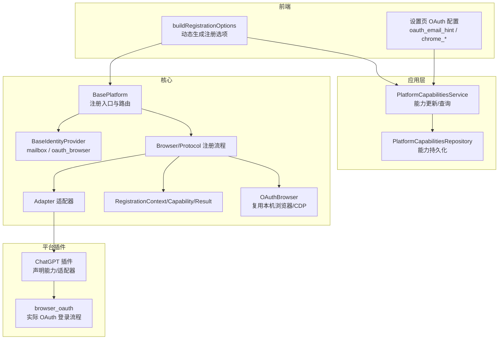
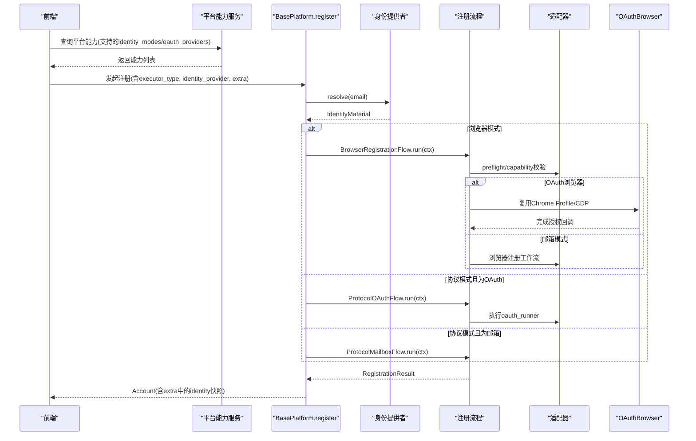
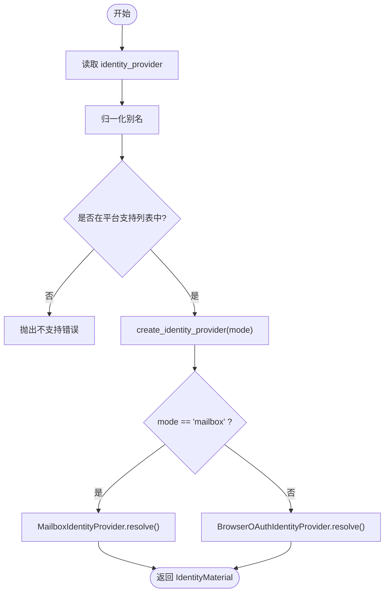
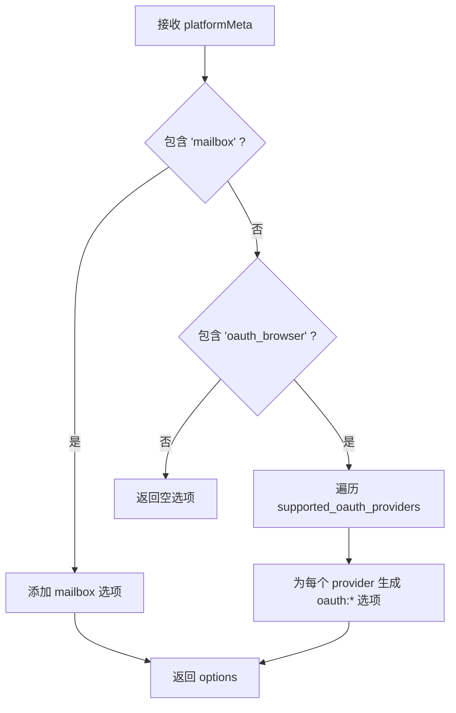
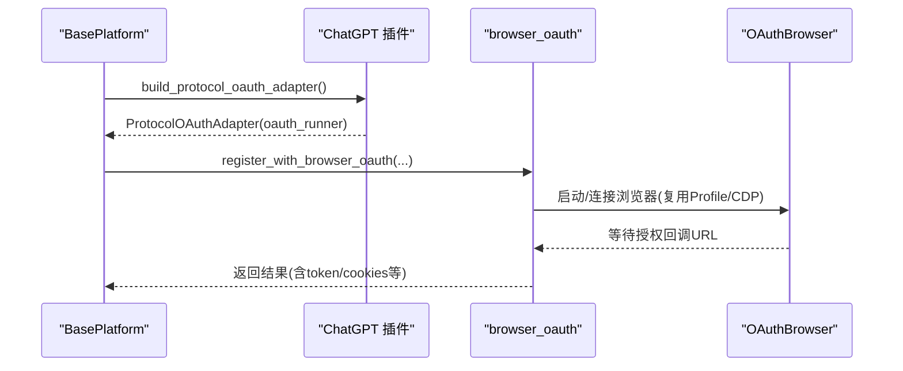
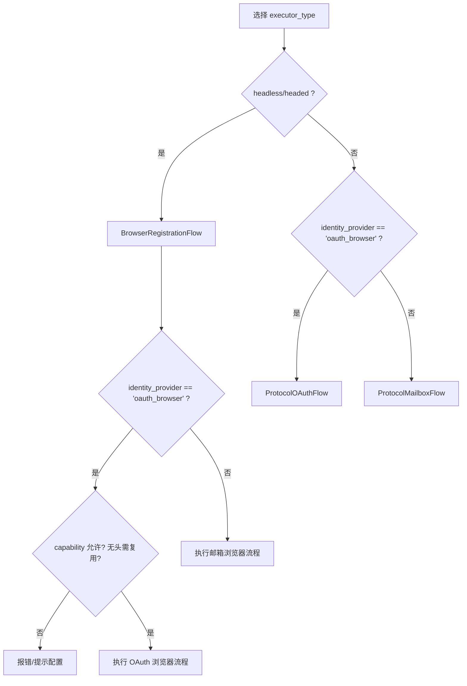
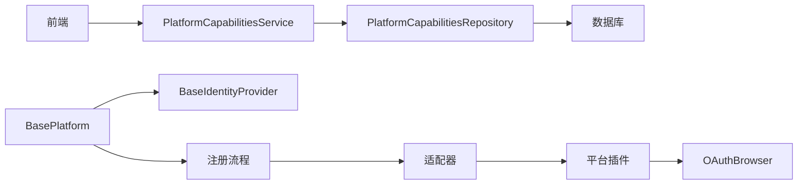

# 注册身份配置

<cite>
**本文引用的文件**
- [core/base_identity.py](file://core/base_identity.py)
- [core/base_platform.py](file://core/base_platform.py)
- [core/registration/models.py](file://core/registration/models.py)
- [core/registration/adapters.py](file://core/registration/adapters.py)
- [core/registration/flows.py](file://core/registration/flows.py)
- [core/oauth_browser.py](file://core/oauth_browser.py)
- [platforms/chatgpt/plugin.py](file://platforms/chatgpt/plugin.py)
- [platforms/chatgpt/browser_oauth.py](file://platforms/chatgpt/browser_oauth.py)
- [frontend/src/lib/registration.ts](file://frontend/src/lib/registration.ts)
- [frontend/src/pages/Register.tsx](file://frontend/src/pages/Register.tsx)
- [frontend/src/components/settings/AdvancedSettings.tsx](file://frontend/src/components/settings/AdvancedSettings.tsx)
- [application/platform_capabilities.py](file://application/platform_capabilities.py)
- [infrastructure/platform_caps_repository.py](file://infrastructure/platform_caps_repository.py)
- [domain/platform_caps.py](file://domain/platform_caps.py)
</cite>

## 目录
1. [简介](#简介)
2. [项目结构](#项目结构)
3. [核心组件](#核心组件)
4. [架构总览](#架构总览)
5. [详细组件分析](#详细组件分析)
6. [依赖关系分析](#依赖关系分析)
7. [性能与可用性考虑](#性能与可用性考虑)
8. [故障排查指南](#故障排查指南)
9. [结论](#结论)
10. [附录：扩展点与最佳实践](#附录：扩展点与最佳实践)

## 简介
本文件系统性说明“注册身份配置”的实现机制，覆盖两种主要模式：邮箱验证（mailbox）与 OAuth 浏览器登录（oauth_browser）。重点解释：
- 注册选项的动态生成：通过前端 buildRegistrationOptions 根据平台能力构建可用方案。
- 身份提供商选择逻辑：在 mailbox 与 oauth_browser 之间切换，并支持多 OAuth 提供商。
- OAuth 相关配置项：oauth_email_hint、chrome_user_data_dir、chrome_cdp_url 的作用与使用场景。
- 智能推荐机制：根据当前执行器类型与环境自动选择最优通道。
- 自定义扩展点：如何新增新的身份验证方式或接入新平台。

## 项目结构
围绕注册身份配置的关键代码分布在以下层次：
- 领域模型与能力：定义注册上下文、能力声明与结果结构。
- 身份提供者抽象：统一封装 mailbox 与 oauth_browser 两种模式。
- 平台基类与流程编排：根据执行器类型与身份模式选择具体注册流程。
- 平台插件实现：以 ChatGPT 为例展示 OAuth 浏览器登录的落地。
- 前端交互：动态生成注册选项，并在设置页暴露 OAuth 相关配置。
- 能力管理与持久化：平台能力可被覆盖与重置，影响前端展示与后端校验。

图表来源
- [frontend/src/lib/registration.ts:34-71](file://frontend/src/lib/registration.ts#L34-L71)
- [application/platform_capabilities.py:7-24](file://application/platform_capabilities.py#L7-L24)
- [infrastructure/platform_caps_repository.py:12-53](file://infrastructure/platform_caps_repository.py#L12-L53)
- [core/base_platform.py:44-160](file://core/base_platform.py#L44-L160)
- [core/base_identity.py:64-130](file://core/base_identity.py#L64-L130)
- [core/registration/flows.py:18-141](file://core/registration/flows.py#L18-L141)
- [core/registration/adapters.py:27-59](file://core/registration/adapters.py#L27-L59)
- [core/registration/models.py:7-66](file://core/registration/models.py#L7-L66)
- [core/oauth_browser.py:192-212](file://core/oauth_browser.py#L192-L212)
- [platforms/chatgpt/plugin.py:48-183](file://platforms/chatgpt/plugin.py#L48-L183)
- [platforms/chatgpt/browser_oauth.py:44-83](file://platforms/chatgpt/browser_oauth.py#L44-L83)

章节来源
- [frontend/src/lib/registration.ts:34-71](file://frontend/src/lib/registration.ts#L34-L71)
- [application/platform_capabilities.py:7-24](file://application/platform_capabilities.py#L7-L24)
- [infrastructure/platform_caps_repository.py:12-53](file://infrastructure/platform_caps_repository.py#L12-L53)
- [core/base_platform.py:44-160](file://core/base_platform.py#L44-L160)
- [core/base_identity.py:64-130](file://core/base_identity.py#L64-L130)
- [core/registration/flows.py:18-141](file://core/registration/flows.py#L18-L141)
- [core/registration/adapters.py:27-59](file://core/registration/adapters.py#L27-L59)
- [core/registration/models.py:7-66](file://core/registration/models.py#L7-L66)
- [core/oauth_browser.py:192-212](file://core/oauth_browser.py#L192-L212)
- [platforms/chatgpt/plugin.py:48-183](file://platforms/chatgpt/plugin.py#L48-L183)
- [platforms/chatgpt/browser_oauth.py:44-83](file://platforms/chatgpt/browser_oauth.py#L44-L83)

## 核心组件
- 身份提供者抽象
  - MailboxIdentityProvider：负责从 mailbox provider 获取邮箱或接受传入邮箱，并记录 before_ids 用于后续清理。
  - BrowserOAuthIdentityProvider：负责解析 OAuth 提供商别名、提取 email_hint、chrome_user_data_dir、chrome_cdp_url 等配置。
  - create_identity_provider：根据 identity_provider 模式创建对应实例，支持别名归一化。
- 平台基类 BasePlatform
  - register：统一入口，依据 executor_type 与 identity_provider 选择浏览器注册、协议邮箱注册或协议 OAuth 注册。
  - _should_require_identity_email：非 oauth_browser 模式要求邮箱。
  - _get_identity_provider/_resolve_identity：按平台能力限制选择身份提供者并解析身份。
- 注册流程与适配器
  - BrowserRegistrationFlow/ProtocolOAuthFlow：编排预检查、能力校验、执行器限制、浏览器复用策略与结果映射。
  - Adapter：将平台具体实现与通用流程解耦，提供 result_mapper、capability、otp_spec 等元信息。
- 能力与上下文
  - RegistrationCapability：声明是否允许特定执行器运行 OAuth、无头模式下是否需要浏览器复用等。
  - RegistrationContext：携带平台、身份、配置、日志回调等上下文。
  - RegistrationResult/Artifacts：承载注册产物与回调钩子。

章节来源
- [core/base_identity.py:64-130](file://core/base_identity.py#L64-L130)
- [core/base_platform.py:87-160](file://core/base_platform.py#L87-L160)
- [core/registration/flows.py:18-141](file://core/registration/flows.py#L18-L141)
- [core/registration/adapters.py:27-59](file://core/registration/adapters.py#L27-L59)
- [core/registration/models.py:7-66](file://core/registration/models.py#L7-L66)

## 架构总览
下图展示了从前端到后端的完整调用链：前端根据平台能力动态生成注册选项；用户选择后，平台基类根据执行器类型与身份模式路由到相应流程；OAuth 浏览器登录通过 OAuthBrowser 复用本机已登录会话或连接 CDP。

图表来源
- [frontend/src/lib/registration.ts:34-71](file://frontend/src/lib/registration.ts#L34-L71)
- [core/base_platform.py:124-160](file://core/base_platform.py#L124-L160)
- [core/base_identity.py:100-130](file://core/base_identity.py#L100-L130)
- [core/registration/flows.py:18-141](file://core/registration/flows.py#L18-L141)
- [core/oauth_browser.py:192-212](file://core/oauth_browser.py#L192-L212)

## 详细组件分析

### 身份提供者与模式切换
- 模式归一化与别名
  - identity_provider 支持多种别名（如 email/mail 归一到 mailbox；oauth/manual_oauth 归一到 oauth_browser）。
  - oauth_provider 支持 Google/GitHub/Microsoft/Apple/X/BuilderID 等别名归一化。
- 两种模式
  - mailbox：优先使用 mailbox provider 提供的邮箱；若未配置则回退到传入 email。
  - oauth_browser：从 extra 中读取 oauth_email_hint、oauth_provider/default_oauth_provider、chrome_user_data_dir、chrome_cdp_url，构造 IdentityMaterial。
- 选择逻辑
  - BasePlatform._get_identity_provider_name 读取配置中的 identity_provider，并按平台 supported_identity_modes 校验。
  - 非 oauth_browser 模式强制要求邮箱；oauth_browser 模式不强制邮箱但会携带 email_hint。

图表来源
- [core/base_identity.py:7-45](file://core/base_identity.py#L7-L45)
- [core/base_identity.py:76-130](file://core/base_identity.py#L76-L130)
- [core/base_platform.py:432-459](file://core/base_platform.py#L432-L459)

章节来源
- [core/base_identity.py:7-45](file://core/base_identity.py#L7-L45)
- [core/base_identity.py:76-130](file://core/base_identity.py#L76-L130)
- [core/base_platform.py:432-459](file://core/base_platform.py#L432-L459)

### 注册选项的动态生成（前端）
- buildRegistrationOptions 根据 platformMeta 的能力数组生成可选方案：
  - 若包含 mailbox，则生成“邮箱验证码”选项。
  - 若包含 oauth_browser，则遍历 supported_oauth_providers，为每个第三方账号生成一个选项。
- 这些选项携带 identityProvider 与 oauthProvider，供前端渲染与提交。

图表来源
- [frontend/src/lib/registration.ts:34-71](file://frontend/src/lib/registration.ts#L34-L71)

章节来源
- [frontend/src/lib/registration.ts:34-71](file://frontend/src/lib/registration.ts#L34-L71)

### OAuth 浏览器登录流程（以 ChatGPT 为例）
- 平台插件声明能力与适配器：
  - 声明 supported_identity_modes 包含 mailbox 与 oauth_browser，supported_oauth_providers 包含 google/microsoft。
  - 构建 BrowserRegistrationAdapter 与 ProtocolOAuthAdapter，指定 capability（如无头模式需要浏览器复用）。
- 运行时流程：
  - BasePlatform.register 根据 executor_type 与 identity_provider 选择流程。
  - 当为 oauth_browser 时，调用 Platform 的 _run_protocol_oauth，最终进入 browser_oauth 模块。
  - OAuthBrowser 尝试复用本机 Chrome Profile 或通过 CDP 连接已运行的 Chrome，完成授权回调。

图表来源
- [platforms/chatgpt/plugin.py:146-183](file://platforms/chatgpt/plugin.py#L146-L183)
- [platforms/chatgpt/browser_oauth.py:44-83](file://platforms/chatgpt/browser_oauth.py#L44-L83)
- [core/oauth_browser.py:192-212](file://core/oauth_browser.py#L192-L212)

章节来源
- [platforms/chatgpt/plugin.py:48-183](file://platforms/chatgpt/plugin.py#L48-L183)
- [platforms/chatgpt/browser_oauth.py:44-83](file://platforms/chatgpt/browser_oauth.py#L44-L83)
- [core/oauth_browser.py:192-212](file://core/oauth_browser.py#L192-L212)

### 智能推荐机制（执行器与通道选择）
- 执行器类型决定通道：
  - headless/headed：走浏览器注册流程；若 identity_provider 为 oauth_browser，则需满足 capability 的执行器限制与浏览器复用要求。
  - protocol：默认走协议邮箱注册；若 identity_provider 为 oauth_browser，则走协议 OAuth 流程。
- 能力约束：
  - RegistrationCapability.oauth_allowed_executor_types：限制哪些执行器可运行 OAuth。
  - oauth_headless_requires_browser_reuse：无头模式下必须配置 chrome_user_data_dir 或 chrome_cdp_url。
- 前端提示：
  - 当选择 oauth_browser 但未配置浏览器复用时，界面给出警告提示，引导用户配置。

图表来源
- [core/base_platform.py:124-160](file://core/base_platform.py#L124-L160)
- [core/registration/flows.py:18-141](file://core/registration/flows.py#L18-L141)
- [core/registration/models.py:7-15](file://core/registration/models.py#L7-L15)
- [frontend/src/pages/Register.tsx:440-451](file://frontend/src/pages/Register.tsx#L440-L451)

章节来源
- [core/base_platform.py:124-160](file://core/base_platform.py#L124-L160)
- [core/registration/flows.py:18-141](file://core/registration/flows.py#L18-L141)
- [core/registration/models.py:7-15](file://core/registration/models.py#L7-L15)
- [frontend/src/pages/Register.tsx:440-451](file://frontend/src/pages/Register.tsx#L440-L451)

### OAuth 相关配置项说明
- oauth_email_hint
  - 作用：在 OAuth 浏览器登录时提示预期登录邮箱，便于用户确认最终账号。
  - 来源：BrowserOAuthIdentityProvider 从 extra 中读取，并写入 IdentityMaterial.metadata。
  - 前端：设置页与注册页均提供输入框。
- chrome_user_data_dir
  - 作用：指向本机 Chrome Profile 路径，使系统能复用已登录会话。
  - 行为：OAuthBrowser 尝试使用该路径重启/连接 Chrome。
- chrome_cdp_url
  - 作用：通过 CDP 连接已运行的 Chrome 实例，避免重复启动。
  - 行为：若检测到本地调试端口，自动连接；否则回退到 Playwright Chromium。

章节来源
- [core/base_identity.py:100-117](file://core/base_identity.py#L100-L117)
- [core/oauth_browser.py:192-212](file://core/oauth_browser.py#L192-L212)
- [frontend/src/pages/Register.tsx:440-451](file://frontend/src/pages/Register.tsx#L440-L451)
- [frontend/src/components/settings/AdvancedSettings.tsx:169-202](file://frontend/src/components/settings/AdvancedSettings.tsx#L169-L202)

### 平台能力与动态配置
- 能力数据源
  - 平台插件声明 supported_executors/supported_identity_modes/supported_oauth_providers。
  - 应用层通过 PlatformCapabilitiesService 与 Repository 进行更新与持久化。
- 前端展示
  - 设置页可编辑各平台的身份模式与 OAuth 提供商开关。
  - 注册页根据能力数组动态生成注册选项。
- 能力覆盖
  - 支持对某平台的能力进行覆盖或重置，影响前后端行为。

章节来源
- [platforms/chatgpt/plugin.py:48-56](file://platforms/chatgpt/plugin.py#L48-L56)
- [application/platform_capabilities.py:7-24](file://application/platform_capabilities.py#L7-L24)
- [infrastructure/platform_caps_repository.py:12-53](file://infrastructure/platform_caps_repository.py#L12-L53)
- [domain/platform_caps.py:6-11](file://domain/platform_caps.py#L6-L11)
- [frontend/src/components/settings/AdvancedSettings.tsx:71-113](file://frontend/src/components/settings/AdvancedSettings.tsx#L71-L113)

## 依赖关系分析
- 低耦合设计
  - BasePlatform 仅依赖抽象的身份提供者与注册流程，具体实现由平台插件注入。
  - 适配器将平台细节与通用流程解耦，便于扩展与维护。
- 关键依赖链
  - 前端 -> 平台能力服务 -> 仓库 -> 数据库
  - 平台基类 -> 身份提供者 -> 注册流程 -> 适配器 -> 平台插件 -> OAuth 浏览器
- 潜在循环依赖
  - 通过延迟导入（如 from ... import ...）避免启动时强耦合。

图表来源
- [application/platform_capabilities.py:7-24](file://application/platform_capabilities.py#L7-L24)
- [infrastructure/platform_caps_repository.py:12-53](file://infrastructure/platform_caps_repository.py#L12-L53)
- [core/base_platform.py:44-160](file://core/base_platform.py#L44-L160)
- [core/base_identity.py:64-130](file://core/base_identity.py#L64-L130)
- [core/registration/flows.py:18-141](file://core/registration/flows.py#L18-L141)
- [core/registration/adapters.py:27-59](file://core/registration/adapters.py#L27-L59)
- [platforms/chatgpt/plugin.py:48-183](file://platforms/chatgpt/plugin.py#L48-L183)
- [core/oauth_browser.py:192-212](file://core/oauth_browser.py#L192-L212)

章节来源
- [application/platform_capabilities.py:7-24](file://application/platform_capabilities.py#L7-L24)
- [infrastructure/platform_caps_repository.py:12-53](file://infrastructure/platform_caps_repository.py#L12-L53)
- [core/base_platform.py:44-160](file://core/base_platform.py#L44-L160)
- [core/base_identity.py:64-130](file://core/base_identity.py#L64-L130)
- [core/registration/flows.py:18-141](file://core/registration/flows.py#L18-L141)
- [core/registration/adapters.py:27-59](file://core/registration/adapters.py#L27-L59)
- [platforms/chatgpt/plugin.py:48-183](file://platforms/chatgpt/plugin.py#L48-L183)
- [core/oauth_browser.py:192-212](file://core/oauth_browser.py#L192-L212)

## 性能与可用性考虑
- 浏览器复用
  - 通过 chrome_user_data_dir 或 chrome_cdp_url 复用本机已登录会话，减少二次登录耗时与失败率。
  - 无头模式下若未配置复用，应提示用户改用可视化浏览器或补充配置。
- 执行器选择
  - 合理选择 executor_type：headed 适合需要人工交互的场景；headless 适合自动化批量注册。
- 验证码与代理
  - 验证码 provider 的选择与重试策略影响成功率；代理池与地区选择影响访问稳定性。
- 超时与容错
  - OAuth 流程具备超时控制；失败时记录错误并提示下一步操作。

[本节为通用指导，不直接分析具体文件]

## 故障排查指南
- 常见错误与定位
  - 未知 identity_provider：检查配置值是否落入支持列表，或是否存在拼写问题。
  - 未实现浏览器注册适配器：平台插件需实现 build_browser_registration_adapter。
  - 未实现协议邮箱注册适配器：平台插件需实现 build_protocol_mailbox_adapter。
  - 无头 OAuth 需要浏览器复用：确保配置 chrome_user_data_dir 或 chrome_cdp_url。
  - 邮箱不一致：传入 email 与 mailbox provider 返回不一致时会抛错。
- 建议排查步骤
  - 查看平台能力是否包含所需 identity_mode 与 oauth_provider。
  - 检查前端生成的注册选项是否符合预期。
  - 核对 OAuth 浏览器是否成功连接本机 Chrome（CDP/Profile）。
  - 关注日志中的 provider 选择与重试信息。

章节来源
- [core/base_identity.py:124-130](file://core/base_identity.py#L124-L130)
- [core/base_platform.py:124-160](file://core/base_platform.py#L124-L160)
- [core/base_platform.py:432-459](file://core/base_platform.py#L432-L459)
- [core/registration/flows.py:18-141](file://core/registration/flows.py#L18-L141)
- [core/oauth_browser.py:192-212](file://core/oauth_browser.py#L192-L212)

## 结论
注册身份配置通过“能力声明 + 适配器 + 流程编排”的方式，实现了灵活的邮箱验证与 OAuth 浏览器登录两种模式。前端基于平台能力动态生成选项，后端根据执行器类型与环境智能选择通道。OAuth 浏览器登录借助 Chrome Profile 或 CDP 复用会话，提升成功率与用户体验。系统提供了清晰的扩展点，便于接入新的身份验证方式与平台。

[本节为总结性内容，不直接分析具体文件]

## 附录：扩展点与最佳实践
- 新增身份验证方式
  - 在 base_identity 中扩展 identity_provider 别名与 normalize 逻辑。
  - 实现新的 IdentityProvider 子类，并在 create_identity_provider 中注册。
  - 在平台插件中声明 supported_identity_modes 并实现对应适配器。
- 接入新平台
  - 实现平台插件，声明能力与适配器，编写 _run_protocol_oauth 或浏览器注册工作流。
  - 在前端设置页维护能力开关，确保用户可见与可控。
- 最佳实践
  - 始终在平台能力中明确支持的 identity_mode 与 oauth_provider。
  - 在无头模式下务必配置浏览器复用参数，避免不可用。
  - 对用户可见的错误信息进行友好提示，并提供下一步指引。

[本节为通用指导，不直接分析具体文件]