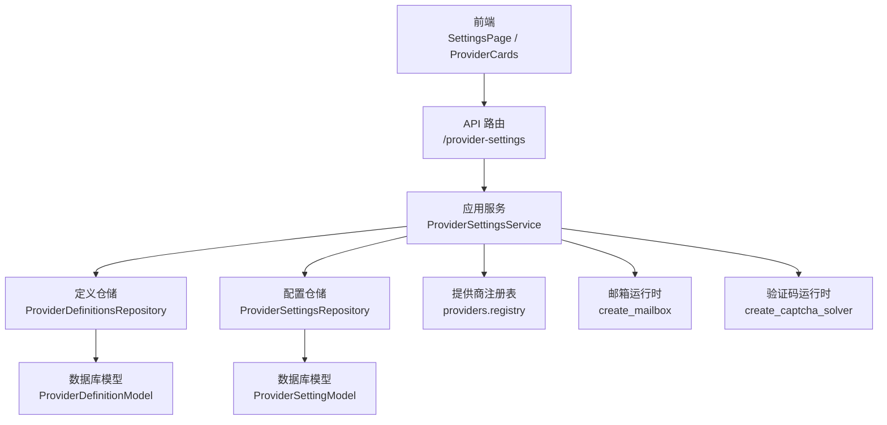
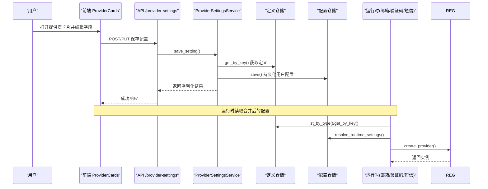
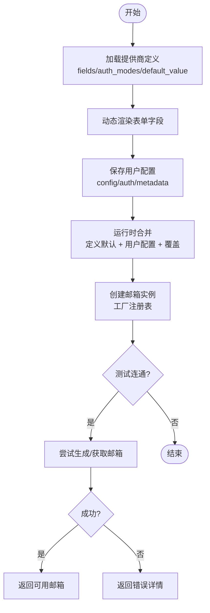
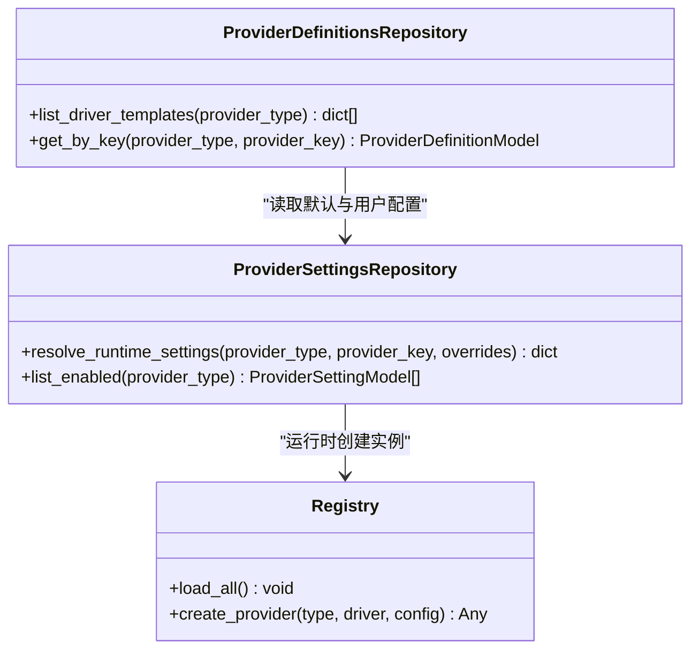
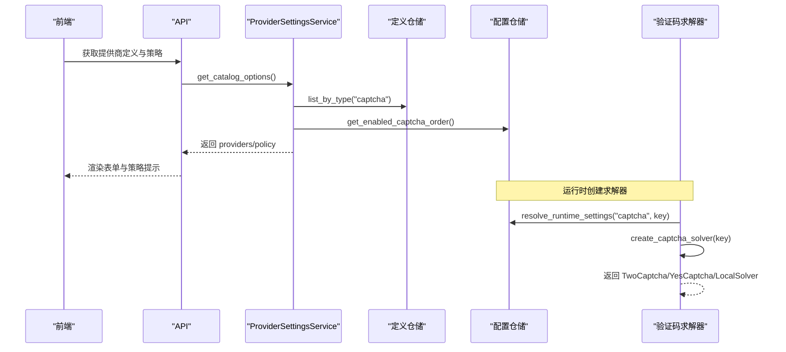
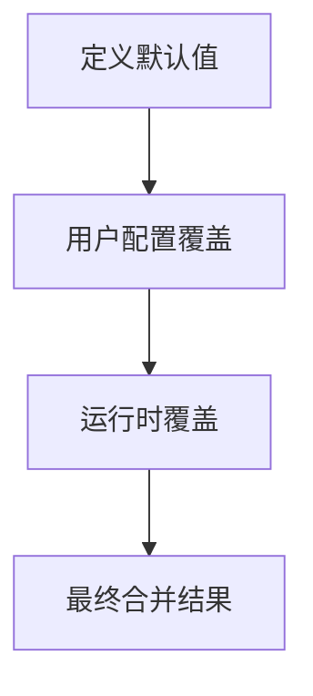
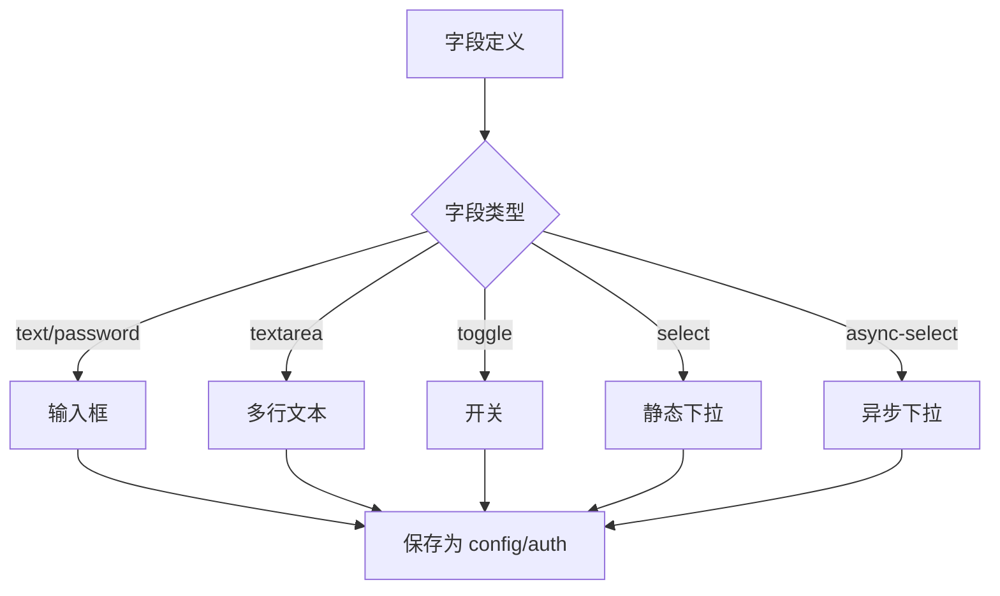
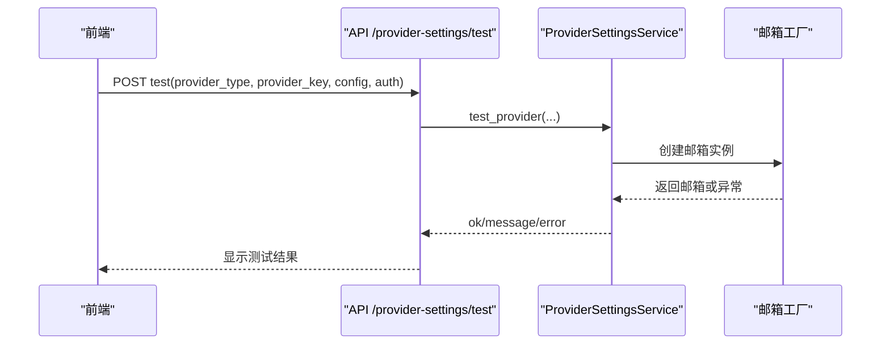
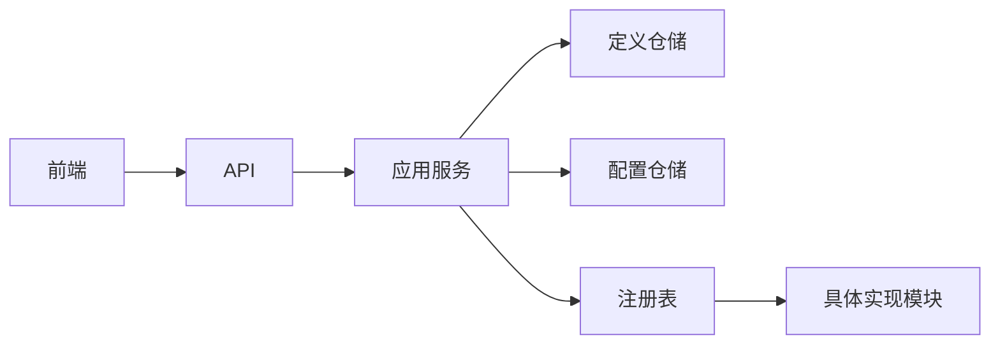

# 第三方服务配置

<cite>
**本文引用的文件**
- [api/provider_settings.py](file://api/provider_settings.py)
- [application/provider_settings.py](file://application/provider_settings.py)
- [infrastructure/provider_settings_repository.py](file://infrastructure/provider_settings_repository.py)
- [infrastructure/provider_definitions_repository.py](file://infrastructure/provider_definitions_repository.py)
- [providers/registry.py](file://providers/registry.py)
- [frontend/src/pages/SettingsPage.tsx](file://frontend/src/pages/SettingsPage.tsx)
- [frontend/src/components/settings/ProviderCards.tsx](file://frontend/src/components/settings/ProviderCards.tsx)
- [frontend/src/lib/config-options.ts](file://frontend/src/lib/config-options.ts)
- [core/base_mailbox.py](file://core/base_mailbox.py)
- [core/base_captcha.py](file://core/base_captcha.py)
- [providers/captcha/twocaptcha.py](file://providers/captcha/twocaptcha.py)
- [providers/sms/sms_activate.py](file://providers/sms/sms_activate.py)
- [providers/sms/herosms.py](file://providers/sms/herosms.py)
</cite>

## 目录
1. [简介](#简介)
2. [项目结构](#项目结构)
3. [核心组件](#核心组件)
4. [架构总览](#架构总览)
5. [详细组件分析](#详细组件分析)
6. [依赖关系分析](#依赖关系分析)
7. [性能考虑](#性能考虑)
8. [故障排查指南](#故障排查指南)
9. [结论](#结论)
10. [附录](#附录)

## 简介
本文件面向“第三方服务配置管理界面”，系统性说明邮箱、短信、验证码三类提供商的配置方式与前端交互流程，重点覆盖：
- 邮箱服务提供商（临时邮箱）的 API 密钥与连接参数配置
- 短信接码服务（SMS Activate、Herosms 等）的认证信息设置
- 验证码解决服务（2Captcha、Capsolver/YesCaptcha 等）的技术参数配置
- 提供商设置的合并机制（默认定义 + 用户配置）
- 提供商字段的动态渲染（按定义自动生成表单）
- 提供商配置的验证机制（在线测试与运行时校验）

## 项目结构
围绕“第三方服务配置”的关键路径包括：
- 前端页面与卡片组件：提供分类展示、编辑弹窗、异步字段加载、在线测试
- 后端 API 与服务层：提供配置列表、保存、删除、在线测试、策略聚合
- 基础设施仓储：持久化 provider 定义与用户配置，负责合并与排序
- 运行时驱动注册：将具体实现类注册到统一工厂，供运行时创建实例

**图表来源**
- [api/provider_settings.py:25-81](file://api/provider_settings.py#L25-L81)
- [application/provider_settings.py:12-52](file://application/provider_settings.py#L12-L52)
- [infrastructure/provider_definitions_repository.py:387-474](file://infrastructure/provider_definitions_repository.py#L387-L474)
- [infrastructure/provider_settings_repository.py:39-83](file://infrastructure/provider_settings_repository.py#L39-L83)
- [providers/registry.py:28-90](file://providers/registry.py#L28-L90)
- [core/base_mailbox.py:289-347](file://core/base_mailbox.py#L289-L347)
- [core/base_captcha.py:67-97](file://core/base_captcha.py#L67-L97)

**章节来源**
- [frontend/src/pages/SettingsPage.tsx:360-400](file://frontend/src/pages/SettingsPage.tsx#L360-L400)
- [frontend/src/components/settings/ProviderCards.tsx:350-572](file://frontend/src/components/settings/ProviderCards.tsx#L350-L572)
- [api/provider_settings.py:25-81](file://api/provider_settings.py#L25-L81)
- [application/provider_settings.py:12-52](file://application/provider_settings.py#L12-L52)

## 核心组件
- 提供商定义仓储：维护内置与自定义的“元数据模板”，包含字段定义、认证模式、默认值、分类等。启动时会将内置种子同步至数据库，保证升级后字段定义生效。
- 提供商配置仓储：存储用户的启用/禁用、是否默认、config/auth/metadata 等；提供运行时合并能力（定义默认值 + 用户配置 + 覆盖项）。
- 应用服务：聚合定义与配置，序列化返回给前端，并提供策略（如验证码协议顺序、浏览器默认选择）。
- 前端 ProviderCards：按分类展示提供商，支持开关启用、设为默认、编辑字段、在线测试；根据字段类型动态渲染输入控件。
- 运行时工厂：通过注册表创建具体实现（邮箱、验证码、短信），读取合并后的配置并调用外部服务。

**章节来源**
- [infrastructure/provider_definitions_repository.py:387-474](file://infrastructure/provider_definitions_repository.py#L387-L474)
- [infrastructure/provider_settings_repository.py:39-83](file://infrastructure/provider_settings_repository.py#L39-L83)
- [application/provider_settings.py:12-52](file://application/provider_settings.py#L12-L52)
- [frontend/src/components/settings/ProviderCards.tsx:122-337](file://frontend/src/components/settings/ProviderCards.tsx#L122-L337)
- [providers/registry.py:28-90](file://providers/registry.py#L28-L90)

## 架构总览
下图展示了从前端到运行时的完整链路：用户在“设置页”的“邮箱/验证码/接码”子标签中编辑提供商配置，保存后由后端写入数据库；运行时通过仓储合并默认与用户配置，再经注册表创建具体实例以执行任务。

**图表来源**
- [api/provider_settings.py:30-43](file://api/provider_settings.py#L30-L43)
- [application/provider_settings.py:16-32](file://application/provider_settings.py#L16-L32)
- [infrastructure/provider_settings_repository.py:109-166](file://infrastructure/provider_settings_repository.py#L109-L166)
- [infrastructure/provider_definitions_repository.py:437-474](file://infrastructure/provider_definitions_repository.py#L437-L474)
- [providers/registry.py:51-62](file://providers/registry.py#L51-L62)

## 详细组件分析

### 邮箱服务提供商配置（临时邮箱）
- 支持的提供商类别与示例：
  - 免费/开箱即用：TempMail.lol、Temp-Mail.org
  - 自建服务：CF Worker、MoeMail、FreeMail、DuckMail
  - 第三方服务：Testmail、Laoudo、DuckDuckGo Email Protection
  - 本地微软邮箱池、通用 HTTP 邮箱（高级）
- 关键字段与用途：
  - 连接参数：API 地址、域名、Base URL、Graph Scope、代理等
  - 认证参数：Token、Bearer、账号密码、Session Token、API Key
  - 身份参数：Namespace、Tag 前缀、固定邮箱地址、Account ID
- 前端行为：
  - 根据字段定义自动渲染文本框、密码框、切换开关、多行文本、异步下拉（国家/服务）
  - 支持“测试连接”，对邮箱类提供商尝试生成或拉取邮箱进行连通性验证
- 后端行为：
  - 保存时将 config 与 auth 分别落库；运行时合并定义默认值与用户配置
  - 在线测试接口会调用邮箱工厂创建实例并尝试 peek_email/get_email

**图表来源**
- [infrastructure/provider_definitions_repository.py:17-238](file://infrastructure/provider_definitions_repository.py#L17-L238)
- [frontend/src/components/settings/ProviderCards.tsx:122-337](file://frontend/src/components/settings/ProviderCards.tsx#L122-L337)
- [api/provider_settings.py:61-119](file://api/provider_settings.py#L61-L119)
- [core/base_mailbox.py:289-347](file://core/base_mailbox.py#L289-L347)

**章节来源**
- [infrastructure/provider_definitions_repository.py:17-238](file://infrastructure/provider_definitions_repository.py#L17-L238)
- [frontend/src/components/settings/ProviderCards.tsx:122-337](file://frontend/src/components/settings/ProviderCards.tsx#L122-L337)
- [api/provider_settings.py:61-119](file://api/provider_settings.py#L61-L119)
- [core/base_mailbox.py:289-347](file://core/base_mailbox.py#L289-L347)

### 短信接码服务配置（SMS Activate、Herosms、SMSBower）
- 认证信息：
  - SMS Activate：API Key、默认国家代码
  - Herosms：API Key、默认国家、默认服务、最大价格、自动选国策略、号码复用上限等
  - SMSBower：API Key、默认国家、默认服务、最大价格、自动选国策略、号码复用上限等
- 前端行为：
  - 使用异步下拉加载国家/服务选项，支持搜索与多选映射
  - 支持开关式配置（如自动选国、复用至最大）
- 后端行为：
  - 提供商定义中声明字段与默认认证模式
  - 运行时通过注册表创建对应短信提供商实例

**图表来源**
- [infrastructure/provider_definitions_repository.py:452-474](file://infrastructure/provider_definitions_repository.py#L452-L474)
- [infrastructure/provider_settings_repository.py:39-83](file://infrastructure/provider_settings_repository.py#L39-L83)
- [providers/registry.py:51-62](file://providers/registry.py#L51-L62)
- [providers/sms/sms_activate.py:1-11](file://providers/sms/sms_activate.py#L1-L11)
- [providers/sms/herosms.py:1-19](file://providers/sms/herosms.py#L1-L19)

**章节来源**
- [infrastructure/provider_definitions_repository.py:294-351](file://infrastructure/provider_definitions_repository.py#L294-L351)
- [providers/sms/sms_activate.py:1-11](file://providers/sms/sms_activate.py#L1-L11)
- [providers/sms/herosms.py:1-19](file://providers/sms/herosms.py#L1-L19)
- [frontend/src/components/settings/ProviderCards.tsx:144-174](file://frontend/src/components/settings/ProviderCards.tsx#L144-L174)

### 验证码解决服务配置（2Captcha、YesCaptcha/Capsolver、本地求解器）
- 技术要点：
  - 2Captcha：需要 API Key，支持 Turnstile 解算
  - YesCaptcha/Capsolver：Client Key，Turnstile 解算
  - 本地求解器：Solver 地址，用于本地浏览器环境解验证码
- 前端行为：
  - 在“验证服务”标签下展示已启用的提供商，可设默认、测试（当前仅邮箱类支持在线测试）
  - 显示验证码策略提示（协议模式顺序、浏览器默认）
- 后端行为：
  - 定义仓储提供字段与默认认证模式
  - 运行时根据 provider_key 与 driver_type 创建具体求解器实例，缺失关键参数时报错

**图表来源**
- [application/provider_settings.py:37-52](file://application/provider_settings.py#L37-L52)
- [infrastructure/provider_definitions_repository.py:239-293](file://infrastructure/provider_definitions_repository.py#L239-L293)
- [core/base_captcha.py:67-97](file://core/base_captcha.py#L67-L97)
- [providers/captcha/twocaptcha.py:6-64](file://providers/captcha/twocaptcha.py#L6-L64)

**章节来源**
- [infrastructure/provider_definitions_repository.py:239-293](file://infrastructure/provider_definitions_repository.py#L239-L293)
- [core/base_captcha.py:67-97](file://core/base_captcha.py#L67-L97)
- [providers/captcha/twocaptcha.py:6-64](file://providers/captcha/twocaptcha.py#L6-L64)
- [frontend/src/pages/SettingsPage.tsx:370-384](file://frontend/src/pages/SettingsPage.tsx#L370-L384)

### 提供商设置的合并机制
- 合并优先级（从低到高）：
  1) 提供商定义的默认值（fields.default_value）
  2) 用户配置（config 与 auth）
  3) 运行时覆盖（overrides，例如任务级传入）
- 合并过程：
  - 先填充定义中的默认值
  - 用用户配置覆盖同名键
  - 最后叠加运行时覆盖
- 默认排序与选择：
  - 启用列表按“非默认优先、id 升序”排序
  - 验证码策略支持“自动优先启用远程”的顺序

**图表来源**
- [infrastructure/provider_settings_repository.py:39-55](file://infrastructure/provider_settings_repository.py#L39-L55)
- [infrastructure/provider_settings_repository.py:57-83](file://infrastructure/provider_settings_repository.py#L57-L83)

**章节来源**
- [infrastructure/provider_settings_repository.py:39-83](file://infrastructure/provider_settings_repository.py#L39-L83)

### 提供商字段的动态渲染
- 字段类型：
  - 文本、密码（secret）、多行文本、开关（toggle）、静态下拉（select）、异步下拉（async-select）
- 渲染逻辑：
  - 根据字段定义中的 type、category、placeholder、hint、options、asyncUrl 等属性动态生成 UI
  - 异步下拉支持多种响应格式，自动映射 value/label
- 保存逻辑：
  - category=auth 的字段写入 auth，其余写入 config

**图表来源**
- [frontend/src/components/settings/ProviderCards.tsx:144-174](file://frontend/src/components/settings/ProviderCards.tsx#L144-L174)
- [frontend/src/components/settings/ProviderCards.tsx:247-309](file://frontend/src/components/settings/ProviderCards.tsx#L247-L309)
- [frontend/src/lib/config-options.ts:6-42](file://frontend/src/lib/config-options.ts#L6-L42)

**章节来源**
- [frontend/src/components/settings/ProviderCards.tsx:144-174](file://frontend/src/components/settings/ProviderCards.tsx#L144-L174)
- [frontend/src/components/settings/ProviderCards.tsx:247-309](file://frontend/src/components/settings/ProviderCards.tsx#L247-L309)
- [frontend/src/lib/config-options.ts:6-42](file://frontend/src/lib/config-options.ts#L6-L42)

### 提供商配置的验证机制
- 在线测试（邮箱类）：
  - 调用 /provider-settings/test，合并 config+auth，尝试创建或获取邮箱，返回成功消息或错误详情
- 运行时校验：
  - 创建邮箱/验证码实例时检查必要参数（如 API Key），缺失则抛出明确错误
  - 未启用或未注册的 provider 会被拒绝
- 前端反馈：
  - 卡片内直接显示测试结果，支持一键重试

**图表来源**
- [api/provider_settings.py:61-119](file://api/provider_settings.py#L61-L119)
- [core/base_mailbox.py:289-347](file://core/base_mailbox.py#L289-L347)
- [core/base_captcha.py:67-97](file://core/base_captcha.py#L67-L97)

**章节来源**
- [api/provider_settings.py:61-119](file://api/provider_settings.py#L61-L119)
- [core/base_mailbox.py:289-347](file://core/base_mailbox.py#L289-L347)
- [core/base_captcha.py:67-97](file://core/base_captcha.py#L67-L97)

## 依赖关系分析
- 前端依赖：
  - SettingsPage 提供标签导航与标题映射
  - ProviderCards 负责提供商卡片、编辑弹窗、异步字段、在线测试
  - config-options 定义前后端共享的数据类型
- 后端依赖：
  - API 路由暴露 CRUD 与测试接口
  - 应用服务聚合定义与配置，序列化返回
  - 仓储负责持久化与合并
  - 注册表负责运行时实例创建
- 运行时依赖：
  - 邮箱：create_mailbox 根据 provider_key 与 driver_type 创建实例，支持回退链
  - 验证码：create_captcha_solver 根据 driver_type 创建具体求解器

**图表来源**
- [frontend/src/pages/SettingsPage.tsx:360-400](file://frontend/src/pages/SettingsPage.tsx#L360-L400)
- [frontend/src/components/settings/ProviderCards.tsx:350-572](file://frontend/src/components/settings/ProviderCards.tsx#L350-L572)
- [api/provider_settings.py:25-81](file://api/provider_settings.py#L25-L81)
- [application/provider_settings.py:12-52](file://application/provider_settings.py#L12-L52)
- [providers/registry.py:28-90](file://providers/registry.py#L28-L90)

**章节来源**
- [frontend/src/pages/SettingsPage.tsx:360-400](file://frontend/src/pages/SettingsPage.tsx#L360-L400)
- [frontend/src/components/settings/ProviderCards.tsx:350-572](file://frontend/src/components/settings/ProviderCards.tsx#L350-L572)
- [api/provider_settings.py:25-81](file://api/provider_settings.py#L25-L81)
- [application/provider_settings.py:12-52](file://application/provider_settings.py#L12-L52)
- [providers/registry.py:28-90](file://providers/registry.py#L28-L90)

## 性能考虑
- 异步下拉字段：按需加载国家/服务列表，减少首屏负载
- 提供商启用排序：默认项优先，避免频繁切换导致的回退开销
- 在线测试：仅对邮箱类实现真实网络请求，其他类型给出友好提示，降低无效请求
- 运行时合并：仅在创建实例时合并配置，避免重复计算

[本节为通用指导，不直接分析具体文件]

## 故障排查指南
- 常见错误与定位：
  - “未知 provider 或未启用”：检查定义是否存在且 enabled=true
  - “Key 未配置”：确认 auth 字段已填写（如 API Key、Client Key）
  - “未找到邮箱驱动”：driver_type 与注册表不一致
  - “所有邮箱 provider 均创建失败”：检查回退链与网络连通性
- 建议步骤：
  - 使用“测试连接”快速验证邮箱类配置
  - 查看在线测试返回的错误详情（含堆栈片段）
  - 核对字段定义与用户配置是否一致（key、category）
  - 检查运行时日志中的 provider 初始化警告

**章节来源**
- [api/provider_settings.py:61-119](file://api/provider_settings.py#L61-L119)
- [core/base_mailbox.py:289-347](file://core/base_mailbox.py#L289-L347)
- [core/base_captcha.py:67-97](file://core/base_captcha.py#L67-L97)

## 结论
本系统通过“定义 + 配置 + 运行时合并 + 动态渲染 + 在线测试”的闭环，实现了第三方服务的灵活配置与可靠接入。用户可在统一的设置界面完成邮箱、短信、验证码提供商的配置与验证；后端通过仓储与服务层确保配置的正确性与一致性；运行时通过注册表与工厂方法创建具体实例，保障任务执行的稳定性。

[本节为总结，不直接分析具体文件]

## 附录
- 常用提供商字段速查（来自定义）：
  - 邮箱：API 地址、域名、Token/Bearer/账号密码、Namespace、固定邮箱、Graph Scope、代理等
  - 短信：API Key、默认国家/服务、最大价格、自动选国、号码复用上限
  - 验证码：API Key/Client Key、Solver 地址
- 策略与顺序：
  - 验证码策略支持“自动优先启用远程”，并按启用顺序排列
  - 邮箱回退链支持显式指定与已启用列表组合

[本节为补充信息，不直接分析具体文件]