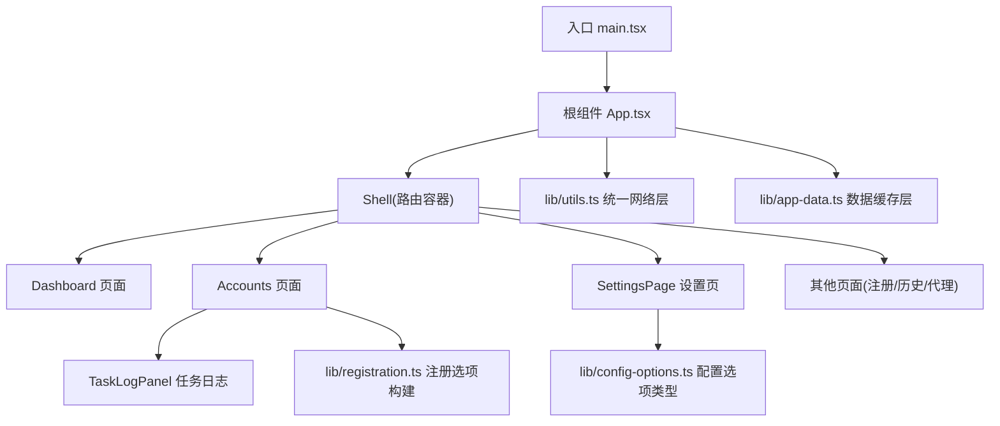
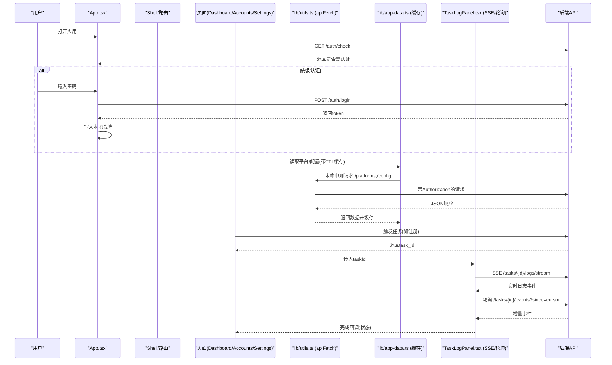
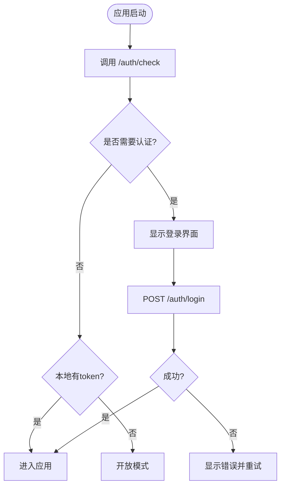
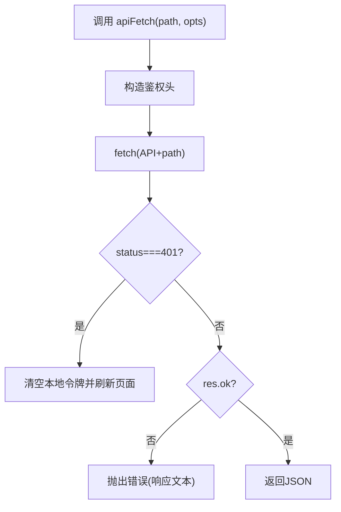
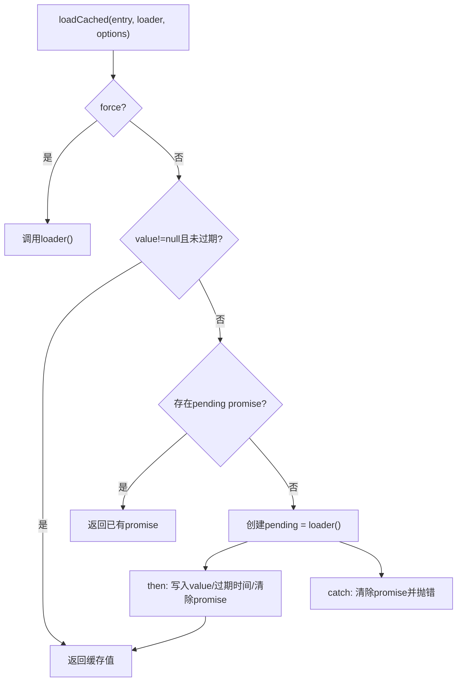
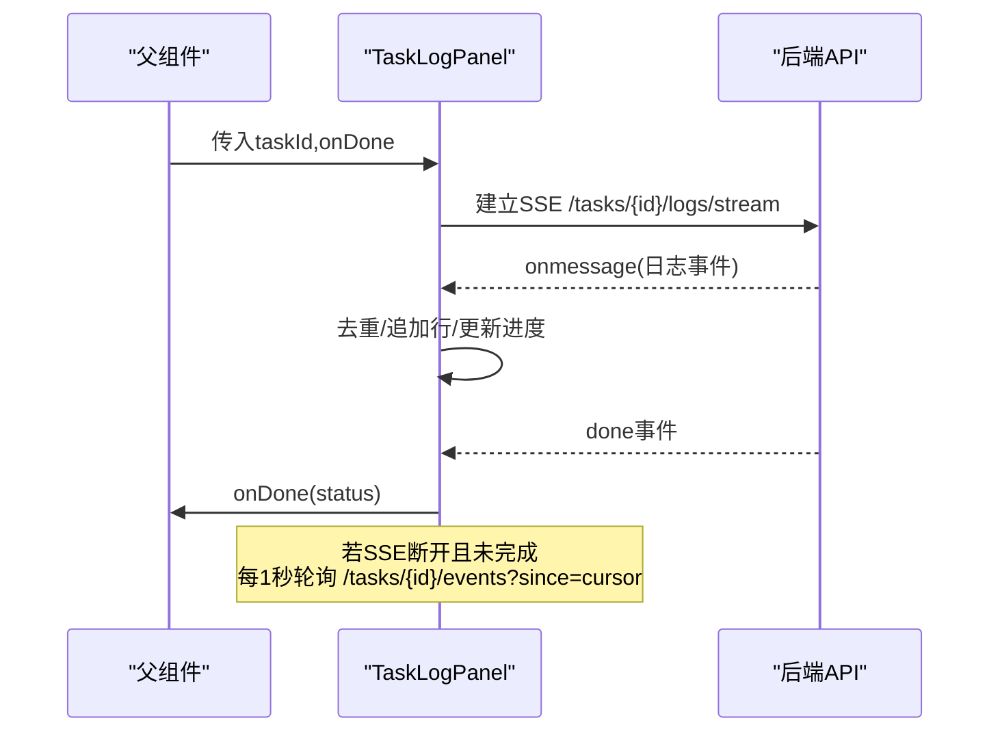
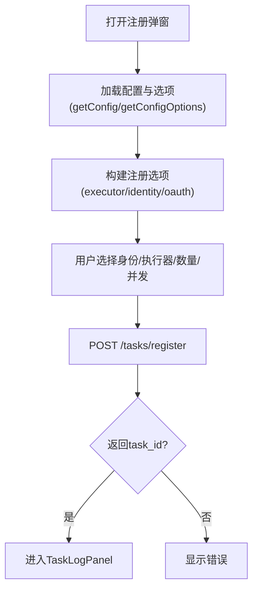
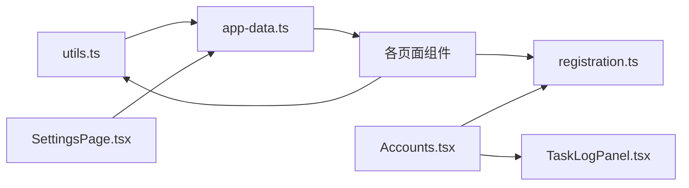

# 状态管理

<cite>
**本文引用的文件**
- [frontend/src/main.tsx](file://frontend/src/main.tsx)
- [frontend/src/App.tsx](file://frontend/src/App.tsx)
- [frontend/src/lib/utils.ts](file://frontend/src/lib/utils.ts)
- [frontend/src/lib/app-data.ts](file://frontend/src/lib/app-data.ts)
- [frontend/src/lib/tasks.ts](file://frontend/src/lib/tasks.ts)
- [frontend/src/lib/registration.ts](file://frontend/src/lib/registration.ts)
- [frontend/src/lib/config-options.ts](file://frontend/src/lib/config-options.ts)
- [frontend/src/pages/Dashboard.tsx](file://frontend/src/pages/Dashboard.tsx)
- [frontend/src/pages/Accounts.tsx](file://frontend/src/pages/Accounts.tsx)
- [frontend/src/pages/SettingsPage.tsx](file://frontend/src/pages/SettingsPage.tsx)
- [frontend/src/components/tasks/TaskLogPanel.tsx](file://frontend/src/components/tasks/TaskLogPanel.tsx)
</cite>

## 目录
1. [简介](#简介)
2. [项目结构](#项目结构)
3. [核心组件](#核心组件)
4. [架构总览](#架构总览)
5. [详细组件分析](#详细组件分析)
6. [依赖关系分析](#依赖关系分析)
7. [性能考虑](#性能考虑)
8. [故障排查指南](#故障排查指南)
9. [结论](#结论)
10. [附录](#附录)

## 简介
本文件围绕前端状态管理的实现与最佳实践，系统梳理该仓库中 React 前端的“应用状态组织、数据流设计、API 交互层、持久化策略、多标签页/实时同步、性能优化与调试方法”。重点说明：
- 全局状态（主题、认证态）、局部状态（页面级表单与列表）与缓存数据（平台、配置等）的分层管理。
- 单向数据流与副作用处理：通过 useEffect 发起请求、更新状态；统一封装的 API 层负责鉴权与错误处理。
- 与后端 API 的交互层：请求封装、响应处理、401 拦截与刷新、下载流处理。
- 状态持久化：localStorage 用于主题、侧边栏折叠、认证令牌等。
- 状态同步：SSE 日志流 + 轮询兜底，保证任务执行过程的多端一致。
- 性能优化：内存缓存（含 TTL）、并发去重、增量事件拉取、虚拟滚动建议等。
- 调试工具与方法：控制台日志、复制日志、错误提示、重试与回退策略。

## 项目结构
前端采用 Vite + React 工程，路由由 react-router-dom 提供，UI 使用 Tailwind + Radix 组件，状态以 React Hooks 为主，配合轻量模块化的 lib 层进行数据获取与缓存。

图表来源
- [frontend/src/main.tsx:1-11](file://frontend/src/main.tsx#L1-L11)
- [frontend/src/App.tsx:1-393](file://frontend/src/App.tsx#L1-L393)
- [frontend/src/pages/Dashboard.tsx:1-199](file://frontend/src/pages/Dashboard.tsx#L1-L199)
- [frontend/src/pages/Accounts.tsx:1-800](file://frontend/src/pages/Accounts.tsx#L1-L800)
- [frontend/src/pages/SettingsPage.tsx:1-401](file://frontend/src/pages/SettingsPage.tsx#L1-L401)
- [frontend/src/components/tasks/TaskLogPanel.tsx:1-204](file://frontend/src/components/tasks/TaskLogPanel.tsx#L1-L204)
- [frontend/src/lib/utils.ts:1-68](file://frontend/src/lib/utils.ts#L1-L68)
- [frontend/src/lib/app-data.ts:1-96](file://frontend/src/lib/app-data.ts#L1-L96)
- [frontend/src/lib/registration.ts:1-112](file://frontend/src/lib/registration.ts#L1-L112)
- [frontend/src/lib/config-options.ts:1-114](file://frontend/src/lib/config-options.ts#L1-L114)

章节来源
- [frontend/src/main.tsx:1-11](file://frontend/src/main.tsx#L1-L11)
- [frontend/src/App.tsx:1-393](file://frontend/src/App.tsx#L1-L393)

## 核心组件
- 应用壳与路由：App 负责主题切换、认证态初始化与路由容器 Shell，将页面挂载到 BrowserRouter。
- 登录与鉴权：LoginScreen 调用 /auth/login，成功后写入本地令牌并进入应用；全局检查 /auth/check 决定展示状态。
- 数据缓存层：app-data 提供 getPlatforms/getConfig/getConfigOptions，内置内存缓存与过期时间，支持强制刷新。
- 统一网络层：utils 提供 apiFetch/apiDownload，自动注入 Authorization 头，统一处理 401 跳转与错误抛出。
- 任务日志面板：TaskLogPanel 使用 SSE 实时接收日志，失败时回退为轮询，维护进度与完成状态。
- 注册流程：Accounts 中的 RegisterModal 根据平台能力动态生成注册选项，提交后创建任务并进入日志面板。
- 设置页：SettingsPage 读取/保存全局配置，保存后失效相关缓存，确保后续读取最新值。

章节来源
- [frontend/src/App.tsx:284-393](file://frontend/src/App.tsx#L284-L393)
- [frontend/src/lib/app-data.ts:1-96](file://frontend/src/lib/app-data.ts#L1-L96)
- [frontend/src/lib/utils.ts:1-68](file://frontend/src/lib/utils.ts#L1-L68)
- [frontend/src/components/tasks/TaskLogPanel.tsx:1-204](file://frontend/src/components/tasks/TaskLogPanel.tsx#L1-L204)
- [frontend/src/pages/Accounts.tsx:174-480](file://frontend/src/pages/Accounts.tsx#L174-L480)
- [frontend/src/pages/SettingsPage.tsx:72-210](file://frontend/src/pages/SettingsPage.tsx#L72-L210)

## 架构总览
下图展示了从 UI 到后端的数据流与状态变化路径，包括认证、配置加载、任务执行与日志推送。

图表来源
- [frontend/src/App.tsx:346-393](file://frontend/src/App.tsx#L346-L393)
- [frontend/src/lib/utils.ts:24-36](file://frontend/src/lib/utils.ts#L24-L36)
- [frontend/src/lib/app-data.ts:17-47](file://frontend/src/lib/app-data.ts#L17-L47)
- [frontend/src/components/tasks/TaskLogPanel.tsx:24-108](file://frontend/src/components/tasks/TaskLogPanel.tsx#L24-L108)
- [frontend/src/pages/Accounts.tsx:318-347](file://frontend/src/pages/Accounts.tsx#L318-L347)

## 详细组件分析

### 应用壳与认证流程（App.tsx）
- 主题状态：theme 来源于 localStorage，支持 light/dark/system，监听系统主题变化并即时生效。
- 认证态：启动时调用 /auth/check，结合本地 token 决定 open/locked/authed 三种状态；锁定态显示登录界面。
- 登录流程：POST /auth/login，成功后写入本地令牌并切换到已认证态。
- 路由容器：Shell 内嵌 Routes，承载 Dashboard、Accounts、Register、Proxies、SettingsPage 等页面。

图表来源
- [frontend/src/App.tsx:346-393](file://frontend/src/App.tsx#L346-L393)
- [frontend/src/App.tsx:284-340](file://frontend/src/App.tsx#L284-L340)

章节来源
- [frontend/src/App.tsx:346-393](file://frontend/src/App.tsx#L346-L393)
- [frontend/src/App.tsx:284-340](file://frontend/src/App.tsx#L284-L340)

### 统一网络层（utils.ts）
- 鉴权头：getAuthToken 从 localStorage 读取令牌，构造 Authorization 头。
- 请求封装：apiFetch 统一拼接 API_BASE，附加鉴权头，处理 401 清空令牌并刷新页面，非 2xx 抛错。
- 下载封装：apiDownload 处理 Blob 下载与文件名解析，同样包含 401 处理。
- 浏览器下载：triggerBrowserDownload 辅助函数，创建临时 URL 并触发下载。

图表来源
- [frontend/src/lib/utils.ts:11-36](file://frontend/src/lib/utils.ts#L11-L36)
- [frontend/src/lib/utils.ts:38-58](file://frontend/src/lib/utils.ts#L38-L58)

章节来源
- [frontend/src/lib/utils.ts:1-68](file://frontend/src/lib/utils.ts#L1-L68)

### 数据缓存层（app-data.ts）
- 缓存模型：CacheEntry<T> 包含 value、promise、expiresAt，避免重复请求与竞态。
- 加载逻辑：loadCached 在有效期内直接返回缓存；若存在 pending promise 则复用；否则发起 loader 并缓存结果与过期时间。
- 缓存项：platforms、config、configOptions 分别对应平台列表、配置、配置选项。
- 失效接口：invalidatePlatformsCache/invalidateConfigCache/invalidateConfigOptionsCache/invalidateAppDataCaches 用于写操作后清理缓存。

图表来源
- [frontend/src/lib/app-data.ts:3-47](file://frontend/src/lib/app-data.ts#L3-L47)
- [frontend/src/lib/app-data.ts:49-96](file://frontend/src/lib/app-data.ts#L49-L96)

章节来源
- [frontend/src/lib/app-data.ts:1-96](file://frontend/src/lib/app-data.ts#L1-L96)

### 任务日志面板（TaskLogPanel.tsx）
- 实时日志：使用 EventSource 连接 /tasks/{id}/logs/stream，收到 done 事件后关闭连接并回调父组件。
- 兜底轮询：当 SSE 不可用时，每秒轮询 /tasks/{id}/events?since=cursor，增量获取事件并同步任务状态。
- 去重与游标：seenEventIdsRef 记录已见事件ID，cursorRef 维护增量拉取起点，避免重复渲染。
- 进度与错误：从 task.progress_detail 计算进度条，error 字段用于错误提示。

图表来源
- [frontend/src/components/tasks/TaskLogPanel.tsx:24-108](file://frontend/src/components/tasks/TaskLogPanel.tsx#L24-L108)
- [frontend/src/components/tasks/TaskLogPanel.tsx:110-204](file://frontend/src/components/tasks/TaskLogPanel.tsx#L110-L204)

章节来源
- [frontend/src/components/tasks/TaskLogPanel.tsx:1-204](file://frontend/src/components/tasks/TaskLogPanel.tsx#L1-L204)

### 注册流程与选项构建（Accounts.tsx + registration.ts）
- 动态选项：buildRegistrationOptions 根据平台元数据生成身份提供者与 OAuth 提供商组合。
- 执行器选择：buildExecutorOptions 根据 identityProvider 与浏览器复用情况禁用/启用 headless/headed/protocol。
- 启动注册：RegisterModal 收集配置与参数，POST /tasks/register，得到 task_id 后进入 TaskLogPanel。
- 平台动作缓存：loadPlatformActions 对平台动作进行 Map 缓存与 Promise 去重，减少重复请求。

图表来源
- [frontend/src/pages/Accounts.tsx:174-480](file://frontend/src/pages/Accounts.tsx#L174-L480)
- [frontend/src/lib/registration.ts:1-112](file://frontend/src/lib/registration.ts#L1-L112)

章节来源
- [frontend/src/pages/Accounts.tsx:174-480](file://frontend/src/pages/Accounts.tsx#L174-L480)
- [frontend/src/lib/registration.ts:1-112](file://frontend/src/lib/registration.ts#L1-L112)

### 设置页与配置持久化（SettingsPage.tsx）
- 读取配置：GeneralTab 初始化时并行获取配置与选项，填充表单。
- 保存配置：PUT /config，成功后调用 invalidateConfigCache 使缓存失效，确保后续读取最新值。
- 主题与偏好：主题切换立即生效并写入 localStorage；侧边栏折叠状态也持久化。

章节来源
- [frontend/src/pages/SettingsPage.tsx:72-210](file://frontend/src/pages/SettingsPage.tsx#L72-L210)
- [frontend/src/App.tsx:244-278](file://frontend/src/App.tsx#L244-L278)

### 仪表盘与统计（Dashboard.tsx）
- 数据加载：同时请求 /accounts/stats 与平台列表，再并行获取桌面应用状态。
- 展示逻辑：按平台分布、套餐/生命周期/有效性分组展示，支持手动刷新。

章节来源
- [frontend/src/pages/Dashboard.tsx:1-199](file://frontend/src/pages/Dashboard.tsx#L1-L199)

## 依赖关系分析
- 组件耦合：页面组件依赖 lib 层进行数据获取与缓存，降低与网络层的直接耦合。
- 缓存与网络：app-data 依赖 utils 的 apiFetch；设置页保存后主动失效缓存，形成写扩散一致性。
- 实时与轮询：TaskLogPanel 优先使用 SSE，失败时回退轮询，保障可用性。
- 外部依赖：react-router-dom 负责路由；Tailwind/Radix 提供 UI；无全局状态库，全部基于 Hooks 与模块级缓存。

图表来源
- [frontend/src/lib/utils.ts:1-68](file://frontend/src/lib/utils.ts#L1-L68)
- [frontend/src/lib/app-data.ts:1-96](file://frontend/src/lib/app-data.ts#L1-L96)
- [frontend/src/pages/SettingsPage.tsx:1-401](file://frontend/src/pages/SettingsPage.tsx#L1-L401)
- [frontend/src/pages/Accounts.tsx:1-800](file://frontend/src/pages/Accounts.tsx#L1-L800)
- [frontend/src/components/tasks/TaskLogPanel.tsx:1-204](file://frontend/src/components/tasks/TaskLogPanel.tsx#L1-L204)

章节来源
- [frontend/src/lib/utils.ts:1-68](file://frontend/src/lib/utils.ts#L1-L68)
- [frontend/src/lib/app-data.ts:1-96](file://frontend/src/lib/app-data.ts#L1-L96)
- [frontend/src/pages/SettingsPage.tsx:1-401](file://frontend/src/pages/SettingsPage.tsx#L1-L401)
- [frontend/src/pages/Accounts.tsx:1-800](file://frontend/src/pages/Accounts.tsx#L1-L800)
- [frontend/src/components/tasks/TaskLogPanel.tsx:1-204](file://frontend/src/components/tasks/TaskLogPanel.tsx#L1-L204)

## 性能考虑
- 内存缓存与TTL：app-data 的 loadCached 提供默认 30 秒 TTL，减少重复请求；支持 force 强制刷新。
- 并发去重：同一 key 的 pending promise 被复用，避免多次并发请求。
- 增量事件拉取：TaskLogPanel 使用 since=cursor 增量获取事件，降低带宽与渲染压力。
- 建议的虚拟滚动：对于大量账号列表或日志，可引入虚拟滚动以减少 DOM 节点数量，提升长列表性能。
- 序列化与传输：当前以 JSON 为主，建议在大数据量场景考虑压缩或分页策略。
- 资源复用：注册流程中 headless/headed 执行器选择，避免不必要的浏览器实例开销。

[本节为通用性能建议，不直接分析具体代码文件]

## 故障排查指南
- 401 未授权：utils 中检测到 401 会清空本地令牌并刷新页面，检查后端鉴权与令牌有效期。
- SSE 断连：TaskLogPanel 在 onerror 时标记不健康，并回退轮询；检查服务端 SSE 支持与网络稳定性。
- 缓存不一致：修改配置后调用 invalidateConfigCache 等失效接口，确保后续读取最新数据。
- 下载失败：apiDownload 抛出错误时检查 Content-Disposition 与后端返回；可使用浏览器开发者工具查看响应头。
- 任务失败：TaskLogPanel 显示 error 信息；必要时复制日志进行分析。

章节来源
- [frontend/src/lib/utils.ts:24-36](file://frontend/src/lib/utils.ts#L24-L36)
- [frontend/src/components/tasks/TaskLogPanel.tsx:67-108](file://frontend/src/components/tasks/TaskLogPanel.tsx#L67-L108)
- [frontend/src/pages/SettingsPage.tsx:93-103](file://frontend/src/pages/SettingsPage.tsx#L93-L103)

## 结论
本项目的前端状态管理采用“Hooks + 模块化缓存”的轻量方案，具备清晰的单向数据流与良好的可扩展性：
- 全局状态（主题、认证）与局部状态（页面表单、列表）分层明确。
- 数据流通过统一的网络层与缓存层解耦，便于测试与维护。
- 实时同步通过 SSE + 轮询兜底，兼顾性能与可靠性。
- 持久化策略简单有效，满足常见需求；如需跨标签页强一致，可进一步引入 BroadcastChannel 或 IndexedDB。
- 性能方面已实现内存缓存与增量拉取，未来可结合虚拟滚动与更细粒度的状态更新进一步优化。

[本节为总结性内容，不直接分析具体代码文件]

## 附录
- 状态持久化策略
  - localStorage：主题、侧边栏折叠、认证令牌等键值存储。
  - sessionStorage：当前会话级临时数据（如有）。
  - IndexedDB：适合大对象或结构化数据的长期存储（当前未使用，可按需扩展）。
- 多标签页同步
  - 当前未显式实现跨标签页同步；可通过 BroadcastChannel 监听配置变更或令牌变化，或在关键写操作后广播失效信号。
- WebSocket/SSE
  - 当前使用 SSE 进行任务日志推送；WebSocket 可用于双向实时通信（如聊天、协作），按需引入。
- 调试工具与方法
  - 控制台输出：在关键步骤打印请求/响应摘要。
  - 复制日志：TaskLogPanel 提供一键复制功能。
  - 错误提示：统一在网络层与页面层捕获并展示错误。
  - 重试机制：可在 apiFetch 外层增加指数退避重试，针对瞬时错误提升鲁棒性。

[本节为概念性说明，不直接分析具体代码文件]