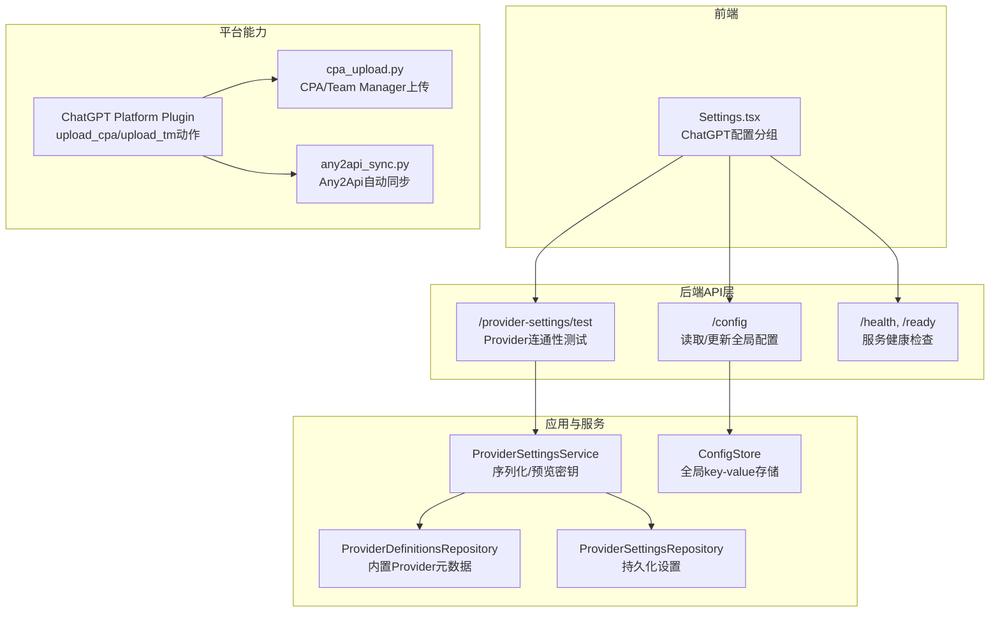
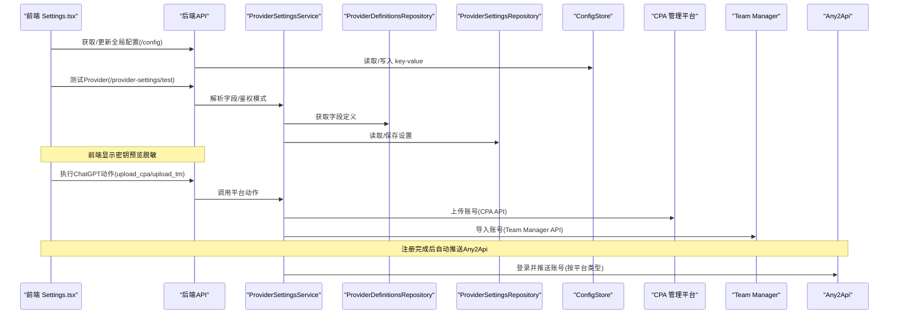
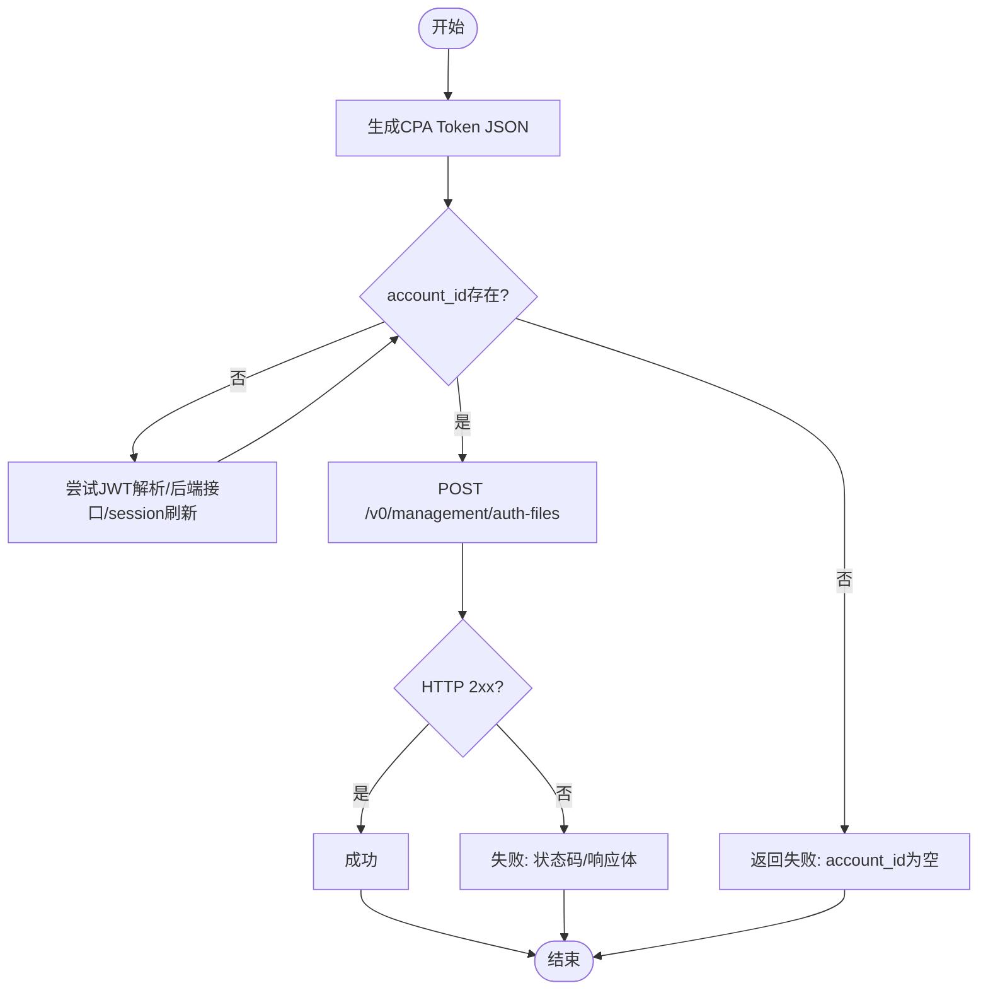
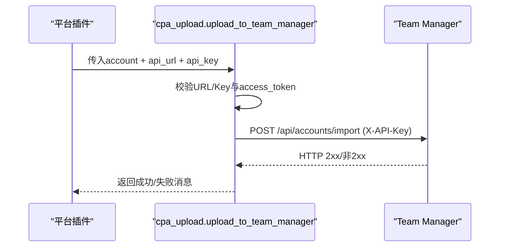
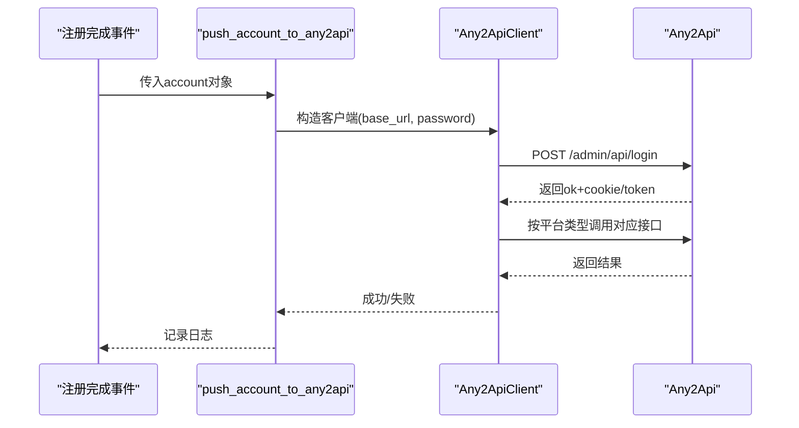
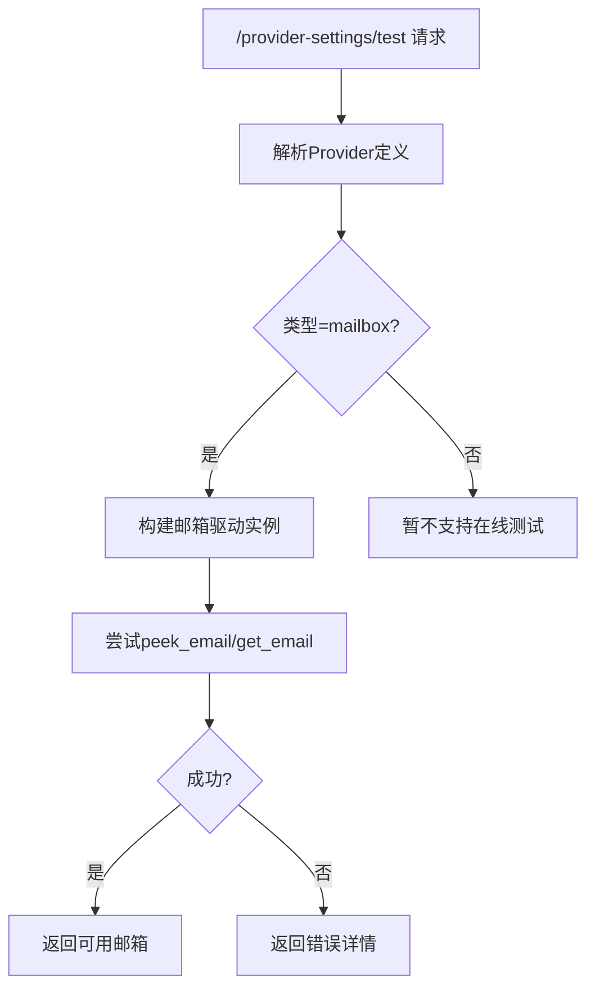
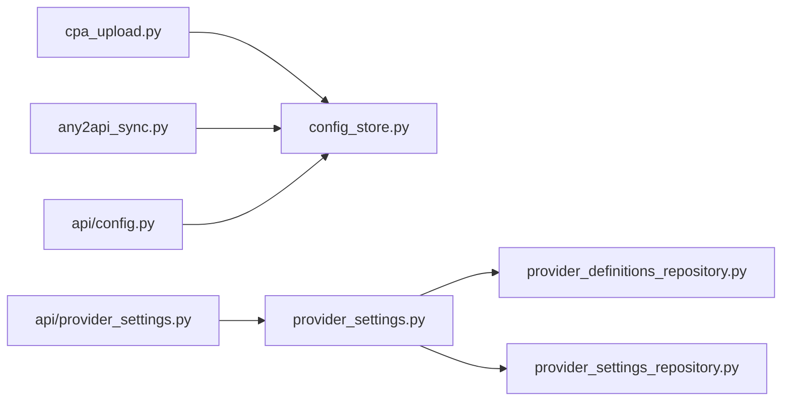

# ChatGPT集成配置

<cite>
**本文引用的文件**
- [platforms/chatgpt/cpa_upload.py](file://platforms/chatgpt/cpa_upload.py)
- [core/any2api_sync.py](file://core/any2api_sync.py)
- [application/provider_settings.py](file://application/provider_settings.py)
- [infrastructure/provider_settings_repository.py](file://infrastructure/provider_settings_repository.py)
- [api/provider_settings.py](file://api/provider_settings.py)
- [core/config_store.py](file://core/config_store.py)
- [infrastructure/provider_definitions_repository.py](file://infrastructure/provider_definitions_repository.py)
- [platforms/chatgpt/plugin.py](file://platforms/chatgpt/plugin.py)
- [frontend/src/pages/Settings.tsx](file://frontend/src/pages/Settings.tsx)
- [api/config.py](file://api/config.py)
- [api/health.py](file://api/health.py)
</cite>

## 目录
1. [简介](#简介)
2. [项目结构](#项目结构)
3. [核心组件](#核心组件)
4. [架构总览](#架构总览)
5. [详细组件分析](#详细组件分析)
6. [依赖关系分析](#依赖关系分析)
7. [性能与可靠性](#性能与可靠性)
8. [故障诊断与排除](#故障诊断与排除)
9. [结论](#结论)
10. [附录：API与配置清单](#附录api与配置清单)

## 简介
本文件面向需要对接ChatGPT平台特殊集成的用户，重点说明以下能力的配置与使用：
- CPA面板（Codex Protocol API）账号上传
- Team Manager账号导入
- Any2Api自动同步（注册完成后自动推送）
同时覆盖敏感信息的安全处理、配置项作用与场景、连接测试与可用性验证、以及常见错误的诊断方法。

## 项目结构
围绕上述能力，代码主要分布在以下位置：
- ChatGPT平台插件与动作入口：platforms/chatgpt/plugin.py
- CPA与Team Manager上传逻辑：platforms/chatgpt/cpa_upload.py
- Any2Api自动同步客户端与触发点：core/any2api_sync.py
- 全局键值配置存储：core/config_store.py
- Provider定义与设置管理（用于邮箱/验证码/短信等第三方服务）：infrastructure/provider_definitions_repository.py、infrastructure/provider_settings_repository.py、application/provider_settings.py、api/provider_settings.py
- 前端配置界面（含ChatGPT相关配置分组）：frontend/src/pages/Settings.tsx
- 系统健康检查与配置API：api/health.py、api/config.py

图表来源
- [platforms/chatgpt/plugin.py:227-333](file://platforms/chatgpt/plugin.py#L227-L333)
- [platforms/chatgpt/cpa_upload.py:207-333](file://platforms/chatgpt/cpa_upload.py#L207-L333)
- [core/any2api_sync.py:18-178](file://core/any2api_sync.py#L18-L178)
- [application/provider_settings.py:7-88](file://application/provider_settings.py#L7-L88)
- [infrastructure/provider_settings_repository.py:15-167](file://infrastructure/provider_settings_repository.py#L15-L167)
- [infrastructure/provider_definitions_repository.py:17-384](file://infrastructure/provider_definitions_repository.py#L17-L384)
- [api/provider_settings.py:61-120](file://api/provider_settings.py#L61-L120)
- [api/config.py:16-28](file://api/config.py#L16-L28)
- [api/health.py:11-18](file://api/health.py#L11-L18)

章节来源
- [platforms/chatgpt/plugin.py:227-333](file://platforms/chatgpt/plugin.py#L227-L333)
- [platforms/chatgpt/cpa_upload.py:207-333](file://platforms/chatgpt/cpa_upload.py#L207-L333)
- [core/any2api_sync.py:18-178](file://core/any2api_sync.py#L18-L178)
- [application/provider_settings.py:7-88](file://application/provider_settings.py#L7-L88)
- [infrastructure/provider_settings_repository.py:15-167](file://infrastructure/provider_settings_repository.py#L15-L167)
- [infrastructure/provider_definitions_repository.py:17-384](file://infrastructure/provider_definitions_repository.py#L17-L384)
- [api/provider_settings.py:61-120](file://api/provider_settings.py#L61-L120)
- [api/config.py:16-28](file://api/config.py#L16-L28)
- [api/health.py:11-18](file://api/health.py#L11-L18)

## 核心组件
- CPA上传与连接测试：负责生成CPA格式Token JSON、上传到CPA管理平台、以及提供连接测试能力。
- Team Manager上传：将单账号的访问令牌与会话信息导入到自建Team Manager。
- Any2Api自动同步：在注册成功后，根据平台类型自动推送账号到Any2Api实例，支持多种平台（Kiro、Grok、Cursor、ChatGPT、Blink、Windsurf）。
- Provider设置与测试：提供统一的Provider配置保存、查询、删除与在线测试能力（如邮箱服务），并安全地展示密钥预览。
- 全局配置存储：以SQLite持久化的键值对存储，供CPA/Team Manager/Any2Api等模块读取。

章节来源
- [platforms/chatgpt/cpa_upload.py:84-333](file://platforms/chatgpt/cpa_upload.py#L84-L333)
- [core/any2api_sync.py:18-294](file://core/any2api_sync.py#L18-L294)
- [application/provider_settings.py:7-88](file://application/provider_settings.py#L7-L88)
- [infrastructure/provider_settings_repository.py:15-167](file://infrastructure/provider_settings_repository.py#L15-L167)
- [core/config_store.py:7-49](file://core/config_store.py#L7-L49)

## 架构总览
下图展示了从前端配置到后端服务，再到外部服务的调用链路，包括CPA、Team Manager和Any2Api。

图表来源
- [api/config.py:16-28](file://api/config.py#L16-L28)
- [api/provider_settings.py:61-120](file://api/provider_settings.py#L61-L120)
- [application/provider_settings.py:7-88](file://application/provider_settings.py#L7-L88)
- [infrastructure/provider_settings_repository.py:15-167](file://infrastructure/provider_settings_repository.py#L15-L167)
- [infrastructure/provider_definitions_repository.py:17-384](file://infrastructure/provider_definitions_repository.py#L17-L384)
- [platforms/chatgpt/plugin.py:227-333](file://platforms/chatgpt/plugin.py#L227-L333)
- [platforms/chatgpt/cpa_upload.py:207-333](file://platforms/chatgpt/cpa_upload.py#L207-L333)
- [core/any2api_sync.py:18-294](file://core/any2api_sync.py#L18-L294)

## 详细组件分析

### CPA面板（Codex Protocol API）
- 功能要点
  - 生成CPA格式的Token JSON，包含email、access_token、refresh_token、id_token、account_id、expired、last_refresh等字段。
  - 通过POST到CPA管理平台的/v0/management/auth-files接口进行上传，Authorization头使用Bearer Token。
  - 提供连接测试：OPTIONS请求到同一端点，校验URL与Token有效性。
- 关键流程
  - 优先从id_token/access_token解析chatgpt_account_id；若失败则尝试/backend-api/me或session刷新获取。
  - 时间戳统一转换为东八区格式。
  - 上传时不经过代理，直接直连目标服务器。
- 配置项
  - cpa_api_url：CPA管理平台API地址
  - cpa_api_key：CPA管理平台认证Key
- 使用场景
  - 批量注册后自动上传至CPA，便于集中管理与分发。
- 错误处理
  - 未配置URL返回明确提示；account_id为空时拒绝上传；网络异常捕获并记录日志。

图表来源
- [platforms/chatgpt/cpa_upload.py:84-204](file://platforms/chatgpt/cpa_upload.py#L84-L204)
- [platforms/chatgpt/cpa_upload.py:207-260](file://platforms/chatgpt/cpa_upload.py#L207-L260)

章节来源
- [platforms/chatgpt/cpa_upload.py:84-333](file://platforms/chatgpt/cpa_upload.py#L84-L333)

### Team Manager
- 功能要点
  - 将单账号的access_token、session_token、refresh_token、client_id等信息导入到自建Team Manager。
  - 使用X-API-Key作为认证头，POST到/api/accounts/import。
- 配置项
  - team_manager_url：Team Manager API地址
  - team_manager_key：Team Manager API Key
- 使用场景
  - 将新注册的ChatGPT账号快速导入团队管理系统，便于后续调度与使用。
- 错误处理
  - 未配置URL或Key直接返回失败；网络异常捕获并记录日志。

图表来源
- [platforms/chatgpt/cpa_upload.py:263-307](file://platforms/chatgpt/cpa_upload.py#L263-L307)
- [platforms/chatgpt/plugin.py:329-333](file://platforms/chatgpt/plugin.py#L329-L333)

章节来源
- [platforms/chatgpt/cpa_upload.py:263-307](file://platforms/chatgpt/cpa_upload.py#L263-L307)
- [platforms/chatgpt/plugin.py:329-333](file://platforms/chatgpt/plugin.py#L329-L333)

### Any2Api自动同步
- 功能要点
  - 注册完成后自动推送账号到Any2Api实例，无需手动导出导入。
  - 支持多平台：Kiro、Grok、Cursor、ChatGPT、Blink、Windsurf。
  - 通过/admin/api/login登录后维护会话Cookie，再调用各平台对应的创建/配置接口。
- 配置项
  - any2api_url：Any2Api实例地址
  - any2api_password：管理密码
- 使用场景
  - 自动化流水线中，注册成功后立即推送到Any2Api，供下游任务消费。
- 错误处理
  - 未配置URL时静默跳过；登录失败或会话过期自动重试登录；网络异常记录警告。

图表来源
- [core/any2api_sync.py:18-178](file://core/any2api_sync.py#L18-L178)
- [core/any2api_sync.py:181-294](file://core/any2api_sync.py#L181-L294)

章节来源
- [core/any2api_sync.py:18-294](file://core/any2api_sync.py#L18-L294)

### Provider设置与测试（邮箱/验证码/短信）
- 功能要点
  - 提供Provider定义的查询与保存，支持字段、鉴权模式、默认值、分类等元数据。
  - 支持在线测试邮箱服务：尝试创建或获取一个邮箱地址，验证配置是否正确。
  - 对敏感字段进行预览脱敏（如长字符串仅显示首尾片段）。
- 使用场景
  - 在注册前验证邮箱/验证码/短信等第三方服务是否可用，减少运行时失败。
- 错误处理
  - 未找到Provider定义或驱动时返回错误；测试异常包含堆栈片段便于定位。

图表来源
- [api/provider_settings.py:61-120](file://api/provider_settings.py#L61-L120)
- [application/provider_settings.py:7-88](file://application/provider_settings.py#L7-L88)
- [infrastructure/provider_definitions_repository.py:17-384](file://infrastructure/provider_definitions_repository.py#L17-L384)

章节来源
- [api/provider_settings.py:61-120](file://api/provider_settings.py#L61-L120)
- [application/provider_settings.py:7-88](file://application/provider_settings.py#L7-L88)
- [infrastructure/provider_definitions_repository.py:17-384](file://infrastructure/provider_definitions_repository.py#L17-L384)

### 全局配置与前端界面
- 全局配置API
  - GET /config：读取所有键值对
  - PUT /config：批量更新键值对
  - GET /config/options：获取配置选项（由服务组合Provider定义与平台能力）
- 前端ChatGPT配置分组
  - CPA面板：API URL、API Key（密钥隐藏）
  - Team Manager：API URL、API Key（密钥隐藏）
  - Any2Api：API URL、Password（密钥隐藏）
- 使用场景
  - 在前端设置页集中配置各项集成参数，保存后即时生效。

章节来源
- [api/config.py:16-28](file://api/config.py#L16-L28)
- [frontend/src/pages/Settings.tsx:275-298](file://frontend/src/pages/Settings.tsx#L275-L298)
- [core/config_store.py:7-49](file://core/config_store.py#L7-L49)

## 依赖关系分析
- 耦合与内聚
  - CPA/Team Manager上传逻辑集中在cpa_upload.py，高内聚且职责单一。
  - Any2Api客户端封装了登录与会话管理，降低上层调用复杂度。
  - Provider设置与测试通过Repository与Definition解耦，便于扩展新的第三方服务。
- 外部依赖
  - CPA/Team Manager：直连HTTP API，不走代理，需确保网络可达与证书信任。
  - Any2Api：基于requests的会话管理，超时与401自动重试登录。
- 潜在循环依赖
  - 未发现明显循环依赖；各模块通过清晰的接口交互。

图表来源
- [platforms/chatgpt/cpa_upload.py:32-37](file://platforms/chatgpt/cpa_upload.py#L32-L37)
- [core/any2api_sync.py:170-178](file://core/any2api_sync.py#L170-L178)
- [application/provider_settings.py:3-10](file://application/provider_settings.py#L3-L10)
- [infrastructure/provider_settings_repository.py:15-167](file://infrastructure/provider_settings_repository.py#L15-L167)
- [infrastructure/provider_definitions_repository.py:17-384](file://infrastructure/provider_definitions_repository.py#L17-L384)
- [api/provider_settings.py:61-120](file://api/provider_settings.py#L61-L120)
- [api/config.py:16-28](file://api/config.py#L16-L28)

章节来源
- [platforms/chatgpt/cpa_upload.py:32-37](file://platforms/chatgpt/cpa_upload.py#L32-L37)
- [core/any2api_sync.py:170-178](file://core/any2api_sync.py#L170-L178)
- [application/provider_settings.py:3-10](file://application/provider_settings.py#L3-L10)
- [infrastructure/provider_settings_repository.py:15-167](file://infrastructure/provider_settings_repository.py#L15-L167)
- [infrastructure/provider_definitions_repository.py:17-384](file://infrastructure/provider_definitions_repository.py#L17-L384)
- [api/provider_settings.py:61-120](file://api/provider_settings.py#L61-L120)
- [api/config.py:16-28](file://api/config.py#L16-L28)

## 性能与可靠性
- 网络与超时
  - CPA/Team Manager上传与测试均设置合理超时，避免阻塞。
  - Any2Api客户端默认超时为10秒，登录失败与401自动重试，提高鲁棒性。
- 代理策略
  - CPA/Team Manager直连，不走代理，减少中间环节失败概率。
  - 其他平台能力（如状态查询）可结合代理池选择最优出口。
- 并发与资源
  - 上传与同步均为轻量HTTP调用，建议配合任务队列控制并发，避免对上游服务造成压力。
- 容错与恢复
  - 任何异常均记录日志，便于问题定位；Any2Api在会话过期时自动重新登录。

[本节为通用指导，不直接分析具体文件]

## 故障诊断与排除
- 常见问题与排查步骤
  - CPA上传失败
    - 检查cpa_api_url与cpa_api_key是否配置正确
    - 使用连接测试接口验证URL与Token有效性
    - 确认account_id已正确解析（JWT或后端接口）
  - Team Manager导入失败
    - 检查team_manager_url与team_manager_key
    - 确认账号包含access_token
  - Any2Api推送失败
    - 检查any2api_url与any2api_password
    - 查看登录是否成功（/admin/api/login）
    - 确认平台类型与推送接口匹配
  - Provider测试失败
    - 使用/provider-settings/test验证邮箱服务配置
    - 关注返回的错误详情与堆栈片段
- 健康检查
  - 使用/health与/ready确认服务状态
- 日志与调试
  - 关注CPA/Team Manager/Any2Api相关日志输出，定位具体失败阶段

章节来源
- [platforms/chatgpt/cpa_upload.py:310-333](file://platforms/chatgpt/cpa_upload.py#L310-L333)
- [core/any2api_sync.py:27-46](file://core/any2api_sync.py#L27-L46)
- [api/provider_settings.py:61-120](file://api/provider_settings.py#L61-L120)
- [api/health.py:11-18](file://api/health.py#L11-L18)

## 结论
本项目提供了完善的ChatGPT平台集成能力，涵盖CPA面板、Team Manager与Any2Api三大服务对接。通过清晰的前端配置界面、健壮的上传与同步逻辑、以及便捷的连接测试与健康检查，用户可以快速搭建自动化注册与账号分发流水线。建议在部署前完成所有配置的连通性测试，并在生产环境启用合理的超时与重试策略，以确保稳定性与可维护性。

[本节为总结性内容，不直接分析具体文件]

## 附录：API与配置清单
- 全局配置API
  - GET /config：读取所有键值对
  - PUT /config：批量更新键值对
  - GET /config/options：获取配置选项
- Provider设置测试API
  - POST /provider-settings/test：测试Provider配置（当前支持邮箱服务）
- 健康检查API
  - GET /health：服务健康状态
  - GET /ready：服务就绪状态
- ChatGPT相关配置项
  - cpa_api_url：CPA管理平台API地址
  - cpa_api_key：CPA管理平台认证Key
  - team_manager_url：Team Manager API地址
  - team_manager_key：Team Manager API Key
  - any2api_url：Any2Api实例地址
  - any2api_password：Any2Api管理密码

章节来源
- [api/config.py:16-28](file://api/config.py#L16-L28)
- [api/provider_settings.py:61-120](file://api/provider_settings.py#L61-L120)
- [api/health.py:11-18](file://api/health.py#L11-L18)
- [frontend/src/pages/Settings.tsx:275-298](file://frontend/src/pages/Settings.tsx#L275-L298)