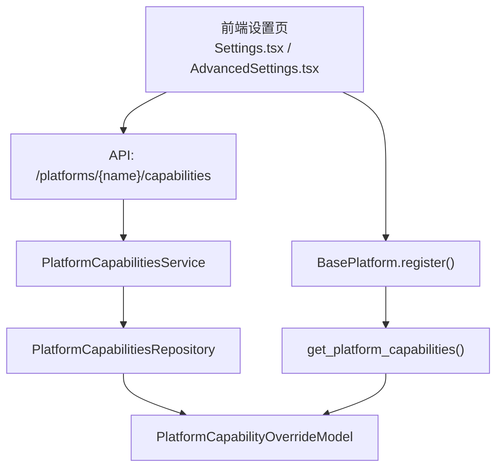
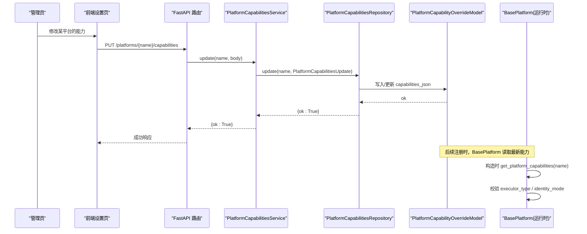
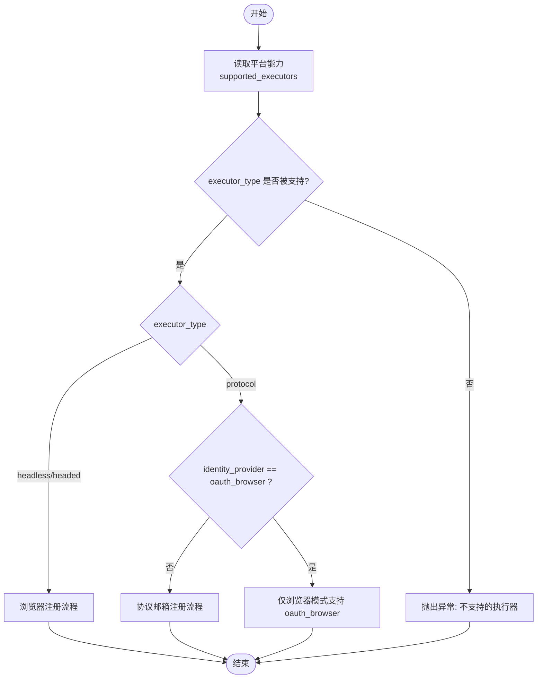
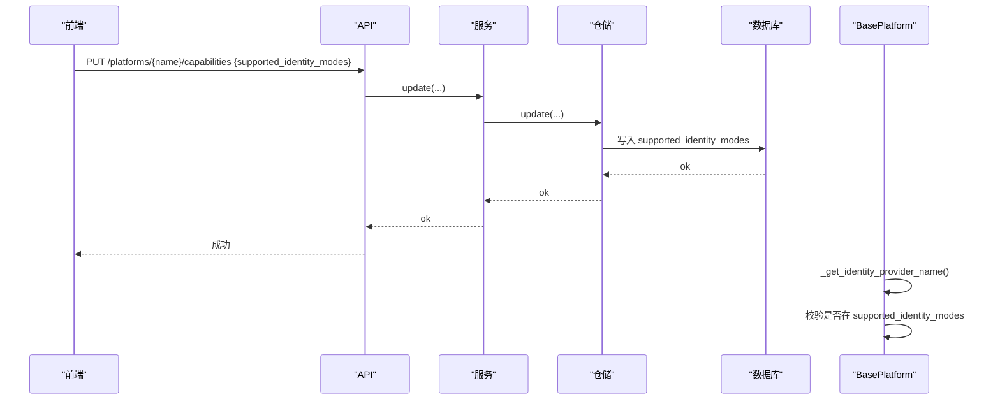
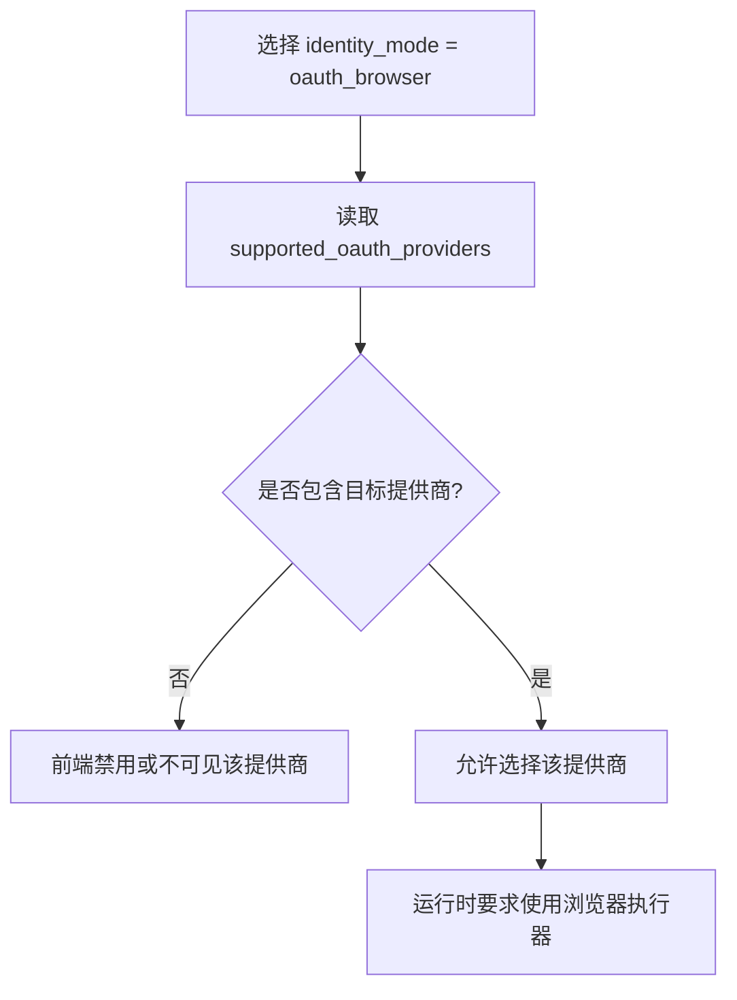
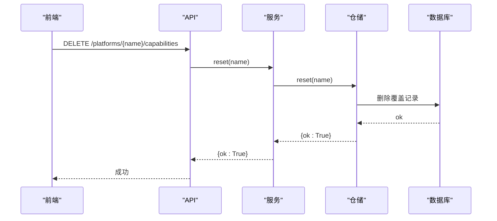
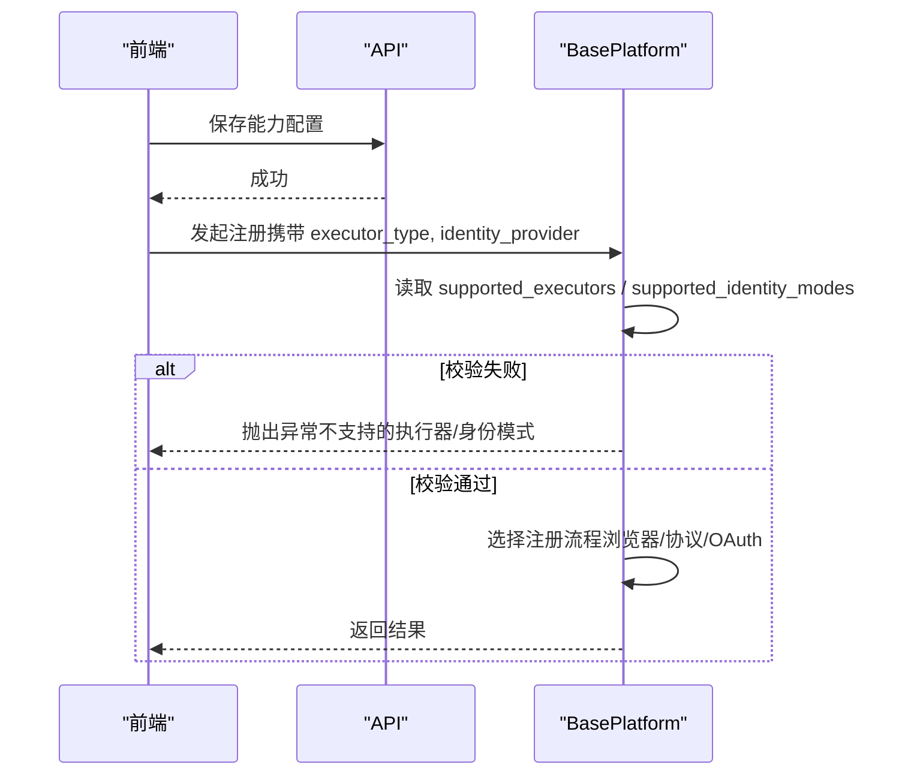
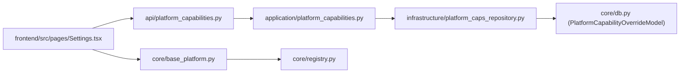

# 平台能力配置

<cite>
**本文引用的文件**
- [api/platform_capabilities.py](file://api/platform_capabilities.py)
- [application/platform_capabilities.py](file://application/platform_capabilities.py)
- [domain/platform_caps.py](file://domain/platform_caps.py)
- [infrastructure/platform_caps_repository.py](file://infrastructure/platform_caps_repository.py)
- [core/registry.py](file://core/registry.py)
- [core/base_platform.py](file://core/base_platform.py)
- [core/capability_registry.py](file://core/capability_registry.py)
- [core/db.py](file://core/db.py)
- [frontend/src/pages/Settings.tsx](file://frontend/src/pages/Settings.tsx)
- [frontend/src/components/settings/AdvancedSettings.tsx](file://frontend/src/components/settings/AdvancedSettings.tsx)
- [frontend/src/lib/registration.ts](file://frontend/src/lib/registration.ts)
</cite>

## 目录
1. [简介](#简介)
2. [项目结构](#项目结构)
3. [核心组件](#核心组件)
4. [架构总览](#架构总览)
5. [详细组件分析](#详细组件分析)
6. [依赖关系分析](#依赖关系分析)
7. [性能考虑](#性能考虑)
8. [故障排查指南](#故障排查指南)
9. [结论](#结论)
10. [附录](#附录)

## 简介
本章节面向管理员，说明如何通过“平台能力配置”为每个平台定制支持的功能特性与注册流程。重点包括：
- 执行方式配置：选择浏览器模式（headless/headed）或协议模式（protocol）。
- 注册身份模式：本地邮箱账号、OAuth 登录等。
- 第三方入口控制：启用/禁用 Google、Microsoft 等 OAuth 提供商。
- 能力重置：将平台能力恢复至默认值。
- 配置变更对注册流程的影响：前端选项、后端校验与运行时行为如何联动。

## 项目结构
平台能力配置由 API 层暴露接口，应用服务层进行参数组装，基础设施层持久化到数据库；运行时由平台基类读取能力并影响注册流程。前端提供可视化编辑界面。

**图表来源**
- [api/platform_capabilities.py:11-18](file://api/platform_capabilities.py#L11-L18)
- [application/platform_capabilities.py:14-24](file://application/platform_capabilities.py#L14-L24)
- [infrastructure/platform_caps_repository.py:22-53](file://infrastructure/platform_caps_repository.py#L22-L53)
- [core/db.py:210-227](file://core/db.py#L210-L227)
- [core/registry.py:100-107](file://core/registry.py#L100-L107)
- [core/base_platform.py:60-75](file://core/base_platform.py#L60-L75)

**章节来源**
- [api/platform_capabilities.py:1-18](file://api/platform_capabilities.py#L1-L18)
- [application/platform_capabilities.py:1-24](file://application/platform_capabilities.py#L1-L24)
- [infrastructure/platform_caps_repository.py:1-53](file://infrastructure/platform_caps_repository.py#L1-L53)
- [core/db.py:210-227](file://core/db.py#L210-L227)
- [core/registry.py:100-107](file://core/registry.py#L100-L107)
- [core/base_platform.py:60-75](file://core/base_platform.py#L60-L75)

## 核心组件
- API 路由：提供更新与重置平台能力的端点。
- 服务层：将请求体转换为领域对象并调用仓储。
- 仓储层：安全写入允许字段，维护创建/更新时间。
- 数据模型：平台能力覆盖表存储 JSON 化的能力集合。
- 运行时读取：平台实例初始化时从注册表获取能力，用于校验执行器与身份模式。
- 能力定义：标准能力清单与 UI 展示策略。
- 前端界面：勾选/取消支持的执行器、身份模式、OAuth 提供商，保存与重置。

**章节来源**
- [api/platform_capabilities.py:11-18](file://api/platform_capabilities.py#L11-L18)
- [application/platform_capabilities.py:14-24](file://application/platform_capabilities.py#L14-L24)
- [domain/platform_caps.py:6-11](file://domain/platform_caps.py#L6-L11)
- [infrastructure/platform_caps_repository.py:12-53](file://infrastructure/platform_caps_repository.py#L12-L53)
- [core/db.py:210-227](file://core/db.py#L210-L227)
- [core/capability_registry.py:27-132](file://core/capability_registry.py#L27-L132)
- [frontend/src/pages/Settings.tsx:113-160](file://frontend/src/pages/Settings.tsx#L113-L160)
- [frontend/src/components/settings/AdvancedSettings.tsx:71-125](file://frontend/src/components/settings/AdvancedSettings.tsx#L71-L125)

## 架构总览
平台能力配置贯穿“前端编辑 → API → 服务 → 仓储 → 数据库 → 运行时读取”的完整链路。运行时通过 BasePlatform 在构造阶段读取能力，并在注册流程中根据执行器类型与身份模式选择不同的注册路径。

**图表来源**
- [api/platform_capabilities.py:11-18](file://api/platform_capabilities.py#L11-L18)
- [application/platform_capabilities.py:14-24](file://application/platform_capabilities.py#L14-L24)
- [infrastructure/platform_caps_repository.py:22-53](file://infrastructure/platform_caps_repository.py#L22-L53)
- [core/db.py:210-227](file://core/db.py#L210-L227)
- [core/base_platform.py:60-75](file://core/base_platform.py#L60-L75)

## 详细组件分析

### 执行方式配置（浏览器模式 vs 协议模式）
- 可配置项：supported_executors，包含 protocol、headless、headed。
- 前端展示：根据平台元数据生成选项，并对不兼容的组合禁用（如第三方账号需浏览器自动化）。
- 运行时校验：BasePlatform 构造时检查当前 executor_type 是否在 supported_executors 内，否则抛出异常。
- 注册分支：
  - 若 executor_type 为 headless/headed，走浏览器注册流程。
  - 若身份提供者是 oauth_browser，且未使用受支持的浏览器执行器，会提示错误。
  - 否则走协议邮箱注册流程。

**图表来源**
- [core/base_platform.py:60-75](file://core/base_platform.py#L60-L75)
- [core/base_platform.py:124-160](file://core/base_platform.py#L124-L160)
- [frontend/src/lib/registration.ts:73-111](file://frontend/src/lib/registration.ts#L73-L111)

**章节来源**
- [core/base_platform.py:60-75](file://core/base_platform.py#L60-L75)
- [core/base_platform.py:124-160](file://core/base_platform.py#L124-L160)
- [frontend/src/lib/registration.ts:73-111](file://frontend/src/lib/registration.ts#L73-L111)

### 注册身份模式配置（本地账号 vs OAuth）
- 可配置项：supported_identity_modes，常见值为 mailbox、oauth_browser。
- 前端构建：当支持 mailbox 时显示“邮箱自动收验证码”；当支持 oauth_browser 时，展开其支持的 OAuth 提供商列表。
- 运行时校验：BasePlatform 在解析身份提供者时检查是否在 supported_identity_modes 内，否则抛出异常。
- 身份归一化：系统对 identity_provider 和 oauth_provider 提供别名映射，便于兼容历史输入。

**图表来源**
- [frontend/src/lib/registration.ts:34-71](file://frontend/src/lib/registration.ts#L34-L71)
- [api/platform_capabilities.py:11-18](file://api/platform_capabilities.py#L11-L18)
- [application/platform_capabilities.py:14-24](file://application/platform_capabilities.py#L14-L24)
- [infrastructure/platform_caps_repository.py:22-53](file://infrastructure/platform_caps_repository.py#L22-L53)
- [core/base_platform.py:432-449](file://core/base_platform.py#L432-L449)
- [core/base_identity.py:7-45](file://core/base_identity.py#L7-L45)

**章节来源**
- [frontend/src/lib/registration.ts:34-71](file://frontend/src/lib/registration.ts#L34-L71)
- [core/base_identity.py:7-45](file://core/base_identity.py#L7-L45)
- [core/base_platform.py:432-449](file://core/base_platform.py#L432-L449)

### 第三方入口配置（Google、Microsoft 等 OAuth 提供商）
- 可配置项：supported_oauth_providers，用于控制该平台上可用的 OAuth 提供商。
- 前端展示：当 identity mode 为 oauth_browser 时，按 supported_oauth_providers 渲染可选提供商。
- 运行时影响：若选择的 identity_provider 为 oauth_browser，则必须使用浏览器执行器；同时需在 supported_oauth_providers 中包含对应提供商。

**图表来源**
- [frontend/src/lib/registration.ts:34-71](file://frontend/src/lib/registration.ts#L34-L71)
- [core/base_platform.py:146-153](file://core/base_platform.py#L146-L153)

**章节来源**
- [frontend/src/lib/registration.ts:34-71](file://frontend/src/lib/registration.ts#L34-L71)
- [core/base_platform.py:146-153](file://core/base_platform.py#L146-L153)

### 平台能力重置（恢复到默认配置）
- 操作：DELETE /platforms/{name}/capabilities。
- 效果：删除该平台的覆盖记录，下次读取时将回退到平台类的默认声明。
- 前端交互：点击重置后刷新平台列表并回填默认值。

**图表来源**
- [api/platform_capabilities.py:16-18](file://api/platform_capabilities.py#L16-L18)
- [application/platform_capabilities.py:23-24](file://application/platform_capabilities.py#L23-L24)
- [infrastructure/platform_caps_repository.py:44-53](file://infrastructure/platform_caps_repository.py#L44-L53)
- [frontend/src/pages/Settings.tsx:147-160](file://frontend/src/pages/Settings.tsx#L147-L160)
- [frontend/src/components/settings/AdvancedSettings.tsx:111-125](file://frontend/src/components/settings/AdvancedSettings.tsx#L111-L125)

**章节来源**
- [api/platform_capabilities.py:16-18](file://api/platform_capabilities.py#L16-L18)
- [application/platform_capabilities.py:23-24](file://application/platform_capabilities.py#L23-L24)
- [infrastructure/platform_caps_repository.py:44-53](file://infrastructure/platform_caps_repository.py#L44-L53)
- [frontend/src/pages/Settings.tsx:147-160](file://frontend/src/pages/Settings.tsx#L147-L160)
- [frontend/src/components/settings/AdvancedSettings.tsx:111-125](file://frontend/src/components/settings/AdvancedSettings.tsx#L111-L125)

### 配置变更对注册流程的影响
- 前端：根据平台元数据动态生成“执行方式”和“身份模式/第三方入口”的选项，禁用不兼容组合。
- 后端：BasePlatform 构造时读取能力并严格校验 executor_type 与 identity_mode；不符合则直接报错，阻止注册。
- 运行时：不同执行器与身份模式决定注册路径（浏览器自动化 vs 协议邮箱），以及是否需要浏览器复用登录态。

**图表来源**
- [core/base_platform.py:60-75](file://core/base_platform.py#L60-L75)
- [core/base_platform.py:124-160](file://core/base_platform.py#L124-L160)
- [frontend/src/lib/registration.ts:73-111](file://frontend/src/lib/registration.ts#L73-L111)

**章节来源**
- [core/base_platform.py:60-75](file://core/base_platform.py#L60-L75)
- [core/base_platform.py:124-160](file://core/base_platform.py#L124-L160)
- [frontend/src/lib/registration.ts:73-111](file://frontend/src/lib/registration.ts#L73-L111)

## 依赖关系分析
- API 层依赖应用服务层，服务层依赖仓储层，仓储层依赖数据库模型。
- 运行时 BasePlatform 依赖注册表以获取平台能力，进而影响注册流程。
- 前端依赖平台元数据（来自 list_platforms）来渲染可选项。

**图表来源**
- [api/platform_capabilities.py:11-18](file://api/platform_capabilities.py#L11-L18)
- [application/platform_capabilities.py:14-24](file://application/platform_capabilities.py#L14-L24)
- [infrastructure/platform_caps_repository.py:22-53](file://infrastructure/platform_caps_repository.py#L22-L53)
- [core/db.py:210-227](file://core/db.py#L210-L227)
- [core/base_platform.py:60-75](file://core/base_platform.py#L60-L75)
- [core/registry.py:100-107](file://core/registry.py#L100-L107)
- [frontend/src/pages/Settings.tsx:113-160](file://frontend/src/pages/Settings.tsx#L113-L160)

**章节来源**
- [api/platform_capabilities.py:11-18](file://api/platform_capabilities.py#L11-L18)
- [application/platform_capabilities.py:14-24](file://application/platform_capabilities.py#L14-L24)
- [infrastructure/platform_caps_repository.py:22-53](file://infrastructure/platform_caps_repository.py#L22-L53)
- [core/db.py:210-227](file://core/db.py#L210-L227)
- [core/base_platform.py:60-75](file://core/base_platform.py#L60-L75)
- [core/registry.py:100-107](file://core/registry.py#L100-L107)
- [frontend/src/pages/Settings.tsx:113-160](file://frontend/src/pages/Settings.tsx#L113-L160)

## 性能考虑
- 能力读取在平台实例构造时发生，建议避免频繁重建平台实例。
- 能力覆盖表为单行/每平台一条记录，读写开销低。
- 前端在保存成功后刷新缓存，减少重复请求。

[本节为通用指导，无需特定文件引用]

## 故障排查指南
- 错误：不支持的执行器
  - 现象：注册时报错提示不支持的 executor_type。
  - 原因：当前 executor_type 不在 supported_executors 中。
  - 处理：在前端设置页勾选对应的执行器并保存。
  - 参考位置
    - [core/base_platform.py:60-75](file://core/base_platform.py#L60-L75)

- 错误：仅浏览器模式支持 oauth_browser
  - 现象：选择 identity_provider=oauth_browser 但执行器非浏览器模式时报错。
  - 原因：OAuth 流程需要浏览器自动化。
  - 处理：切换为 headless 或 headed。
  - 参考位置
    - [core/base_platform.py:146-153](file://core/base_platform.py#L146-L153)

- 错误：未找到可用验证码 provider
  - 现象：协议模式下无法继续。
  - 原因：未配置可用的验证码 provider。
  - 处理：在设置页启用并配置至少一个验证码 provider。
  - 参考位置
    - [core/base_platform.py:345-352](file://core/base_platform.py#L345-L352)

- 问题：前端选项与后端不一致
  - 现象：前端显示的选项与实际运行不符。
  - 原因：未刷新平台列表或未保存配置。
  - 处理：保存配置后刷新页面，或调用重置恢复默认。
  - 参考位置
    - [frontend/src/pages/Settings.tsx:113-160](file://frontend/src/pages/Settings.tsx#L113-L160)
    - [frontend/src/components/settings/AdvancedSettings.tsx:71-125](file://frontend/src/components/settings/AdvancedSettings.tsx#L71-L125)

**章节来源**
- [core/base_platform.py:60-75](file://core/base_platform.py#L60-L75)
- [core/base_platform.py:146-153](file://core/base_platform.py#L146-L153)
- [core/base_platform.py:345-352](file://core/base_platform.py#L345-L352)
- [frontend/src/pages/Settings.tsx:113-160](file://frontend/src/pages/Settings.tsx#L113-L160)
- [frontend/src/components/settings/AdvancedSettings.tsx:71-125](file://frontend/src/components/settings/AdvancedSettings.tsx#L71-L125)

## 结论
平台能力配置通过统一的 API 与服务/仓储层实现了对每个平台执行方式、身份模式与第三方入口的精细化控制。运行时严格校验这些能力，确保注册流程的正确性与安全性。管理员可通过前端界面灵活调整，并在必要时一键重置到默认配置。

[本节为总结性内容，无需特定文件引用]

## 附录
- 标准能力清单：查询状态、刷新 Token、生成试用链接、切换到桌面应用、上传 CPA/TM、检查试用资格、创建 API Key 等。
- 能力分类与优先级：通过 CapabilityRegistry 管理，支持 inline 按钮与菜单两种展示方式。

**章节来源**
- [core/capability_registry.py:27-132](file://core/capability_registry.py#L27-L132)
- [core/capability_registry.py:135-173](file://core/capability_registry.py#L135-L173)