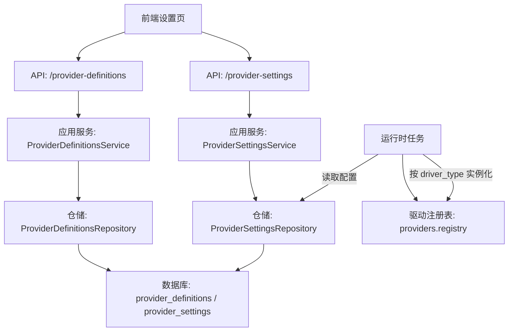
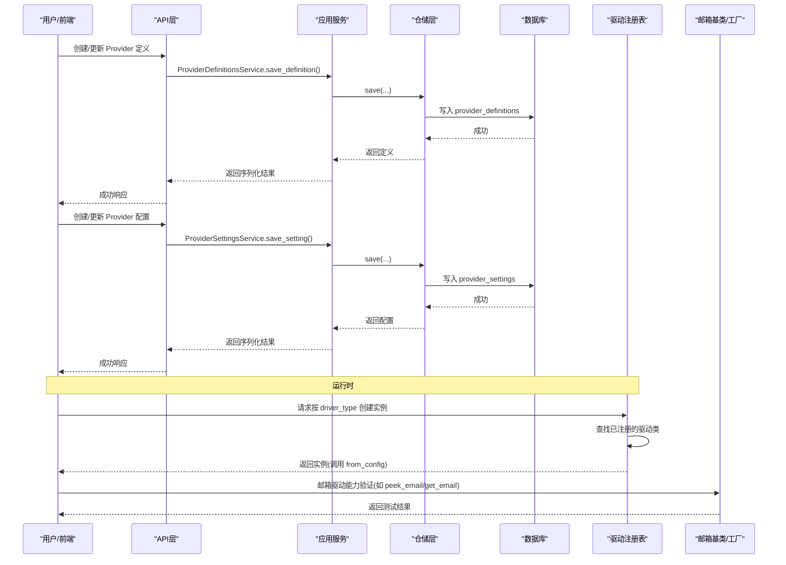
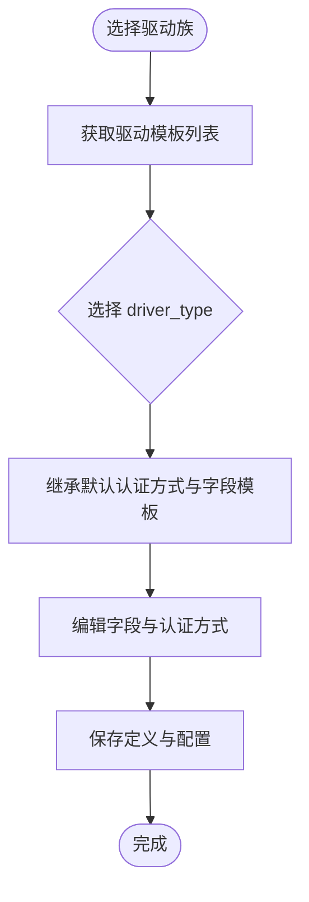
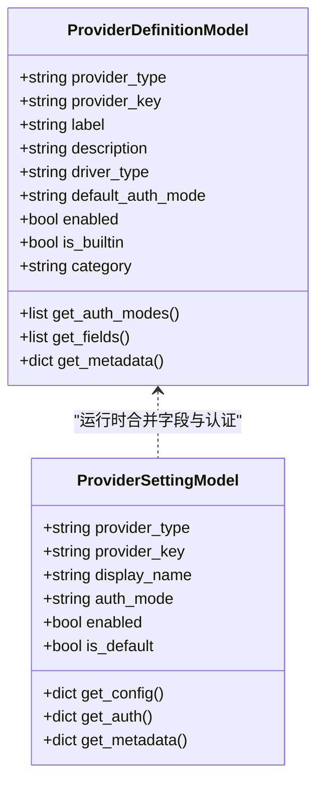
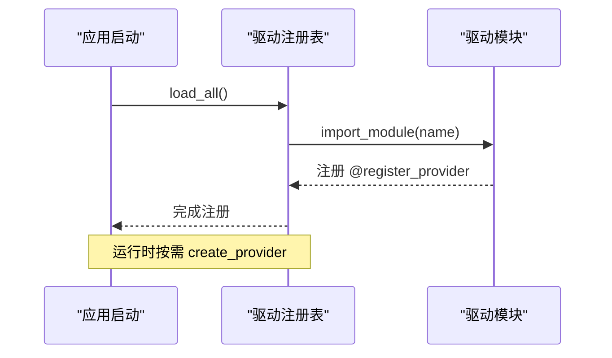
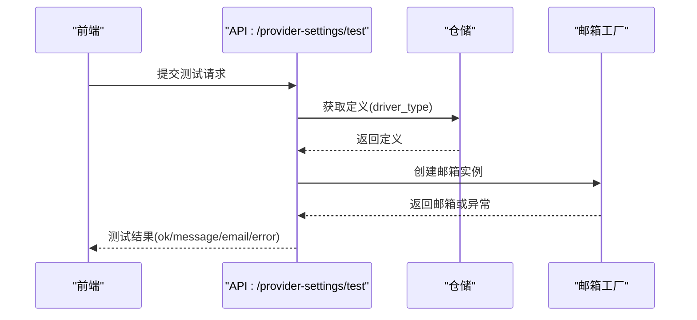
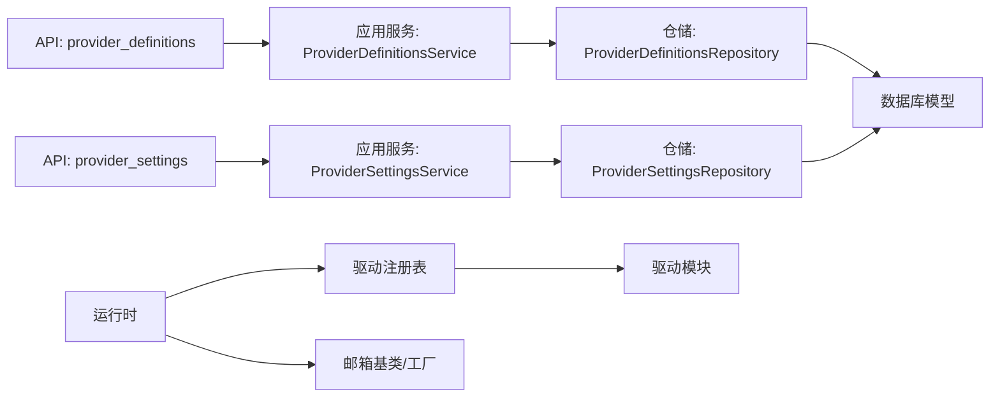

# 动态Provider创建

<cite>
**本文引用的文件**
- [api/provider_definitions.py](file://api/provider_definitions.py)
- [application/provider_definitions.py](file://application/provider_definitions.py)
- [infrastructure/provider_definitions_repository.py](file://infrastructure/provider_definitions_repository.py)
- [core/db.py](file://core/db.py)
- [providers/registry.py](file://providers/registry.py)
- [api/provider_settings.py](file://api/provider_settings.py)
- [application/provider_settings.py](file://application/provider_settings.py)
- [infrastructure/provider_settings_repository.py](file://infrastructure/provider_settings_repository.py)
- [core/base_mailbox.py](file://core/base_mailbox.py)
</cite>

## 目录
1. [简介](#简介)
2. [项目结构](#项目结构)
3. [核心组件](#核心组件)
4. [架构总览](#架构总览)
5. [详细组件分析](#详细组件分析)
6. [依赖关系分析](#依赖关系分析)
7. [性能与扩展性](#性能与扩展性)
8. [故障排查指南](#故障排查指南)
9. [结论](#结论)
10. [附录](#附录)

## 简介
本功能提供“动态 Provider 创建”能力，允许用户在运行时通过界面或 API 为第三方服务（邮箱、验证码、短信、代理等）定义并启用驱动。系统支持：
- 驱动族选择与模板继承：按 provider_type 列出可用 driver_type，并自动继承默认认证方式、字段模板和元数据。
- 认证方式与字段分类：定义 auth_modes 与 fields，字段支持 connection/auth/identity 等分类，以及 secret、placeholder、hint、type 等 UI 提示。
- 动态创建的 Provider 定义结构：包含 provider_key、label、description、driver_type、default_auth_mode、enabled、category、metadata 等元数据。
- 热加载与注册机制：启动时扫描 providers 包完成驱动类注册；运行时通过数据库配置即时生效。
- 验证与测试：提供在线测试接口，尝试创建邮箱以校验配置正确性。
- 兼容性与优先级：内置定义与用户自定义并存，查询与使用遵循内置优先、ID 排序的优先级规则。

## 项目结构
围绕动态 Provider 的关键路径如下：
- API 层：暴露 /provider-definitions 与 /provider-settings 接口，用于定义与配置的增删改查与测试。
- 应用服务层：封装业务逻辑，负责序列化、合并默认值、策略计算等。
- 基础设施层：持久化 ProviderDefinitionModel 与 ProviderSettingModel，维护种子数据与模板继承。
- 运行期驱动注册：providers.registry 在启动时扫描并注册具体驱动类，运行时根据 driver_type 实例化。
- 数据模型：core.db 中定义 provider_definitions 与 provider_settings 表结构及 JSON 字段存取方法。

**图表来源**
- [api/provider_definitions.py:1-53](file://api/provider_definitions.py#L1-L53)
- [api/provider_settings.py:1-120](file://api/provider_settings.py#L1-L120)
- [application/provider_definitions.py:1-54](file://application/provider_definitions.py#L1-L54)
- [application/provider_settings.py:1-88](file://application/provider_settings.py#L1-L88)
- [infrastructure/provider_definitions_repository.py:387-561](file://infrastructure/provider_definitions_repository.py#L387-L561)
- [infrastructure/provider_settings_repository.py:15-167](file://infrastructure/provider_settings_repository.py#L15-L167)
- [providers/registry.py:1-91](file://providers/registry.py#L1-L91)
- [core/db.py:131-200](file://core/db.py#L131-L200)

**章节来源**
- [api/provider_definitions.py:1-53](file://api/provider_definitions.py#L1-L53)
- [api/provider_settings.py:1-120](file://api/provider_settings.py#L1-L120)
- [application/provider_definitions.py:1-54](file://application/provider_definitions.py#L1-L54)
- [application/provider_settings.py:1-88](file://application/provider_settings.py#L1-L88)
- [infrastructure/provider_definitions_repository.py:387-561](file://infrastructure/provider_definitions_repository.py#L387-L561)
- [infrastructure/provider_settings_repository.py:15-167](file://infrastructure/provider_settings_repository.py#L15-L167)
- [providers/registry.py:1-91](file://providers/registry.py#L1-L91)
- [core/db.py:131-200](file://core/db.py#L131-L200)

## 核心组件
- ProviderDefinitionsService：对外暴露定义列表、驱动模板列表、保存与删除定义的能力，并将数据库对象序列化为统一结构返回。
- ProviderSettingsService：管理运行时配置项，支持获取目录选项、默认策略、序列化配置并合并字段与认证信息。
- ProviderDefinitionsRepository：维护内置种子数据、按类型查询、按 driver_type 去重模板、保存/更新定义、删除保护（若存在关联设置）。
- ProviderSettingsRepository：管理运行时配置项的增删改查、默认项切换、运行时配置解析（合并默认值、配置、认证与覆盖参数）。
- providers.registry：启动时扫描 providers 包，将驱动类注册到全局表；运行时根据 provider_type 与 driver_type 查找并调用 from_config 创建实例。
- core.db 模型：定义 provider_definitions 与 provider_settings 表结构，提供 JSON 字段的存取方法与唯一约束。

**章节来源**
- [application/provider_definitions.py:6-54](file://application/provider_definitions.py#L6-L54)
- [application/provider_settings.py:7-88](file://application/provider_settings.py#L7-L88)
- [infrastructure/provider_definitions_repository.py:387-561](file://infrastructure/provider_definitions_repository.py#L387-L561)
- [infrastructure/provider_settings_repository.py:15-167](file://infrastructure/provider_settings_repository.py#L15-L167)
- [providers/registry.py:28-91](file://providers/registry.py#L28-L91)
- [core/db.py:131-200](file://core/db.py#L131-L200)

## 架构总览
动态 Provider 的工作流分为“定义阶段”和“运行阶段”：
- 定义阶段：前端或 API 调用 /provider-definitions 创建/更新定义；调用 /provider-settings 创建/更新运行时配置；仓储层从数据库读写，并维护内置种子数据与模板继承。
- 运行阶段：任务执行时读取运行时配置，解析出最终配置字典；通过 providers.registry 按 driver_type 找到驱动类并调用 from_config 创建实例；对邮箱类驱动可进一步通过 base_mailbox 工厂进行能力验证。

**图表来源**
- [api/provider_definitions.py:12-53](file://api/provider_definitions.py#L12-L53)
- [application/provider_definitions.py:16-54](file://application/provider_definitions.py#L16-L54)
- [infrastructure/provider_definitions_repository.py:495-561](file://infrastructure/provider_definitions_repository.py#L495-L561)
- [api/provider_settings.py:12-120](file://api/provider_settings.py#L12-L120)
- [application/provider_settings.py:16-88](file://application/provider_settings.py#L16-L88)
- [infrastructure/provider_settings_repository.py:109-167](file://infrastructure/provider_settings_repository.py#L109-L167)
- [providers/registry.py:51-62](file://providers/registry.py#L51-L62)
- [core/base_mailbox.py:27-118](file://core/base_mailbox.py#L27-L118)

## 详细组件分析

### 驱动族的选择与配置
- 驱动族列表：通过 /provider-definitions/drivers 获取按 provider_type 去重的 driver_type 模板，包含 label、description、default_auth_mode、auth_modes、fields。
- 模板继承：保存新定义时，若未显式提供 default_auth_mode、auth_modes、fields，则从同 driver_type 的已有定义（优先内置）继承。
- 字段分类：fields 中的 category 支持 connection、auth、identity 等，UI 据此分组展示；字段属性包括 key、label、placeholder、secret、type、hint、asyncUrl 等。

**图表来源**
- [infrastructure/provider_definitions_repository.py:452-491](file://infrastructure/provider_definitions_repository.py#L452-L491)
- [infrastructure/provider_definitions_repository.py:495-544](file://infrastructure/provider_definitions_repository.py#L495-L544)
- [core/db.py:131-166](file://core/db.py#L131-L166)

**章节来源**
- [infrastructure/provider_definitions_repository.py:452-491](file://infrastructure/provider_definitions_repository.py#L452-L491)
- [infrastructure/provider_definitions_repository.py:495-544](file://infrastructure/provider_definitions_repository.py#L495-L544)
- [core/db.py:131-166](file://core/db.py#L131-L166)

### 认证方式定义与字段模板
- 认证方式：每个驱动可定义多个 auth_modes，包含 value 与 label；default_auth_mode 指定默认认证方式。
- 字段模板：fields 描述表单控件与行为，支持文本、密码、开关、异步下拉等类型；secret 表示敏感字段；placeholder/hint 提供输入提示。
- 运行时合并：resolve_runtime_settings 会先填充字段默认值，再合并配置与认证，最后叠加覆盖参数，形成最终配置字典。

**图表来源**
- [core/db.py:131-200](file://core/db.py#L131-L200)
- [infrastructure/provider_settings_repository.py:39-55](file://infrastructure/provider_settings_repository.py#L39-L55)

**章节来源**
- [core/db.py:131-200](file://core/db.py#L131-L200)
- [infrastructure/provider_settings_repository.py:39-55](file://infrastructure/provider_settings_repository.py#L39-L55)

### 动态创建的 Provider 定义结构
- 关键字段：
  - provider_type：类别（mailbox/captcha/sms/proxy）。
  - provider_key：唯一标识键。
  - label/description：显示名称与说明。
  - driver_type：实际驱动实现类型。
  - default_auth_mode：默认认证方式。
  - enabled：是否启用。
  - category：分类（free/selfhost/custom/thirdparty）。
  - metadata：扩展元数据（例如 pipeline 配置）。
- 序列化输出：服务层返回包含 id、value、auth_modes、fields、is_builtin、category、metadata 的统一结构，便于前端渲染。

**章节来源**
- [application/provider_definitions.py:16-54](file://application/provider_definitions.py#L16-L54)
- [core/db.py:131-166](file://core/db.py#L131-L166)

### 字段分类系统与UI映射
- 分类：connection（连接）、auth（认证）、identity（身份）等，前端按分类分组展示。
- 字段类型：text、textarea、toggle、async-select 等，支持异步加载选项（asyncUrl、asyncValueKey、asyncLabelKey）。
- 敏感字段：secret 标记后在前端隐藏或脱敏预览。

**章节来源**
- [infrastructure/provider_definitions_repository.py:17-384](file://infrastructure/provider_definitions_repository.py#L17-L384)
- [application/provider_settings.py:54-88](file://application/provider_settings.py#L54-L88)

### 动态驱动的注册机制与热加载
- 启动注册：应用启动时调用 providers.registry.load_all()，扫描 providers.captcha、providers.proxy、providers.sms、providers.mailbox 下的模块，导入并注册驱动类。
- 运行时实例化：create_provider(provider_type, driver_type, config) 查找已注册类并调用其 from_config(config) 创建实例。
- 热加载能力：定义与配置变更立即生效于运行时（无需重启），因为运行时每次读取数据库配置并通过注册表实例化驱动。

**图表来源**
- [providers/registry.py:70-91](file://providers/registry.py#L70-L91)
- [providers/registry.py:51-62](file://providers/registry.py#L51-L62)

**章节来源**
- [providers/registry.py:28-91](file://providers/registry.py#L28-L91)

### 验证与测试功能
- 在线测试：/provider-settings/test 支持对 mailbox 类型进行连通性测试，尝试创建邮箱或读取邮箱地址。
- 测试流程：根据 driver_type 查找邮箱工厂，构造实例并调用 peek_email/get_email；返回成功消息与邮箱地址或错误详情。
- 其他类型：captcha/sms 暂不支持在线测试，需在任务中验证。

**图表来源**
- [api/provider_settings.py:54-120](file://api/provider_settings.py#L54-L120)
- [core/base_mailbox.py:27-118](file://core/base_mailbox.py#L27-L118)

**章节来源**
- [api/provider_settings.py:54-120](file://api/provider_settings.py#L54-L120)
- [core/base_mailbox.py:27-118](file://core/base_mailbox.py#L27-L118)

### 与内置驱动的兼容性与优先级规则
- 内置种子数据：启动时 ensure_seeded 将内置定义同步到数据库，确保 label、description、fields、auth_modes、metadata 等元数据与代码一致。
- 查询优先级：list_driver_templates 按 is_builtin 降序与 id 排序，保证内置驱动优先显示与选择。
- 模板继承优先级：_get_driver_defaults 同样按 is_builtin 降序与 id 排序，优先从内置定义继承默认值。
- 删除保护：删除定义前检查是否存在关联设置，若有则要求先删除设置，避免数据不一致。

**章节来源**
- [infrastructure/provider_definitions_repository.py:387-434](file://infrastructure/provider_definitions_repository.py#L387-L434)
- [infrastructure/provider_definitions_repository.py:452-491](file://infrastructure/provider_definitions_repository.py#L452-L491)
- [infrastructure/provider_definitions_repository.py:495-561](file://infrastructure/provider_definitions_repository.py#L495-L561)

## 依赖关系分析
- API 层依赖应用服务层，应用服务层依赖仓储层，仓储层依赖数据库模型。
- 运行时依赖驱动注册表，注册表依赖各驱动模块的装饰器注册。
- 邮箱驱动通过 base_mailbox 抽象与工厂方法进行能力验证与回退。

**图表来源**
- [api/provider_definitions.py:1-53](file://api/provider_definitions.py#L1-L53)
- [api/provider_settings.py:1-120](file://api/provider_settings.py#L1-L120)
- [application/provider_definitions.py:1-54](file://application/provider_definitions.py#L1-L54)
- [application/provider_settings.py:1-88](file://application/provider_settings.py#L1-L88)
- [infrastructure/provider_definitions_repository.py:387-561](file://infrastructure/provider_definitions_repository.py#L387-L561)
- [infrastructure/provider_settings_repository.py:15-167](file://infrastructure/provider_settings_repository.py#L15-L167)
- [providers/registry.py:1-91](file://providers/registry.py#L1-L91)
- [core/base_mailbox.py:1-200](file://core/base_mailbox.py#L1-L200)

**章节来源**
- [providers/registry.py:28-91](file://providers/registry.py#L28-L91)
- [core/base_mailbox.py:27-118](file://core/base_mailbox.py#L27-L118)

## 性能与扩展性
- 启动开销：load_all 仅扫描一次 providers 包，后续复用注册表，影响较小。
- 查询优化：list_driver_templates 与 _get_driver_defaults 使用去重与排序，减少重复与提升一致性。
- 扩展点：新增驱动只需在对应子包下实现类并使用 @register_provider 装饰器；新增内置定义只需在种子数据中添加。
- 配置合并：resolve_runtime_settings 采用默认值→配置→认证→覆盖的顺序，便于灵活调整而不破坏兼容性。

[本节为通用指导，不直接分析具体文件]

## 故障排查指南
- 未找到驱动：若 create_provider 抛出“未注册的 provider”，检查驱动模块是否正确导入并装饰注册。
- 缺少 from_config：若驱动类未实现 from_config，会抛出类型错误；需补充该工厂方法。
- 定义不存在：删除定义时报错“provider definition 不存在”，确认 ID 有效或先创建定义。
- 关联设置保护：删除定义时报错“请先删除对应 provider 配置，再删除 definition”，需先清理设置。
- 测试失败：/provider-settings/test 返回错误与堆栈片段，检查 driver_type 与配置项是否匹配驱动期望。

**章节来源**
- [providers/registry.py:51-62](file://providers/registry.py#L51-L62)
- [infrastructure/provider_definitions_repository.py:546-561](file://infrastructure/provider_definitions_repository.py#L546-L561)
- [api/provider_settings.py:61-120](file://api/provider_settings.py#L61-L120)

## 结论
动态 Provider 创建能力通过“定义+配置+注册”的分层设计，实现了灵活的第三方服务接入。用户可在运行时快速添加新驱动，系统通过模板继承与字段分类降低配置复杂度；同时提供在线测试与严格的优先级规则，确保内置与自定义驱动的兼容与稳定。建议在新建驱动时严格遵循字段分类与认证方式约定，并利用测试接口验证连通性。

[本节为总结，不直接分析具体文件]

## 附录
- 常用 API：
  - GET /provider-definitions?provider_type=...&enabled_only=...
  - GET /provider-definitions/drivers?provider_type=...
  - PUT/POST /provider-definitions
  - DELETE /provider-definitions/{definition_id}
  - GET /provider-settings?provider_type=...
  - PUT/POST /provider-settings
  - DELETE /provider-settings/{setting_id}
  - POST /provider-settings/test

**章节来源**
- [api/provider_definitions.py:12-53](file://api/provider_definitions.py#L12-L53)
- [api/provider_settings.py:12-120](file://api/provider_settings.py#L12-L120)