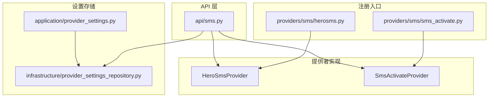
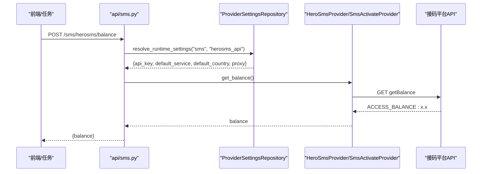
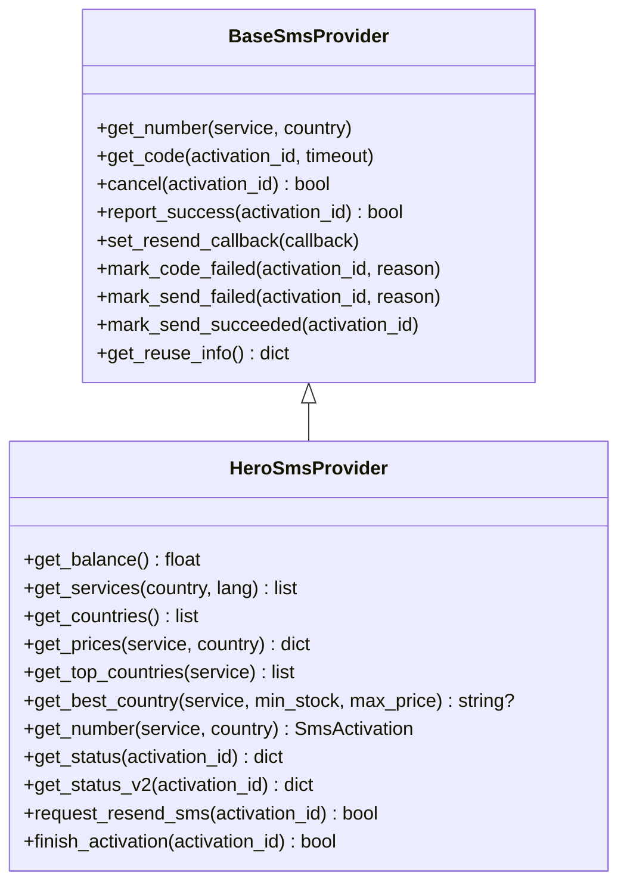
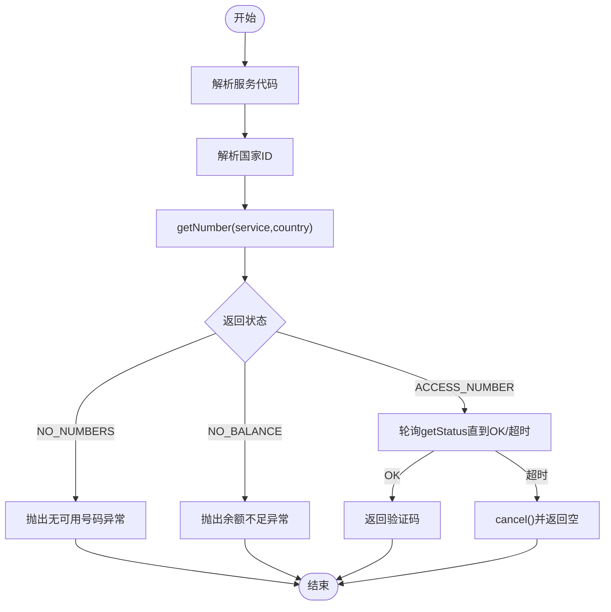
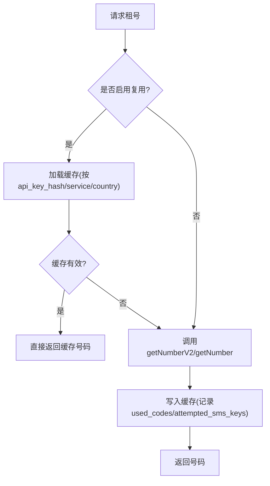
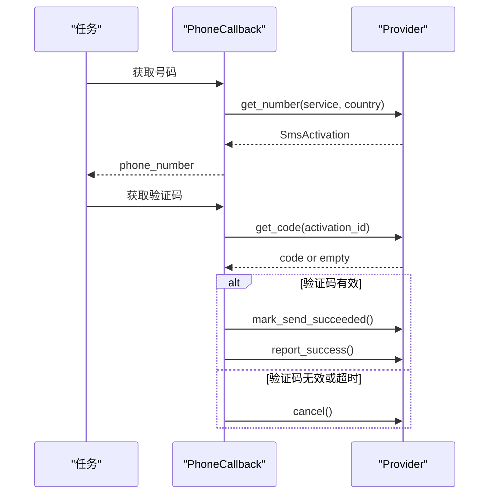
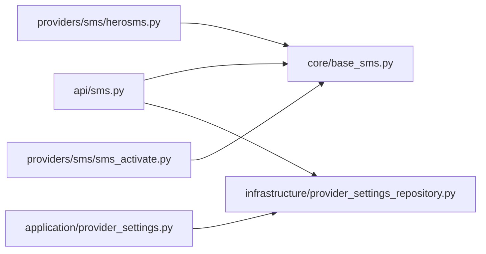

# 接码服务管理

<cite>
**本文引用的文件**
- [core/base_sms.py](file://core/base_sms.py)
- [providers/sms/herosms.py](file://providers/sms/herosms.py)
- [providers/sms/sms_activate.py](file://providers/sms/sms_activate.py)
- [api/sms.py](file://api/sms.py)
- [infrastructure/provider_settings_repository.py](file://infrastructure/provider_settings_repository.py)
- [application/provider_settings.py](file://application/provider_settings.py)
- [tests/test_herosms_api.py](file://tests/test_herosms_api.py)
- [tests/test_sms_provider.py](file://tests/test_sms_provider.py)
</cite>

## 目录
1. [简介](#简介)
2. [项目结构](#项目结构)
3. [核心组件](#核心组件)
4. [架构总览](#架构总览)
5. [详细组件分析](#详细组件分析)
6. [依赖关系分析](#依赖关系分析)
7. [性能与可用性](#性能与可用性)
8. [故障诊断指南](#故障诊断指南)
9. [结论](#结论)
10. [附录：API 参考](#附录api-参考)

## 简介
本章节面向“接码服务管理”功能，覆盖短信验证码接收服务的配置、管理与使用。重点包括：
- HeroSMS、SMS Activate 等接码服务的集成与配置（API Key、服务代码、国家 ID）
- HeroSMS 余额查询与价格查询能力（实时查看账户余额与服务价格）
- 国家选择、服务类型配置与号码池管理（含号码复用策略）
- 手机号验证流程中的自动获取与回填机制
- 接码服务的可用性测试与错误诊断

## 项目结构
接码服务相关代码主要分布在以下位置：
- 提供者实现与注册：providers/sms/*
- 通用基类与具体实现：core/base_sms.py
- API 暴露层：api/sms.py
- 设置持久化与解析：infrastructure/provider_settings_repository.py、application/provider_settings.py
- 单元测试：tests/test_*

图表来源
- [providers/sms/herosms.py:1-19](file://providers/sms/herosms.py#L1-L19)
- [providers/sms/sms_activate.py:1-11](file://providers/sms/sms_activate.py#L1-L11)
- [api/sms.py:1-215](file://api/sms.py#L1-L215)
- [infrastructure/provider_settings_repository.py:1-167](file://infrastructure/provider_settings_repository.py#L1-L167)
- [application/provider_settings.py:1-88](file://application/provider_settings.py#L1-L88)

章节来源
- [providers/sms/herosms.py:1-19](file://providers/sms/herosms.py#L1-L19)
- [providers/sms/sms_activate.py:1-11](file://providers/sms/sms_activate.py#L1-L11)
- [api/sms.py:1-215](file://api/sms.py#L1-L215)
- [infrastructure/provider_settings_repository.py:1-167](file://infrastructure/provider_settings_repository.py#L1-L167)
- [application/provider_settings.py:1-88](file://application/provider_settings.py#L1-L88)

## 核心组件
- BaseSmsProvider：抽象基类，定义租号、取码、取消、成功上报、重试回调等统一接口。
- SmsActivateProvider：基于 SMS-Activate 的接码实现，支持余额查询、租号、轮询取码、取消与成功上报。
- HeroSmsProvider：基于 HeroSMS 的接码实现，除基础能力外，还提供：
  - 余额查询、服务列表、国家列表、价格查询
  - 按价格排序的国家推荐与最优国家选择
  - 号码复用缓存（进程内 + 磁盘），支持最大成功次数限制
  - 状态查询 V1/V2，去重与重试逻辑
- API 路由：/api/sms/* 暴露 HeroSMS/SMSBower 的余额、价格、国家、服务等查询能力。
- ProviderSettingsRepository：负责 provider 设置的读取、合并、保存与默认值处理。

章节来源
- [core/base_sms.py:28-71](file://core/base_sms.py#L28-L71)
- [core/base_sms.py:108-182](file://core/base_sms.py#L108-L182)
- [core/base_sms.py:328-800](file://core/base_sms.py#L328-L800)
- [api/sms.py:12-147](file://api/sms.py#L12-L147)
- [infrastructure/provider_settings_repository.py:39-55](file://infrastructure/provider_settings_repository.py#L39-L55)

## 架构总览
接码服务在系统中的调用链如下：
- 前端或任务系统通过 /api/sms/* 调用余额、价格、国家、服务等查询接口
- API 层从 ProviderSettingsRepository 读取运行时配置（API Key、代理、默认国家/服务）
- 根据 provider_key 构造对应的 Provider 实例并执行操作
- 底层 Provider 调用第三方接码平台 API，返回结构化结果

图表来源
- [api/sms.py:64-73](file://api/sms.py#L64-L73)
- [core/base_sms.py:365-369](file://core/base_sms.py#L365-L369)
- [infrastructure/provider_settings_repository.py:39-55](file://infrastructure/provider_settings_repository.py#L39-L55)

## 详细组件分析

### HeroSMS 提供商
- 关键能力
  - 余额查询：get_balance
  - 服务与国家列表：get_services、get_countries
  - 价格查询：get_prices
  - 最优国家选择：get_best_country（结合库存与价格）
  - 号码租用：get_number（优先 V2 JSON，回退 V1 文本；动态计算 maxPrice）
  - 状态查询：get_status、get_status_v2（支持短信/电话通道、事件去重）
  - 号码复用：进程内缓存 + 磁盘持久化，支持 use_count 与 success_max 控制
- 配置项
  - api_key：必填
  - default_service：默认服务代码（如 OpenAI 常用 dr）
  - default_country：默认国家 ID（如 187）
  - max_price：价格上限（用于租号时避免过高成本）
  - proxy：HTTP/HTTPS 代理
  - reuse_phone_to_max：是否启用号码复用
  - phone_success_max：单号码最大成功次数

图表来源
- [core/base_sms.py:28-71](file://core/base_sms.py#L28-L71)
- [core/base_sms.py:328-800](file://core/base_sms.py#L328-L800)

章节来源
- [core/base_sms.py:328-800](file://core/base_sms.py#L328-L800)
- [providers/sms/herosms.py:1-19](file://providers/sms/herosms.py#L1-L19)

### SMS Activate 提供商
- 关键能力
  - 余额查询：get_balance
  - 服务映射：内置服务到平台服务代码映射表
  - 国家映射：国家代码到平台国家 ID 映射表
  - 租号：get_number（service/country 解析后调用）
  - 取码：get_code（轮询 getStatus，支持重试与取消）
  - 取消与成功上报：cancel、report_success
- 配置项
  - api_key：必填
  - default_country：默认国家（如 ru）
  - proxy：可选代理

图表来源
- [core/base_sms.py:77-106](file://core/base_sms.py#L77-L106)
- [core/base_sms.py:130-182](file://core/base_sms.py#L130-L182)

章节来源
- [core/base_sms.py:77-106](file://core/base_sms.py#L77-L106)
- [core/base_sms.py:108-182](file://core/base_sms.py#L108-L182)
- [providers/sms/sms_activate.py:1-11](file://providers/sms/sms_activate.py#L1-L11)

### 国家选择与号码池管理
- 国家选择
  - HeroSMS：提供 get_top_countries 与 get_best_country，按价格与库存筛选，支持最小库存与最高价格过滤。
  - SMS Activate：通过内置映射将国家名或数字 ID 转换为平台国家 ID。
- 号码池管理
  - HeroSMS：号码复用缓存（进程内 + 磁盘），记录已用验证码与尝试过的短信事件键，支持最大成功次数限制；当达到限制或过期则释放。
  - SMS Activate：每次租号为独立激活，无复用。

图表来源
- [core/base_sms.py:581-634](file://core/base_sms.py#L581-L634)
- [core/base_sms.py:725-765](file://core/base_sms.py#L725-L765)

章节来源
- [core/base_sms.py:527-579](file://core/base_sms.py#L527-L579)
- [core/base_sms.py:581-634](file://core/base_sms.py#L581-L634)
- [core/base_sms.py:725-765](file://core/base_sms.py#L725-L765)

### 手机号验证流程中的自动获取与回填
- 流程要点
  - 任务启动时，根据 provider_key 与运行时设置创建 Provider
  - 首次回调获取号码（get_number），随后等待验证码（get_code）
  - 若目标平台接受该号码，标记发送成功（mark_send_succeeded）
  - 若验证码无效，标记失败（mark_code_failed）并触发上游重试（如 HeroSMS 的重发）
  - 流程结束时，若未成功则取消激活（cancel），否则上报成功（report_success）
- 自动回填
  - 通过 create_phone_callbacks 封装回调与清理逻辑，确保资源释放与状态上报

图表来源
- [tests/test_sms_provider.py:90-167](file://tests/test_sms_provider.py#L90-L167)
- [core/base_sms.py:28-71](file://core/base_sms.py#L28-L71)

章节来源
- [tests/test_sms_provider.py:90-167](file://tests/test_sms_provider.py#L90-L167)
- [core/base_sms.py:28-71](file://core/base_sms.py#L28-L71)

### 可用性测试与错误诊断
- 余额与价格查询
  - 通过 /api/sms/herosms/balance 与 /api/sms/herosms/prices 进行连通性与配额检查
- 国家与服务列表
  - 通过 /api/sms/herosms/countries 与 /api/sms/herosms/services 校验平台数据可达性
- 常见错误
  - 未配置 API Key：返回 400，提示需配置
  - 余额不足：抛出异常，提示充值
  - 无可用号码：抛出异常，建议更换国家或服务
  - 网络错误：HTTP 异常，检查代理与网络

章节来源
- [api/sms.py:64-87](file://api/sms.py#L64-L87)
- [tests/test_herosms_api.py:14-27](file://tests/test_herosms_api.py#L14-L27)

## 依赖关系分析
- 模块耦合
  - api/sms.py 依赖 core.base_sms 的具体 Provider 与 infrastructure.provider_settings_repository 的设置解析
  - providers/sms/* 仅做注册与重导出，实际逻辑集中在 core.base_sms
  - application/provider_settings.py 封装 ProviderSettingsRepository 的序列化与选项输出
- 外部依赖
  - requests 用于 HTTP 请求
  - SQLModel 用于设置持久化（ProviderSettingModel）

图表来源
- [api/sms.py:1-215](file://api/sms.py#L1-L215)
- [core/base_sms.py:1-1266](file://core/base_sms.py#L1-L1266)
- [infrastructure/provider_settings_repository.py:1-167](file://infrastructure/provider_settings_repository.py#L1-L167)
- [application/provider_settings.py:1-88](file://application/provider_settings.py#L1-L88)
- [providers/sms/herosms.py:1-19](file://providers/sms/herosms.py#L1-L19)
- [providers/sms/sms_activate.py:1-11](file://providers/sms/sms_activate.py#L1-L11)

章节来源
- [api/sms.py:1-215](file://api/sms.py#L1-L215)
- [core/base_sms.py:1-1266](file://core/base_sms.py#L1-L1266)
- [infrastructure/provider_settings_repository.py:1-167](file://infrastructure/provider_settings_repository.py#L1-L167)
- [application/provider_settings.py:1-88](file://application/provider_settings.py#L1-L88)

## 性能与可用性
- 性能特性
  - HeroSMS 号码复用减少重复租号开销，降低延迟与成本
  - 动态 maxPrice 提升成功率，同时受用户配置上限保护
  - 状态查询 V2 支持多通道与事件去重，减少重复处理
- 可用性建议
  - 合理设置 max_price 与 min_stock，平衡成本与成功率
  - 配置代理以规避地区访问限制
  - 定期通过余额与价格接口监控账户健康

[本节为通用指导，不直接分析具体文件]

## 故障诊断指南
- 未配置 API Key
  - 现象：余额/价格接口返回 400，提示未配置
  - 处理：在 ProviderSettingsRepository 中保存 herosms_api_key 或通过请求体传入
- 余额不足
  - 现象：租号时报错，提示余额不足
  - 处理：充值后重试
- 无可用号码
  - 现象：租号失败，提示 NO_NUMBERS
  - 处理：切换国家或服务，或提高 max_price
- 验证码无效
  - 现象：目标平台拒绝验证码
  - 处理：调用 mark_code_failed 触发上游重发，或重新租号
- 网络错误
  - 现象：HTTP 异常
  - 处理：检查代理配置与网络连通性

章节来源
- [api/sms.py:64-87](file://api/sms.py#L64-L87)
- [core/base_sms.py:130-182](file://core/base_sms.py#L130-L182)
- [core/base_sms.py:365-369](file://core/base_sms.py#L365-L369)
- [tests/test_herosms_api.py:14-27](file://tests/test_herosms_api.py#L14-L27)

## 结论
本系统提供了统一的接码服务管理能力，涵盖 HeroSMS 与 SMS Activate 两大主流平台。通过标准化的 Provider 抽象、灵活的设置解析与丰富的 API 暴露，实现了：
- 便捷的余额与价格查询
- 智能的国家选择与号码复用
- 完整的手机号验证流程自动化
- 完善的错误诊断与可用性检测

建议在生产环境中结合业务需求合理配置国家、服务与价格上限，并持续监控余额与成功率。

[本节为总结，不直接分析具体文件]

## 附录：API 参考
- HeroSMS
  - GET /api/sms/herosms/countries：获取国家列表
  - GET /api/sms/herosms/services?country=...：获取服务列表
  - POST /api/sms/herosms/balance：查询余额
  - POST /api/sms/herosms/prices：查询价格
  - POST /api/sms/herosms/top-countries：获取按价格排序的国家（含库存）
  - POST /api/sms/herosms/best-country：自动选择最优国家

- SMSBower（同构接口）
  - GET /api/sms/smsbower/countries
  - GET /api/sms/smsbower/services
  - POST /api/sms/smsbower/balance
  - POST /api/sms/smsbower/prices

章节来源
- [api/sms.py:48-147](file://api/sms.py#L48-L147)
- [api/sms.py:169-215](file://api/sms.py#L169-L215)