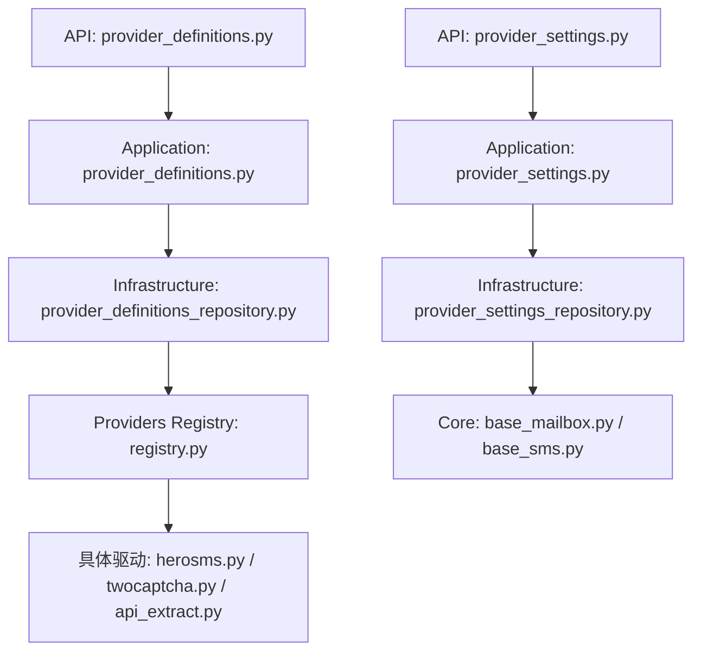
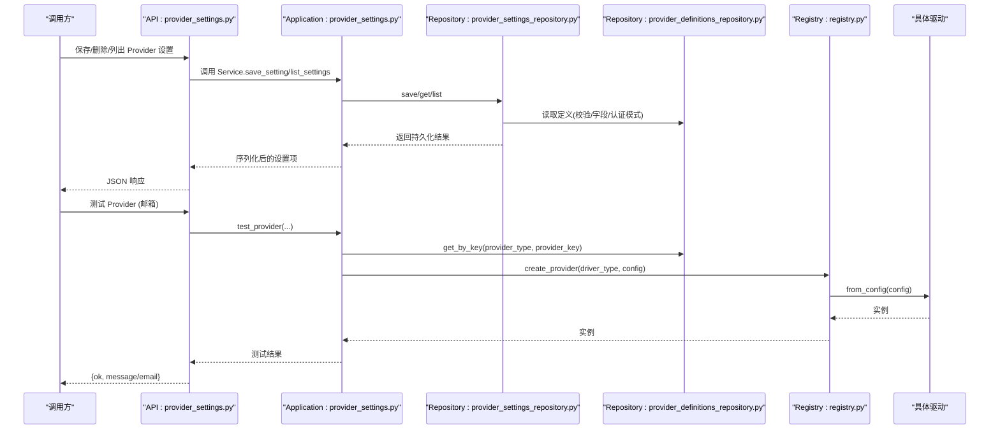
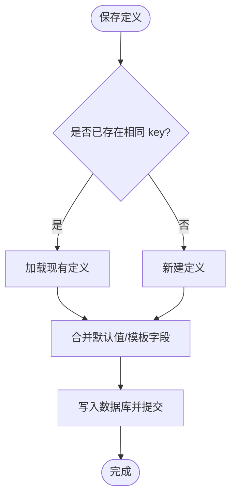
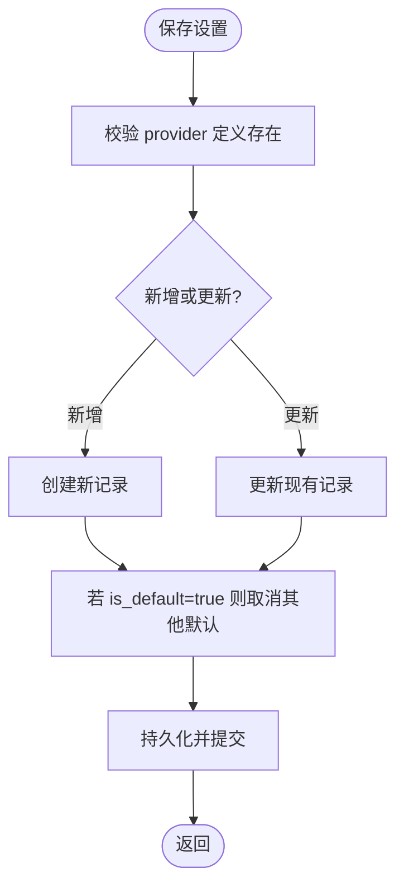
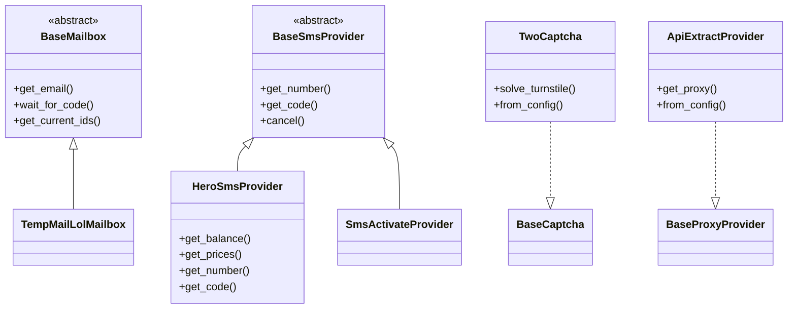
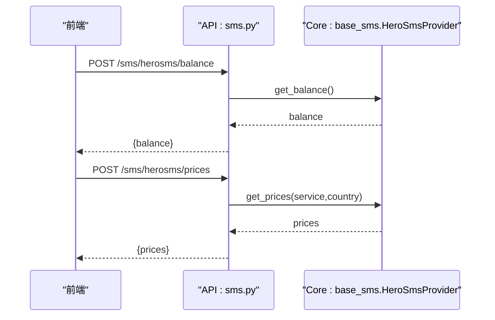
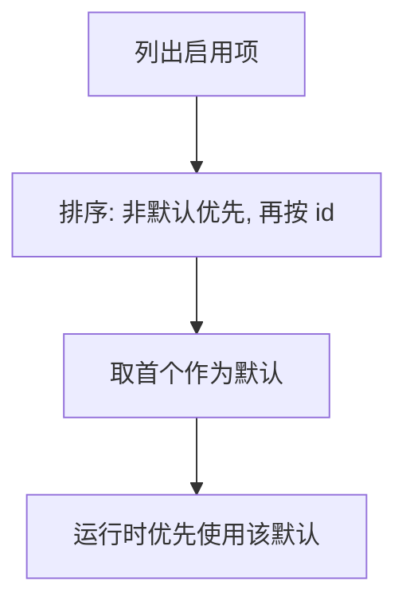
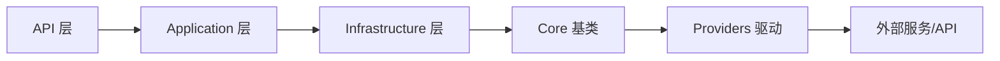

# 第三方服务管理

<cite>
**本文引用的文件**
- [api/provider_settings.py](file://api/provider_settings.py)
- [application/provider_settings.py](file://application/provider_settings.py)
- [infrastructure/provider_settings_repository.py](file://infrastructure/provider_settings_repository.py)
- [api/provider_definitions.py](file://api/provider_definitions.py)
- [application/provider_definitions.py](file://application/provider_definitions.py)
- [infrastructure/provider_definitions_repository.py](file://infrastructure/provider_definitions_repository.py)
- [providers/registry.py](file://providers/registry.py)
- [core/base_mailbox.py](file://core/base_mailbox.py)
- [core/base_sms.py](file://core/base_sms.py)
- [providers/sms/herosms.py](file://providers/sms/herosms.py)
- [providers/captcha/twocaptcha.py](file://providers/captcha/twocaptcha.py)
- [providers/proxy/api_extract.py](file://providers/proxy/api_extract.py)
- [api/sms.py](file://api/sms.py)
</cite>

## 目录
1. [简介](#简介)
2. [项目结构](#项目结构)
3. [核心组件](#核心组件)
4. [架构总览](#架构总览)
5. [详细组件分析](#详细组件分析)
6. [依赖关系分析](#依赖关系分析)
7. [性能与可用性](#性能与可用性)
8. [故障排查指南](#故障排查指南)
9. [结论](#结论)
10. [附录：API 参考](#附录api-参考)

## 简介
本章节面向“第三方服务管理”能力，覆盖邮箱服务、验证码服务、接码服务的配置与管理。内容包括：
- Provider 定义（驱动模板）的增删改查与启用控制
- Provider 实例（具体配置项）的添加、编辑、删除、默认设置
- 认证方式配置（API Key、用户名密码、Token、Bearer、账号池等）
- 动态创建自定义驱动与字段定义
- Provider 测试工具（以 HeroSMS 余额查询与价格查询为例）
- Provider 启用/禁用状态管理与优先级（默认优先、排序规则）

## 项目结构
系统采用分层设计：
- API 层：暴露 HTTP 接口，负责参数校验与错误映射
- Application 层：业务编排，组合 Repository 与领域逻辑
- Infrastructure 层：数据持久化（Provider 定义与实例）、运行时解析
- Providers 层：各类型驱动的注册与实现（邮箱、验证码、短信、代理）
- Core 层：通用基类与工厂（BaseMailbox/BaseSms 等）

**图表来源**
- [api/provider_settings.py:1-120](file://api/provider_settings.py#L1-L120)
- [application/provider_settings.py:1-88](file://application/provider_settings.py#L1-L88)
- [infrastructure/provider_settings_repository.py:1-167](file://infrastructure/provider_settings_repository.py#L1-L167)
- [api/provider_definitions.py:1-53](file://api/provider_definitions.py#L1-L53)
- [application/provider_definitions.py:1-54](file://application/provider_definitions.py#L1-L54)
- [infrastructure/provider_definitions_repository.py:1-561](file://infrastructure/provider_definitions_repository.py#L1-L561)
- [providers/registry.py:1-91](file://providers/registry.py#L1-L91)
- [core/base_mailbox.py:1-350](file://core/base_mailbox.py#L1-L350)
- [core/base_sms.py:1-800](file://core/base_sms.py#L1-L800)
- [providers/sms/herosms.py:1-19](file://providers/sms/herosms.py#L1-L19)
- [providers/captcha/twocaptcha.py:1-64](file://providers/captcha/twocaptcha.py#L1-L64)
- [providers/proxy/api_extract.py:1-106](file://providers/proxy/api_extract.py#L1-L106)

**章节来源**
- [api/provider_settings.py:1-120](file://api/provider_settings.py#L1-L120)
- [application/provider_settings.py:1-88](file://application/provider_settings.py#L1-L88)
- [infrastructure/provider_settings_repository.py:1-167](file://infrastructure/provider_settings_repository.py#L1-L167)
- [api/provider_definitions.py:1-53](file://api/provider_definitions.py#L1-L53)
- [application/provider_definitions.py:1-54](file://application/provider_definitions.py#L1-L54)
- [infrastructure/provider_definitions_repository.py:1-561](file://infrastructure/provider_definitions_repository.py#L1-L561)
- [providers/registry.py:1-91](file://providers/registry.py#L1-L91)

## 核心组件
- Provider 定义（Definition）：描述某类服务的“驱动模板”，包含 label、description、driver_type、auth_modes、fields、enabled、category、metadata 等元信息。用于前端渲染表单和运行时校验。
- Provider 实例（Setting）：用户针对某个 driver_type 的具体配置，包括 display_name、auth_mode、enabled、is_default、config、auth、metadata。
- 注册表（Registry）：统一发现并创建 Provider 实例，要求驱动类提供 from_config(config) 方法。
- 运行时解析（Runtime Resolve）：将 Definition 默认值 + Setting 配置 + 覆盖参数合并为最终运行配置。
- 工厂与基类：BaseMailbox/BaseSms 抽象出通用行为；具体驱动通过注册表创建。

**章节来源**
- [infrastructure/provider_definitions_repository.py:17-384](file://infrastructure/provider_definitions_repository.py#L17-L384)
- [infrastructure/provider_settings_repository.py:39-55](file://infrastructure/provider_settings_repository.py#L39-L55)
- [providers/registry.py:51-62](file://providers/registry.py#L51-L62)
- [core/base_mailbox.py:27-48](file://core/base_mailbox.py#L27-L48)
- [core/base_sms.py:28-70](file://core/base_sms.py#L28-L70)

## 架构总览
下图展示了从 API 到存储与驱动的完整调用链，以及 Provider 定义与实例的关系。

**图表来源**
- [api/provider_settings.py:25-82](file://api/provider_settings.py#L25-L82)
- [application/provider_settings.py:12-52](file://application/provider_settings.py#L12-L52)
- [infrastructure/provider_settings_repository.py:109-167](file://infrastructure/provider_settings_repository.py#L109-L167)
- [infrastructure/provider_definitions_repository.py:437-474](file://infrastructure/provider_definitions_repository.py#L437-L474)
- [providers/registry.py:51-62](file://providers/registry.py#L51-L62)

## 详细组件分析

### Provider 定义（驱动模板）管理
- 功能要点
  - 列表查询：按 provider_type 过滤，支持仅启用项
  - 新增/编辑：保存 label、description、driver_type、default_auth_mode、enabled、metadata
  - 删除：若存在对应实例则拒绝删除，避免误删
  - 内置种子：启动时同步内置定义，确保字段/认证模式更新生效
  - 驱动模板：按 driver_type 去重，返回可用模板供前端选择

- 关键流程
  - 保存时若未提供 auth_modes/fields，会尝试复用同 driver_type 的已有定义作为模板
  - 删除前检查是否存在关联的 Provider 实例

**图表来源**
- [infrastructure/provider_definitions_repository.py:495-544](file://infrastructure/provider_definitions_repository.py#L495-L544)
- [infrastructure/provider_definitions_repository.py:387-434](file://infrastructure/provider_definitions_repository.py#L387-L434)

**章节来源**
- [api/provider_definitions.py:24-52](file://api/provider_definitions.py#L24-L52)
- [application/provider_definitions.py:10-35](file://application/provider_definitions.py#L10-L35)
- [infrastructure/provider_definitions_repository.py:387-561](file://infrastructure/provider_definitions_repository.py#L387-L561)

### Provider 实例（配置项）管理
- 功能要点
  - 列表：按 provider_type 获取所有实例
  - 新增/编辑：保存 display_name、auth_mode、enabled、is_default、config、auth、metadata
  - 删除：删除后若该类型原默认被删，自动提升下一个为默认
  - 默认设置：同一类型仅一个 is_default=true，保存时会互斥处理
  - 运行时解析：Definition 默认值 + Setting 配置 + 覆盖参数，形成最终配置

- 优先级与排序
  - 启用列表排序：非默认排在前面，其次按 id 升序
  - 默认优先：get_default_provider_key 取第一个启用的 provider_key

**图表来源**
- [infrastructure/provider_settings_repository.py:109-167](file://infrastructure/provider_settings_repository.py#L109-L167)
- [infrastructure/provider_settings_repository.py:81-83](file://infrastructure/provider_settings_repository.py#L81-L83)
- [infrastructure/provider_settings_repository.py:57-65](file://infrastructure/provider_settings_repository.py#L57-L65)

**章节来源**
- [api/provider_settings.py:25-51](file://api/provider_settings.py#L25-L51)
- [application/provider_settings.py:12-35](file://application/provider_settings.py#L12-L35)
- [infrastructure/provider_settings_repository.py:19-83](file://infrastructure/provider_settings_repository.py#L19-L83)

### 认证方式配置
- 支持的认证模式由 Definition 的 auth_modes 决定，常见包括：
  - API Key（如 YesCaptcha、HeroSMS、SMSBower）
  - 用户名+密码（如 MoeMail、FreeMail）
  - Token/Bearer（如 CF Worker、DuckMail、DDG Email）
  - 账号池（本地微软邮箱池）
- 运行时合并策略：Definition 默认值 -> Setting 的 config/auth -> 覆盖参数
- 敏感字段标记为 secret，前端展示时进行脱敏预览

**章节来源**
- [infrastructure/provider_definitions_repository.py:17-384](file://infrastructure/provider_definitions_repository.py#L17-L384)
- [infrastructure/provider_settings_repository.py:39-55](file://infrastructure/provider_settings_repository.py#L39-L55)
- [application/provider_settings.py:54-87](file://application/provider_settings.py#L54-L87)

### 动态创建自定义驱动与字段
- 步骤
  1) 在 providers 目录下实现驱动类，继承 BaseMailbox/BaseSms/BaseProxy 等基类
  2) 使用 @register_provider("type", "driver_type") 装饰器注册
  3) 实现 from_config(config) 类方法，从配置构造实例
  4) 在 Provider 定义中声明 fields（含 type、placeholder、hint、asyncUrl 等）
  5) 通过 API 新增/编辑定义，即可在前端生成表单并保存实例

- 示例参考
  - 邮箱：generic_http_mailbox 通过 pipeline_config 对接任意 HTTP 邮箱 API
  - 验证码：TwoCaptcha 通过 API Key 提交 Turnstile 任务
  - 代理：ApiExtractProvider 从 HTTP API 拉取代理列表

**图表来源**
- [core/base_mailbox.py:27-48](file://core/base_mailbox.py#L27-L48)
- [core/base_sms.py:28-70](file://core/base_sms.py#L28-L70)
- [providers/captcha/twocaptcha.py:6-17](file://providers/captcha/twocaptcha.py#L6-L17)
- [providers/proxy/api_extract.py:16-52](file://providers/proxy/api_extract.py#L16-L52)
- [core/base_sms.py:328-429](file://core/base_sms.py#L328-L429)

**章节来源**
- [providers/registry.py:38-62](file://providers/registry.py#L38-L62)
- [providers/captcha/twocaptcha.py:1-64](file://providers/captcha/twocaptcha.py#L1-L64)
- [providers/proxy/api_extract.py:1-106](file://providers/proxy/api_extract.py#L1-L106)
- [core/base_mailbox.py:262-348](file://core/base_mailbox.py#L262-L348)

### Provider 测试工具（以 HeroSMS 为例）
- 在线测试
  - 邮箱 Provider 测试：POST /provider-settings/test，传入 provider_type、provider_key、config、auth，系统将尝试创建邮箱或 peek 邮件，返回成功信息与邮箱地址
  - 验证码/接码：当前不支持在线测试，需在注册任务中验证

- 余额与价格查询
  - POST /sms/herosms/balance：传入 api_key/service/country，返回余额
  - POST /sms/herosms/prices：传入 api_key/service/country，返回价格与库存

**图表来源**
- [api/sms.py:64-87](file://api/sms.py#L64-L87)
- [core/base_sms.py:365-429](file://core/base_sms.py#L365-L429)

**章节来源**
- [api/provider_settings.py:54-120](file://api/provider_settings.py#L54-L120)
- [api/sms.py:64-87](file://api/sms.py#L64-L87)
- [core/base_sms.py:365-429](file://core/base_sms.py#L365-L429)

### 启用/禁用与优先级
- 启用列表：list_enabled 返回 enabled=true 的 Provider 实例，并按“非默认优先、id 升序”排序
- 默认 Provider：get_default_provider_key 返回第一个启用的 provider_key；保存时 is_default=true 会取消其他默认
- 验证码协议顺序：get_enabled_captcha_order 排除 manual/local_solver，返回远程验证码提供商顺序

**图表来源**
- [infrastructure/provider_settings_repository.py:57-83](file://infrastructure/provider_settings_repository.py#L57-L83)

**章节来源**
- [infrastructure/provider_settings_repository.py:57-83](file://infrastructure/provider_settings_repository.py#L57-L83)

## 依赖关系分析
- 耦合与内聚
  - API 层薄封装，主要职责为参数校验与异常映射
  - Application 层聚合 Repository，保持单一职责
  - Repository 专注数据访问与运行时配置合并
  - Providers 通过全局注册表解耦，新增驱动无需修改核心逻辑
- 外部依赖
  - SQLModel/SQLAlchemy 用于持久化
  - requests/curl_cffi 用于 HTTP 请求
  - Camoufox 浏览器用于 Web 邮箱场景
- 潜在循环依赖
  - core.base_mailbox 在 create_mailbox 中引用 infrastructure 仓库，属于单向依赖，无循环

**图表来源**
- [api/provider_settings.py:1-120](file://api/provider_settings.py#L1-L120)
- [application/provider_settings.py:1-88](file://application/provider_settings.py#L1-L88)
- [infrastructure/provider_settings_repository.py:1-167](file://infrastructure/provider_settings_repository.py#L1-L167)
- [core/base_mailbox.py:289-348](file://core/base_mailbox.py#L289-L348)

**章节来源**
- [providers/registry.py:70-91](file://providers/registry.py#L70-L91)
- [core/base_mailbox.py:289-348](file://core/base_mailbox.py#L289-L348)

## 性能与可用性
- 并发与锁
  - HeroSMS 使用线程锁保护缓存与状态，避免重复号码分配与并发冲突
- 重试与降级
  - Temp-Mail Web 遇到 429 会指数退避重试
  - HeroSMS 获取号码失败时回退至旧版接口
- 缓存
  - HeroSMS 号码复用缓存（文件持久化），支持最大复用次数与过期时间
- 建议
  - 合理设置超时与重试次数
  - 对高延迟外部服务增加熔断/降级策略
  - 监控外部 API 成功率与耗时

[本节为通用指导，不直接分析具体文件]

## 故障排查指南
- 保存设置时报“未知 provider”
  - 检查 provider_type/provider_key 是否在定义中存在
  - 确认定义已启用且 driver_type 正确
- 删除定义时报“请先删除对应 provider 配置”
  - 需先删除所有相关实例后再删除定义
- 测试邮箱失败
  - 检查 driver_type 是否正确，配置是否齐全
  - 查看返回 detail 中的堆栈片段定位问题
- HeroSMS 余额/价格查询失败
  - 确认 api_key 有效，网络可达
  - 检查 service/country 是否匹配平台支持范围

**章节来源**
- [infrastructure/provider_settings_repository.py:123-131](file://infrastructure/provider_settings_repository.py#L123-L131)
- [infrastructure/provider_definitions_repository.py:546-560](file://infrastructure/provider_definitions_repository.py#L546-L560)
- [api/provider_settings.py:61-120](file://api/provider_settings.py#L61-L120)
- [api/sms.py:64-87](file://api/sms.py#L64-L87)

## 结论
本系统通过“定义 + 实例 + 注册表 + 基类”的分层设计，实现了第三方服务的灵活扩展与统一管理。用户可便捷地配置邮箱、验证码、接码与代理服务，并通过统一的 API 进行测试与运维。内置种子定义与运行时解析机制确保了配置的健壮性与可维护性。

[本节为总结，不直接分析具体文件]

## 附录：API 参考
- Provider 设置
  - GET /provider-settings?provider_type=...
  - PUT /provider-settings
  - POST /provider-settings
  - DELETE /provider-settings/{setting_id}
  - POST /provider-settings/test
- Provider 定义
  - GET /provider-definitions?provider_type=...&enabled_only=...
  - GET /provider-definitions/drivers?provider_type=...
  - PUT /provider-definitions
  - POST /provider-definitions
  - DELETE /provider-definitions/{definition_id}
- HeroSMS 工具
  - POST /sms/herosms/balance
  - POST /sms/herosms/prices

**章节来源**
- [api/provider_settings.py:25-120](file://api/provider_settings.py#L25-L120)
- [api/provider_definitions.py:24-52](file://api/provider_definitions.py#L24-L52)
- [api/sms.py:64-87](file://api/sms.py#L64-L87)