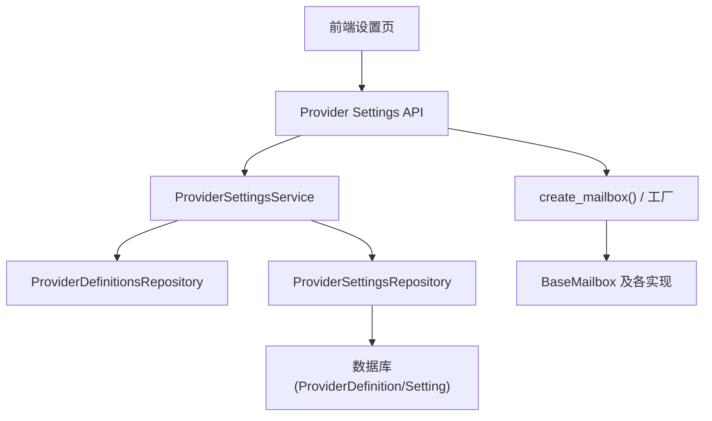
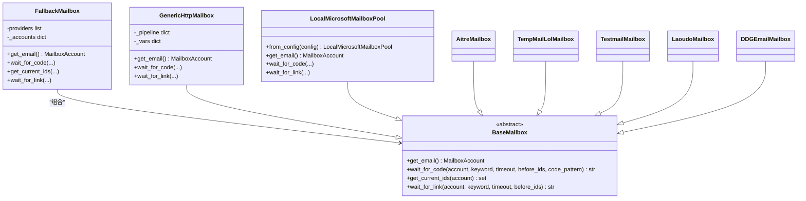
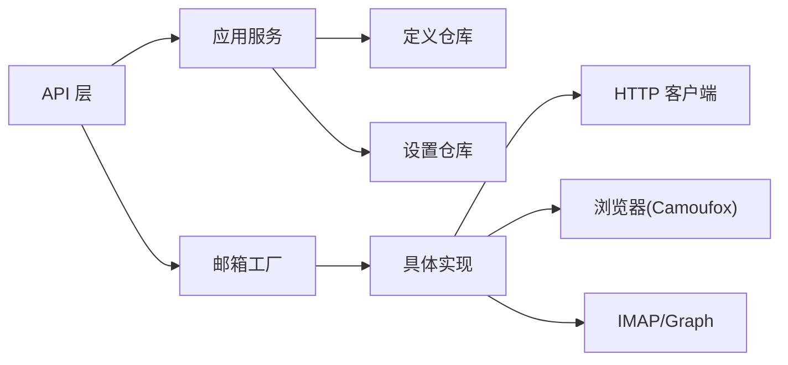
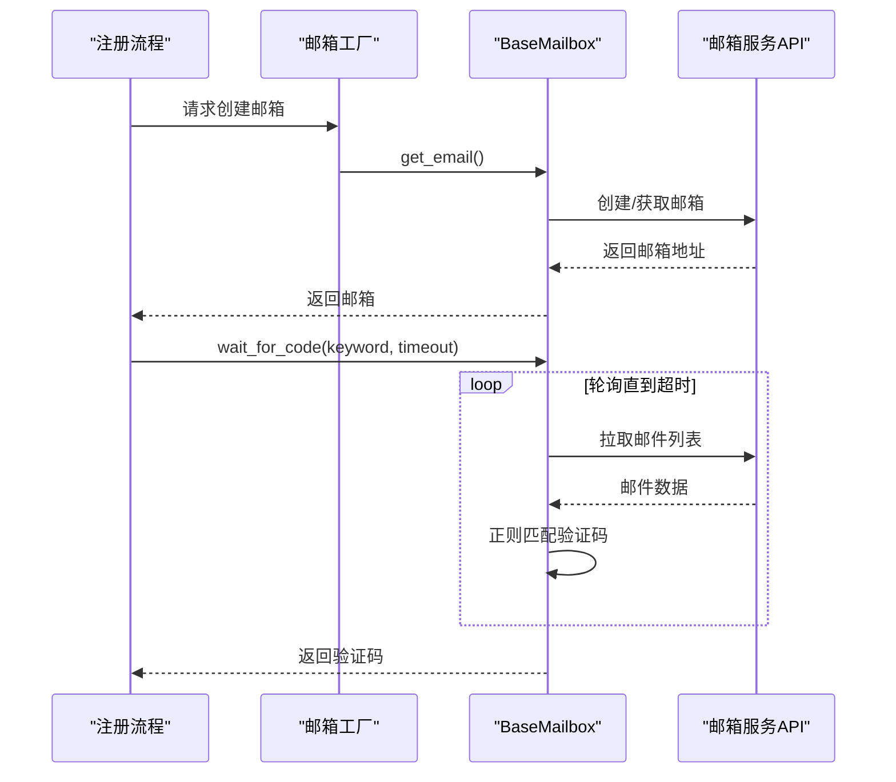

# 邮箱服务管理

<cite>
**本文引用的文件**
- [core/base_mailbox.py](file://core/base_mailbox.py)
- [core/generic_http_mailbox.py](file://core/generic_http_mailbox.py)
- [core/local_ms_mailbox.py](file://core/local_ms_mailbox.py)
- [providers/registry.py](file://providers/registry.py)
- [providers/mailbox/aitre.py](file://providers/mailbox/aitre.py)
- [providers/mailbox/tempmail_lol.py](file://providers/mailbox/tempmail_lol.py)
- [infrastructure/provider_definitions_repository.py](file://infrastructure/provider_definitions_repository.py)
- [infrastructure/provider_settings_repository.py](file://infrastructure/provider_settings_repository.py)
- [application/provider_settings.py](file://application/provider_settings.py)
- [api/provider_settings.py](file://api/provider_settings.py)
</cite>

## 目录
1. [简介](#简介)
2. [项目结构](#项目结构)
3. [核心组件](#核心组件)
4. [架构总览](#架构总览)
5. [详细组件分析](#详细组件分析)
6. [依赖关系分析](#依赖关系分析)
7. [性能与可用性考虑](#性能与可用性考虑)
8. [故障排查指南](#故障排查指南)
9. [结论](#结论)
10. [附录：注册流程中的邮箱使用](#附录注册流程中的邮箱使用)

## 简介
本章节介绍系统内“邮箱服务管理”能力，包括临时邮箱服务的配置、启用/禁用、默认邮箱设置、认证方式（API Key、Bearer Token、IMAP/Graph等）以及测试工具。系统内置并支持多种邮箱服务提供商（如 AItre、TempMail.lol、Testmail、DuckDuckGo Email、本地微软邮箱池等），并提供通用 HTTP 驱动以对接任意邮箱 API。邮箱服务在账户注册流程中用于自动获取邮箱地址、轮询接收验证码或验证链接，从而完成平台账号的注册与激活。

## 项目结构
邮箱服务管理由以下层次组成：
- 运行时实现层：提供各邮箱 Provider 的具体实现与统一抽象基类
- 定义与配置层：通过数据库维护 Provider 的定义（字段、认证模式、元数据）和用户配置（API 密钥、服务端点、开关、是否默认）
- 应用服务层：封装增删改查、序列化、默认值与策略
- API 层：对外暴露 REST 接口，包含列表、保存、删除与测试能力
- 工厂与注册层：根据 provider_key/driver_type 动态创建具体实例，支持多 Provider 回退

图表来源
- [api/provider_settings.py:25-51](file://api/provider_settings.py#L25-L51)
- [application/provider_settings.py:7-35](file://application/provider_settings.py#L7-L35)
- [infrastructure/provider_definitions_repository.py:387-474](file://infrastructure/provider_definitions_repository.py#L387-L474)
- [infrastructure/provider_settings_repository.py:15-65](file://infrastructure/provider_settings_repository.py#L15-L65)
- [core/base_mailbox.py:289-347](file://core/base_mailbox.py#L289-L347)

章节来源
- [api/provider_settings.py:25-51](file://api/provider_settings.py#L25-L51)
- [application/provider_settings.py:7-35](file://application/provider_settings.py#L7-L35)
- [infrastructure/provider_definitions_repository.py:387-474](file://infrastructure/provider_definitions_repository.py#L387-L474)
- [infrastructure/provider_settings_repository.py:15-65](file://infrastructure/provider_settings_repository.py#L15-L65)
- [core/base_mailbox.py:289-347](file://core/base_mailbox.py#L289-L347)

## 核心组件
- BaseMailbox 抽象：定义 get_email、wait_for_code、get_current_ids、wait_for_link 等统一接口
- FallbackMailbox：按顺序尝试多个 Provider，创建成功后固定使用同一 Provider 收件
- 具体 Provider：Aitre、TempMail.lol、Temp-Mail Web、Testmail、Laoudo、DDG Email、Local Microsoft Pool、通用 HTTP 驱动
- 定义仓库：维护内置 Provider 的 label、描述、字段、认证模式、元数据（pipeline）
- 设置仓库：持久化用户配置（enabled、is_default、config/auth/metadata）、解析运行时参数
- 应用服务：序列化、默认策略、批量选项
- API：提供列表、新增/更新、删除、测试接口

章节来源
- [core/base_mailbox.py:20-118](file://core/base_mailbox.py#L20-L118)
- [core/base_mailbox.py:350-800](file://core/base_mailbox.py#L350-L800)
- [core/generic_http_mailbox.py:75-161](file://core/generic_http_mailbox.py#L75-L161)
- [core/local_ms_mailbox.py:161-200](file://core/local_ms_mailbox.py#L161-L200)
- [infrastructure/provider_definitions_repository.py:17-238](file://infrastructure/provider_definitions_repository.py#L17-L238)
- [infrastructure/provider_settings_repository.py:39-83](file://infrastructure/provider_settings_repository.py#L39-L83)
- [application/provider_settings.py:7-88](file://application/provider_settings.py#L7-L88)
- [api/provider_settings.py:12-51](file://api/provider_settings.py#L12-L51)

## 架构总览
邮箱服务采用“定义 + 配置 + 工厂 + 实现”的分层设计：
- 定义层：声明每个 Provider 的字段、认证模式、分类、是否启用等元信息
- 配置层：用户填写 API Key、服务端点、用户名/密码、命名空间等，并标记是否启用和是否为默认
- 工厂层：根据 provider_key 与 enabled 状态构建实例，支持显式 fallbacks 与全局已启用集合
- 实现层：各 Provider 实现统一的 BaseMailbox 接口；通用 HTTP 驱动通过 pipeline 配置零代码接入新邮箱

图表来源
- [core/base_mailbox.py:20-118](file://core/base_mailbox.py#L20-L118)
- [core/base_mailbox.py:350-800](file://core/base_mailbox.py#L350-L800)
- [core/generic_http_mailbox.py:75-161](file://core/generic_http_mailbox.py#L75-L161)
- [core/local_ms_mailbox.py:161-200](file://core/local_ms_mailbox.py#L161-L200)

## 详细组件分析

### 邮箱 Provider 定义与字段
- 内置定义集中维护于定义仓库，包含 mailbox/captcha/sms/proxy 三类
- 对 mailbox 类型，定义了各 Provider 的 label、description、driver_type、auth_modes、fields、category、enabled 等
- 启动时会将内置种子数据同步到数据库，确保字段与说明随版本升级而更新

章节来源
- [infrastructure/provider_definitions_repository.py:17-238](file://infrastructure/provider_definitions_repository.py#L17-L238)
- [infrastructure/provider_definitions_repository.py:387-434](file://infrastructure/provider_definitions_repository.py#L387-L434)

### 邮箱 Provider 配置与运行参数解析
- 用户配置存储在 ProviderSettingModel，包含 config/auth/metadata
- 运行时通过 resolve_runtime_settings 合并：定义默认值 → 用户配置 → 覆盖参数
- 支持 enabled 与 is_default 控制可用性与优先级

章节来源
- [infrastructure/provider_settings_repository.py:39-83](file://infrastructure/provider_settings_repository.py#L39-L83)

### 邮箱服务工厂与回退机制
- create_mailbox 根据 provider_key 查找定义与设置，组装 ordered_keys（首选 + 显式 fallbacks + 所有已启用）
- 若仅一个可用则直接返回实例；否则返回 FallbackMailbox 按序尝试
- 初始化失败时记录日志并跳过非首选项，保证健壮性

章节来源
- [core/base_mailbox.py:289-347](file://core/base_mailbox.py#L289-L347)

### 通用 HTTP 邮箱驱动（零代码扩展）
- 通过 metadata.pipeline 或 flat settings 构建步骤管道：auth_steps → create_email → list_emails → get_detail
- 支持 Bearer/Header/API Key 等多种认证注入，支持 cookie 提取与变量传递
- 支持 email_mode=fixed/namespace_tag/generate，灵活适配不同邮箱服务

章节来源
- [core/generic_http_mailbox.py:75-161](file://core/generic_http_mailbox.py#L75-L161)
- [core/generic_http_mailbox.py:165-267](file://core/generic_http_mailbox.py#L165-L267)
- [core/generic_http_mailbox.py:270-474](file://core/generic_http_mailbox.py#L270-L474)

### 本地微软邮箱池（已有 Outlook/Hotmail/Live 账号）
- 支持导入心蓝邮箱助手通用格式文本/文件，解析为账号条目
- 优先通过 Microsoft Graph（Client Id + Refresh Token）收信，无 OAuth 时回退 IMAP
- 支持占用状态文件避免重复分配，可配置允许复用

章节来源
- [core/local_ms_mailbox.py:161-200](file://core/local_ms_mailbox.py#L161-L200)

### 具体 Provider 示例
- Aitre：固定邮箱地址，轮询 API 获取验证码或链接
- TempMail.lol：无需注册，自动生成邮箱，轮询 inbox 获取验证码或链接
- Temp-Mail Web：基于浏览器环境调用 Web API，处理限流重试
- Testmail：通过 namespace/tag 生成邮箱，查询 inbox 获取验证码或链接
- Laoudo：固定域名邮箱，通过 token 拉取邮件
- DDG Email：生成 @duck.com 别名，通过 IMAP 从转发邮箱读取验证码

章节来源
- [core/base_mailbox.py:350-800](file://core/base_mailbox.py#L350-L800)
- [core/base_mailbox.py:1628-1815](file://core/base_mailbox.py#L1628-L1815)
- [providers/mailbox/aitre.py:1-6](file://providers/mailbox/aitre.py#L1-L6)
- [providers/mailbox/tempmail_lol.py:1-6](file://providers/mailbox/tempmail_lol.py#L1-L6)

### 添加、编辑、删除邮箱 Provider
- 添加/编辑：调用 Provider Settings API 的 PUT/POST，提交 provider_type、provider_key、display_name、auth_mode、enabled、is_default、config、auth、metadata
- 删除：调用 DELETE /{setting_id}，删除后若原默认被删，会自动将下一条设为默认
- 列表：GET 按 provider_type 列出当前所有设置，含字段、认证模式预览

章节来源
- [api/provider_settings.py:25-51](file://api/provider_settings.py#L25-L51)
- [application/provider_settings.py:16-35](file://application/provider_settings.py#L16-L35)
- [infrastructure/provider_settings_repository.py:85-107](file://infrastructure/provider_settings_repository.py#L85-L107)

### 认证方式与服务端点配置
- 认证模式：Bearer Token、Header、API Key 作为查询参数、账号密码、Session Token、Pool（微软邮箱池）
- 服务端点：各 Provider 支持自定义 API URL/Base URL，或通过 metadata.pipeline 指定端点路径
- 安全：敏感字段标记为 secret，前端展示时进行脱敏预览

章节来源
- [infrastructure/provider_definitions_repository.py:17-238](file://infrastructure/provider_definitions_repository.py#L17-L238)
- [core/generic_http_mailbox.py:165-191](file://core/generic_http_mailbox.py#L165-L191)
- [application/provider_settings.py:54-88](file://application/provider_settings.py#L54-L88)

### 启用/禁用与默认邮箱设置
- enabled：控制该 Provider 是否参与运行时选择
- is_default：标记默认项；保存时自动去重，确保唯一默认；删除默认项时自动提升下一个为默认
- 运行时排序：默认优先，其次按 id 排序

章节来源
- [infrastructure/provider_settings_repository.py:57-83](file://infrastructure/provider_settings_repository.py#L57-L83)
- [infrastructure/provider_settings_repository.py:145-166](file://infrastructure/provider_settings_repository.py#L145-L166)

### 测试工具：验证邮箱接收功能与可用性
- 提供 /provider-settings/test 接口，传入 provider_type、provider_key、config、auth
- 对于 mailbox 类型，会尝试创建邮箱或 peek 可用邮箱，返回成功信息与邮箱地址
- 错误时返回错误消息与堆栈片段，便于定位配置问题

章节来源
- [api/provider_settings.py:54-120](file://api/provider_settings.py#L54-L120)

## 依赖关系分析
- 模块耦合：API 层依赖应用服务；应用服务依赖定义与设置仓库；运行时通过工厂创建具体实现
- 外部依赖：HTTP 客户端、浏览器（Temp-Mail Web）、IMAP/Graph（本地微软邮箱池）
- 注册机制：通过 providers.registry 扫描并注册各 Provider 类，便于统一创建

图表来源
- [providers/registry.py:70-91](file://providers/registry.py#L70-L91)
- [core/base_mailbox.py:289-347](file://core/base_mailbox.py#L289-L347)
- [core/generic_http_mailbox.py:165-191](file://core/generic_http_mailbox.py#L165-L191)
- [core/base_mailbox.py:669-691](file://core/base_mailbox.py#L669-L691)
- [core/local_ms_mailbox.py:30-33](file://core/local_ms_mailbox.py#L30-L33)

章节来源
- [providers/registry.py:70-91](file://providers/registry.py#L70-L91)
- [core/base_mailbox.py:289-347](file://core/base_mailbox.py#L289-L347)

## 性能与可用性考虑
- 轮询间隔：多数 Provider 使用 3-4 秒轮询，平衡延迟与负载
- 超时控制：等待验证码/链接默认 120 秒，可根据场景调整
- 限流处理：Temp-Mail Web 遇到 429 时指数退避重试
- 回退机制：多 Provider 并行尝试，提高成功率
- 资源隔离：浏览器线程池隔离，避免阻塞主流程

章节来源
- [core/base_mailbox.py:494-524](file://core/base_mailbox.py#L494-L524)
- [core/base_mailbox.py:603-627](file://core/base_mailbox.py#L603-L627)
- [core/base_mailbox.py:718-772](file://core/base_mailbox.py#L718-L772)
- [core/base_mailbox.py:100-118](file://core/base_mailbox.py#L100-L118)

## 故障排查指南
- 未选择邮箱 Provider：检查是否已配置并启用默认邮箱 Provider
- Provider 不存在或未启用：确认 provider_key 与 enabled 状态
- 初始化失败：查看日志与测试接口返回的错误详情
- 网络/鉴权错误：校验 API Key、Bearer Token、服务端点是否正确
- 浏览器相关：Temp-Mail Web 需确保浏览器环境可用，代理配置正确
- 邮箱池占用：本地微软邮箱池占用状态异常时可清空状态文件重置

章节来源
- [core/base_mailbox.py:289-301](file://core/base_mailbox.py#L289-L301)
- [api/provider_settings.py:84-120](file://api/provider_settings.py#L84-L120)
- [core/base_mailbox.py:669-691](file://core/base_mailbox.py#L669-L691)
- [core/local_ms_mailbox.py:161-200](file://core/local_ms_mailbox.py#L161-L200)

## 结论
邮箱服务管理通过“定义 + 配置 + 工厂 + 实现”的分层架构，提供了灵活的临时邮箱管理能力。系统内置多种主流邮箱 Provider，并通过通用 HTTP 驱动支持自定义对接。完善的启用/禁用与默认设置、认证方式与服务端点配置、以及在线测试工具，使得邮箱服务在账户注册流程中稳定可靠地发挥作用。

## 附录：注册流程中的邮箱使用
- 注册触发：当平台需要邮箱验证时，系统调用 create_mailbox 获取邮箱地址
- 验证码/链接：通过 wait_for_code/wait_for_link 轮询邮箱服务，提取验证码或验证链接
- 回退策略：若首选 Provider 失败，自动尝试其他已启用的 Provider
- 结果反馈：将验证码或链接返回给上层注册流程，完成账号注册与激活

图表来源
- [core/base_mailbox.py:289-347](file://core/base_mailbox.py#L289-L347)
- [core/base_mailbox.py:494-524](file://core/base_mailbox.py#L494-L524)
- [core/base_mailbox.py:603-627](file://core/base_mailbox.py#L603-L627)