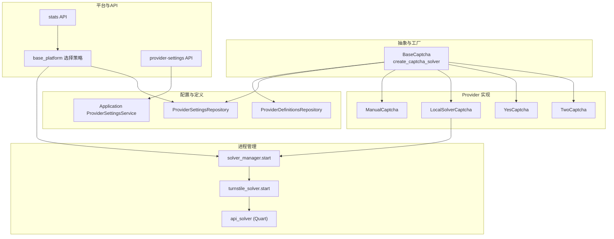
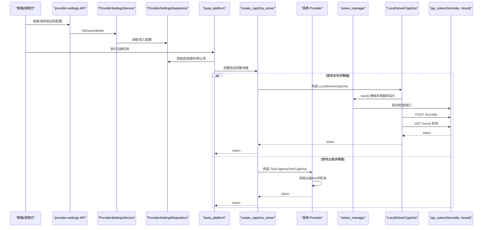
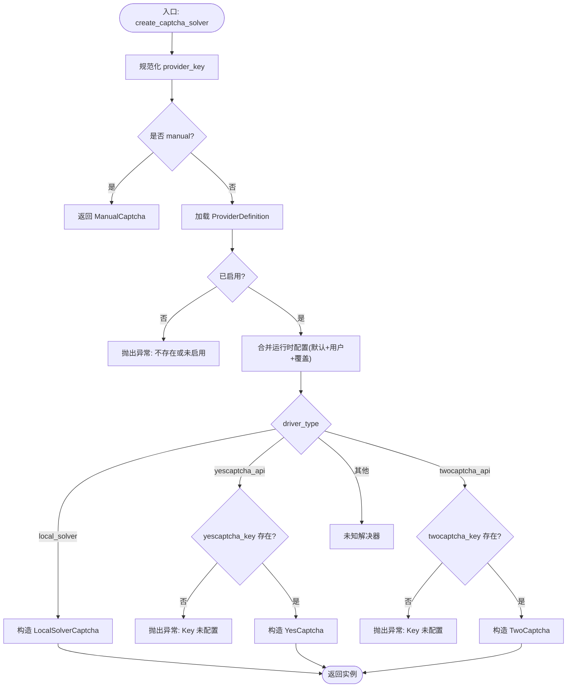
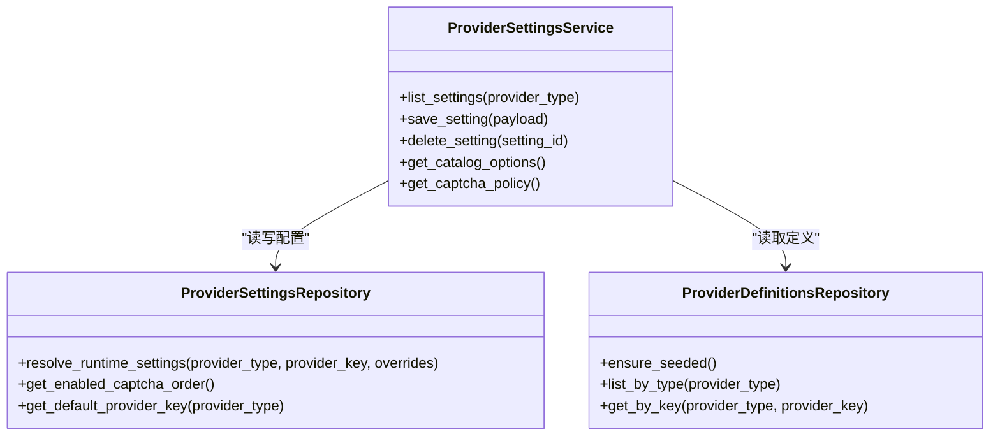
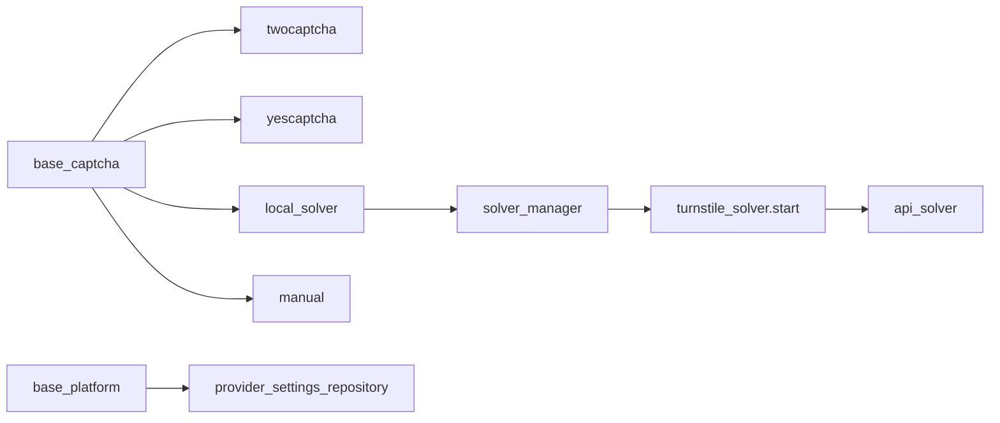
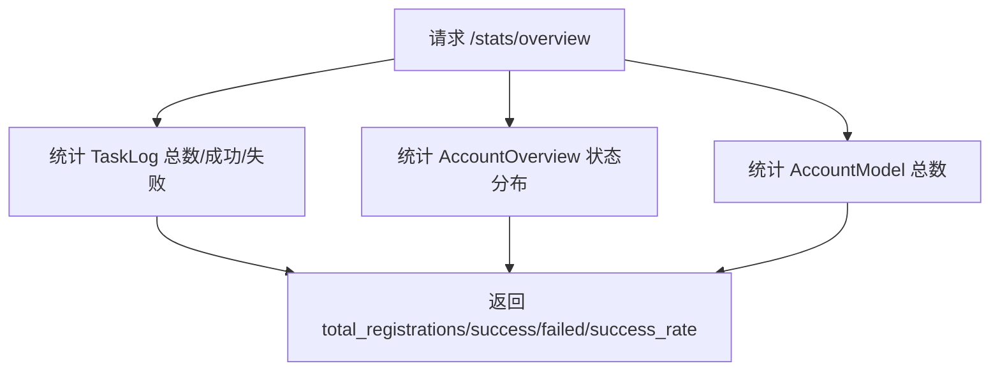

# 验证码服务管理

<cite>
**本文引用的文件**
- [core/base_captcha.py](file://core/base_captcha.py)
- [providers/captcha/twocaptcha.py](file://providers/captcha/twocaptcha.py)
- [providers/captcha/yescaptcha.py](file://providers/captcha/yescaptcha.py)
- [providers/captcha/local_solver.py](file://providers/captcha/local_solver.py)
- [providers/captcha/manual.py](file://providers/captcha/manual.py)
- [infrastructure/provider_definitions_repository.py](file://infrastructure/provider_definitions_repository.py)
- [infrastructure/provider_settings_repository.py](file://infrastructure/provider_settings_repository.py)
- [application/provider_settings.py](file://application/provider_settings.py)
- [api/provider_settings.py](file://api/provider_settings.py)
- [services/solver_manager.py](file://services/solver_manager.py)
- [services/turnstile_solver/start.py](file://services/turnstile_solver/start.py)
- [services/turnstile_solver/api_solver.py](file://services/turnstile_solver/api_solver.py)
- [core/base_platform.py](file://core/base_platform.py)
- [api/stats.py](file://api/stats.py)
</cite>

## 目录
1. [简介](#简介)
2. [项目结构](#项目结构)
3. [核心组件](#核心组件)
4. [架构总览](#架构总览)
5. [详细组件分析](#详细组件分析)
6. [依赖关系分析](#依赖关系分析)
7. [性能与监控](#性能与监控)
8. [故障排查指南](#故障排查指南)
9. [结论](#结论)

## 简介
本章节全面介绍验证码服务管理能力，涵盖：
- 多种验证码解决服务的集成与配置（2Captcha、YesCaptcha、本地求解器、人工打码）
- API 密钥与服务参数的配置方式
- 优先级设置与故障转移机制
- 测试能力与成功率统计
- 在不同执行模式（浏览器模式、协议模式）下的使用策略
- 运行期监控与性能分析要点

## 项目结构
验证码相关代码主要分布在以下层次：
- 抽象与工厂：定义统一接口与创建逻辑
- Provider 实现：对接第三方或本地服务
- 配置与定义：内置 provider 元数据与运行时配置合并
- 进程管理：本地求解器子进程的生命周期管理
- 前端与 API：提供设置、测试与统计能力

图表来源
- [core/base_captcha.py:1-98](file://core/base_captcha.py#L1-L98)
- [providers/captcha/twocaptcha.py:1-64](file://providers/captcha/twocaptcha.py#L1-L64)
- [providers/captcha/yescaptcha.py:1-43](file://providers/captcha/yescaptcha.py#L1-L43)
- [providers/captcha/local_solver.py:1-80](file://providers/captcha/local_solver.py#L1-L80)
- [providers/captcha/manual.py:1-19](file://providers/captcha/manual.py#L1-L19)
- [infrastructure/provider_definitions_repository.py:239-293](file://infrastructure/provider_definitions_repository.py#L239-L293)
- [infrastructure/provider_settings_repository.py:39-83](file://infrastructure/provider_settings_repository.py#L39-L83)
- [application/provider_settings.py:37-52](file://application/provider_settings.py#L37-L52)
- [services/solver_manager.py:73-155](file://services/solver_manager.py#L73-L155)
- [services/turnstile_solver/start.py:15-28](file://services/turnstile_solver/start.py#L15-L28)
- [services/turnstile_solver/api_solver.py:135-140](file://services/turnstile_solver/api_solver.py#L135-L140)
- [core/base_platform.py:343-394](file://core/base_platform.py#L343-L394)
- [api/provider_settings.py:61-81](file://api/provider_settings.py#L61-L81)
- [api/stats.py:18-52](file://api/stats.py#L18-L52)

章节来源
- [core/base_captcha.py:1-98](file://core/base_captcha.py#L1-L98)
- [infrastructure/provider_definitions_repository.py:239-293](file://infrastructure/provider_definitions_repository.py#L239-L293)
- [infrastructure/provider_settings_repository.py:39-83](file://infrastructure/provider_settings_repository.py#L39-L83)
- [application/provider_settings.py:37-52](file://application/provider_settings.py#L37-L52)
- [services/solver_manager.py:73-155](file://services/solver_manager.py#L73-L155)
- [services/turnstile_solver/start.py:15-28](file://services/turnstile_solver/start.py#L15-L28)
- [services/turnstile_solver/api_solver.py:135-140](file://services/turnstile_solver/api_solver.py#L135-L140)
- [core/base_platform.py:343-394](file://core/base_platform.py#L343-L394)
- [api/provider_settings.py:61-81](file://api/provider_settings.py#L61-L81)
- [api/stats.py:18-52](file://api/stats.py#L18-L52)

## 核心组件
- BaseCaptcha 抽象与工厂：统一 solve_turnstile/solve_image 接口；根据 provider_key 与 driver_type 创建具体实例。
- Provider 实现：
  - TwoCaptcha：云端 Turnstile 求解，轮询任务结果。
  - YesCaptcha：云端 Turnstile 求解，轮询任务结果。
  - LocalSolverCaptcha：调用本地 api_solver 服务（Camoufox/patchright）。
  - ManualCaptcha：阻塞等待人工输入。
- 配置与定义：
  - ProviderDefinitionsRepository：内置 captcha 的 provider 定义（含字段、认证模式等）。
  - ProviderSettingsRepository：运行时配置合并（默认值 + 用户设置 + 覆盖参数），并计算启用顺序与默认项。
  - Application ProviderSettingsService：对外暴露列表、保存、删除与策略查询。
- 进程管理：
  - solver_manager：启动/停止/重启本地求解器子进程，自动检测 Camoufox 二进制，失败计数保护。
  - turnstile_solver.start：解析参数并启动 Quart 应用。
  - api_solver：提供 /turnstile 提交任务与 /result 轮询结果的 HTTP 接口。
- 平台策略：
  - base_platform：按执行模式（headless/headed vs 协议模式）选择验证码 provider 的顺序与默认值。

章节来源
- [core/base_captcha.py:5-98](file://core/base_captcha.py#L5-L98)
- [providers/captcha/twocaptcha.py:1-64](file://providers/captcha/twocaptcha.py#L1-L64)
- [providers/captcha/yescaptcha.py:1-43](file://providers/captcha/yescaptcha.py#L1-L43)
- [providers/captcha/local_solver.py:1-80](file://providers/captcha/local_solver.py#L1-L80)
- [providers/captcha/manual.py:1-19](file://providers/captcha/manual.py#L1-L19)
- [infrastructure/provider_definitions_repository.py:239-293](file://infrastructure/provider_definitions_repository.py#L239-L293)
- [infrastructure/provider_settings_repository.py:39-83](file://infrastructure/provider_settings_repository.py#L39-L83)
- [application/provider_settings.py:37-52](file://application/provider_settings.py#L37-L52)
- [services/solver_manager.py:73-155](file://services/solver_manager.py#L73-L155)
- [services/turnstile_solver/start.py:15-28](file://services/turnstile_solver/start.py#L15-L28)
- [services/turnstile_solver/api_solver.py:135-140](file://services/turnstile_solver/api_solver.py#L135-L140)
- [core/base_platform.py:343-394](file://core/base_platform.py#L343-L394)

## 架构总览
验证码服务在系统中的整体交互如下：

图表来源
- [api/provider_settings.py:25-51](file://api/provider_settings.py#L25-L51)
- [application/provider_settings.py:12-52](file://application/provider_settings.py#L12-L52)
- [infrastructure/provider_settings_repository.py:39-83](file://infrastructure/provider_settings_repository.py#L39-L83)
- [core/base_platform.py:343-394](file://core/base_platform.py#L343-L394)
- [core/base_captcha.py:67-97](file://core/base_captcha.py#L67-L97)
- [providers/captcha/local_solver.py:17-49](file://providers/captcha/local_solver.py#L17-L49)
- [services/solver_manager.py:73-155](file://services/solver_manager.py#L73-L155)
- [services/turnstile_solver/api_solver.py:950-1033](file://services/turnstile_solver/api_solver.py#L950-L1033)
- [providers/captcha/twocaptcha.py:19-60](file://providers/captcha/twocaptcha.py#L19-L60)
- [providers/captcha/yescaptcha.py:20-39](file://providers/captcha/yescaptcha.py#L20-L39)

## 详细组件分析

### 验证码抽象与工厂
- 统一接口：solve_turnstile(page_url, site_key) -> token；solve_image(image_b64) -> text（部分实现未支持图片）。
- 工厂 create_captcha_solver：
  - 根据 provider_key 查找定义与运行时配置
  - 按 driver_type 路由到 local_solver、yescaptcha_api、twocaptcha_api 或 manual
  - 校验必要密钥（如 yescaptcha_key、twocaptcha_key），缺失则抛出错误

图表来源
- [core/base_captcha.py:67-97](file://core/base_captcha.py#L67-L97)

章节来源
- [core/base_captcha.py:5-98](file://core/base_captcha.py#L5-L98)

### 2Captcha 集成
- 功能：通过云端 API 创建 Turnstile 任务并轮询结果
- 关键流程：
  - POST 创建任务（包含 key、method=turnstile、sitekey、pageurl）
  - 轮询 res.php，直到 status=1 或出现非就绪错误
  - 超时处理：多次轮询后抛出超时异常
- 配置：从运行时配置中读取 twocaptcha_key

章节来源
- [providers/captcha/twocaptcha.py:1-64](file://providers/captcha/twocaptcha.py#L1-L64)

### YesCaptcha 集成
- 功能：通过云端 API 创建 Turnstile 任务并轮询结果
- 关键流程：
  - POST createTask（clientKey、TurnstileTaskProxyless、websiteURL、websiteKey）
  - 轮询 getTaskResult，直到 status=ready
  - 超时处理：多次轮询后抛出超时异常
- 配置：从运行时配置中读取 yescaptcha_key

章节来源
- [providers/captcha/yescaptcha.py:1-43](file://providers/captcha/yescaptcha.py#L1-L43)

### 本地求解器（LocalSolverCaptcha）
- 功能：通过本地 HTTP 服务（Camoufox/patchright）解 Turnstile
- 关键流程：
  - GET /turnstile?{url, sitekey} 提交任务，获取 taskId
  - 轮询 GET /result?id={taskId}，直到 ready 或失败
  - 超时处理：多次轮询后抛出超时异常
- 启动辅助：start_solver 可在后台线程拉起本地服务（用于快速验证）

章节来源
- [providers/captcha/local_solver.py:1-80](file://providers/captcha/local_solver.py#L1-L80)
- [services/turnstile_solver/api_solver.py:950-1033](file://services/turnstile_solver/api_solver.py#L950-L1033)

### 人工打码（ManualCaptcha）
- 功能：阻塞等待用户手动输入 token 或图片验证码
- 适用场景：调试与问题定位

章节来源
- [providers/captcha/manual.py:1-19](file://providers/captcha/manual.py#L1-L19)

### 配置与策略管理
- 内置定义：captcha 类型下包含 yescaptcha_api、twocaptcha_api、local_solver、manual 的定义与字段
- 运行时配置：
  - resolve_runtime_settings：合并默认值、用户设置与覆盖参数
  - get_enabled_captcha_order：生成协议模式的启用顺序（排除 manual/local_solver）
  - get_default_provider_key：获取浏览器模式的默认 provider
- 策略输出：get_captcha_policy 返回 protocol_mode、protocol_order、browser_mode

图表来源
- [infrastructure/provider_definitions_repository.py:387-474](file://infrastructure/provider_definitions_repository.py#L387-L474)
- [infrastructure/provider_settings_repository.py:39-83](file://infrastructure/provider_settings_repository.py#L39-L83)
- [application/provider_settings.py:12-52](file://application/provider_settings.py#L12-L52)

章节来源
- [infrastructure/provider_definitions_repository.py:239-293](file://infrastructure/provider_definitions_repository.py#L239-L293)
- [infrastructure/provider_settings_repository.py:39-83](file://infrastructure/provider_settings_repository.py#L39-L83)
- [application/provider_settings.py:37-52](file://application/provider_settings.py#L37-L52)

### 执行模式与优先级
- 浏览器模式（headless/headed）：
  - 优先使用“默认”的验证码 provider（is_default=true）
  - 若未配置默认，抛出明确提示要求设置
- 协议模式：
  - 按启用的远程 provider 顺序依次尝试（exclude manual/local_solver）
  - 若均未配置，抛出错误提示需启用至少一个 provider
- 准备阶段：当检测到 local_solver 时，自动触发 solver_manager.start 确保本地服务可用

章节来源
- [core/base_platform.py:343-394](file://core/base_platform.py#L343-L394)
- [infrastructure/provider_settings_repository.py:67-83](file://infrastructure/provider_settings_repository.py#L67-L83)
- [services/solver_manager.py:73-155](file://services/solver_manager.py#L73-L155)

### 测试能力
- 通用测试接口：/provider-settings/test
  - 对 mailbox 类型可实际测试（获取邮箱）
  - 对 captcha/sms 类型返回暂不支持在线测试的提示，建议在注册任务中验证
- 建议实践：在真实注册流程中观察成功率与错误信息，结合统计接口进行归因

章节来源
- [api/provider_settings.py:61-81](file://api/provider_settings.py#L61-L81)

## 依赖关系分析
- 模块耦合：
  - base_captcha 与 providers/captcha/* 通过抽象与工厂解耦
  - base_platform 依赖 provider_settings_repository 决定优先级
  - local_solver 依赖 solver_manager 与 turnstile_solver 的 HTTP 接口
  - 云端 provider 直接依赖各自外部 API
- 外部依赖：
  - requests：HTTP 客户端
  - camoufox/patchright：本地浏览器自动化
  - quart：本地求解器 Web 框架

图表来源
- [core/base_captcha.py:67-97](file://core/base_captcha.py#L67-L97)
- [core/base_platform.py:343-394](file://core/base_platform.py#L343-L394)
- [providers/captcha/local_solver.py:17-49](file://providers/captcha/local_solver.py#L17-L49)
- [services/solver_manager.py:73-155](file://services/solver_manager.py#L73-L155)
- [services/turnstile_solver/start.py:15-28](file://services/turnstile_solver/start.py#L15-L28)
- [services/turnstile_solver/api_solver.py:135-140](file://services/turnstile_solver/api_solver.py#L135-L140)

章节来源
- [core/base_captcha.py:67-97](file://core/base_captcha.py#L67-L97)
- [core/base_platform.py:343-394](file://core/base_platform.py#L343-L394)
- [providers/captcha/local_solver.py:17-49](file://providers/captcha/local_solver.py#L17-L49)
- [services/solver_manager.py:73-155](file://services/solver_manager.py#L73-L155)
- [services/turnstile_solver/start.py:15-28](file://services/turnstile_solver/start.py#L15-L28)
- [services/turnstile_solver/api_solver.py:135-140](file://services/turnstile_solver/api_solver.py#L135-L140)

## 性能与监控
- 本地求解器进程管理：
  - 启动前自动检测并下载 Camoufox 二进制，避免重复安装
  - 连续失败保护：达到阈值后停止重试，便于人工介入
  - 优雅停止：先终止子进程，再清理占用端口的残留进程
- 本地求解器服务：
  - 浏览器池化与资源限制（按需拦截媒体/字体等）
  - 代理支持：从 proxies.txt 随机选取代理，支持带鉴权格式
  - 结果存储与定期清理：数据库持久化，定时清理旧结果
- 统计与监控：
  - 全局概览：总注册数、成功/失败数、成功率、账号状态分布
  - 按平台统计：各平台成功率
  - 按天趋势：近 N 天注册趋势与成功率
  - 代理排行：代理成功率与活跃度
  - 错误聚合：最近失败错误分组统计

图表来源
- [api/stats.py:18-52](file://api/stats.py#L18-L52)

章节来源
- [services/solver_manager.py:21-38](file://services/solver_manager.py#L21-L38)
- [services/solver_manager.py:73-155](file://services/solver_manager.py#L73-L155)
- [services/turnstile_solver/api_solver.py:242-251](file://services/turnstile_solver/api_solver.py#L242-L251)
- [api/stats.py:18-52](file://api/stats.py#L18-L52)

## 故障排查指南
- 常见错误与定位：
  - 云端 provider 未配置密钥：创建实例时报错，需在 provider-settings 中补充对应 key
  - 本地求解器不可用：检查 solver_manager 的连续失败次数与 last_error；确认 Camoufox 二进制是否可用
  - 本地服务端口占用：stop/restart 会尝试清理端口占用进程；必要时手动释放
  - 云端服务超时：检查网络与账户余额；适当调整轮询次数与超时
- 诊断步骤：
  - 查看 stats/errors 聚合最近失败原因
  - 查看 stats/by-platform 与 stats/by-day 定位问题范围
  - 在本地求解器日志中查看浏览器初始化与任务处理细节
  - 使用 /provider-settings/test 对 mailbox 做连通性验证（captcha 暂不支持在线测试）

章节来源
- [services/solver_manager.py:21-38](file://services/solver_manager.py#L21-L38)
- [services/solver_manager.py:158-222](file://services/solver_manager.py#L158-L222)
- [api/stats.py:135-152](file://api/stats.py#L135-L152)
- [api/provider_settings.py:61-81](file://api/provider_settings.py#L61-L81)

## 结论
本系统提供了完善的验证码服务管理能力：
- 统一的抽象与工厂简化了多后端接入
- 灵活的配置与策略机制支持浏览器模式与协议模式的不同需求
- 本地求解器与云端求解器并存，满足离线与高可用场景
- 进程管理与统计接口为运维与优化提供了基础支撑
建议在生产环境中：
- 合理配置多个云端 provider 以形成故障转移链
- 启用本地求解器作为兜底方案，并确保浏览器环境稳定
- 持续观察统计指标，及时调优与扩容