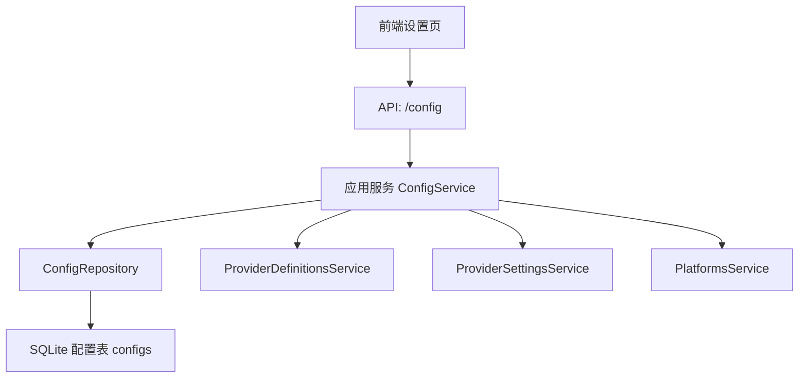
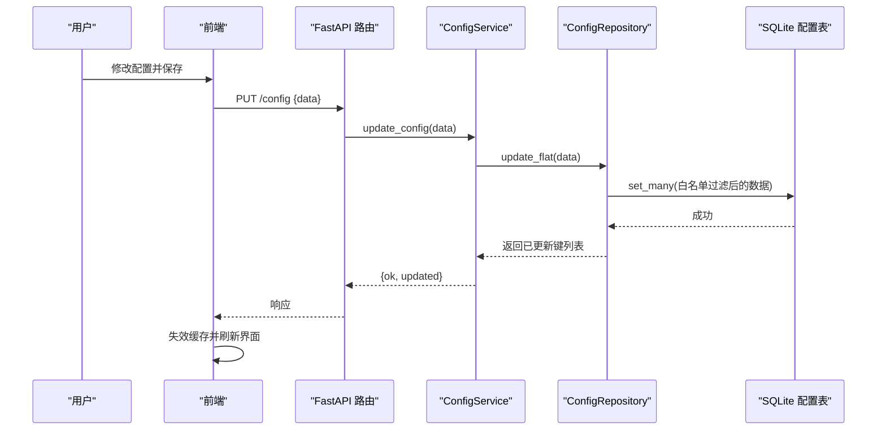
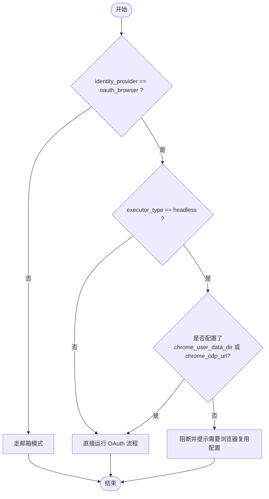
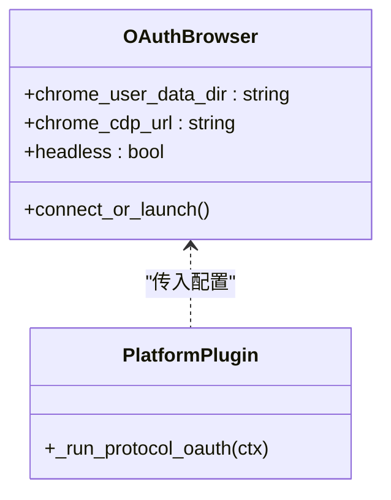
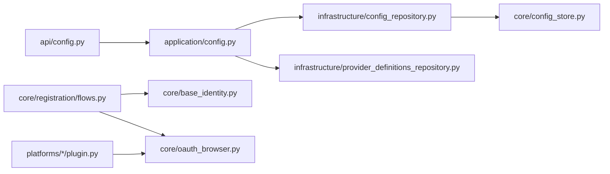

# 系统配置管理

<cite>
**本文引用的文件**
- [core/config_store.py](file://core/config_store.py)
- [infrastructure/config_repository.py](file://infrastructure/config_repository.py)
- [application/config.py](file://application/config.py)
- [api/config.py](file://api/config.py)
- [core/base_identity.py](file://core/base_identity.py)
- [core/registration/flows.py](file://core/registration/flows.py)
- [core/oauth_browser.py](file://core/oauth_browser.py)
- [platforms/kiro/plugin.py](file://platforms/kiro/plugin.py)
- [platforms/grok/plugin.py](file://platforms/grok/plugin.py)
- [platforms/openblocklabs/plugin.py](file://platforms/openblocklabs/plugin.py)
- [frontend/src/pages/SettingsPage.tsx](file://frontend/src/pages/SettingsPage.tsx)
- [frontend/src/lib/registration.ts](file://frontend/src/lib/registration.ts)
- [frontend/src/components/settings/ProviderCards.tsx](file://frontend/src/components/settings/ProviderCards.tsx)
- [infrastructure/provider_definitions_repository.py](file://infrastructure/provider_definitions_repository.py)
</cite>

## 目录
1. [简介](#简介)
2. [项目结构](#项目结构)
3. [核心组件](#核心组件)
4. [架构总览](#架构总览)
5. [详细组件分析](#详细组件分析)
6. [依赖关系分析](#依赖关系分析)
7. [性能考虑](#性能考虑)
8. [故障排查指南](#故障排查指南)
9. [结论](#结论)
10. [附录](#附录)

## 简介
本章节概述系统配置管理能力，涵盖默认注册策略、浏览器复用设置、身份提供商与 OAuth 提供商选择、执行方式（headless/headed/protocol）等关键配置项；说明配置的校验机制、数据类型约束、实时生效机制；并提供配置模板与预设方案、以及备份恢复思路，帮助快速完成初始设置与环境迁移。

## 项目结构
配置能力由“前端界面 → API 层 → 应用服务 → 基础设施仓库 → 持久化存储”分层实现：
- 前端提供设置页面与选项面板，调用 /config 与 /config/options 接口获取并保存配置。
- API 路由将请求转发到应用服务。
- 应用服务聚合配置读取、平台能力与提供商定义/设置信息。
- 基础设施仓库负责白名单过滤、扁平化读写。
- 持久化通过 SQLite 的 key-value 表存储全局配置。

图表来源
- [api/config.py:1-29](file://api/config.py#L1-L29)
- [application/config.py:1-38](file://application/config.py#L1-L38)
- [infrastructure/config_repository.py:1-44](file://infrastructure/config_repository.py#L1-L44)
- [core/config_store.py:1-49](file://core/config_store.py#L1-L49)

章节来源
- [api/config.py:1-29](file://api/config.py#L1-L29)
- [application/config.py:1-38](file://application/config.py#L1-L38)
- [infrastructure/config_repository.py:1-44](file://infrastructure/config_repository.py#L1-L44)
- [core/config_store.py:1-49](file://core/config_store.py#L1-L49)

## 核心组件
- 配置持久化存储：基于 SQLite 的键值对存储，支持 get/set/get_all/set_many。
- 配置仓库：维护允许的配置键集合（基础键 + 各提供商字段键），提供扁平化读取与更新。
- 配置服务：对外暴露获取配置、更新配置、获取配置选项（包含平台能力、提供商定义与设置）。
- 身份与执行器：根据 identity_provider 与 executor_type 决定注册流程与浏览器行为。
- 浏览器复用：支持 Chrome Profile 路径或 CDP 地址，用于无头模式下的会话复用。

章节来源
- [core/config_store.py:1-49](file://core/config_store.py#L1-L49)
- [infrastructure/config_repository.py:1-44](file://infrastructure/config_repository.py#L1-L44)
- [application/config.py:1-38](file://application/config.py#L1-L38)
- [core/base_identity.py:1-131](file://core/base_identity.py#L1-L131)
- [core/oauth_browser.py:77-212](file://core/oauth_browser.py#L77-L212)

## 架构总览
配置写入与读取的关键路径如下：
- 前端提交 PUT /config，后端经 FastAPI 路由进入 ConfigService.update_config。
- ConfigRepository.update_flat 仅允许白名单内的键写入，最终落库。
- 读取时 GET /config 返回扁平化配置；GET /config/options 返回动态选项（平台能力、提供商定义与设置）。

图表来源
- [api/config.py:1-29](file://api/config.py#L1-L29)
- [application/config.py:1-38](file://application/config.py#L1-L38)
- [infrastructure/config_repository.py:1-44](file://infrastructure/config_repository.py#L1-L44)
- [core/config_store.py:1-49](file://core/config_store.py#L1-L49)

## 详细组件分析

### 配置键与默认策略
- 基础配置键包括：default_executor、default_identity_provider、default_oauth_provider、oauth_email_hint、chrome_user_data_dir、chrome_cdp_url、cpa_api_url、cpa_api_key、team_manager_url、team_manager_key、any2api_url、any2api_password。
- 动态扩展键：每个启用的 mailbox/captcha/sms 提供商的 fields.key 会被加入允许键集合，从而支持按提供商动态配置。
- 默认执行方式 default_executor：影响注册时的执行器类型（headless/headed/protocol）。
- 默认身份提供商 default_identity_provider：可设为邮箱或 oauth_browser。
- 默认 OAuth 提供商 default_oauth_provider：在 oauth_browser 模式下决定使用哪个第三方登录。

章节来源
- [infrastructure/config_repository.py:1-44](file://infrastructure/config_repository.py#L1-L44)
- [core/base_identity.py:1-131](file://core/base_identity.py#L1-L131)

### 身份提供商与 OAuth 流程
- identity_provider 支持 mailbox 与 oauth_browser，并提供别名归一化。
- BrowserOAuthIdentityProvider 会从 extra 中解析 email、oauth_provider、chrome_user_data_dir、chrome_cdp_url 等信息。
- 当 identity_provider 为 oauth_browser 且执行器为 headless 时，若平台要求复用浏览器，则必须配置 chrome_user_data_dir 或 chrome_cdp_url，否则会在注册流程前置检查中阻断。

图表来源
- [core/registration/flows.py:22-44](file://core/registration/flows.py#L22-L44)
- [core/base_identity.py:100-117](file://core/base_identity.py#L100-L117)

章节来源
- [core/base_identity.py:1-131](file://core/base_identity.py#L1-L131)
- [core/registration/flows.py:22-44](file://core/registration/flows.py#L22-L44)

### 浏览器复用设置
- 支持两种复用方式：
  - Chrome Profile 路径：通过 persistent context 加载本地已登录的 Chrome 用户数据。
  - Chrome CDP 地址：连接已运行的 Chrome 实例进行调试与控制。
- 自动检测与回退：
  - 优先尝试连接已运行的 Chrome（CDP）。
  - 若不可用，尝试自动重启 Chrome 并开启远程调试端口。
  - 最后回退到普通 Chromium 启动。
- 平台插件在运行 OAuth 流程时会传入这些参数以控制浏览器行为。

图表来源
- [core/oauth_browser.py:77-212](file://core/oauth_browser.py#L77-L212)
- [platforms/kiro/plugin.py:68-80](file://platforms/kiro/plugin.py#L68-L80)
- [platforms/grok/plugin.py:35-47](file://platforms/grok/plugin.py#L35-L47)
- [platforms/openblocklabs/plugin.py:32-44](file://platforms/openblocklabs/plugin.py#L32-L44)

章节来源
- [core/oauth_browser.py:77-212](file://core/oauth_browser.py#L77-L212)
- [platforms/kiro/plugin.py:68-80](file://platforms/kiro/plugin.py#L68-L80)
- [platforms/grok/plugin.py:35-47](file://platforms/grok/plugin.py#L35-L47)
- [platforms/openblocklabs/plugin.py:32-44](file://platforms/openblocklabs/plugin.py#L32-L44)

### 配置验证与数据类型约束
- 白名单校验：仅允许 BASE_KEYS 与提供商 fields.key 出现在更新请求中，非法键将被丢弃。
- 扁平化存储：所有配置统一以字符串形式存储，读取时保证值为字符串。
- 提供商字段元数据：fields 中包含 label、placeholder、secret、type、category、hint 等，用于前端渲染与校验提示。
- 平台能力：supported_executors、supported_identity_modes、supported_oauth_providers、capabilities 从类属性与数据库合并，确保新增能力向后兼容。

章节来源
- [infrastructure/config_repository.py:1-44](file://infrastructure/config_repository.py#L1-L44)
- [core/config_store.py:1-49](file://core/config_store.py#L1-L49)
- [infrastructure/provider_definitions_repository.py:387-561](file://infrastructure/provider_definitions_repository.py#L387-L561)
- [core/registry.py:1-124](file://core/registry.py#L1-L124)

### 实时生效机制
- 前端保存配置后，会主动失效本地缓存并重新拉取配置与选项，无需重启服务即可看到新配置。
- 提供商设置变更后同样触发缓存失效与数据重载。

章节来源
- [frontend/src/pages/SettingsPage.tsx:69-118](file://frontend/src/pages/SettingsPage.tsx#L69-L118)
- [frontend/src/pages/SettingsPage.tsx:169-202](file://frontend/src/pages/SettingsPage.tsx#L169-L202)
- [frontend/src/components/settings/ProviderCards.tsx:372-403](file://frontend/src/components/settings/ProviderCards.tsx#L372-L403)
- [frontend/src/lib/app-data.ts:59-95](file://frontend/src/lib/app-data.ts#L59-L95)

### 配置模板与预设方案
- 内置提供商定义：mailbox/captcha/sms/proxy 等提供商的标签、描述、认证模式、字段定义等以种子数据形式存在，启动时同步至数据库。
- 驱动模板：按 driver_type 去重提供模板，便于快速创建新的提供商配置。
- 一键启用与设默认：前端支持一键启用提供商并设为默认，简化初始设置。

章节来源
- [infrastructure/provider_definitions_repository.py:17-384](file://infrastructure/provider_definitions_repository.py#L17-L384)
- [infrastructure/provider_definitions_repository.py:452-491](file://infrastructure/provider_definitions_repository.py#L452-L491)
- [frontend/src/components/settings/ProviderCards.tsx:372-403](file://frontend/src/components/settings/ProviderCards.tsx#L372-L403)

### 配置备份与恢复
- 当前实现未提供直接的导出/导入接口。由于配置存储在 SQLite 的 configs 表中，可通过数据库工具导出该表数据进行备份，并在目标环境导入以实现迁移。
- 建议结合容器或镜像打包数据库文件，或使用脚本批量导出/导入。

[本节为通用指导，不直接分析具体文件]

## 依赖关系分析
- API 路由依赖应用服务；应用服务依赖仓库与服务；仓库依赖持久化存储。
- 身份与执行器逻辑依赖平台能力与提供商定义；浏览器复用逻辑依赖平台插件传入的配置。

图表来源
- [api/config.py:1-29](file://api/config.py#L1-L29)
- [application/config.py:1-38](file://application/config.py#L1-L38)
- [infrastructure/config_repository.py:1-44](file://infrastructure/config_repository.py#L1-L44)
- [core/config_store.py:1-49](file://core/config_store.py#L1-L49)
- [core/registration/flows.py:22-44](file://core/registration/flows.py#L22-L44)
- [core/base_identity.py:1-131](file://core/base_identity.py#L1-L131)
- [core/oauth_browser.py:77-212](file://core/oauth_browser.py#L77-L212)
- [platforms/kiro/plugin.py:68-80](file://platforms/kiro/plugin.py#L68-L80)

章节来源
- [api/config.py:1-29](file://api/config.py#L1-L29)
- [application/config.py:1-38](file://application/config.py#L1-L38)
- [infrastructure/config_repository.py:1-44](file://infrastructure/config_repository.py#L1-L44)
- [core/config_store.py:1-49](file://core/config_store.py#L1-L49)
- [core/registration/flows.py:22-44](file://core/registration/flows.py#L22-L44)
- [core/base_identity.py:1-131](file://core/base_identity.py#L1-L131)
- [core/oauth_browser.py:77-212](file://core/oauth_browser.py#L77-L212)
- [platforms/kiro/plugin.py:68-80](file://platforms/kiro/plugin.py#L68-L80)

## 性能考虑
- 配置读写为轻量级键值操作，SQLite 单进程内访问，适合中小规模配置量。
- 前端采用缓存与失效策略，减少重复请求。
- 提供商定义与设置查询可能涉及数据库扫描，注意合理索引与分页（当前实现为小数据集）。

[本节为通用指导，不直接分析具体文件]

## 故障排查指南
- 无法选择某些执行器或身份模式：检查平台能力（supported_executors、supported_identity_modes、supported_oauth_providers）是否正确初始化。
- OAuth 无头模式失败：确认已配置 chrome_user_data_dir 或 chrome_cdp_url；必要时让系统 Chrome 开启远程调试端口。
- 配置未生效：确认前端已失效缓存并重新拉取；检查更新请求中的键是否在白名单内。
- 提供商字段无效：核对字段 key 是否与提供商定义一致；查看字段元数据中的类型与必填提示。

章节来源
- [core/registry.py:1-124](file://core/registry.py#L1-L124)
- [core/oauth_browser.py:77-212](file://core/oauth_browser.py#L77-L212)
- [infrastructure/config_repository.py:1-44](file://infrastructure/config_repository.py#L1-L44)
- [frontend/src/pages/SettingsPage.tsx:69-118](file://frontend/src/pages/SettingsPage.tsx#L69-L118)

## 结论
系统配置管理通过白名单校验、扁平化存储与前端缓存失效机制，实现了安全、灵活且实时的配置能力。结合内置提供商定义与模板，用户可以快速完成初始设置；通过浏览器复用与多执行器支持，满足不同平台的注册需求。对于生产环境的备份与迁移，建议借助数据库工具或脚本对配置表进行导出与导入。

## 附录
- 常用配置键说明：
  - default_executor：默认执行方式（headless/headed/protocol）。
  - default_identity_provider：默认身份提供商（mailbox/oauth_browser）。
  - default_oauth_provider：默认 OAuth 提供商（如 google/microsoft/apple/x 等）。
  - oauth_email_hint：OAuth 流程中的邮箱提示。
  - chrome_user_data_dir：Chrome Profile 路径，用于会话复用。
  - chrome_cdp_url：Chrome CDP 地址，用于连接已运行浏览器。
  - cpa_api_url/cpa_api_key：CPA 相关 API 配置。
  - team_manager_url/team_manager_key：团队管理器相关配置。
  - any2api_url/any2api_password：Any2API 相关配置。
- 动态扩展键：各提供商 fields.key 会自动加入允许键集合，便于按需配置。

[本节为通用说明，不直接分析具体文件]