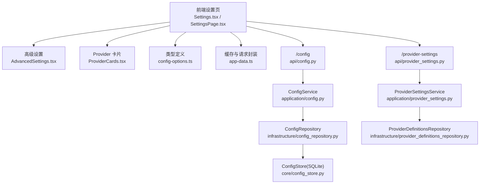
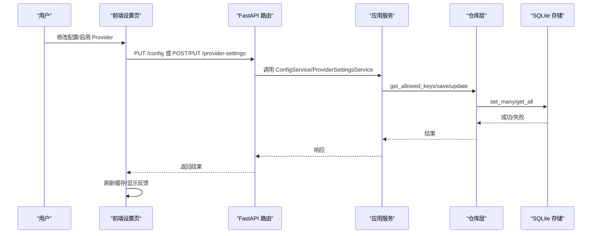
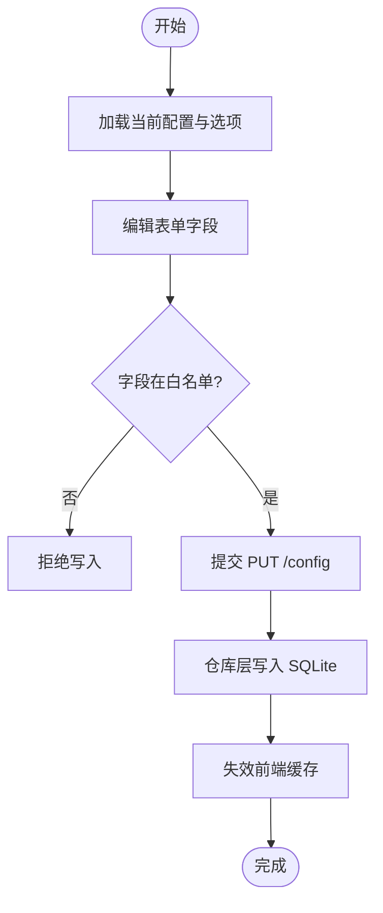
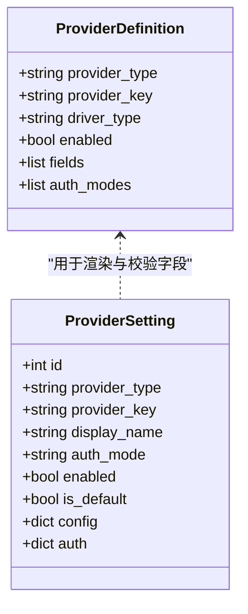
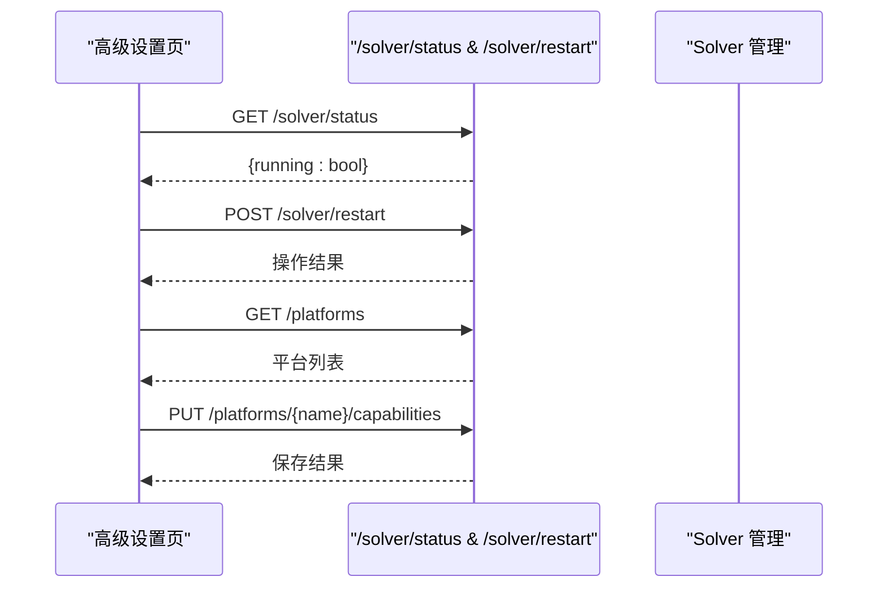
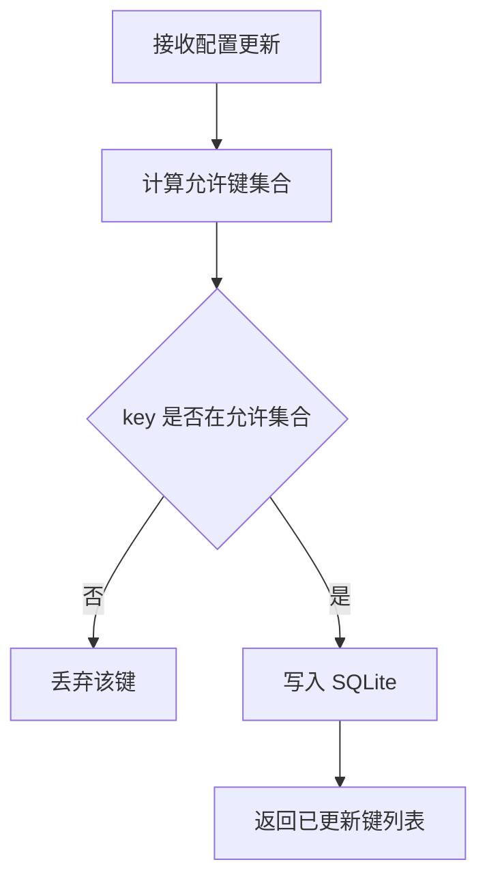
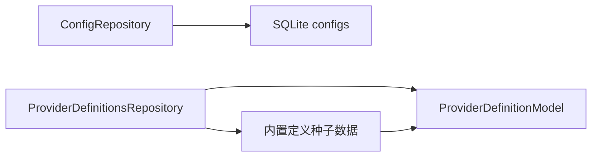
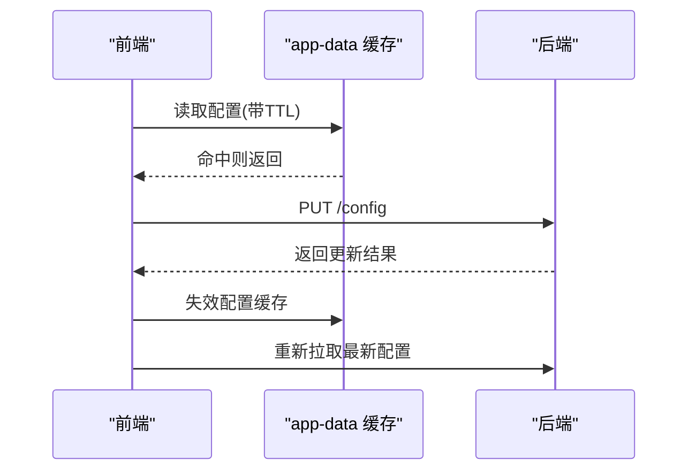
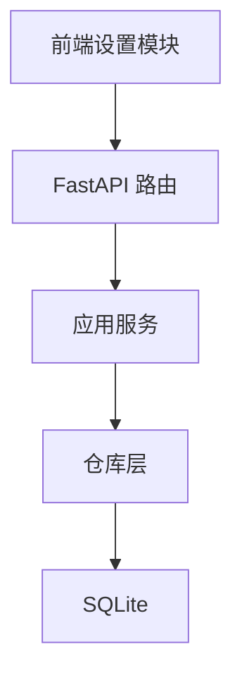

# 设置界面

<cite>
**本文引用的文件**
- [frontend/src/pages/Settings.tsx](file://frontend/src/pages/Settings.tsx)
- [frontend/src/pages/SettingsPage.tsx](file://frontend/src/pages/SettingsPage.tsx)
- [frontend/src/components/settings/AdvancedSettings.tsx](file://frontend/src/components/settings/AdvancedSettings.tsx)
- [frontend/src/components/settings/ProviderCards.tsx](file://frontend/src/components/settings/ProviderCards.tsx)
- [frontend/src/lib/config-options.ts](file://frontend/src/lib/config-options.ts)
- [frontend/src/lib/app-data.ts](file://frontend/src/lib/app-data.ts)
- [api/config.py](file://api/config.py)
- [application/config.py](file://application/config.py)
- [infrastructure/config_repository.py](file://infrastructure/config_repository.py)
- [core/config_store.py](file://core/config_store.py)
- [api/provider_settings.py](file://api/provider_settings.py)
- [application/provider_settings.py](file://application/provider_settings.py)
- [infrastructure/provider_definitions_repository.py](file://infrastructure/provider_definitions_repository.py)
</cite>

## 目录
1. [简介](#简介)
2. [项目结构](#项目结构)
3. [核心组件](#核心组件)
4. [架构总览](#架构总览)
5. [详细组件分析](#详细组件分析)
6. [依赖关系分析](#依赖关系分析)
7. [性能考虑](#性能考虑)
8. [故障排查指南](#故障排查指南)
9. [结论](#结论)
10. [附录](#附录)

## 简介
本文件全面介绍“设置界面”的功能与实现，覆盖系统配置管理、高级设置、配置验证、持久化存储、导入导出（备份迁移）、实时生效机制、模板与预设方案，以及安全最佳实践。重点包括：
- API 密钥配置、代理设置、数据库连接等核心参数的编辑界面
- 调试模式、日志级别、性能调优等专家级配置入口
- 配置校验与安全白名单机制
- 基于 SQLite 的本地持久化与 Provider 定义/设置的版本化同步
- 通过 Provider 模板快速创建并启用服务
- 前端缓存与失效策略，支持无需重启即可生效的配置更新

## 项目结构
设置界面由前端 React 页面与后端 FastAPI 服务组成，前后端通过 RESTful API 交互，配置数据持久化在 SQLite 中，并通过 Provider 定义与设置分离的方式实现可扩展的服务接入。

图表来源
- [frontend/src/pages/Settings.tsx:1-120](file://frontend/src/pages/Settings.tsx#L1-L120)
- [frontend/src/pages/SettingsPage.tsx:1-120](file://frontend/src/pages/SettingsPage.tsx#L1-L120)
- [frontend/src/components/settings/AdvancedSettings.tsx:1-60](file://frontend/src/components/settings/AdvancedSettings.tsx#L1-L60)
- [frontend/src/components/settings/ProviderCards.tsx:1-120](file://frontend/src/components/settings/ProviderCards.tsx#L1-L120)
- [frontend/src/lib/config-options.ts:1-64](file://frontend/src/lib/config-options.ts#L1-L64)
- [frontend/src/lib/app-data.ts:1-96](file://frontend/src/lib/app-data.ts#L1-L96)
- [api/config.py:1-29](file://api/config.py#L1-L29)
- [application/config.py:1-38](file://application/config.py#L1-L38)
- [infrastructure/config_repository.py:1-44](file://infrastructure/config_repository.py#L1-L44)
- [core/config_store.py:1-49](file://core/config_store.py#L1-L49)
- [api/provider_settings.py:1-120](file://api/provider_settings.py#L1-L120)
- [application/provider_settings.py:1-88](file://application/provider_settings.py#L1-L88)
- [infrastructure/provider_definitions_repository.py:387-561](file://infrastructure/provider_definitions_repository.py#L387-L561)

章节来源
- [frontend/src/pages/Settings.tsx:1-120](file://frontend/src/pages/Settings.tsx#L1-L120)
- [frontend/src/pages/SettingsPage.tsx:1-120](file://frontend/src/pages/SettingsPage.tsx#L1-L120)
- [api/config.py:1-29](file://api/config.py#L1-L29)
- [application/config.py:1-38](file://application/config.py#L1-L38)
- [infrastructure/config_repository.py:1-44](file://infrastructure/config_repository.py#L1-L44)
- [core/config_store.py:1-49](file://core/config_store.py#L1-L49)

## 核心组件
- 设置主页面与标签导航：提供通用设置、注册策略、邮箱/验证码/接码服务、代理资源、高级设置、关于等入口。
- Provider 配置管理：按类型分组展示可用 Provider，支持新增、编辑、设为默认、删除、在线测试。
- 高级设置：Turnstile 求解器状态监控与重启；平台能力开关（执行方式、身份模式、OAuth 提供者）。
- 配置选项与动态表单：根据后端返回的字段定义渲染输入控件，支持密码掩码、异步下拉、多态类型。
- 配置持久化：基于 SQLite 的键值配置存储，配合白名单过滤确保只允许写入受控字段。
- Provider 定义与设置：内置 Provider 元数据（字段、认证方式）与用户实例化配置分离，支持种子数据同步与版本演进。

章节来源
- [frontend/src/pages/SettingsPage.tsx:120-210](file://frontend/src/pages/SettingsPage.tsx#L120-L210)
- [frontend/src/components/settings/ProviderCards.tsx:350-572](file://frontend/src/components/settings/ProviderCards.tsx#L350-L572)
- [frontend/src/components/settings/AdvancedSettings.tsx:65-233](file://frontend/src/components/settings/AdvancedSettings.tsx#L65-L233)
- [frontend/src/lib/config-options.ts:1-114](file://frontend/src/lib/config-options.ts#L1-L114)
- [application/provider_settings.py:1-88](file://application/provider_settings.py#L1-L88)
- [infrastructure/provider_definitions_repository.py:387-561](file://infrastructure/provider_definitions_repository.py#L387-L561)

## 架构总览
设置界面采用“前端 UI + 后端服务 + 仓库层 + 存储层”的分层架构。前端负责交互与缓存，后端服务聚合业务逻辑，仓库层负责数据访问与规则校验，存储层使用 SQLite 进行持久化。

图表来源
- [api/config.py:16-28](file://api/config.py#L16-L28)
- [application/config.py:16-38](file://application/config.py#L16-L38)
- [infrastructure/config_repository.py:20-43](file://infrastructure/config_repository.py#L20-L43)
- [core/config_store.py:16-45](file://core/config_store.py#L16-L45)
- [api/provider_settings.py:25-51](file://api/provider_settings.py#L25-L51)
- [application/provider_settings.py:12-35](file://application/provider_settings.py#L12-L35)

## 详细组件分析

### 系统配置管理（API 密钥、代理、数据库连接等）
- 全局配置项通过 /config 接口读写，包含默认执行方式、身份提供商、OAuth 提示、Chrome 复用路径、CPA/Team Manager/Any2Api 等关键参数。
- 配置项白名单由 ConfigRepository 维护，仅允许 BASE_KEYS 及 Provider 定义中的字段 key 被写入，防止任意键注入。
- 前端 SettingsPage 提供“外观主题”“默认注册策略”“浏览器复用”等常用配置入口，保存后调用 /config 更新并刷新缓存。

图表来源
- [infrastructure/config_repository.py:20-43](file://infrastructure/config_repository.py#L20-L43)
- [frontend/src/pages/SettingsPage.tsx:84-103](file://frontend/src/pages/SettingsPage.tsx#L84-L103)
- [api/config.py:16-28](file://api/config.py#L16-L28)

章节来源
- [frontend/src/pages/SettingsPage.tsx:84-210](file://frontend/src/pages/SettingsPage.tsx#L84-L210)
- [infrastructure/config_repository.py:7-43](file://infrastructure/config_repository.py#L7-L43)
- [api/config.py:16-28](file://api/config.py#L16-L28)

### Provider 配置（邮箱、验证码、接码、代理）
- Provider 定义（元数据）与 Provider 设置（实例化配置）分离。定义描述字段、认证方式、分类等；设置记录具体值、是否启用、是否默认。
- 前端 ProviderCards 按类别分组展示，支持新增、编辑、设默认、删除、在线测试（邮箱驱动可实际尝试获取邮箱）。
- 后端 ProviderSettingsService 负责序列化/反序列化，结合 ProviderDefinitionsRepository 提供的字段与认证模式生成动态表单。

图表来源
- [infrastructure/provider_definitions_repository.py:387-561](file://infrastructure/provider_definitions_repository.py#L387-L561)
- [application/provider_settings.py:12-88](file://application/provider_settings.py#L12-L88)
- [frontend/src/components/settings/ProviderCards.tsx:122-337](file://frontend/src/components/settings/ProviderCards.tsx#L122-L337)

章节来源
- [frontend/src/components/settings/ProviderCards.tsx:350-572](file://frontend/src/components/settings/ProviderCards.tsx#L350-L572)
- [api/provider_settings.py:25-120](file://api/provider_settings.py#L25-L120)
- [application/provider_settings.py:12-88](file://application/provider_settings.py#L12-L88)
- [infrastructure/provider_definitions_repository.py:387-561](file://infrastructure/provider_definitions_repository.py#L387-L561)

### 高级设置（调试模式、日志级别、性能调优）
- 高级设置页面提供 Turnstile 求解器状态检测与重启，便于调试验证码流程。
- 平台能力面板允许为各平台自定义支持的执行方式、注册身份模式、第三方 OAuth 入口，便于性能与行为调优。
- 这些能力通过 /platforms/{name}/capabilities 接口进行读取与更新，并在前端缓存失效后刷新。

图表来源
- [frontend/src/components/settings/AdvancedSettings.tsx:10-63](file://frontend/src/components/settings/AdvancedSettings.tsx#L10-L63)
- [frontend/src/components/settings/AdvancedSettings.tsx:65-233](file://frontend/src/components/settings/AdvancedSettings.tsx#L65-L233)

章节来源
- [frontend/src/components/settings/AdvancedSettings.tsx:10-233](file://frontend/src/components/settings/AdvancedSettings.tsx#L10-L233)

### 配置验证机制
- 白名单校验：ConfigRepository.get_allowed_keys 合并基础键与所有 Provider 定义的字段 key，仅允许这些键被写入，避免任意键注入。
- 字段类型与分类：Provider 定义声明字段类型（text/select/textarea/toggle/async-select）、是否敏感（secret）、分类（auth/connection/identity），前端据此渲染控件并提供掩码与提示。
- 在线测试：Provider 设置支持“测试连接”，对邮箱驱动会尝试实际获取邮箱以验证配置正确性。

图表来源
- [infrastructure/config_repository.py:20-43](file://infrastructure/config_repository.py#L20-L43)
- [infrastructure/provider_definitions_repository.py:437-474](file://infrastructure/provider_definitions_repository.py#L437-L474)
- [api/provider_settings.py:61-120](file://api/provider_settings.py#L61-L120)

章节来源
- [infrastructure/config_repository.py:20-43](file://infrastructure/config_repository.py#L20-L43)
- [api/provider_settings.py:61-120](file://api/provider_settings.py#L61-L120)

### 配置的持久化存储（本地存储、远程同步、版本管理）
- 本地存储：ConfigStore 使用 SQLite 表 configs 存储键值对，支持批量写入与读取。
- 版本管理：ProviderDefinitionsRepository 启动时会将内置定义“种子数据”同步到数据库，确保代码升级后字段与说明自动更新，同时保留用户自定义 metadata。
- 远程同步：系统暴露 CPA、Team Manager、Any2Api 等外部集成配置项，可在设置中填写 URL 与凭据以实现账号或任务数据的远程同步。

图表来源
- [core/config_store.py:7-45](file://core/config_store.py#L7-L45)
- [infrastructure/provider_definitions_repository.py:387-434](file://infrastructure/provider_definitions_repository.py#L387-L434)
- [infrastructure/config_repository.py:7-15](file://infrastructure/config_repository.py#L7-L15)

章节来源
- [core/config_store.py:7-45](file://core/config_store.py#L7-L45)
- [infrastructure/provider_definitions_repository.py:387-434](file://infrastructure/provider_definitions_repository.py#L387-L434)
- [infrastructure/config_repository.py:7-15](file://infrastructure/config_repository.py#L7-L15)

### 配置导入导出（备份与迁移）
- 导出：可通过 /config 获取当前扁平化配置快照，结合 Provider 设置列表（/provider-settings?provider_type=...）进行整体备份。
- 导入：将导出的配置 JSON 通过 /config 与 /provider-settings 接口恢复，注意字段需符合白名单与 Provider 定义约束。
- 建议：在导入前校验 Provider 定义是否存在，必要时先同步定义再导入设置。

章节来源
- [api/config.py:16-28](file://api/config.py#L16-L28)
- [api/provider_settings.py:25-51](file://api/provider_settings.py#L25-L51)

### 实时配置更新（无需重启）
- 前端缓存：app-data.ts 对 /config、/config/options、/platforms 等接口进行短期缓存，支持强制刷新与失效。
- 失效策略：保存配置后调用 invalidateConfigCache/invalidateConfigOptionsCache/invalidatePlatformsCache 清除缓存，确保后续读取最新值。
- 后端即时生效：配置写入 SQLite 后立即对后续请求生效，无需重启服务。

图表来源
- [frontend/src/lib/app-data.ts:17-96](file://frontend/src/lib/app-data.ts#L17-L96)
- [frontend/src/pages/SettingsPage.tsx:93-103](file://frontend/src/pages/SettingsPage.tsx#L93-L103)
- [api/config.py:16-28](file://api/config.py#L16-L28)

章节来源
- [frontend/src/lib/app-data.ts:17-96](file://frontend/src/lib/app-data.ts#L17-L96)
- [frontend/src/pages/SettingsPage.tsx:93-103](file://frontend/src/pages/SettingsPage.tsx#L93-L103)

### 配置模板与预设方案
- 内置模板：ProviderDefinitionsRepository 内置多种邮箱、验证码、接码、代理服务的字段与认证方式，作为“模板”供用户快速创建。
- 动态创建：前端 CreateProviderDefinitionModal 支持选择驱动族、认证方式与字段，一键创建并启用首个配置。
- 预设方案：通过设置“默认 Provider”和“默认执行方式”，形成开箱即用的工作流预设。

章节来源
- [infrastructure/provider_definitions_repository.py:17-384](file://infrastructure/provider_definitions_repository.py#L17-L384)
- [frontend/src/pages/Settings.tsx:695-792](file://frontend/src/pages/Settings.tsx#L695-L792)
- [frontend/src/pages/SettingsPage.tsx:120-210](file://frontend/src/pages/SettingsPage.tsx#L120-L210)

### 配置安全最佳实践
- 敏感信息掩码：Provider 字段标记 secret 时，前端以密码框显示并可切换可见性；后端序列化时对 auth 字段提供预览脱敏。
- 白名单限制：仅允许写入白名单内的键，防止任意键注入与越权配置。
- 最小权限：Provider 设置区分 config 与 auth 两类字段，敏感凭据放入 auth，减少泄露面。
- 访问控制：生产环境应结合网关/鉴权中间件保护 /config 与 /provider-settings 接口，避免未授权访问。
- 审计与备份：定期导出配置快照，记录变更历史，便于回滚与审计。

章节来源
- [frontend/src/components/settings/ProviderCards.tsx:237-337](file://frontend/src/components/settings/ProviderCards.tsx#L237-L337)
- [application/provider_settings.py:54-88](file://application/provider_settings.py#L54-L88)
- [infrastructure/config_repository.py:20-43](file://infrastructure/config_repository.py#L20-L43)

## 依赖关系分析
- 前端依赖：
  - Settings.tsx 依赖 ProviderCards、config-options 类型定义与 app-data 缓存工具。
  - AdvancedSettings.tsx 依赖 solver 状态与平台能力接口。
- 后端依赖：
  - api/config.py 依赖 application/config.py 的 ConfigService。
  - application/config.py 依赖 infrastructure/config_repository.py 与 platform/provider 相关服务。
  - api/provider_settings.py 依赖 application/provider_settings.py，后者依赖 ProviderDefinitionsRepository。
- 存储依赖：
  - core/config_store.py 使用 SQLModel 与 SQLite 引擎进行持久化。

图表来源
- [frontend/src/pages/Settings.tsx:1-120](file://frontend/src/pages/Settings.tsx#L1-L120)
- [api/config.py:1-29](file://api/config.py#L1-L29)
- [application/config.py:1-38](file://application/config.py#L1-L38)
- [infrastructure/config_repository.py:1-44](file://infrastructure/config_repository.py#L1-L44)
- [core/config_store.py:1-49](file://core/config_store.py#L1-L49)

章节来源
- [frontend/src/pages/Settings.tsx:1-120](file://frontend/src/pages/Settings.tsx#L1-L120)
- [api/config.py:1-29](file://api/config.py#L1-L29)
- [application/config.py:1-38](file://application/config.py#L1-L38)
- [infrastructure/config_repository.py:1-44](file://infrastructure/config_repository.py#L1-L44)
- [core/config_store.py:1-49](file://core/config_store.py#L1-L49)

## 性能考虑
- 前端缓存：app-data.ts 对配置与平台列表进行 TTL 缓存，减少重复请求；保存后主动失效缓存保证一致性。
- 批量写入：ConfigStore.set_many 批量更新键值，降低数据库往返开销。
- 动态表单：Provider 字段按需加载（如 async-select），避免一次性加载大量数据。
- 平台能力：按需启用执行方式与身份模式，减少不必要的运行时开销。

章节来源
- [frontend/src/lib/app-data.ts:17-96](file://frontend/src/lib/app-data.ts#L17-L96)
- [core/config_store.py:36-45](file://core/config_store.py#L36-L45)
- [frontend/src/components/settings/ProviderCards.tsx:144-174](file://frontend/src/components/settings/ProviderCards.tsx#L144-L174)

## 故障排查指南
- 配置无法保存：检查字段是否在白名单内；确认 Provider 定义存在且字段 key 匹配。
- Provider 测试失败：查看测试结果消息；邮箱驱动会返回错误详情片段，定位网络或凭据问题。
- 平台能力未生效：确认缓存已失效并重新拉取；检查 PUT 请求体结构与字段名。
- Solver 未运行：通过高级设置页面检测状态并重启；检查本地服务端口与进程。

章节来源
- [api/provider_settings.py:61-120](file://api/provider_settings.py#L61-L120)
- [frontend/src/components/settings/AdvancedSettings.tsx:10-63](file://frontend/src/components/settings/AdvancedSettings.tsx#L10-L63)
- [infrastructure/config_repository.py:20-43](file://infrastructure/config_repository.py#L20-L43)

## 结论
设置界面通过清晰的模块化设计与严格的白名单校验，提供了安全、灵活且易用的系统配置管理能力。借助 Provider 定义与设置分离、内置模板与在线测试，用户可以快速搭建并验证各类服务。前端缓存与失效策略确保配置实时更新，SQLite 持久化与种子数据同步保障版本一致性与可维护性。在生产环境中，建议结合访问控制与审计备份，进一步提升安全性与可靠性。

## 附录
- 常用配置项示例（路径参考）：
  - 默认执行方式、身份提供商、OAuth 提示：[frontend/src/pages/SettingsPage.tsx:120-210](file://frontend/src/pages/SettingsPage.tsx#L120-L210)
  - Chrome 复用路径与 CDP：[frontend/src/pages/SettingsPage.tsx:169-202](file://frontend/src/pages/SettingsPage.tsx#L169-L202)
  - CPA/Team Manager/Any2Api 集成：[frontend/src/pages/Settings.tsx:276-299](file://frontend/src/pages/Settings.tsx#L276-L299)
- Provider 模板与字段定义（路径参考）：
  - 内置邮箱/验证码/接码/代理定义：[infrastructure/provider_definitions_repository.py:17-384](file://infrastructure/provider_definitions_repository.py#L17-L384)
  - 动态表单渲染与测试：[frontend/src/components/settings/ProviderCards.tsx:122-337](file://frontend/src/components/settings/ProviderCards.tsx#L122-L337)
- 配置持久化与白名单（路径参考）：
  - SQLite 存储：[core/config_store.py:7-45](file://core/config_store.py#L7-L45)
  - 白名单与更新：[infrastructure/config_repository.py:20-43](file://infrastructure/config_repository.py#L20-L43)