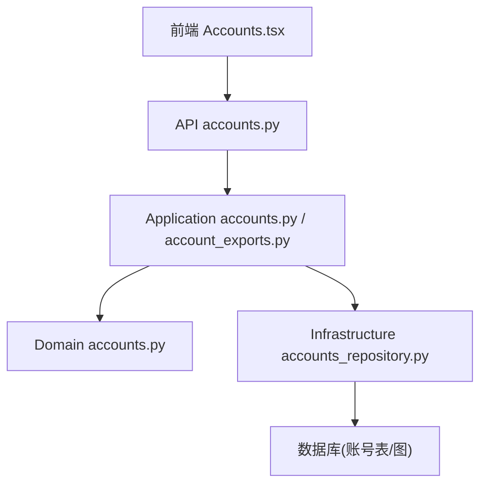
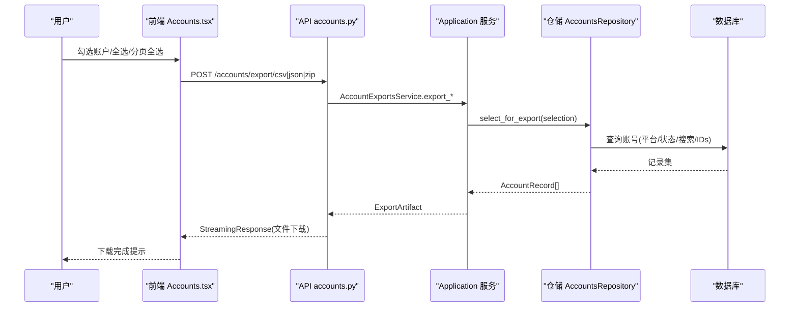
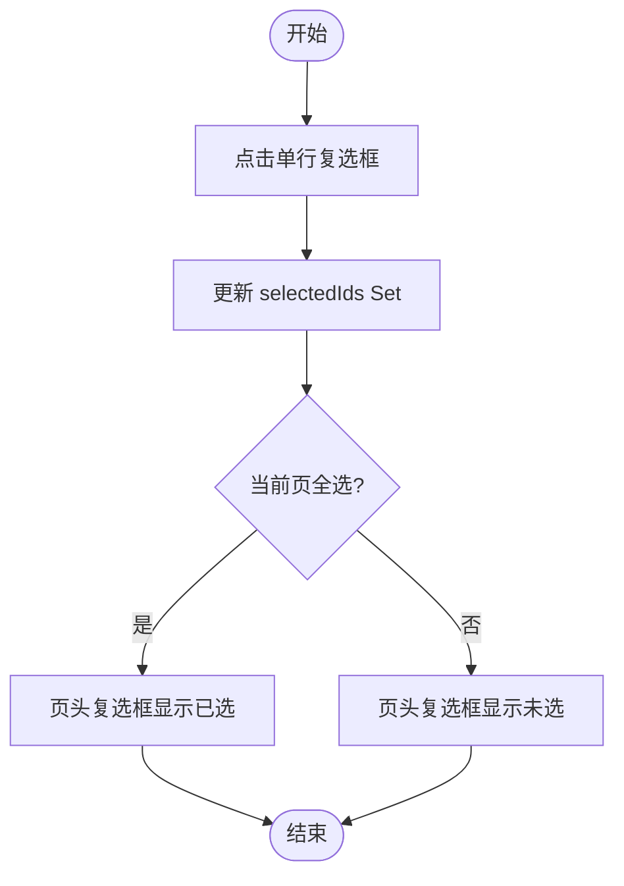
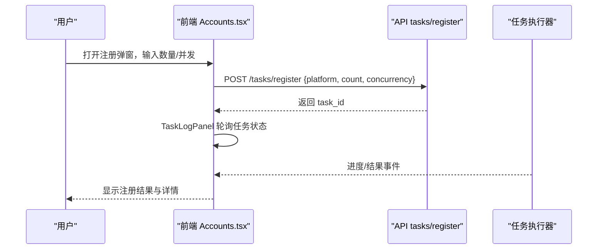
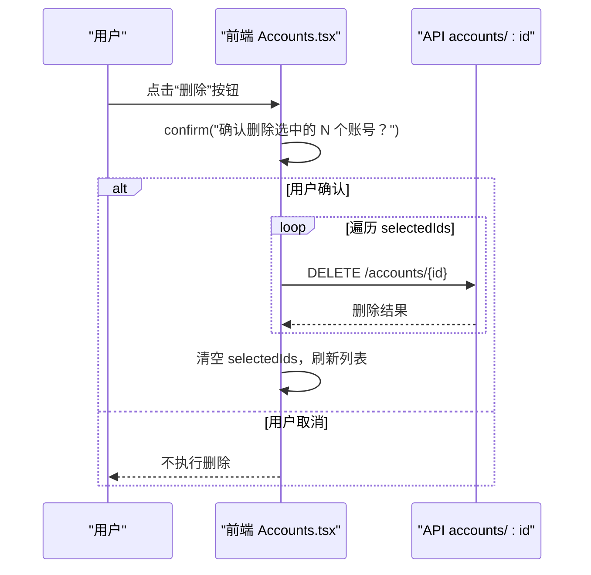
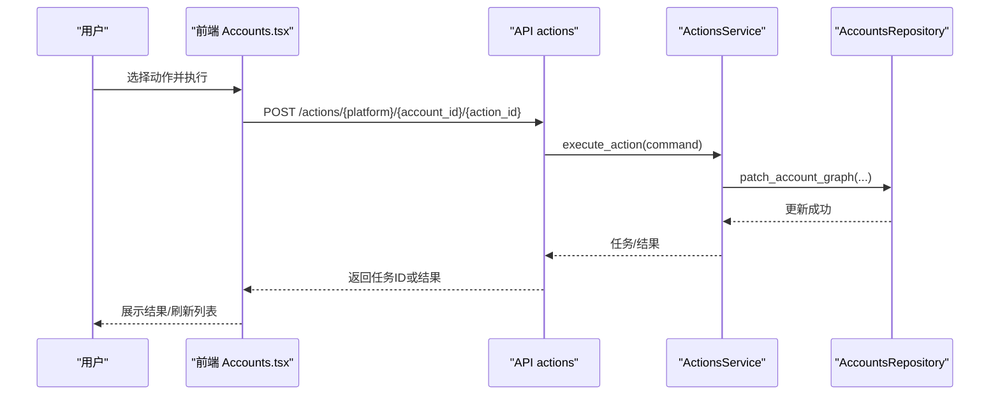
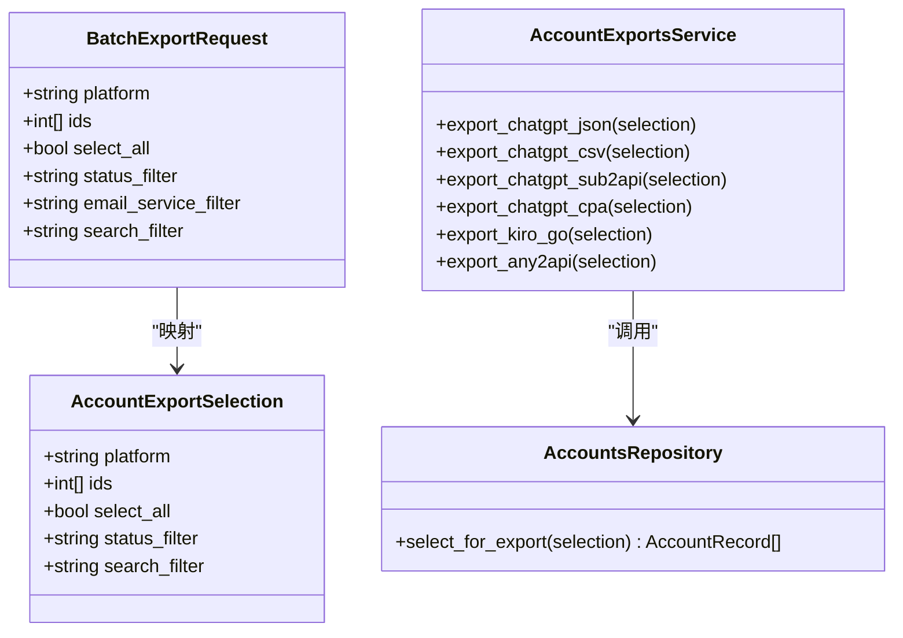
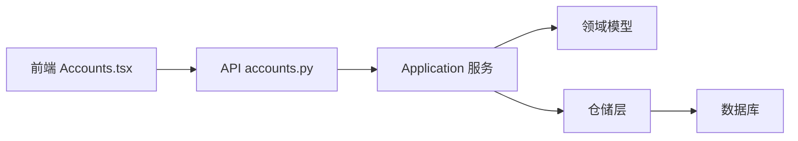

# 批量操作功能

<cite>
**本文引用的文件**
- [api/accounts.py](file://api/accounts.py)
- [application/accounts.py](file://application/accounts.py)
- [application/account_exports.py](file://application/account_exports.py)
- [domain/accounts.py](file://domain/accounts.py)
- [infrastructure/accounts_repository.py](file://infrastructure/accounts_repository.py)
- [frontend/src/pages/Accounts.tsx](file://frontend/src/pages/Accounts.tsx)
- [api/actions.py](file://api/actions.py)
</cite>

## 目录
1. [简介](#简介)
2. [项目结构](#项目结构)
3. [核心组件](#核心组件)
4. [架构总览](#架构总览)
5. [详细组件分析](#详细组件分析)
6. [依赖关系分析](#依赖关系分析)
7. [性能考虑](#性能考虑)
8. [故障排查指南](#故障排查指南)
9. [结论](#结论)

## 简介
本章节面向“批量操作”能力，覆盖以下目标：
- 批量选择机制：支持全选、反选、分页全选、范围选择等模式。
- 批量注册：为多个平台或同一平台的多个实例同时创建账户。
- 批量删除：包含确认对话框、并发删除与结果反馈。
- 批量状态更新：对选中账户进行统一的状态修改（通过动作执行）。
- 批量导出：将账户信息导出为 CSV/JSON/ZIP 等多种格式。
- 错误处理：部分失败不影响其他操作成功执行。
- 性能与安全：并发控制、流式响应、敏感信息保护等建议。

## 项目结构
批量操作贯穿前端界面、API 层、应用服务层、领域模型与基础设施仓储层，形成清晰的分层架构：
- 前端页面负责选择、交互与下载；
- API 路由接收请求并调用服务；
- 应用服务封装业务逻辑（导入、导出、统计）；
- 领域模型定义数据结构（查询、命令、选择条件）；
- 仓储层负责数据访问与持久化。

图表来源
- [frontend/src/pages/Accounts.tsx:1574-1609](file://frontend/src/pages/Accounts.tsx#L1574-L1609)
- [api/accounts.py:100-214](file://api/accounts.py#L100-L214)
- [application/accounts.py:42-123](file://application/accounts.py#L42-L123)
- [application/account_exports.py:330-507](file://application/account_exports.py#L330-L507)
- [domain/accounts.py:32-100](file://domain/accounts.py#L32-L100)
- [infrastructure/accounts_repository.py:111-162](file://infrastructure/accounts_repository.py#L111-L162)

章节来源
- [frontend/src/pages/Accounts.tsx:1574-1609](file://frontend/src/pages/Accounts.tsx#L1574-L1609)
- [api/accounts.py:100-214](file://api/accounts.py#L100-L214)
- [application/accounts.py:42-123](file://application/accounts.py#L42-L123)
- [application/account_exports.py:330-507](file://application/account_exports.py#L330-L507)
- [domain/accounts.py:32-100](file://domain/accounts.py#L32-L100)
- [infrastructure/accounts_repository.py:111-162](file://infrastructure/accounts_repository.py#L111-L162)

## 核心组件
- 批量选择与导出参数：BatchExportRequest、AccountExportSelection
- 导出服务：AccountExportsService（CSV/JSON/ZIP/Any2API/Kiro-Go）
- 账户服务：AccountsService（列表、导入、导出、统计）
- 仓储层：AccountsRepository（查询、筛选、导入、导出）
- 前端交互：多选、全选、分页全选、批量删除、本地 CSV 导出

章节来源
- [api/accounts.py:56-76](file://api/accounts.py#L56-L76)
- [domain/accounts.py:93-100](file://domain/accounts.py#L93-L100)
- [application/account_exports.py:21-507](file://application/account_exports.py#L21-L507)
- [application/accounts.py:42-123](file://application/accounts.py#L42-L123)
- [infrastructure/accounts_repository.py:111-162](file://infrastructure/accounts_repository.py#L111-L162)
- [frontend/src/pages/Accounts.tsx:1574-1609](file://frontend/src/pages/Accounts.tsx#L1574-L1609)

## 架构总览
批量操作的端到端流程如下：
- 用户在前端勾选账户（单选/全选/分页全选），触发批量导出或批量删除。
- 前端调用后端 API（POST /accounts/export/* 或 DELETE /accounts/:id）。
- API 层构造选择条件（平台、ID 集合、全选标志、状态过滤、搜索过滤）。
- 应用服务根据选择加载账户记录，生成导出产物或执行删除。
- 仓储层按条件查询并返回 AccountRecord 列表。
- 前端展示进度与结果，支持下载文件或刷新列表。

图表来源
- [frontend/src/pages/Accounts.tsx:1574-1609](file://frontend/src/pages/Accounts.tsx#L1574-L1609)
- [api/accounts.py:110-141](file://api/accounts.py#L110-L141)
- [application/account_exports.py:334-413](file://application/account_exports.py#L334-L413)
- [infrastructure/accounts_repository.py:143-162](file://infrastructure/accounts_repository.py#L143-L162)

## 详细组件分析

### 批量选择机制
- 单选：每行复选框切换单个账户的选中状态。
- 全选：页头复选框根据当前页所有 ID 是否全部选中决定全选/取消全选。
- 分页全选：基于当前页 IDs 集合进行批量勾选/取消。
- 范围选择：前端使用 Set 维护 selectedIds，便于快速判断与渲染。
- 导出联动：当 selectedCount > 0 时，仅导出选中项；否则导出全部。

图表来源
- [frontend/src/pages/Accounts.tsx:1596-1611](file://frontend/src/pages/Accounts.tsx#L1596-L1611)
- [frontend/src/pages/Accounts.tsx:1592-1594](file://frontend/src/pages/Accounts.tsx#L1592-L1594)

章节来源
- [frontend/src/pages/Accounts.tsx:1596-1611](file://frontend/src/pages/Accounts.tsx#L1596-L1611)
- [frontend/src/pages/Accounts.tsx:1592-1594](file://frontend/src/pages/Accounts.tsx#L1592-L1594)

### 批量注册功能
- 前端提供“注册弹窗”，支持设置注册数量与并发数，启动异步任务。
- 后端通过任务系统执行注册流程，支持多平台与多实例并行。
- 注册完成后，前端通过任务日志面板展示进度与结果。

图表来源
- [frontend/src/pages/Accounts.tsx:174-480](file://frontend/src/pages/Accounts.tsx#L174-L480)

章节来源
- [frontend/src/pages/Accounts.tsx:174-480](file://frontend/src/pages/Accounts.tsx#L174-L480)

### 批量删除操作
- 确认对话框：删除前弹出 confirm 提示，防止误删。
- 并发删除：使用 Promise.allSettled 并行发起多个 DELETE 请求，确保部分失败不影响其他删除。
- 结果反馈：删除完成后清空选中项并刷新列表。

图表来源
- [frontend/src/pages/Accounts.tsx:1758-1781](file://frontend/src/pages/Accounts.tsx#L1758-L1781)
- [api/accounts.py:233-238](file://api/accounts.py#L233-L238)

章节来源
- [frontend/src/pages/Accounts.tsx:1758-1781](file://frontend/src/pages/Accounts.tsx#L1758-L1781)
- [api/accounts.py:233-238](file://api/accounts.py#L233-L238)

### 批量状态更新
- 通过“动作执行”接口对账户进行状态变更（如刷新额度、订阅、支付等）。
- 前端可针对单个账户执行动作；若需批量更新，可在前端循环调用动作接口或使用任务队列。
- 后端动作执行后，可能更新账户概览、收银台链接、凭证等，并持久化到账户图。

图表来源
- [api/actions.py:27-39](file://api/actions.py#L27-L39)
- [infrastructure/accounts_repository.py:198-232](file://infrastructure/accounts_repository.py#L198-L232)

章节来源
- [api/actions.py:27-39](file://api/actions.py#L27-L39)
- [infrastructure/accounts_repository.py:198-232](file://infrastructure/accounts_repository.py#L198-L232)

### 批量导出功能
- 支持的导出类型：
  - CSV：通用字段导出（email/password/status/created_at 等）。
  - JSON：ChatGPT 专用 JSON 导出（含 token、workspace、过期时间等）。
  - ZIP：sub2api 与 CPA 多账户打包导出。
  - Any2API：跨平台 admin.json（Kiro/Grok/Cursor/Blink/ChatGPT）。
  - Kiro-Go：Kiro 账号配置导出。
- 选择条件：
  - platform：平台限定。
  - ids：指定 ID 列表。
  - select_all：全选标志。
  - status_filter：状态过滤（生命周期/套餐/有效性/显示状态）。
  - search_filter：邮箱模糊搜索。
- 流式响应：后端以 StreamingResponse 返回文件内容，避免大对象内存占用。

图表来源
- [api/accounts.py:56-76](file://api/accounts.py#L56-L76)
- [domain/accounts.py:93-100](file://domain/accounts.py#L93-L100)
- [application/account_exports.py:330-507](file://application/account_exports.py#L330-L507)
- [infrastructure/accounts_repository.py:143-162](file://infrastructure/accounts_repository.py#L143-L162)

章节来源
- [api/accounts.py:110-214](file://api/accounts.py#L110-L214)
- [application/account_exports.py:330-507](file://application/account_exports.py#L330-L507)
- [infrastructure/accounts_repository.py:143-162](file://infrastructure/accounts_repository.py#L143-L162)

### 错误处理与容错
- 前端批量删除使用 Promise.allSettled，确保部分失败不影响整体流程。
- API 层对无效选择条件抛出 400 错误（例如不支持的平台导出）。
- 仓储层在导入/更新/删除时进行空值与存在性检查，保证数据一致性。
- 流式响应降低大文件导出时的内存压力，提升稳定性。

章节来源
- [frontend/src/pages/Accounts.tsx:1768-1775](file://frontend/src/pages/Accounts.tsx#L1768-L1775)
- [api/accounts.py:112-141](file://api/accounts.py#L112-L141)
- [application/account_exports.py:465-469](file://application/account_exports.py#L465-L469)
- [infrastructure/accounts_repository.py:198-242](file://infrastructure/accounts_repository.py#L198-L242)

## 依赖关系分析
- 前端依赖 API 路由与工具函数进行数据获取与下载。
- API 层依赖应用服务与领域模型，解耦业务逻辑与传输协议。
- 应用服务依赖仓储层进行数据访问，屏蔽底层实现细节。
- 仓储层依赖数据库与账户图计算，提供统一的查询与更新接口。

图表来源
- [frontend/src/pages/Accounts.tsx:1574-1609](file://frontend/src/pages/Accounts.tsx#L1574-L1609)
- [api/accounts.py:100-214](file://api/accounts.py#L100-L214)
- [application/accounts.py:42-123](file://application/accounts.py#L42-L123)
- [application/account_exports.py:330-507](file://application/account_exports.py#L330-L507)
- [infrastructure/accounts_repository.py:111-162](file://infrastructure/accounts_repository.py#L111-L162)

章节来源
- [frontend/src/pages/Accounts.tsx:1574-1609](file://frontend/src/pages/Accounts.tsx#L1574-L1609)
- [api/accounts.py:100-214](file://api/accounts.py#L100-L214)
- [application/accounts.py:42-123](file://application/accounts.py#L42-L123)
- [application/account_exports.py:330-507](file://application/account_exports.py#L330-L507)
- [infrastructure/accounts_repository.py:111-162](file://infrastructure/accounts_repository.py#L111-L162)

## 性能考虑
- 并发控制：批量删除使用 Promise.allSettled 并发请求，避免串行阻塞；注册任务支持并发度配置。
- 流式响应：导出接口使用 StreamingResponse，减少内存占用，提高大文件下载稳定性。
- 查询优化：仓储层按平台/状态/搜索条件构建 SQL 语句，减少不必要的数据加载。
- 缓存策略：前端对平台动作列表进行缓存，减少重复请求。
- 安全建议：
  - 敏感字段（密码、token）在前端默认模糊显示，仅在悬停或复制时可见。
  - 导出文件命名带时间戳，避免覆盖与泄露风险。
  - 限制导出平台（如 ChatGPT 专用导出），防止越权导出。

[本节为通用指导，不直接分析具体文件]

## 故障排查指南
- 导出失败（400）：检查选择条件是否合法（平台、状态过滤、搜索过滤）。
- 删除无效果：确认账户是否存在，后端会返回 404 表示不存在。
- 批量删除部分失败：查看 Promise.allSettled 的结果，定位失败项并单独重试。
- 状态更新未生效：检查动作执行是否返回任务 ID，并在前端跟踪任务状态。
- 性能问题：降低并发度或分批导出，避免一次性处理过多数据。

章节来源
- [api/accounts.py:112-141](file://api/accounts.py#L112-L141)
- [api/accounts.py:233-238](file://api/accounts.py#L233-L238)
- [frontend/src/pages/Accounts.tsx:1768-1775](file://frontend/src/pages/Accounts.tsx#L1768-L1775)
- [api/actions.py:27-39](file://api/actions.py#L27-L39)

## 结论
本项目实现了完整的批量操作能力，涵盖选择、注册、删除、状态更新与导出等场景。通过分层架构与清晰的职责划分，保证了可扩展性与可维护性。建议在大规模使用时结合并发控制、流式响应与权限校验，进一步提升性能与安全性。