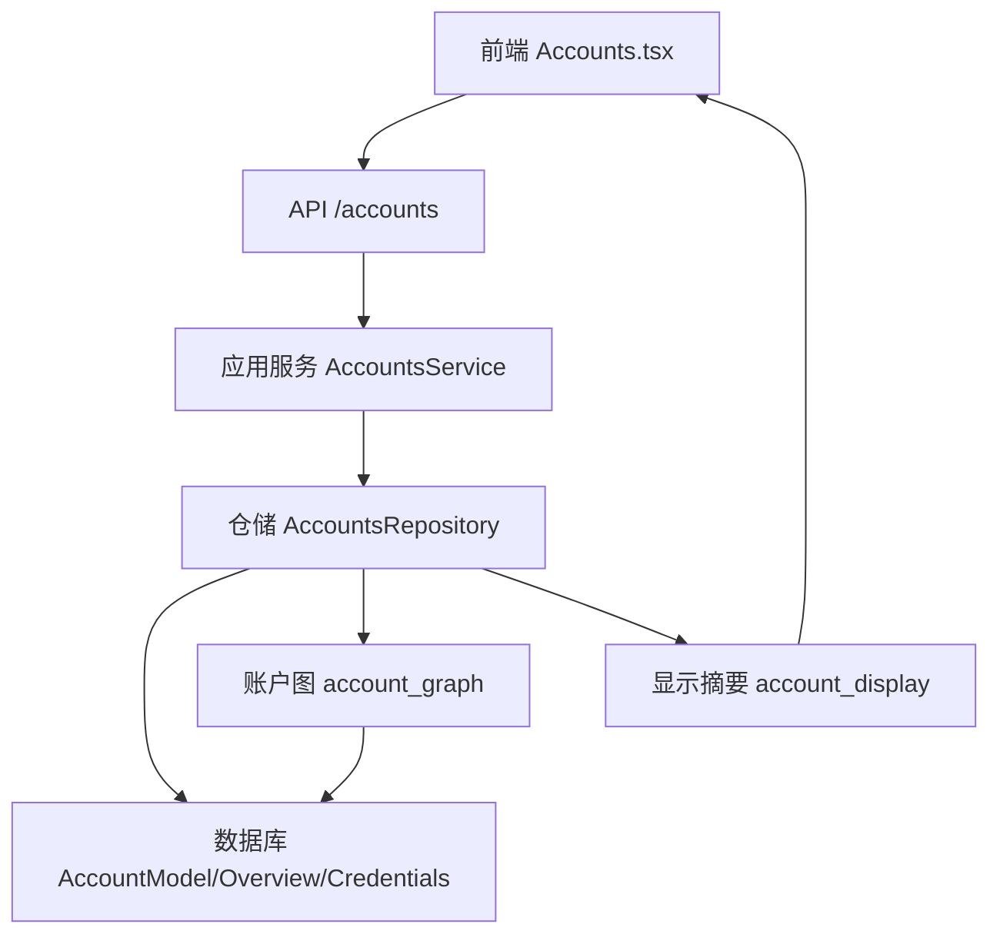
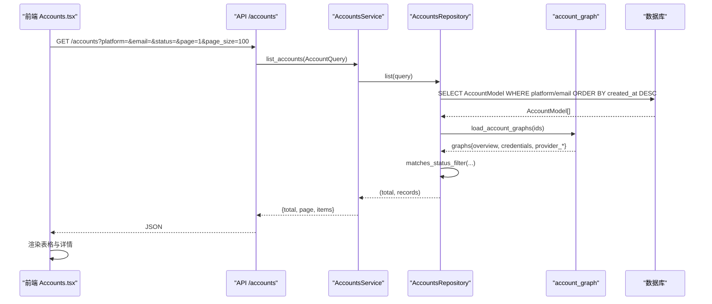
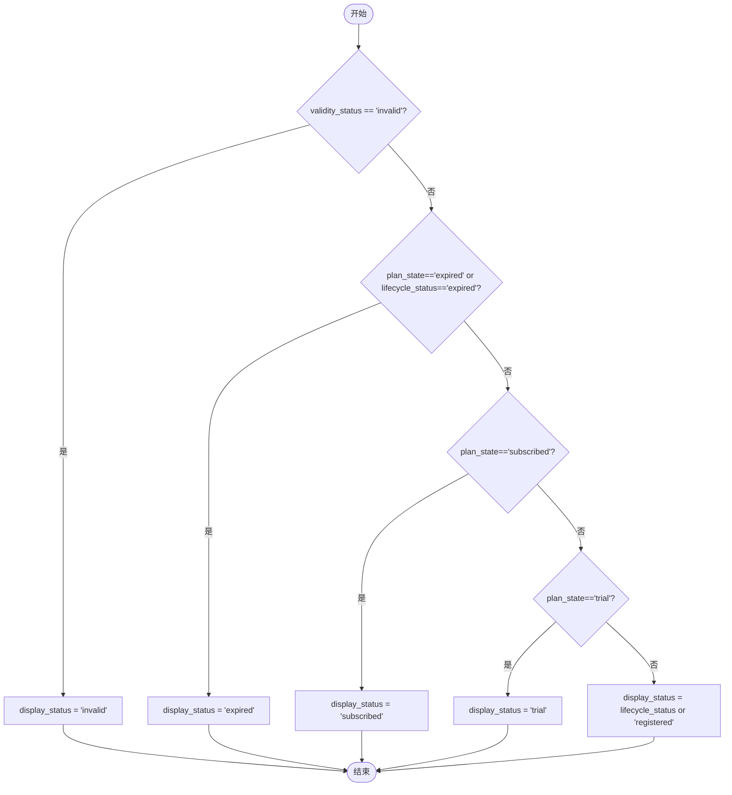
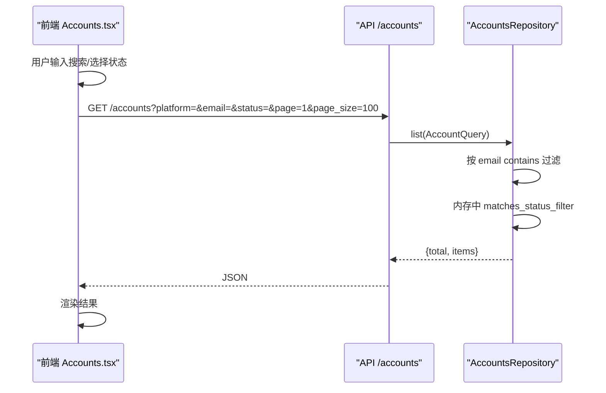
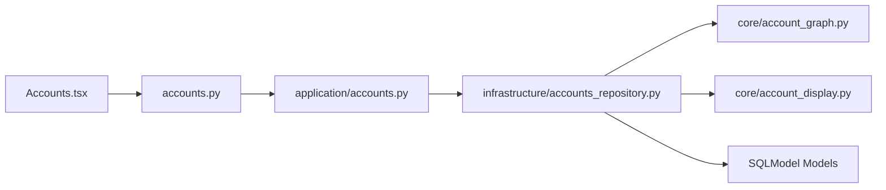

# 账户列表展示

<cite>
**本文引用的文件**
- [frontend/src/pages/Accounts.tsx](file://frontend/src/pages/Accounts.tsx)
- [api/accounts.py](file://api/accounts.py)
- [application/accounts.py](file://application/accounts.py)
- [domain/accounts.py](file://domain/accounts.py)
- [infrastructure/accounts_repository.py](file://infrastructure/accounts_repository.py)
- [core/account_display.py](file://core/account_display.py)
- [core/account_graph.py](file://core/account_graph.py)
</cite>

## 目录
1. [简介](#简介)
2. [项目结构](#项目结构)
3. [核心组件](#核心组件)
4. [架构总览](#架构总览)
5. [详细组件分析](#详细组件分析)
6. [依赖关系分析](#依赖关系分析)
7. [性能考虑](#性能考虑)
8. [故障排查指南](#故障排查指南)
9. [结论](#结论)

## 简介
本章节面向“账户列表展示”功能，系统性说明前端表格构建、状态视觉呈现、搜索与过滤、分页加载、详情展开以及性能优化策略。该功能覆盖多平台账户的集中管理，支持按平台、状态、邮箱等条件筛选，并提供批量操作与导出能力。

## 项目结构
账户列表展示涉及前后端多层协作：
- 前端页面 Accounts.tsx 负责表格渲染、交互、搜索过滤、分页加载、详情弹窗、批量操作与导出。
- API 层 accounts.py 暴露账户查询、创建、更新、删除、统计与导出接口。
- 应用服务 application/accounts.py 将请求转换为领域命令并调用仓储层，同时序列化返回数据。
- 领域模型 domain/accounts.py 定义账户记录、查询参数、导入行、统计等数据结构。
- 基础设施 infrastructure/accounts_repository.py 实现数据库查询、状态过滤、统计与导出。
- 显示摘要 core/account_display.py 生成 display_summary（指标、徽章、警告、分区），供前端统一渲染。
- 账户图 core/account_graph.py 负责账户状态推导、凭证归一化、资源聚合与持久化。

图表来源
- [frontend/src/pages/Accounts.tsx:1510-1963](file://frontend/src/pages/Accounts.tsx#L1510-L1963)
- [api/accounts.py:79-124](file://api/accounts.py#L79-L124)
- [application/accounts.py:42-159](file://application/accounts.py#L42-L159)
- [infrastructure/accounts_repository.py:111-162](file://infrastructure/accounts_repository.py#L111-L162)
- [core/account_display.py:198-278](file://core/account_display.py#L198-L278)
- [core/account_graph.py:185-199](file://core/account_graph.py#L185-L199)

章节来源
- [frontend/src/pages/Accounts.tsx:1510-1963](file://frontend/src/pages/Accounts.tsx#L1510-L1963)
- [api/accounts.py:79-124](file://api/accounts.py#L79-L124)
- [application/accounts.py:42-159](file://application/accounts.py#L42-L159)
- [infrastructure/accounts_repository.py:111-162](file://infrastructure/accounts_repository.py#L111-L162)
- [core/account_display.py:198-278](file://core/account_display.py#L198-L278)
- [core/account_graph.py:185-199](file://core/account_graph.py#L185-L199)

## 核心组件
- 前端账户列表页 Accounts.tsx
  - 表格列：邮箱、密码、状态、试用链接、注册时间、操作。
  - 搜索与过滤：邮箱模糊搜索、状态下拉筛选（已注册、试用中、已订阅、免费、可试用、已过期、已失效）。
  - 分页加载：默认 page_size=100，后端返回 total 与 items。
  - 详情展开：点击行或“详情”按钮打开 DetailModal，展示生命周期、有效性、套餐、额度指标、警告、徽章、Provider 账号与凭证等。
  - 批量操作：全选/单选、批量删除、批量刷新额度、导出 JSON/CSV/Any2Api/Sub2Api/CPA/Kiro-Go。
  - 状态视觉：使用 Badge 与自定义样式映射不同状态的颜色与光晕点。
- API 层 accounts.py
  - GET /accounts：支持 platform、status、email、page、page_size 查询。
  - POST /accounts/export/*：多种格式导出，支持 ids/select_all/status_filter/search_filter。
  - PATCH/DELETE /accounts/{id}：更新或删除账户。
- 应用服务 application/accounts.py
  - list_accounts：调用仓储层获取 total 与 items，并序列化字段。
  - get_stats：返回按平台、状态、生命周期、套餐、有效性、显示状态的统计。
- 领域模型 domain/accounts.py
  - AccountRecord：包含平台、邮箱、密码、生命周期状态、有效性、套餐、显示状态、概览、凭证、资源等。
  - AccountQuery：查询参数（平台、状态、邮箱、分页）。
- 仓储 infrastructure/accounts_repository.py
  - list：按平台、邮箱模糊匹配排序后，再按状态过滤；返回 total 与分页切片。
  - stats：汇总各维度计数。
  - export_csv：导出 CSV。
- 显示摘要 core/account_display.py
  - build_account_display_summary：生成 identity、status、primary_metrics、secondary_metrics、badges、warnings、sections。
- 账户图 core/account_graph.py
  - 状态推导：validity_status、plan_state、display_status 的推导逻辑。
  - 凭证与资源：归一化平台凭证、合并 Provider 账号与资源。
  - 状态过滤：matches_status_filter 用于后端状态筛选。

章节来源
- [frontend/src/pages/Accounts.tsx:16-23](file://frontend/src/pages/Accounts.tsx#L16-L23)
- [frontend/src/pages/Accounts.tsx:1510-1963](file://frontend/src/pages/Accounts.tsx#L1510-L1963)
- [api/accounts.py:79-124](file://api/accounts.py#L79-L124)
- [application/accounts.py:42-159](file://application/accounts.py#L42-L159)
- [domain/accounts.py:8-39](file://domain/accounts.py#L8-L39)
- [infrastructure/accounts_repository.py:111-162](file://infrastructure/accounts_repository.py#L111-L162)
- [core/account_display.py:198-278](file://core/account_display.py#L198-L278)
- [core/account_graph.py:185-199](file://core/account_graph.py#L185-L199)

## 架构总览
账户列表展示的端到端流程如下：
- 前端发起 GET /accounts?platform=&email=&status=&page=1&page_size=100。
- API 路由转发到应用服务 AccountsService.list_accounts。
- 仓储层执行 SQL 查询并按 email 模糊匹配、created_at 倒序排序，随后在内存中按状态过滤。
- 仓储层通过账户图模块加载 overview、credentials、provider_accounts、provider_resources，并计算 display_summary。
- 应用服务序列化返回 {total, page, items}。
- 前端渲染表格，根据 display_summary.primary_metrics/secondary_metrics/badges/warnings/sections 展示详细信息。

图表来源
- [frontend/src/pages/Accounts.tsx:1554-1565](file://frontend/src/pages/Accounts.tsx#L1554-L1565)
- [api/accounts.py:79-87](file://api/accounts.py#L79-L87)
- [application/accounts.py:46-52](file://application/accounts.py#L46-L52)
- [infrastructure/accounts_repository.py:111-133](file://infrastructure/accounts_repository.py#L111-L133)
- [core/account_graph.py:613-652](file://core/account_graph.py#L613-L652)

## 详细组件分析

### 账户信息表格构建
- 列定义与布局
  - 选择框列：支持全选当前页与单选。
  - 邮箱列：显示主邮箱，若存在验证邮箱则附加显示；远端邮箱差异提示。
  - 密码列：默认模糊显示，悬停可复制。
  - 状态列：显示 display_status，附带 primary_metrics 前两项（如周限额、Credits）或紧凑元信息。
  - 试用链接列：如有 cashier_url，提供复制链接与外链打开。
  - 注册时间列：格式化本地时间。
  - 操作列：详情、更多动作（动态加载）、删除。
- 数据来源
  - 列表项来自 API 返回的 items，每个 item 包含 id、platform、email、password、lifecycle_status、validity_status、plan_state、plan_name、display_status、overview、display_summary、credentials、provider_accounts、provider_resources、created_at、updated_at。
- 关键函数
  - getAccountOverview、getDisplaySummary、getVerificationMailbox、getLifecycleStatus、getDisplayStatus、getPlanState、getValidityStatus、getPrimaryMetrics、getSecondaryMetrics、getDisplayWarnings、getDisplayBadges、getDisplaySections、getCashierUrl、getPrimaryToken。

章节来源
- [frontend/src/pages/Accounts.tsx:25-127](file://frontend/src/pages/Accounts.tsx#L25-L127)
- [frontend/src/pages/Accounts.tsx:1788-1956](file://frontend/src/pages/Accounts.tsx#L1788-L1956)
- [application/accounts.py:136-159](file://application/accounts.py#L136-L159)

### 状态标识与视觉呈现
- 状态值
  - lifecycle_status：registered/trial/subscribed/expired/invalid
  - validity_status：unknown/valid/invalid
  - plan_state：trial/subscribed/free/eligible/expired/unknown
  - display_status：由 validity_status、plan_state、lifecycle_status 推导得出。
- 颜色与图标
  - STATUS_VARIANT 映射：registered→default，trial→success，subscribed→success，expired→warning，invalid→danger，free→secondary，eligible→secondary，valid→success，unknown→secondary。
  - 样式规则：success 绿色背景+发光点，warning 琥珀色背景+发光点，danger 红色背景+发光点，default 蓝色背景，secondary 中性背景。
- 状态推导逻辑
  - 若 validity_status 为 invalid → display_status=invalid
  - 若 plan_state 或 lifecycle_status 为 expired → display_status=expired
  - 若 plan_state=subscribed → display_status=subscribed
  - 若 plan_state=trial → display_status=trial
  - 否则 fallback 到 lifecycle_status 或 registered。

图表来源
- [core/account_graph.py:185-199](file://core/account_graph.py#L185-L199)
- [frontend/src/pages/Accounts.tsx:16-20](file://frontend/src/pages/Accounts.tsx#L16-L20)

章节来源
- [core/account_graph.py:185-199](file://core/account_graph.py#L185-L199)
- [frontend/src/pages/Accounts.tsx:16-20](file://frontend/src/pages/Accounts.tsx#L16-L20)

### 搜索与过滤功能
- 搜索
  - 邮箱模糊搜索：前端输入 search，防抖 400ms 后触发 load(tab, debouncedSearch, filterStatus)。
  - 后端 email 参数使用 contains 进行模糊匹配。
- 过滤
  - 状态下拉筛选：支持全部状态、已注册、试用中、已订阅、免费、可试用、已过期、已失效。
  - 后端使用 matches_status_filter 对 display_status、lifecycle_status、plan_state、validity_status 任一匹配即保留。
- 组合查询
  - 支持 platform + email + status + page/page_size 的组合查询。

图表来源
- [frontend/src/pages/Accounts.tsx:1545-1565](file://frontend/src/pages/Accounts.tsx#L1545-L1565)
- [api/accounts.py:79-87](file://api/accounts.py#L79-L87)
- [infrastructure/accounts_repository.py:111-133](file://infrastructure/accounts_repository.py#L111-L133)
- [core/account_graph.py:1027-1036](file://core/account_graph.py#L1027-L1036)

章节来源
- [frontend/src/pages/Accounts.tsx:1545-1565](file://frontend/src/pages/Accounts.tsx#L1545-L1565)
- [api/accounts.py:79-87](file://api/accounts.py#L79-L87)
- [infrastructure/accounts_repository.py:111-133](file://infrastructure/accounts_repository.py#L111-L133)
- [core/account_graph.py:1027-1036](file://core/account_graph.py#L1027-L1036)

### 分页加载机制
- 前端默认 page_size=100，page=1，当搜索或过滤变化时重置 selectedIds 并重新加载。
- 后端返回 total 与 items，前端据此控制列表长度与统计显示。
- 当前未实现客户端虚拟滚动，但可通过增大 page_size 或后端游标分页进一步优化。

章节来源
- [frontend/src/pages/Accounts.tsx:1554-1565](file://frontend/src/pages/Accounts.tsx#L1554-L1565)
- [application/accounts.py:46-52](file://application/accounts.py#L46-L52)
- [infrastructure/accounts_repository.py:111-133](file://infrastructure/accounts_repository.py#L111-L133)

### 账户详情展开
- 详情弹窗 DetailModal
  - 展示核心状态：display_status、plan_name、lifecycle_status、validity_status、plan_state。
  - 展示 secondary_metrics 前四项与 primary_metrics 全量。
  - 展示 warnings（失效、未知有效性、配额提示、检查错误）。
  - 展示 badges（如“邮箱验证”）与 verification_mailbox 信息。
  - 展示 provider_accounts 与 platform_credentials，支持复制凭证。
  - 支持编辑 lifecycle_status、primary_token、cashier_url 并保存。
- 数据来源
  - 从账户记录的 display_summary 与 overview、credentials、provider_accounts、provider_resources 中提取。

章节来源
- [frontend/src/pages/Accounts.tsx:1207-1389](file://frontend/src/pages/Accounts.tsx#L1207-L1389)
- [core/account_display.py:198-278](file://core/account_display.py#L198-L278)
- [core/account_graph.py:613-652](file://core/account_graph.py#L613-L652)

### 批量操作与导出
- 批量删除：选中多个账户后一键删除，使用 Promise.allSettled 并发处理。
- 批量刷新额度：调用 /accounts/check-all?platform=... 启动异步任务，通过 ActionTaskModal 跟踪任务状态。
- 导出：
  - 非 chatgpt 平台：前端直接生成 CSV 下载。
  - chatgpt 平台：支持导出 JSON/CSV/Any2Api/Sub2Api/CPA/Kiro-Go，支持 ids/select_all/status_filter/search_filter。

章节来源
- [frontend/src/pages/Accounts.tsx:1391-1508](file://frontend/src/pages/Accounts.tsx#L1391-L1508)
- [frontend/src/pages/Accounts.tsx:1731-1782](file://frontend/src/pages/Accounts.tsx#L1731-L1782)
- [api/accounts.py:110-192](file://api/accounts.py#L110-L192)

## 依赖关系分析
- 前端依赖
  - 依赖 app-data 获取配置与平台列表。
  - 依赖 utils 进行 apiFetch、apiDownload、triggerBrowserDownload。
  - 依赖 tasks 工具获取任务状态文本与变体。
- 后端依赖
  - API 依赖 FastAPI 路由与 Pydantic 模型。
  - 应用服务依赖领域模型与仓储。
  - 仓储依赖 SQLModel、账户图模块与显示摘要模块。
  - 账户图模块依赖数据库模型与时间工具。

图表来源
- [frontend/src/pages/Accounts.tsx:1-14](file://frontend/src/pages/Accounts.tsx#L1-L14)
- [api/accounts.py:1-16](file://api/accounts.py#L1-L16)
- [application/accounts.py:1-18](file://application/accounts.py#L1-L18)
- [infrastructure/accounts_repository.py:1-29](file://infrastructure/accounts_repository.py#L1-L29)
- [core/account_graph.py:1-18](file://core/account_graph.py#L1-L18)

章节来源
- [frontend/src/pages/Accounts.tsx:1-14](file://frontend/src/pages/Accounts.tsx#L1-L14)
- [api/accounts.py:1-16](file://api/accounts.py#L1-L16)
- [application/accounts.py:1-18](file://application/accounts.py#L1-L18)
- [infrastructure/accounts_repository.py:1-29](file://infrastructure/accounts_repository.py#L1-L29)
- [core/account_graph.py:1-18](file://core/account_graph.py#L1-L18)

## 性能考虑
- 当前实现
  - 前端固定 page_size=100，适合中等规模数据；大数据集建议引入虚拟滚动或无限滚动。
  - 后端在内存中进行状态过滤，适用于中小数据集；超大规模建议在后端 SQL 层增加索引与过滤。
  - 平台动作缓存：platformActionsCache 与 platformActionsPromiseCache 避免重复请求。
- 优化建议
  - 前端虚拟滚动：使用 react-window 或 vue-virtual-scroller 替代全量渲染，减少 DOM 节点数量。
  - 懒加载详情：仅在点击行时加载完整详情数据，避免首屏过重。
  - 后端分页优化：使用游标分页或基于 ID 的分页，减少 total 计算开销。
  - 缓存策略：对常用平台动作、平台能力、配置进行短期缓存。
  - 导出优化：大文件导出采用流式响应与分片处理，避免内存峰值。

[本节为通用性能指导，不直接分析具体代码文件]

## 故障排查指南
- 列表为空
  - 检查平台选择是否正确，确认 platform 参数传递。
  - 检查搜索与过滤条件是否过于严格。
  - 查看后端日志与数据库是否存在对应记录。
- 状态显示异常
  - 核对 display_status 推导逻辑，确认 validity_status、plan_state、lifecycle_status 的值。
  - 检查账户概览 overview 中的 plan、membership_type、plan_state 等字段。
- 详情无法加载
  - 确认账户 ID 有效，检查 API 返回是否包含 display_summary 与 overview。
  - 检查凭证与 Provider 资源是否缺失，必要时同步账户图。
- 导出失败
  - 检查导出格式是否受平台限制（如 Kiro-Go 仅 kiro 平台）。
  - 检查 ids/select_all/status_filter/search_filter 参数是否合法。

章节来源
- [core/account_graph.py:185-199](file://core/account_graph.py#L185-L199)
- [core/account_graph.py:1027-1036](file://core/account_graph.py#L1027-L1036)
- [api/accounts.py:110-192](file://api/accounts.py#L110-L192)

## 结论
账户列表展示功能通过前后端协同实现了多平台账户的统一管理与可视化。其核心在于：
- 清晰的表格结构与丰富的状态信息展示。
- 灵活的搜索与过滤机制，支持多维度筛选。
- 可靠的分页加载与批量操作能力。
- 完善的详情展开与导出功能。
未来可进一步引入虚拟滚动、后端游标分页与更细粒度的缓存策略，以应对更大规模的数据场景。