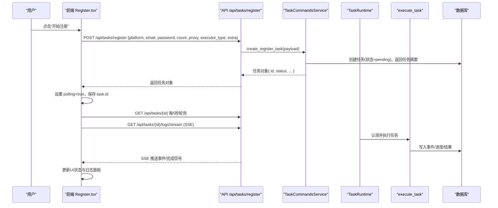
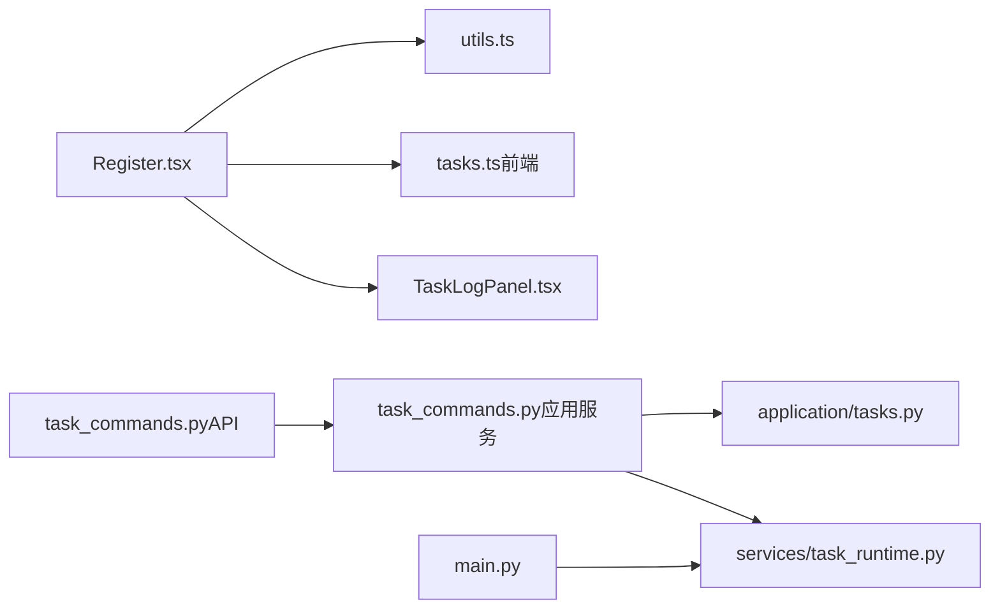

# 任务提交流程

<cite>
**本文引用的文件**
- [Register.tsx](file://frontend/src/pages/Register.tsx)
- [utils.ts](file://frontend/src/lib/utils.ts)
- [tasks.ts（前端）](file://frontend/src/lib/tasks.ts)
- [TaskLogPanel.tsx](file://frontend/src/components/tasks/TaskLogPanel.tsx)
- [task_commands.py（API路由）](file://api/task_commands.py)
- [task_commands.py（应用服务）](file://application/task_commands.py)
- [tasks.py（应用层）](file://application/tasks.py)
- [task_runtime.py](file://services/task_runtime.py)
- [main.py](file://main.py)
</cite>

## 目录
1. [简介](#简介)
2. [项目结构](#项目结构)
3. [核心组件](#核心组件)
4. [架构总览](#架构总览)
5. [详细组件分析](#详细组件分析)
6. [依赖关系分析](#依赖关系分析)
7. [性能与可靠性](#性能与可靠性)
8. [故障排查指南](#故障排查指南)
9. [结论](#结论)

## 简介
本文面向“任务提交”的完整流程，覆盖从前端注册表单到后端创建并执行任务的端到端链路。重点说明：
- 如何构造并提交注册请求到后端 API（请求格式、参数传递）
- 任务 ID 的生成、获取与在日志面板中的使用
- 异步处理机制：加载状态管理、错误处理、响应处理
- 重试与超时策略，确保提交与执行的可靠性
- 前后端通信协议与数据格式
- 任务提交后的状态更新与界面反馈机制

## 项目结构
本系统采用前后端分离架构：
- 前端：React + TypeScript，负责用户交互、构建请求、轮询/SSE 拉取任务状态与日志
- 后端：FastAPI 提供 REST 接口，包含任务命令、查询与 SSE 日志流；内部通过线程池调度任务执行
- 运行时：TaskRuntime 维护并发控制、任务认领与执行生命周期

```mermaid
graph TB
FE["前端页面<br/>Register.tsx"] --> API["API 路由<br/>/api/tasks/register"]
API --> SVC["应用服务<br/>TaskCommandsService"]
SVC --> TASKS["任务持久化与编排<br/>application/tasks.py"]
TASKS --> RUNTIME["任务运行时<br/>services/task_runtime.py"]
RUNTIME --> EXEC["任务执行器<br/>execute_task(...)"]
EXEC --> DB["数据库<br/>TaskModel/TaskEventModel"]
FE <--|轮询/事件| API
FE <--|SSE 日志流| API
```

图表来源
- [Register.tsx:244-278](file://frontend/src/pages/Register.tsx#L244-L278)
- [task_commands.py（API路由）:29-31](file://api/task_commands.py#L29-L31)
- [task_commands.py（应用服务）:20-24](file://application/task_commands.py#L20-L24)
- [tasks.py（应用层）:174-208](file://application/tasks.py#L174-L208)
- [task_runtime.py:47-85](file://services/task_runtime.py#L47-L85)

章节来源
- [Register.tsx:244-278](file://frontend/src/pages/Register.tsx#L244-L278)
- [task_commands.py（API路由）:29-31](file://api/task_commands.py#L29-L31)
- [task_commands.py（应用服务）:20-24](file://application/task_commands.py#L20-L24)
- [tasks.py（应用层）:174-208](file://application/tasks.py#L174-L208)
- [task_runtime.py:47-85](file://services/task_runtime.py#L47-L85)

## 核心组件
- 前端提交入口：Register.tsx 负责组装表单数据、调用 /api/tasks/register 创建任务，并启动轮询与日志面板
- 通用网络层：utils.ts 封装 apiFetch，统一添加鉴权头、处理 401 与错误响应
- 任务命令服务：application/task_commands.py 将创建任务与唤醒运行器解耦
- 任务持久化与编排：application/tasks.py 负责任务模型序列化、事件记录、进度更新、结果聚合
- 任务运行时：services/task_runtime.py 以线程方式认领并执行任务，支持并发与平台并行度限制
- 主进程：main.py 在启动时初始化数据库、加载平台与 Provider、启动任务运行时

章节来源
- [Register.tsx:244-278](file://frontend/src/pages/Register.tsx#L244-L278)
- [utils.ts:24-36](file://frontend/src/lib/utils.ts#L24-L36)
- [task_commands.py（应用服务）:20-24](file://application/task_commands.py#L20-L24)
- [tasks.py（应用层）:129-158](file://application/tasks.py#L129-L158)
- [task_runtime.py:18-85](file://services/task_runtime.py#L18-L85)
- [main.py:67-83](file://main.py#L67-L83)

## 架构总览
下图展示了“任务提交”的关键时序：前端发起 POST 创建任务，后端返回任务对象（含 task_id），前端基于该 ID 轮询任务状态并通过 SSE 订阅实时日志。



图表来源
- [Register.tsx:244-316](file://frontend/src/pages/Register.tsx#L244-L316)
- [task_commands.py（API路由）:29-31](file://api/task_commands.py#L29-L31)
- [task_commands.py（应用服务）:20-24](file://application/task_commands.py#L20-L24)
- [tasks.py（应用层）:174-208](file://application/tasks.py#L174-L208)
- [task_runtime.py:47-85](file://services/task_runtime.py#L47-L85)

## 详细组件分析

### 前端：注册表单与任务提交
- 表单组装：根据当前平台与配置动态生成选项，合并 provider 字段与默认值
- 提交动作：POST /api/tasks/register，请求体包含 platform、email、password、count、proxy、executor_type、captcha_solver 以及 extra（identity_provider、oauth_provider、mail_provider、sms_provider 等）
- 提交后行为：
  - 保存返回的任务对象，开启 polling 标志
  - 每 5 秒轮询 GET /api/tasks/{task_id}，直到进入终态
  - 打开 TaskLogPanel，传入 taskId 与 onDone 回调，用于接收完成状态并关闭轮询

章节来源
- [Register.tsx:244-316](file://frontend/src/pages/Register.tsx#L244-L316)

### 前端：网络层与鉴权
- apiFetch 统一封装 fetch，自动附加 Authorization 头（Bearer token）
- 401 自动清理本地 token 并刷新页面
- 非 2xx 响应抛出错误，供上层捕获

章节来源
- [utils.ts:24-36](file://frontend/src/lib/utils.ts#L24-L36)

### 前端：任务状态与日志面板
- 状态常量与文本映射：isTerminalTaskStatus、getTaskStatusText
- TaskLogPanel：
  - 优先使用 SSE 订阅 /api/tasks/{taskId}/logs/stream，收到 done 信号后停止轮询
  - 若 SSE 不可用，回退为每 1 秒轮询 /api/tasks/{taskId}/events?since=cursor
  - 同步任务详情 GET /api/tasks/{taskId}，展示进度、错误、成功数等
  - 完成后调用 onDone(status) 通知父组件

章节来源
- [tasks.ts（前端）:1-45](file://frontend/src/lib/tasks.ts#L1-L45)
- [TaskLogPanel.tsx:28-108](file://frontend/src/components/tasks/TaskLogPanel.tsx#L28-L108)

### 后端：任务创建与命令服务
- API 路由 /api/tasks/register：接收 RegisterTaskRequest，调用 TaskCommandsService.create_register_task
- 应用服务：
  - 创建任务（create_register_task）：生成 task_id，写入 pending 状态，返回任务摘要
  - 唤醒运行器：task_runtime.wake_up() 触发调度循环检查新任务

章节来源
- [task_commands.py（API路由）:17-31](file://api/task_commands.py#L17-L31)
- [task_commands.py（应用服务）:20-24](file://application/task_commands.py#L20-L24)

### 后端：任务持久化与编排
- 任务模型序列化：包含 id、status、progress、success/error_count、errors、cashier_urls、data、时间戳等
- 事件记录：append_task_event 写入 TaskEventModel，供前端 SSE/轮询消费
- 进度与结果：TaskLogger 提供 set_progress、record_success、record_error、add_cashier_url、finish 等方法
- 任务取消：request_cancel 将 pending/running 任务置为 cancel_requested 或 cancelled

章节来源
- [tasks.py（应用层）:129-158](file://application/tasks.py#L129-L158)
- [tasks.py（应用层）:281-293](file://application/tasks.py#L281-L293)
- [tasks.py（应用层）:318-338](file://application/tasks.py#L318-L338)
- [tasks.py（应用层）:371-458](file://application/tasks.py#L371-L458)

### 后端：任务运行时与执行
- TaskRuntime：
  - 启动时标记未完成的任务为 interrupted
  - 循环认领 pending 任务，考虑平台并行度与账户占用
  - 为每个任务创建线程执行 execute_task
- execute_task：
  - 根据任务类型分发处理器（register/account_check/platform_action）
  - 注册任务处理器会解析配置、初始化邮箱/短信、执行平台注册、记录结果与后续操作（如 CPA 上传、Any2API 推送）

章节来源
- [task_runtime.py:18-85](file://services/task_runtime.py#L18-L85)
- [tasks.py（应用层）:570-595](file://application/tasks.py#L570-L595)
- [tasks.py（应用层）:692-790](file://application/tasks.py#L692-L790)

### 后端：SSE 日志流
- /api/tasks/{task_id}/logs/stream：
  - 发送 retry 指令与连接确认
  - 持续读取任务事件，推送 data 消息
  - 当任务进入终态时发送 done 信号并关闭流
  - 空闲时发送心跳 ping 保持连接

章节来源
- [task_commands.py（API路由）:42-50](file://api/task_commands.py#L42-L50)
- [task_commands.py（应用服务）:32-76](file://application/task_commands.py#L32-L76)

## 依赖关系分析
- 前端依赖：
  - Register.tsx 依赖 utils.ts（网络）、tasks.ts（状态工具）、TaskLogPanel.tsx（日志面板）
- 后端依赖：
  - API 路由依赖 application/task_commands.py（命令服务）
  - 命令服务依赖 application/tasks.py（持久化与编排）与 services/task_runtime.py（运行时）
  - main.py 在启动时初始化数据库、加载平台与 Provider、启动任务运行时



图表来源
- [Register.tsx:244-316](file://frontend/src/pages/Register.tsx#L244-L316)
- [task_commands.py（API路由）:29-50](file://api/task_commands.py#L29-L50)
- [task_commands.py（应用服务）:20-76](file://application/task_commands.py#L20-L76)
- [tasks.py（应用层）:174-208](file://application/tasks.py#L174-L208)
- [task_runtime.py:47-85](file://services/task_runtime.py#L47-L85)
- [main.py:67-83](file://main.py#L67-L83)

章节来源
- [Register.tsx:244-316](file://frontend/src/pages/Register.tsx#L244-L316)
- [task_commands.py（API路由）:29-50](file://api/task_commands.py#L29-L50)
- [task_commands.py（应用服务）:20-76](file://application/task_commands.py#L20-L76)
- [tasks.py（应用层）:174-208](file://application/tasks.py#L174-L208)
- [task_runtime.py:47-85](file://services/task_runtime.py#L47-L85)
- [main.py:67-83](file://main.py#L67-L83)

## 性能与可靠性

### 异步请求处理与状态管理
- 前端：
  - 提交后立即设置 polling=true，禁用按钮防止重复提交
  - 每 5 秒轮询任务状态，进入终态后停止轮询
  - 日志面板优先使用 SSE，失败则回退为事件轮询
- 后端：
  - 任务创建即返回，不阻塞等待执行完成
  - 任务运行时按平台并行度限制并发，避免资源争用
  - 事件与进度实时更新，前端可即时渲染

章节来源
- [Register.tsx:244-316](file://frontend/src/pages/Register.tsx#L244-L316)
- [TaskLogPanel.tsx:28-108](file://frontend/src/components/tasks/TaskLogPanel.tsx#L28-L108)
- [task_runtime.py:47-85](file://services/task_runtime.py#L47-L85)

### 错误处理与恢复
- 前端：
  - 401 自动清理 token 并刷新页面
  - 轮询异常被动忽略，不影响 UI
  - 任务终态时关闭轮询与 SSE
- 后端：
  - 服务重启时将未完成任务标记为 interrupted，避免悬挂任务
  - 任务执行异常记录错误并累计 error_count
  - 取消请求将任务置为 cancel_requested 或 cancelled

章节来源
- [utils.ts:24-36](file://frontend/src/lib/utils.ts#L24-L36)
- [tasks.py（应用层）:296-316](file://application/tasks.py#L296-L316)
- [tasks.py（应用层）:414-423](file://application/tasks.py#L414-L423)
- [tasks.py（应用层）:318-338](file://application/tasks.py#L318-L338)

### 重试机制与超时处理
- 前端：
  - 无显式重试逻辑，依赖浏览器重连与 SSE 的 retry 指令
- 后端：
  - SSE 流包含 retry: 5000，客户端断开后可自动重连
  - 心跳 ping 维持长连接活性
  - 任务执行侧未实现业务级重试，但可通过外部调度或重试队列扩展

章节来源
- [task_commands.py（应用服务）:32-76](file://application/task_commands.py#L32-L76)

### 前后端通信协议与数据格式
- 协议：REST JSON + Server-Sent Events（SSE）
- 请求：
  - POST /api/tasks/register，JSON 体包含 platform、email、password、count、proxy、executor_type、captcha_solver、extra
- 响应：
  - 任务摘要对象，包含 id、status、progress、success/error_count、errors、cashier_urls、data、时间戳
- 事件：
  - GET /api/tasks/{task_id}/events?since=cursor 返回事件列表
  - GET /api/tasks/{task_id}/logs/stream 返回 SSE 流，包含 data 消息与 done 信号

章节来源
- [task_commands.py（API路由）:17-50](file://api/task_commands.py#L17-L50)
- [tasks.py（应用层）:129-158](file://application/tasks.py#L129-L158)
- [task_commands.py（应用服务）:32-76](file://application/task_commands.py#L32-L76)

### 任务提交后的状态更新与界面反馈
- 状态更新：
  - 前端轮询任务状态，显示进度、成功/失败计数、错误信息
  - 日志面板实时显示执行日志，支持复制
- 界面反馈：
  - 按钮在提交期间禁用并显示“注册中...”
  - 任务完成时弹出 cashier_urls（如有）并关闭轮询
  - 错误与中断状态以不同颜色提示

章节来源
- [Register.tsx:357-362](file://frontend/src/pages/Register.tsx#L357-L362)
- [Register.tsx:520-588](file://frontend/src/pages/Register.tsx#L520-L588)
- [TaskLogPanel.tsx:114-163](file://frontend/src/components/tasks/TaskLogPanel.tsx#L114-L163)

## 故障排查指南
- 无法创建任务：
  - 检查 /api/tasks/register 是否可达，请求体是否符合 RegisterTaskRequest
  - 查看后端日志与数据库是否有 pending 任务
- 任务一直 pending：
  - 确认 TaskRuntime 已启动且未被停止
  - 检查平台并行度与账户占用是否阻止认领
- 日志不更新：
  - 检查 SSE 连接是否建立，浏览器控制台是否有错误
  - 若 SSE 失败，确认事件轮询是否正常
- 任务被中断：
  - 服务重启会将未完成任务标记为 interrupted，需重新提交
- 认证失败：
  - 401 会自动清理 token 并刷新页面，检查后端鉴权配置

章节来源
- [task_runtime.py:28-35](file://services/task_runtime.py#L28-L35)
- [tasks.py（应用层）:296-316](file://application/tasks.py#L296-L316)
- [utils.ts:24-36](file://frontend/src/lib/utils.ts#L24-L36)

## 结论
任务提交流程通过前端表单构建请求、后端快速创建任务并异步执行，结合 SSE 与轮询实现实时状态与日志反馈。系统设计注重可靠性：服务重启恢复悬挂任务、并发控制避免过载、错误记录与取消机制完善。前端通过统一的网络层与状态管理保证用户体验一致性与健壮性。