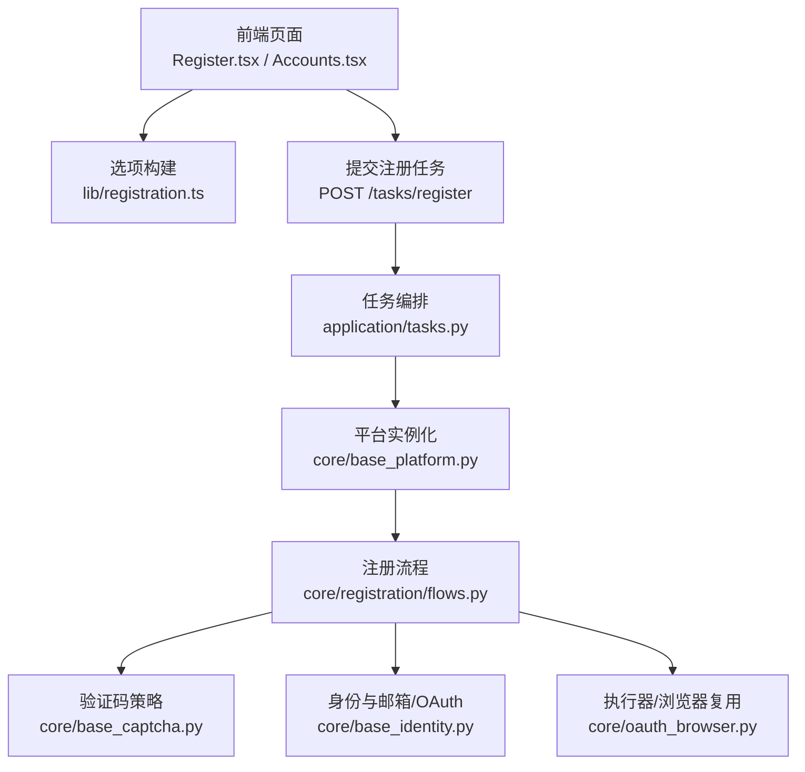
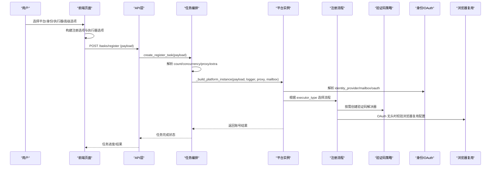
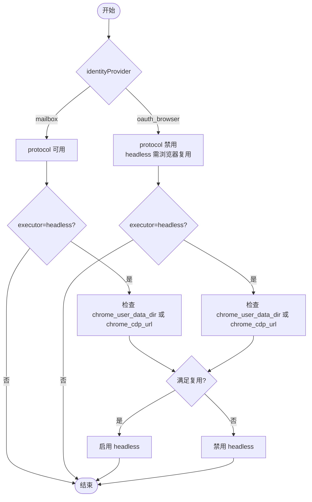
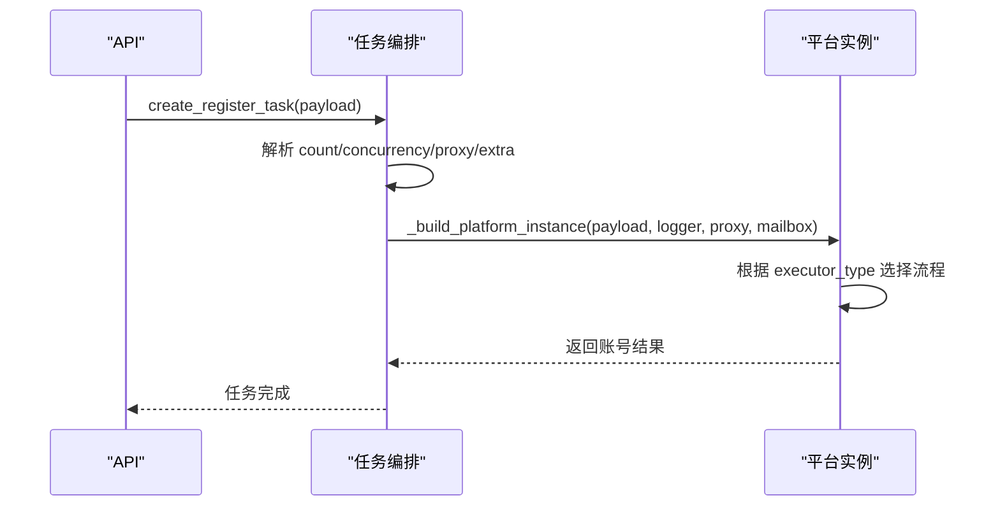
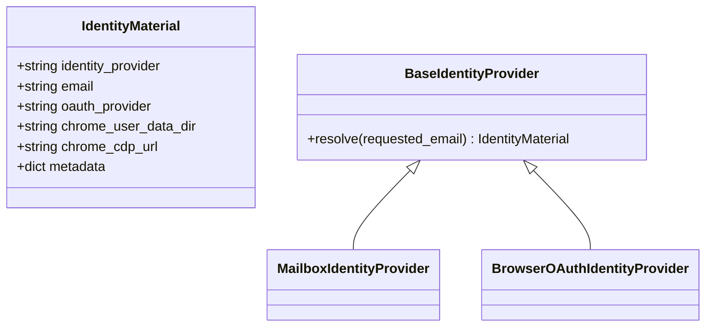
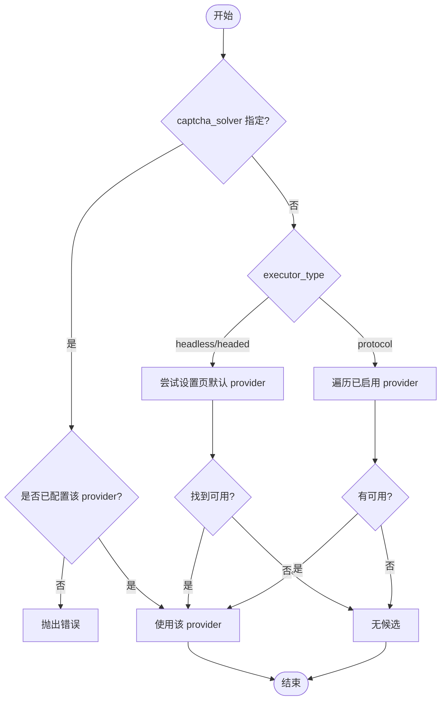
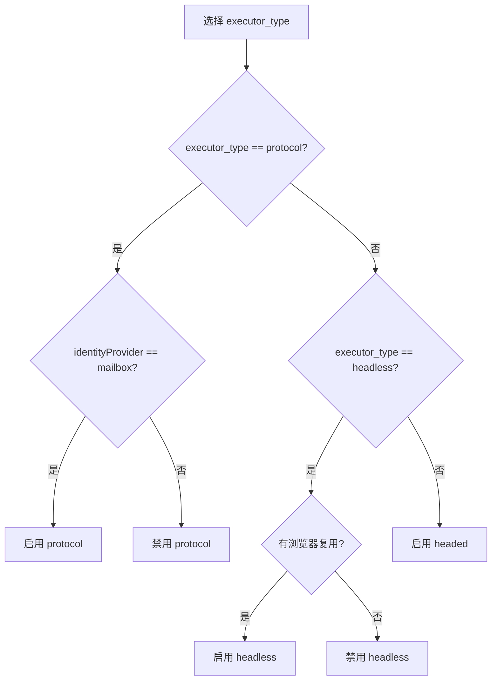
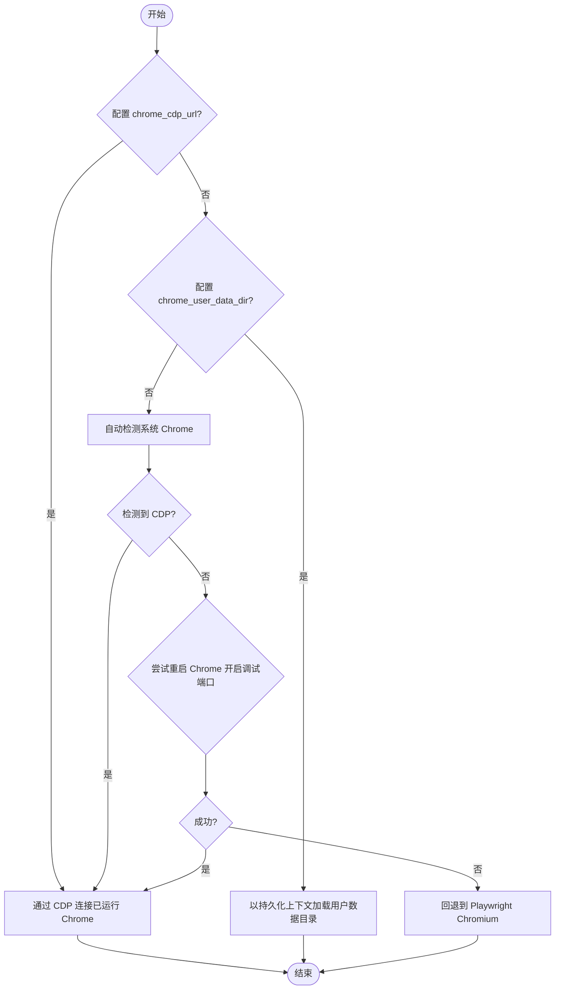
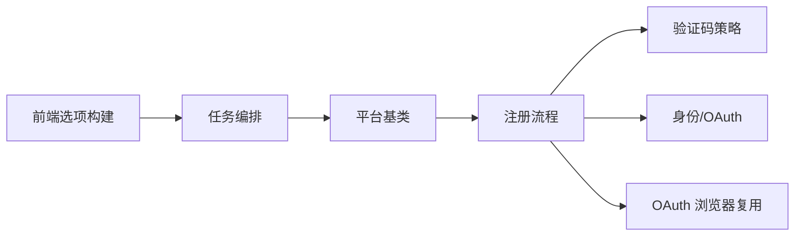

# 注册参数构建

<cite>
**本文引用的文件**
- [core/base_platform.py](file://core/base_platform.py)
- [core/registration/models.py](file://core/registration/models.py)
- [core/registration/flows.py](file://core/registration/flows.py)
- [core/base_identity.py](file://core/base_identity.py)
- [core/base_captcha.py](file://core/base_captcha.py)
- [application/tasks.py](file://application/tasks.py)
- [frontend/src/lib/registration.ts](file://frontend/src/lib/registration.ts)
- [frontend/src/pages/Register.tsx](file://frontend/src/pages/Register.tsx)
- [frontend/src/pages/Accounts.tsx](file://frontend/src/pages/Accounts.tsx)
- [frontend/src/pages/SettingsPage.tsx](file://frontend/src/pages/SettingsPage.tsx)
- [core/oauth_browser.py](file://core/oauth_browser.py)
</cite>

## 目录
1. [简介](#简介)
2. [项目结构](#项目结构)
3. [核心组件](#核心组件)
4. [架构总览](#架构总览)
5. [详细组件分析](#详细组件分析)
6. [依赖关系分析](#依赖关系分析)
7. [性能考虑](#性能考虑)
8. [故障排查指南](#故障排查指南)
9. [结论](#结论)

## 简介
本文聚焦“注册参数构建”的完整链路：从前端用户选择身份提供商与执行器，到后端任务创建、平台实例化、验证码策略解析、代理与并发控制，以及 OAuth 浏览器复用配置（Chrome 用户数据目录与 CDP URL）等高级选项的处理逻辑。文档同时解释参数校验、默认值填充机制，并给出可视化流程图与时序图，帮助读者快速理解与排障。

## 项目结构
围绕注册参数构建的关键代码分布在以下模块：
- 前端表单与选项生成：Register.tsx、Accounts.tsx、lib/registration.ts、SettingsPage.tsx
- 后端任务编排与平台实例化：application/tasks.py、core/base_platform.py
- 注册流程与能力约束：core/registration/flows.py、core/registration/models.py
- 身份与邮箱/OAuth 信息：core/base_identity.py
- 验证码策略与解决器：core/base_captcha.py
- OAuth 浏览器复用：core/oauth_browser.py

**图表来源**
- [frontend/src/pages/Register.tsx:135-144](file://frontend/src/pages/Register.tsx#L135-L144)
- [frontend/src/lib/registration.ts:34-111](file://frontend/src/lib/registration.ts#L34-L111)
- [application/tasks.py:500-532](file://application/tasks.py#L500-L532)
- [core/base_platform.py:316-328](file://core/base_platform.py#L316-L328)
- [core/registration/flows.py:18-141](file://core/registration/flows.py#L18-L141)
- [core/base_captcha.py:48-97](file://core/base_captcha.py#L48-L97)
- [core/base_identity.py:39-130](file://core/base_identity.py#L39-L130)
- [core/oauth_browser.py:166-212](file://core/oauth_browser.py#L166-L212)

**章节来源**
- [frontend/src/pages/Register.tsx:135-144](file://frontend/src/pages/Register.tsx#L135-L144)
- [frontend/src/lib/registration.ts:34-111](file://frontend/src/lib/registration.ts#L34-L111)
- [application/tasks.py:500-532](file://application/tasks.py#L500-L532)
- [core/base_platform.py:316-328](file://core/base_platform.py#L316-L328)
- [core/registration/flows.py:18-141](file://core/registration/flows.py#L18-L141)
- [core/base_captcha.py:48-97](file://core/base_captcha.py#L48-L97)
- [core/base_identity.py:39-130](file://core/base_identity.py#L39-L130)
- [core/oauth_browser.py:166-212](file://core/oauth_browser.py#L166-L212)

## 核心组件
- 注册配置对象 RegisterConfig：封装 executor_type、captcha_solver、proxy、extra 等关键参数。
- 身份提供者 IdentityMaterial：统一承载 identity_provider、email、oauth_provider、chrome_user_data_dir、chrome_cdp_url 等。
- 注册上下文 RegistrationContext：聚合平台、身份、配置、邮箱/密码、日志回调等。
- 注册流程 Flow：BrowserRegistrationFlow、ProtocolMailboxFlow、ProtocolOAuthFlow，负责按适配器能力组装验证码、OTP、链接回调、执行器等。
- 验证码策略：根据 provider_key 与 extra 动态解析可用 provider，支持本地 solver、YesCaptcha、2Captcha 及手动模式。
- 执行器创建：protocol、headless、headed 三种执行器；OAuth 无头模式需浏览器复用。
- OAuth 浏览器复用：优先连接已运行 Chrome（CDP），其次使用持久化上下文加载用户数据目录，最后回退到 Playwright Chromium。

**章节来源**
- [core/base_platform.py:36-42](file://core/base_platform.py#L36-L42)
- [core/registration/models.py:17-39](file://core/registration/models.py#L17-L39)
- [core/registration/flows.py:18-141](file://core/registration/flows.py#L18-L141)
- [core/base_captcha.py:48-97](file://core/base_captcha.py#L48-L97)
- [core/base_platform.py:316-328](file://core/base_platform.py#L316-L328)
- [core/oauth_browser.py:166-212](file://core/oauth_browser.py#L166-L212)

## 架构总览
注册参数构建的前后端协作时序如下：

**图表来源**
- [frontend/src/pages/Register.tsx:135-144](file://frontend/src/pages/Register.tsx#L135-L144)
- [frontend/src/pages/Accounts.tsx:316-352](file://frontend/src/pages/Accounts.tsx#L316-L352)
- [application/tasks.py:500-532](file://application/tasks.py#L500-L532)
- [core/base_platform.py:124-160](file://core/base_platform.py#L124-L160)
- [core/registration/flows.py:18-141](file://core/registration/flows.py#L18-L141)
- [core/base_captcha.py:48-97](file://core/base_captcha.py#L48-L97)
- [core/base_identity.py:39-130](file://core/base_identity.py#L39-L130)
- [core/oauth_browser.py:166-212](file://core/oauth_browser.py#L166-L212)

## 详细组件分析

### 前端注册选项与执行器选项构建
- 注册选项 buildRegistrationOptions：基于平台元数据 supported_identity_modes 与 supported_oauth_providers 生成可选项，区分 mailbox 与 oauth_browser 两类。
- 执行器选项 buildExecutorOptions：
  - protocol：仅当 identityProvider 为 mailbox 时可用；否则禁用并提示需浏览器自动化。
  - headless：mailbox 模式下后台自动；oauth_browser 模式下要求具备浏览器复用（chrome_user_data_dir 或 chrome_cdp_url），否则禁用。
  - headed：始终可用，打开浏览器窗口但无需交互。
- 默认执行器选择 pickOAuthExecutor：在支持列表中优先选择用户偏好，若不可用则回退至 headless/headed，最终取首个可用项。
- 可复用浏览器判断 hasReusableOAuthBrowser：只要配置了 chrome_user_data_dir 或 chrome_cdp_url 即视为可复用。

**图表来源**
- [frontend/src/lib/registration.ts:73-111](file://frontend/src/lib/registration.ts#L73-L111)
- [frontend/src/lib/registration.ts:14-32](file://frontend/src/lib/registration.ts#L14-L32)
- [frontend/src/lib/registration.ts:6-8](file://frontend/src/lib/registration.ts#L6-L8)

**章节来源**
- [frontend/src/lib/registration.ts:34-111](file://frontend/src/lib/registration.ts#L34-L111)
- [frontend/src/pages/Register.tsx:135-144](file://frontend/src/pages/Register.tsx#L135-L144)
- [frontend/src/pages/Accounts.tsx:257-280](file://frontend/src/pages/Accounts.tsx#L257-L280)

### 后端任务创建与参数解析
- 任务创建 create_register_task：将 payload 中的 platform、count、concurrency、proxy、extra 等持久化为任务。
- 单任务执行 _execute_register_task：
  - 并发数 concurrency：限制在 [1, min(count, 5)] 范围内。
  - 代理 proxy：优先使用传入的 proxy，否则从代理池获取。
  - 额外参数 extra：包含 identity_provider、oauth_provider、mail_provider、oauth_email_hint、chrome_user_data_dir、chrome_cdp_url 等。
  - 共享邮箱实例 shared_mailbox：对 mailbox 模式预创建以避免并发初始化问题。
  - 平台实例化 _build_platform_instance：构造 RegisterConfig 并注入 mailbox（必要时）。
- 平台实例化 base_platform：
  - RegisterConfig.executor_type/captcha_solver/proxy/extra 决定后续行为。
  - 根据 executor_type 选择流程：headless/headed 走浏览器流程；protocol 走协议流程；oauth_browser 走协议 OAuth 流程。

**图表来源**
- [application/tasks.py:201-208](file://application/tasks.py#L201-L208)
- [application/tasks.py:692-754](file://application/tasks.py#L692-L754)
- [application/tasks.py:500-532](file://application/tasks.py#L500-L532)
- [core/base_platform.py:124-160](file://core/base_platform.py#L124-L160)

**章节来源**
- [application/tasks.py:201-208](file://application/tasks.py#L201-L208)
- [application/tasks.py:692-754](file://application/tasks.py#L692-L754)
- [application/tasks.py:500-532](file://application/tasks.py#L500-L532)
- [core/base_platform.py:124-160](file://core/base_platform.py#L124-L160)

### 身份与邮箱/OAuth 配置
- 身份提供者归一化：normalize_identity_provider 支持多种别名（如 email/mail -> mailbox；oauth/oauth_browser -> oauth_browser）。
- OAuth 提供者归一化：normalize_oauth_provider 支持 google-oauth2、linkedin-openid、windowslive 等别名。
- BrowserOAuthIdentityProvider.resolve：从 extra 中读取 oauth_email_hint、oauth_provider、chrome_user_data_dir、chrome_cdp_url，并写入 IdentityMaterial。
- MailboxIdentityProvider.resolve：通过 mailbox 获取邮箱，校验请求邮箱与 provider 返回一致。

**图表来源**
- [core/base_identity.py:48-130](file://core/base_identity.py#L48-L130)

**章节来源**
- [core/base_identity.py:39-130](file://core/base_identity.py#L39-L130)

### 验证码策略与解决器
- 策略解析 _get_captcha_solver_candidates：
  - 若 captcha_solver 指定且非 auto/manual，则校验是否已配置对应 provider。
  - 浏览器模式优先尝试设置页默认 provider；协议模式遍历已启用的 provider。
- 创建解决器 create_captcha_solver：
  - manual：返回 ManualCaptcha。
  - local_solver：返回 LocalSolverCaptcha（可能启动本地 solver）。
  - yescaptcha_api/twocaptcha_api：校验密钥存在后返回对应实现。
- 可用性检查 has_captcha_configured：结合定义与运行时设置，验证认证字段是否已填写。

**图表来源**
- [core/base_platform.py:345-394](file://core/base_platform.py#L345-L394)
- [core/base_captcha.py:48-97](file://core/base_captcha.py#L48-L97)

**章节来源**
- [core/base_platform.py:345-394](file://core/base_platform.py#L345-L394)
- [core/base_captcha.py:48-97](file://core/base_captcha.py#L48-L97)

### 执行器选项的动态生成与禁用判断
- 前端：
  - protocol：仅在 mailbox 身份下可用；否则禁用并提示需浏览器自动化。
  - headless：oauth_browser 模式下需要浏览器复用（chrome_user_data_dir 或 chrome_cdp_url），否则禁用。
  - headed：始终可用。
- 后端：
  - _make_executor：根据 executor_type 创建 ProtocolExecutor 或 PlaywrightExecutor（headless/headed）。
  - 平台能力校验：若 executor_type 不在 supported_executors，抛出异常。

**图表来源**
- [frontend/src/lib/registration.ts:73-111](file://frontend/src/lib/registration.ts#L73-L111)
- [core/base_platform.py:316-328](file://core/base_platform.py#L316-L328)

**章节来源**
- [frontend/src/lib/registration.ts:73-111](file://frontend/src/lib/registration.ts#L73-L111)
- [core/base_platform.py:316-328](file://core/base_platform.py#L316-L328)

### OAuth 浏览器配置（Chrome 用户数据目录与 CDP URL）
- 优先级与回退：
  - 若配置 chrome_cdp_url：通过 CDP 连接已运行的 Chrome。
  - 否则若配置 chrome_user_data_dir：以持久化上下文方式加载用户数据目录（携带登录态）。
  - 否则自动检测系统 Chrome：先尝试 CDP，再尝试重启 Chrome 开启调试端口，最后回退到 Playwright Chromium。
- 前端设置页提供输入框用于配置预期登录邮箱、Chrome Profile 路径、Chrome CDP 地址。

**图表来源**
- [core/oauth_browser.py:166-212](file://core/oauth_browser.py#L166-L212)
- [frontend/src/pages/SettingsPage.tsx:169-202](file://frontend/src/pages/SettingsPage.tsx#L169-L202)

**章节来源**
- [core/oauth_browser.py:166-212](file://core/oauth_browser.py#L166-L212)
- [frontend/src/pages/SettingsPage.tsx:169-202](file://frontend/src/pages/SettingsPage.tsx#L169-L202)

### 额外参数的构建（邮箱提供商、OAuth 邮箱提示等）
- 前端 Accounts.tsx：
  - 当 identityProvider 为 mailbox 时，必须配置默认邮箱 provider，否则报错。
  - 将 identity_provider、oauth_provider、oauth_email_hint、chrome_user_data_dir、chrome_cdp_url、mail_provider 等放入 extra。
- 后端 application/tasks.py：
  - 若 identity_provider 为 mailbox 且未显式提供 mail_provider，则从设置库获取默认 provider。
  - 预创建共享 mailbox 实例以避免并发初始化冲突。
- 身份解析 core/base_identity.py：
  - BrowserOAuthIdentityProvider 从 extra 读取 oauth_email_hint、oauth_provider、chrome_user_data_dir、chrome_cdp_url。

**章节来源**
- [frontend/src/pages/Accounts.tsx:316-352](file://frontend/src/pages/Accounts.tsx#L316-L352)
- [application/tasks.py:727-744](file://application/tasks.py#L727-L744)
- [core/base_identity.py:100-117](file://core/base_identity.py#L100-L117)

### 参数验证与默认值处理机制
- 并发数与计数：
  - concurrency = clamp(concurrency, 1, min(count, 5))，确保并发不超过任务总数且上限为 5。
- 验证码策略：
  - 若指定 provider 但未配置，抛出错误；浏览器模式优先使用设置页默认 provider；协议模式遍历已启用 provider。
- 执行器类型：
  - 若 executor_type 不在平台支持的列表中，抛出异常。
- 默认值：
  - executor_type、captcha_solver 默认值由 RegisterConfig 提供。
  - 前端从全局配置加载 default_executor、default_identity_provider、default_oauth_provider、oauth_email_hint、chrome_user_data_dir、chrome_cdp_url 等。

**章节来源**
- [application/tasks.py:692-708](file://application/tasks.py#L692-L708)
- [core/base_platform.py:36-42](file://core/base_platform.py#L36-L42)
- [core/base_platform.py:345-394](file://core/base_platform.py#L345-L394)
- [frontend/src/pages/Register.tsx:109-131](file://frontend/src/pages/Register.tsx#L109-L131)

## 依赖关系分析
- 前端依赖 lib/registration.ts 进行选项计算与默认值选择。
- 后端 application/tasks.py 依赖 core/base_platform.py 创建平台实例与执行器。
- 注册流程 core/registration/flows.py 依赖 core/base_captcha.py 与 core/base_identity.py。
- OAuth 浏览器复用依赖 core/oauth_browser.py 的 CDP/持久化上下文逻辑。

**图表来源**
- [frontend/src/lib/registration.ts:34-111](file://frontend/src/lib/registration.ts#L34-L111)
- [application/tasks.py:500-532](file://application/tasks.py#L500-L532)
- [core/base_platform.py:124-160](file://core/base_platform.py#L124-L160)
- [core/registration/flows.py:18-141](file://core/registration/flows.py#L18-L141)
- [core/base_captcha.py:48-97](file://core/base_captcha.py#L48-L97)
- [core/base_identity.py:39-130](file://core/base_identity.py#L39-L130)
- [core/oauth_browser.py:166-212](file://core/oauth_browser.py#L166-L212)

**章节来源**
- [frontend/src/lib/registration.ts:34-111](file://frontend/src/lib/registration.ts#L34-L111)
- [application/tasks.py:500-532](file://application/tasks.py#L500-L532)
- [core/base_platform.py:124-160](file://core/base_platform.py#L124-L160)
- [core/registration/flows.py:18-141](file://core/registration/flows.py#L18-L141)
- [core/base_captcha.py:48-97](file://core/base_captcha.py#L48-L97)
- [core/base_identity.py:39-130](file://core/base_identity.py#L39-L130)
- [core/oauth_browser.py:166-212](file://core/oauth_browser.py#L166-L212)

## 性能考虑
- 并发度限制：将并发限制在 [1, min(count, 5)]，避免同一 IP 突发导致被限流或封禁。
- 代理池复用：成功/失败后上报代理池，提升整体成功率。
- 共享邮箱实例：预创建 mailbox 实例减少并发初始化开销与竞争。
- 验证码策略回退：多 provider 尝试提高成功率，但需注意超时与重试成本。

[本节为通用指导，不直接分析具体文件]

## 故障排查指南
- 验证码持续失败：
  - 确认验证码 provider 已正确配置（YesCaptcha Client Key 或本地 Solver）。
  - 协议模式优先使用远程服务（YesCaptcha/2Captcha）。
  - 浏览器模式会先尝试 Turnstile checkbox，再回退到远程 solver。
  - 检查代理 IP 质量，高风险 IP 会触发更严格的挑战。
- 代理被封/成功率低：
  - 检查各代理统计并禁用表现差的代理。
  - 使用住宅代理而非数据中心 IP。
  - 降低并发避免同 IP 突发。
  - 不同平台对 IP 敏感度不同，可考虑按平台划分代理池。
- Solver 启动超时：
  - 首次运行可能需要下载 Camoufox，检查依赖与端口占用（8889）。
  - 跳过本地 Solver，配置 YesCaptcha/2Captcha 并在任务配置中选择远程 solver。
  - Docker 环境建议使用预构建镜像；裸机环境检查端口与安装情况。

**章节来源**
- [README_en.md:380-410](file://README_en.md#L380-L410)
- [core/base_captcha.py:48-97](file://core/base_captcha.py#L48-L97)
- [application/tasks.py:692-754](file://application/tasks.py#L692-L754)

## 结论
注册参数构建贯穿前后端：前端基于平台元数据与用户配置动态生成注册选项与执行器选项，后端在任务编排阶段解析并发、代理、验证码策略与额外参数，并通过平台基类与注册流程选择合适的执行器与身份提供者。OAuth 浏览器复用通过 CDP 或持久化上下文加载用户数据目录，确保第三方登录态复用。合理的参数验证与默认值处理保障了注册流程的稳定与易用性。