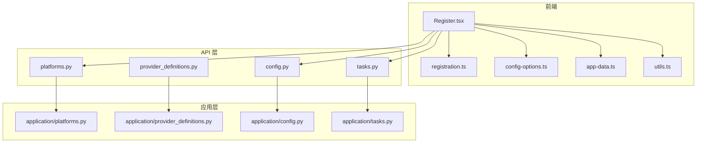
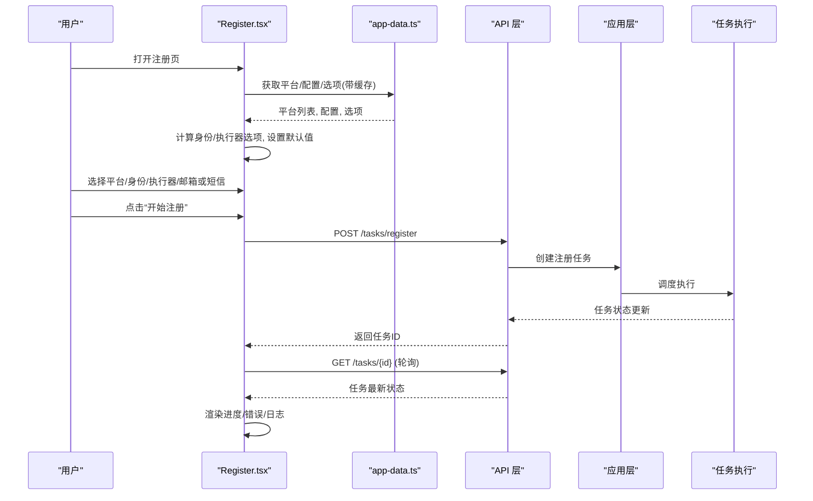
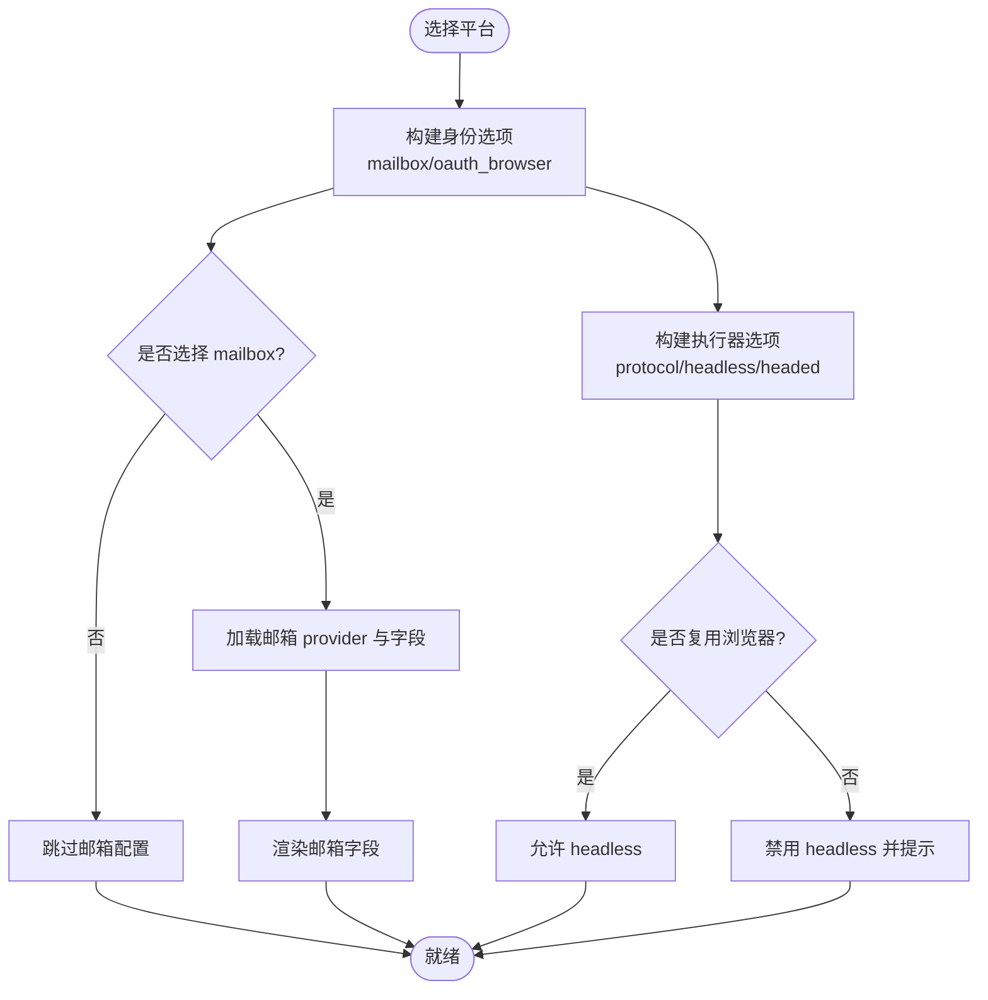
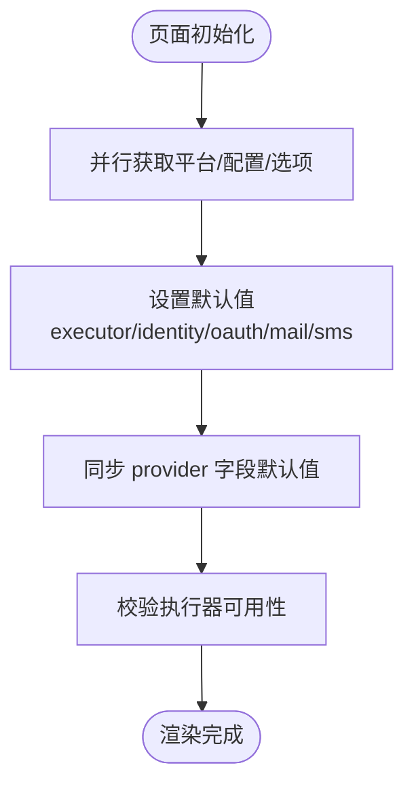
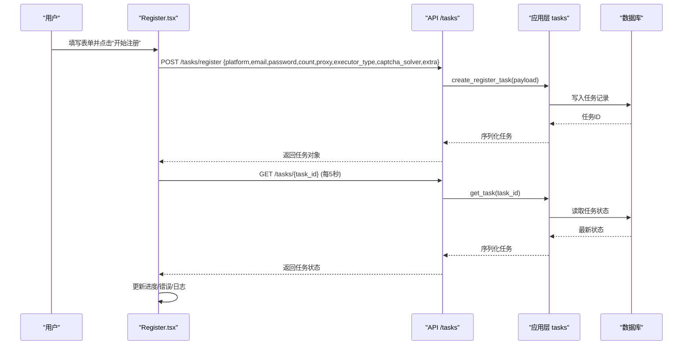
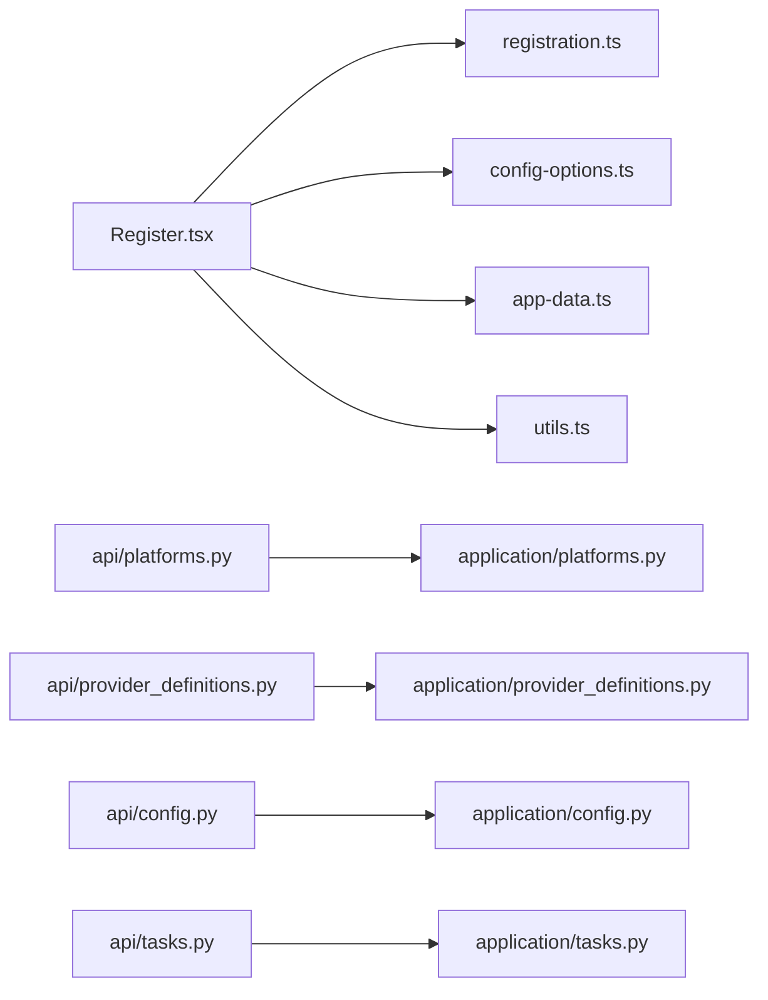

# 注册表单处理

<cite>
**本文引用的文件**
- [Register.tsx](file://frontend/src/pages/Register.tsx)
- [registration.ts](file://frontend/src/lib/registration.ts)
- [config-options.ts](file://frontend/src/lib/config-options.ts)
- [app-data.ts](file://frontend/src/lib/app-data.ts)
- [utils.ts](file://frontend/src/lib/utils.ts)
- [platforms.py](file://api/platforms.py)
- [provider_definitions.py](file://api/provider_definitions.py)
- [config.py](file://api/config.py)
- [platforms.py](file://application/platforms.py)
- [provider_definitions.py](file://application/provider_definitions.py)
- [config.py](file://application/config.py)
- [tasks.py](file://api/tasks.py)
- [tasks.py](file://application/tasks.py)
</cite>

## 目录
1. [简介](#简介)
2. [项目结构](#项目结构)
3. [核心组件](#核心组件)
4. [架构总览](#架构总览)
5. [详细组件分析](#详细组件分析)
6. [依赖关系分析](#依赖关系分析)
7. [性能考虑](#性能考虑)
8. [故障排查指南](#故障排查指南)
9. [结论](#结论)

## 简介
本文件聚焦“注册弹窗”的表单处理机制，围绕平台选择、身份提供商配置、动态选项加载、默认值设置、用户状态管理、表单验证与提交、错误提示与反馈等维度进行系统化说明。文档同时覆盖后端配置项的动态加载过程（邮箱提供商、验证码策略、执行器选项）以及前后端交互流程，帮助读者快速理解并扩展该功能。

## 项目结构
前端注册页面位于 pages 层，负责：
- 初始化并缓存平台列表、全局配置与可选项
- 渲染平台选择、身份提供商卡片、执行通道选择
- 根据当前身份提供商动态展示邮箱/短信 provider 及其字段
- 组装并提交注册任务，轮询任务状态并展示结果与日志

后端通过 API 暴露平台能力、配置选项与任务接口；应用层服务聚合平台能力、Provider 定义与设置，形成统一的配置元数据与运行时选项。

图表来源
- [Register.tsx:1-133](file://frontend/src/pages/Register.tsx#L1-L133)
- [platforms.py:11-13](file://api/platforms.py#L11-L13)
- [config.py:16-23](file://api/config.py#L16-L23)
- [tasks.py:11-29](file://api/tasks.py#L11-L29)
- [platforms.py:57-77](file://application/platforms.py#L57-L77)
- [config.py:23-37](file://application/config.py#L23-L37)

章节来源
- [Register.tsx:1-133](file://frontend/src/pages/Register.tsx#L1-L133)
- [platforms.py:11-13](file://api/platforms.py#L11-L13)
- [config.py:16-23](file://api/config.py#L16-L23)
- [tasks.py:11-29](file://api/tasks.py#L11-L29)
- [platforms.py:57-77](file://application/platforms.py#L57-L77)
- [config.py:23-37](file://application/config.py#L23-L37)

## 核心组件
- 注册页面组件：负责 UI 渲染、状态管理与用户交互，调用后端接口创建任务并轮询状态。
- 注册编排工具：根据平台能力与当前配置计算可用的身份模式、OAuth 提供商与执行器选项，并给出禁用原因。
- 配置选项类型与工具：定义 Provider 字段、设置、验证码策略等数据结构，提供下拉选项生成与策略标签解析。
- 数据获取与缓存：统一封装平台、配置与选项的获取，带 TTL 缓存与失效方法。
- 后端服务：聚合平台能力、Provider 定义与设置，输出前端所需的全部动态选项。

章节来源
- [Register.tsx:14-133](file://frontend/src/pages/Register.tsx#L14-L133)
- [registration.ts:34-111](file://frontend/src/lib/registration.ts#L34-L111)
- [config-options.ts:1-114](file://frontend/src/lib/config-options.ts#L1-L114)
- [app-data.ts:49-95](file://frontend/src/lib/app-data.ts#L49-L95)
- [config.py:23-37](file://application/config.py#L23-L37)

## 架构总览
注册弹窗的数据流与交互如下：
- 页面启动时并行拉取平台列表、全局配置与配置选项，填充默认值与可用选项。
- 用户选择平台后，根据平台能力构建身份提供商选项与执行通道选项。
- 若选择“系统邮箱”，则动态加载邮箱 provider 及其字段；若启用短信接码，则加载短信 provider 及字段。
- 点击“开始注册”时，将表单值与 extra 信息打包发送至后端任务接口，返回任务对象并开始轮询。
- 轮询期间展示进度、成功/失败计数、错误信息与实时日志；任务结束时自动打开支付链接（如有）。

图表来源
- [Register.tsx:86-133](file://frontend/src/pages/Register.tsx#L86-L133)
- [Register.tsx:244-316](file://frontend/src/pages/Register.tsx#L244-L316)
- [platforms.py:11-13](file://api/platforms.py#L11-L13)
- [config.py:16-23](file://api/config.py#L16-L23)
- [tasks.py:11-29](file://api/tasks.py#L11-L29)
- [application/tasks.py:174-208](file://application/tasks.py#L174-L208)

## 详细组件分析

### 平台选择与身份提供商配置的 UI 实现
- 平台选择：从后端平台列表渲染下拉框，并在平台变化时重新计算支持的执行器与身份模式。
- 身份提供商：根据平台能力构建“系统邮箱”和“第三方账号（OAuth）”两类入口，支持多 OAuth 提供商组合。
- 执行通道：根据身份提供商与浏览器复用情况，动态禁用不可用选项并显示原因。
- 邮箱/短信 provider：当选择“系统邮箱”或启用短信接码时，动态加载对应 provider 的下拉与字段，并合并已启用的默认配置。

图表来源
- [Register.tsx:135-242](file://frontend/src/pages/Register.tsx#L135-L242)
- [registration.ts:34-111](file://frontend/src/lib/registration.ts#L34-L111)
- [config-options.ts:85-114](file://frontend/src/lib/config-options.ts#L85-L114)

章节来源
- [Register.tsx:135-242](file://frontend/src/pages/Register.tsx#L135-L242)
- [registration.ts:34-111](file://frontend/src/lib/registration.ts#L34-L111)
- [config-options.ts:85-114](file://frontend/src/lib/config-options.ts#L85-L114)

### 动态加载可用选项与默认值设置
- 初始加载：页面挂载时并行获取平台列表、全局配置与配置选项，使用本地缓存减少重复请求。
- 默认值：
  - 执行器类型优先使用全局默认，否则回退到平台支持的首个执行器。
  - 身份提供商与 OAuth 提供商根据平台能力与当前选择自动修正。
  - 邮箱与短信 provider 默认选择标记为默认的 provider。
  - 所有 provider 字段键的值从全局配置中回填。
- 选项变更联动：当平台或身份提供商变化时，自动调整执行器选项与默认值，确保始终处于有效状态。

图表来源
- [Register.tsx:86-133](file://frontend/src/pages/Register.tsx#L86-L133)
- [Register.tsx:157-242](file://frontend/src/pages/Register.tsx#L157-L242)
- [app-data.ts:77-95](file://frontend/src/lib/app-data.ts#L77-L95)

章节来源
- [Register.tsx:86-133](file://frontend/src/pages/Register.tsx#L86-L133)
- [Register.tsx:157-242](file://frontend/src/pages/Register.tsx#L157-L242)
- [app-data.ts:77-95](file://frontend/src/lib/app-data.ts#L77-L95)

### 表单验证逻辑与完整性保障
- 前端侧：
  - 输入控件对数字型字段进行数值转换，避免字符串误传。
  - 提交前将 extra 中的 identity_provider、oauth_provider、oauth_email_hint、chrome_user_data_dir、chrome_cdp_url 等关键参数一并发送。
  - 仅包含非空且必要的字段，减少冗余。
- 后端侧：
  - 任务创建时对 count 做最小值约束，保证至少执行一次。
  - 邮箱 provider 未显式指定时，自动回退到默认 provider。
  - 执行器类型与验证码策略在任务执行阶段按策略解析，确保流程一致性。

章节来源
- [Register.tsx:244-278](file://frontend/src/pages/Register.tsx#L244-L278)
- [application/tasks.py:201-208](file://application/tasks.py#L201-L208)
- [application/tasks.py:500-532](file://application/tasks.py#L500-L532)

### 配置项的动态加载过程（邮箱提供商、验证码策略、执行器选项）
- 邮箱提供商：
  - 通过配置选项接口返回已启用的邮箱 provider 列表与设置，前端据此渲染下拉与字段。
  - 若未启用任何邮箱 provider，页面给出提示引导至设置页配置。
- 验证码策略：
  - 后端聚合 provider_settings 中的浏览器默认与协议顺序，前端据此显示策略摘要。
- 执行器选项：
  - 后端基于平台能力收集 executor、identity_mode、oauth_provider 的可选项，前端用于构建选择器与禁用提示。

章节来源
- [Register.tsx:145-207](file://frontend/src/pages/Register.tsx#L145-L207)
- [config-options.ts:101-114](file://frontend/src/lib/config-options.ts#L101-L114)
- [application/platforms.py:36-54](file://application/platforms.py#L36-L54)
- [application/config.py:23-37](file://application/config.py#L23-L37)

### 表单状态管理机制（用户交互与数据绑定）
- 状态集中：表单状态以单一对象维护，通过 set(k, v) 函数增量更新，避免多次 setState 导致的竞态。
- 副作用联动：
  - 当身份提供商切换为“系统邮箱”时，自动选择默认邮箱 provider。
  - 当邮箱/短信 provider 切换时，合并其 fields 与 settings 的默认值到表单。
  - 当平台或身份提供商变化时，自动修正执行器类型为可用值。
- 只读摘要：右侧面板实时展示当前平台、身份、执行器与验证码策略摘要，帮助用户确认配置。

章节来源
- [Register.tsx:47-67](file://frontend/src/pages/Register.tsx#L47-L67)
- [Register.tsx:157-242](file://frontend/src/pages/Register.tsx#L157-L242)
- [Register.tsx:354-362](file://frontend/src/pages/Register.tsx#L354-L362)

### 错误处理与用户反馈机制
- 选项加载失败：若无法加载 provider 元数据，显示明确提示并要求重启后端或刷新页面。
- 任务执行错误：
  - 任务状态中包含 errors 数组与 error 字段，前端逐项展示。
  - 任务被中断或取消时，给出友好提示。
- 网络与鉴权：
  - 通用 fetch 封装在 401 时清除 token 并刷新页面，避免后续请求继续失败。
  - 非 2xx 响应抛出错误，便于上层捕获与提示。

章节来源
- [Register.tsx:97-108](file://frontend/src/pages/Register.tsx#L97-L108)
- [Register.tsx:553-580](file://frontend/src/pages/Register.tsx#L553-L580)
- [utils.ts:24-36](file://frontend/src/lib/utils.ts#L24-L36)
- [application/tasks.py:296-316](file://application/tasks.py#L296-L316)

### 提交与轮询流程（序列图）

图表来源
- [Register.tsx:244-316](file://frontend/src/pages/Register.tsx#L244-L316)
- [tasks.py:11-29](file://api/tasks.py#L11-L29)
- [application/tasks.py:174-208](file://application/tasks.py#L174-L208)

## 依赖关系分析
- 前端依赖：
  - Register.tsx 依赖 registration.ts 构建身份与执行器选项，依赖 config-options.ts 解析 provider 字段与验证码策略，依赖 app-data.ts 获取平台与配置，依赖 utils.ts 发起网络请求。
- 后端依赖：
  - API 层路由映射到应用层服务，聚合平台能力、Provider 定义与设置，输出统一的结构化选项。
  - 任务执行依赖 application/tasks.py 的任务编排与持久化。

图表来源
- [Register.tsx:1-133](file://frontend/src/pages/Register.tsx#L1-L133)
- [platforms.py:11-13](file://api/platforms.py#L11-L13)
- [provider_definitions.py:24-31](file://api/provider_definitions.py#L24-L31)
- [config.py:16-23](file://api/config.py#L16-L23)
- [tasks.py:11-29](file://api/tasks.py#L11-L29)

章节来源
- [Register.tsx:1-133](file://frontend/src/pages/Register.tsx#L1-L133)
- [platforms.py:11-13](file://api/platforms.py#L11-L13)
- [provider_definitions.py:24-31](file://api/provider_definitions.py#L24-L31)
- [config.py:16-23](file://api/config.py#L16-L23)
- [tasks.py:11-29](file://api/tasks.py#L11-L29)

## 性能考虑
- 缓存优化：平台、配置与选项采用 TTL 缓存，避免频繁请求；提供失效方法以便在设置变更后刷新。
- 并发控制：注册任务支持批量数量与并发度限制，防止资源争用。
- 轮询节流：任务轮询间隔固定，且在页面不可见时暂停，降低无效请求。
- 条件渲染：仅在需要时加载邮箱/短信 provider 与字段，减少不必要的 DOM 更新。

[本节为通用指导，不直接分析具体文件]

## 故障排查指南
- 无法加载 provider 元数据：
  - 现象：页面提示未加载到 provider 元数据。
  - 建议：检查后端是否正常运行，必要时重启后端并刷新页面。
- 无可用邮箱 provider：
  - 现象：邮箱配置区域提示没有已启用的邮箱 provider。
  - 建议：前往设置页新增并启用一个默认邮箱 provider。
- 任务被中断或取消：
  - 现象：任务状态显示“中断”或“已取消”。
  - 建议：检查服务是否重启或被手动取消，必要时重新提交任务。
- 网络鉴权失败：
  - 现象：401 错误导致页面刷新。
  - 建议：确认登录状态与 token 有效性，重新登录后重试。

章节来源
- [Register.tsx:97-108](file://frontend/src/pages/Register.tsx#L97-L108)
- [Register.tsx:462-468](file://frontend/src/pages/Register.tsx#L462-L468)
- [Register.tsx:569-580](file://frontend/src/pages/Register.tsx#L569-L580)
- [utils.ts:24-36](file://frontend/src/lib/utils.ts#L24-L36)
- [application/tasks.py:296-316](file://application/tasks.py#L296-L316)

## 结论
注册弹窗通过清晰的前后端协作实现了平台选择、身份提供商配置与执行通道的动态编排。前端以集中状态管理用户交互，结合后端提供的平台能力与 Provider 元数据，确保选项与默认值的准确性与一致性。任务提交与轮询机制提供了良好的用户体验与可观测性。整体设计具备良好的可扩展性与容错能力，适合在不同平台与 Provider 组合下稳定运行。