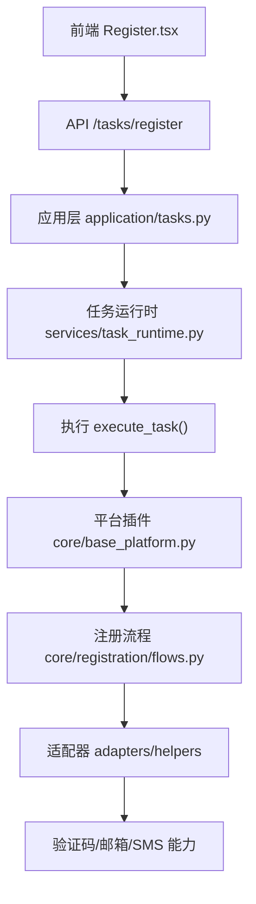
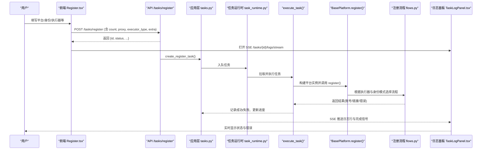
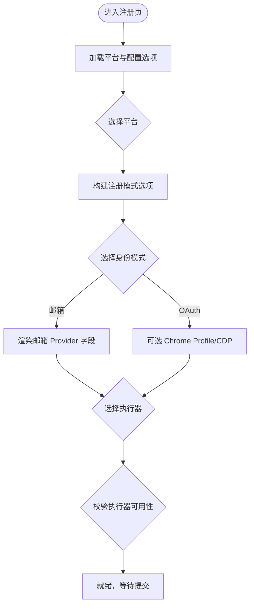
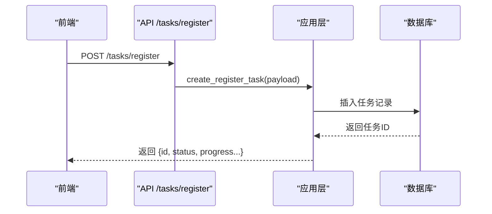
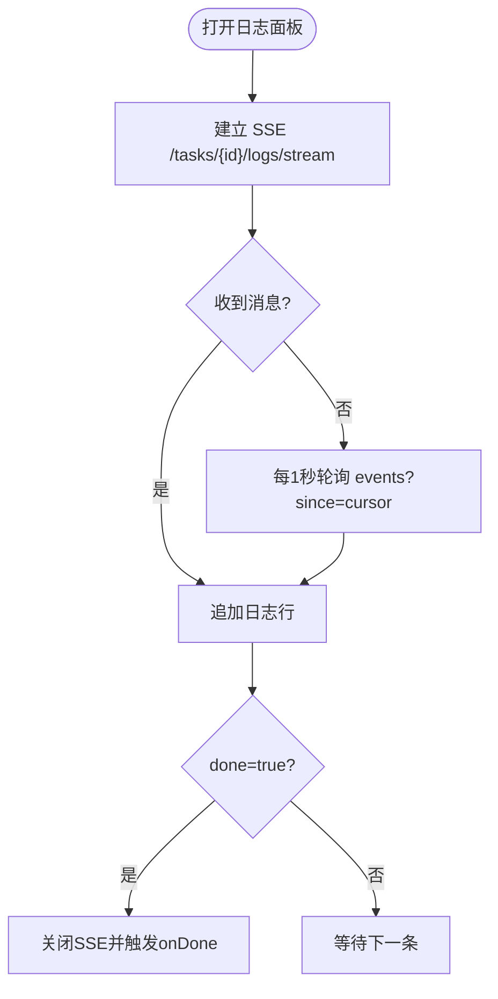
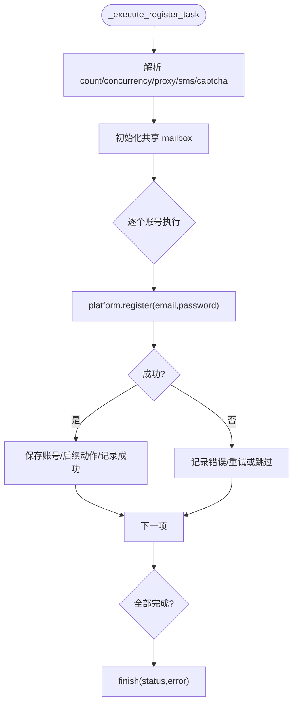
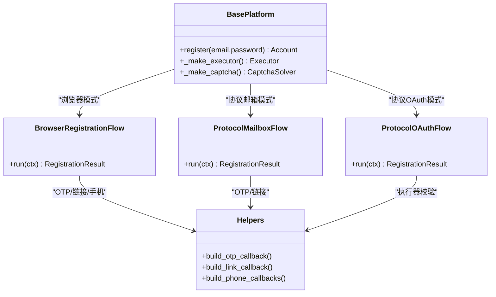
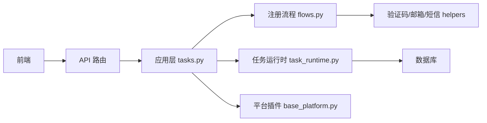

# 账户创建流程

<cite>
**本文引用的文件**
- [Register.tsx](file://frontend/src/pages/Register.tsx)
- [registration.ts](file://frontend/src/lib/registration.ts)
- [config-options.ts](file://frontend/src/lib/config-options.ts)
- [task_commands.py](file://api/task_commands.py)
- [tasks.py](file://application/tasks.py)
- [task_runtime.py](file://services/task_runtime.py)
- [flows.py](file://core/registration/flows.py)
- [helpers.py](file://core/registration/helpers.py)
- [models.py](file://core/registration/models.py)
- [base_platform.py](file://core/base_platform.py)
- [TaskLogPanel.tsx](file://frontend/src/components/tasks/TaskLogPanel.tsx)
- [platforms.py](file://api/platforms.py)
</cite>

## 目录
1. [简介](#简介)
2. [项目结构](#项目结构)
3. [核心组件](#核心组件)
4. [架构总览](#架构总览)
5. [详细组件分析](#详细组件分析)
6. [依赖关系分析](#依赖关系分析)
7. [性能考量](#性能考量)
8. [故障排查指南](#故障排查指南)
9. [结论](#结论)

## 简介
本文面向“账户创建”这一核心场景，系统性解析从前端注册弹窗到后端任务执行、进度跟踪与错误反馈的完整链路。重点覆盖：
- 注册弹窗实现：平台选择、身份提供商配置、执行方式选择等步骤
- 表单验证机制：确保用户输入数据的正确性与完整性
- 注册参数构建：并发数、验证码策略、代理设置等高级选项
- 任务提交机制：如何提交注册请求并获取任务ID
- 注册进度跟踪：通过日志面板实时显示状态与错误信息
- 错误处理与用户反馈：友好的提示与解决建议

## 项目结构
本仓库采用前后端分离架构：
- 前端（React + TypeScript）：提供注册页面、动态表单、任务状态与日志展示
- 后端（FastAPI + Python）：提供任务创建、查询、事件流接口；任务调度与执行引擎
- 平台插件体系：各平台以插件形式接入，统一通过基类与注册流程编排

图表来源
- [Register.tsx:244-278](file://frontend/src/pages/Register.tsx#L244-L278)
- [task_commands.py:17-31](file://api/task_commands.py#L17-L31)
- [tasks.py:174-208](file://application/tasks.py#L174-L208)
- [task_runtime.py:18-85](file://services/task_runtime.py#L18-L85)
- [base_platform.py:124-160](file://core/base_platform.py#L124-L160)
- [flows.py:18-142](file://core/registration/flows.py#L18-L142)

章节来源
- [Register.tsx:1-601](file://frontend/src/pages/Register.tsx#L1-L601)
- [task_commands.py:1-50](file://api/task_commands.py#L1-L50)
- [tasks.py:1-800](file://application/tasks.py#L1-L800)
- [task_runtime.py:1-102](file://services/task_runtime.py#L1-L102)
- [base_platform.py:1-505](file://core/base_platform.py#L1-L505)
- [flows.py:1-142](file://core/registration/flows.py#L1-L142)

## 核心组件
- 前端注册页：负责平台选择、身份模式与执行器选择、Provider 动态字段渲染、提交注册任务、轮询任务状态与 SSE 日志
- 任务命令接口：接收注册请求，构造任务并返回任务ID
- 任务运行器：后台线程池拉取可执行任务，限制并发与平台并行度
- 平台基类与注册流程：根据执行器类型与身份模式路由到浏览器或协议注册流程，组装验证码、邮箱、短信回调
- 日志面板：SSE 实时推送任务日志，支持回退轮询与完成回调

章节来源
- [Register.tsx:46-316](file://frontend/src/pages/Register.tsx#L46-L316)
- [task_commands.py:17-31](file://api/task_commands.py#L17-L31)
- [task_runtime.py:18-85](file://services/task_runtime.py#L18-L85)
- [base_platform.py:124-160](file://core/base_platform.py#L124-L160)
- [flows.py:18-142](file://core/registration/flows.py#L18-L142)
- [TaskLogPanel.tsx:1-204](file://frontend/src/components/tasks/TaskLogPanel.tsx#L1-L204)

## 架构总览
下图展示了从前端触发到后端执行、再到日志回传的端到端流程。

图表来源
- [Register.tsx:244-316](file://frontend/src/pages/Register.tsx#L244-L316)
- [task_commands.py:17-31](file://api/task_commands.py#L17-L31)
- [tasks.py:174-208](file://application/tasks.py#L174-L208)
- [task_runtime.py:47-85](file://services/task_runtime.py#L47-L85)
- [base_platform.py:124-160](file://core/base_platform.py#L124-L160)
- [flows.py:18-142](file://core/registration/flows.py#L18-L142)
- [TaskLogPanel.tsx:24-108](file://frontend/src/components/tasks/TaskLogPanel.tsx#L24-L108)

## 详细组件分析

### 注册弹窗实现（平台选择、身份提供商、执行方式）
- 平台选择：从后端加载平台列表，渲染下拉框；当当前平台变化时，计算支持的执行器与注册选项
- 身份提供商配置：根据平台元数据生成“邮箱自动收码”或“OAuth 浏览器”等注册模式；若选择邮箱模式，动态加载邮箱 Provider 及其字段；若启用短信接码，则加载短信 Provider 及字段
- 执行方式选择：根据平台支持与是否复用本机浏览器会话，动态禁用不可用项并给出原因说明；默认智能选择 headless/headed/protocol
- 动态字段渲染：基于 Provider 定义（fields）渲染输入框，支持密码、文本、选择等类型；合并全局配置与认证字段

图表来源
- [Register.tsx:86-242](file://frontend/src/pages/Register.tsx#L86-L242)
- [registration.ts:34-111](file://frontend/src/lib/registration.ts#L34-L111)
- [config-options.ts:85-113](file://frontend/src/lib/config-options.ts#L85-L113)

章节来源
- [Register.tsx:86-242](file://frontend/src/pages/Register.tsx#L86-L242)
- [registration.ts:34-111](file://frontend/src/lib/registration.ts#L34-L111)
- [config-options.ts:85-113](file://frontend/src/lib/config-options.ts#L85-L113)

### 表单验证机制
- 基础字段：平台必填；批量数量至少为1；代理可选
- 身份模式联动：当选择邮箱模式且未配置邮箱 Provider 时，自动尝试使用默认 Provider；若仍为空，界面提示需先启用默认邮箱 Provider
- 执行器可用性：当选择 OAuth 浏览器模式但未配置 Chrome Profile 或 CDP 地址时，headless 执行器将被禁用并提示原因
- Provider 字段校验：由后端在注册执行阶段进行必要校验（如邮箱存在性、验证码 provider 可用性等），前端仅做基本引导与提示

章节来源
- [Register.tsx:157-242](file://frontend/src/pages/Register.tsx#L157-L242)
- [registration.ts:14-32](file://frontend/src/lib/registration.ts#L14-L32)
- [config-options.ts:101-113](file://frontend/src/lib/config-options.ts#L101-L113)

### 注册参数构建过程
- 基本参数：platform、email、password、count、proxy、executor_type、captcha_solver
- 扩展参数（extra）：identity_provider、oauth_provider、oauth_email_hint、chrome_user_data_dir、chrome_cdp_url、mail_provider、sms_provider 以及所有 Provider 动态字段键值
- 并发与验证码策略：
  - 并发数：前端传入 count；后端在执行时根据 count 与短信能力决定实际目标与最大尝试次数
  - 验证码策略：captcha_solver 默认为 auto；后端根据执行器类型与已启用的 provider 顺序自动选择
- 代理设置：支持直接传入 proxy；若未传，执行阶段可从代理池获取下一个代理

章节来源
- [Register.tsx:244-278](file://frontend/src/pages/Register.tsx#L244-L278)
- [task_commands.py:17-31](file://api/task_commands.py#L17-L31)
- [tasks.py:692-710](file://application/tasks.py#L692-L710)
- [base_platform.py:316-394](file://core/base_platform.py#L316-L394)

### 任务提交机制与任务ID获取
- 前端调用 POST /tasks/register，提交包含平台、账号、执行器、验证码策略、代理与扩展参数的 JSON
- 后端创建任务并立即返回任务对象（包含 id、status、progress 等），前端据此开始轮询与日志订阅
- 任务被放入队列后，由任务运行时异步执行

图表来源
- [Register.tsx:244-278](file://frontend/src/pages/Register.tsx#L244-L278)
- [task_commands.py:17-31](file://api/task_commands.py#L17-L31)
- [tasks.py:174-208](file://application/tasks.py#L174-L208)

章节来源
- [Register.tsx:244-278](file://frontend/src/pages/Register.tsx#L244-L278)
- [task_commands.py:17-31](file://api/task_commands.py#L17-L31)
- [tasks.py:174-208](file://application/tasks.py#L174-L208)

### 注册进度跟踪与日志面板
- 前端在提交后立即开启 SSE 连接 /tasks/{id}/logs/stream，接收实时日志行与完成信号
- 若 SSE 不可用，自动回退为每1秒轮询 /tasks/{id}/events?since=cursor，增量获取新事件
- 日志面板显示：状态、进度条、事件计数、错误摘要、复制日志按钮；完成后触发 onDone 回调，关闭 SSE 并停止轮询

图表来源
- [TaskLogPanel.tsx:24-108](file://frontend/src/components/tasks/TaskLogPanel.tsx#L24-L108)
- [TaskLogPanel.tsx:114-204](file://frontend/src/components/tasks/TaskLogPanel.tsx#L114-L204)

章节来源
- [TaskLogPanel.tsx:24-108](file://frontend/src/components/tasks/TaskLogPanel.tsx#L24-L108)
- [TaskLogPanel.tsx:114-204](file://frontend/src/components/tasks/TaskLogPanel.tsx#L114-L204)

### 后端执行与错误处理
- 任务创建：create_register_task 将 count 作为进度总量，持久化任务并写入初始事件
- 任务调度：TaskRuntime 维护线程池，按最大并发与平台并行度拉取任务执行
- 单任务执行：execute_task -> _execute_register_task
  - 解析并发、代理、短信 provider、验证码策略
  - 预创建共享 mailbox 避免并发初始化问题
  - 循环执行每个账号注册，记录成功/失败、进度、错误列表、支付链接等
  - 异常捕获并记录错误，必要时标记任务失败或中断
- 错误分类：网络/验证码/邮箱/短信/平台逻辑错误均会被记录到任务 result.errors 与事件日志中

图表来源
- [tasks.py:692-790](file://application/tasks.py#L692-L790)
- [task_runtime.py:47-85](file://services/task_runtime.py#L47-L85)

章节来源
- [tasks.py:692-790](file://application/tasks.py#L692-L790)
- [task_runtime.py:47-85](file://services/task_runtime.py#L47-L85)

### 注册流程编排（浏览器/协议/验证码/邮箱/短信）
- BasePlatform.register 根据 executor_type 与 identity_provider 选择流程：
  - 浏览器模式：BrowserRegistrationFlow，支持 OTP、验证链接、手机号回调、验证码
  - 协议邮箱模式：ProtocolMailboxFlow，适合无浏览器场景
  - 协议 OAuth 模式：ProtocolOAuthFlow，用于特定平台的 OAuth 注册
- helpers 提供：
  - OTP/链接/手机号回调构建
  - 邮箱与短信 provider 的动态选择与参数合并
  - 浏览器复用校验与执行器合法性校验

图表来源
- [base_platform.py:124-160](file://core/base_platform.py#L124-L160)
- [flows.py:18-142](file://core/registration/flows.py#L18-L142)
- [helpers.py:23-177](file://core/registration/helpers.py#L23-L177)

章节来源
- [base_platform.py:124-160](file://core/base_platform.py#L124-L160)
- [flows.py:18-142](file://core/registration/flows.py#L18-L142)
- [helpers.py:23-177](file://core/registration/helpers.py#L23-L177)

## 依赖关系分析
- 前端依赖：
  - 平台与配置选项：/platforms、/config/options（通过 app-data 模块封装）
  - 任务命令与查询：/tasks/register、/tasks/{id}、/tasks/{id}/events、/tasks/{id}/logs/stream
- 后端依赖：
  - 平台插件注册表：通过 registry.get(platform_name) 获取具体平台实现
  - Provider 定义与设置：邮箱、验证码、短信 provider 的定义与运行时设置
  - 数据库：任务、事件、账号等持久化
- 运行时依赖：
  - 线程池与并发控制：TaskRuntime 管理 worker 生命周期与资源占用
  - 外部服务：邮箱、短信、验证码、代理池、Chrome CDP/Profile

图表来源
- [platforms.py:1-19](file://api/platforms.py#L1-L19)
- [task_commands.py:1-50](file://api/task_commands.py#L1-L50)
- [tasks.py:1-800](file://application/tasks.py#L1-L800)
- [task_runtime.py:1-102](file://services/task_runtime.py#L1-L102)
- [base_platform.py:1-505](file://core/base_platform.py#L1-L505)
- [flows.py:1-142](file://core/registration/flows.py#L1-L142)
- [helpers.py:1-177](file://core/registration/helpers.py#L1-L177)

章节来源
- [platforms.py:1-19](file://api/platforms.py#L1-L19)
- [task_commands.py:1-50](file://api/task_commands.py#L1-L50)
- [tasks.py:1-800](file://application/tasks.py#L1-L800)
- [task_runtime.py:1-102](file://services/task_runtime.py#L1-L102)
- [base_platform.py:1-505](file://core/base_platform.py#L1-L505)
- [flows.py:1-142](file://core/registration/flows.py#L1-L142)
- [helpers.py:1-177](file://core/registration/helpers.py#L1-L177)

## 性能考量
- 并发控制：
  - 前端 count 控制注册总数；后端根据 count 与短信能力调整目标与最大尝试次数
  - TaskRuntime 限制全局最大并发与每平台最大并行，避免资源争用
- 代理与验证码：
  - 代理池自动轮换，失败时报告并重试；成功时提升权重
  - 验证码 provider 按策略顺序尝试，支持多 provider 回退
- 日志与UI：
  - SSE 优先，断线自动回退轮询，减少 UI 卡顿
  - 增量事件拉取（since=cursor）降低带宽与数据库压力

[本节为通用指导，不直接分析具体文件]

## 故障排查指南
- 无法加载 Provider 元数据：
  - 现象：注册页提示“未加载到 provider 元数据”，请重启后端并刷新页面
  - 可能原因：后端未启动或未正确暴露配置接口
- 邮箱模式无可用邮箱 Provider：
  - 现象：界面提示需先到设置页新增并启用默认邮箱 Provider
  - 处理：在设置页添加并启用一个邮箱 Provider，再重试
- OAuth 浏览器模式执行器不可用：
  - 现象：headless 被禁用并提示需要 Chrome Profile 路径或 CDP 地址
  - 处理：在全局配置中填写 chrome_user_data_dir 或 chrome_cdp_url
- 验证码未配置：
  - 现象：浏览器模式未配置默认验证码 provider；协议模式未配置可用的远程验证码 provider
  - 处理：在设置页启用并配置默认验证码 provider
- 任务中断或取消：
  - 现象：任务状态为 interrupted 或 cancelled，日志面板显示相应提示
  - 处理：检查服务是否重启、是否主动取消；必要时重新提交任务

章节来源
- [Register.tsx:93-108](file://frontend/src/pages/Register.tsx#L93-L108)
- [Register.tsx:453-473](file://frontend/src/pages/Register.tsx#L453-L473)
- [registration.ts:97-105](file://frontend/src/lib/registration.ts#L97-L105)
- [config-options.ts:101-113](file://frontend/src/lib/config-options.ts#L101-L113)
- [TaskLogPanel.tsx:158-163](file://frontend/src/components/tasks/TaskLogPanel.tsx#L158-L163)

## 结论
账户创建流程通过“前端动态表单 + 后端任务编排 + 平台插件化”的方式实现了高可扩展的自动化注册能力。前端聚焦于用户体验与可视化反馈，后端负责任务调度、执行与持久化，平台插件统一抽象注册流程，使不同平台可以以最小成本接入。通过并发控制、代理与验证码策略、SSE 日志与错误提示，整体流程具备良好稳定性与可观测性。

[本节为总结性内容，不直接分析具体文件]