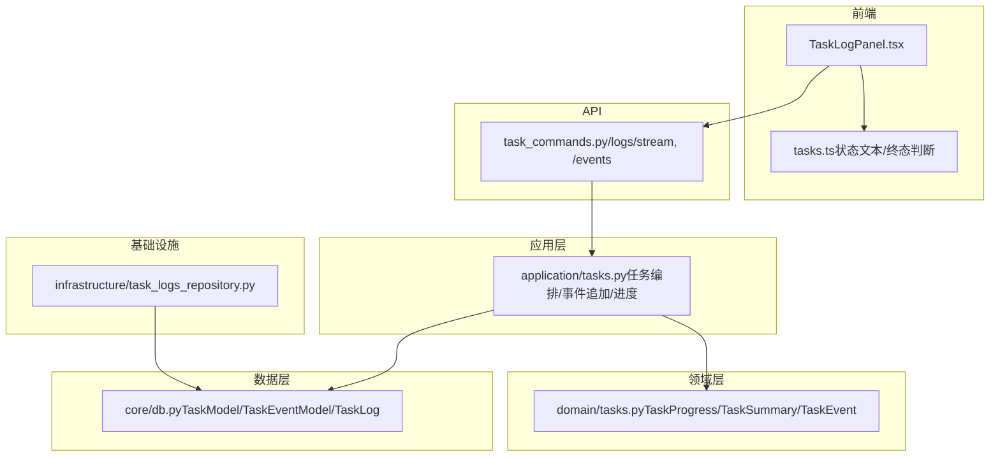
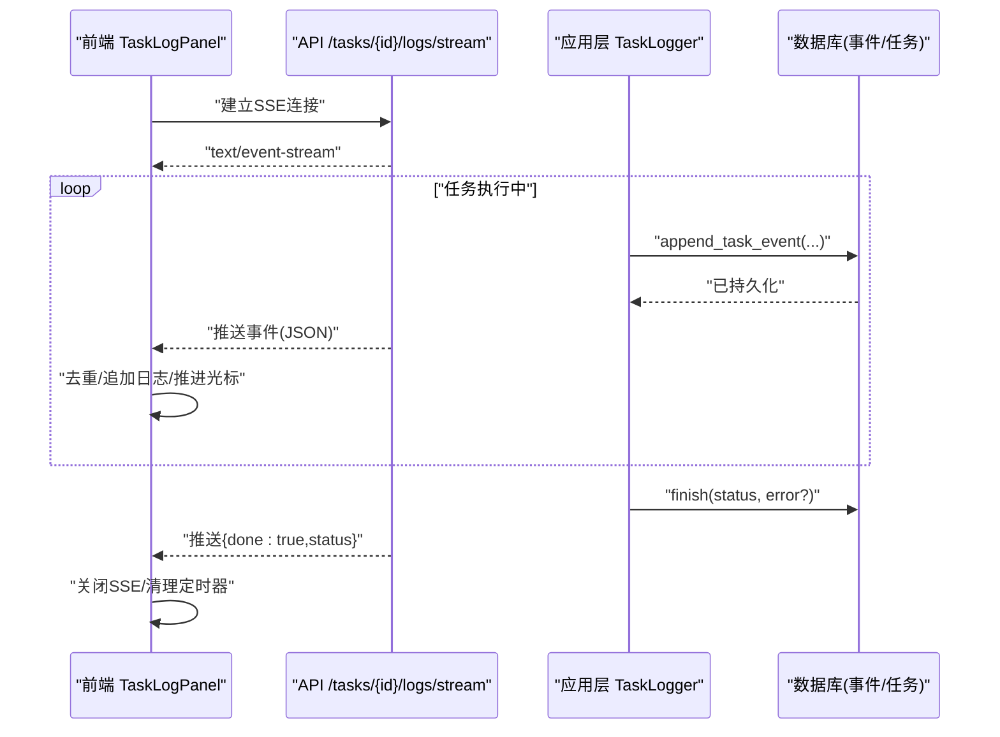
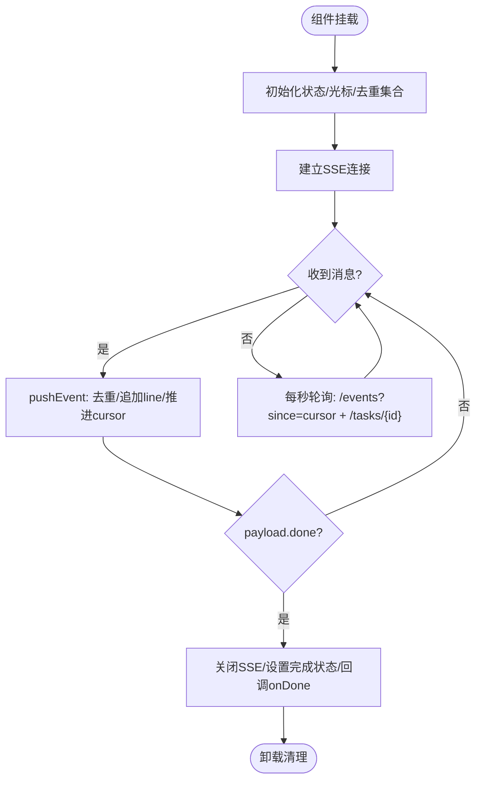
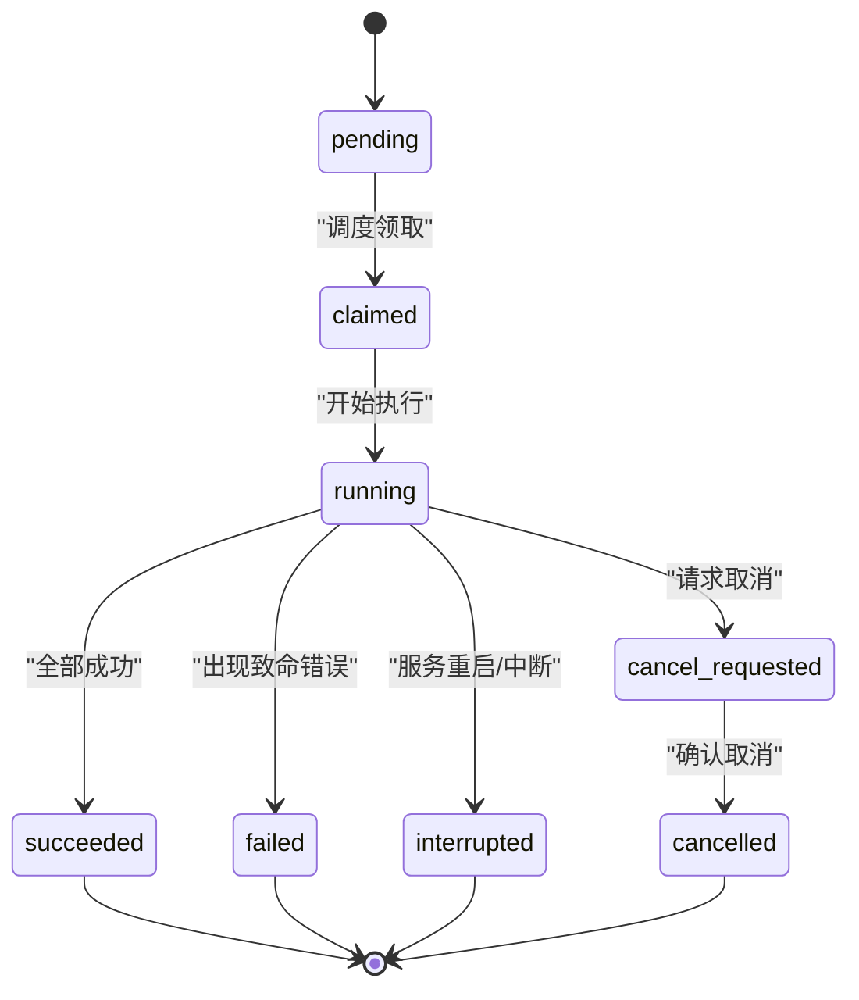
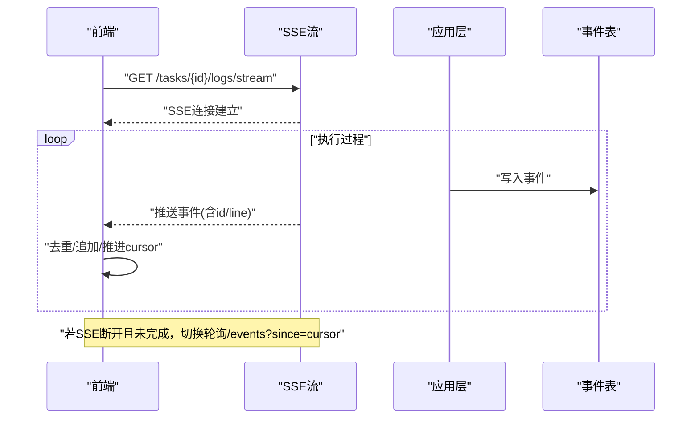
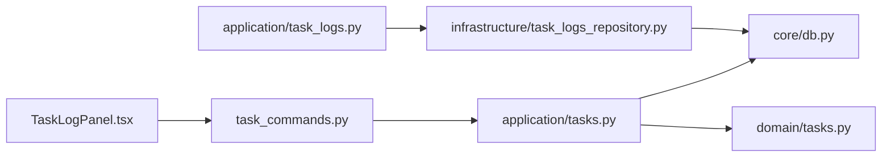

# 进度跟踪监控

<cite>
**本文引用的文件**
- [TaskLogPanel.tsx](file://frontend/src/components/tasks/TaskLogPanel.tsx)
- [tasks.ts（前端工具）](file://frontend/src/lib/tasks.ts)
- [task_commands.py（API路由）](file://api/task_commands.py)
- [tasks.py（应用层任务编排）](file://application/tasks.py)
- [tasks.py（领域模型）](file://domain/tasks.py)
- [task_logs.py（日志服务）](file://application/task_logs.py)
- [task_logs.py（领域模型）](file://domain/task_logs.py)
- [task_logs_repository.py（日志仓储）](file://infrastructure/task_logs_repository.py)
- [db.py（数据库模型）](file://core/db.py)
</cite>

## 目录
1. [简介](#简介)
2. [项目结构](#项目结构)
3. [核心组件](#核心组件)
4. [架构总览](#架构总览)
5. [详细组件分析](#详细组件分析)
6. [依赖关系分析](#依赖关系分析)
7. [性能考量](#性能考量)
8. [故障排查指南](#故障排查指南)
9. [结论](#结论)

## 简介
本文件聚焦注册任务的进度跟踪与监控机制，围绕 TaskLogPanel 组件的实时日志显示、状态更新、错误展示，以及后端事件流式传输、任务状态生命周期管理、进度指示器计算和多任务并行监控等关键主题进行系统化说明。目标是帮助读者理解从前端到后端的完整链路，并掌握在异常场景下的定位与优化方法。

## 项目结构
与进度跟踪和监控相关的代码分布在以下层次：
- 前端 UI：TaskLogPanel 负责渲染任务状态、进度条、错误信息和实时日志；使用 SSE 与轮询双通道获取事件与任务详情。
- API 层：提供任务查询、事件拉取、SSE 流式日志接口。
- 应用层：任务创建、执行、状态变更、事件追加、进度更新、结果聚合。
- 领域层：任务与事件的领域模型定义。
- 基础设施层：日志持久化与分页查询。
- 数据层：任务、事件、日志等数据库模型。

图表来源
- [TaskLogPanel.tsx:1-108](file://frontend/src/components/tasks/TaskLogPanel.tsx#L1-L108)
- [task_commands.py:42-50](file://api/task_commands.py#L42-L50)
- [application/tasks.py:161-171](file://application/tasks.py#L161-L171)
- [domain/tasks.py:8-44](file://domain/tasks.py#L8-L44)
- [infrastructure/task_logs_repository.py:27-41](file://infrastructure/task_logs_repository.py#L27-L41)
- [core/db.py:241-288](file://core/db.py#L241-L288)

章节来源
- [TaskLogPanel.tsx:1-108](file://frontend/src/components/tasks/TaskLogPanel.tsx#L1-L108)
- [task_commands.py:42-50](file://api/task_commands.py#L42-L50)
- [application/tasks.py:161-171](file://application/tasks.py#L161-L171)
- [domain/tasks.py:8-44](file://domain/tasks.py#L8-L44)
- [infrastructure/task_logs_repository.py:27-41](file://infrastructure/task_logs_repository.py#L27-L41)
- [core/db.py:241-288](file://core/db.py#L241-L288)

## 核心组件
- TaskLogPanel 组件：维护事件去重、光标推进、SSE 健康检测、轮询降级、自动滚动、进度百分比计算、错误信息提取与展示。
- 任务状态与事件序列化：将任务与事件序列化为统一格式，供前端消费。
- 任务命令与流式日志：通过 FastAPI 的 StreamingResponse 推送事件流，并在连接异常时回退到轮询。
- 任务生命周期：从 pending → claimed → running → succeeded/failed/interrupted/cancelled 的状态流转。
- 日志记录与持久化：通过 TaskLogger 写入事件，支持进度、成功/失败计数、错误列表、支付链接等扩展字段。

章节来源
- [TaskLogPanel.tsx:1-204](file://frontend/src/components/tasks/TaskLogPanel.tsx#L1-L204)
- [application/tasks.py:129-171](file://application/tasks.py#L129-L171)
- [application/tasks.py:371-457](file://application/tasks.py#L371-L457)
- [application/tasks.py:570-595](file://application/tasks.py#L570-L595)
- [core/db.py:241-288](file://core/db.py#L241-L288)

## 架构总览
下图展示了从前端到后端的端到端流程：前端通过 SSE 订阅任务日志流，若连接不稳定则回退到轮询；后端在执行过程中持续追加事件，并通过流式响应推送给前端；任务完成后，前端收到完成信号并停止订阅。

图表来源
- [TaskLogPanel.tsx:67-108](file://frontend/src/components/tasks/TaskLogPanel.tsx#L67-L108)
- [task_commands.py:42-50](file://api/task_commands.py#L42-L50)
- [application/tasks.py:281-293](file://application/tasks.py#L281-L293)
- [application/tasks.py:443-457](file://application/tasks.py#L443-L457)

## 详细组件分析

### TaskLogPanel 组件实现
- 实时日志显示：通过 EventSource 接收服务器推送的事件，解析出 line 字段并追加到日志列表；同时维护底部滚动引用，确保新日志可见。
- 状态更新：定时同步任务详情以获取最新 status 与 progress_detail；当检测到终态时，触发完成回调并关闭 SSE。
- 错误信息展示：优先使用 task.error，其次取 errors 数组首项；根据状态动态设置样式。
- 进度指示器：基于 progress_detail.current/total 计算百分比，限制在 0-100；当无总量时按终态或运行中显示不同宽度。
- 多任务并行监控：每个任务独立实例化面板，互不干扰；通过 taskId 隔离事件与任务数据。

图表来源
- [TaskLogPanel.tsx:28-108](file://frontend/src/components/tasks/TaskLogPanel.tsx#L28-L108)
- [TaskLogPanel.tsx:114-155](file://frontend/src/components/tasks/TaskLogPanel.tsx#L114-L155)

章节来源
- [TaskLogPanel.tsx:1-204](file://frontend/src/components/tasks/TaskLogPanel.tsx#L1-L204)
- [tasks.ts（前端工具）:1-45](file://frontend/src/lib/tasks.ts#L1-L45)

### 任务状态生命周期管理
- 状态常量：pending、claimed、running、succeeded、failed、interrupted、cancel_requested、cancelled。
- 终态集合：succeeded、failed、interrupted、cancelled。
- 生命周期要点：
  - 创建任务：初始为 pending，并追加“任务已创建”事件。
  - 领取任务：由调度器挑选可运行任务，置为 claimed，记录 started_at。
  - 开始执行：标记为 running，追加“任务已开始执行”。
  - 结束：根据结果标记为 succeeded/failed/interrupted/cancelled，记录 finished_at 与错误信息。
  - 取消：先置 cancel_requested，再在合适时机转为 cancelled。

图表来源
- [application/tasks.py:31-45](file://application/tasks.py#L31-L45)
- [application/tasks.py:174-198](file://application/tasks.py#L174-L198)
- [application/tasks.py:318-338](file://application/tasks.py#L318-L338)
- [application/tasks.py:385-391](file://application/tasks.py#L385-L391)
- [application/tasks.py:443-457](file://application/tasks.py#L443-L457)

章节来源
- [application/tasks.py:31-45](file://application/tasks.py#L31-L45)
- [application/tasks.py:174-198](file://application/tasks.py#L174-L198)
- [application/tasks.py:318-338](file://application/tasks.py#L318-L338)
- [application/tasks.py:385-391](file://application/tasks.py#L385-L391)
- [application/tasks.py:443-457](file://application/tasks.py#L443-L457)

### 日志流式传输机制与性能优化
- 流式传输：API 使用 StreamingResponse 推送 text/event-stream，前端通过 EventSource 接收；每次事件包含 id、line、level、message 等。
- 断线恢复：前端维护 sseHealthyRef，若 SSE 断开且未完成任务，则启用每秒轮询 /tasks/{id}/events?since=cursor 补发缺失事件，并同步任务状态。
- 去重与游标：前端维护 seenEventIdsRef 与 cursorRef，避免重复渲染并保证增量拉取。
- 资源释放：任务完成或组件卸载时关闭 SSE 并清除定时器，防止内存泄漏。

图表来源
- [task_commands.py:42-50](file://api/task_commands.py#L42-L50)
- [TaskLogPanel.tsx:67-108](file://frontend/src/components/tasks/TaskLogPanel.tsx#L67-L108)
- [application/tasks.py:267-278](file://application/tasks.py#L267-L278)

章节来源
- [task_commands.py:42-50](file://api/task_commands.py#L42-L50)
- [TaskLogPanel.tsx:67-108](file://frontend/src/components/tasks/TaskLogPanel.tsx#L67-L108)
- [application/tasks.py:267-278](file://application/tasks.py#L267-L278)

### 错误处理与用户反馈
- 错误分类：
  - 任务级错误：task.error 用于顶层失败原因。
  - 明细错误：result.errors 数组记录多次尝试的错误信息。
  - 事件级别：append_task_event 支持 level 字段（info/warning/error），便于前端差异化展示。
- 用户反馈：
  - 顶部状态卡片根据终态着色（成功/失败/取消/中断）。
  - 错误区域高亮显示首个错误信息。
  - 日志行内对“成功/失败/错误”关键字进行颜色区分，提升可读性。
- 解决建议：
  - 查看错误详情与上下文日志，定位具体步骤。
  - 检查代理、邮箱、验证码等外部依赖配置。
  - 对于中断/取消，确认是否被主动取消或服务重启导致。

章节来源
- [TaskLogPanel.tsx:114-163](file://frontend/src/components/tasks/TaskLogPanel.tsx#L114-L163)
- [application/tasks.py:281-293](file://application/tasks.py#L281-L293)
- [application/tasks.py:414-423](file://application/tasks.py#L414-L423)
- [application/tasks.py:443-457](file://application/tasks.py#L443-L457)

### 进度指示器实现
- 数据来源：progress_detail.current/total，来源于任务模型的进度字段。
- 计算逻辑：百分比 = min(100, round(current/total*100))；若无总量则根据状态显示固定宽度（终态100%，运行中18%）。
- 可视化：顶部进度条随状态变化改变颜色（成功/失败/运行中）。

章节来源
- [TaskLogPanel.tsx:114-155](file://frontend/src/components/tasks/TaskLogPanel.tsx#L114-L155)
- [application/tasks.py:129-158](file://application/tasks.py#L129-L158)
- [application/tasks.py:398-406](file://application/tasks.py#L398-L406)

### 多任务并行处理的监控界面设计
- 隔离性：每个任务拥有独立的 TaskLogPanel 实例，通过 taskId 隔离事件与状态。
- 并发控制：后端支持并发度配置，同一平台可限制最大并行数；账户键冲突时跳过任务以避免竞争。
- 监控体验：每个面板独立显示状态、进度、事件数量，支持复制日志，便于对比与排障。

章节来源
- [TaskLogPanel.tsx:6-22](file://frontend/src/components/tasks/TaskLogPanel.tsx#L6-L22)
- [application/tasks.py:340-368](file://application/tasks.py#L340-L368)

## 依赖关系分析
- 前端依赖：
  - TaskLogPanel 依赖 tasks.ts 中的状态文本与终态判断。
  - 通过 API_BASE 访问后端事件流与任务详情。
- API 依赖：
  - task_commands.py 暴露 /logs/stream 与 /events 接口，依赖 TasksQueryService 校验任务存在性。
- 应用层依赖：
  - application/tasks.py 负责任务编排、事件追加、进度更新、结果聚合。
  - 依赖 core/db.py 中的 TaskModel/TaskEventModel 进行持久化。
- 领域与基础设施：
  - domain/tasks.py 定义任务进度、摘要与事件模型。
  - infrastructure/task_logs_repository.py 提供日志分页查询能力。

图表来源
- [TaskLogPanel.tsx:1-108](file://frontend/src/components/tasks/TaskLogPanel.tsx#L1-L108)
- [task_commands.py:42-50](file://api/task_commands.py#L42-L50)
- [application/tasks.py:129-171](file://application/tasks.py#L129-L171)
- [core/db.py:241-288](file://core/db.py#L241-L288)
- [domain/tasks.py:8-44](file://domain/tasks.py#L8-L44)
- [application/task_logs.py:7-29](file://application/task_logs.py#L7-L29)
- [infrastructure/task_logs_repository.py:27-41](file://infrastructure/task_logs_repository.py#L27-L41)

章节来源
- [TaskLogPanel.tsx:1-108](file://frontend/src/components/tasks/TaskLogPanel.tsx#L1-L108)
- [task_commands.py:42-50](file://api/task_commands.py#L42-L50)
- [application/tasks.py:129-171](file://application/tasks.py#L129-L171)
- [core/db.py:241-288](file://core/db.py#L241-L288)
- [domain/tasks.py:8-44](file://domain/tasks.py#L8-L44)
- [application/task_logs.py:7-29](file://application/task_logs.py#L7-L29)
- [infrastructure/task_logs_repository.py:27-41](file://infrastructure/task_logs_repository.py#L27-L41)

## 性能考量
- 事件去重与增量拉取：通过 seenEventIdsRef 与 since 参数避免重复渲染与全量拉取，降低网络与渲染开销。
- SSE 与轮询降级：SSE 健康检测失败时自动切换到轮询，保障弱网环境下的可用性。
- 批量限制：事件拉取 limit 上限保护数据库压力；日志面板仅追加新行，避免整表重绘。
- 资源释放：组件卸载时关闭 SSE 与定时器，防止内存泄漏与无效请求。

[本节为通用性能指导，不直接分析具体文件]

## 故障排查指南
- SSE 连接失败：
  - 现象：日志不更新，状态不刷新。
  - 排查：检查浏览器控制台网络面板，确认 /tasks/{id}/logs/stream 是否返回 200；确认后端是否允许流式响应。
  - 行为：前端会自动回退到轮询，等待连接恢复。
- 事件丢失或重复：
  - 现象：日志顺序错乱或重复。
  - 排查：确认事件 id 是否递增；检查前端 cursorRef 是否正确推进；核对后端事件写入顺序。
- 任务长时间无进展：
  - 现象：状态停留在 running，进度不变。
  - 排查：查看任务事件是否有错误；检查并发度与平台限制；确认是否存在账户键冲突导致任务被跳过。
- 错误信息不明确：
  - 现象：仅显示简短错误。
  - 排查：查看 result.errors 与事件级别为 error 的日志；必要时导出日志进行分析。

章节来源
- [TaskLogPanel.tsx:67-108](file://frontend/src/components/tasks/TaskLogPanel.tsx#L67-L108)
- [application/tasks.py:267-278](file://application/tasks.py#L267-L278)
- [application/tasks.py:414-423](file://application/tasks.py#L414-L423)
- [application/tasks.py:340-368](file://application/tasks.py#L340-L368)

## 结论
该进度跟踪与监控系统通过前端 TaskLogPanel 与后端流式事件机制实现了低延迟、高可用的实时监控。借助事件去重、游标推进与 SSE/轮询双通道，系统在弱网环境下仍保持稳定。任务状态的生命周期清晰明确，配合丰富的错误信息与进度指示，为用户提供了直观的执行反馈。未来可进一步优化日志渲染性能（如虚拟列表）、增强错误分类与自助修复建议，以提升整体用户体验。