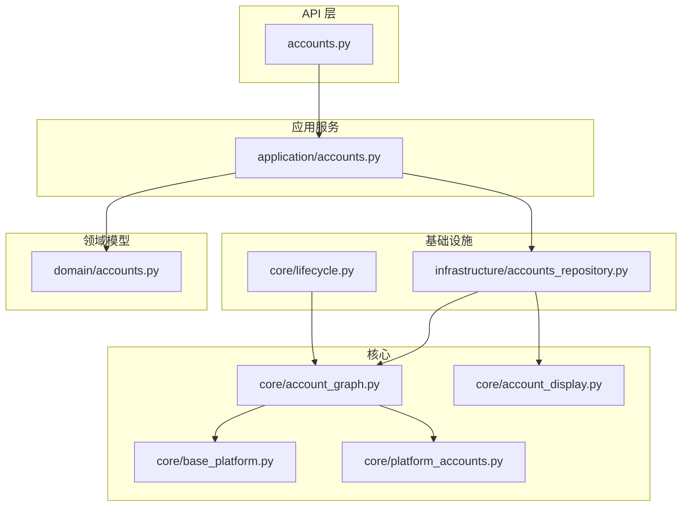
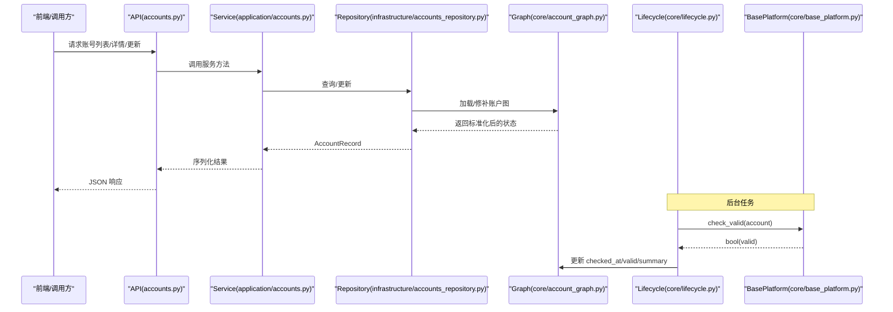
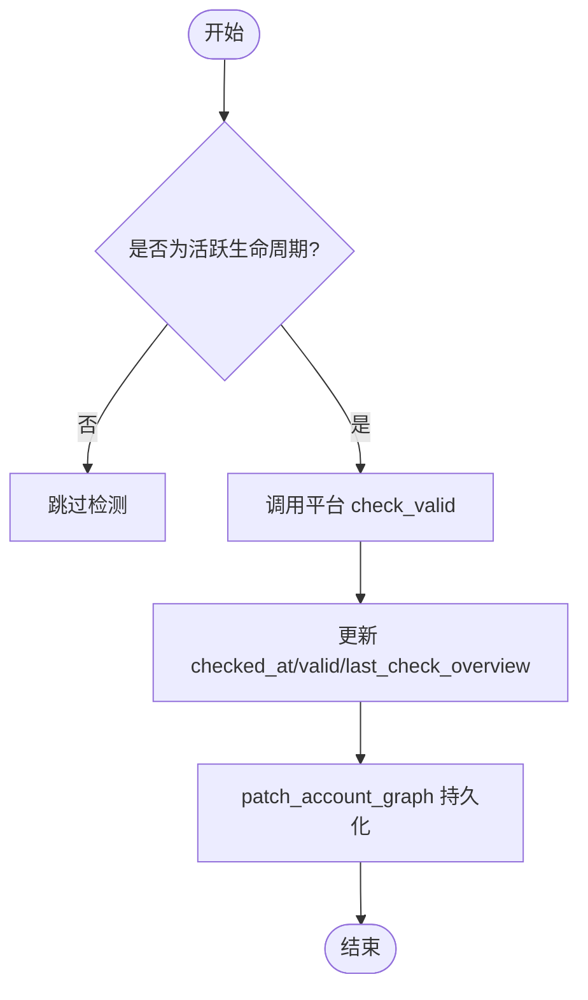
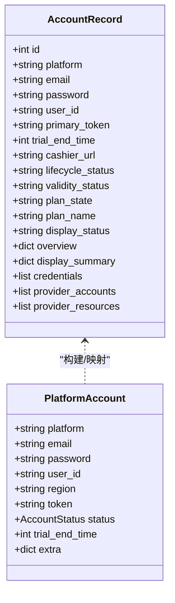
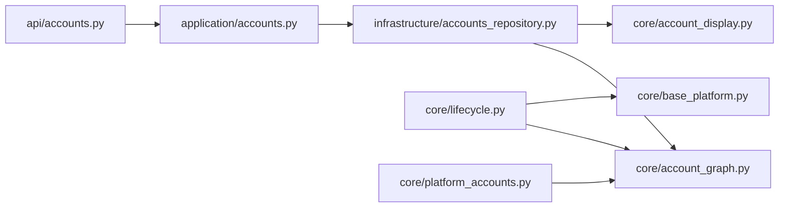

# 账户状态管理

<cite>
**本文引用的文件**
- [domain/accounts.py](file://domain/accounts.py)
- [core/base_platform.py](file://core/base_platform.py)
- [core/account_graph.py](file://core/account_graph.py)
- [core/platform_accounts.py](file://core/platform_accounts.py)
- [infrastructure/accounts_repository.py](file://infrastructure/accounts_repository.py)
- [application/accounts.py](file://application/accounts.py)
- [api/accounts.py](file://api/accounts.py)
- [core/lifecycle.py](file://core/lifecycle.py)
- [core/account_display.py](file://core/account_display.py)
</cite>

## 目录
1. [简介](#简介)
2. [项目结构](#项目结构)
3. [核心组件](#核心组件)
4. [架构总览](#架构总览)
5. [详细组件分析](#详细组件分析)
6. [依赖关系分析](#依赖关系分析)
7. [性能考虑](#性能考虑)
8. [故障排查指南](#故障排查指南)
9. [结论](#结论)
10. [附录](#附录)

## 简介
本文件系统性说明账户状态管理机制，覆盖以下方面：
- 账户状态定义与含义：生命周期状态（registered、trial、subscribed、expired、invalid）、有效性状态（valid、invalid、unknown）、显示状态（display_status）以及套餐状态（plan_state）。
- 状态更新触发机制：自动检测、手动刷新、事件驱动（平台能力执行后持久化）。
- 状态同步策略：后端图模型（account graph）与前端展示的一致性保障。
- 状态变更历史与审计：检查时间、最近刷新时间、过期预警等元数据。
- 批量状态更新：按条件筛选并导出/处理多个账号。
- 状态监控与告警：周期性任务对失效、即将过期、封禁等异常进行标记与上报。

## 项目结构
围绕账户状态的核心代码分布在领域模型、基础设施仓库、应用服务、API 层以及生命周期调度模块中：
- 领域模型：AccountRecord、AccountQuery、AccountStats 等数据结构定义。
- 基础平台：AccountStatus 枚举、平台抽象基类，提供 check_valid 等能力。
- 账户图（account graph）：统一存储 overview、credentials、provider accounts/resources，并负责状态推导与持久化。
- 仓库层：AccountsRepository 负责 CRUD、统计、导入导出、图同步。
- 应用服务：AccountsService 编排业务逻辑，序列化返回给 API。
- API 层：FastAPI 路由暴露查询、创建、更新、删除、批量导出等接口。
- 生命周期：后台线程定期执行有效性检测、Token 续期、试用到期预警、CPA 同步等。
- 显示摘要：将多源状态聚合为前端友好的 display_summary。

图表来源
- [api/accounts.py:79-239](file://api/accounts.py#L79-L239)
- [application/accounts.py:42-160](file://application/accounts.py#L42-L160)
- [infrastructure/accounts_repository.py:98-392](file://infrastructure/accounts_repository.py#L98-L392)
- [core/account_graph.py:613-745](file://core/account_graph.py#L613-L745)
- [core/lifecycle.py:37-193](file://core/lifecycle.py#L37-L193)
- [core/base_platform.py:13-19](file://core/base_platform.py#L13-L19)
- [core/platform_accounts.py:96-113](file://core/platform_accounts.py#L96-L113)
- [core/account_display.py:198-278](file://core/account_display.py#L198-L278)

章节来源
- [api/accounts.py:79-239](file://api/accounts.py#L79-L239)
- [application/accounts.py:42-160](file://application/accounts.py#L42-L160)
- [infrastructure/accounts_repository.py:98-392](file://infrastructure/accounts_repository.py#L98-L392)
- [core/account_graph.py:613-745](file://core/account_graph.py#L613-L745)
- [core/lifecycle.py:37-193](file://core/lifecycle.py#L37-L193)
- [core/base_platform.py:13-19](file://core/base_platform.py#L13-L19)
- [core/platform_accounts.py:96-113](file://core/platform_accounts.py#L96-L113)
- [core/account_display.py:198-278](file://core/account_display.py#L198-L278)

## 核心组件
- 领域模型
  - AccountRecord：包含 id、platform、email、password、user_id、primary_token、trial_end_time、cashier_url、lifecycle_status、validity_status、plan_state、plan_name、display_status、overview、display_summary、credentials、provider_accounts、provider_resources 等字段。
  - AccountQuery / AccountUpdateCommand / AccountCreateCommand：用于查询、更新、创建的命令对象。
  - AccountStats：统计维度包括 total、by_platform、by_status、by_lifecycle_status、by_plan_state、by_validity_status、by_display_status。
- 基础平台
  - AccountStatus：枚举值 registered、trial、subscribed、expired、invalid。
  - BasePlatform.check_valid：由具体平台实现，用于判断账号是否有效。
- 账户图（account graph）
  - 统一承载 overview、credentials、provider accounts/resources，并在写入时标准化和推导 lifecycle_status、validity_status、plan_state、display_status。
  - 提供 load_account_graphs、patch_account_graph、sync_account_graph 等能力。
- 仓库层
  - AccountsRepository：列表、获取、创建、更新、删除、导入、统计、CSV 导出；在读取时加载 account graph 并构建 AccountRecord。
- 应用服务
  - AccountsService：封装仓库调用，序列化结果，提供 list/get/create/update/delete/import/export/stats 等方法。
- API 层
  - FastAPI 路由：/accounts 列表、详情、创建、更新、删除、统计、多种格式批量导出、导入等。
- 生命周期
  - LifecycleManager：后台线程周期执行有效性检测、Token 续期、试用到期预警、CPA 同步。
- 显示摘要
  - build_account_display_summary：将多源状态聚合为 display_summary，供前端展示。

章节来源
- [domain/accounts.py:8-100](file://domain/accounts.py#L8-L100)
- [core/base_platform.py:13-19](file://core/base_platform.py#L13-L19)
- [core/account_graph.py:114-199](file://core/account_graph.py#L114-L199)
- [infrastructure/accounts_repository.py:98-392](file://infrastructure/accounts_repository.py#L98-L392)
- [application/accounts.py:42-160](file://application/accounts.py#L42-L160)
- [api/accounts.py:79-239](file://api/accounts.py#L79-L239)
- [core/lifecycle.py:458-528](file://core/lifecycle.py#L458-L528)
- [core/account_display.py:198-278](file://core/account_display.py#L198-L278)

## 架构总览
账户状态管理的整体流程如下：
- 写路径（创建/更新/导入）：API -> Service -> Repository -> patch_account_graph -> 持久化 overview/credentials/provider_*，并标准化状态。
- 读路径（列表/详情/统计）：API -> Service -> Repository -> load_account_graphs -> 计算 display_summary -> 返回。
- 自动检测：LifecycleManager 定时调用 check_accounts_validity，调用平台插件 check_valid，更新 checked_at/valid 等元数据。
- Token 续期：refresh_expiring_tokens 针对即将过期的 token 进行刷新，成功后更新 credentials 与 summary。
- 试用到期预警：flag_expiring_trials 扫描 trial 账号，根据 trial_end_time 标记已过期或即将过期。
- CPA 同步：refresh_and_sync_cpa 刷新 token、检查存活、上传 CPA，封禁账号标记 invalid。

图表来源
- [api/accounts.py:79-239](file://api/accounts.py#L79-L239)
- [application/accounts.py:42-160](file://application/accounts.py#L42-L160)
- [infrastructure/accounts_repository.py:98-392](file://infrastructure/accounts_repository.py#L98-L392)
- [core/account_graph.py:613-745](file://core/account_graph.py#L613-L745)
- [core/lifecycle.py:37-193](file://core/lifecycle.py#L37-L193)
- [core/base_platform.py:162-165](file://core/base_platform.py#L162-L165)

## 详细组件分析

### 状态定义与含义
- 生命周期状态（lifecycle_status）
  - registered：注册完成但未进入试用或订阅阶段。
  - trial：处于试用阶段，受 trial_end_time 约束。
  - subscribed：已订阅付费计划。
  - expired：试用或订阅已过期。
  - invalid：账号无效（如被封禁或认证失败）。
- 有效性状态（validity_status）
  - valid：经平台检测确认为有效。
  - invalid：经平台检测确认为无效。
  - unknown：尚未完成有效性检测。
- 显示状态（display_status）
  - 由 validity_status、plan_state、lifecycle_status 综合推导，优先反映用户可见的最终状态（例如 invalid > expired > subscribed > trial > registered）。
- 套餐状态（plan_state）
  - 归一化自 plan_name/membership_type/plan 等字段，映射到 trial/subscribed/expired/free/eligible/unknown。

推导规则要点：
- validity_status：若 lifecycle_status=invalid 则直接 invalid；否则依据 overview.valid 布尔值推导；未知时保持 unknown。
- plan_state：优先显式 plan_state，其次从 membership_type/plan/plan_name 归一化；若仍为空，回退到 lifecycle_status 或 eligible。
- display_status：invalid 优先；其次 expired；再是 subscribed/trial；最后回退到 lifecycle_status 或 registered。

章节来源
- [core/account_graph.py:114-199](file://core/account_graph.py#L114-L199)
- [core/base_platform.py:13-19](file://core/base_platform.py#L13-L19)
- [domain/accounts.py:8-100](file://domain/accounts.py#L8-L100)

### 状态更新触发机制
- 自动检测
  - LifecycleManager 周期性调用 check_accounts_validity，仅对活跃生命周期（registered/trial/subscribed）的账号进行检测。
  - 通过平台插件 base_platform.check_valid 判定有效性，更新 checked_at 与 valid，并记录 last_check_overview。
- 手动刷新
  - API 提供更新接口（PATCH /accounts/{id}），可更新 password、user_id、lifecycle_status、overview、credentials、primary_token、cashier_url、region、trial_end_time 等。
  - 平台能力执行（如生成链接、切换桌面、上传 CPA 等）会持久化相关 credential 与 overview 片段，从而间接更新状态。
- 事件驱动
  - 平台能力执行完成后，通过 patch_account_graph 持久化 summary_updates 与 credential_updates，确保状态与凭证一致。
  - CPA 同步流程在刷新 token、检查存活后，将封禁账号标记为 invalid，并上传 CPA 文件。

图表来源
- [core/lifecycle.py:37-97](file://core/lifecycle.py#L37-L97)
- [core/account_graph.py:673-745](file://core/account_graph.py#L673-L745)

章节来源
- [core/lifecycle.py:37-193](file://core/lifecycle.py#L37-L193)
- [api/accounts.py:225-230](file://api/accounts.py#L225-L230)
- [infrastructure/platform_runtime.py:295-321](file://infrastructure/platform_runtime.py#L295-L321)

### 状态同步策略
- 后端图模型（account graph）作为单一事实源，包含 overview、credentials、provider accounts/resources。
- 读取时通过 load_account_graphs 聚合多表数据，标准化并推导状态；写入时通过 patch_account_graph 规范化并持久化。
- 平台账户构建（build_platform_account）从 graph 解析 primary_token、status、trial_end_time、extra，保证平台侧使用最新状态。
- 显示摘要（build_account_display_summary）将多维度状态合并为 display_summary，便于前端统一渲染。

图表来源
- [domain/accounts.py:8-100](file://domain/accounts.py#L8-L100)
- [core/platform_accounts.py:96-113](file://core/platform_accounts.py#L96-L113)
- [core/account_display.py:198-278](file://core/account_display.py#L198-L278)

章节来源
- [core/account_graph.py:613-745](file://core/account_graph.py#L613-L745)
- [core/platform_accounts.py:96-113](file://core/platform_accounts.py#L96-L113)
- [core/account_display.py:198-278](file://core/account_display.py#L198-L278)

### 状态变更的历史记录与审计
- 检查时间：checked_at 在每次有效性检测后更新。
- 最近刷新时间：last_refresh_at 在 Token 刷新成功后更新。
- 过期预警：expiry_warning、expiry_warning_hours 在试用即将过期时写入。
- 封禁信息：deactivated_at、deactivated_reason 在检测到封禁时写入。
- 这些元数据均保存在 overview 中，可通过 display_summary 与统计接口查看。

章节来源
- [core/lifecycle.py:73-97](file://core/lifecycle.py#L73-L97)
- [core/lifecycle.py:168-183](file://core/lifecycle.py#L168-L183)
- [core/lifecycle.py:226-254](file://core/lifecycle.py#L226-L254)
- [core/lifecycle.py:391-400](file://core/lifecycle.py#L391-L400)

### 批量状态更新操作
- 批量导出：支持按平台、ID 集合、全选、状态过滤、邮箱搜索等条件导出 CSV/JSON/Sub2API/CPA/Kiro-go/Any2API。
- 批量删除：前端支持选中多个账号进行并发删除。
- 批量导入：支持 CSV 或文本行导入，自动识别 header 并解析 extra 字段（如 cashier_url、token、lifecycle_status 等）。
- 注意：当前系统未提供“一键批量修改生命周期状态”的专用接口，但可通过多次 PATCH 或导入时携带 lifecycle_status 实现批量更新。

章节来源
- [api/accounts.py:110-209](file://api/accounts.py#L110-L209)
- [infrastructure/accounts_repository.py:244-332](file://infrastructure/accounts_repository.py#L244-L332)
- [frontend/src/pages/Accounts.tsx:1749-1784](file://frontend/src/pages/Accounts.tsx#L1749-L1784)

### 状态监控与告警机制
- 周期性任务：
  - 有效性检测：check_accounts_validity，统计 valid/invalid/error/skipped。
  - Token 续期：refresh_expiring_tokens，统计 refreshed/failed/skipped。
  - 试用到期预警：flag_expiring_trials，统计 warned/expired/skipped。
  - CPA 同步：refresh_and_sync_cpa，统计 refreshed/uploaded/dead/skipped/error。
- 告警与标记：
  - 即将过期：写入 expiry_warning 与 hours_left。
  - 已过期：将 lifecycle_status 置为 expired。
  - 封禁：将 lifecycle_status 置为 invalid，并记录 deactivated_at/reason。
- 日志输出：各任务在执行过程中输出关键步骤与结果，便于运维排查。

章节来源
- [core/lifecycle.py:37-193](file://core/lifecycle.py#L37-L193)
- [core/lifecycle.py:200-260](file://core/lifecycle.py#L200-L260)
- [core/lifecycle.py:267-451](file://core/lifecycle.py#L267-L451)

## 依赖关系分析
- API 层依赖应用服务，应用服务依赖仓库层，仓库层依赖账户图与数据库模型。
- 生命周期模块依赖账户图与平台基类，通过平台插件执行 check_valid 与 CPA 同步。
- 显示摘要依赖账户图与 overview，将复杂状态转换为前端友好结构。
- 平台账户构建依赖账户图，解析 primary_token、status、trial_end_time、extra。

图表来源
- [api/accounts.py:79-239](file://api/accounts.py#L79-L239)
- [application/accounts.py:42-160](file://application/accounts.py#L42-L160)
- [infrastructure/accounts_repository.py:98-392](file://infrastructure/accounts_repository.py#L98-L392)
- [core/account_graph.py:613-745](file://core/account_graph.py#L613-L745)
- [core/lifecycle.py:37-193](file://core/lifecycle.py#L37-L193)
- [core/base_platform.py:162-165](file://core/base_platform.py#L162-L165)
- [core/platform_accounts.py:96-113](file://core/platform_accounts.py#L96-L113)
- [core/account_display.py:198-278](file://core/account_display.py#L198-L278)

章节来源
- [api/accounts.py:79-239](file://api/accounts.py#L79-L239)
- [application/accounts.py:42-160](file://application/accounts.py#L42-L160)
- [infrastructure/accounts_repository.py:98-392](file://infrastructure/accounts_repository.py#L98-L392)
- [core/account_graph.py:613-745](file://core/account_graph.py#L613-L745)
- [core/lifecycle.py:37-193](file://core/lifecycle.py#L37-L193)
- [core/base_platform.py:162-165](file://core/base_platform.py#L162-L165)
- [core/platform_accounts.py:96-113](file://core/platform_accounts.py#L96-L113)
- [core/account_display.py:198-278](file://core/account_display.py#L198-L278)

## 性能考虑
- 批量读取优化：load_account_graphs 一次性加载多账号的 overview/credentials/provider_*，减少多次 IO。
- 分页与过滤：列表接口支持 page/page_size 与 status/email 过滤，降低传输量。
- 后台任务限流：check_accounts_validity、refresh_expiring_tokens、flag_expiring_trials、refresh_and_sync_cpa 均支持 limit 参数，避免一次性处理过多账号。
- 幂等写入：patch_account_graph 在写入前进行标准化与去重，避免重复凭证与冗余数据。
- 缓存与复用：build_platform_account 复用 graph 中的 token 与 extra，减少额外网络请求。

[本节为通用性能建议，不直接分析具体文件]

## 故障排查指南
- 账号检测异常
  - 现象：check_accounts_validity 返回 error 计数增加。
  - 排查：检查平台插件 check_valid 实现与网络连通性；查看日志中的异常信息。
- Token 刷新失败
  - 现象：refresh_expiring_tokens 返回 failed 计数增加。
  - 排查：确认 refresh_token/session_token 是否存在；检查 CPA 配置与代理设置。
- 试用即将过期
  - 现象：flag_expiring_trials 返回 warned 计数增加。
  - 排查：核对 trial_end_time 是否正确；必要时延长试用或转为订阅。
- 账号被封禁
  - 现象：refresh_and_sync_cpa 返回 dead 计数增加，lifecycle_status 被置为 invalid。
  - 排查：查看 deactivated_reason；评估是否需要更换账号或申诉解封。
- 显示状态不一致
  - 现象：display_status 与预期不符。
  - 排查：检查 overview 中的 plan_state/lifecycle_status/validity_status；确认 derive 逻辑是否符合预期。

章节来源
- [core/lifecycle.py:37-193](file://core/lifecycle.py#L37-L193)
- [core/lifecycle.py:200-260](file://core/lifecycle.py#L200-L260)
- [core/lifecycle.py:267-451](file://core/lifecycle.py#L267-L451)
- [core/account_graph.py:114-199](file://core/account_graph.py#L114-L199)

## 结论
本系统通过统一的账户图模型与标准化的状态推导逻辑，实现了账户生命周期、有效性、显示状态的集中管理与一致性保障。后台生命周期任务提供了自动检测、Token 续期、试用到期预警与 CPA 同步等关键能力，结合批量导入/导出与统计接口，满足大规模账号运营需求。前端通过 display_summary 获得一致的展示视图，便于监控与决策。

[本节为总结性内容，不直接分析具体文件]

## 附录
- 常用接口
  - GET /accounts：列表查询，支持 platform/status/email/page/page_size。
  - POST /accounts：创建账号，支持 lifecycle_status/overview/credentials 等。
  - PATCH /accounts/{id}：更新账号，支持 lifecycle_status/overview/credentials/primary_token 等。
  - GET /accounts/stats：统计信息，包含 by_platform/by_status/by_lifecycle_status/by_plan_state/by_validity_status/by_display_status。
  - POST /accounts/export/*：批量导出 JSON/CSV/Sub2API/CPA/Kiro-go/Any2API。
  - POST /accounts/import：批量导入账号。

章节来源
- [api/accounts.py:79-239](file://api/accounts.py#L79-L239)
- [application/accounts.py:42-160](file://application/accounts.py#L42-L160)
- [infrastructure/accounts_repository.py:98-392](file://infrastructure/accounts_repository.py#L98-L392)