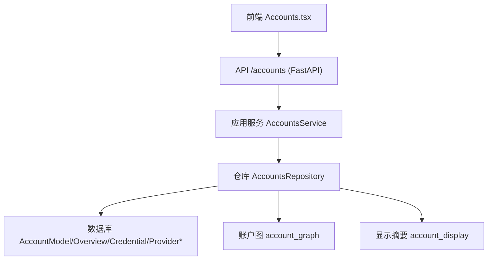
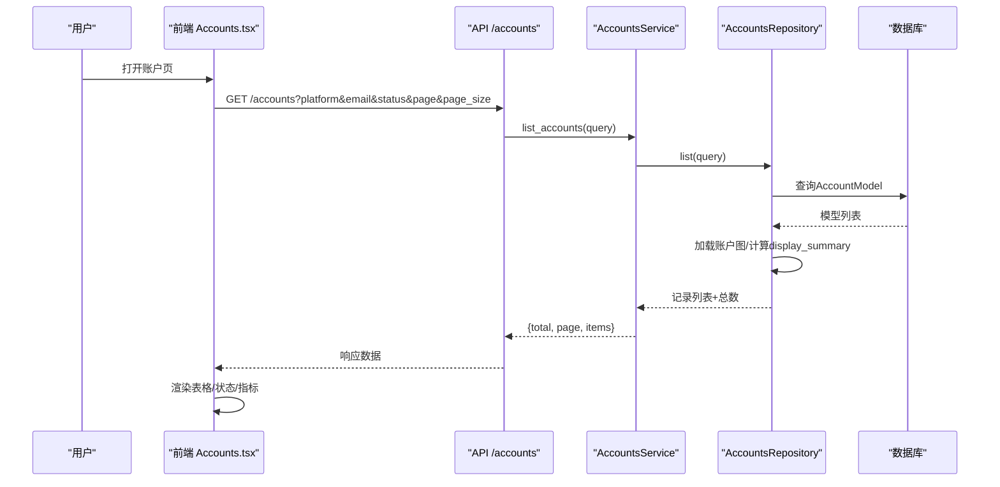
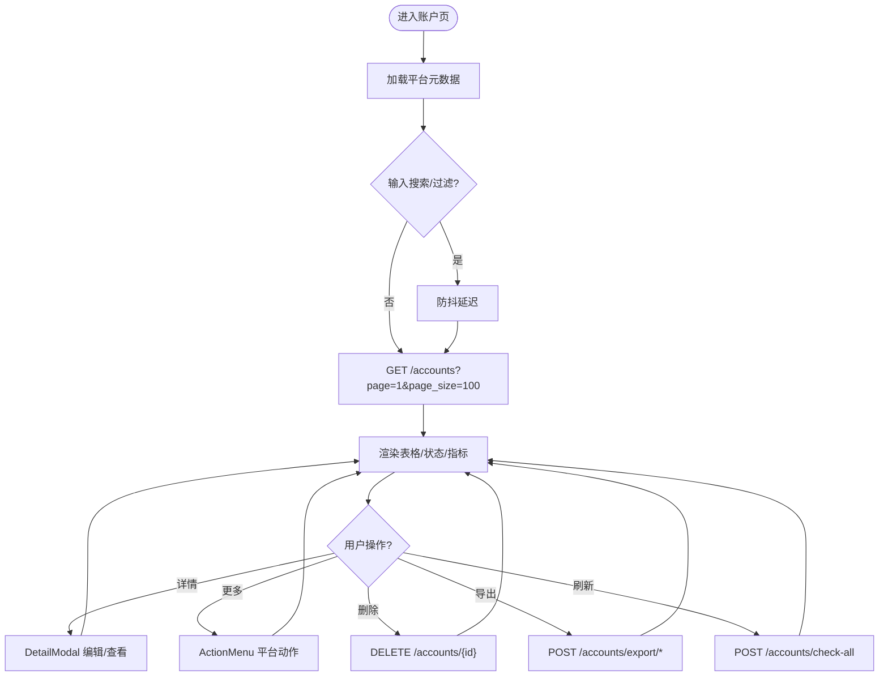
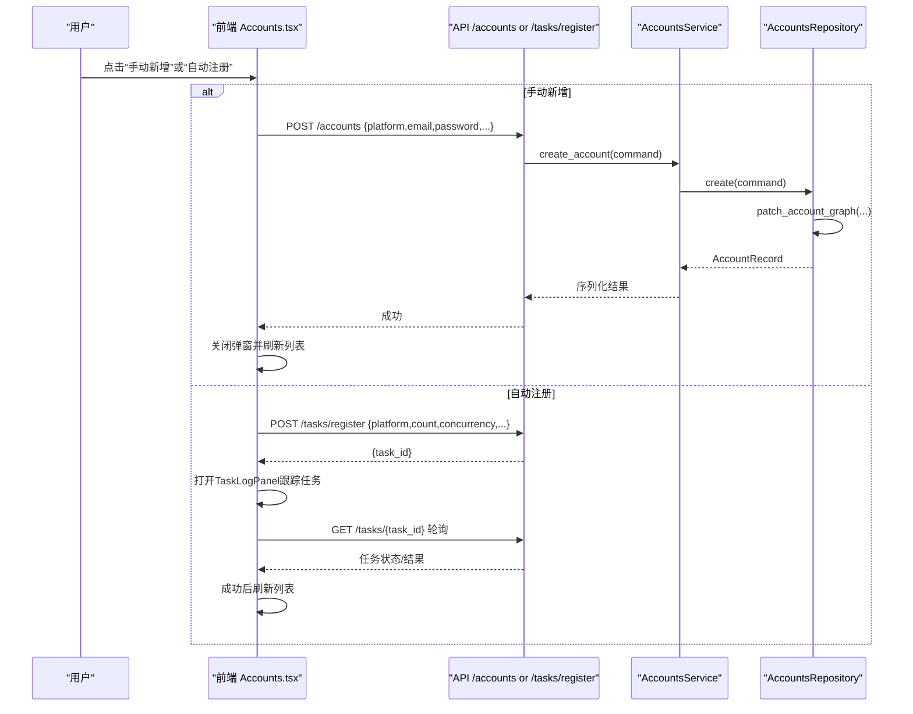
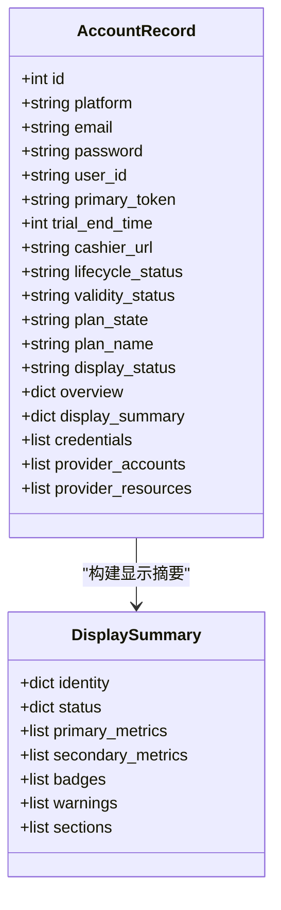
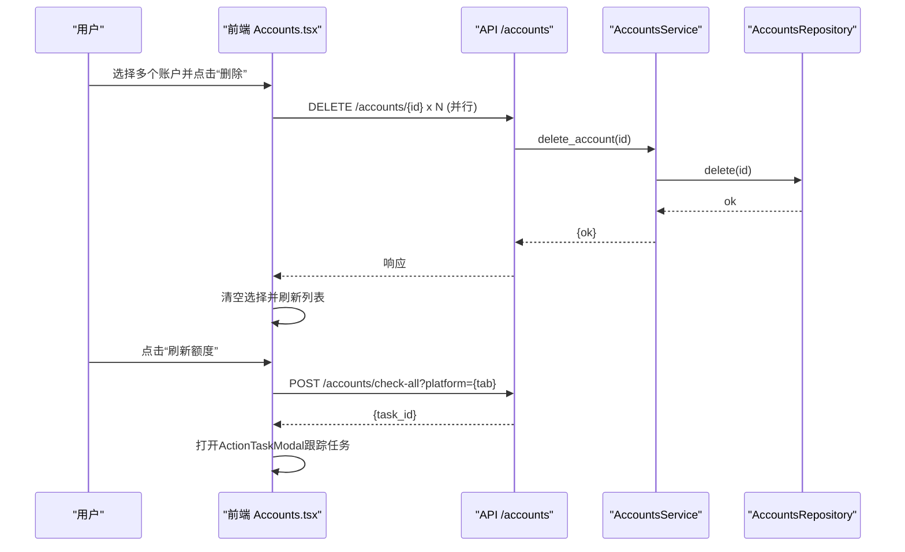
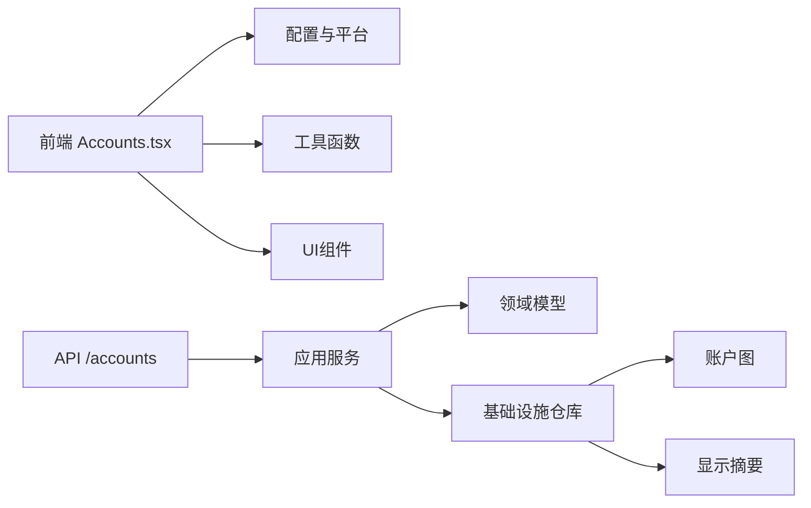

# 账户管理界面

<cite>
**本文引用的文件**
- [frontend/src/pages/Accounts.tsx](file://frontend/src/pages/Accounts.tsx)
- [api/accounts.py](file://api/accounts.py)
- [application/accounts.py](file://application/accounts.py)
- [domain/accounts.py](file://domain/accounts.py)
- [infrastructure/accounts_repository.py](file://infrastructure/accounts_repository.py)
- [core/account_display.py](file://core/account_display.py)
- [core/account_graph.py](file://core/account_graph.py)
</cite>

## 目录
1. [简介](#简介)
2. [项目结构](#项目结构)
3. [核心组件](#核心组件)
4. [架构总览](#架构总览)
5. [详细组件分析](#详细组件分析)
6. [依赖关系分析](#依赖关系分析)
7. [性能考虑](#性能考虑)
8. [故障排查指南](#故障排查指南)
9. [结论](#结论)
10. [附录](#附录)

## 简介
本文件系统性介绍账户管理界面的完整实现，覆盖以下目标：
- 账户列表展示：表格字段、状态标识、搜索与过滤、分页与导出。
- 账户创建流程：从表单到API调用的端到端过程（手动新增与自动注册）。
- 账户状态管理：生命周期、有效性、套餐状态及显示状态的生成与更新。
- 批量操作：批量删除、批量刷新额度、批量导出等。
- 数据同步机制：前端状态与后端数据的一致性保障。
- 错误处理与用户反馈：Toast、任务日志弹窗、结果详情弹窗等。
- 最佳实践与性能优化建议。

## 项目结构
账户管理功能由前端页面与后端服务分层协作完成：
- 前端页面 Accounts.tsx：负责列表渲染、搜索过滤、批量选择、导入/导出、注册弹窗、详情编辑、平台动作执行与任务跟踪。
- API 层 accounts.py：暴露 RESTful 接口，接收请求并调用应用服务。
- 应用服务 application/accounts.py：业务编排、数据序列化、导入解析、统计聚合。
- 领域模型 domain/accounts.py：定义查询、命令、记录、统计等数据结构。
- 基础设施 infrastructure/accounts_repository.py：数据库访问、图结构加载、状态计算、CSV导出。
- 展示摘要 core/account_display.py：根据账户概览与状态构建可展示的指标、警告、徽章与分区。
- 账户图 core/account_graph.py：维护账户的概览、凭证、提供方账号/资源，以及状态推导与持久化。

图表来源
- [frontend/src/pages/Accounts.tsx:1511-1783](file://frontend/src/pages/Accounts.tsx#L1511-L1783)
- [api/accounts.py:79-239](file://api/accounts.py#L79-L239)
- [application/accounts.py:42-160](file://application/accounts.py#L42-L160)
- [infrastructure/accounts_repository.py:111-392](file://infrastructure/accounts_repository.py#L111-L392)
- [core/account_display.py:198-278](file://core/account_display.py#L198-L278)
- [core/account_graph.py:613-745](file://core/account_graph.py#L613-L745)

章节来源
- [frontend/src/pages/Accounts.tsx:1511-1783](file://frontend/src/pages/Accounts.tsx#L1511-L1783)
- [api/accounts.py:79-239](file://api/accounts.py#L79-L239)
- [application/accounts.py:42-160](file://application/accounts.py#L42-L160)
- [infrastructure/accounts_repository.py:111-392](file://infrastructure/accounts_repository.py#L111-L392)
- [core/account_display.py:198-278](file://core/account_display.py#L198-L278)
- [core/account_graph.py:613-745](file://core/account_graph.py#L613-L745)

## 核心组件
- 前端账户页 Accounts.tsx
  - 列表与筛选：支持按邮箱模糊搜索、按显示状态过滤、分页加载。
  - 状态展示：基于 display_status/lifecycle_status/plan_state/validity_status 的多维状态与指标。
  - 批量操作：全选/单选、批量删除、一键刷新额度、多格式导出。
  - 注册流程：自动注册弹窗，选择身份提供者与执行器，提交任务并跟踪日志。
  - 详情编辑：修改生命周期状态、主凭证、试用链接等。
  - 平台动作：动态加载平台动作菜单，支持参数化执行与异步任务跟踪。
- 后端账户服务
  - API 路由：列出、创建、更新、删除、导入、导出、统计。
  - 应用服务：序列化、导入解析、统计聚合。
  - 仓库层：查询、分页、状态过滤、图加载、CSV导出。
  - 显示摘要：统一构建 primary_metrics/secondary_metrics/badges/warnings/sections。
  - 账户图：标准化概览、凭证、提供方账号/资源，推导并持久化状态。

章节来源
- [frontend/src/pages/Accounts.tsx:1511-1963](file://frontend/src/pages/Accounts.tsx#L1511-L1963)
- [api/accounts.py:79-239](file://api/accounts.py#L79-L239)
- [application/accounts.py:42-160](file://application/accounts.py#L42-L160)
- [infrastructure/accounts_repository.py:111-392](file://infrastructure/accounts_repository.py#L111-L392)
- [core/account_display.py:198-278](file://core/account_display.py#L198-L278)
- [core/account_graph.py:613-745](file://core/account_graph.py#L613-L745)

## 架构总览
账户管理的端到端流程如下：
- 列表加载：前端调用 GET /accounts?platform&email&status&page&page_size，后端通过仓库查询并返回分页数据。
- 搜索过滤：前端对 email 进行防抖后传入；后端在仓库层按 platform/email 过滤，并在内存中按 status 过滤。
- 状态展示：仓库加载账户图，计算 display_summary，前端据此渲染状态标签与指标。
- 创建账户：POST /accounts 或 POST /tasks/register（自动注册），前者直接入库，后者创建任务并跟踪。
- 更新账户：PATCH /accounts/{id} 更新生命周期状态、主凭证、试用链接等。
- 批量操作：批量删除 DELETE /accounts/{id}；批量刷新 POST /accounts/check-all；批量导出 POST /accounts/export/*。
- 平台动作：GET /actions/{platform} 获取动作定义，POST /actions/{platform}/{account_id}/{action_id} 执行动作，可能返回同步结果或 task_id。

图表来源
- [frontend/src/pages/Accounts.tsx:1554-1565](file://frontend/src/pages/Accounts.tsx#L1554-L1565)
- [api/accounts.py:79-87](file://api/accounts.py#L79-L87)
- [application/accounts.py:46-52](file://application/accounts.py#L46-L52)
- [infrastructure/accounts_repository.py:111-133](file://infrastructure/accounts_repository.py#L111-L133)
- [core/account_graph.py:613-652](file://core/account_graph.py#L613-L652)
- [core/account_display.py:198-278](file://core/account_display.py#L198-L278)

## 详细组件分析

### 账户列表展示
- 表格字段
  - 邮箱：支持复制，显示验证邮箱与远端邮箱。
  - 密码：默认模糊显示，悬停可清晰查看并复制。
  - 状态：基于 display_status 渲染不同样式标签，同时展示主要指标（如剩余额度、已用额度）或紧凑元信息。
  - 试用链接：存在时提供复制链接与打开按钮。
  - 注册时间：本地化时间显示。
  - 操作：详情、更多平台动作、删除。
- 搜索与过滤
  - 邮箱搜索：前端防抖后传入 email 参数，后端使用 contains 匹配。
  - 状态过滤：前端下拉框选择显示状态，后端在内存中对 display_status/lifecycle_status/plan_state/validity_status 综合过滤。
- 分页与导出
  - 分页：page/page_size=100，后端返回 total/items。
  - 导出：ChatGPT 平台支持 JSON/CSV/Sub2Api/CPA/Kiro-Go/Any2Api 等多格式导出；其他平台支持 CSV 导出。

图表来源
- [frontend/src/pages/Accounts.tsx:1511-1783](file://frontend/src/pages/Accounts.tsx#L1511-L1783)
- [api/accounts.py:79-239](file://api/accounts.py#L79-L239)
- [application/accounts.py:46-160](file://application/accounts.py#L46-L160)
- [infrastructure/accounts_repository.py:111-162](file://infrastructure/accounts_repository.py#L111-L162)

章节来源
- [frontend/src/pages/Accounts.tsx:1511-1963](file://frontend/src/pages/Accounts.tsx#L1511-L1963)
- [api/accounts.py:79-239](file://api/accounts.py#L79-L239)
- [application/accounts.py:46-160](file://application/accounts.py#L46-L160)
- [infrastructure/accounts_repository.py:111-162](file://infrastructure/accounts_repository.py#L111-L162)

### 账户创建流程
- 手动新增
  - 表单字段：邮箱、密码、主凭证、试用链接、生命周期状态。
  - 提交：POST /accounts，后端创建记录并写入账户图（生命周期、凭证、试用链接等）。
  - 成功后刷新列表。
- 自动注册
  - 弹窗步骤：选择注册身份（mailbox/oauth_browser）、执行方式（executor_type）、数量与并发。
  - 提交：POST /tasks/register，返回 task_id，前端通过 TaskLogPanel 跟踪任务进度与结果。
  - 完成后关闭弹窗并刷新列表。

图表来源
- [frontend/src/pages/Accounts.tsx:175-480](file://frontend/src/pages/Accounts.tsx#L175-L480)
- [frontend/src/pages/Accounts.tsx:483-532](file://frontend/src/pages/Accounts.tsx#L483-L532)
- [api/accounts.py:90-92](file://api/accounts.py#L90-L92)
- [application/accounts.py:58-66](file://application/accounts.py#L58-L66)
- [infrastructure/accounts_repository.py:164-196](file://infrastructure/accounts_repository.py#L164-L196)

章节来源
- [frontend/src/pages/Accounts.tsx:175-532](file://frontend/src/pages/Accounts.tsx#L175-L532)
- [api/accounts.py:90-92](file://api/accounts.py#L90-L92)
- [application/accounts.py:58-66](file://application/accounts.py#L58-L66)
- [infrastructure/accounts_repository.py:164-196](file://infrastructure/accounts_repository.py#L164-L196)

### 账户状态管理机制
- 状态维度
  - lifecycle_status：生命周期状态（registered/trial/subscribed/expired/invalid）。
  - validity_status：有效性状态（unknown/valid/invalid）。
  - plan_state：套餐状态（free/eligible/trial/subscribed/expired/unknown）。
  - display_status：最终显示状态，优先级高于生命周期，用于UI呈现。
- 状态推导
  - 账户图在加载时根据 overview 与生命周期推导 validity_status、plan_state、plan_name、display_status。
  - 显示摘要将多维度状态与指标整合为 primary_metrics/secondary_metrics/badges/warnings/sections。
- 前端展示
  - 列表行内显示 display_status 标签与关键指标；详情页集中展示所有维度与明细。
- 更新路径
  - 手动编辑：PATCH /accounts/{id} 更新 lifecycle_status、primary_token、cashier_url 等。
  - 自动刷新：POST /accounts/check-all 触发批量检查，后端更新账户图与状态。

图表来源
- [domain/accounts.py:8-30](file://domain/accounts.py#L8-L30)
- [core/account_display.py:198-278](file://core/account_display.py#L198-L278)
- [core/account_graph.py:185-199](file://core/account_graph.py#L185-L199)

章节来源
- [core/account_graph.py:185-199](file://core/account_graph.py#L185-L199)
- [core/account_display.py:198-278](file://core/account_display.py#L198-L278)
- [frontend/src/pages/Accounts.tsx:1207-1389](file://frontend/src/pages/Accounts.tsx#L1207-L1389)

### 批量操作功能
- 批量删除
  - 前端多选后调用 Promise.allSettled 并行删除多个账户，完成后清空选择并刷新列表。
- 批量刷新额度
  - 点击“刷新额度”触发 POST /accounts/check-all?platform={tab}，返回 task_id，前端以 ActionTaskModal 跟踪任务状态。
- 批量导出
  - ChatGPT 平台支持多种导出格式（JSON/CSV/Sub2Api/CPA/Kiro-Go/Any2Api），其他平台支持 CSV。
  - 支持导出当前筛选结果或已选账户集合。

图表来源
- [frontend/src/pages/Accounts.tsx:1758-1781](file://frontend/src/pages/Accounts.tsx#L1758-L1781)
- [frontend/src/pages/Accounts.tsx:1421-1508](file://frontend/src/pages/Accounts.tsx#L1421-L1508)
- [api/accounts.py:110-209](file://api/accounts.py#L110-L209)
- [application/accounts.py:121-134](file://application/accounts.py#L121-L134)
- [infrastructure/accounts_repository.py:334-392](file://infrastructure/accounts_repository.py#L334-L392)

章节来源
- [frontend/src/pages/Accounts.tsx:1758-1781](file://frontend/src/pages/Accounts.tsx#L1758-L1781)
- [frontend/src/pages/Accounts.tsx:1421-1508](file://frontend/src/pages/Accounts.tsx#L1421-L1508)
- [api/accounts.py:110-209](file://api/accounts.py#L110-L209)
- [application/accounts.py:121-134](file://application/accounts.py#L121-L134)
- [infrastructure/accounts_repository.py:334-392](file://infrastructure/accounts_repository.py#L334-L392)

### 数据同步机制
- 前端状态与后端一致性
  - 列表加载：每次切换平台/搜索/过滤都会重新拉取数据，确保视图与后端一致。
  - 操作后刷新：新增、导入、删除、更新、批量刷新等操作完成后均调用 load() 刷新列表。
  - 任务跟踪：自动注册与平台动作通过 task_id 跟踪任务状态，完成后读取结果并刷新。
- 后端数据一致性
  - 账户图：创建/更新时通过 patch_account_graph 同步概览、凭证、提供方账号/资源，并持久化状态。
  - 显示摘要：每次读取账户时构建 display_summary，保证前端展示的一致性与丰富性。

章节来源
- [frontend/src/pages/Accounts.tsx:1554-1565](file://frontend/src/pages/Accounts.tsx#L1554-L1565)
- [frontend/src/pages/Accounts.tsx:1627-1650](file://frontend/src/pages/Accounts.tsx#L1627-L1650)
- [infrastructure/accounts_repository.py:164-196](file://infrastructure/accounts_repository.py#L164-L196)
- [core/account_graph.py:673-745](file://core/account_graph.py#L673-L745)
- [core/account_display.py:198-278](file://core/account_display.py#L198-L278)

### 错误处理与用户反馈
- 前端反馈
  - Toast：操作成功/失败提示，自动消失。
  - 任务弹窗：显示任务状态、错误摘要与实时日志。
  - 结果详情：平台动作返回的数据以结构化卡片与原始JSON展示。
- 后端错误
  - 404：账号不存在时抛出 HTTPException。
  - 400：导出参数校验失败时抛出 HTTPException。
- 用户体验
  - 禁用态：执行中按钮禁用，防止重复提交。
  - 确认对话框：删除前二次确认，避免误操作。

章节来源
- [frontend/src/pages/Accounts.tsx:937-1205](file://frontend/src/pages/Accounts.tsx#L937-L1205)
- [frontend/src/pages/Accounts.tsx:1391-1419](file://frontend/src/pages/Accounts.tsx#L1391-L1419)
- [api/accounts.py:217-239](file://api/accounts.py#L217-L239)
- [api/accounts.py:110-209](file://api/accounts.py#L110-L209)

## 依赖关系分析
- 前端依赖
  - 配置与平台：getPlatforms/getConfig/getConfigOptions 用于初始化注册弹窗与执行器选项。
  - 工具函数：apiFetch/apiDownload/triggerBrowserDownload 用于网络请求与文件下载。
  - UI组件：Badge/Button/Card 等基础组件。
- 后端依赖
  - FastAPI：路由与异常处理。
  - Pydantic：请求体校验。
  - SQLModel：数据库模型与查询。
  - 账户图与显示摘要：状态推导与展示数据构建。

图表来源
- [frontend/src/pages/Accounts.tsx:1-15](file://frontend/src/pages/Accounts.tsx#L1-L15)
- [api/accounts.py:1-16](file://api/accounts.py#L1-L16)
- [application/accounts.py:1-18](file://application/accounts.py#L1-L18)
- [domain/accounts.py:1-100](file://domain/accounts.py#L1-L100)
- [infrastructure/accounts_repository.py:1-30](file://infrastructure/accounts_repository.py#L1-L30)

章节来源
- [frontend/src/pages/Accounts.tsx:1-15](file://frontend/src/pages/Accounts.tsx#L1-L15)
- [api/accounts.py:1-16](file://api/accounts.py#L1-L16)
- [application/accounts.py:1-18](file://application/accounts.py#L1-L18)
- [domain/accounts.py:1-100](file://domain/accounts.py#L1-L100)
- [infrastructure/accounts_repository.py:1-30](file://infrastructure/accounts_repository.py#L1-L30)

## 性能考虑
- 前端优化
  - 搜索防抖：减少频繁请求。
  - 平台动作缓存：Map 缓存 actions 与 Promise，避免重复请求。
  - 分页加载：page_size=100，控制单次渲染数据量。
  - 懒加载详情：点击行才打开详情弹窗。
- 后端优化
  - 批量查询：仓库层一次性加载账户图，减少多次数据库往返。
  - 内存过滤：状态过滤在内存中进行，避免复杂SQL。
  - 流式导出：CSV/JSON 使用 StreamingResponse 或内存流，降低大文件内存占用。
- 建议
  - 增加索引：对 platform、email、created_at 建立索引以提升查询性能。
  - 异步任务：批量刷新与导出尽量异步化，避免阻塞请求。
  - 缓存策略：对平台元数据与动作定义增加短期缓存。

[本节为通用指导，不直接分析具体文件]

## 故障排查指南
- 常见问题
  - 列表为空：检查平台选择、搜索条件、过滤状态是否正确。
  - 状态未更新：确认是否执行了刷新额度或更新了生命周期状态。
  - 导出失败：检查导出参数（平台、ID列表、筛选条件）是否合法。
- 调试方法
  - 查看任务日志：通过 ActionTaskModal 查看任务状态与错误摘要。
  - 检查网络请求：确认 API 返回码与响应体。
  - 查看账户图：确认 overview/credentials/provider_* 是否正确持久化。
- 定位依据
  - 前端错误：Toast 提示与控制台日志。
  - 后端错误：HTTPException 消息与堆栈。

章节来源
- [frontend/src/pages/Accounts.tsx:937-1205](file://frontend/src/pages/Accounts.tsx#L937-L1205)
- [api/accounts.py:217-239](file://api/accounts.py#L217-L239)
- [infrastructure/accounts_repository.py:613-745](file://infrastructure/accounts_repository.py#L613-L745)

## 结论
账户管理界面通过前后端协同实现了完整的账户生命周期管理：列表展示、搜索过滤、状态可视化、创建与更新、批量操作、数据同步与错误反馈。后端通过账户图与显示摘要保证了状态的一致性与丰富性，前端通过弹窗与任务跟踪提升了用户体验。建议在大数据量场景下进一步优化索引与缓存策略，提升整体性能。

[本节为总结，不直接分析具体文件]

## 附录
- 关键API参考
  - GET /accounts：列出账户（支持 platform/email/status/page/page_size）。
  - POST /accounts：创建账户。
  - PATCH /accounts/{id}：更新账户。
  - DELETE /accounts/{id}：删除账户。
  - POST /accounts/import：批量导入。
  - POST /accounts/export/*：批量导出（JSON/CSV/Sub2Api/CPA/Kiro-Go/Any2Api）。
  - POST /accounts/check-all：批量刷新额度。
- 状态枚举
  - lifecycle_status：registered/trial/subscribed/expired/invalid。
  - validity_status：unknown/valid/invalid。
  - plan_state：free/eligible/trial/subscribed/expired/unknown。
  - display_status：derived from above for UI presentation.

章节来源
- [api/accounts.py:79-239](file://api/accounts.py#L79-L239)
- [core/account_graph.py:185-199](file://core/account_graph.py#L185-L199)
- [core/account_display.py:198-278](file://core/account_display.py#L198-L278)