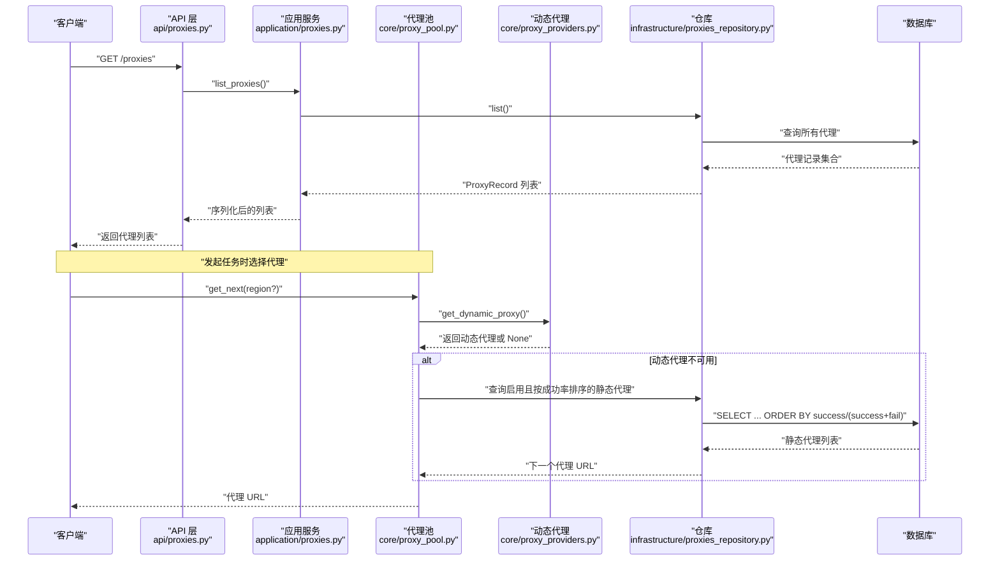
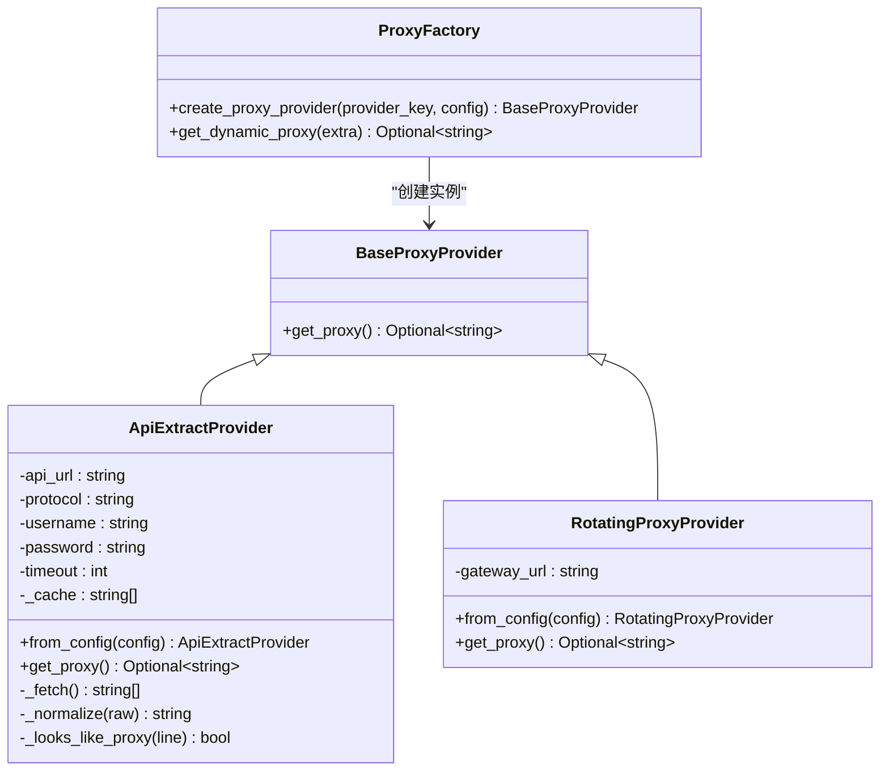
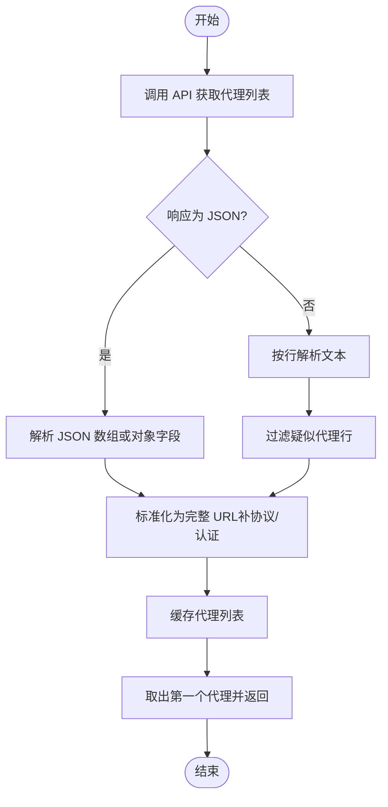
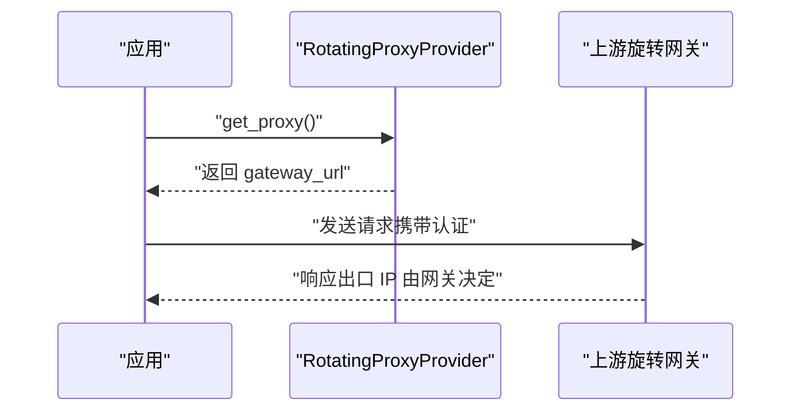
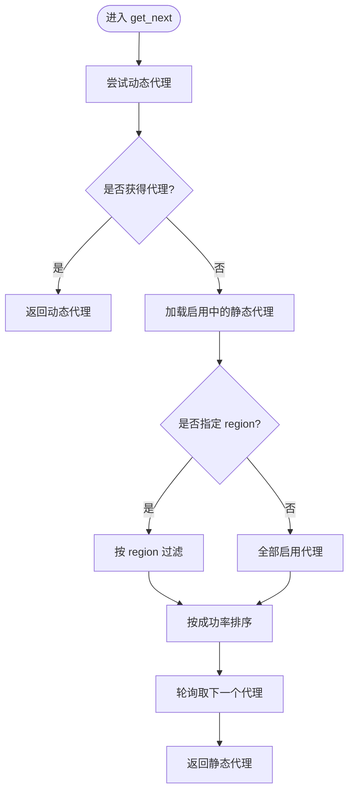
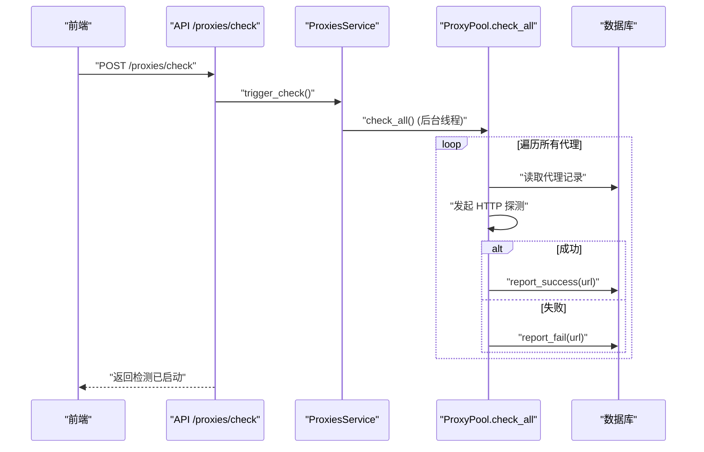
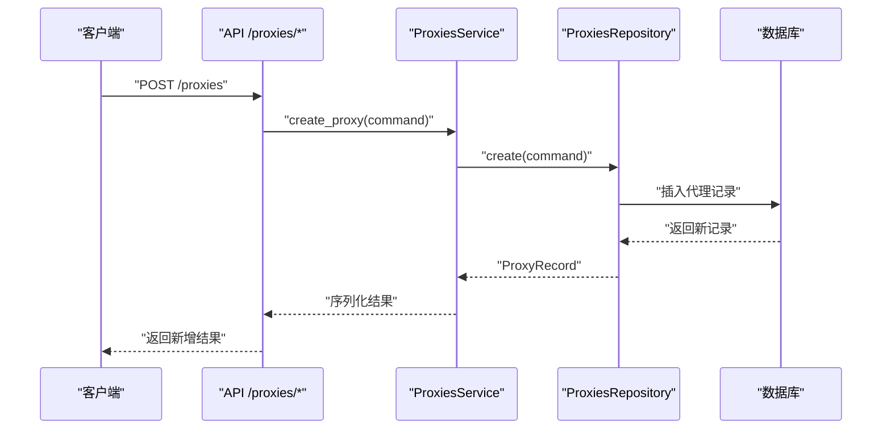
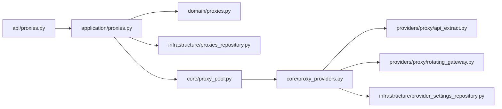

# 代理服务

<cite>
**本文引用的文件**
- [api/proxies.py](file://api/proxies.py)
- [application/proxies.py](file://application/proxies.py)
- [domain/proxies.py](file://domain/proxies.py)
- [infrastructure/proxies_repository.py](file://infrastructure/proxies_repository.py)
- [core/proxy_pool.py](file://core/proxy_pool.py)
- [core/proxy_providers.py](file://core/proxy_providers.py)
- [providers/proxy/api_extract.py](file://providers/proxy/api_extract.py)
- [providers/proxy/rotating_gateway.py](file://providers/proxy/rotating_gateway.py)
- [infrastructure/provider_settings_repository.py](file://infrastructure/provider_settings_repository.py)
</cite>

## 目录
1. [简介](#简介)
2. [项目结构](#项目结构)
3. [核心组件](#核心组件)
4. [架构总览](#架构总览)
5. [详细组件分析](#详细组件分析)
6. [依赖关系分析](#依赖关系分析)
7. [性能考量](#性能考量)
8. [故障排查指南](#故障排查指南)
9. [结论](#结论)
10. [附录](#附录)

## 简介
本章节面向“代理服务”的集成与管理，覆盖以下目标：
- API 提取代理的动态发现与配置方法（含代理池自动发现与健康检查）
- 旋转网关的实现原理（IP 轮换策略、请求分发与负载均衡）
- 代理服务的配置选项（认证方式、超时设置、重试策略）
- 代理质量监控、性能评估与故障检测机制
- 代理池管理操作（添加、删除、启用、禁用）
- 自定义代理服务扩展指南（协议支持、认证方式、性能优化）
- 部署架构与高可用配置建议

## 项目结构
围绕代理服务的关键代码分布在如下层次：
- API 层：提供 HTTP 接口用于代理列表查询、新增、批量导入、删除、启用/禁用、健康检查触发
- 应用服务层：编排业务逻辑，协调仓库与代理池
- 领域模型：定义代理记录、创建命令、检查摘要等数据结构
- 基础设施层：数据库读写、提供者设置读取
- 核心层：动态代理提供者抽象与工厂、代理池调度与统计
- 插件层：具体代理提供者实现（API 提取、旋转网关）

```mermaid
graph TB
A["API 层<br/>api/proxies.py"] --> B["应用服务层<br/>application/proxies.py"]
B --> C["领域模型<br/>domain/proxies.py"]
B --> D["基础设施层<br/>infrastructure/proxies_repository.py"]
B --> E["核心层<br/>core/proxy_pool.py"]
E --> F["核心层<br/>core/proxy_providers.py"]
F --> G["插件层<br/>providers/proxy/api_extract.py"]
F --> H["插件层<br/>providers/proxy/rotating_gateway.py"]
F --> I["基础设施层<br/>infrastructure/provider_settings_repository.py"]
```

图表来源
- [api/proxies.py:1-60](file://api/proxies.py#L1-L60)
- [application/proxies.py:1-49](file://application/proxies.py#L1-L49)
- [core/proxy_pool.py:1-91](file://core/proxy_pool.py#L1-L91)
- [core/proxy_providers.py:1-103](file://core/proxy_providers.py#L1-L103)
- [providers/proxy/api_extract.py:1-106](file://providers/proxy/api_extract.py#L1-L106)
- [providers/proxy/rotating_gateway.py:1-31](file://providers/proxy/rotating_gateway.py#L1-L31)
- [infrastructure/provider_settings_repository.py:1-167](file://infrastructure/provider_settings_repository.py#L1-L167)

章节来源
- [api/proxies.py:1-60](file://api/proxies.py#L1-L60)
- [application/proxies.py:1-49](file://application/proxies.py#L1-L49)
- [domain/proxies.py:1-35](file://domain/proxies.py#L1-L35)
- [infrastructure/proxies_repository.py:1-72](file://infrastructure/proxies_repository.py#L1-L72)
- [core/proxy_pool.py:1-91](file://core/proxy_pool.py#L1-L91)
- [core/proxy_providers.py:1-103](file://core/proxy_providers.py#L1-L103)
- [providers/proxy/api_extract.py:1-106](file://providers/proxy/api_extract.py#L1-L106)
- [providers/proxy/rotating_gateway.py:1-31](file://providers/proxy/rotating_gateway.py#L1-L31)
- [infrastructure/provider_settings_repository.py:1-167](file://infrastructure/provider_settings_repository.py#L1-L167)

## 核心组件
- 动态代理提供者基类与工厂：统一抽象 get_proxy 接口，按 provider_key 创建具体实现；支持从提供者设置中读取已启用的配置并合并认证信息
- API 提取提供者：调用第三方 API 获取代理列表，支持 JSON 或逐行文本解析，自动补全协议与认证
- 旋转网关提供者：固定网关地址，由上游服务商负责出口 IP 轮换
- 代理池：优先使用动态代理，回退到静态代理池；基于成功率排序轮询；失败计数达到阈值自动禁用；支持区域过滤
- 健康检查：对静态代理进行连通性探测，更新成功/失败计数与最后检查时间
- 提供者设置仓库：集中管理各类 provider 的配置、认证、元数据与启用状态

章节来源
- [core/proxy_providers.py:20-103](file://core/proxy_providers.py#L20-L103)
- [providers/proxy/api_extract.py:15-106](file://providers/proxy/api_extract.py#L15-L106)
- [providers/proxy/rotating_gateway.py:10-31](file://providers/proxy/rotating_gateway.py#L10-L31)
- [core/proxy_pool.py:9-91](file://core/proxy_pool.py#L9-L91)
- [infrastructure/provider_settings_repository.py:15-167](file://infrastructure/provider_settings_repository.py#L15-L167)

## 架构总览
下图展示了从 API 到代理选择的完整流程，包括动态代理优先、静态池回退、健康检查与统计。

图表来源
- [api/proxies.py:23-25](file://api/proxies.py#L23-L25)
- [application/proxies.py:14-15](file://application/proxies.py#L14-L15)
- [infrastructure/proxies_repository.py:22-25](file://infrastructure/proxies_repository.py#L22-L25)
- [core/proxy_pool.py:14-45](file://core/proxy_pool.py#L14-L45)
- [core/proxy_providers.py:77-102](file://core/proxy_providers.py#L77-L102)

## 详细组件分析

### 动态代理提供者与工厂
- BaseProxyProvider：定义统一的 get_proxy 接口，返回标准格式的代理 URL 或 None
- create_proxy_provider：根据 provider_key 创建 ApiExtractProvider 或 RotatingProxyProvider，校验必要参数
- get_dynamic_proxy：从 ProviderSettingsRepository 读取已启用的 proxy 类型设置，合并配置与认证，逐个尝试获取代理，任一成功即返回

图表来源
- [core/proxy_providers.py:20-74](file://core/proxy_providers.py#L20-L74)
- [providers/proxy/api_extract.py:17-106](file://providers/proxy/api_extract.py#L17-L106)
- [providers/proxy/rotating_gateway.py:11-31](file://providers/proxy/rotating_gateway.py#L11-L31)

章节来源
- [core/proxy_providers.py:20-103](file://core/proxy_providers.py#L20-L103)
- [providers/proxy/api_extract.py:15-106](file://providers/proxy/api_extract.py#L15-L106)
- [providers/proxy/rotating_gateway.py:10-31](file://providers/proxy/rotating_gateway.py#L10-L31)

### API 提取代理的动态发现与配置
- 发现方式：通过第三方 API 拉取代理列表，支持 JSON 数组或对象（常见键 data/proxies/list/proxy_list/result），也支持逐行文本格式
- 配置项：
  - proxy_api_url：必填，API 地址
  - proxy_protocol：可选，默认 http，支持 socks5/socks4/http/https
  - proxy_username/proxy_password：可选，若提供则注入到代理 URL 中
  - timeout：可选，HTTP 请求超时秒数
- 容错：API 请求异常时记录警告并返回空列表，避免阻塞后续逻辑

图表来源
- [providers/proxy/api_extract.py:54-105](file://providers/proxy/api_extract.py#L54-L105)

章节来源
- [providers/proxy/api_extract.py:15-106](file://providers/proxy/api_extract.py#L15-L106)

### 旋转网关的实现原理
- 工作原理：固定网关地址，每次请求经该网关出站，由上游服务商自动分配不同出口 IP
- 适用场景：BrightData、Oxylabs、IPRoyal 等提供固定入口的旋转代理
- 配置项：proxy_gateway_url 必填，包含认证信息的完整网关 URL
- 行为：每次 get_proxy 返回同一网关 URL，实际 IP 轮换由网关侧完成

图表来源
- [providers/proxy/rotating_gateway.py:11-31](file://providers/proxy/rotating_gateway.py#L11-L31)

章节来源
- [providers/proxy/rotating_gateway.py:10-31](file://providers/proxy/rotating_gateway.py#L10-L31)

### 代理池调度与负载均衡
- 优先级：先尝试动态代理，失败则回退到静态代理池
- 静态池选择：仅考虑 is_active=true 的记录，可按 region 过滤；按成功率 success_count/(success_count+fail_count) 降序排序，实现“更优代理优先”
- 轮询：维护全局索引，依次选取下一个代理，保证均匀分布
- 健康检查：周期性探测可用性，更新 last_checked 与计数；连续失败达阈值自动禁用

图表来源
- [core/proxy_pool.py:14-45](file://core/proxy_pool.py#L14-L45)

章节来源
- [core/proxy_pool.py:9-91](file://core/proxy_pool.py#L9-L91)

### 健康检查与质量监控
- 触发方式：通过 API 启动后台线程执行 check_all
- 检查逻辑：对每个静态代理发起 HTTP 请求（示例目标 https://httpbin.org/ip），成功则增加 success_count 并更新时间戳；失败则增加 fail_count，当满足条件时自动禁用
- 指标展示：前端页面聚合显示代理总数、启用数、成功次数、失败次数

图表来源
- [api/proxies.py:57-59](file://api/proxies.py#L57-L59)
- [application/proxies.py:34-36](file://application/proxies.py#L34-L36)
- [core/proxy_pool.py:68-87](file://core/proxy_pool.py#L68-L87)

章节来源
- [api/proxies.py:57-59](file://api/proxies.py#L57-L59)
- [application/proxies.py:34-36](file://application/proxies.py#L34-L36)
- [core/proxy_pool.py:68-87](file://core/proxy_pool.py#L68-L87)

### 代理池管理操作
- 列出代理：GET /proxies
- 新增单个代理：POST /proxies，body 包含 url 与可选 region
- 批量导入：POST /proxies/bulk，body 包含 proxies 列表与可选 region
- 删除代理：DELETE /proxies/{proxy_id}
- 启用/禁用：PATCH /proxies/{proxy_id}/toggle
- 触发健康检查：POST /proxies/check

图表来源
- [api/proxies.py:28-33](file://api/proxies.py#L28-L33)
- [application/proxies.py:17-19](file://application/proxies.py#L17-L19)
- [infrastructure/proxies_repository.py:27-36](file://infrastructure/proxies_repository.py#L27-L36)

章节来源
- [api/proxies.py:23-59](file://api/proxies.py#L23-L59)
- [application/proxies.py:14-36](file://application/proxies.py#L14-L36)
- [infrastructure/proxies_repository.py:21-72](file://infrastructure/proxies_repository.py#L21-L72)

### 配置选项与认证
- 动态代理提供者设置：
  - provider_type=proxy，provider_key 可为 api_extract 或 rotating_gateway
  - 配置字段：
    - api_extract：proxy_api_url、proxy_protocol、proxy_username、proxy_password、timeout
    - rotating_gateway：proxy_gateway_url
  - 认证方式：auth_mode 由定义决定；config/auth 在运行时合并传入
- 静态代理：url、region、is_active、last_checked、success_count、fail_count

章节来源
- [core/proxy_providers.py:53-74](file://core/proxy_providers.py#L53-L74)
- [providers/proxy/api_extract.py:25-52](file://providers/proxy/api_extract.py#L25-L52)
- [providers/proxy/rotating_gateway.py:19-27](file://providers/proxy/rotating_gateway.py#L19-L27)
- [infrastructure/provider_settings_repository.py:39-65](file://infrastructure/provider_settings_repository.py#L39-L65)

### 自定义代理服务扩展指南
- 协议支持：ApiExtractProvider 支持 http/https/socks4/socks5；可通过 protocol 字段控制
- 认证方式：可在配置中注入 username/password，最终拼接到代理 URL；也可使用网关自带认证
- 性能优化：
  - 合理设置 timeout，避免长耗时阻塞
  - 利用缓存减少频繁拉取（当前实现内部缓存一次批次）
  - 结合 region 过滤缩小候选集，提升命中率
- 扩展步骤：
  - 在 providers/proxy 下新增模块，实现 BaseProxyProvider 并注册
  - 在 core/proxy_providers.create_proxy_provider 中增加 provider_key 分支
  - 在 provider_definitions 中声明字段与默认值（如需要）

章节来源
- [providers/proxy/api_extract.py:89-97](file://providers/proxy/api_extract.py#L89-L97)
- [core/proxy_providers.py:53-74](file://core/proxy_providers.py#L53-L74)

### 部署架构与高可用配置
- 多提供者并行：可配置多个已启用的 proxy 提供者，系统会按顺序尝试，任一成功即返回，提高可用性
- 回退机制：动态代理不可用时自动回退到静态代理池，保障基本能力
- 健康检查：定期探测静态代理，自动禁用持续失败的代理，降低风险
- 水平扩展：
  - 将 API 与数据库解耦，使用外部数据库持久化代理与设置
  - 多实例共享同一数据库，依靠锁与原子更新保证一致性
  - 健康检查可分布式调度（例如通过任务队列），避免重复探测

[本节为概念性说明，不直接分析具体文件]

## 依赖关系分析
- API 层依赖应用服务层
- 应用服务层依赖领域模型与基础设施仓库
- 核心层提供动态代理能力与代理池调度
- 插件层实现具体代理提供者
- 提供者设置仓库统一管理配置与认证

图表来源
- [api/proxies.py:1-60](file://api/proxies.py#L1-L60)
- [application/proxies.py:1-49](file://application/proxies.py#L1-L49)
- [core/proxy_pool.py:1-91](file://core/proxy_pool.py#L1-L91)
- [core/proxy_providers.py:1-103](file://core/proxy_providers.py#L1-L103)
- [providers/proxy/api_extract.py:1-106](file://providers/proxy/api_extract.py#L1-L106)
- [providers/proxy/rotating_gateway.py:1-31](file://providers/proxy/rotating_gateway.py#L1-L31)
- [infrastructure/provider_settings_repository.py:1-167](file://infrastructure/provider_settings_repository.py#L1-L167)

章节来源
- [api/proxies.py:1-60](file://api/proxies.py#L1-L60)
- [application/proxies.py:1-49](file://application/proxies.py#L1-L49)
- [core/proxy_pool.py:1-91](file://core/proxy_pool.py#L1-L91)
- [core/proxy_providers.py:1-103](file://core/proxy_providers.py#L1-L103)
- [providers/proxy/api_extract.py:1-106](file://providers/proxy/api_extract.py#L1-L106)
- [providers/proxy/rotating_gateway.py:1-31](file://providers/proxy/rotating_gateway.py#L1-L31)
- [infrastructure/provider_settings_repository.py:1-167](file://infrastructure/provider_settings_repository.py#L1-L167)

## 性能考量
- 动态代理拉取频率：建议在提供者层做缓存与限流，避免频繁请求第三方 API
- 静态池排序成本：按成功率排序在代理数量较大时可能带来开销，可考虑分页或增量更新
- 健康检查并发：当前实现串行探测，可根据规模调整并发度或引入任务队列
- 超时与重试：为 API 提取设置合理超时；对上游网关错误可增加重试与退避策略
- 内存占用：代理列表缓存需控制大小，避免无限增长

[本节提供通用指导，不直接分析具体文件]

## 故障排查指南
- 动态代理不可用：
  - 检查 provider 是否启用与配置是否正确（URL、认证）
  - 查看日志中“API 请求失败”相关警告
- 静态代理全部不可用：
  - 触发健康检查并观察 success/fail 计数变化
  - 确认网络可达性与代理端口开放情况
- 代理被自动禁用：
  - 检查连续失败次数是否达到阈值
  - 临时禁用后重新启用，或更换代理源
- 前端无法刷新代理列表：
  - 检查 API 路由与权限
  - 确认数据库连接正常

章节来源
- [providers/proxy/api_extract.py:54-62](file://providers/proxy/api_extract.py#L54-L62)
- [core/proxy_pool.py:56-66](file://core/proxy_pool.py#L56-L66)
- [application/proxies.py:34-36](file://application/proxies.py#L34-L36)

## 结论
本代理服务通过“动态代理优先、静态池回退”的策略，结合健康检查与自动禁用机制，提供了稳定可靠的代理选择能力。API 提取与旋转网关两种模式覆盖了主流供应商接入需求；通过提供者设置集中管理配置与认证，便于扩展与维护。在生产环境中，建议配合多实例部署、外部数据库与任务队列，进一步提升可用性与可扩展性。

[本节为总结性内容，不直接分析具体文件]

## 附录
- API 端点速查
  - GET /proxies：列出代理
  - POST /proxies：新增代理
  - POST /proxies/bulk：批量导入
  - DELETE /proxies/{proxy_id}：删除代理
  - PATCH /proxies/{proxy_id}/toggle：启用/禁用
  - POST /proxies/check：触发健康检查

章节来源
- [api/proxies.py:23-59](file://api/proxies.py#L23-L59)