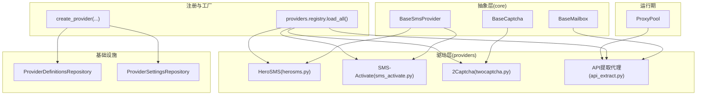
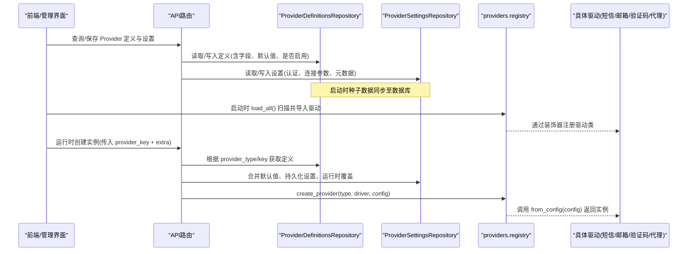
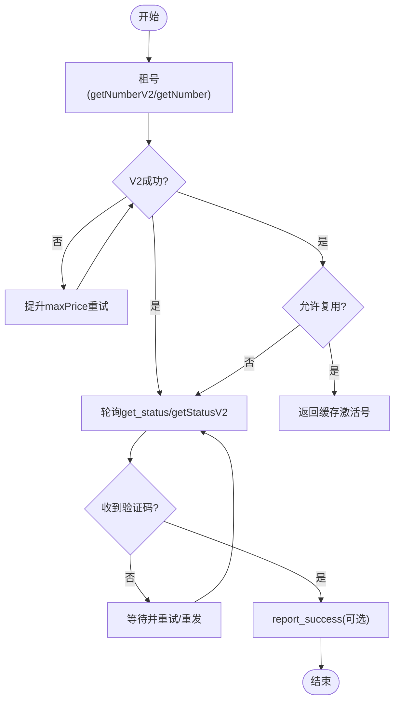
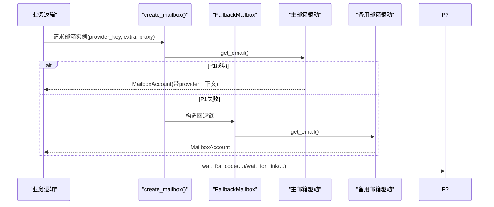
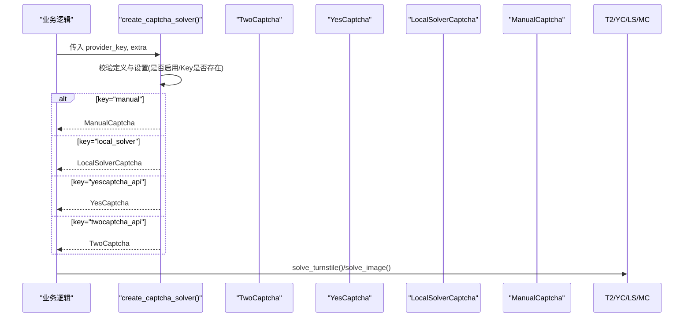
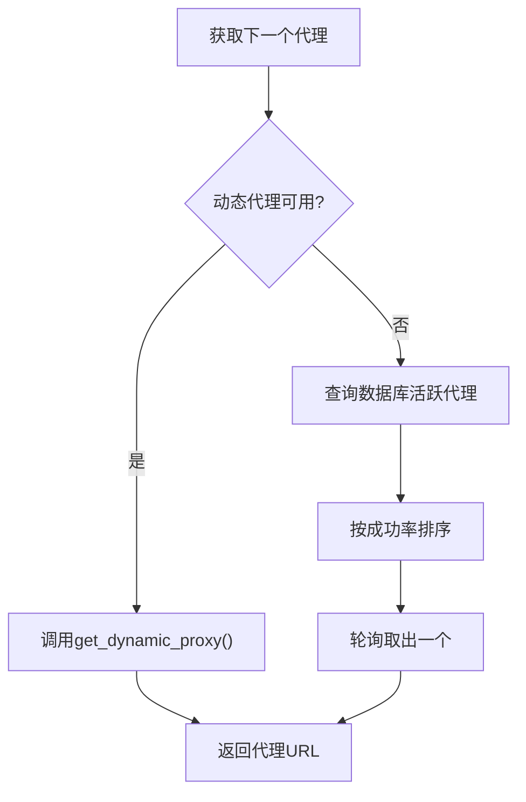
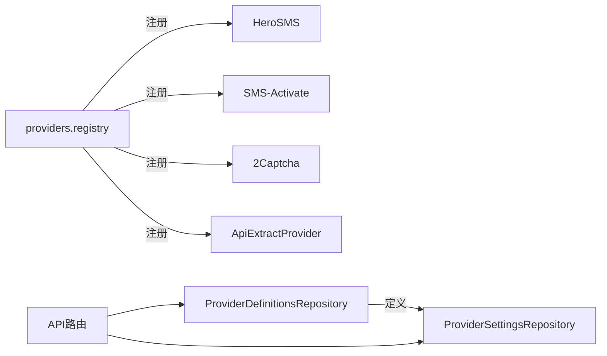

# 外部服务集成

<cite>
**本文引用的文件**
- [providers/registry.py](file://providers/registry.py)
- [core/base_sms.py](file://core/base_sms.py)
- [core/base_mailbox.py](file://core/base_mailbox.py)
- [core/base_captcha.py](file://core/base_captcha.py)
- [providers/sms/herosms.py](file://providers/sms/herosms.py)
- [providers/sms/sms_activate.py](file://providers/sms/sms_activate.py)
- [providers/captcha/twocaptcha.py](file://providers/captcha/twocaptcha.py)
- [providers/proxy/api_extract.py](file://providers/proxy/api_extract.py)
- [core/proxy_pool.py](file://core/proxy_pool.py)
- [infrastructure/provider_definitions_repository.py](file://infrastructure/provider_definitions_repository.py)
- [infrastructure/provider_settings_repository.py](file://infrastructure/provider_settings_repository.py)
- [api/provider_definitions.py](file://api/provider_definitions.py)
</cite>

## 目录
1. [简介](#简介)
2. [项目结构](#项目结构)
3. [核心组件](#核心组件)
4. [架构总览](#架构总览)
5. [详细组件分析](#详细组件分析)
6. [依赖关系分析](#依赖关系分析)
7. [性能考虑](#性能考虑)
8. [故障排查指南](#故障排查指南)
9. [结论](#结论)
10. [附录：自定义服务提供商开发指南](#附录自定义服务提供商开发指南)

## 简介
本文件系统性说明外部服务集成的架构与实现，覆盖提供商注册机制、动态加载原理，以及短信、临时邮箱、验证码解决、代理等第三方服务的配置、调用、错误处理与重试策略。同时提供自定义服务提供商的开发规范、接口约定、测试方法与监控优化建议，帮助开发者快速集成与管理各类外部服务。

## 项目结构
系统采用“能力抽象 + 驱动实现 + 统一注册”的分层设计：
- 抽象基类定义在 core 层（如 BaseSmsProvider、BaseMailbox、BaseCaptcha），明确对外能力边界。
- 具体驱动实现在 providers 层（如 herosms、sms_activate、twocaptcha、api_extract），通过装饰器注册到全局注册表。
- 运行时通过 infrastructure 层的 ProviderDefinitionsRepository/ProviderSettingsRepository 读取数据库中的“定义+设置”，结合运行时参数创建实例。
- API 层暴露管理端点用于维护 provider 定义与启用状态。

**图示来源**
- [providers/registry.py:70-91](file://providers/registry.py#L70-L91)
- [core/base_sms.py:28-66](file://core/base_sms.py#L28-L66)
- [core/base_mailbox.py:27-48](file://core/base_mailbox.py#L27-L48)
- [core/base_captcha.py:5-14](file://core/base_captcha.py#L5-L14)
- [providers/sms/herosms.py:10-18](file://providers/sms/herosms.py#L10-L18)
- [providers/sms/sms_activate.py:7-10](file://providers/sms/sms_activate.py#L7-L10)
- [providers/captcha/twocaptcha.py:6-17](file://providers/captcha/twocaptcha.py#L6-L17)
- [providers/proxy/api_extract.py:16-52](file://providers/proxy/api_extract.py#L16-L52)
- [core/proxy_pool.py:9-45](file://core/proxy_pool.py#L9-L45)

**章节来源**
- [providers/registry.py:1-91](file://providers/registry.py#L1-L91)
- [infrastructure/provider_definitions_repository.py:17-384](file://infrastructure/provider_definitions_repository.py#L17-L384)
- [infrastructure/provider_settings_repository.py:15-65](file://infrastructure/provider_settings_repository.py#L15-L65)

## 核心组件
- 统一注册表与动态加载：通过装饰器将驱动类注册到全局映射，启动时扫描并导入所有驱动模块，运行时按类型和驱动键创建实例。
- 短信服务抽象与实现：BaseSmsProvider 定义租号、取码、取消、上报成功等能力；HeroSMS 与 SMS-Activate 提供具体实现，包含号码复用、价格控制、状态轮询与重发策略。
- 临时邮箱抽象与实现：BaseMailbox 定义获取邮箱、等待验证码/链接、当前邮件ID集合等能力；内置多种邮箱驱动（Aitre、TempMail.lol、Web、Laoudo、本地微软池等）及回退策略。
- 验证码解决抽象与实现：BaseCaptcha 定义 Turnstile 和图片验证码求解接口；TwoCaptcha、YesCaptcha、本地求解器、人工打码等驱动通过注册表创建。
- 代理提供者与池：ApiExtractProvider 从 HTTP API 拉取代理列表；ProxyPool 优先使用动态代理，否则回退到静态池并按成功率轮询。

**章节来源**
- [core/base_sms.py:28-66](file://core/base_sms.py#L28-L66)
- [core/base_mailbox.py:27-48](file://core/base_mailbox.py#L27-L48)
- [core/base_captcha.py:5-14](file://core/base_captcha.py#L5-L14)
- [providers/proxy/api_extract.py:16-52](file://providers/proxy/api_extract.py#L16-L52)
- [core/proxy_pool.py:9-45](file://core/proxy_pool.py#L9-L45)

## 架构总览
下图展示从“定义+设置”到“运行时实例化”的完整链路，以及各外部服务如何被统一接入。

**图示来源**
- [api/provider_definitions.py:24-52](file://api/provider_definitions.py#L24-L52)
- [infrastructure/provider_definitions_repository.py:387-434](file://infrastructure/provider_definitions_repository.py#L387-L434)
- [infrastructure/provider_settings_repository.py:39-65](file://infrastructure/provider_settings_repository.py#L39-L65)
- [providers/registry.py:51-67](file://providers/registry.py#L51-L67)
- [providers/registry.py:70-91](file://providers/registry.py#L70-L91)

## 详细组件分析

### 短信服务提供商（HeroSMS、SMS-Activate）
- 能力模型：租号 get_number(service, country)、取码 get_code(activation_id, timeout)、取消 cancel(activation_id)、上报成功 report_success(activation_id)。
- HeroSMS：
  - 支持号码复用缓存（进程内+文件持久化）、自动选择最优国家（价格最低且库存充足）、动态 maxPrice 提升重试、V1/V2 接口兼容、事件去重与重发回调。
  - 关键流程：先尝试 V2 接口，失败或无号时提升 maxPrice 重试，再降级到 V1；取码轮询状态并解析多通道结果。
- SMS-Activate：
  - 简单直连 API，轮询 getStatus，遇到 WAIT_RETRY 主动 setStatus 触发上游重发，超时则取消。

**图示来源**
- [core/base_sms.py:136-181](file://core/base_sms.py#L136-L181)
- [core/base_sms.py:645-765](file://core/base_sms.py#L645-L765)
- [core/base_sms.py:767-800](file://core/base_sms.py#L767-L800)

**章节来源**
- [core/base_sms.py:28-66](file://core/base_sms.py#L28-L66)
- [core/base_sms.py:108-181](file://core/base_sms.py#L108-L181)
- [core/base_sms.py:328-800](file://core/base_sms.py#L328-L800)
- [providers/sms/herosms.py:10-18](file://providers/sms/herosms.py#L10-L18)
- [providers/sms/sms_activate.py:7-10](file://providers/sms/sms_activate.py#L7-L10)

### 临时邮箱服务（AITRE、TempMail、Laoudo、本地微软池等）
- 能力模型：get_email()、wait_for_code(account, keyword, timeout, before_ids, code_pattern)、wait_for_link(account, keyword, timeout, before_ids)、get_current_ids(account)。
- 回退机制：当主 provider 不可用时，按顺序尝试其他已启用的 mailbox 驱动，创建成功后固定使用该 provider 收件。
- 典型实现：
  - Aitre：poll 增量拉取新邮件，正则匹配验证码或提取验证链接。
  - TempMail.lol：创建 inbox，轮询 emails，支持代理。
  - Laoudo：基于固定账号与 token 拉取邮件列表，支持关键词过滤。
  - 本地微软池：通过 Microsoft Graph 或 IMAP 拉取，支持账号池与占用状态。

**图示来源**
- [core/base_mailbox.py:51-117](file://core/base_mailbox.py#L51-L117)
- [core/base_mailbox.py:289-347](file://core/base_mailbox.py#L289-L347)
- [core/base_mailbox.py:476-554](file://core/base_mailbox.py#L476-L554)
- [core/base_mailbox.py:557-651](file://core/base_mailbox.py#L557-L651)
- [core/base_mailbox.py:350-473](file://core/base_mailbox.py#L350-L473)

**章节来源**
- [core/base_mailbox.py:27-48](file://core/base_mailbox.py#L27-L48)
- [core/base_mailbox.py:51-117](file://core/base_mailbox.py#L51-L117)
- [core/base_mailbox.py:289-347](file://core/base_mailbox.py#L289-L347)
- [core/base_mailbox.py:476-554](file://core/base_mailbox.py#L476-L554)
- [core/base_mailbox.py:557-651](file://core/base_mailbox.py#L557-L651)
- [core/base_mailbox.py:350-473](file://core/base_mailbox.py#L350-L473)

### 验证码解决服务（2Captcha、YesCaptcha、本地求解器、人工）
- 能力模型：solve_turnstile(page_url, site_key) -> token；solve_image(image_b64) -> text（部分驱动）。
- TwoCaptcha：创建任务轮询结果，支持超时与错误处理。
- YesCaptcha/本地求解器/人工：通过 create_captcha_solver 按 provider_key 动态创建，未配置 Key 时抛出明确错误。

**图示来源**
- [core/base_captcha.py:67-97](file://core/base_captcha.py#L67-L97)
- [providers/captcha/twocaptcha.py:19-60](file://providers/captcha/twocaptcha.py#L19-L60)

**章节来源**
- [core/base_captcha.py:5-14](file://core/base_captcha.py#L5-L14)
- [core/base_captcha.py:67-97](file://core/base_captcha.py#L67-L97)
- [providers/captcha/twocaptcha.py:6-64](file://providers/captcha/twocaptcha.py#L6-L64)

### 代理服务（HTTP代理池）
- ApiExtractProvider：从 HTTP API 拉取代理列表（支持 JSON/文本行），标准化为协议URL，线程安全缓存与出队。
- ProxyPool：优先使用动态代理（若已配置启用），否则回退到数据库静态池，按成功率排序轮询；支持健康检查与自动禁用连续失败的代理。

**图示来源**
- [providers/proxy/api_extract.py:16-106](file://providers/proxy/api_extract.py#L16-L106)
- [core/proxy_pool.py:9-45](file://core/proxy_pool.py#L9-L45)

**章节来源**
- [providers/proxy/api_extract.py:16-106](file://providers/proxy/api_extract.py#L16-L106)
- [core/proxy_pool.py:9-91](file://core/proxy_pool.py#L9-L91)

## 依赖关系分析
- 驱动与注册表：各驱动模块通过 @register_provider 将自身注册到 providers.registry 的全局映射中；load_all() 在启动时扫描并导入，确保运行时可被 create_provider 找到。
- 定义与设置：ProviderDefinitionsRepository 维护 provider 的元数据（label、description、fields、enabled 等），ProviderSettingsRepository 管理用户配置（认证、连接参数、元数据），运行时合并默认值、持久化设置与覆盖参数。
- API 层：/provider-definitions 路由提供增删改查能力，便于前端管理 provider 定义与启用状态。

**图示来源**
- [providers/registry.py:28-67](file://providers/registry.py#L28-L67)
- [providers/sms/herosms.py:10-18](file://providers/sms/herosms.py#L10-L18)
- [providers/sms/sms_activate.py:7-10](file://providers/sms/sms_activate.py#L7-L10)
- [providers/captcha/twocaptcha.py:6-17](file://providers/captcha/twocaptcha.py#L6-L17)
- [providers/proxy/api_extract.py:16-52](file://providers/proxy/api_extract.py#L16-L52)
- [infrastructure/provider_definitions_repository.py:387-434](file://infrastructure/provider_definitions_repository.py#L387-L434)
- [infrastructure/provider_settings_repository.py:39-65](file://infrastructure/provider_settings_repository.py#L39-L65)
- [api/provider_definitions.py:24-52](file://api/provider_definitions.py#L24-L52)

**章节来源**
- [providers/registry.py:28-91](file://providers/registry.py#L28-L91)
- [infrastructure/provider_definitions_repository.py:387-434](file://infrastructure/provider_definitions_repository.py#L387-L434)
- [infrastructure/provider_settings_repository.py:39-65](file://infrastructure/provider_settings_repository.py#L39-L65)
- [api/provider_definitions.py:24-52](file://api/provider_definitions.py#L24-L52)

## 性能考虑
- 短信服务
  - HeroSMS 号码复用缓存减少重复租号开销；动态 maxPrice 提升提高成功率；事件去重避免重复提交相同验证码。
  - 轮询间隔合理（约3秒），超时后及时取消释放资源。
- 邮箱服务
  - 回退机制保证可用性；增量拉取（lastCheck）降低带宽；关键词过滤减少无效处理。
  - 浏览器驱动（Temp-Mail Web）使用线程隔离与限次重试应对 429。
- 验证码服务
  - 轮询间隔与最大尝试次数控制成本与延迟；未配置 Key 时快速失败。
- 代理服务
  - 动态代理优先，静态池按成功率排序；连续失败自动禁用，减少无效请求。

[本节为通用指导，不直接分析具体文件]

## 故障排查指南
- 常见错误与定位
  - “未注册的 provider”：确认 load_all() 已执行且驱动模块正确 import；检查 @register_provider 装饰器是否正确。
  - “缺少 from_config 类方法”：驱动需实现 from_config(config) 以支持统一工厂创建。
  - “Key 未配置”：captcha/mailbox/sms 等驱动在 create_*_solver/create_mailbox 时会校验必需字段，需在设置页配置。
  - “所有邮箱 provider 均创建失败”：检查 enabled 状态与 fallbacks 配置，查看每个 provider 初始化异常日志。
  - “代理获取失败”：检查动态代理 API 返回格式与网络连通性；静态池是否全量禁用。
- 日志与调试
  - 关注 providers.registry 加载警告；各驱动内部 try/except 捕获并记录异常；邮箱/短信轮询过程打印进度与错误。
- 恢复策略
  - 短信：超时自动取消；HeroSMS 支持重发与价格提升重试。
  - 邮箱：回退到其他 provider；Temp-Mail Web 对 429 指数退避重试。
  - 验证码：多 provider 顺序尝试；本地求解器作为兜底。
  - 代理：动态代理不可用回退静态池；连续失败自动禁用。

**章节来源**
- [providers/registry.py:51-67](file://providers/registry.py#L51-L67)
- [core/base_captcha.py:67-97](file://core/base_captcha.py#L67-L97)
- [core/base_mailbox.py:79-94](file://core/base_mailbox.py#L79-L94)
- [core/base_mailbox.py:718-772](file://core/base_mailbox.py#L718-L772)
- [core/base_sms.py:155-181](file://core/base_sms.py#L155-L181)
- [core/proxy_pool.py:47-91](file://core/proxy_pool.py#L47-L91)

## 结论
本系统通过统一的抽象与注册机制，将短信、邮箱、验证码、代理等外部服务解耦为可插拔驱动，配合数据库驱动的“定义+设置”模型，实现了灵活的配置管理与运行时动态加载。各驱动具备完善的错误处理与重试策略，保障高可用与稳定性。开发者可按规范快速扩展新的外部服务，并通过监控与优化手段持续提升整体性能与可靠性。

[本节为总结性内容，不直接分析具体文件]

## 附录：自定义服务提供商开发指南

### 接口规范
- 短信驱动
  - 继承 BaseSmsProvider，实现 get_number、get_code、cancel；可选实现 report_success、set_resend_callback、mark_code_failed、mark_send_failed、mark_send_succeeded、get_reuse_info。
  - 必须提供 from_config(cls, config) 类方法，用于从配置字典构建实例。
- 邮箱驱动
  - 继承 BaseMailbox，实现 get_email、wait_for_code、get_current_ids；可选实现 wait_for_link。
  - 通过 create_mailbox(provider_key, extra, proxy) 工厂创建，建议使用 MAILBOX_FACTORY_REGISTRY 注册工厂函数。
- 验证码驱动
  - 继承 BaseCaptcha，实现 solve_turnstile、solve_image（按需）。
  - 通过 create_captcha_solver(provider_key, extra) 创建，需实现 from_config 或直接构造。
- 代理驱动
  - 继承 BaseProxyProvider（由 core.proxy_providers 提供），实现 get_proxy；可通过 register_provider("proxy", driver_type) 注册。

**章节来源**
- [core/base_sms.py:28-66](file://core/base_sms.py#L28-L66)
- [core/base_mailbox.py:27-48](file://core/base_mailbox.py#L27-L48)
- [core/base_captcha.py:5-14](file://core/base_captcha.py#L5-L14)
- [providers/proxy/api_extract.py:16-52](file://providers/proxy/api_extract.py#L16-L52)
- [providers/registry.py:38-67](file://providers/registry.py#L38-L67)

### 实现示例要点
- 短信：参考 HeroSMS/SMS-Activate 的状态轮询、错误分支、重发与取消逻辑。
- 邮箱：参考 Aitre/TempMail/Laoudo 的轮询与正则匹配，注意超时与异常处理。
- 验证码：参考 TwoCaptcha 的任务创建与轮询，注意超时与错误码处理。
- 代理：参考 ApiExtractProvider 的 API 拉取与格式兼容（JSON/文本行），标准化输出。

**章节来源**
- [core/base_sms.py:136-181](file://core/base_sms.py#L136-L181)
- [core/base_sms.py:645-765](file://core/base_sms.py#L645-L765)
- [core/base_mailbox.py:476-554](file://core/base_mailbox.py#L476-L554)
- [core/base_mailbox.py:557-651](file://core/base_mailbox.py#L557-L651)
- [providers/captcha/twocaptcha.py:19-60](file://providers/captcha/twocaptcha.py#L19-L60)
- [providers/proxy/api_extract.py:54-106](file://providers/proxy/api_extract.py#L54-L106)

### 测试方法
- 单元测试
  - 针对 from_config 与关键方法（如 get_number/get_code/wait_for_code/solve_turnstile）进行断言。
  - 模拟外部 API 响应（requests/Camoufox 等）以覆盖成功、失败、超时、429 等分支。
- 集成测试
  - 使用真实或沙箱环境验证端到端流程（租号→收码→上报成功；创建邮箱→收验证码→提取链接）。
- 回归测试
  - 验证驱动注册与动态加载（load_all）是否正常；定义与设置变更后的行为一致性。

[本节为通用指导，不直接分析具体文件]

### 服务监控、性能优化与故障转移
- 监控指标
  - 短信：租号成功率、平均耗时、重发率、取消率；HeroSMS 号码复用命中与停止原因。
  - 邮箱：轮询次数、首次命中时间、关键词命中率、回退触发次数。
  - 验证码：任务创建成功率、平均耗时、错误分布。
  - 代理：动态代理命中率、静态池命中率、失败禁用次数。
- 性能优化
  - 短信：合理设置超时与轮询间隔；利用号码复用与价格策略；批量任务并发控制。
  - 邮箱：增量拉取、关键词过滤、浏览器驱动限流与重试退避。
  - 验证码：多 provider 并行/顺序尝试；本地求解器作为低延迟兜底。
  - 代理：动态优先、静态池按成功率排序；健康检查与自动剔除。
- 故障转移
  - 邮箱：回退到其他 provider；临时不可用时跳过或重试。
  - 短信：价格提升重试、状态重发、超时取消。
  - 验证码：多 provider 顺序尝试；未配置 Key 快速失败。
  - 代理：动态不可用回退静态池；连续失败自动禁用。

[本节为通用指导，不直接分析具体文件]