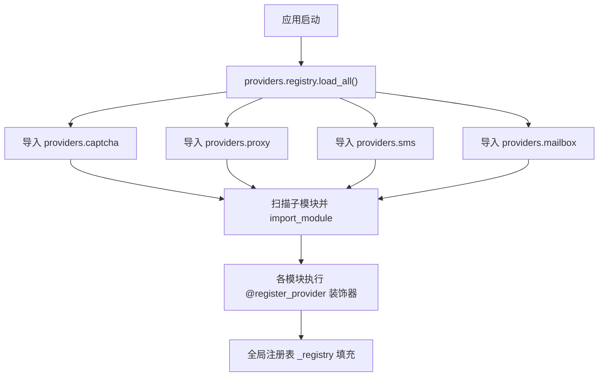
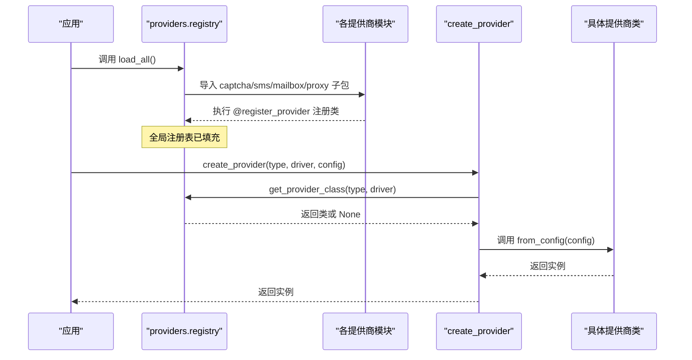
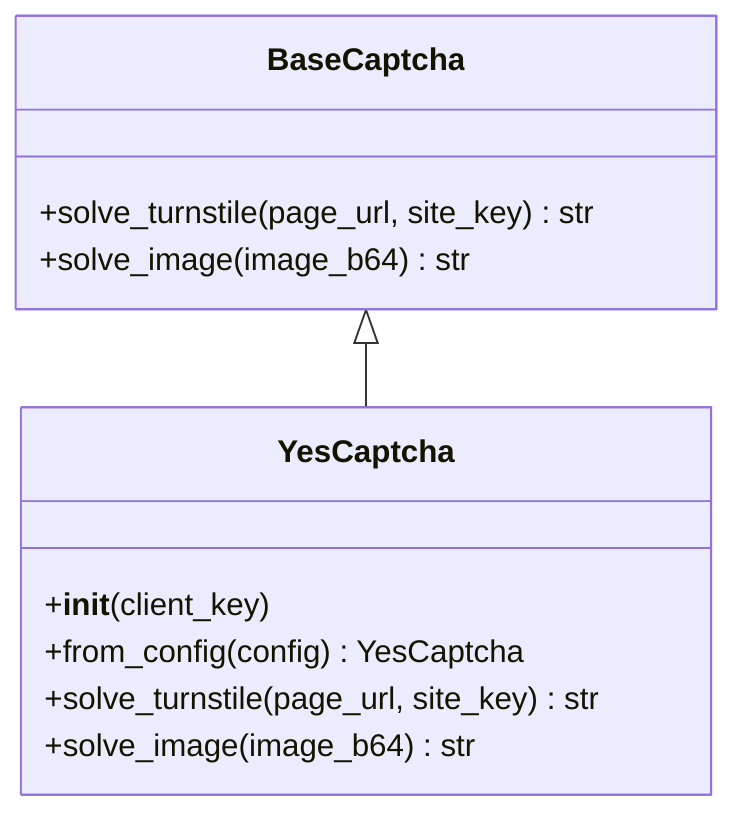
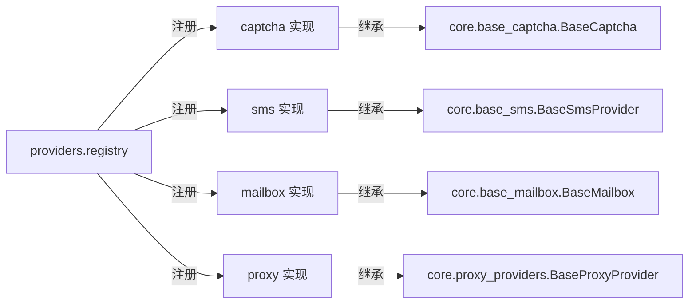

# 提供商注册机制

<cite>
**本文引用的文件**
- [providers/registry.py](file://providers/registry.py)
- [providers/__init__.py](file://providers/__init__.py)
- [providers/captcha/yescaptcha.py](file://providers/captcha/yescaptcha.py)
- [providers/sms/herosms.py](file://providers/sms/herosms.py)
- [providers/mailbox/tempmail_web.py](file://providers/mailbox/tempmail_web.py)
- [providers/proxy/api_extract.py](file://providers/proxy/api_extract.py)
- [core/base_captcha.py](file://core/base_captcha.py)
- [core/base_sms.py](file://core/base_sms.py)
- [core/base_mailbox.py](file://core/base_mailbox.py)
- [core/proxy_providers.py](file://core/proxy_providers.py)
</cite>

## 目录
1. [简介](#简介)
2. [项目结构](#项目结构)
3. [核心组件](#核心组件)
4. [架构总览](#架构总览)
5. [详细组件分析](#详细组件分析)
6. [依赖关系分析](#依赖关系分析)
7. [性能考虑](#性能考虑)
8. [故障排查指南](#故障排查指南)
9. [结论](#结论)
10. [附录：自定义提供商开发指南](#附录自定义提供商开发指南)

## 简介
本文件系统性说明“提供商注册机制”的实现原理与使用方法，覆盖以下要点：
- @register_provider 装饰器的工作原理
- 动态加载机制（load_all）如何扫描并导入所有提供商模块
- create_provider 工厂方法的实现逻辑（配置校验与实例创建）
- 邮箱、验证码、短信、代理四类提供商的注册与使用模式
- 自定义提供商的接口规范、必需方法与最佳实践
- 错误处理策略与调试技巧

## 项目结构
提供商插件体系集中在 providers 包下，按能力维度划分为 captcha、sms、mailbox、proxy 四个子包。每个具体实现通过统一注册入口将自身注入全局注册表；应用启动时调用 load_all() 完成自动发现与导入。

图表来源
- [providers/registry.py:70-90](file://providers/registry.py#L70-L90)

章节来源
- [providers/__init__.py:1-6](file://providers/__init__.py#L1-L6)
- [providers/registry.py:1-90](file://providers/registry.py#L1-L90)

## 核心组件
- 全局注册表：_registry 维护 provider_type -> driver_type -> class 的映射，支持 mailbox、captcha、sms、proxy 四类。
- 装饰器：@register_provider(provider_type, driver_type) 将类注册到对应类型与驱动键下。
- 工厂方法：create_provider(provider_type, driver_type, config) 负责查找类、校验 from_config 并创建实例。
- 动态加载：load_all() 在应用启动时扫描并导入各子包下的模块，触发装饰器执行。

章节来源
- [providers/registry.py:28-67](file://providers/registry.py#L28-L67)
- [providers/registry.py:70-90](file://providers/registry.py#L70-L90)

## 架构总览
下图展示了从启动到运行时创建的完整流程：启动阶段扫描导入模块，模块内装饰器将类注册进全局表；运行时通过 create_provider 根据配置创建具体实例。

图表来源
- [providers/registry.py:38-67](file://providers/registry.py#L38-L67)
- [providers/registry.py:70-90](file://providers/registry.py#L70-L90)

## 详细组件分析

### 装饰器 @register_provider
- 作用：将类以 (provider_type, driver_type) 为键注册到全局表。
- 行为：对任意被装饰的类生效，不改变类的继承关系与方法签名。
- 适用场景：任何需要纳入统一注册的提供商实现均可使用。

章节来源
- [providers/registry.py:38-43](file://providers/registry.py#L38-L43)

### 动态加载 load_all
- 扫描范围：providers.captcha、providers.proxy、providers.sms、providers.mailbox。
- 机制：使用 pkgutil.iter_modules 遍历子模块，再 importlib.import_module 导入，触发模块级装饰器执行。
- 健壮性：导入异常仅记录警告，不影响其他模块加载。
- 幂等：通过 _loaded 标志避免重复扫描。

章节来源
- [providers/registry.py:70-90](file://providers/registry.py#L70-L90)

### 工厂方法 create_provider
- 查找类：get_provider_class 基于 provider_type 与 driver_type 定位类。
- 校验：若未找到类抛出 ValueError；若类缺少 from_config 抛出 TypeError。
- 实例化：调用 from_config(config) 完成配置解析与对象构建。
- 返回值：返回具体提供商实例。

章节来源
- [providers/registry.py:46-62](file://providers/registry.py#L46-L62)

### 验证码提供商（captcha）
- 基类：BaseCaptcha 定义 solve_turnstile 与 solve_image 抽象方法。
- 示例：YesCaptcha 通过 @register_provider("captcha", "yescaptcha_api") 注册，并在 from_config 中校验 key。
- 使用：上层可通过 create_provider("captcha", "yescaptcha_api", config) 获取实例。

图表来源
- [core/base_captcha.py:5-14](file://core/base_captcha.py#L5-L14)
- [providers/captcha/yescaptcha.py:7-18](file://providers/captcha/yescaptcha.py#L7-L18)

章节来源
- [core/base_captcha.py:5-14](file://core/base_captcha.py#L5-L14)
- [providers/captcha/yescaptcha.py:1-43](file://providers/captcha/yescaptcha.py#L1-L43)

### 短信提供商（sms）
- 基类：BaseSmsProvider 定义 get_number、get_code、cancel 等核心方法。
- 示例：HeroSMS 通过 register_provider("sms", "herosms_api") 注册，复用 core.base_sms 中的实现。
- 使用：通过 create_provider("sms", "herosms_api", config) 获取实例。

章节来源
- [core/base_sms.py:28-70](file://core/base_sms.py#L28-L70)
- [providers/sms/herosms.py:10-18](file://providers/sms/herosms.py#L10-L18)

### 邮箱提供商（mailbox）
- 基类：BaseMailbox 定义 get_email、wait_for_code、get_current_ids 等。
- 示例：TempMailWebMailbox 通过 register_provider("mailbox", "tempmail_web_api") 注册。
- 使用：通过 create_provider("mailbox", "tempmail_web_api", config) 获取实例。

章节来源
- [core/base_mailbox.py:27-48](file://core/base_mailbox.py#L27-L48)
- [providers/mailbox/tempmail_web.py:1-6](file://providers/mailbox/tempmail_web.py#L1-L6)

### 代理提供商（proxy）
- 基类：BaseProxyProvider 定义 get_proxy 抽象方法。
- 示例：ApiExtractProvider 通过 register_provider("proxy", "api_extract") 注册，提供 from_config 解析 API URL 等参数。
- 使用：通过 create_provider("proxy", "api_extract", config) 获取实例。

章节来源
- [core/proxy_providers.py:20-27](file://core/proxy_providers.py#L20-L27)
- [providers/proxy/api_extract.py:16-52](file://providers/proxy/api_extract.py#L16-L52)

## 依赖关系分析
- 注册中心依赖：无外部强依赖，仅使用标准库 importlib、pkgutil、logging。
- 各提供商模块依赖：各自依赖第三方服务 SDK 或 HTTP 客户端，但通过统一注册表解耦。
- 基类约束：各提供商需遵循对应基类接口，确保一致性。

图表来源
- [providers/registry.py:28-43](file://providers/registry.py#L28-L43)
- [core/base_captcha.py:5-14](file://core/base_captcha.py#L5-L14)
- [core/base_sms.py:28-70](file://core/base_sms.py#L28-L70)
- [core/base_mailbox.py:27-48](file://core/base_mailbox.py#L27-L48)
- [core/proxy_providers.py:20-27](file://core/proxy_providers.py#L20-L27)

章节来源
- [providers/registry.py:28-43](file://providers/registry.py#L28-L43)
- [core/base_captcha.py:5-14](file://core/base_captcha.py#L5-L14)
- [core/base_sms.py:28-70](file://core/base_sms.py#L28-L70)
- [core/base_mailbox.py:27-48](file://core/base_mailbox.py#L27-L48)
- [core/proxy_providers.py:20-27](file://core/proxy_providers.py#L20-L27)

## 性能考虑
- 动态加载仅在启动时执行一次，后续通过注册表直接查找类，开销极低。
- 导入失败仅记录警告，避免单点故障影响整体加载。
- 工厂方法 create_provider 仅做字典查找与反射调用，时间复杂度 O(1)。
- 建议：将重型依赖延迟到 from_config 或方法内部按需导入，减少冷启动成本。

[本节为通用指导，无需特定文件来源]

## 故障排查指南
- 未注册 provider：create_provider 抛出 ValueError，检查是否已在模块中使用 @register_provider 且 load_all 已执行。
- 缺少 from_config：create_provider 抛出 TypeError，确保实现类提供该工厂方法。
- 动态加载失败：查看日志中的警告信息，确认模块可正常导入且无语法错误。
- 配置缺失：各提供商 in from_config 中对必要字段进行校验，如验证码 Key、代理 API URL 等，按提示补齐。

章节来源
- [providers/registry.py:51-62](file://providers/registry.py#L51-L62)
- [providers/registry.py:70-90](file://providers/registry.py#L70-L90)
- [providers/captcha/yescaptcha.py:13-18](file://providers/captcha/yescaptcha.py#L13-L18)
- [providers/proxy/api_extract.py:42-52](file://providers/proxy/api_extract.py#L42-L52)

## 结论
本注册机制通过统一的装饰器与工厂方法，实现了提供商的松耦合扩展与运行时快速装配。配合启动时的动态加载，新增提供商只需添加模块与装饰器即可被系统自动发现与使用。基类约束确保了不同提供商的一致接口，便于上层业务稳定调用。

[本节为总结性内容，无需特定文件来源]

## 附录：自定义提供商开发指南

### 接口规范
- 验证码：继承 BaseCaptcha，实现 solve_turnstile 与 solve_image。
- 短信：继承 BaseSmsProvider，实现 get_number、get_code、cancel。
- 邮箱：继承 BaseMailbox，实现 get_email、wait_for_code、get_current_ids。
- 代理：继承 BaseProxyProvider，实现 get_proxy。

章节来源
- [core/base_captcha.py:5-14](file://core/base_captcha.py#L5-L14)
- [core/base_sms.py:28-70](file://core/base_sms.py#L28-L70)
- [core/base_mailbox.py:27-48](file://core/base_mailbox.py#L27-L48)
- [core/proxy_providers.py:20-27](file://core/proxy_providers.py#L20-L27)

### 必需方法
- 工厂方法：必须提供 from_config(config) 类方法，用于解析配置并返回实例。
- 配置校验：在 from_config 中对必填字段进行校验，缺失时抛出明确异常。

章节来源
- [providers/registry.py:51-62](file://providers/registry.py#L51-L62)
- [providers/captcha/yescaptcha.py:13-18](file://providers/captcha/yescaptcha.py#L13-L18)
- [providers/proxy/api_extract.py:42-52](file://providers/proxy/api_extract.py#L42-L52)

### 注册与使用步骤
- 在提供商模块顶部使用 @register_provider("type", "driver") 装饰类。
- 在应用启动时调用 providers.registry.load_all() 完成自动发现。
- 运行时通过 create_provider("type", "driver", config) 获取实例。

章节来源
- [providers/registry.py:38-62](file://providers/registry.py#L38-L62)
- [providers/registry.py:70-90](file://providers/registry.py#L70-L90)

### 最佳实践
- 将第三方依赖延迟导入至 from_config 或方法体内，降低启动成本。
- 对网络请求设置合理超时与重试策略，提升稳定性。
- 对关键配置进行严格校验，给出清晰的错误信息。
- 保持 with 资源管理（如连接池、浏览器实例）的生命周期清晰。

[本节为通用指导，无需特定文件来源]