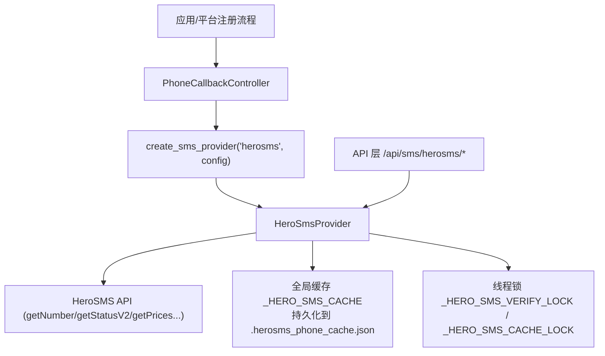
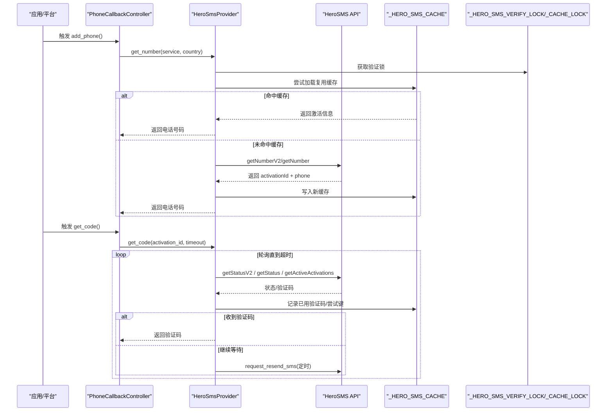
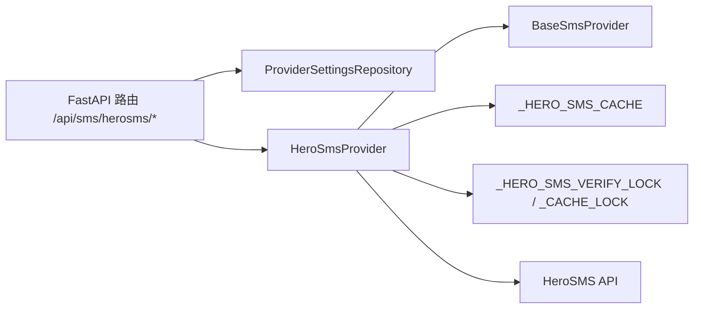

# Herosms短信服务

<cite>
**本文引用的文件**
- [providers/sms/herosms.py](file://providers/sms/herosms.py)
- [core/base_sms.py](file://core/base_sms.py)
- [api/sms.py](file://api/sms.py)
- [tests/test_herosms_api.py](file://tests/test_herosms_api.py)
- [tests/test_tasks_herosms.py](file://tests/test_tasks_herosms.py)
</cite>

## 目录
1. [简介](#简介)
2. [项目结构](#项目结构)
3. [核心组件](#核心组件)
4. [架构总览](#架构总览)
5. [详细组件分析](#详细组件分析)
6. [依赖关系分析](#依赖关系分析)
7. [性能与并发特性](#性能与并发特性)
8. [配置示例](#配置示例)
9. [使用示例](#使用示例)
10. [错误处理与重试](#错误处理与重试)
11. [常见问题排查](#常见问题排查)
12. [结论](#结论)

## 简介
本文件系统性介绍项目中对 HeroSMS 短信服务提供商的集成实现，重点说明 HeroSmsProvider 的核心能力：号码获取、验证码接收与状态查询；解释其与 base_sms 模块的关系，以及通过注册表机制接入系统的方式；提供完整的配置项说明（API Key、默认国家代码、服务参数等）；详解缓存机制（_HERO_SMS_CACHE）与锁机制（_HERO_SMS_VERIFY_LOCK）的工作原理；并给出错误处理策略、重试逻辑、超时配置、实际使用示例与常见问题解决方案。

## 项目结构
HeroSMS 相关代码主要分布在以下位置：
- providers/sms/herosms.py：将 HeroSmsProvider 暴露并通过注册表注册为“sms”类型的“herosms_api”提供者。
- core/base_sms.py：包含 BaseSmsProvider 抽象类、HeroSmsProvider 完整实现、PhoneCallbackController、工厂方法 create_sms_provider 等核心逻辑。
- api/sms.py：提供 HTTP API 端点，用于查询余额、国家、服务、价格、最优国家等，便于前端或外部调用。
- tests/*：覆盖 HeroSMS 的配置选项、余额接口校验、任务解析流程等。

图表来源
- [core/base_sms.py:328-1266](file://core/base_sms.py#L328-L1266)
- [api/sms.py:1-215](file://api/sms.py#L1-L215)
- [providers/sms/herosms.py:1-19](file://providers/sms/herosms.py#L1-L19)

章节来源
- [providers/sms/herosms.py:1-19](file://providers/sms/herosms.py#L1-L19)
- [core/base_sms.py:1-1266](file://core/base_sms.py#L1-L1266)
- [api/sms.py:1-215](file://api/sms.py#L1-L215)

## 核心组件
- BaseSmsProvider：定义统一的接码服务抽象接口（get_number、get_code、cancel、report_success 等）。
- HeroSmsProvider：基于 HeroSMS API 的具体实现，支持号码复用、去重、自动选国、动态定价、轮询等待验证码、状态查询等。
- PhoneCallbackController：封装浏览器注册流程中的手机号回调生命周期，协调 get_number 与 get_code，并在成功/失败时进行收尾。
- create_sms_provider：根据 provider_key 和配置创建具体 Provider 实例（支持 herosms、herosms_api、smsbower 等）。
- 注册入口：providers/sms/herosms.py 通过 register_provider("sms", "herosms_api")(HeroSmsProvider) 完成注册。

章节来源
- [core/base_sms.py:28-71](file://core/base_sms.py#L28-L71)
- [core/base_sms.py:328-1266](file://core/base_sms.py#L328-L1266)
- [providers/sms/herosms.py:10-18](file://providers/sms/herosms.py#L10-L18)

## 架构总览
下图展示了从上层调用到 Provider 实现的完整链路，包括缓存与锁的使用、HTTP 请求与状态轮询。

图表来源
- [core/base_sms.py:725-923](file://core/base_sms.py#L725-L923)
- [core/base_sms.py:845-912](file://core/base_sms.py#L845-L912)
- [core/base_sms.py:588-634](file://core/base_sms.py#L588-L634)

## 详细组件分析

### HeroSmsProvider 核心功能
- 号码获取（get_number）
  - 优先尝试复用缓存中的号码（受生命周期与成功次数限制）。
  - 若未命中，则调用 getNumberV2，必要时回退到 getNumber。
  - 动态计算 maxPrice，确保拿到物理号码而非虚拟号。
  - 将新号码写入缓存并返回 SmsActivation。
- 验证码接收（get_code / wait_for_code）
  - 多源轮询：优先 getStatusV2，其次 getStatus，最后 getActiveActivations。
  - 去重机制：基于 sms_key 与 used_codes 避免重复提交同一验证码。
  - 自动重发：在等待过程中定时调用 request_resend_sms，并可触发上层 resend 回调。
  - 超时控制：默认超时可调整，且会考虑缓存剩余生命周期。
- 状态查询（get_status / get_status_v2 / get_active_activations）
  - 统一解析不同响应格式，兼容文本与 JSON。
  - 标准化状态字段，便于上层判断 ok/wait_code/cancel 等。
- 取消与完成（cancel_activation / finish_activation）
  - 优先调用专用接口，失败时回退到 setStatus。
  - 成功后清理缓存或标记停止复用。

章节来源
- [core/base_sms.py:328-1025](file://core/base_sms.py#L328-L1025)

### 与 base_sms 模块的关系
- HeroSmsProvider 继承自 BaseSmsProvider，遵循统一接口契约。
- PhoneCallbackController 封装了 get_number 与 get_code 的生命周期管理，并与 HeroSMS 的全局锁配合，保证并发安全。
- create_sms_provider 负责按 provider_key 构造具体 Provider，支持 herosms、herosms_api、smsbower 等。

章节来源
- [core/base_sms.py:28-71](file://core/base_sms.py#L28-L71)
- [core/base_sms.py:1063-1100](file://core/base_sms.py#L1063-L1100)
- [core/base_sms.py:1103-1266](file://core/base_sms.py#L1103-L1266)

### 注册表机制集成
- providers/sms/herosms.py 仅做轻量导入与注册，将 HeroSmsProvider 以 key “herosms_api” 注册到“sms”类型下。
- 这样 load_all() 即可发现并使用该 Provider。

章节来源
- [providers/sms/herosms.py:1-19](file://providers/sms/herosms.py#L1-L19)

### 缓存机制（_HERO_SMS_CACHE）
- 作用：跨调用复用同一号码，减少频繁租号成本，提升成功率。
- 存储：进程内全局变量 + 持久化文件 .herosms_phone_cache.json。
- 生命周期：默认 HERO_SMS_PHONE_LIFETIME 秒后失效。
- 复用限制：
  - phone_success_max：达到最大成功次数后停止复用。
  - reuse_stopped：遇到异常、拒绝、接近过期等情况主动停止。
- 去重：
  - used_codes：记录已使用的验证码，防止重复提交。
  - attempted_sms_keys：基于事件内容生成的唯一键，避免重复处理相同事件。
- 并发：通过 _HERO_SMS_CACHE_LOCK 保护读写。

章节来源
- [core/base_sms.py:188-204](file://core/base_sms.py#L188-L204)
- [core/base_sms.py:588-634](file://core/base_sms.py#L588-L634)
- [core/base_sms.py:968-982](file://core/base_sms.py#L968-L982)

### 锁机制（_HERO_SMS_VERIFY_LOCK）
- 作用：确保同一时间只有一个验证流程在进行，避免并发冲突导致的状态不一致。
- 使用场景：
  - PhoneCallbackController 在进入 add_phone 阶段获取锁，完成后释放。
  - HeroSmsProvider.get_number 内部也使用该锁包裹缓存读取与号码获取。
- 注意：当自动选择国家失败并回退到默认国家时，需正确释放锁。

章节来源
- [core/base_sms.py:192-193](file://core/base_sms.py#L192-L193)
- [core/base_sms.py:725-765](file://core/base_sms.py#L725-L765)
- [core/base_sms.py:1124-1178](file://core/base_sms.py#L1124-L1178)

### 自动选国与价格策略
- get_best_country：基于 getTopCountriesByServiceRank 或 getPrices 数据，筛选满足库存与价格条件的国家。
- get_top_countries：优先使用排名接口，降级到全量解析。
- 动态 maxPrice：根据实际价格计算，确保拿到物理号码。

章节来源
- [core/base_sms.py:419-579](file://core/base_sms.py#L419-L579)
- [core/base_sms.py:645-711](file://core/base_sms.py#L645-L711)

## 依赖关系分析
- 对外部服务的依赖：HeroSMS API（getNumber/getStatusV2/getPrices/getCountries/getServicesList 等）。
- 内部依赖：
  - BaseSmsProvider：统一接口。
  - PhoneCallbackController：生命周期管理。
  - create_sms_provider：工厂模式。
  - 全局缓存与锁：并发与复用保障。
- API 层依赖：
  - /api/sms/herosms/* 端点通过 ProviderSettingsRepository 读取保存的配置，并构造 HeroSmsProvider 实例。

图表来源
- [api/sms.py:1-215](file://api/sms.py#L1-L215)
- [core/base_sms.py:328-1266](file://core/base_sms.py#L328-L1266)

章节来源
- [api/sms.py:1-215](file://api/sms.py#L1-L215)
- [core/base_sms.py:328-1266](file://core/base_sms.py#L328-L1266)

## 性能与并发特性
- 并发安全：通过 RLock/RLock 级别的锁保护关键路径，避免竞态条件。
- 轮询优化：wait_for_code 采用多源轮询与去重，减少无效请求。
- 缓存复用：显著降低重复租号开销，提高整体吞吐。
- 超时控制：get_code 默认超时可调，结合缓存剩余生命周期延长等待。
- 网络超时：_request 默认超时 30 秒，可按需调整。

[本节为通用性能讨论，不直接分析具体文件]

## 配置示例
以下为常见配置项及含义（适用于 ProviderSettingsRepository 保存的配置）：
- herosms_api_key：HeroSMS API 密钥（必填）。
- sms_service：服务代码，如 OpenAI 常用“dr”。
- sms_country：国家代码，如“187”（美国）、“52”（泰国）等。
- herosms_max_price：最大价格上限（可选），用于限制租号成本。
- sms_proxy/proxy：代理地址（可选），支持 http/https。
- register_reuse_phone_to_max：是否允许号码复用至最大次数（布尔）。
- register_phone_extra_max/register_phone_success_max：最大成功次数（整数）。
- herosms_auto_country：是否启用自动选国（布尔）。
- herosms_auto_country_min_stock：自动选国的最低库存阈值（整数）。
- herosms_auto_country_max_price：自动选国的最高价格限制（浮点数）。

说明：
- 上述配置可通过前端设置页或后端 API 保存到 ProviderSettingsRepository。
- API 层会从保存的配置中读取 herosms_api_key、sms_service、sms_country 等，并构造 Provider。

章节来源
- [api/sms.py:19-45](file://api/sms.py#L19-L45)
- [core/base_sms.py:1074-1086](file://core/base_sms.py#L1074-L1086)

## 使用示例
- 通过 API 查询余额：
  - POST /api/sms/herosms/balance，请求体包含 api_key（可选，若未配置则从保存配置读取）。
  - 返回 balance 字段。
- 通过 API 查询国家与服务：
  - GET /api/sms/herosms/countries
  - GET /api/sms/herosms/services?country=...
- 通过 API 查询价格与最优国家：
  - POST /api/sms/herosms/prices
  - POST /api/sms/herosms/top-countries
  - POST /api/sms/herosms/best-country

- 在注册流程中使用：
  - 使用 PhoneCallbackController 包装 add_phone 与 get_code。
  - 自动处理锁、缓存、重发、超时与清理。

章节来源
- [api/sms.py:48-147](file://api/sms.py#L48-L147)
- [core/base_sms.py:1103-1266](file://core/base_sms.py#L1103-L1266)
- [tests/test_herosms_api.py:14-27](file://tests/test_herosms_api.py#L14-L27)
- [tests/test_tasks_herosms.py:7-42](file://tests/test_tasks_herosms.py#L7-L42)

## 错误处理与重试
- 错误分类：
  - 无可用号码：NO_NUMBERS，可能触发提高 maxPrice 重试。
  - 余额不足：NO_BALANCE，需充值。
  - 访问受限：getCountries 返回 No access，需检查权限。
  - 未知响应：解析失败时记录日志并降级。
- 重试策略：
  - getNumberV2 失败且 NO_NUMBERS 时，若用户设置了 maxPrice，则提高 maxPrice 重试一次。
  - wait_for_code 中定时调用 request_resend_sms，并可触发上层 resend 回调。
- 超时配置：
  - get_code 默认超时 120 秒，可根据业务调整。
  - _request 默认超时 30 秒。
- 清理与释放：
  - cancel_activation/finish_activation 优先调用专用接口，失败时回退到 setStatus。
  - 清理缓存：在取消或完成时清除缓存，避免脏数据。

章节来源
- [core/base_sms.py:645-711](file://core/base_sms.py#L645-L711)
- [core/base_sms.py:812-843](file://core/base_sms.py#L812-L843)
- [core/base_sms.py:845-912](file://core/base_sms.py#L845-L912)
- [core/base_sms.py:925-966](file://core/base_sms.py#L925-L966)

## 常见问题排查
- 问题：未收到验证码
  - 检查超时设置是否过短，适当增加 get_code 超时。
  - 查看日志中是否有 getStatusV2 失败降级提示。
  - 确认 request_resend_sms 是否被触发，必要时手动重发。
- 问题：号码被拒绝或已达上限
  - mark_send_failed 会检测关键词并停止复用，检查原因并调整国家或服务。
- 问题：缓存未生效
  - 检查 _HERO_SMS_CACHE 是否被清空或过期。
  - 确认 phone_success_max 是否已达到上限。
- 问题：自动选国失败
  - 检查 get_top_countries 返回是否为空或无库存。
  - 回退到默认国家重试。

章节来源
- [core/base_sms.py:845-912](file://core/base_sms.py#L845-L912)
- [core/base_sms.py:996-1008](file://core/base_sms.py#L996-L1008)
- [core/base_sms.py:527-579](file://core/base_sms.py#L527-L579)

## 结论
HeroSmsProvider 提供了健壮的接码能力，涵盖号码获取、验证码接收、状态查询、自动选国、价格策略、缓存复用与并发安全等关键特性。通过 base_sms 的统一抽象与注册表机制，系统能够灵活扩展多种接码服务。结合 API 层与前端工具，用户可以方便地查询余额、价格与最优国家，并在注册流程中无缝集成。建议在生产环境中合理配置超时、代理与价格上限，并监控缓存与锁的使用情况，以获得最佳稳定性与性能。

[本节为总结性内容，不直接分析具体文件]