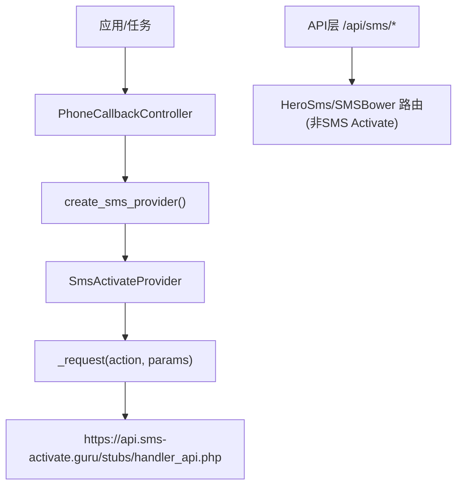
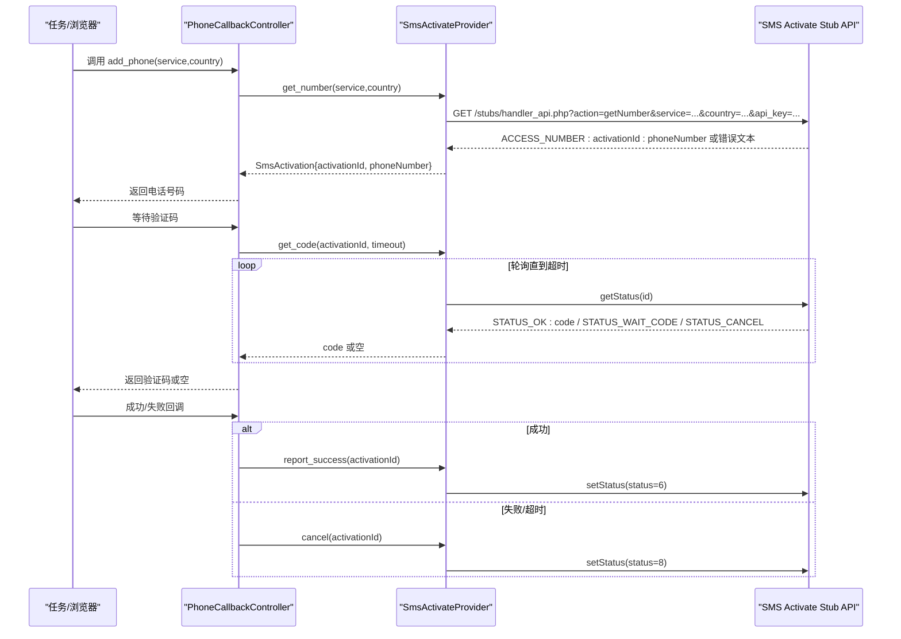
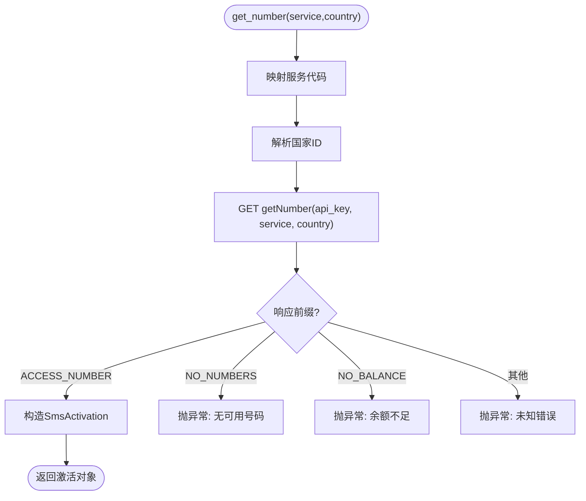
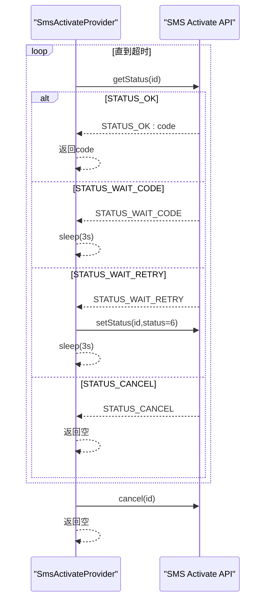
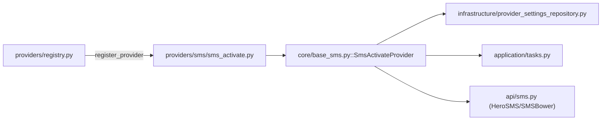

# SMS Activate服务

<cite>
**本文引用的文件**
- [providers/sms/sms_activate.py](file://providers/sms/sms_activate.py)
- [core/base_sms.py](file://core/base_sms.py)
- [api/sms.py](file://api/sms.py)
- [infrastructure/provider_settings_repository.py](file://infrastructure/provider_settings_repository.py)
- [application/tasks.py](file://application/tasks.py)
- [core/registration/helpers.py](file://core/registration/helpers.py)
- [providers/registry.py](file://providers/registry.py)
</cite>

## 目录
1. [简介](#简介)
2. [项目结构](#项目结构)
3. [核心组件](#核心组件)
4. [架构总览](#架构总览)
5. [详细组件分析](#详细组件分析)
6. [依赖关系分析](#依赖关系分析)
7. [性能考虑](#性能考虑)
8. [故障排查指南](#故障排查指南)
9. [结论](#结论)
10. [附录：配置与调用示例](#附录配置与调用示例)

## 简介
本文件面向使用 SMS Activate 短信服务提供商的集成与运维场景，系统说明该服务在本项目中的实现方式、API 调用流程（号码请求、验证码获取、号码释放）、认证机制与密钥配置方法、参数配置（服务类型、国家代码、价格范围过滤）、响应数据格式解析与错误码处理，以及性能优化建议（连接池、并发控制）和实际调用示例与故障排查要点。

## 项目结构
SMS Activate 的实现位于 providers/sms 与 core/base_sms 中，并通过统一的 provider registry 注册为“sms”类型的驱动；上层通过 API 路由暴露查询能力，任务执行时通过 PhoneCallbackController 完成“租号—等码—成功/取消”的完整生命周期。

图表来源
- [core/base_sms.py:108-181](file://core/base_sms.py#L108-L181)
- [providers/sms/sms_activate.py:1-11](file://providers/sms/sms_activate.py#L1-L11)
- [api/sms.py:1-215](file://api/sms.py#L1-L215)

章节来源
- [providers/sms/sms_activate.py:1-11](file://providers/sms/sms_activate.py#L1-L11)
- [core/base_sms.py:108-181](file://core/base_sms.py#L108-L181)
- [api/sms.py:1-215](file://api/sms.py#L1-L215)

## 核心组件
- SmsActivation：表示一次手机号租用会话，包含 activation_id、phone_number、country 及扩展元数据。
- BaseSmsProvider：抽象基类，定义 get_number/get_code/cancel/report_success 等统一接口。
- SmsActivateProvider：SMS Activate 的具体实现，封装与官方 stub API 的交互。
- PhoneCallbackController：编排“租号—等码—成功/取消”的生命周期，并支持自动国家选择与重试策略（对 HeroSMS/SMSBower 更丰富）。
- ProviderSettingsRepository：从持久化存储加载 provider 配置与认证信息，合并运行时覆盖。
- API 路由：当前 /api/sms/* 主要暴露 HeroSMS/SMSBower 能力；SMS Activate 主要通过内部调用与任务流程使用。

章节来源
- [core/base_sms.py:19-71](file://core/base_sms.py#L19-L71)
- [core/base_sms.py:108-181](file://core/base_sms.py#L108-L181)
- [core/base_sms.py:1103-1266](file://core/base_sms.py#L1103-L1266)
- [infrastructure/provider_settings_repository.py:39-55](file://infrastructure/provider_settings_repository.py#L39-L55)
- [api/sms.py:1-215](file://api/sms.py#L1-L215)

## 架构总览
下图展示了从任务到 SMS Activate 接口的端到端调用链，包括认证、参数组装、HTTP 请求与响应解析。

图表来源
- [core/base_sms.py:136-181](file://core/base_sms.py#L136-L181)
- [core/base_sms.py:1103-1266](file://core/base_sms.py#L1103-L1266)

## 详细组件分析

### SMS Activate 提供商实现
- 基础 URL：https://api.sms-activate.guru/stubs/handler_api.php
- 认证：所有请求均附带 api_key 参数。
- 常用 action：
  - getBalance：查询余额，期望返回以 ACCESS_BALANCE: 开头的文本。
  - getNumber：申请号码，期望返回 ACCESS_NUMBER:activationId:phoneNumber。
  - getStatus：查询验证码状态，可能返回 STATUS_OK:code、STATUS_WAIT_CODE、STATUS_WAIT_RETRY、STATUS_CANCEL。
  - setStatus：设置状态，如 status=6 标记成功，status=8 取消号码。
- 服务与国家映射：内置服务代码与国家 ID 映射表，支持按服务名与国家代码解析。
- 错误处理：对 NO_NUMBERS、NO_BALANCE 等特定响应进行明确异常提示；其他未知响应抛出运行时异常。

图表来源
- [core/base_sms.py:77-106](file://core/base_sms.py#L77-L106)
- [core/base_sms.py:136-153](file://core/base_sms.py#L136-L153)

章节来源
- [core/base_sms.py:77-106](file://core/base_sms.py#L77-L106)
- [core/base_sms.py:108-181](file://core/base_sms.py#L108-L181)

### 验证码获取流程
- 轮询策略：在超时时间内循环调用 getStatus，遇到 STATUS_WAIT_CODE 则休眠后继续；遇到 STATUS_WAIT_RETRY 会先调用 setStatus 触发重发再等待；遇到 STATUS_CANCEL 视为取消。
- 超时处理：若超时未收到验证码，主动调用 cancel 释放号码并返回空字符串。

图表来源
- [core/base_sms.py:155-177](file://core/base_sms.py#L155-L177)

章节来源
- [core/base_sms.py:155-177](file://core/base_sms.py#L155-L177)

### 号码释放与成功上报
- 释放号码：调用 setStatus(status=8)，返回中包含 ACCESS 即认为成功。
- 成功上报：调用 setStatus(status=6)，用于标记验证码已使用成功。

章节来源
- [core/base_sms.py:175-181](file://core/base_sms.py#L175-L181)

### 配置与认证
- 认证字段：sms_activate_api_key（或兼容字段 sms_activate_api_key），由 create_sms_provider 读取并校验。
- 默认国家：可通过 sms_activate_country 或 sms_activate_default_country 指定，未设置时回退到默认值。
- 代理：支持 sms_proxy 或 proxy 传入，作为 HTTP 代理。
- 配置来源：
  - 全局默认 provider 与运行时覆盖：ProviderSettingsRepository.resolve_runtime_settings 合并定义默认值、持久化配置与任务级覆盖。
  - 任务上下文：application/tasks 与 core/registration/helpers 负责解析 provider_key 与 settings。

章节来源
- [core/base_sms.py:1063-1073](file://core/base_sms.py#L1063-L1073)
- [infrastructure/provider_settings_repository.py:39-55](file://infrastructure/provider_settings_repository.py#L39-L55)
- [application/tasks.py:602-614](file://application/tasks.py#L602-L614)
- [core/registration/helpers.py:79-116](file://core/registration/helpers.py#L79-L116)

### 服务类型、国家代码与价格范围
- 服务类型：SMS Activate 使用内置映射将平台名映射到服务代码（如 cursor→ot、chatgpt/openai→dr、google→go、microsoft→mg）。
- 国家代码：支持 ISO 短码（ru/us/uk/in/id/ph/th/br）或直接数字 ID；未匹配时回退到默认。
- 价格范围过滤：SMS Activate 实现未提供价格过滤参数；如需价格筛选可参考同模块的 HeroSMS/SMSBower 实现（get_prices、max_price、get_top_countries、get_best_country）。

章节来源
- [core/base_sms.py:77-96](file://core/base_sms.py#L77-L96)
- [core/base_sms.py:99-106](file://core/base_sms.py#L99-L106)
- [core/base_sms.py:419-579](file://core/base_sms.py#L419-L579)

### 响应数据格式解析与错误码
- 余额查询：ACCESS_BALANCE:<金额>；否则抛出异常。
- 号码申请：ACCESS_NUMBER:<activationId>:<phoneNumber>；常见错误：NO_NUMBERS、NO_BALANCE。
- 验证码状态：STATUS_OK:<code>、STATUS_WAIT_CODE、STATUS_WAIT_RETRY、STATUS_CANCEL。
- 状态设置：返回包含 ACCESS 即认为成功。

章节来源
- [core/base_sms.py:130-181](file://core/base_sms.py#L130-L181)

### 与上层任务的集成
- PhoneCallbackController 负责：
  - 首次调用返回电话号码（租号）。
  - 第二次调用等待验证码（轮询）。
  - 成功时上报成功，失败或清理时释放号码。
- 自动国家选择：对 HeroSMS/SMSBower 有效；SMS Activate 仅使用配置的默认国家或任务覆盖。

章节来源
- [core/base_sms.py:1103-1266](file://core/base_sms.py#L1103-L1266)

## 依赖关系分析
- 注册机制：providers/sms/sms_activate.py 通过 register_provider("sms", "sms_activate_api") 将 SmsActivateProvider 注册到全局 registry。
- 工厂创建：create_sms_provider 根据 provider_key 实例化具体提供商，注入 api_key、default_country、proxy 等。
- 配置仓库：ProviderSettingsRepository 负责从定义与持久化配置中合并出最终运行配置。
- API 路由：当前 /api/sms/* 主要暴露 HeroSMS/SMSBower 能力；SMS Activate 通过内部调用参与任务流程。

图表来源
- [providers/registry.py:38-62](file://providers/registry.py#L38-L62)
- [providers/sms/sms_activate.py:1-11](file://providers/sms/sms_activate.py#L1-L11)
- [core/base_sms.py:1063-1100](file://core/base_sms.py#L1063-L1100)
- [infrastructure/provider_settings_repository.py:39-55](file://infrastructure/provider_settings_repository.py#L39-L55)
- [api/sms.py:1-215](file://api/sms.py#L1-L215)

章节来源
- [providers/registry.py:1-91](file://providers/registry.py#L1-L91)
- [providers/sms/sms_activate.py:1-11](file://providers/sms/sms_activate.py#L1-L11)
- [core/base_sms.py:1063-1100](file://core/base_sms.py#L1063-L1100)
- [infrastructure/provider_settings_repository.py:39-55](file://infrastructure/provider_settings_repository.py#L39-L55)
- [api/sms.py:1-215](file://api/sms.py#L1-L215)

## 性能考虑
- 连接复用：requests 库默认启用连接复用；在高并发场景建议结合连接池配置（如使用 requests.Session 或第三方 HTTP 客户端）以减少握手开销。
- 并发控制：
  - SMS Activate 实现本身无全局锁；但同模块的 HeroSMS 实现了线程锁保护缓存与复用逻辑，避免竞争条件。
  - 对于高并发验证码轮询，建议在业务层限制并发度，避免对上游造成压力。
- 轮询间隔：当前实现采用固定休眠（约3秒），可根据网络状况与服务稳定性调整。
- 超时设置：请求超时为 20 秒，可根据部署环境调优。
- 代理与重试：通过 proxy 参数支持出站代理；可在业务层增加重试与退避策略。

[本节为通用性能建议，不直接分析具体文件]

## 故障排查指南
- 无法获取号码：
  - 检查余额是否充足（getBalance）。
  - 检查服务代码与国家 ID 是否正确映射。
  - 关注 NO_NUMBERS 错误，尝试更换国家或服务。
- 未收到验证码：
  - 确认 getStatus 轮询正常，注意 STATUS_WAIT_RETRY 需要触发重发。
  - 检查超时时间是否过短。
- 号码释放失败：
  - 检查 setStatus(status=8) 返回值是否包含 ACCESS。
- 认证失败：
  - 确认 sms_activate_api_key 已正确配置且未被覆盖为空。
- 日志定位：
  - 查看 PhoneCallbackController 输出日志，确认阶段（need_number/need_code/done）。
  - 检查 ProviderSettingsRepository 合并后的配置是否正确。

章节来源
- [core/base_sms.py:130-181](file://core/base_sms.py#L130-L181)
- [core/base_sms.py:1103-1266](file://core/base_sms.py#L1103-L1266)
- [infrastructure/provider_settings_repository.py:39-55](file://infrastructure/provider_settings_repository.py#L39-L55)

## 结论
本项目对 SMS Activate 的集成以轻量、稳定的方式实现：通过统一抽象基类与提供商注册机制，屏蔽底层差异；通过 PhoneCallbackController 管理号码生命周期；通过配置仓库集中管理认证与参数。尽管 SMS Activate 实现未提供价格过滤与智能国家选择（这些能力在 HeroSMS/SMSBower 中更完善），但其满足基本的号码申请、验证码获取与释放需求。生产环境中建议结合连接池、并发控制与合理的超时/重试策略，以获得更好的稳定性与吞吐。

[本节为总结性内容，不直接分析具体文件]

## 附录：配置与调用示例

### 配置项说明
- 认证
  - sms_activate_api_key：必填，用于访问 SMS Activate API。
- 行为
  - sms_activate_country / sms_activate_default_country：默认国家代码或 ID。
  - sms_proxy / proxy：出站代理地址。
- 任务覆盖
  - 任务参数可覆盖默认 provider_key 与配置项，优先级高于全局默认。

章节来源
- [core/base_sms.py:1063-1073](file://core/base_sms.py#L1063-L1073)
- [infrastructure/provider_settings_repository.py:39-55](file://infrastructure/provider_settings_repository.py#L39-L55)
- [application/tasks.py:602-614](file://application/tasks.py#L602-L614)

### 典型调用流程（伪代码路径）
- 租号：调用 PhoneCallbackController.__call__，内部调用 SmsActivateProvider.get_number。
- 等码：再次调用 __call__，内部调用 SmsActivateProvider.get_code。
- 成功：调用 report_success，内部调用 setStatus(status=6)。
- 失败/清理：调用 cancel，内部调用 setStatus(status=8)。

章节来源
- [core/base_sms.py:1103-1266](file://core/base_sms.py#L1103-L1266)
- [core/base_sms.py:136-181](file://core/base_sms.py#L136-L181)

### 与 API 层的交互
- 当前 /api/sms/* 主要暴露 HeroSMS/SMSBower 的查询能力（国家、服务、余额、价格、最优国家等）。
- SMS Activate 主要通过内部调用参与任务流程；如需对外暴露其能力，可参照现有路由模式新增对应端点。

章节来源
- [api/sms.py:1-215](file://api/sms.py#L1-L215)