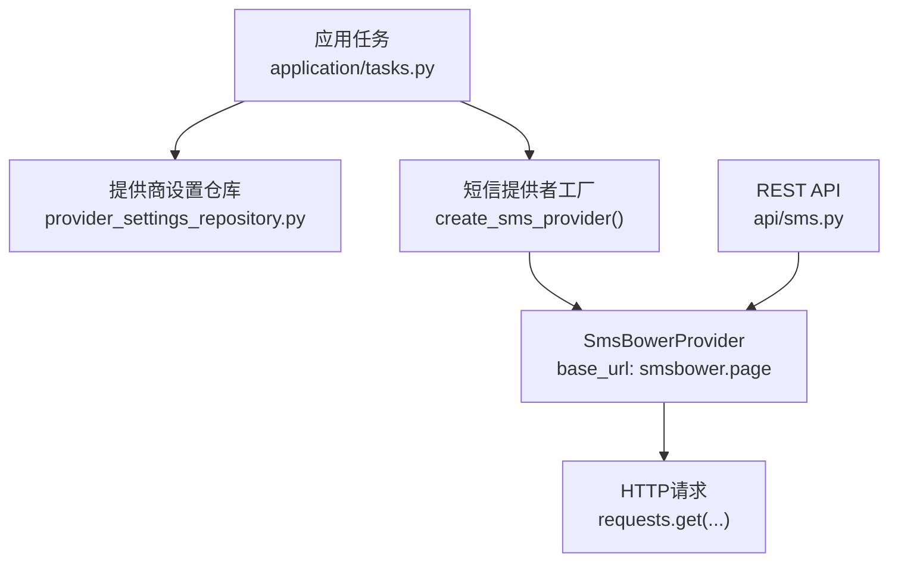
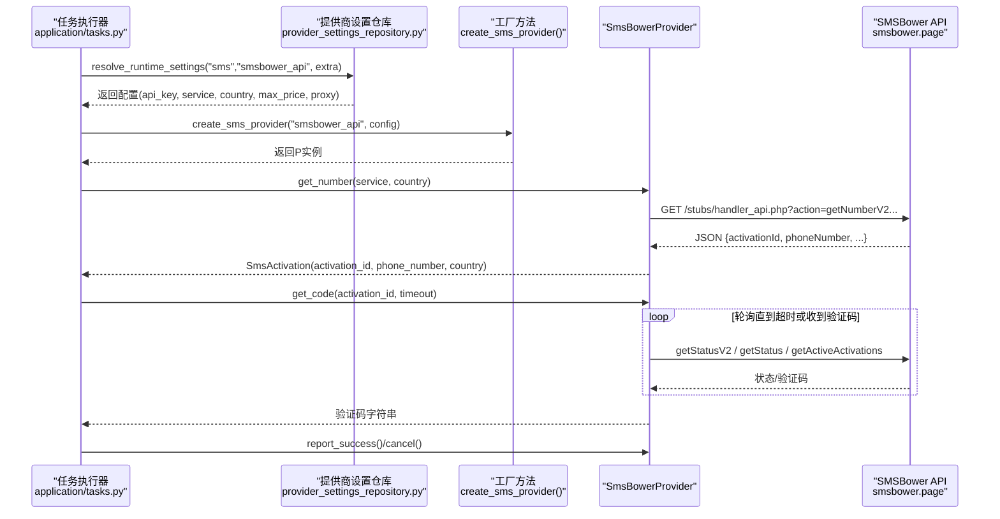
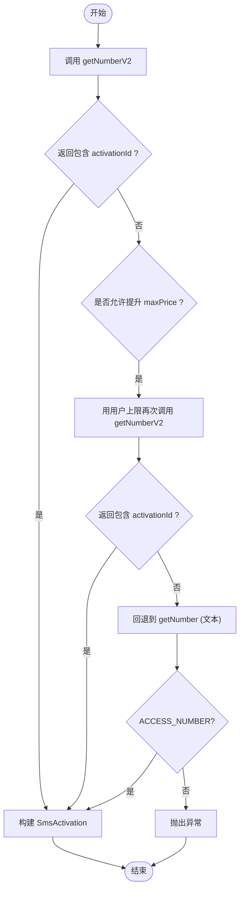
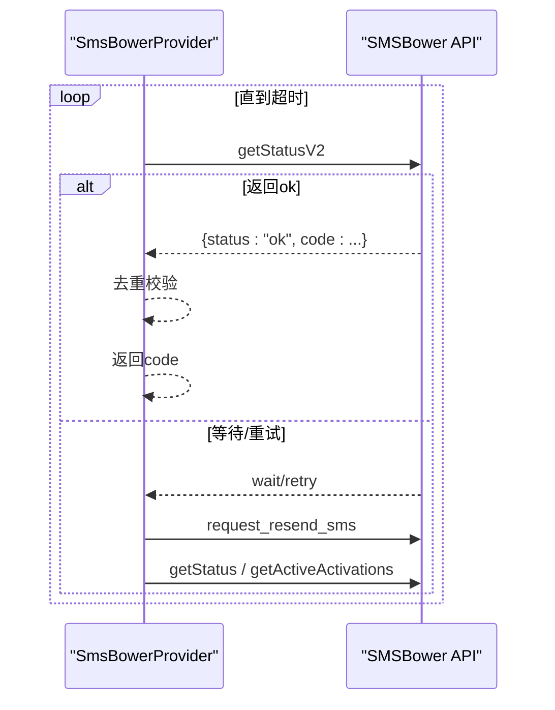
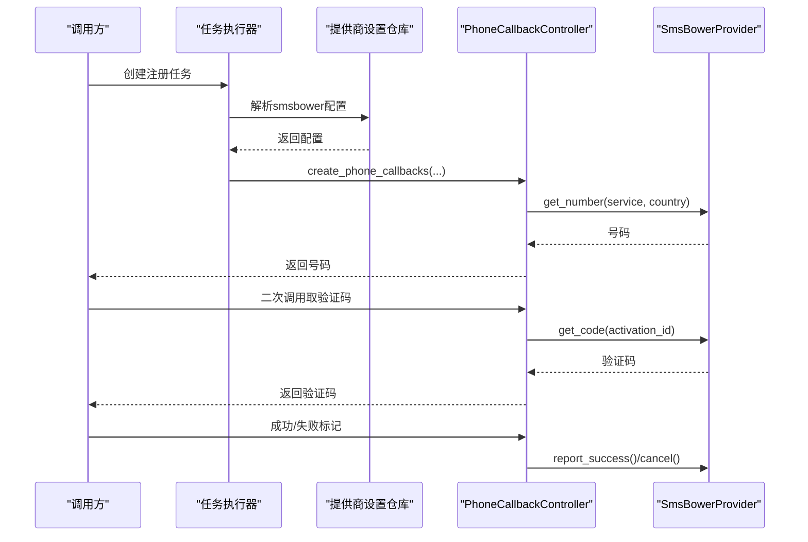
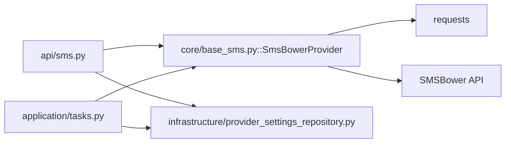

# SmsBower服务

<cite>
**本文引用的文件**
- [providers/sms/smsbower.py](file://providers/sms/smsbower.py)
- [core/base_sms.py](file://core/base_sms.py)
- [api/sms.py](file://api/sms.py)
- [application/tasks.py](file://application/tasks.py)
- [infrastructure/provider_settings_repository.py](file://infrastructure/provider_settings_repository.py)
- [tests/test_sms_provider.py](file://tests/test_sms_provider.py)
</cite>

## 目录
1. [简介](#简介)
2. [项目结构](#项目结构)
3. [核心组件](#核心组件)
4. [架构总览](#架构总览)
5. [详细组件分析](#详细组件分析)
6. [依赖关系分析](#依赖关系分析)
7. [性能与可用性](#性能与可用性)
8. [故障排查指南](#故障排查指南)
9. [结论](#结论)
10. [附录：配置参数与API参考](#附录：配置参数与api参考)

## 简介
本文件系统性说明项目中SmsBower短信服务提供商的集成实现，覆盖API调用流程、数据结构、认证方式、配置参数、号码获取、验证码轮询、任务管理、错误处理与异常恢复策略，并给出成功/失败场景的使用示例。同时对比与其他短信服务的差异与优势。

## 项目结构
SmsBower在系统中的集成由三层组成：
- 提供者注册层：将SmsBower以“sms”类型、“smsbower_api”键注册到统一提供商注册表，便于通过工厂方法创建实例。
- 提供者实现层：继承通用HeroSMS实现，仅替换Base URL为SMSBower端点，复用全部能力（国家/服务查询、价格、余额、号码获取、验证码轮询、取消/完成等）。
- API与任务编排层：提供REST接口暴露国家/服务/余额/价格查询；任务执行时按配置选择SmsBower作为接码服务，驱动号码租用与验证码等待。

图表来源
- [core/base_sms.py:1028-1040](file://core/base_sms.py#L1028-L1040)
- [api/sms.py:152-215](file://api/sms.py#L152-L215)
- [infrastructure/provider_settings_repository.py:39-55](file://infrastructure/provider_settings_repository.py#L39-L55)

章节来源
- [providers/sms/smsbower.py:1-10](file://providers/sms/smsbower.py#L1-L10)
- [core/base_sms.py:1028-1040](file://core/base_sms.py#L1028-L1040)
- [api/sms.py:152-215](file://api/sms.py#L152-L215)
- [infrastructure/provider_settings_repository.py:39-55](file://infrastructure/provider_settings_repository.py#L39-L55)

## 核心组件
- SmsActivation：表示一次手机号租用会话，包含activation_id、phone_number、country和metadata。
- BaseSmsProvider：抽象基类，定义get_number/get_code/cancel/report_success等标准接口。
- HeroSmsProvider：完整实现HeroSMS/SMS-Activate兼容API，包括号码获取（V2优先）、验证码轮询（多源合并去重）、自动重试、缓存复用、价格/国家/服务查询、余额查询等。
- SmsBowerProvider：继承HeroSmsProvider，仅覆盖BASE_URL为SMSBower端点，并重写_request使所有接口均携带api_key。
- PhoneCallbackController：封装“先租号后取码”的生命周期，支持智能国家选择、回调重试、成功标记与清理释放。
- 任务编排：application/tasks.py负责创建/调度任务，并在注册流程中解析并注入SmsBower配置。

章节来源
- [core/base_sms.py:19-71](file://core/base_sms.py#L19-L71)
- [core/base_sms.py:328-1026](file://core/base_sms.py#L328-L1026)
- [core/base_sms.py:1028-1040](file://core/base_sms.py#L1028-L1040)
- [core/base_sms.py:1103-1266](file://core/base_sms.py#L1103-L1266)
- [application/tasks.py:598-614](file://application/tasks.py#L598-L614)

## 架构总览
下图展示从任务触发到SmsBower API调用的端到端流程，以及关键状态流转。

图表来源
- [core/base_sms.py:645-765](file://core/base_sms.py#L645-L765)
- [core/base_sms.py:845-923](file://core/base_sms.py#L845-L923)
- [core/base_sms.py:1028-1040](file://core/base_sms.py#L1028-L1040)
- [application/tasks.py:598-614](file://application/tasks.py#L598-L614)

## 详细组件分析

### 认证与API密钥配置
- 认证方式：所有对SMSBower的HTTP请求均需携带api_key。SmsBowerProvider在_request中强制附加api_key，即使对于通常不需要key的接口（如国家/服务列表）也一并带上。
- 配置来源：
  - REST API侧：/sms/smsbower/* 接口通过 ProviderSettingsRepository.resolve_runtime_settings("sms", "smsbower_api") 读取持久化配置，支持覆盖字段 api_key、service、country、max_price、proxy。
  - 任务侧：_resolve_sms_provider_for_task 会读取extra中的sms_provider/sms_activate_api_key等，结合默认提供商键与运行时设置构造Provider实例。
- 工厂方法：create_sms_provider支持provider_key为"smsbower"或"smsbower_api"，并映射到SmsBowerProvider。

章节来源
- [core/base_sms.py:1028-1040](file://core/base_sms.py#L1028-L1040)
- [core/base_sms.py:1087-1099](file://core/base_sms.py#L1087-L1099)
- [api/sms.py:152-166](file://api/sms.py#L152-L166)
- [application/tasks.py:598-614](file://application/tasks.py#L598-L614)
- [infrastructure/provider_settings_repository.py:39-55](file://infrastructure/provider_settings_repository.py#L39-L55)

### 数据结构定义
- SmsActivation：包含activation_id、phone_number、country、metadata。用于承载一次号码租用的上下文。
- 号码信息：来自SMSBower的JSON响应包含activationId、phoneNumber、countryPhoneCode、activationCost等，内部会规范化为+前缀的电话号码。
- 验证码候选：wait_for_code聚合多个数据源（getStatusV2、getStatus、getActiveActivations），标准化为{status, code, source, sms_key, sms_time, sms_text, allow_same_code}，并通过去重避免重复提交无效验证码。

章节来源
- [core/base_sms.py:19-26](file://core/base_sms.py#L19-L26)
- [core/base_sms.py:713-724](file://core/base_sms.py#L713-L724)
- [core/base_sms.py:767-804](file://core/base_sms.py#L767-L804)
- [core/base_sms.py:845-923](file://core/base_sms.py#L845-L923)

### 号码获取流程
- 优先使用getNumberV2（JSON），若失败则回退到getNumber（文本）。
- 动态价格策略：根据当前国家/服务实际价格计算effective_max_price，确保分配到真实号码而非虚拟号；当NO_NUMBERS且用户设置了max_price上限时，会尝试提升到该上限再重试。
- 号码复用：支持短生命周期复用同一号码（可配置reuse_phone_to_max与phone_success_max），减少重复租号成本。

图表来源
- [core/base_sms.py:645-711](file://core/base_sms.py#L645-L711)
- [core/base_sms.py:725-765](file://core/base_sms.py#L725-L765)

章节来源
- [core/base_sms.py:645-765](file://core/base_sms.py#L645-L765)

### 验证码轮询与去重
- 多源合并：优先使用getStatusV2，其次getStatus，最后扫描getActiveActivations。任一渠道返回有效验证码即视为成功。
- 去重机制：基于activation_id与code及事件字段生成唯一sms_key，记录attempted_sms_keys与used_codes，避免重复提交相同验证码。
- 自动重试：超过一定时间未收到验证码时，主动请求上游重发（request_resend_sms），并可触发外部回调（如OpenAI重发）。

图表来源
- [core/base_sms.py:845-923](file://core/base_sms.py#L845-L923)

章节来源
- [core/base_sms.py:845-923](file://core/base_sms.py#L845-L923)

### 任务管理与集成
- 任务创建：create_register_task创建注册任务，设置进度与结果种子。
- 任务执行：execute_task根据任务类型分发处理器；注册任务中解析SMS提供商配置（_resolve_sms_provider_for_task），构造平台实例并执行注册。
- 回调控制：PhoneCallbackController封装“需要号码→需要验证码→成功/取消”的状态机，支持智能国家选择、失败回退、清理释放。

图表来源
- [application/tasks.py:174-240](file://application/tasks.py#L174-L240)
- [application/tasks.py:598-614](file://application/tasks.py#L598-L614)
- [core/base_sms.py:1103-1266](file://core/base_sms.py#L1103-L1266)

章节来源
- [application/tasks.py:174-240](file://application/tasks.py#L174-L240)
- [application/tasks.py:598-614](file://application/tasks.py#L598-L614)
- [core/base_sms.py:1103-1266](file://core/base_sms.py#L1103-L1266)

### 错误处理与异常恢复
- 网络与协议错误：_request统一raise_for_status；V2失败时回退到V1；多次状态查询失败时降级到active列表扫描。
- 业务错误：
  - NO_NUMBERS：在允许范围内提升maxPrice重试；仍失败则抛错。
  - STATUS_WAIT_RETRY：设置状态为重试并继续轮询。
  - STATUS_CANCEL：终止等待并返回空码。
- 资源释放：cleanup时若未完成则调用cancel释放号码；若已接收验证码但未显式成功，且provider非auto_report_success_on_code，则在cleanup中补报成功。
- 限制与保护：当检测到“已达上限/Too many”等关键词时停止号码复用，避免持续浪费。

章节来源
- [core/base_sms.py:645-711](file://core/base_sms.py#L645-L711)
- [core/base_sms.py:845-923](file://core/base_sms.py#L845-L923)
- [core/base_sms.py:983-1008](file://core/base_sms.py#L983-L1008)
- [core/base_sms.py:1233-1246](file://core/base_sms.py#L1233-L1246)

### 与其他短信服务的差异化与优势
- 与SMS-Activate/HeroSMS的差异：
  - SMSBowerProvider仅改变BASE_URL为smsbower.page，其余逻辑完全复用HeroSMS实现，具备相同的V2优先、多源验证码聚合、自动重试、价格优化与号码复用能力。
  - 对SMS-Activate Provider（独立实现）而言，其接口与行为不同（文本协议、固定BASE_URL），而SMSBower走JSON/V2路径，更稳定高效。
- 优势特点：
  - 智能国家选择与价格上限：可按库存与价格筛选最优国家，降低失败率与成本。
  - 号码复用与去重：短生命周期复用同一号码，减少重复租号；验证码去重避免无效重试。
  - 强一致性与容错：多源状态查询、自动重发、失败回退与资源释放保障高可用。

章节来源
- [core/base_sms.py:1028-1040](file://core/base_sms.py#L1028-L1040)
- [core/base_sms.py:419-579](file://core/base_sms.py#L419-L579)
- [core/base_sms.py:845-923](file://core/base_sms.py#L845-L923)

## 依赖关系分析
- 模块耦合：
  - SmsBowerProvider依赖requests进行HTTP通信，依赖全局锁与缓存（同HeroSMS）保证并发安全与复用。
  - API路由依赖ProviderSettingsRepository读取配置，解耦硬编码。
  - 任务编排依赖工厂方法与PhoneCallbackController，屏蔽具体提供商细节。
- 外部依赖：
  - SMSBower HTTP API（smsbower.page/stubs/handler_api.php）。
  - 可选代理配置（proxies）。

图表来源
- [api/sms.py:152-215](file://api/sms.py#L152-L215)
- [core/base_sms.py:1028-1040](file://core/base_sms.py#L1028-L1040)
- [infrastructure/provider_settings_repository.py:39-55](file://infrastructure/provider_settings_repository.py#L39-L55)
- [application/tasks.py:598-614](file://application/tasks.py#L598-L614)

章节来源
- [api/sms.py:152-215](file://api/sms.py#L152-L215)
- [core/base_sms.py:1028-1040](file://core/base_sms.py#L1028-L1040)
- [infrastructure/provider_settings_repository.py:39-55](file://infrastructure/provider_settings_repository.py#L39-L55)
- [application/tasks.py:598-614](file://application/tasks.py#L598-L614)

## 性能与可用性
- 并发与锁：HeroSmsProvider使用线程锁保护号码复用缓存与验证阶段，避免竞态条件。
- 轮询间隔：默认每3秒轮询一次，兼顾实时性与服务器压力。
- 超时与重试：get_code支持超时控制；长时间无码时自动请求重发；V2失败回退V1。
- 价格优化：动态计算maxPrice，提高获得真实号码的概率，减少失败重试开销。
- 缓存复用：短生命周期内复用号码，显著降低成本与等待时间。

[本节为通用指导，不直接分析具体文件]

## 故障排查指南
- 常见问题与定位：
  - 未配置API Key：API路由会在缺少api_key时返回明确错误；检查ProviderSettingsRepository中smsbower_api的配置项。
  - 无可用号码：检查国家/服务映射与库存；可启用智能国家选择或放宽max_price。
  - 验证码迟迟不到：确认是否被拦截或延迟；系统会自动重发；检查代理与网络连通性。
  - 号码被拒绝/达到上限：系统会停止复用并记录原因；建议更换国家或服务。
- 日志与追踪：
  - PhoneCallbackController输出关键步骤日志（租号、取码、成功/取消）。
  - 任务执行器记录事件与错误详情，便于回溯。

章节来源
- [api/sms.py:191-215](file://api/sms.py#L191-L215)
- [core/base_sms.py:1103-1266](file://core/base_sms.py#L1103-L1266)
- [application/tasks.py:371-458](file://application/tasks.py#L371-L458)

## 结论
SmsBower在本项目中以最小改动接入（仅替换BASE_URL），全面复用HeroSMS的高可用能力：V2优先、多源验证码聚合、自动重发、价格优化与号码复用。通过统一的提供商设置与任务编排，实现了灵活、健壮、易扩展的短信验证码解决方案。

[本节为总结，不直接分析具体文件]

## 附录：配置参数与API参考

### 配置参数（SMSBower）
- 提供商键：smsbower_api（或smsbower）
- 必需参数：
  - smsbower_api_key：API密钥（所有接口均需）
- 可选参数：
  - sms_service / smsbower_service：目标服务代码（如dr/openai等）
  - sms_country / smsbower_country：国家ID或名称
  - smsbower_max_price：价格上限（用于动态maxPrice策略）
  - sms_proxy / proxy：代理地址
  - register_reuse_phone_to_max：是否启用号码复用
  - register_phone_extra_max / register_phone_success_max：复用次数上限
  - smsbower_auto_country / herosms_auto_country：是否启用智能国家选择
  - smsbower_auto_country_min_stock / herosms_auto_country_min_stock：最低库存阈值
  - smsbower_auto_country_max_price / herosms_auto_country_max_price：最高价格限制

章节来源
- [core/base_sms.py:1087-1099](file://core/base_sms.py#L1087-L1099)
- [api/sms.py:152-166](file://api/sms.py#L152-L166)
- [core/base_sms.py:1131-1150](file://core/base_sms.py#L1131-L1150)

### REST API（SMSBower）
- GET /sms/smsbower/countries：获取支持的国家列表（需api_key）
- GET /sms/smsbower/services?country=xx：获取支持的服务列表（需api_key）
- POST /sms/smsbower/balance：查询余额（需api_key）
- POST /sms/smsbower/prices：查询价格（service/country可选）

章节来源
- [api/sms.py:169-215](file://api/sms.py#L169-L215)

### 使用示例（成功与失败场景）
- 成功场景：
  - 配置smsbower_api_key与sms_service/sms_country，调用POST /sms/smsbower/balance验证连通性。
  - 任务执行时，PhoneCallbackController自动租号并轮询验证码，成功后report_success释放号码。
- 失败场景：
  - 未配置api_key：API返回明确错误，提示未配置。
  - 无可用号码：系统可能提升maxPrice重试；仍失败则抛错，建议调整国家或服务。
  - 验证码未到达：系统自动重发；若仍失败，检查代理与网络，必要时更换国家。

章节来源
- [api/sms.py:191-215](file://api/sms.py#L191-L215)
- [core/base_sms.py:645-711](file://core/base_sms.py#L645-L711)
- [core/base_sms.py:845-923](file://core/base_sms.py#L845-L923)
- [tests/test_sms_provider.py:42-76](file://tests/test_sms_provider.py#L42-L76)